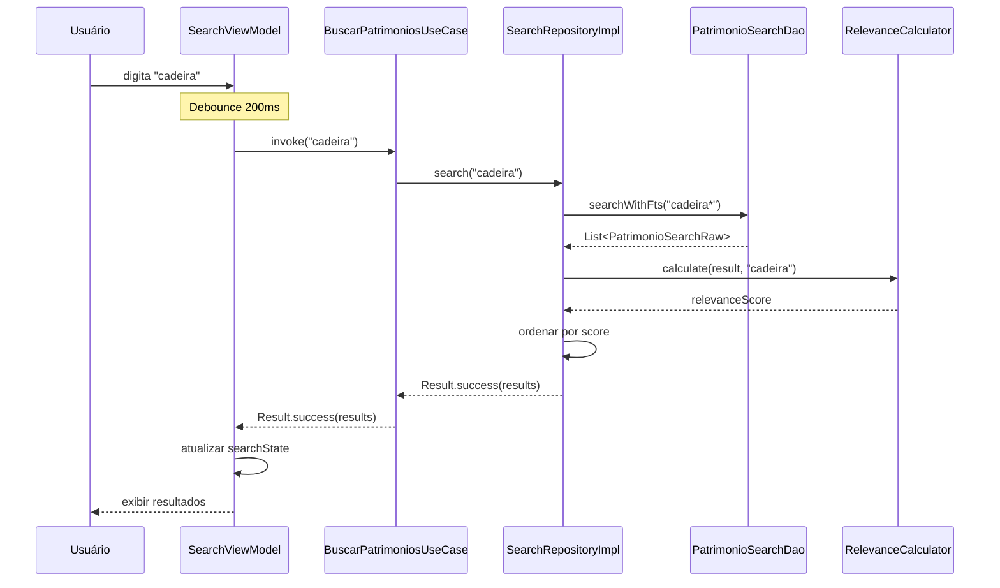

# Design Técnico - Busca Global Inteligente

## Overview

A feature de Busca Global Inteligente implementa um sistema de busca unificado e otimizado para o aplicativo Android de inventário patrimonial. O sistema permite aos usuários encontrar rapidamente qualquer patrimônio através de múltiplos critérios (número, descrição, sala, responsável) em uma única interface, com suporte a autocomplete, histórico de buscas, filtros rápidos e funcionamento offline.

### Objetivos Principais

1. **Busca Unificada**: Eliminar a necessidade de múltiplas telas de busca especializadas
2. **Performance**: Resposta em menos de 300ms para bases com até 10.000 patrimônios
3. **Offline-First**: Funcionar completamente sem conexão de rede
4. **UX Otimizada**: Autocomplete, histórico e sugestões contextuais
5. **Escalabilidade**: Suportar até 50.000 patrimônios sem degradação

### Decisões de Design Chave

1. **Room FTS4**: Utilizar Full-Text Search nativo do SQLite para performance
2. **Debounce**: Aguardar 200ms após última digitação antes de buscar
3. **Índices Compostos**: Otimizar queries multi-campo
4. **Cache em Memória**: LRU cache para sugestões frequentes
5. **Algoritmo de Relevância**: Pontuação baseada em tipo e posição da correspondência


## Architecture

A arquitetura segue Clean Architecture + MVVM, conforme padrão estabelecido no projeto, com três camadas principais:

### Camadas

```
┌─────────────────────────────────────────────────────────────┐
│                 Presentation Layer                           │
│  - SearchFragment (UI)                                       │
│  - SearchViewModel (gerencia estado)                         │
│  - SearchState (sealed class)                                │
│  - SearchResultAdapter (RecyclerView)                        │
└──────────────────────┬──────────────────────────────────────┘
                       │ usa Use Cases
                       ▼
┌─────────────────────────────────────────────────────────────┐
│                   Domain Layer                               │
│  - BuscarPatrimoniosUseCase                                  │
│  - ObterSugestoesAutocompleteUseCase                         │
│  - GerenciarHistoricoBuscaUseCase                            │
│  - AplicarFiltrosUseCase                                     │
│  - SearchRepository (interface)                              │
└──────────────────────┬──────────────────────────────────────┘
                       │ implementado por
                       ▼
┌─────────────────────────────────────────────────────────────┐
│                    Data Layer                                │
│  - SearchRepositoryImpl                                      │
│  - PatrimonioFtsEntity (Room FTS4)                           │
│  - SearchHistoryEntity (Room)                                │
│  - PatrimonioSearchDao                                       │
│  - SearchHistoryDao                                          │
│  - RelevanceCalculator                                       │
└─────────────────────────────────────────────────────────────┘
```

### Fluxo de Dados

**Busca em Tempo Real:**
```
Usuário digita → Debounce 200ms → ViewModel → Use Case → Repository → 
Room FTS → Cálculo de Relevância → Ordenação → ViewModel → UI
```

**Autocomplete:**
```
Usuário digita → Debounce 200ms → ViewModel → Use Case → 
Repository → Cache (hit) OU Room FTS (miss) → Top 5 → ViewModel → UI
```

**Histórico:**
```
Busca executada → Use Case → Repository → SearchHistoryDao → 
Salvar (limite 10) → Remover mais antiga se necessário
```


## Components and Interfaces

### 1. Presentation Layer

#### SearchFragment
```kotlin
@AndroidEntryPoint
class SearchFragment : Fragment() {
    private val viewModel: SearchViewModel by viewModels()
    
    // Componentes UI
    - searchBar: EditText com debounce
    - recyclerViewResults: RecyclerView com resultados
    - recyclerViewSuggestions: RecyclerView com autocomplete
    - chipGroupFilters: ChipGroup para filtros rápidos
    - layoutHistory: Layout para histórico
}
```

#### SearchViewModel
```kotlin
@HiltViewModel
class SearchViewModel @Inject constructor(
    private val buscarPatrimoniosUseCase: BuscarPatrimoniosUseCase,
    private val obterSugestoesUseCase: ObterSugestoesAutocompleteUseCase,
    private val gerenciarHistoricoUseCase: GerenciarHistoricoBuscaUseCase,
    private val aplicarFiltrosUseCase: AplicarFiltrosUseCase
) : ViewModel() {
    
    val searchState: StateFlow<SearchState>
    val suggestions: StateFlow<List<SearchSuggestion>>
    val history: StateFlow<List<SearchHistoryItem>>
    val appliedFilters: StateFlow<SearchFilters>
    
    fun search(query: String)
    fun getSuggestions(query: String)
    fun applyFilter(filter: SearchFilter)
    fun clearFilters()
    fun selectHistoryItem(item: SearchHistoryItem)
    fun clearHistory()
}
```

#### SearchState
```kotlin
sealed class SearchState {
    object Idle : SearchState()
    object Loading : SearchState()
    data class Success(
        val results: List<PatrimonioSearchResult>,
        val totalCount: Int,
        val executionTimeMs: Long
    ) : SearchState()
    data class Empty(val query: String) : SearchState()
    data class Error(val message: String) : SearchState()
}
```

### 2. Domain Layer

#### Use Cases

**BuscarPatrimoniosUseCase**
```kotlin
class BuscarPatrimoniosUseCase @Inject constructor(
    private val searchRepository: SearchRepository
) {
    suspend operator fun invoke(
        query: String,
        filters: SearchFilters? = null
    ): Result<List<PatrimonioSearchResult>>
    
    // Validações:
    // - Query deve ter no mínimo 2 caracteres
    // - Query não pode conter apenas espaços
    // - Filtros devem ser válidos
}
```

**ObterSugestoesAutocompleteUseCase**
```kotlin
class ObterSugestoesAutocompleteUseCase @Inject constructor(
    private val searchRepository: SearchRepository
) {
    suspend operator fun invoke(query: String): Result<List<SearchSuggestion>>
    
    // Retorna até 5 sugestões priorizadas por:
    // 1. Correspondência exata
    // 2. Histórico de buscas
    // 3. Frequência de acesso
}
```

**GerenciarHistoricoBuscaUseCase**
```kotlin
class GerenciarHistoricoBuscaUseCase @Inject constructor(
    private val searchRepository: SearchRepository
) {
    suspend fun salvar(query: String, resultCount: Int)
    suspend fun obterHistorico(): List<SearchHistoryItem>
    suspend fun removerItem(id: Int)
    suspend fun limparTudo()
    
    // Mantém apenas últimas 10 buscas
}
```

**AplicarFiltrosUseCase**
```kotlin
class AplicarFiltrosUseCase @Inject constructor() {
    operator fun invoke(
        results: List<PatrimonioSearchResult>,
        filters: SearchFilters
    ): List<PatrimonioSearchResult>
    
    // Aplica filtros em memória para performance
}
```

#### Repository Interface

**SearchRepository**
```kotlin
interface SearchRepository {
    suspend fun search(query: String): Result<List<PatrimonioSearchResult>>
    suspend fun getSuggestions(query: String, limit: Int): Result<List<SearchSuggestion>>
    suspend fun saveSearchHistory(query: String, resultCount: Int)
    suspend fun getSearchHistory(): List<SearchHistoryItem>
    suspend fun deleteHistoryItem(id: Int)
    suspend fun clearHistory()
    suspend fun rebuildSearchIndex()
}
```

### 3. Data Layer

#### Entities

**PatrimonioFtsEntity**
```kotlin
@Entity(tableName = "patrimonio_fts")
@Fts4(contentEntity = PatrimonioEntity::class)
data class PatrimonioFtsEntity(
    @ColumnInfo(name = "numero") val numero: String,
    @ColumnInfo(name = "descricao") val descricao: String,
    @ColumnInfo(name = "sala") val nomeSala: String?,
    @ColumnInfo(name = "responsavel") val nomeResponsavel: String?
)
```

**SearchHistoryEntity**
```kotlin
@Entity(
    tableName = "search_history",
    indices = [Index(value = ["timestamp"], order = Order.DESC)]
)
data class SearchHistoryEntity(
    @PrimaryKey(autoGenerate = true) val id: Int = 0,
    @ColumnInfo(name = "query") val query: String,
    @ColumnInfo(name = "result_count") val resultCount: Int,
    @ColumnInfo(name = "timestamp") val timestamp: Long,
    @ColumnInfo(name = "encrypted_data") val encryptedData: String? = null
)
```

#### DAOs

**PatrimonioSearchDao**
```kotlin
@Dao
interface PatrimonioSearchDao {
    
    @Query("""
        SELECT p.*, 
               snippet(patrimonio_fts, '<b>', '</b>', '...', -1, 32) as snippet,
               matchinfo(patrimonio_fts) as matchInfo
        FROM patrimonio p
        JOIN patrimonio_fts ON patrimonio_fts.rowid = p.id
        WHERE patrimonio_fts MATCH :query
        ORDER BY rank
        LIMIT :limit
    """)
    suspend fun searchWithFts(query: String, limit: Int = 100): List<PatrimonioSearchRaw>
    
    @Query("""
        SELECT DISTINCT descricao 
        FROM patrimonio 
        WHERE descricao LIKE :query || '%'
        LIMIT :limit
    """)
    suspend fun getSuggestions(query: String, limit: Int = 5): List<String>
    
    @Query("SELECT COUNT(*) FROM patrimonio")
    suspend fun getTotalCount(): Int
}
```

**SearchHistoryDao**
```kotlin
@Dao
interface SearchHistoryDao {
    
    @Query("SELECT * FROM search_history ORDER BY timestamp DESC LIMIT 10")
    suspend fun getHistory(): List<SearchHistoryEntity>
    
    @Insert(onConflict = OnConflictStrategy.REPLACE)
    suspend fun insert(history: SearchHistoryEntity)
    
    @Query("DELETE FROM search_history WHERE id = :id")
    suspend fun delete(id: Int)
    
    @Query("DELETE FROM search_history")
    suspend fun clearAll()
    
    @Query("DELETE FROM search_history WHERE id NOT IN (SELECT id FROM search_history ORDER BY timestamp DESC LIMIT 10)")
    suspend fun keepOnlyLast10()
}
```

#### Repository Implementation

**SearchRepositoryImpl**
```kotlin
class SearchRepositoryImpl @Inject constructor(
    private val patrimonioSearchDao: PatrimonioSearchDao,
    private val searchHistoryDao: SearchHistoryDao,
    private val relevanceCalculator: RelevanceCalculator,
    private val suggestionCache: LruCache<String, List<SearchSuggestion>>
) : SearchRepository {
    
    override suspend fun search(query: String): Result<List<PatrimonioSearchResult>> {
        return try {
            val startTime = System.currentTimeMillis()
            
            // Buscar com FTS
            val rawResults = patrimonioSearchDao.searchWithFts(
                query = prepareQueryForFts(query)
            )
            
            // Calcular relevância e ordenar
            val results = rawResults.map { raw ->
                val score = relevanceCalculator.calculate(raw, query)
                PatrimonioSearchResult(
                    patrimonio = raw.toPatrimonio(),
                    snippet = raw.snippet,
                    relevanceScore = score,
                    matchedFields = extractMatchedFields(raw, query)
                )
            }.sortedByDescending { it.relevanceScore }
            
            val executionTime = System.currentTimeMillis() - startTime
            
            Result.success(results)
        } catch (e: Exception) {
            Result.failure(e)
        }
    }
    
    override suspend fun getSuggestions(
        query: String, 
        limit: Int
    ): Result<List<SearchSuggestion>> {
        // Verificar cache primeiro
        suggestionCache.get(query)?.let { return Result.success(it) }
        
        // Buscar do banco
        val suggestions = patrimonioSearchDao.getSuggestions(query, limit)
            .map { SearchSuggestion(text = it, type = SuggestionType.DESCRIPTION) }
        
        // Adicionar ao cache
        suggestionCache.put(query, suggestions)
        
        return Result.success(suggestions)
    }
}
```


### 4. Utility Components

#### RelevanceCalculator
```kotlin
class RelevanceCalculator @Inject constructor() {
    
    fun calculate(result: PatrimonioSearchRaw, query: String): Float {
        var score = 0f
        
        // Correspondência exata no número (peso 100)
        if (result.numero.equals(query, ignoreCase = true)) {
            score += 100f
        }
        
        // Correspondência parcial no número (peso 80)
        else if (result.numero.contains(query, ignoreCase = true)) {
            score += 80f
        }
        
        // Correspondência no início da descrição (peso 60)
        if (result.descricao.startsWith(query, ignoreCase = true)) {
            score += 60f
        }
        
        // Correspondência no meio da descrição (peso 40)
        else if (result.descricao.contains(query, ignoreCase = true)) {
            score += 40f
        }
        
        // Correspondência em sala (peso 30)
        if (result.nomeSala?.contains(query, ignoreCase = true) == true) {
            score += 30f
        }
        
        // Correspondência em responsável (peso 30)
        if (result.nomeResponsavel?.contains(query, ignoreCase = true) == true) {
            score += 30f
        }
        
        // Boost para patrimônios não coletados (peso 20)
        if (!result.coletado) {
            score += 20f
        }
        
        return score
    }
}
```

#### SearchQueryPreprocessor
```kotlin
class SearchQueryPreprocessor @Inject constructor() {
    
    fun prepareForFts(query: String): String {
        // Remove caracteres especiais
        val cleaned = query.trim()
            .replace(Regex("[^a-zA-Z0-9\\s]"), "")
        
        // Adiciona wildcard para busca parcial
        return "$cleaned*"
    }
    
    fun normalize(query: String): String {
        return query.trim()
            .lowercase()
            .replace(Regex("\\s+"), " ")
    }
}
```


## Data Models

### Domain Models

#### PatrimonioSearchResult
```kotlin
data class PatrimonioSearchResult(
    val patrimonio: Patrimonio,
    val snippet: String,              // Trecho com destaque
    val relevanceScore: Float,        // Pontuação de relevância
    val matchedFields: List<MatchedField>  // Campos que corresponderam
)
```

#### SearchSuggestion
```kotlin
data class SearchSuggestion(
    val text: String,
    val type: SuggestionType,
    val icon: Int,                    // Resource ID do ícone
    val metadata: String? = null      // Info adicional (ex: "5 resultados")
)

enum class SuggestionType {
    NUMERO,
    DESCRIPTION,
    SALA,
    RESPONSAVEL,
    HISTORY
}
```

#### SearchHistoryItem
```kotlin
data class SearchHistoryItem(
    val id: Int,
    val query: String,
    val resultCount: Int,
    val timestamp: Long
)
```

#### SearchFilters
```kotlin
data class SearchFilters(
    val salas: List<String> = emptyList(),
    val responsaveis: List<String> = emptyList(),
    val estados: List<String> = emptyList(),
    val apenasNaoColetados: Boolean = false
) {
    fun isEmpty(): Boolean = 
        salas.isEmpty() && responsaveis.isEmpty() && 
        estados.isEmpty() && !apenasNaoColetados
    
    fun getActiveCount(): Int = 
        salas.size + responsaveis.size + estados.size + 
        if (apenasNaoColetados) 1 else 0
}
```

#### MatchedField
```kotlin
data class MatchedField(
    val fieldName: String,            // "numero", "descricao", "sala", "responsavel"
    val matchedText: String,          // Texto que correspondeu
    val startIndex: Int,              // Posição inicial da correspondência
    val endIndex: Int                 // Posição final da correspondência
)
```

### Database Models

#### PatrimonioFtsEntity
```kotlin
@Entity(tableName = "patrimonio_fts")
@Fts4(contentEntity = PatrimonioEntity::class)
data class PatrimonioFtsEntity(
    @ColumnInfo(name = "numero") val numero: String,
    @ColumnInfo(name = "descricao") val descricao: String,
    @ColumnInfo(name = "sala") val nomeSala: String?,
    @ColumnInfo(name = "responsavel") val nomeResponsavel: String?
)
```

#### SearchHistoryEntity
```kotlin
@Entity(
    tableName = "search_history",
    indices = [
        Index(value = ["timestamp"], order = Order.DESC),
        Index(value = ["query"])
    ]
)
data class SearchHistoryEntity(
    @PrimaryKey(autoGenerate = true) val id: Int = 0,
    @ColumnInfo(name = "query") val query: String,
    @ColumnInfo(name = "result_count") val resultCount: Int,
    @ColumnInfo(name = "timestamp") val timestamp: Long,
    @ColumnInfo(name = "encrypted_data") val encryptedData: String? = null
)
```

### Configuration Models

#### SearchConfig
```kotlin
data class SearchConfig(
    val minQueryLength: Int = 2,
    val debounceDelayMs: Long = 200,
    val maxSuggestions: Int = 5,
    val maxHistoryItems: Int = 10,
    val maxResults: Int = 100,
    val performanceThresholdMs: Long = 300,
    val cacheSize: Int = 50,          // Tamanho do LRU cache
    val enableMetrics: Boolean = true,
    val enablePersistence: Boolean = true
)
```

### Mermaid Diagram - Fluxo de Busca




## Correctness Properties

*A property is a characteristic or behavior that should hold true across all valid executions of a system—essentially, a formal statement about what the system should do. Properties serve as the bridge between human-readable specifications and machine-verifiable correctness guarantees.*

### Property Reflection

Após análise do prework, identifiquei as seguintes redundâncias e consolidações:

**Redundâncias Identificadas:**
- Propriedades 5.3 e 5.4 podem ser combinadas em uma única propriedade sobre ordenação por posição de correspondência
- Propriedades 13.1 e 13.2 formam um round-trip e devem ser testadas juntas
- Propriedades 9.1 e 9.2 podem ser combinadas em uma propriedade sobre destaque abrangente
- Propriedades 14.1, 14.2, 14.3 e 14.4 são todas sobre coleta de métricas e podem ser validadas em conjunto

**Propriedades Consolidadas:**
Após reflexão, manterei propriedades separadas quando testam aspectos distintos do comportamento, mas combinarei aquelas que são naturalmente testadas juntas (como round-trips e validações compostas).

### Property 1: Validação de Tamanho Mínimo de Query

*For any* query string, the search system should accept queries with 2 or more characters and reject queries with fewer than 2 characters.

**Validates: Requirements 1.1**

### Property 2: Busca Multi-Campo

*For any* valid query, all returned results should match the query in at least one of the following fields: número, descrição, sala, or responsável.

**Validates: Requirements 1.2**

### Property 3: Ordenação por Relevância - Correspondência Exata

*For any* search results containing both exact matches on número and partial matches, the exact matches should appear before partial matches in the ordered results.

**Validates: Requirements 1.4, 5.2**

### Property 4: Destaque de Correspondências

*For any* search result and query, all fields that match the query (número, descrição, sala, responsável) should have the matched terms highlighted in the result snippet.

**Validates: Requirements 1.5, 9.1, 9.2**

### Property 5: Destaque de Múltiplas Ocorrências

*For any* field containing multiple occurrences of the query term, all occurrences should be highlighted in the result.

**Validates: Requirements 9.4**

### Property 6: Limite de Sugestões de Autocomplete

*For any* valid query, the autocomplete system should return at most 5 suggestions.

**Validates: Requirements 2.1**

### Property 7: Priorização de Sugestões

*For any* set of suggestions containing both exact matches and historical matches, exact matches should appear before historical matches in the suggestion list.

**Validates: Requirements 2.3**

### Property 8: Ícones por Tipo de Sugestão

*For any* suggestion, it should have an associated icon resource ID that corresponds to its type (NUMERO, DESCRIPTION, SALA, RESPONSAVEL, HISTORY).

**Validates: Requirements 2.5**

### Property 9: Limite de Histórico

*For any* sequence of search operations, after adding more than 10 searches to the history, the history should contain exactly 10 items (the most recent ones).

**Validates: Requirements 3.1**

### Property 10: Ordenação de Histórico

*For any* search history, items should be ordered by timestamp in descending order (most recent first).

**Validates: Requirements 3.3**

### Property 11: Remoção de Item do Histórico

*For any* search history and any item in that history, after removing that specific item, the item should no longer appear in the history and the remaining items should be preserved.

**Validates: Requirements 3.5**

### Property 12: Limpeza Completa de Histórico

*For any* search history, after clearing all history, the history should be empty.

**Validates: Requirements 3.6**

### Property 13: Busca Offline Funcional

*For any* valid query, when there is no network connection, the search should still return results from locally stored data without attempting network calls.

**Validates: Requirements 4.1, 4.2**

### Property 14: Indicador de Modo Offline

*For any* search operation performed without network connection, the search state should include an offline indicator flag.

**Validates: Requirements 4.3**

### Property 15: Pontuação de Relevância Não-Negativa

*For any* search result, the relevance score should be greater than or equal to zero.

**Validates: Requirements 5.1**

### Property 16: Ordenação por Posição de Correspondência

*For any* search results where matches occur at different positions (beginning vs middle of words), matches at the beginning should have higher relevance scores than matches in the middle.

**Validates: Requirements 5.3, 5.4**

### Property 17: Desempate Alfabético

*For any* set of search results with identical relevance scores, the results should be ordered alphabetically by descrição.

**Validates: Requirements 5.5**

### Property 18: Exibição de Filtros Rápidos

*For any* search result set, if the number of results exceeds 10, the search state should indicate that quick filters should be displayed.

**Validates: Requirements 6.1**

### Property 19: Aplicação de Múltiplos Filtros

*For any* search results and any combination of filters (sala, responsável, estado), all filtered results should satisfy all applied filter criteria simultaneously.

**Validates: Requirements 6.2**

### Property 20: Contadores de Filtros Precisos

*For any* search results and any filter option, the displayed counter for that filter should equal the actual number of results that match that filter criterion.

**Validates: Requirements 6.4**

### Property 21: Remoção Individual de Filtros

*For any* set of applied filters, removing one specific filter should preserve all other filters and update results accordingly.

**Validates: Requirements 6.5**

### Property 22: Persistência de Filtros Entre Buscas

*For any* applied filters, after performing a new search, the same filters should remain active and be applied to the new results.

**Validates: Requirements 6.6**

### Property 23: Atualização Automática de Índices

*For any* new patrimônio inserted into the database, that patrimônio should be immediately findable through the search system without manual index rebuild.

**Validates: Requirements 7.2**

### Property 24: Estado de Loading

*For any* search operation that takes time to complete, the search state should transition through Loading state before reaching Success or Error state.

**Validates: Requirements 8.3**

### Property 25: Round-Trip de Persistência de Estado

*For any* search query and applied filters, after saving the state and then restoring it, the restored query and filters should be identical to the original.

**Validates: Requirements 13.1, 13.2**

### Property 26: Desabilitação de Persistência

*For any* search operation, when persistence is disabled in configuration, no search state should be saved to persistent storage.

**Validates: Requirements 13.4**

### Property 27: Criptografia de Dados Salvos

*For any* search history data saved to persistent storage, the data should be encrypted and not readable as plain text.

**Validates: Requirements 13.5**

### Property 28: Registro de Métricas de Busca

*For any* search operation, when metrics collection is enabled, a metric entry should be created containing query, response time, and result count.

**Validates: Requirements 14.1, 14.2, 14.3**

### Property 29: Registro de Uso de Filtros

*For any* filter application, when metrics collection is enabled, the filter usage should be recorded in the metrics system.

**Validates: Requirements 14.4**

### Property 30: Desabilitação de Métricas

*For any* search operation, when metrics collection is disabled in configuration, no metrics should be collected or stored.

**Validates: Requirements 14.6**

### Property 31: Passagem de Contexto na Navegação

*For any* navigation from search results to details screen, the navigation intent should contain the search context (query and applied filters).

**Validates: Requirements 10.2**

### Property 32: Preservação de Estado Após Navegação

*For any* search state (query, results, filters), after navigating to details and returning, the search state should be preserved and identical to the state before navigation.

**Validates: Requirements 10.3**

### Property 33: Indicador de Patrimônios Coletados

*For any* search result where the patrimônio has been collected (coletado = true), the result should include a visual indicator flag.

**Validates: Requirements 10.5**


## Error Handling

### Categorias de Erros

#### 1. Erros de Validação
**Cenário**: Query inválida (menos de 2 caracteres, apenas espaços)
**Tratamento**: 
- Retornar `SearchState.Idle` sem executar busca
- Não adicionar ao histórico
- Não exibir mensagem de erro (apenas não buscar)

#### 2. Erros de Banco de Dados
**Cenário**: Falha ao acessar Room Database, índice corrompido
**Tratamento**:
- Capturar exceção no Repository
- Retornar `SearchState.Error` com mensagem amigável
- Logar erro detalhado para diagnóstico
- Tentar reconstruir índice FTS em background
- Fallback para busca sem FTS (LIKE queries)

#### 3. Erros de Performance
**Cenário**: Busca excede 300ms
**Tratamento**:
- Permitir que busca complete
- Registrar métrica de performance degradada
- Exibir indicador de loading
- Considerar otimização de índices

#### 4. Erros de Memória
**Cenário**: Resultados excedem memória disponível
**Tratamento**:
- Limitar resultados a 100 itens
- Implementar paginação se necessário
- Liberar cache de sugestões
- Retornar erro se ainda insuficiente

#### 5. Erros de Estado
**Cenário**: Estado corrompido ao restaurar
**Tratamento**:
- Limpar estado salvo
- Retornar ao estado Idle
- Logar ocorrência
- Não impactar funcionalidade de busca

### Estratégias de Recuperação

#### Graceful Degradation
```kotlin
suspend fun search(query: String): Result<List<PatrimonioSearchResult>> {
    return try {
        // Tentar busca com FTS
        searchWithFts(query)
    } catch (e: FtsException) {
        // Fallback para busca simples
        searchWithLike(query)
    } catch (e: Exception) {
        // Último recurso: retornar erro
        Result.failure(e)
    }
}
```

#### Retry com Backoff
```kotlin
// Para operações de sincronização de índices
suspend fun rebuildIndex() {
    var attempts = 0
    val maxAttempts = 3
    
    while (attempts < maxAttempts) {
        try {
            performIndexRebuild()
            return
        } catch (e: Exception) {
            attempts++
            if (attempts < maxAttempts) {
                delay(1000L * attempts) // Backoff exponencial
            } else {
                throw e
            }
        }
    }
}
```

### Mensagens de Erro

#### Para o Usuário (UI)
- "Nenhum resultado encontrado. Tente termos diferentes."
- "Erro ao buscar. Verifique sua conexão."
- "Busca temporariamente indisponível. Tente novamente."

#### Para Logs (Diagnóstico)
- "FTS index corrupted: [details]"
- "Search query exceeded performance threshold: [time]ms"
- "Failed to save search history: [exception]"


## Testing Strategy

### Abordagem Dual de Testes

O sistema de busca será validado através de duas abordagens complementares:

1. **Testes Unitários**: Validam exemplos específicos, casos extremos e condições de erro
2. **Testes Baseados em Propriedades**: Validam propriedades universais através de múltiplas entradas geradas

Ambas as abordagens são necessárias para cobertura abrangente. Testes unitários capturam bugs concretos e casos específicos, enquanto testes de propriedade verificam correção geral através de randomização.

### Property-Based Testing

#### Biblioteca
Utilizaremos **Kotest Property Testing** para Kotlin, que oferece:
- Geradores integrados para tipos comuns
- Suporte a custom generators
- Configuração de iterações
- Shrinking automático de falhas

#### Configuração
```kotlin
class SearchPropertyTest : StringSpec({
    
    "Property 1: Validação de tamanho mínimo de query" {
        checkAll(Arb.string()) { query ->
            val result = searchRepository.search(query)
            
            if (query.length < 2) {
                result.isFailure shouldBe true
            } else {
                // Query válida pode retornar sucesso ou lista vazia
                result.isSuccess shouldBe true
            }
        }
    }.config(iterations = 100)
})
```

#### Tagging de Testes
Cada teste de propriedade deve incluir tag referenciando a propriedade do design:

```kotlin
"Property 2: Busca Multi-Campo".config(
    tags = setOf(
        Tag("Feature: busca-global-inteligente"),
        Tag("Property 2: Busca Multi-Campo")
    ),
    iterations = 100
)
```

### Testes Unitários

#### Foco dos Testes Unitários

**Exemplos Específicos:**
- Busca por número exato retorna patrimônio correto
- Busca vazia retorna histórico
- Seleção de sugestão executa busca

**Casos Extremos:**
- Query com caracteres especiais
- Histórico com exatamente 10 itens
- Resultados com pontuação idêntica
- Índice FTS vazio

**Condições de Erro:**
- Banco de dados inacessível
- Índice FTS corrompido
- Memória insuficiente
- Estado corrompido

#### Exemplos de Testes Unitários

```kotlin
class SearchRepositoryTest {
    
    @Test
    fun `busca por numero exato retorna patrimonio correto`() = runTest {
        // Given
        val patrimonio = createTestPatrimonio(numero = "12345")
        dao.insert(patrimonio)
        
        // When
        val result = repository.search("12345")
        
        // Then
        result.isSuccess shouldBe true
        result.getOrNull()?.first()?.patrimonio?.numero shouldBe "12345"
    }
    
    @Test
    fun `historico mantem apenas ultimas 10 buscas`() = runTest {
        // Given
        repeat(15) { i ->
            repository.saveSearchHistory("query$i", resultCount = i)
        }
        
        // When
        val history = repository.getSearchHistory()
        
        // Then
        history.size shouldBe 10
        history.first().query shouldBe "query14" // Mais recente
    }
    
    @Test
    fun `busca com indice corrompido usa fallback`() = runTest {
        // Given
        dao.corruptFtsIndex()
        
        // When
        val result = repository.search("cadeira")
        
        // Then
        result.isSuccess shouldBe true // Fallback funcionou
    }
}
```

### Testes de Integração

#### SearchViewModel Integration Tests
```kotlin
@HiltAndroidTest
class SearchViewModelIntegrationTest {
    
    @Test
    fun `fluxo completo de busca com filtros`() = runTest {
        // Given
        val viewModel = SearchViewModel(...)
        
        // When
        viewModel.search("cadeira")
        advanceUntilIdle()
        viewModel.applyFilter(SearchFilter.Sala("Sala 101"))
        advanceUntilIdle()
        
        // Then
        val state = viewModel.searchState.value
        state shouldBe instanceOf<SearchState.Success>()
        (state as SearchState.Success).results.all { 
            it.patrimonio.nomeSala == "Sala 101" 
        } shouldBe true
    }
}
```

### Testes de Performance

Embora não sejam testes automatizados, devemos validar manualmente:

**Cenários de Performance:**
1. Busca em base com 1.000 patrimônios: < 100ms
2. Busca em base com 10.000 patrimônios: < 300ms
3. Busca em base com 50.000 patrimônios: < 500ms
4. Autocomplete: < 150ms
5. Aplicação de filtros: < 100ms

**Ferramentas:**
- Android Profiler para medir tempo de execução
- Systrace para análise detalhada
- Benchmark library do Jetpack

### Cobertura de Testes

**Meta de Cobertura:**
- Use Cases: 90%+
- Repository: 85%+
- ViewModel: 80%+
- Utility Classes: 95%+

**Áreas Críticas (100% de cobertura):**
- Validação de queries
- Cálculo de relevância
- Gerenciamento de histórico
- Aplicação de filtros


## Implementation Details

### 1. Room FTS4 Configuration

#### Database Migration
```kotlin
@Database(
    entities = [
        PatrimonioEntity::class,
        PatrimonioFtsEntity::class,
        SearchHistoryEntity::class,
        // ... outras entities
    ],
    version = 16, // Incrementar versão
    exportSchema = true
)
abstract class AppDatabase : RoomDatabase {
    
    abstract fun patrimonioSearchDao(): PatrimonioSearchDao
    abstract fun searchHistoryDao(): SearchHistoryDao
}

// Migration
val MIGRATION_15_16 = object : Migration(15, 16) {
    override fun migrate(database: SupportSQLiteDatabase) {
        // Criar tabela FTS
        database.execSQL("""
            CREATE VIRTUAL TABLE IF NOT EXISTS patrimonio_fts 
            USING fts4(
                content='patrimonio',
                numero,
                descricao,
                sala,
                responsavel,
                tokenize=unicode61
            )
        """)
        
        // Popular índice FTS
        database.execSQL("""
            INSERT INTO patrimonio_fts(rowid, numero, descricao, sala, responsavel)
            SELECT id, numero, descricao, nome_sala, nome_responsavel
            FROM patrimonio
        """)
        
        // Criar tabela de histórico
        database.execSQL("""
            CREATE TABLE IF NOT EXISTS search_history (
                id INTEGER PRIMARY KEY AUTOINCREMENT NOT NULL,
                query TEXT NOT NULL,
                result_count INTEGER NOT NULL,
                timestamp INTEGER NOT NULL,
                encrypted_data TEXT
            )
        """)
        
        database.execSQL("""
            CREATE INDEX IF NOT EXISTS index_search_history_timestamp 
            ON search_history(timestamp DESC)
        """)
    }
}
```

### 2. Debounce Implementation

```kotlin
class SearchViewModel @Inject constructor(...) : ViewModel() {
    
    private val searchQueryFlow = MutableStateFlow("")
    
    init {
        // Debounce de 200ms
        searchQueryFlow
            .debounce(200)
            .filter { it.length >= 2 }
            .distinctUntilChanged()
            .onEach { query ->
                performSearch(query)
            }
            .launchIn(viewModelScope)
    }
    
    fun onQueryChanged(query: String) {
        searchQueryFlow.value = query
    }
}
```

### 3. LRU Cache para Sugestões

```kotlin
class SearchRepositoryImpl @Inject constructor(...) {
    
    private val suggestionCache = object : LruCache<String, List<SearchSuggestion>>(50) {
        override fun sizeOf(key: String, value: List<SearchSuggestion>): Int {
            return value.size
        }
    }
    
    override suspend fun getSuggestions(
        query: String, 
        limit: Int
    ): Result<List<SearchSuggestion>> {
        // Cache hit
        suggestionCache.get(query)?.let { 
            return Result.success(it) 
        }
        
        // Cache miss - buscar do banco
        val suggestions = patrimonioSearchDao.getSuggestions(query, limit)
            .map { SearchSuggestion(text = it, type = SuggestionType.DESCRIPTION) }
        
        // Adicionar ao cache
        suggestionCache.put(query, suggestions)
        
        return Result.success(suggestions)
    }
}
```

### 4. Criptografia de Histórico

```kotlin
class SearchHistoryCrypto @Inject constructor(
    @ApplicationContext private val context: Context
) {
    private val masterKey = MasterKey.Builder(context)
        .setKeyScheme(MasterKey.KeyScheme.AES256_GCM)
        .build()
    
    private val encryptedPrefs = EncryptedSharedPreferences.create(
        context,
        "search_history_prefs",
        masterKey,
        EncryptedSharedPreferences.PrefKeyEncryptionScheme.AES256_SIV,
        EncryptedSharedPreferences.PrefValueEncryptionScheme.AES256_GCM
    )
    
    fun encrypt(data: String): String {
        return Base64.encodeToString(
            data.toByteArray(Charsets.UTF_8),
            Base64.DEFAULT
        )
    }
    
    fun decrypt(encrypted: String): String {
        return String(
            Base64.decode(encrypted, Base64.DEFAULT),
            Charsets.UTF_8
        )
    }
}
```

### 5. Métricas de Uso

```kotlin
data class SearchMetrics(
    val query: String,
    val resultCount: Int,
    val executionTimeMs: Long,
    val timestamp: Long,
    val filtersApplied: List<String>,
    val wasSuccessful: Boolean
)

class SearchMetricsCollector @Inject constructor(
    private val metricsDao: SearchMetricsDao,
    private val config: SearchConfig
) {
    
    suspend fun recordSearch(metrics: SearchMetrics) {
        if (!config.enableMetrics) return
        
        metricsDao.insert(metrics.toEntity())
        
        // Limpar métricas antigas (> 30 dias)
        val thirtyDaysAgo = System.currentTimeMillis() - (30 * 24 * 60 * 60 * 1000)
        metricsDao.deleteOlderThan(thirtyDaysAgo)
    }
    
    suspend fun getAggregatedMetrics(): AggregatedMetrics {
        return metricsDao.getAggregated()
    }
}
```

### 6. Hilt Modules

#### SearchModule
```kotlin
@Module
@InstallIn(SingletonComponent::class)
object SearchModule {
    
    @Provides
    @Singleton
    fun provideSearchConfig(): SearchConfig {
        return SearchConfig(
            minQueryLength = 2,
            debounceDelayMs = 200,
            maxSuggestions = 5,
            maxHistoryItems = 10,
            maxResults = 100,
            performanceThresholdMs = 300,
            cacheSize = 50
        )
    }
    
    @Provides
    @Singleton
    fun provideRelevanceCalculator(): RelevanceCalculator {
        return RelevanceCalculator()
    }
    
    @Provides
    @Singleton
    fun provideSuggestionCache(config: SearchConfig): LruCache<String, List<SearchSuggestion>> {
        return LruCache(config.cacheSize)
    }
}

@Module
@InstallIn(SingletonComponent::class)
abstract class SearchRepositoryModule {
    
    @Binds
    @Singleton
    abstract fun bindSearchRepository(
        impl: SearchRepositoryImpl
    ): SearchRepository
}
```

### 7. UI Components

#### SearchBar com Debounce
```kotlin
class SearchFragment : Fragment() {
    
    private fun setupSearchBar() {
        binding.searchBar.addTextChangedListener(object : TextWatcher {
            override fun afterTextChanged(s: Editable?) {
                val query = s?.toString() ?: ""
                viewModel.onQueryChanged(query)
            }
            
            override fun beforeTextChanged(s: CharSequence?, start: Int, count: Int, after: Int) {}
            override fun onTextChanged(s: CharSequence?, start: Int, before: Int, count: Int) {}
        })
        
        // Limpar query
        binding.btnClearQuery.setOnClickListener {
            binding.searchBar.text?.clear()
        }
        
        // Mostrar histórico ao focar
        binding.searchBar.setOnFocusChangeListener { _, hasFocus ->
            if (hasFocus && binding.searchBar.text.isEmpty()) {
                viewModel.showHistory()
            }
        }
    }
}
```

#### RecyclerView com Destaque
```kotlin
class SearchResultAdapter : RecyclerView.Adapter<SearchResultViewHolder>() {
    
    override fun onBindViewHolder(holder: SearchResultViewHolder, position: Int) {
        val result = results[position]
        
        // Aplicar destaque usando Spannable
        holder.tvNumero.text = highlightMatches(
            result.patrimonio.numero,
            result.matchedFields.filter { it.fieldName == "numero" }
        )
        
        holder.tvDescricao.text = highlightMatches(
            result.patrimonio.descricao,
            result.matchedFields.filter { it.fieldName == "descricao" }
        )
        
        // Indicador de coletado
        holder.iconColetado.visibility = 
            if (result.patrimonio.coletado) View.VISIBLE else View.GONE
    }
    
    private fun highlightMatches(
        text: String, 
        matches: List<MatchedField>
    ): SpannableString {
        val spannable = SpannableString(text)
        
        matches.forEach { match ->
            spannable.setSpan(
                StyleSpan(Typeface.BOLD),
                match.startIndex,
                match.endIndex,
                Spannable.SPAN_EXCLUSIVE_EXCLUSIVE
            )
            
            spannable.setSpan(
                ForegroundColorSpan(highlightColor),
                match.startIndex,
                match.endIndex,
                Spannable.SPAN_EXCLUSIVE_EXCLUSIVE
            )
        }
        
        return spannable
    }
}
```

### 8. Performance Optimizations

#### Índices Compostos
```sql
-- Índice para busca por número
CREATE INDEX idx_patrimonio_numero ON patrimonio(numero);

-- Índice para busca por descrição
CREATE INDEX idx_patrimonio_descricao ON patrimonio(descricao);

-- Índice para filtro por sala
CREATE INDEX idx_patrimonio_sala ON patrimonio(id_sala);

-- Índice para filtro por responsável
CREATE INDEX idx_patrimonio_responsavel ON patrimonio(id_responsavel);

-- Índice para filtro por coletado
CREATE INDEX idx_patrimonio_coletado ON patrimonio(coletado);

-- Índice composto para filtros combinados
CREATE INDEX idx_patrimonio_filters 
ON patrimonio(id_sala, id_responsavel, estado, coletado);
```

#### Paginação (Futura)
```kotlin
// Preparação para Paging 3 se necessário
@Query("""
    SELECT * FROM patrimonio_fts 
    WHERE patrimonio_fts MATCH :query
    ORDER BY rank
    LIMIT :limit OFFSET :offset
""")
suspend fun searchPaginated(
    query: String, 
    limit: Int, 
    offset: Int
): List<PatrimonioSearchRaw>
```

### 9. Acessibilidade

#### TalkBack Support
```xml
<!-- SearchFragment Layout -->
<EditText
    android:id="@+id/searchBar"
    android:contentDescription="@string/search_bar_description"
    android:hint="@string/search_hint"
    android:importantForAccessibility="yes" />

<RecyclerView
    android:id="@+id/recyclerViewResults"
    android:contentDescription="@string/search_results_description" />
```

```kotlin
// No Adapter
holder.itemView.contentDescription = 
    "Patrimônio ${result.patrimonio.numero}, ${result.patrimonio.descricao}, " +
    if (result.patrimonio.coletado) "já coletado" else "não coletado"
```

### 10. Material Design 3

#### Componentes UI
- `SearchBar` do Material 3 (com animação de expansão)
- `Chip` para filtros rápidos
- `Card` para resultados
- `CircularProgressIndicator` para loading
- `BottomSheet` para filtros avançados (futura)

#### Tema
```xml
<style name="Theme.Inventario.Search">
    <item name="colorPrimary">@color/md_theme_primary</item>
    <item name="colorOnPrimary">@color/md_theme_on_primary</item>
    <item name="colorSecondary">@color/md_theme_secondary</item>
    <item name="searchBarStyle">@style/Widget.Material3.SearchBar</item>
</style>
```


## Security Considerations

### 1. Proteção de Dados Sensíveis

#### Criptografia de Histórico
- Histórico de buscas é criptografado usando Android Keystore
- Chave mestra gerenciada pelo sistema (MasterKey)
- Algoritmo: AES256-GCM

#### Sanitização de Logs
```kotlin
class SearchLogger @Inject constructor() {
    
    fun logSearch(query: String, resultCount: Int) {
        // Remover dados potencialmente sensíveis
        val sanitized = query.replace(Regex("\\d{11}"), "[CPF]")
            .replace(Regex("\\d{3}\\.\\d{3}\\.\\d{3}-\\d{2}"), "[CPF]")
        
        Log.d(TAG, "Search performed: query=[sanitized], results=$resultCount")
    }
}
```

### 2. Validação de Entrada

#### Prevenção de SQL Injection
- Room usa prepared statements automaticamente
- Queries parametrizadas em todos os DAOs
- Validação de caracteres especiais no preprocessor

#### Limitação de Tamanho
```kotlin
class SearchQueryValidator @Inject constructor() {
    
    fun validate(query: String): ValidationResult {
        return when {
            query.length < 2 -> 
                ValidationResult.Invalid("Query muito curta")
            
            query.length > 100 -> 
                ValidationResult.Invalid("Query muito longa")
            
            query.isBlank() -> 
                ValidationResult.Invalid("Query vazia")
            
            else -> 
                ValidationResult.Valid
        }
    }
}
```

### 3. Controle de Acesso

#### Respeito a Permissões
```kotlin
class SearchRepositoryImpl @Inject constructor(
    private val userSession: UserSession
) {
    
    override suspend fun search(query: String): Result<List<PatrimonioSearchResult>> {
        // Verificar permissões do usuário
        if (!userSession.hasPermission(Permission.VIEW_PATRIMONIO)) {
            return Result.failure(SecurityException("Sem permissão para buscar"))
        }
        
        // Filtrar resultados baseado em permissões
        val results = performSearch(query)
        return Result.success(
            results.filter { canUserView(it, userSession) }
        )
    }
}
```

### 4. Rate Limiting (Opcional)

```kotlin
class SearchRateLimiter @Inject constructor() {
    
    private val searchTimestamps = mutableListOf<Long>()
    private val maxSearchesPerMinute = 60
    
    fun canSearch(): Boolean {
        val now = System.currentTimeMillis()
        val oneMinuteAgo = now - 60_000
        
        // Remover timestamps antigos
        searchTimestamps.removeAll { it < oneMinuteAgo }
        
        // Verificar limite
        if (searchTimestamps.size >= maxSearchesPerMinute) {
            return false
        }
        
        searchTimestamps.add(now)
        return true
    }
}
```

## Migration Path

### Fase 1: Infraestrutura (Semana 1)
1. Criar entities (PatrimonioFtsEntity, SearchHistoryEntity)
2. Criar DAOs (PatrimonioSearchDao, SearchHistoryDao)
3. Adicionar migration para versão 16 do banco
4. Criar módulos Hilt
5. Implementar RelevanceCalculator
6. Implementar SearchQueryPreprocessor

### Fase 2: Domain Layer (Semana 1-2)
1. Criar interfaces de Repository
2. Implementar Use Cases:
   - BuscarPatrimoniosUseCase
   - ObterSugestoesAutocompleteUseCase
   - GerenciarHistoricoBuscaUseCase
   - AplicarFiltrosUseCase
3. Criar models de domínio
4. Escrever testes unitários dos Use Cases

### Fase 3: Data Layer (Semana 2)
1. Implementar SearchRepositoryImpl
2. Implementar cache de sugestões
3. Implementar criptografia de histórico
4. Implementar coleta de métricas
5. Escrever testes do Repository

### Fase 4: Presentation Layer (Semana 2-3)
1. Criar SearchState e outros states
2. Implementar SearchViewModel
3. Criar SearchFragment com layout
4. Implementar SearchResultAdapter
5. Implementar SuggestionAdapter
6. Adicionar animações e transições
7. Escrever testes do ViewModel

### Fase 5: Integração (Semana 3)
1. Integrar SearchFragment no MainActivity
2. Configurar navegação para detalhes
3. Implementar persistência de estado
4. Adicionar suporte a TalkBack
5. Testes de integração end-to-end

### Fase 6: Otimização (Semana 4)
1. Testes de performance
2. Otimização de queries
3. Ajuste de índices
4. Profiling de memória
5. Testes em dispositivos reais

### Fase 7: Polimento (Semana 4)
1. Ajustes de UX baseados em feedback
2. Correção de bugs
3. Documentação final
4. Preparação para release

## Dependencies

### Novas Dependências Necessárias

```gradle
dependencies {
    // Kotest para property-based testing
    testImplementation "io.kotest:kotest-runner-junit5:5.8.0"
    testImplementation "io.kotest:kotest-assertions-core:5.8.0"
    testImplementation "io.kotest:kotest-property:5.8.0"
    
    // Criptografia
    implementation "androidx.security:security-crypto:1.1.0-alpha06"
    
    // Coroutines Flow
    implementation "org.jetbrains.kotlinx:kotlinx-coroutines-android:1.7.3"
    
    // Room FTS já incluído no Room
    // Hilt já configurado
}
```

## Risks and Mitigations

### Risco 1: Performance Degradada com Grande Volume
**Probabilidade**: Média  
**Impacto**: Alto  
**Mitigação**: 
- Implementar paginação se necessário
- Limitar resultados a 100 itens
- Otimizar índices FTS
- Monitorar métricas de performance

### Risco 2: Índice FTS Corrompido
**Probabilidade**: Baixa  
**Impacto**: Alto  
**Mitigação**:
- Implementar fallback para busca LIKE
- Reconstrução automática de índice
- Backup periódico do banco
- Logs detalhados para diagnóstico

### Risco 3: Consumo Excessivo de Memória
**Probabilidade**: Baixa  
**Impacto**: Médio  
**Mitigação**:
- LRU cache com limite de 50 itens
- Limitar resultados a 100 itens
- Liberar cache quando memória baixa
- Profiling regular

### Risco 4: Conflito com Busca Existente
**Probabilidade**: Média  
**Impacto**: Baixo  
**Mitigação**:
- Manter busca antiga funcionando durante migração
- Feature flag para habilitar nova busca
- Testes A/B com usuários
- Rollback fácil se necessário

### Risco 5: Complexidade de Manutenção
**Probabilidade**: Média  
**Impacto**: Médio  
**Mitigação**:
- Documentação detalhada
- Testes abrangentes
- Code review rigoroso
- Arquitetura limpa e modular

## Success Metrics

### Métricas de Performance
- 95% das buscas em < 300ms
- 99% das buscas em < 500ms
- Autocomplete em < 150ms
- Aplicação de filtros em < 100ms

### Métricas de Uso
- Taxa de uso da busca: > 80% dos usuários
- Taxa de sucesso: > 90% das buscas retornam resultados
- Uso de autocomplete: > 50% das buscas
- Uso de histórico: > 30% das buscas

### Métricas de Qualidade
- Cobertura de testes: > 85%
- Crash rate: < 0.1%
- Taxa de erro: < 1%
- Satisfação do usuário: > 4.5/5

## Future Enhancements

### Versão 2.0
- Busca por voz (Speech-to-Text)
- Busca por foto/OCR de etiquetas
- Sugestões baseadas em ML
- Busca semântica (sinônimos)

### Versão 3.0
- Busca federada (múltiplos inventários)
- Compartilhamento de buscas salvas
- Alertas de novos patrimônios
- Integração com SUAP

