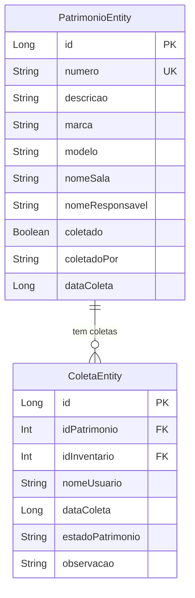
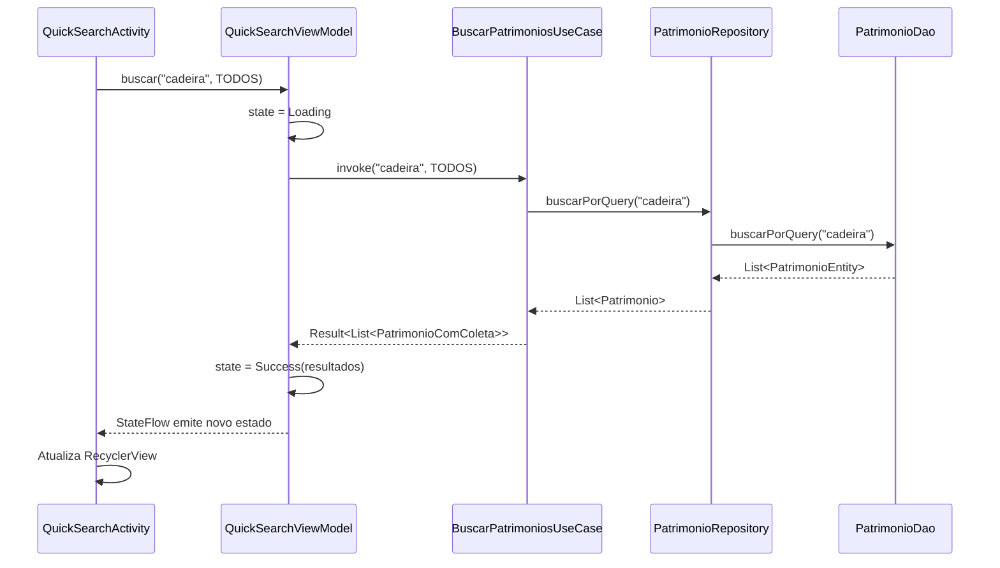

# Design Document - Busca Rápida de Patrimônio

## Overview

Este documento descreve o design técnico para a melhoria da funcionalidade de Busca Rápida de Patrimônio no aplicativo Android de Inventário. A implementação seguirá Clean Architecture + MVVM, reutilizando componentes existentes e adicionando uma tela de detalhes completa com informações do responsável, status de coleta e ações rápidas.

## Architecture

A funcionalidade seguirá a arquitetura Clean Architecture já estabelecida no projeto:

```
┌─────────────────────────────────────────────────────────────┐
│                    Presentation Layer                        │
│  ┌─────────────────┐  ┌─────────────────────────────────┐   │
│  │ QuickSearchActivity │  │ PatrimonioDetailActivity    │   │
│  │ (refatorada)        │  │ (nova)                      │   │
│  └────────┬────────┘  └────────────┬────────────────────┘   │
│           │                        │                         │
│  ┌────────▼────────────────────────▼────────────────────┐   │
│  │              QuickSearchViewModel                     │   │
│  │              PatrimonioDetailViewModel                │   │
│  └────────────────────────┬─────────────────────────────┘   │
└───────────────────────────┼─────────────────────────────────┘
                            │
┌───────────────────────────┼─────────────────────────────────┐
│                    Domain Layer                              │
│  ┌────────────────────────▼─────────────────────────────┐   │
│  │  BuscarPatrimoniosUseCase                             │   │
│  │  BuscarPatrimonioDetalhadoUseCase                     │   │
│  │  BuscarColetaDoPatrimonioUseCase                      │   │
│  └────────────────────────┬─────────────────────────────┘   │
└───────────────────────────┼─────────────────────────────────┘
                            │
┌───────────────────────────┼─────────────────────────────────┐
│                    Data Layer                                │
│  ┌────────────────────────▼─────────────────────────────┐   │
│  │  PatrimonioRepository (existente)                     │   │
│  │  ColetaRepository (existente)                         │   │
│  └────────────────────────┬─────────────────────────────┘   │
│                           │                                  │
│  ┌────────────────────────▼─────────────────────────────┐   │
│  │  PatrimonioDao (Room)    ColetaDao (Room)             │   │
│  └──────────────────────────────────────────────────────┘   │
└─────────────────────────────────────────────────────────────┘
```

## Components and Interfaces

### 1. Domain Layer

#### 1.1 Use Cases

```kotlin
// BuscarPatrimoniosUseCase.kt
class BuscarPatrimoniosUseCase @Inject constructor(
    private val patrimonioRepository: PatrimonioRepository
) {
    suspend operator fun invoke(
        query: String,
        filtro: SearchFilter
    ): Result<List<PatrimonioComColeta>>
}

// BuscarPatrimonioDetalhadoUseCase.kt
class BuscarPatrimonioDetalhadoUseCase @Inject constructor(
    private val patrimonioRepository: PatrimonioRepository,
    private val coletaRepository: ColetaRepository
) {
    suspend operator fun invoke(
        patrimonioId: Long
    ): Result<PatrimonioDetalhado>
}

// BuscarColetaDoPatrimonioUseCase.kt
class BuscarColetaDoPatrimonioUseCase @Inject constructor(
    private val coletaRepository: ColetaRepository
) {
    suspend operator fun invoke(
        patrimonioId: Long,
        inventarioId: Int
    ): Result<Coleta?>
}
```

#### 1.2 Domain Models

```kotlin
// PatrimonioComColeta.kt
data class PatrimonioComColeta(
    val id: Long,
    val numero: String,
    val descricao: String,
    val salaNome: String?,
    val responsavelNome: String?,
    val coletado: Boolean,
    val coletadoPor: String?,
    val dataColeta: Long?,
    val temDivergencia: Boolean
)

// PatrimonioDetalhado.kt
data class PatrimonioDetalhado(
    val id: Long,
    val numero: String,
    val descricao: String,
    val marca: String?,
    val modelo: String?,
    val numeroSerie: String?,
    val estado: String?,
    val valor: Double?,
    val salaNome: String?,
    val salaId: Int?,
    val responsavelNome: String?,
    val responsavelId: Int?,
    val setorNome: String?,
    val coletado: Boolean,
    val coleta: ColetaInfo?,
    val dataUltimaAtualizacao: Long
)

// ColetaInfo.kt
data class ColetaInfo(
    val id: Long,
    val dataColeta: Long,
    val coletadoPor: String,
    val localizacaoEncontrada: String?,
    val estadoEncontrado: String?,
    val observacoes: String?,
    val temDivergencia: Boolean
)

// SearchFilter.kt
enum class SearchFilter {
    ALL, COLETADOS, PENDENTES, DIVERGENCIAS
}
```

### 2. Data Layer

#### 2.1 DAO Queries (Novas)

```kotlin
// PatrimonioDao.kt - Novas queries
@Query("""
    SELECT * FROM patrimonio 
    WHERE (numero LIKE '%' || :query || '%' 
        OR descricao LIKE '%' || :query || '%'
        OR nomeSala LIKE '%' || :query || '%')
    ORDER BY numero ASC
    LIMIT 100
""")
suspend fun buscarPorQuery(query: String): List<PatrimonioEntity>

@Query("""
    SELECT * FROM patrimonio 
    WHERE (numero LIKE '%' || :query || '%' 
        OR descricao LIKE '%' || :query || '%')
        AND coletado = 1
    ORDER BY numero ASC
    LIMIT 100
""")
suspend fun buscarColetadosPorQuery(query: String): List<PatrimonioEntity>

@Query("""
    SELECT * FROM patrimonio 
    WHERE (numero LIKE '%' || :query || '%' 
        OR descricao LIKE '%' || :query || '%')
        AND coletado = 0
    ORDER BY numero ASC
    LIMIT 100
""")
suspend fun buscarPendentesPorQuery(query: String): List<PatrimonioEntity>

@Query("SELECT * FROM patrimonio WHERE id = :id")
suspend fun buscarPorId(id: Long): PatrimonioEntity?
```

```kotlin
// ColetaDao.kt - Novas queries
@Query("""
    SELECT * FROM coleta 
    WHERE idPatrimonio = :patrimonioId 
        AND idInventario = :inventarioId
    ORDER BY dataColeta DESC
    LIMIT 1
""")
suspend fun buscarColetaDoPatrimonio(
    patrimonioId: Int, 
    inventarioId: Int
): ColetaEntity?
```

### 3. Presentation Layer

#### 3.1 ViewModels

```kotlin
// QuickSearchViewModel.kt
@HiltViewModel
class QuickSearchViewModel @Inject constructor(
    private val buscarPatrimoniosUseCase: BuscarPatrimoniosUseCase
) : ViewModel() {
    
    private val _state = MutableStateFlow<QuickSearchState>(QuickSearchState.Idle)
    val state: StateFlow<QuickSearchState> = _state.asStateFlow()
    
    private val _searchStats = MutableStateFlow(SearchStats())
    val searchStats: StateFlow<SearchStats> = _searchStats.asStateFlow()
    
    fun buscar(query: String, filtro: SearchFilter)
    fun limparBusca()
}

// PatrimonioDetailViewModel.kt
@HiltViewModel
class PatrimonioDetailViewModel @Inject constructor(
    private val buscarPatrimonioDetalhadoUseCase: BuscarPatrimonioDetalhadoUseCase
) : ViewModel() {
    
    private val _state = MutableStateFlow<PatrimonioDetailState>(PatrimonioDetailState.Loading)
    val state: StateFlow<PatrimonioDetailState> = _state.asStateFlow()
    
    fun carregarDetalhes(patrimonioId: Long)
}
```

#### 3.2 UI States

```kotlin
// QuickSearchState.kt
sealed class QuickSearchState {
    object Idle : QuickSearchState()
    object Loading : QuickSearchState()
    data class Success(
        val resultados: List<PatrimonioComColeta>,
        val tempoMs: Long
    ) : QuickSearchState()
    data class Empty(val query: String) : QuickSearchState()
    data class Error(val message: String) : QuickSearchState()
}

// SearchStats.kt
data class SearchStats(
    val totalResultados: Int = 0,
    val coletados: Int = 0,
    val pendentes: Int = 0,
    val divergencias: Int = 0,
    val tempoMs: Long = 0
)

// PatrimonioDetailState.kt
sealed class PatrimonioDetailState {
    object Loading : PatrimonioDetailState()
    data class Success(val patrimonio: PatrimonioDetalhado) : PatrimonioDetailState()
    data class Error(val message: String) : PatrimonioDetailState()
}
```

## Data Models

### Diagrama de Entidades



### Fluxo de Dados



## Correctness Properties

*A property is a characteristic or behavior that should hold true across all valid executions of a system-essentially, a formal statement about what the system should do. Properties serve as the bridge between human-readable specifications and machine-verifiable correctness guarantees.*

### Property 1: Busca retorna resultados correspondentes
*For any* termo de busca com 3 ou mais caracteres, todos os resultados retornados devem conter o termo no número do patrimônio OU na descrição OU no nome da sala.
**Validates: Requirements 1.1**

### Property 2: Filtro de coletados retorna apenas coletados
*For any* lista de resultados filtrada por "Coletados", todos os itens devem ter o campo `coletado = true`.
**Validates: Requirements 3.1**

### Property 3: Filtro de pendentes retorna apenas pendentes
*For any* lista de resultados filtrada por "Pendentes", todos os itens devem ter o campo `coletado = false`.
**Validates: Requirements 3.2**

### Property 4: Estatísticas correspondem aos resultados
*For any* busca com resultados, a quantidade total exibida deve ser igual ao tamanho da lista de resultados, e a soma de coletados + pendentes deve ser igual ao total.
**Validates: Requirements 4.1, 4.3**

### Property 5: Detalhes de patrimônio coletado incluem informações da coleta
*For any* patrimônio com `coletado = true`, os detalhes devem incluir nome do coletor e data da coleta não nulos.
**Validates: Requirements 2.4**

### Property 6: Ações condicionais baseadas no status de coleta
*For any* patrimônio visualizado nos detalhes, se `coletado = false` então o botão "Coletar" deve estar visível, caso contrário o botão "Ver Coleta" deve estar visível.
**Validates: Requirements 5.1, 5.2**

### Property 7: Busca funciona offline
*For any* busca executada sem conexão de rede, o sistema deve retornar resultados do banco local sem erro.
**Validates: Requirements 6.1, 6.2**

## Error Handling

### Erros de Busca
- **Query vazia**: Retornar estado `Idle` sem executar busca
- **Query muito curta** (< 3 caracteres): Aguardar mais entrada
- **Erro de banco de dados**: Exibir mensagem amigável e logar erro
- **Timeout**: Cancelar busca anterior e iniciar nova

### Erros de Detalhes
- **Patrimônio não encontrado**: Exibir mensagem e botão para voltar
- **Erro ao carregar coleta**: Exibir detalhes do patrimônio sem informações de coleta

## Testing Strategy

### Dual Testing Approach

A estratégia de testes combina testes unitários para casos específicos e testes baseados em propriedades para validação de comportamentos universais.

### Unit Tests

1. **QuickSearchViewModelTest**
   - Testar transição de estados (Idle → Loading → Success)
   - Testar debounce de busca
   - Testar cancelamento de busca anterior

2. **BuscarPatrimoniosUseCaseTest**
   - Testar busca com diferentes filtros
   - Testar tratamento de erros do repository

3. **PatrimonioDetailViewModelTest**
   - Testar carregamento de detalhes
   - Testar patrimônio não encontrado

### Property-Based Tests

Utilizando a biblioteca **Kotest** com property testing:

1. **Property 1**: Busca retorna resultados correspondentes
2. **Property 2**: Filtro de coletados retorna apenas coletados
3. **Property 3**: Filtro de pendentes retorna apenas pendentes
4. **Property 4**: Estatísticas correspondem aos resultados
5. **Property 5**: Detalhes de patrimônio coletado incluem informações da coleta
6. **Property 6**: Ações condicionais baseadas no status de coleta
7. **Property 7**: Busca funciona offline

Cada teste de propriedade deve executar no mínimo 100 iterações com dados gerados aleatoriamente.

### Test Annotations

Cada teste de propriedade deve ser anotado com:
```kotlin
/**
 * **Feature: busca-rapida-patrimonio, Property X: [descrição]**
 * **Validates: Requirements X.Y**
 */
```
