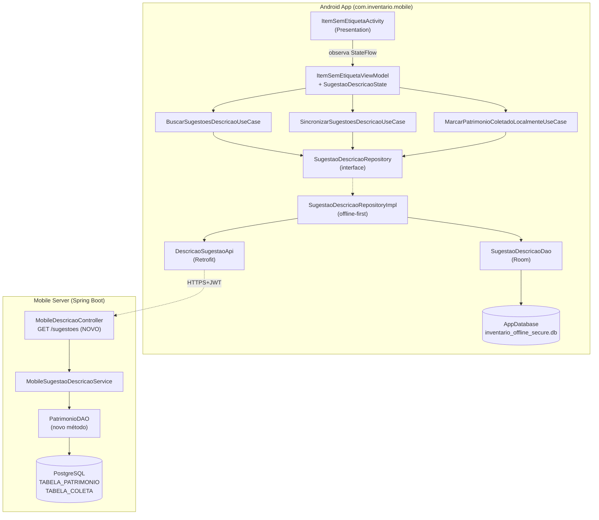
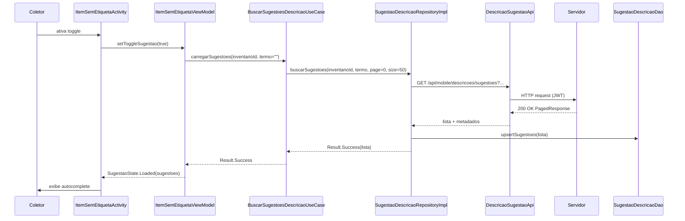
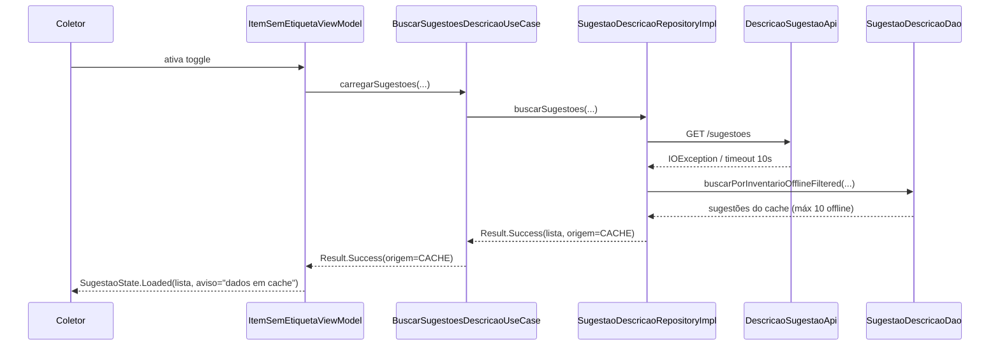
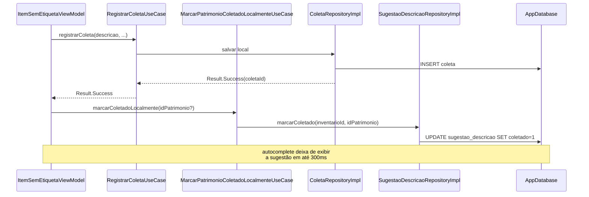

# Design Document

## Overview

Esta feature introduz um fluxo híbrido de captura de descrição na tela de coleta de item sem etiqueta (`ItemSemEtiquetaActivity`) do App_Android SIHCP: um campo de texto livre sempre visível, combinado com um toggle opcional que habilita um componente de autocomplete com sugestões de descrições de `Patrimonio_Nao_Coletado` do `Inventario_Ativo`. A descrição final enviada ao servidor é **sempre** o conteúdo corrente do campo livre após `trim`, independente de ter sido digitada, selecionada ou editada após seleção.

O design preserva estritamente três invariantes do sistema:

1. **Contrato de dados imutável** — a descrição continua sendo persistida na coluna `descricao_item_sem_etiqueta` da `TABELA_COLETA`, sem alteração de schema (Req 9.1, 9.2, 9.3).
2. **Endpoints existentes intocados** — `GET /api/mobile/descricoes/nao-coletadas`, `POST /api/mobile/coletas` e `POST /api/mobile/coletas/batch` mantêm URL, método, parâmetros e estrutura de resposta (Req 5.9, 9.7, 9.8). A steering rule `endpoints-nao-alterar.md` é respeitada integralmente.
3. **Fluxo offline-first existente** — coletas continuam sendo gravadas localmente primeiro e sincronizadas via `SyncWorker`/batch, sem alteração de semântica (Req 7.5, 7.6).

Para atender à necessidade de sugestões filtradas sem impactar o endpoint legado, introduzimos um **novo** endpoint sob o prefixo `/api/mobile/descricoes/`: `GET /api/mobile/descricoes/sugestoes`. Esse endpoint é dedicado ao App_Android, suporta paginação, filtragem por `Termo_Busca` com `LIKE`/`unaccent` e respeita a matriz de segurança (`@RequireColetor`).

No app, um novo componente de cache (`SugestaoDescricaoEntity` + `SugestaoDescricaoDao`) é adicionado ao `AppDatabase` (nome canônico `inventario_offline_secure.db`, versão bumpada), permitindo degradação previsível em cenário offline conforme Req 7. A lógica de filtragem offline é acento/caso-insensível, espelhando o comportamento do servidor.

## Architecture

### Arquitetura em alto nível



### Decisões de arquitetura e justificativas

1. **Novo endpoint em vez de extensão do existente** — `GET /api/mobile/descricoes/nao-coletadas` já está em produção e documentado na steering rule `endpoints-nao-alterar.md`. Estender sua assinatura (paginação, normalização, metadados) representaria risco de regressão para clientes legados. O novo endpoint `GET /api/mobile/descricoes/sugestoes` é dedicado e versionável independentemente.

2. **Reuso da infraestrutura Clean Architecture + MVVM** — o projeto já consolidou o padrão (`clean-architecture.md`), com `@HiltViewModel`, Use Cases, Repository interface em `domain/` e implementação em `data/`. O design segue exatamente esse padrão, adicionando novos componentes sem introduzir paradigma paralelo.

3. **Cache Room isolado por inventário** — `SugestaoDescricaoEntity` possui chave composta `(idInventario, idPatrimonio)` e índice em `descricaoNormalizada`. Isso permite invalidar o cache ao trocar de inventário e filtrar offline com desempenho adequado mesmo com até 10.000 patrimônios (Req 6.1).

4. **Normalização acento/caso-insensível feita em camada de dados** — tanto no servidor (usando `unaccent(lower(descricao))`) quanto no app (campo derivado `descricaoNormalizada` pré-computado na inserção). Isso evita normalização no caminho quente do autocomplete e garante que o filtro offline seja idêntico ao online (Req 3.4, 7.2).

5. **Debounce no ViewModel, não na UI** — `ItemSemEtiquetaViewModel` usa `MutableStateFlow<String>` + `.debounce(300)` + `.distinctUntilChanged()` para expor `termoBuscaDebounced`. A Activity apenas coleta o resultado. Isso torna a regra testável sem instrumentação de UI (Req 3.7).

6. **Descrição final é sempre o campo livre** — `SugestaoDescricaoSelecionada` nunca é persistida como ligação forte. Ao selecionar uma sugestão, o ViewModel apenas emite um evento `PreencherCampoLivre(texto)` que a Activity aplica ao `EditText`. A partir daí, só o conteúdo do `EditText` é relevante (Req 4.1, 4.2).

### Fluxos principais (sequência)

**Fluxo 1: Ativação do toggle com rede disponível**



**Fluxo 2: Ativação do toggle sem rede (fallback para cache)**



**Fluxo 3: Seleção de sugestão + edição posterior**

```mermaid
sequenceDiagram
    participant U as Coletor
    participant A as ItemSemEtiquetaActivity
    participant VM as ItemSemEtiquetaViewModel
    participant Field as EditText livre

    U->>A: seleciona sugestão "Cadeira giratória"
    A->>VM: onSugestaoSelecionada(item)
    VM->>A: Event.PreencherCampoLivre("Cadeira giratória")
    A->>Field: setText("Cadeira giratória")
    A->>Field: setSelection(end)
    U->>Field: edita para "Cadeira giratória preta"
    Note over VM,Field: VM apenas observa texto corrente; vínculo com sugestão é descartado
    U->>A: confirma coleta
    A->>VM: confirmar(textoLivre)
    VM->>VM: validar trim(textoLivre)
    VM->>VM: registrarColeta(descricao=textoLivre.trim())
```

**Fluxo 4: Confirmação de coleta e atualização do cache**



## Components and Interfaces

### Server (Spring Boot 3.2, Java 21)

Todos os novos componentes residem em `sihcp-server/src/main/java/com/inventario/sihcp/mobile/server/` e no `sihcp-core` (para DAO).

#### 1. `MobileDescricaoController` (modificado)

Arquivo existente: `.../mobile/server/controller/MobileDescricaoController.java`.
Alteração: **adicionar** um único método. Nenhum endpoint existente é modificado.

```java
// NOVO — não alterar endpoints existentes
@GetMapping("/sugestoes")
public ResponseEntity<ApiResponse<PagedResponseDTO<SugestaoDescricaoDTO>>> listarSugestoes(
        @RequestParam(name = "q", required = false) String termoBusca,
        @RequestParam(name = "page", required = false, defaultValue = "0") Integer page,
        @RequestParam(name = "size", required = false, defaultValue = "50") Integer size,
        @RequestParam(name = "idInventario", required = false) Integer idInventario
) { ... }
```

Regras de segurança: herda `@RequireColetor` da classe (ADMIN, SUPERVISOR ou COLETOR). `CONSULTA` recebe `403`. Sem token válido: `401` (Req 10.1–10.3).

#### 2. `MobileSugestaoDescricaoService` (novo)

Arquivo: `.../mobile/server/service/MobileSugestaoDescricaoService.java`

```java
@Service
public class MobileSugestaoDescricaoService {

    private final PatrimonioDAO patrimonioDAO;
    private final InventarioDAO inventarioDAO;

    public PagedResponseDTO<SugestaoDescricaoDTO> listarSugestoes(
            String termoBusca,
            int page,
            int size,
            Integer idInventarioSolicitado
    ) {
        // 1. Resolver inventário ativo se não informado
        // 2. Normalizar termoBusca: trim, limitar a 100 chars, null-safe
        // 3. Sanitizar page (>=0), size (1..100, default 50 silencioso — Req 5.7)
        // 4. Delegar à PatrimonioDAO.buscarSugestoesNaoColetadasPaginado(...)
        // 5. Se inventário ativo não existe, retornar PagedResponse.empty()
        //    com flag "semInventarioAtivo=true" (Req 5.8)
    }
}
```

#### 3. `PatrimonioDAO.buscarSugestoesNaoColetadasPaginado` (novo método em DAO existente)

Arquivo: `sihcp-core/src/main/java/com/inventario/sihcp/dao/PatrimonioDAO.java`

Método novo, não substitui `buscarDescricoesNaoColetadasAgrupadas` (que permanece usado pelo endpoint legado):

```java
/**
 * Busca sugestões de descrições de patrimônios NÃO coletados no inventário,
 * com filtro acento/caso-insensível, paginação e ordenação estável.
 * Retorna linha-a-linha (não agrupado) para permitir que o app associe
 * cada sugestão a um idPatrimonio específico (Req 8.4).
 */
public PagedResult<SugestaoDescricaoRow> buscarSugestoesNaoColetadasPaginado(
        int idInventario,
        String termoBusca,  // já normalizado pelo service
        int page,
        int size
) throws SQLException;
```

SQL (PostgreSQL; usa extensão `unaccent` — verificar pré-requisito na steering rule `database-verification.md`):

```sql
-- Consulta principal
SELECT p.ID, p.NUMERO, p.DESCRICAO
FROM TABELA_PATRIMONIO p
WHERE (p.STATUS IS NULL OR UPPER(p.STATUS) NOT IN ('BAIXADO', 'INATIVO'))
  AND p.DESCRICAO IS NOT NULL
  AND TRIM(p.DESCRICAO) <> ''
  AND NOT EXISTS (
      SELECT 1 FROM TABELA_COLETA c
      WHERE c.ID_PATRIMONIO = p.ID
        AND c.ID_INVENTARIO = ?
  )
  AND (? = '' OR unaccent(lower(p.DESCRICAO)) LIKE '%' || unaccent(lower(?)) || '%')
ORDER BY unaccent(lower(p.DESCRICAO)) ASC, p.NUMERO ASC
LIMIT ? OFFSET ?;

-- Contagem total
SELECT COUNT(*) FROM TABELA_PATRIMONIO p
WHERE /* mesmos filtros do WHERE acima */;
```

**Índices necessários (criar via migration SQL — ver Data Models):**

- `idx_patrimonio_descricao_unaccent` em `unaccent(lower(descricao))` (funcional)
- `idx_coleta_patrimonio_inventario` em `(id_patrimonio, id_inventario)` — se já não existir
- `idx_patrimonio_status` em `status`

#### 4. DTOs

```java
// sihcp-server/.../mobile/server/dto/SugestaoDescricaoDTO.java
public record SugestaoDescricaoDTO(
        Integer idPatrimonio,
        String numeroPatrimonio,
        String descricao
) { }

// sihcp-server/.../mobile/server/dto/PagedResponseDTO.java
public record PagedResponseDTO<T>(
        List<T> content,
        int page,
        int size,
        long totalElements,
        int totalPages,
        boolean hasNext,
        boolean semInventarioAtivo  // Req 5.8
) { }
```

### Android App (Kotlin, com.inventario.mobile)

Todos os componentes novos seguem os pacotes da steering `clean-architecture.md`.

#### 1. Domain Layer

```kotlin
// domain/model/SugestaoDescricao.kt
data class SugestaoDescricao(
    val idPatrimonio: Int,
    val numeroPatrimonio: String,
    val descricao: String
)

// domain/model/OrigemSugestoes.kt
enum class OrigemSugestoes { SERVIDOR, CACHE, VAZIO_SEM_CACHE }

data class ResultadoSugestoes(
    val sugestoes: List<SugestaoDescricao>,
    val origem: OrigemSugestoes,
    val totalElements: Long,
    val hasNext: Boolean
)

// domain/repository/SugestaoDescricaoRepository.kt
interface SugestaoDescricaoRepository {
    suspend fun buscarSugestoes(
        idInventario: Int,
        termoBusca: String,
        page: Int,
        size: Int
    ): Result<ResultadoSugestoes>

    suspend fun atualizarCache(idInventario: Int, sugestoes: List<SugestaoDescricao>)

    suspend fun buscarOffline(
        idInventario: Int,
        termoBusca: String,
        limit: Int
    ): List<SugestaoDescricao>

    suspend fun marcarColetadoLocalmente(idInventario: Int, idPatrimonio: Int)

    suspend fun limparCacheDeOutrosInventarios(idInventarioAtivo: Int)
}

// domain/usecase/BuscarSugestoesDescricaoUseCase.kt
class BuscarSugestoesDescricaoUseCase @Inject constructor(
    private val repo: SugestaoDescricaoRepository,
    private val connectivityMonitor: ConnectivityMonitor
) {
    suspend operator fun invoke(
        idInventario: Int,
        termoBusca: String,
        page: Int = 0,
        size: Int = 50
    ): Result<ResultadoSugestoes>
}

// domain/usecase/MarcarPatrimonioColetadoLocalmenteUseCase.kt
class MarcarPatrimonioColetadoLocalmenteUseCase @Inject constructor(
    private val repo: SugestaoDescricaoRepository
) {
    suspend operator fun invoke(idInventario: Int, idPatrimonio: Int?)
}
```

#### 2. Data Layer

```kotlin
// data/local/entity/SugestaoDescricaoEntity.kt  (schema em "Data Models")

// data/local/dao/SugestaoDescricaoDao.kt
@Dao
interface SugestaoDescricaoDao {
    @Query("""
        SELECT * FROM sugestao_descricao
        WHERE idInventario = :idInventario AND coletadoLocal = 0
          AND (:termoNormalizado = '' OR descricaoNormalizada LIKE '%' || :termoNormalizado || '%')
        ORDER BY descricaoNormalizada ASC, numeroPatrimonio ASC
        LIMIT :limit
    """)
    suspend fun buscarFiltrado(
        idInventario: Int,
        termoNormalizado: String,
        limit: Int
    ): List<SugestaoDescricaoEntity>

    @Insert(onConflict = OnConflictStrategy.REPLACE)
    suspend fun upsertAll(entities: List<SugestaoDescricaoEntity>)

    @Query("UPDATE sugestao_descricao SET coletadoLocal = 1 WHERE idInventario = :idInventario AND idPatrimonio = :idPatrimonio")
    suspend fun marcarColetado(idInventario: Int, idPatrimonio: Int)

    @Query("DELETE FROM sugestao_descricao WHERE idInventario != :idInventarioAtivo")
    suspend fun limparOutrosInventarios(idInventarioAtivo: Int)

    @Query("SELECT COUNT(*) FROM sugestao_descricao WHERE idInventario = :idInventario")
    suspend fun contarPorInventario(idInventario: Int): Int
}

// data/remote/api/DescricaoSugestaoApi.kt
interface DescricaoSugestaoApi {
    @GET("api/mobile/descricoes/sugestoes")
    suspend fun buscarSugestoes(
        @Query("q") termoBusca: String? = null,
        @Query("page") page: Int = 0,
        @Query("size") size: Int = 50,
        @Query("idInventario") idInventario: Int? = null
    ): ApiResponse<PagedResponseDto<SugestaoDescricaoDto>>
}

// data/repository/SugestaoDescricaoRepositoryImpl.kt
class SugestaoDescricaoRepositoryImpl @Inject constructor(
    private val dao: SugestaoDescricaoDao,
    private val api: DescricaoSugestaoApi,
    private val mapper: SugestaoDescricaoMapper,
    private val textNormalizer: TextNormalizer
) : SugestaoDescricaoRepository {

    override suspend fun buscarSugestoes(
        idInventario: Int, termoBusca: String, page: Int, size: Int
    ): Result<ResultadoSugestoes> = withContext(Dispatchers.IO) {
        try {
            val resp = withTimeout(10_000) {  // Req 3.2
                api.buscarSugestoes(termoBusca.ifBlank { null }, page, size, idInventario)
            }
            val sugestoes = resp.data?.content.orEmpty().map(mapper::toDomain)
            atualizarCache(idInventario, sugestoes)  // Req 7.1
            Result.success(ResultadoSugestoes(sugestoes, OrigemSugestoes.SERVIDOR,
                resp.data?.totalElements ?: 0L, resp.data?.hasNext ?: false))
        } catch (e: Exception) {
            // Req 3.2, 7.2, 7.3 — fallback para cache
            val cache = buscarOffline(idInventario, termoBusca, limit = 10)
            val origem = if (cache.isEmpty()) OrigemSugestoes.VAZIO_SEM_CACHE else OrigemSugestoes.CACHE
            Result.success(ResultadoSugestoes(cache, origem, cache.size.toLong(), false))
        }
    }
    /* ... demais métodos ... */
}

// data/util/TextNormalizer.kt
class TextNormalizer @Inject constructor() {
    /** Aplica NFD + remove diacríticos + lowercase. Usado em cache e filtro offline. */
    fun normalize(input: String): String =
        java.text.Normalizer.normalize(input, java.text.Normalizer.Form.NFD)
            .replace("\\p{InCombiningDiacriticalMarks}+".toRegex(), "")
            .lowercase(java.util.Locale.forLanguageTag("pt-BR"))
}
```

#### 3. Presentation Layer

```kotlin
// presentation/coleta/state/SugestaoDescricaoState.kt
sealed class SugestaoDescricaoState {
    data object Oculto : SugestaoDescricaoState()                         // toggle off
    data object Carregando : SugestaoDescricaoState()
    data class Carregado(
        val sugestoes: List<SugestaoDescricao>,
        val origem: OrigemSugestoes
    ) : SugestaoDescricaoState()
    data class SemResultados(val origem: OrigemSugestoes) : SugestaoDescricaoState()
    data class Erro(val mensagem: String) : SugestaoDescricaoState()
}

// presentation/coleta/ItemSemEtiquetaViewModel.kt  (extensão do existente)
@HiltViewModel
class ItemSemEtiquetaViewModel @Inject constructor(
    private val registrarColetaUseCase: RegistrarColetaUseCase,
    private val buscarSugestoesUseCase: BuscarSugestoesDescricaoUseCase,
    private val marcarColetadoUseCase: MarcarPatrimonioColetadoLocalmenteUseCase,
    private val preferencesManager: PreferencesManager,
    private val vibrationHelper: VibrationHelper
) : ViewModel() {

    // Estados públicos
    private val _sugestaoState = MutableStateFlow<SugestaoDescricaoState>(SugestaoDescricaoState.Oculto)
    val sugestaoState: StateFlow<SugestaoDescricaoState> = _sugestaoState.asStateFlow()

    private val _toggleAtivo = MutableStateFlow(false)
    val toggleAtivo: StateFlow<Boolean> = _toggleAtivo.asStateFlow()

    private val _termoBusca = MutableStateFlow("")
    // Req 3.7 — debounce 300ms aplicado aqui
    @OptIn(FlowPreview::class)
    private val termoBuscaDebounced: Flow<String> =
        _termoBusca.debounce(300).distinctUntilChanged()

    init {
        viewModelScope.launch {
            combine(_toggleAtivo, termoBuscaDebounced) { ativo, termo -> ativo to termo }
                .filter { (ativo, _) -> ativo }
                .collectLatest { (_, termo) -> carregarSugestoes(termo) }
        }
    }

    fun setToggleSugestao(ativo: Boolean) {
        _toggleAtivo.value = ativo
        if (!ativo) _sugestaoState.value = SugestaoDescricaoState.Oculto
        // Req 2.2, 2.3, 2.4
    }

    fun onTermoBuscaChange(termo: String) { _termoBusca.value = termo }

    fun onSugestaoSelecionada(s: SugestaoDescricao) { /* emite Event.PreencherCampoLivre */ }

    private suspend fun carregarSugestoes(termo: String) { /* chama UseCase */ }

    // extensão do método existente
    fun confirmarColeta(descricaoLivre: String, /*...*/) {
        val desc = descricaoLivre.trim()
        if (desc.length < 3 || desc.length > 255) { /* emitir erro; Req 1.4, 1.5, 1.6, 4.4, 4.5 */ return }
        // registrar via RegistrarColetaUseCase...
        // em sucesso, marcar cache: marcarColetadoUseCase(idInventario, idPatrimonioVinculado)
        // Req 8.1
    }
}
```

#### 4. UI (Layout XML `activity_item_sem_etiqueta.xml` — modificado)

Alterações no layout existente:

- `TextInputLayout` + `TextInputEditText` `Campo_Descricao_Livre` permanecem (já existem) com atributos reforçados:
  - `android:maxLength="255"` (Req 1.5)
  - `android:inputType="textCapSentences"` (preserva caixa original nas sugestões)
  - `requestFocus()` no `onCreate` (Req 1.1)
- **Novo**: `SwitchMaterial` (ou `MaterialCheckBox`) `toggleSugestao` logo abaixo do campo, com label "Sugerir descrições cadastradas" (Req 2.1).
- **Novo**: `RecyclerView` `rvSugestoes` vertical (altura máx `240dp`, `android:nestedScrollingEnabled="true"`), `visibility=GONE` por padrão, tornando-se `VISIBLE` somente quando `sugestaoState` ∈ {`Carregado`, `SemResultados`, `Carregando`, `Erro`} E `toggleAtivo == true`.
- `SugestaoDescricaoAdapter` (ListAdapter com DiffUtil) vincula cada item a um `TextView` simples + click listener que chama `viewModel.onSugestaoSelecionada(...)`.
- Banner/Snackbar opcional para exibir `origem == CACHE` (Req 3.2) e `SemResultados` (Req 3.6).

A Activity já é `@AndroidEntryPoint`. Adiciona apenas novos `collect { state -> render(state) }` no `lifecycleScope`.

## Data Models

### Server (sem migração de schema na `TABELA_COLETA` — Req 9.2, 9.3)

Uma migração SQL opcional é proposta **apenas** para índices de performance, não afetando colunas existentes:

```sql
-- sql/adicionar_indices_sugestoes_descricao.sql  (NOVO arquivo)
-- Aplicar somente se as extensões/índices ainda não existirem.
CREATE EXTENSION IF NOT EXISTS unaccent;

-- Índice funcional para filtro acento/caso-insensível (Req 3.4, 5.4, 6.4)
CREATE INDEX IF NOT EXISTS idx_patrimonio_descricao_unaccent
    ON tabela_patrimonio (unaccent(lower(descricao)));

-- Índice composto para NOT EXISTS rápido (Req 5.2)
CREATE INDEX IF NOT EXISTS idx_coleta_patrimonio_inventario
    ON tabela_coleta (id_patrimonio, id_inventario);

-- Índice para filtro por status
CREATE INDEX IF NOT EXISTS idx_patrimonio_status
    ON tabela_patrimonio (status);
```

Nenhuma coluna é adicionada, renomeada ou removida. `descricao_item_sem_etiqueta` continua sendo a única coluna que recebe a `Descricao_Final` (Req 9.1).

### Android — `SugestaoDescricaoEntity` (nova tabela do Room)

```kotlin
// data/local/entity/SugestaoDescricaoEntity.kt
@Entity(
    tableName = "sugestao_descricao",
    primaryKeys = ["idInventario", "idPatrimonio"],
    indices = [
        Index(value = ["idInventario", "coletadoLocal"]),
        Index(value = ["idInventario", "descricaoNormalizada"]),
        Index(value = ["descricaoNormalizada"])
    ]
)
data class SugestaoDescricaoEntity(
    val idInventario: Int,
    val idPatrimonio: Int,
    val numeroPatrimonio: String,
    val descricao: String,
    /** Pré-computada via TextNormalizer no momento do upsert. Acento/caso-insensível. */
    val descricaoNormalizada: String,
    /** Marcado localmente após coleta (Req 8.1). Sincronização confirma (Req 8.2). */
    val coletadoLocal: Boolean = false,
    /** Timestamp da última atualização vinda do servidor. */
    val dataAtualizacao: Long = System.currentTimeMillis()
)
```

**Migração Room** — `AppDatabase` sobe da versão 16 para 17:

```kotlin
// AppDatabase.kt — nova MIGRATION_16_17
private val MIGRATION_16_17 = object : Migration(16, 17) {
    override fun migrate(db: SupportSQLiteDatabase) {
        db.execSQL("""
            CREATE TABLE IF NOT EXISTS sugestao_descricao (
                idInventario INTEGER NOT NULL,
                idPatrimonio INTEGER NOT NULL,
                numeroPatrimonio TEXT NOT NULL,
                descricao TEXT NOT NULL,
                descricaoNormalizada TEXT NOT NULL,
                coletadoLocal INTEGER NOT NULL DEFAULT 0,
                dataAtualizacao INTEGER NOT NULL,
                PRIMARY KEY(idInventario, idPatrimonio)
            )
        """.trimIndent())
        db.execSQL("CREATE INDEX IF NOT EXISTS index_sugestao_descricao_idInventario_coletadoLocal ON sugestao_descricao(idInventario, coletadoLocal)")
        db.execSQL("CREATE INDEX IF NOT EXISTS index_sugestao_descricao_idInventario_descricaoNormalizada ON sugestao_descricao(idInventario, descricaoNormalizada)")
        db.execSQL("CREATE INDEX IF NOT EXISTS index_sugestao_descricao_descricaoNormalizada ON sugestao_descricao(descricaoNormalizada)")
    }
}
```

`AppDatabase` ganha `abstract fun sugestaoDescricaoDao(): SugestaoDescricaoDao` e o Hilt `DatabaseModule` ganha o provider correspondente.

### API Contract

**Endpoint:** `GET /api/mobile/descricoes/sugestoes`

**Headers:**
- `Authorization: Bearer <JWT>` (obrigatório — Req 10.1, 10.2)
- `Accept: application/json`

**Query parameters:**

| Nome | Tipo | Obrigatório | Default | Validação |
|------|------|-------------|---------|-----------|
| `q` | string | não | `""` | 0–100 chars após trim; excedente é truncado silenciosamente |
| `page` | int | não | `0` | se inválido/negativo, aplicar `0` silenciosamente |
| `size` | int | não | `50` | 1 ≤ size ≤ 100; fora do intervalo ou inválido → `50` (Req 5.7, 6.3) |
| `idInventario` | int | não | inventário ativo | se ausente, resolve via `InventarioDAO.buscarInventarioAtivo()` (Req 5.8) |

**Response 200 OK:**

```json
{
  "success": true,
  "message": "N sugestão(ões) em Xms",
  "data": {
    "content": [
      { "idPatrimonio": 1234, "numeroPatrimonio": "IFMT-01234", "descricao": "Cadeira giratória preta" },
      { "idPatrimonio": 5678, "numeroPatrimonio": "IFMT-05678", "descricao": "Cadeira giratória preta" }
    ],
    "page": 0,
    "size": 50,
    "totalElements": 243,
    "totalPages": 5,
    "hasNext": true,
    "semInventarioAtivo": false
  }
}
```

**Response 200 OK — sem inventário ativo (Req 5.8):**

```json
{
  "success": true,
  "message": "Nenhum inventário ativo",
  "data": {
    "content": [],
    "page": 0, "size": 50,
    "totalElements": 0, "totalPages": 0,
    "hasNext": false,
    "semInventarioAtivo": true
  }
}
```

**Erros:**

| Status | Causa | Body |
|--------|-------|------|
| 401 | JWT ausente, malformado, expirado, assinatura inválida (Req 10.2) | `{"success":false, "error":"AUTH_FAILED", "message":"..."}` |
| 403 | Usuário com perfil `CONSULTA` apenas (Req 10.3) | `{"success":false, "error":"FORBIDDEN"}` |
| 500 | Erro de banco ou exceção não tratada | `{"success":false, "error":"INTERNAL_ERROR"}` |

Nenhum outro código é esperado no caminho feliz; `page`/`size` inválidos são tratados silenciosamente (Req 5.7, 6.3).

### Performance

| Parâmetro | Valor | Justificativa |
|-----------|-------|---------------|
| Timeout HTTP cliente | 10s | Req 3.2, 8.5, 8.6 |
| Debounce UI | 300ms | Req 3.7 |
| `size` padrão | 50 | Req 5.6 |
| `size` máximo | 100 | Req 5.6 |
| Teto de itens simultâneos na UI | 50 (online) / 10 (offline) | Req 3.3, 7.2 |
| Teto de itens no cache por inventário | até ~500 (governado pelo servidor) | Req 3.1 |
| p95 servidor | ≤ 500 ms | Req 6.1 |
| Máximo servidor | ≤ 2000 ms | Req 6.1, 10.1 |

### Compatibilidade retroativa

- `POST /api/mobile/coletas` e `POST /api/mobile/coletas/batch` não recebem campos novos. O valor corrente do `Campo_Descricao_Livre` é enviado no campo já existente `descricaoItemSemEtiqueta` (Req 9.7, 9.8).
- Apps com versão anterior continuam funcionando — o servidor ignora ausência do novo endpoint.
- O endpoint legado `GET /api/mobile/descricoes/nao-coletadas` não é tocado (Req 5.9).
- Fluxo de foto, diretório de armazenamento e `PhotoSyncWorker` permanecem inalterados (Req 9.4).
- Geração do relatório fotográfico usa o mesmo campo `descricao_item_sem_etiqueta`, sem diferenciação por origem (Req 9.5, 9.6).


## Correctness Properties

*A property is a characteristic or behavior that should hold true across all valid executions of a system — essentially, a formal statement about what the system should do. Properties serve as the bridge between human-readable specifications and machine-verifiable correctness guarantees.*

As propriedades abaixo consolidam critérios de aceitação relacionados (ver "Property Reflection" no prework) para evitar redundância e maximizar valor de cobertura. Cada propriedade é universalmente quantificada e pode ser implementada como um único teste baseado em propriedades.

### Property 1: Preservação do texto do campo livre sob transições arbitrárias

*For any* sequência de eventos externos ao campo de texto — ativação/desativação do `Toggle_Sugestao`, transições da conectividade de rede (online ↔ offline), carregamentos e limpezas do `Autocomplete_Sugestao` — o conteúdo corrente do `Campo_Descricao_Livre` deve permanecer **bit-a-bit idêntico** ao último valor entrado pelo Coletor, e o campo deve permanecer habilitado para edição.

**Validates: Requirements 1.2, 2.3, 2.4, 7.4**

### Property 2: Trim + validação de tamanho no app na confirmação

*For any* string `s` digitada no `Campo_Descricao_Livre`, a confirmação de coleta no App_Android é aceita (chama `RegistrarColetaUseCase`) se, e somente se, `3 ≤ s.trim().length ≤ 255`; fora desse intervalo, nenhum request/gravação é iniciado, e o estado observável do ViewModel indica erro de validação preservando o texto original.

**Validates: Requirements 1.3, 1.4, 1.5, 1.6, 4.4, 4.5**

### Property 3: Descrição final é sempre `currentText.trim()` e persistida apenas no campo alvo

*For any* trajetória de interações — `setText`, seleção de sugestão (`onSugestaoSelecionada`), edição pós-seleção, toggles do `Toggle_Sugestao`, mudanças de rede — o valor enviado ao `RegistrarColetaUseCase` na confirmação satisfaz `descricao == currentText.trim()`, e a entidade `ColetaEntity` persistida contém esse valor **exclusivamente** no campo `descricaoItemSemEtiqueta`; todos os demais campos passados ao UseCase são preservados inalterados.

**Validates: Requirements 4.1, 4.2, 4.3, 9.1**

### Property 4: Toggle desativado implica zero consultas e UI oculta

*For any* sequência finita de eventos do usuário (digitação, mudanças de rede, eventos de ciclo de vida) ocorrendo enquanto `Toggle_Sugestao` permanece desativado, nenhuma chamada a `DescricaoSugestaoApi` é emitida e `SugestaoDescricaoState` permanece em `Oculto`.

**Validates: Requirements 2.2**

### Property 5: Seleção de sugestão preenche o campo e mantém edição habilitada

*For any* `SugestaoDescricao s` selecionada no `Autocomplete_Sugestao`, após a seleção: (a) o conteúdo do `Campo_Descricao_Livre` torna-se igual a `s.descricao`; (b) o campo permanece habilitado/editável; (c) a partir desse ponto, qualquer alteração posterior no campo é refletida como novo `currentText` corrente (i.e., não há estado oculto que sobreponha a edição).

**Validates: Requirements 3.5**

### Property 6: Debounce agrupa alterações rápidas do termo de busca

*For any* sequência de alterações em `_termoBusca` separadas por intervalos inferiores a 300 ms, apenas a última alteração de cada grupo (definido como sequência maximal em que intervalos consecutivos são `< 300 ms`) produz uma invocação do `BuscarSugestoesDescricaoUseCase`. Formalmente: `#invocações == #grupos_separados_por_≥_300ms`.

**Validates: Requirements 3.7**

### Property 7: Filtro acento/caso-insensível é consistente entre app e servidor

*For any* lista `L` de descrições e termo `t` com `t.trim().length ≥ 1`, o conjunto de descrições retornado por qualquer uma das implementações de filtro (app offline via `SugestaoDescricaoDao.buscarFiltrado` + `TextNormalizer`, servidor via `unaccent(lower(...)) LIKE`) satisfaz: `∀ item ∈ resultado, normalize(item.descricao).contains(normalize(t))`, e `∀ item ∈ L \ resultado, ¬ normalize(item.descricao).contains(normalize(t))`, onde `normalize` corresponde à remoção de diacríticos NFD seguida de `lowercase` em locale `pt-BR`.

**Validates: Requirements 3.4, 5.4**

### Property 8: Limites de tamanho na lista exibida

*For any* resposta do servidor ou do cache entregue ao `SugestaoDescricaoState.Carregado`, o tamanho da lista exibida satisfaz `length ≤ 50` quando a origem é `SERVIDOR` e `length ≤ 10` quando a origem é `CACHE` (offline).

**Validates: Requirements 3.3, 7.2**

### Property 9: Transição entre `Carregado` e `SemResultados`

*For any* resultado corrente `R` (proveniente do servidor ou do cache, após filtragem pelo termo atual), `SugestaoDescricaoState == SemResultados ⇔ R.isEmpty()`, com o `Campo_Descricao_Livre` permanecendo habilitado em ambos os estados.

**Validates: Requirements 3.6**

### Property 10: Fallback determinístico para o cache em falhas

*For any* falha da chamada `DescricaoSugestaoApi.buscarSugestoes` — `IOException`, `HttpException` com status `≥ 400`, ou `TimeoutCancellationException` após 10 s — o `SugestaoDescricaoRepositoryImpl` retorna `Result.Success(ResultadoSugestoes(sugestoes=L, origem=CACHE)) se L não vazio` ou `origem = VAZIO_SEM_CACHE` caso contrário, onde `L = dao.buscarFiltrado(idInventario, normalize(termo), limit=10)` com `coletadoLocal = 0`.

**Validates: Requirements 3.2, 7.2, 7.3**

### Property 11: Paginação completa e `size` respeitado

*For any* valor de `size` (inclusive ausente, `null`, strings não numéricas, `< 1`, `> 100`), o `size` efetivo usado pelo servidor é `clamp(coerceIntOrDefault(size, default=50), 1, 100)` e a resposta satisfaz `length(content) ≤ sizeEfetivo`. Além disso, *for any* dataset `D` de patrimônios não coletados do inventário ativo, a união ordenada de todas as páginas consecutivas `page=0..N-1` com `size` constante reproduz exatamente o conjunto `D` sem duplicatas e sem omissões.

**Validates: Requirements 5.5, 5.6, 5.7, 6.2, 6.3**

### Property 12: Ordenação estável entre páginas

*For any* particionamento do dataset em páginas com parâmetros `size` ∈ `[1,100]`, a concatenação das páginas na ordem `page=0,1,2,...` produz uma lista ordenada de forma crescente por `(unaccent(lower(descricao)), numero)` — isto é, `result[i] ≤ result[i+1]` sob a relação de ordem definida — sem empates resolvidos de forma inconsistente e sem elementos duplicados.

**Validates: Requirements 6.4**

### Property 13: Servidor retorna somente patrimônios não coletados do inventário ativo

*For any* estado do banco `(TABELA_PATRIMONIO, TABELA_COLETA, Inventario_Ativo)` e *for any* requisição válida a `/api/mobile/descricoes/sugestoes`, todos os itens no `content` retornado satisfazem: (a) o patrimônio pertence ao `Inventario_Ativo` resolvido pela requisição (ou `content` está vazio e `semInventarioAtivo=true`); (b) não existe linha em `TABELA_COLETA` com `(id_patrimonio = item.idPatrimonio, id_inventario = idInventarioAtivo)`; (c) `UPPER(status)` do patrimônio não é `'BAIXADO'` nem `'INATIVO'`; (d) `TRIM(descricao) ≠ ''`.

**Validates: Requirements 5.2, 5.8**

### Property 14: Validação de tamanho no servidor + compatibilidade retroativa de coletas

*For any* payload enviado a `POST /api/mobile/coletas` ou `POST /api/mobile/coletas/batch` com campo `descricaoItemSemEtiqueta = s`: se `s.trim().length < 3` ou `s.trim().length > 255`, o servidor responde `400` sem criar registro; caso contrário (ou se o campo é omitido por cliente legado), o servidor aceita a requisição mantendo o contrato atual.

**Validates: Requirements 1.7, 9.8**

### Property 15: `atualizarCache` garante consistência em sucesso e preserva em falha

*For any* lista `L` retornada com sucesso pelo endpoint para `idInventario = I`, após executar `SugestaoDescricaoRepositoryImpl.atualizarCache(I, L)` o `SugestaoDescricaoDao` contém, para o inventário `I`, todas as tuplas `(idInventario=I, idPatrimonio=x.idPatrimonio, descricao=x.descricao, ...)` presentes em `L`, com `descricaoNormalizada` igual a `TextNormalizer.normalize(x.descricao)`. *For any* falha da chamada à API durante uma tentativa de recarga, o conteúdo prévio do cache para `idInventario = I` permanece inalterado — nenhuma inserção parcial ou limpeza é observada.

**Validates: Requirements 7.1, 8.7**

### Property 16: Consistência do cache + filtro offline com patrimônios coletados

*For any* estado do cache `C` para `idInventario = I` e termo `t`, o conjunto devolvido por `SugestaoDescricaoDao.buscarFiltrado(I, normalize(t), limit)` satisfaz: para toda descrição `d` presente no resultado, existe pelo menos uma tupla em `C` com `idInventario=I`, `descricao=d`, `coletadoLocal=0`, e `normalize(d).contains(normalize(t))`; e, reciprocamente, se existe em `C` uma tupla `(I, p, d, _, 0, _)` com `normalize(d).contains(normalize(t))` e a posição de `d` na ordenação está dentro dos primeiros `limit` resultados, então `d` aparece no resultado. Em particular, ao marcar todos os `idPatrimonio` associados a `d` com `coletadoLocal=1`, `d` desaparece; enquanto pelo menos um `idPatrimonio` com descrição `d` permanecer com `coletadoLocal=0`, `d` continua visível.

**Validates: Requirements 8.1, 8.2, 8.3, 8.4**

### Property 17: Sincronização preserva a descrição ipsis litteris

*For any* `ColetaEntity ce` persistida localmente com `descricaoItemSemEtiqueta = d`, quando o `SyncWorker` (batch ou individual) envia essa coleta ao servidor, o campo correspondente no payload HTTP satisfaz `payload.descricaoItemSemEtiqueta == d` — isto é, nenhuma transformação (trimming adicional, normalização, substituição por sugestões obtidas posteriormente) é aplicada entre a persistência local e o envio.

**Validates: Requirements 7.6**

### Property 18: Autorização baseada em role do JWT

*For any* requisição `GET /api/mobile/descricoes/sugestoes` com header `Authorization`:

- se o token é ausente, malformado, expirado ou tem assinatura inválida, a resposta é `401`;
- se o token é válido e o conjunto de roles do usuário intersecta `{ADMIN, SUPERVISOR, COLETOR}`, a resposta é `200` (ou `200` com `semInventarioAtivo=true`);
- se o token é válido e o único role do usuário é `CONSULTA`, a resposta é `403`.

**Validates: Requirements 10.1, 10.2, 10.3**

## Error Handling

### Servidor

| Situação | Resposta | Log |
|----------|----------|-----|
| JWT inválido/ausente | `401` com `ApiResponse.error("AUTH_FAILED")` | `logger.warn` |
| Role insuficiente | `403` com `ApiResponse.error("FORBIDDEN")` | `logger.warn` |
| `SQLException` na DAO | `500` com `ApiResponse.error("INTERNAL_ERROR")` | `logger.error` com stack |
| Inventário ativo inexistente | `200` com `content=[]`, `semInventarioAtivo=true` (Req 5.8) | `logger.info` |
| `q.length > 100` | Truncado silenciosamente para 100; processado normalmente | `logger.debug` |
| `size` inválido | Aplicado `50` silenciosamente (Req 5.7) | `logger.debug` |
| `page < 0` | Aplicado `0` silenciosamente | `logger.debug` |

Todas as exceções não esperadas são interceptadas por `@ControllerAdvice` já existente e convertidas em `500 INTERNAL_ERROR` com corpo padrão, preservando o contrato de `ApiResponse`.

### Android

| Situação | Tratamento | Estado de UI |
|----------|-----------|--------------|
| Timeout 10 s | Cancelar coroutine e cair no fallback (Prop 10) | `Carregado(sugestoes=cache, origem=CACHE)` + snackbar "Usando dados em cache" |
| `IOException` (sem rede) | Mesmo fallback | Idem |
| `HttpException` `5xx`/`4xx ≠ 401/403` | Mesmo fallback | Idem |
| `HttpException 401` | Delegar ao `RefreshTokenInterceptor` existente; se ainda falhar → fallback | Idem |
| `HttpException 403` | Exibir `SugestaoDescricaoState.Erro("Perfil sem permissão para sugestões")` e desabilitar toggle | `Erro` |
| Falha ao ler cache (`SQLiteException`) | Capturar no Repository; logar; retornar `origem=VAZIO_SEM_CACHE` | `SemResultados(origem=VAZIO_SEM_CACHE)` com snackbar; Campo_Descricao_Livre permanece habilitado (Req 7.7) |
| Falha ao gravar cache durante `atualizarCache` | Capturar e logar; NÃO propagar para o caller; manter dados antigos (Req 8.7) | Estado corrente preservado |
| Validação local (< 3 ou > 255 chars após trim) | `SugestaoDescricaoState` não mudado; `ItemSemEtiquetaState.Error("Descrição deve ter 3 a 255 caracteres")` emitido; foco retorna ao EditText (Req 1.4, 4.4, 4.5) | `Error` transitório |
| Exceção na aplicação de toggle | Reverter `_toggleAtivo.value` ao estado anterior; emitir snackbar (Req 2.5) | Estado anterior |

Snackbars informativos usam duração curta (`Snackbar.LENGTH_LONG`) e cor secundária do tema para não competir com mensagens de erro críticas. Mensagens de erro usam `MaterialAlertDialog` ou `TextInputLayout.error` conforme já estabelecido no projeto.

### Timeouts e retries

- Timeout HTTP: configurado no `OkHttpClient` existente para chamadas do Retrofit. Para esse endpoint específico, envolvemos a chamada em `withTimeout(10_000L)` para garantir a Req 3.2, 8.5, 8.6 independente do timeout global.
- Retries: intencionalmente **não aplicamos retry automático** no caminho do autocomplete — o fallback para cache cobre a degradação e um retry cego poderia postergar a resposta além dos 2 s exigidos pela Req 3.1. O recarregamento do cache em background (Req 8.6) é agendado pelo `SyncWorker` existente e já possui política de retry exponencial no WorkManager.

## Testing Strategy

### Abordagem dupla: unit tests + property-based tests

A feature combina lógica pura testável (validação, normalização, filtro, paginação) com integrações I/O (Room, Retrofit, Spring MVC). Usamos:

- **Property-based tests** para as 18 propriedades listadas acima, cobrindo o espaço de entradas de forma exaustiva.
- **Unit tests por exemplo** para os critérios classificados como `EXAMPLE` no prework (estado inicial da tela, roteamento básico do endpoint, cenário de "sem inventário ativo", cenários de erro pontuais).
- **Integration tests** para os critérios `INTEGRATION` (carga p95/máx, sync background, fotos, fluxo offline-first ponta-a-ponta).
- **Smoke tests / schema checks** para `SMOKE` (não alteração de `TABELA_COLETA`).

### Bibliotecas de PBT

- **Android (Kotlin/JVM)**: [Kotest Property](https://kotest.io/docs/proptest/property-based-testing.html) 5.x (`io.kotest:kotest-property`), integrado a `kotlinx-coroutines-test` para controlar o debounce via `TestScheduler`. Alternativa válida se já adotada no projeto: `jqwik`. Para mocks de API/DAO, usar `mockk` e `androidx.room:room-testing`.
- **Servidor (Java 21)**: [jqwik](https://jqwik.net/) 1.9.x para propriedades; `Spring Boot Test` + `MockMvc` + `Testcontainers PostgreSQL` para a camada servidor. `AssertJ` para asserções.

### Configuração padrão das propriedades

- **Mínimo 100 iterações por propriedade** (Kotest `PropTestConfig(iterations = 100)`, jqwik `@Property(tries = 100)`).
- Shrinking habilitado (padrão em ambas as libs).
- Seeds fixas em CI via `kotest.framework.classpath.scanning.config.disable=true` ou `@Seed` (jqwik) quando houver necessidade de reprodução.

### Tag por teste

Cada teste PBT DEVE conter comentário/anotação referenciando a propriedade do design:

```kotlin
// Feature: coleta-descricao-livre-com-sugestao, Property 7: Filtro acento/caso-insensível é consistente entre app e servidor
@Test
fun `prop 7 — filtro offline satisfaz contract de normalize`() = runTest {
    checkAll(Arb.list(Arb.sugestao(), 0..200), Arb.string(0..20)) { lista, termo -> ... }
}
```

```java
// Feature: coleta-descricao-livre-com-sugestao, Property 13: Servidor retorna somente patrimônios não coletados do inventário ativo
@Property(tries = 100)
void prop13_apenasNaoColetados(@ForAll("datasetsValidos") DatasetServidor ds) { ... }
```

### Estratégia por camada

**Camada Domain (app)**

- Use Cases são puras coordenações — testados com mocks de `SugestaoDescricaoRepository`.
- `TextNormalizer`: propriedades P7 e idempotência (`normalize(normalize(x)) == normalize(x)`).

**Camada Data (app)**

- `SugestaoDescricaoDao`: testes instrumentados com `Room.inMemoryDatabaseBuilder` aplicando P16 (consistência do filtro offline) e propriedades derivadas de `buscarFiltrado`.
- `SugestaoDescricaoRepositoryImpl`: unit tests com `mockk` para `DescricaoSugestaoApi` e `SugestaoDescricaoDao`, cobrindo P10 (fallback) e P15 (atualizarCache em sucesso e falha).
- Migração Room 16→17: teste com `MigrationTestHelper` validando criação correta da tabela e índices.

**Camada Presentation (app)**

- `ItemSemEtiquetaViewModel`: testes com `TurbineTest` (StateFlow) e `TestScheduler`:
  - P1, P2, P3 via simulação de sequências de `setText`/`onSugestaoSelecionada`/`setToggleSugestao`/`confirmarColeta`.
  - P4 via ausência de invocações no mock do UseCase com toggle off.
  - P5 via verificação de evento `PreencherCampoLivre`.
  - P6 via geração de sequências temporais e verificação de contagem de invocações.
  - P8 e P9 sobre o estado exposto.

**Camada Server**

- Controller: `MockMvc` para P18 (autorização) e cenário EXAMPLE de roteamento (5.1) e "sem inventário ativo" (5.8).
- Service + DAO: testes com **Testcontainers** PostgreSQL e datasets gerados por jqwik cobrindo P11, P12, P13, P14, P7 (variante servidor).
- Validação de tamanho em `POST /coletas` (P14): testes de contrato no `MobileColetaController` existente garantindo que a introdução da validação não quebra compat (sem o campo opera normalmente; com valor fora do intervalo → 400).

**Performance (Req 6.1)**

- Teste de carga separado com **JMeter** ou **Gatling** em ambiente staging, dataset realista (10k patrimônios, 50% cobertura de coleta, 100 requisições distribuídas). Asserção: `p95 ≤ 500ms`, `max ≤ 2000ms`. Não é PBT.

**Smoke tests**

- Verificação de schema: `Coleta.java`/`ColetaEntity.kt` têm exatamente o mesmo conjunto de colunas pré-feature (comparação via diff estrutural no CI).
- Contrato dos endpoints preservados: `GET /api/mobile/descricoes/nao-coletadas`, `POST /api/mobile/coletas`, `POST /api/mobile/coletas/batch` — snapshots de response body gravados antes da feature e comparados no CI.

### Geradores customizados

Exemplos de geradores reutilizáveis:

```kotlin
// Arb<String> que gera strings com padding whitespace aleatório
val Arb.Companion.descricaoComPadding: Arb<String>
    get() = Arb.bind(
        Arb.string(0..10, Codepoint.whitespace()),
        Arb.string(3..255, Codepoint.alphanumeric().merge(Codepoint.latinAccented())),
        Arb.string(0..10, Codepoint.whitespace())
    ) { l, s, r -> l + s + r }

// Arb para SugestaoDescricao com inventário fixo
fun Arb.Companion.sugestao(idInventario: Int): Arb<SugestaoDescricao> =
    Arb.bind(Arb.int(1..999_999), Arb.string(4..12), Arb.string(3..80)) { id, num, desc ->
        SugestaoDescricao(id, num, desc)
    }
```

```java
// jqwik Arbitrary para dataset do servidor
@Provide Arbitrary<DatasetServidor> datasetsValidos() {
    return Combinators.combine(
        Arbitraries.integers().between(1, 10_000).list().ofMinSize(10).ofMaxSize(2_000),
        Arbitraries.strings().withCharRange('a', 'z').ofMinLength(3).ofMaxLength(60).list()
    ).as(DatasetServidor::new);
}
```

### Integração com CI

- Testes PBT executam em cada PR como parte de `./gradlew test` (app) e `mvn test` (server).
- Seeds falhantes são reportadas ao `update_pbt_status` no fluxo de execução de tarefas para registro persistente do contra-exemplo e investigação posterior.
- Testes de carga rodam em pipeline noturno separado contra ambiente staging.

### Cobertura esperada

Cada critério de aceitação da feature mapeia para pelo menos uma das 18 propriedades ou para um teste por exemplo/integração/smoke nominalmente listado. A matriz de rastreabilidade final (gerada em `tasks.md`) deve vincular cada teste ao respectivo `Requirement X.Y` via a cláusula `Validates: Requirements`.

