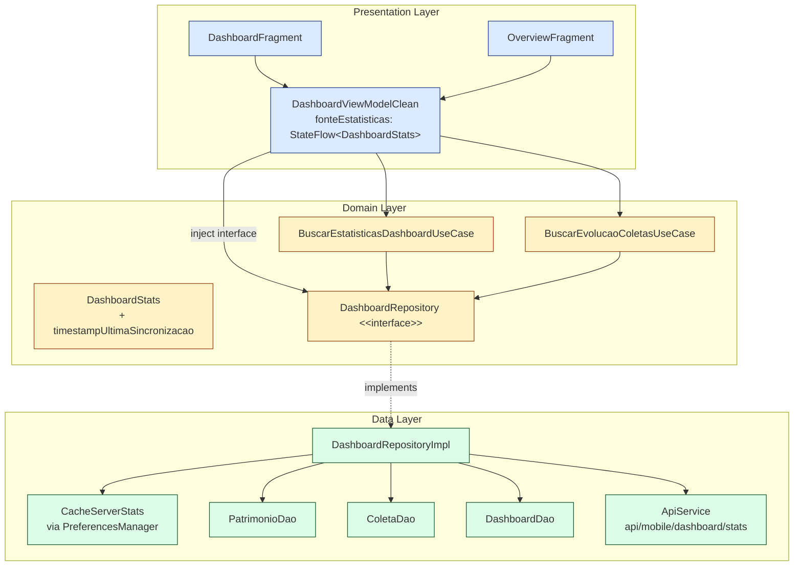
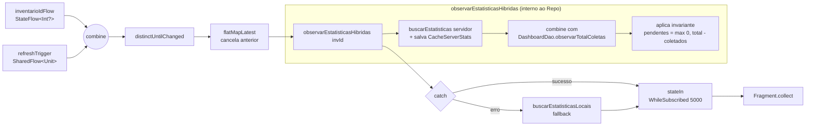

# Design Document

## Overview

Este documento descreve o design técnico do refactor `dashboard-refactor-clean`, que resolve três débitos técnicos identificados no Build #102 do app Android `InventarioMobile`:

1. **Item 1 (P7)** — consolidação dos dois `ViewModels` coexistentes (`DashboardViewModel` legado + `DashboardViewModelClean`) e das duas data classes `DashboardStats` (uma em `presentation.dashboard`, outra em `domain.model`) em uma única fonte alinhada a Clean Architecture.
2. **Item 2 (P1/P2)** — eliminação do duplo collector no `DashboardFragment` (hoje coleta `uiState` + `observarEstatisticasHibridas` em paralelo), substituído por uma única `FonteEstatisticas: StateFlow<DashboardStats>` exposta pelo `DashboardViewModelClean` via `stateIn(WhileSubscribed(5000))`.
3. **Item 3 (P6)** — implementação real de `DashboardRepositoryImpl.buscarEstatisticasLocais`, hoje um stub que zera `DashboardStats` quando o servidor está inacessível, passando a calcular `totalColetados`, `totalPendentes` e `percentualConclusao` exclusivamente a partir do Room (`PatrimonioDao`, `ColetaDao`, `DashboardDao`), persistindo um `CacheServerStats` a cada sincronização bem-sucedida.

O refactor é puramente técnico. **Nenhum contrato externo muda**: URLs de API, métodos HTTP, DTOs, layouts XML, schema Room e regras de negócio permanecem idênticos. As mudanças são confinadas aos pacotes `presentation.dashboard`, `presentation.statistics.OverviewFragment`, `data.repository.DashboardRepositoryImpl`, `domain.repository.DashboardRepository`, `domain.model.DashboardStats`, `di.RepositoryModule`, `di.DashboardModule` e arquivos correlatos de teste, conforme Requirement 5.8.

### Decisões-chave

- **Fonte única de verdade**: `DashboardViewModelClean` expõe `fonteEstatisticas: StateFlow<DashboardStats>` construído via `stateIn` com `SharingStarted.WhileSubscribed(5000)`. Todo consumidor (Fragment, OverviewFragment) coleta esse StateFlow — não há mais coleta paralela de `uiState` + `observarEstatisticasHibridas`.
- **Topologia reativa**: `combine(inventarioIdFlow, refreshTrigger).flatMapLatest { ... }` coordena uma busca ao servidor seguida de um `combine` com `DashboardDao.observarTotalColetas(invId)` (Room Flow reativo), com `catch` fazendo fallback para `buscarEstatisticasLocais`.
- **Persistência do `CacheServerStats`**: usaremos o `PreferencesManager` (`EncryptedSharedPreferences` já existente) em vez de criar uma nova tabela Room. Justificativa detalhada na seção [CacheServerStats](#cache-server-stats).
- **Offline-first real**: `buscarEstatisticasLocais` passa a ler `CacheServerStats` como fonte de `totalPatrimonios` e campos agregados do servidor (divergências, coletores ativos, valorTotal), combinando com `ColetaDao.buscarTodas(inventarioId)` para derivar `totalColetados` por `distinctBy { idPatrimonio }`.
- **Preservação visual do OverviewFragment**: `OverviewFragment` migra para `DashboardViewModelClean` via `@HiltViewModel` com `by activityViewModels()` ou `by viewModels()` conforme navegação interna da `StatisticsActivity`; os campos de UI continuam iguais e a tolerância é ≤ 0,01 para floats e igualdade exata para inteiros (Requirement 1.4).

---

## Architecture

### Camadas Clean Architecture envolvidas



### Princípios arquiteturais respeitados

- **Dependency Rule**: presentation depende de domain; data implementa interfaces de domain. `DashboardViewModelClean` injeta `DashboardRepository` (interface) e não `DashboardRepositoryImpl` (classe), atendendo Requirement 1.6 e 5.4.
- **Single Source of Truth**: o `StateFlow<DashboardStats>` exposto pelo ViewModel é a única origem de KPIs consumida pela UI.
- **Offline-first**: todo valor renderizado na UI deriva do Room. O servidor apenas atualiza o cache; o Room Flow (`observarTotalColetas`) dispara re-emissão reativa.
- **Preservação de contratos**: nenhum DTO, endpoint ou schema Room é alterado (Requirements 3.14, 5.1–5.3).

### Arquivos removidos

| Arquivo | Justificativa |
|---|---|
| `presentation/dashboard/DashboardViewModel.kt` | Legado, usado apenas por `OverviewFragment`; substituído por `DashboardViewModelClean` (Req 1.2). |
| `presentation/dashboard/DashboardViewModelFactory.kt` | Só existe para instanciar o ViewModel legado (Req 1.2). |
| `presentation.dashboard.DashboardStats` (data class dentro de `DashboardViewModel.kt`) | Duplicata; fonte única passa a ser `com.inventario.mobile.domain.model.DashboardStats` (Req 1.1). |
| `presentation.dashboard.DashboardUiState` (data class dentro de `DashboardViewModel.kt`) | Parte do ViewModel legado. |

### Arquivos modificados

| Arquivo | Natureza da mudança |
|---|---|
| `presentation/dashboard/DashboardViewModelClean.kt` | Passa a expor `fonteEstatisticas: StateFlow<DashboardStats>` via `stateIn(WhileSubscribed(5000))`. Remove `observarEstatisticasHibridas` público como fluxo separado. |
| `presentation/dashboard/DashboardFragment.kt` | Consome apenas `viewModel.fonteEstatisticas` — remove o segundo collector de `observarEstatisticasHibridas`. |
| `presentation/statistics/OverviewFragment.kt` | Migrado para `DashboardViewModelClean` via `by viewModels()` (Hilt), coletando `fonteEstatisticas`. |
| `domain/model/DashboardStats.kt` | Acrescenta campo `timestampUltimaSincronizacao: Long?` (Req 3.6, 4.3). |
| `domain/repository/DashboardRepository.kt` | Mantém assinatura; apenas documentação reforça contrato offline. |
| `data/repository/DashboardRepositoryImpl.kt` | Implementa `buscarEstatisticasLocais` real e persiste `CacheServerStats`. Reestrutura `observarEstatisticasHibridas` usando `combine + flatMapLatest` + catch para fallback. |
| `utils/PreferencesManager.kt` | Acrescenta métodos `saveCacheServerStats`/`getCacheServerStats`/`getCacheServerStatsTimestamp`/`clearCacheServerStats`. |
| `di/DashboardModule.kt` | Sem mudança estrutural; somente garante binding via interface. |
| `di/RepositoryModule.kt` | Sem mudança. |

---

## Components and Interfaces

### 1. `DashboardViewModelClean`

Responsabilidade: **gerenciar o estado reativo dos KPIs** e expor uma única `FonteEstatisticas`.

```kotlin
@HiltViewModel
class DashboardViewModelClean @Inject constructor(
    private val dashboardRepository: DashboardRepository,
    private val buscarEvolucaoColetasUseCase: BuscarEvolucaoColetasUseCase,
    private val preferencesManager: PreferencesManager
) : ViewModel() {

    // Inventário ativo observado como Flow para propagar mudanças
    private val inventarioIdFlow: StateFlow<Int?> =
        MutableStateFlow(preferencesManager.getInventarioAtivoId())

    // Disparador de refresh (pull-to-refresh e invalidações manuais)
    private val refreshTrigger = MutableSharedFlow<Unit>(
        replay = 1,
        extraBufferCapacity = 0,
        onBufferOverflow = BufferOverflow.DROP_OLDEST
    ).apply { tryEmit(Unit) } // emissão inicial

    /**
     * FonteEstatisticas — única origem de KPIs consumida pela UI.
     * Constraints:
     *   - stateIn(WhileSubscribed(5000)) preserva o último valor por 5 s após último subscriber (Req 2.2, 6.1, 6.2).
     *   - flatMapLatest cancela busca anterior ao refresh (Req 2.6 — dedup).
     *   - catch faz fallback para buscarEstatisticasLocais (Req 2.9).
     */
    val fonteEstatisticas: StateFlow<DashboardStats> =
        combine(inventarioIdFlow, refreshTrigger) { invId, _ -> invId }
            .distinctUntilChanged()
            .flatMapLatest { invId ->
                dashboardRepository.observarEstatisticasHibridas(invId)
            }
            .catch { e ->
                val invId = inventarioIdFlow.value
                val fallback = dashboardRepository
                    .buscarEstatisticasLocais(invId)
                    .getOrElse { DashboardStats.empty(invId, isOfflineData = true) }
                emit(fallback.copy(isOfflineData = true))
            }
            .stateIn(
                scope = viewModelScope,
                started = SharingStarted.WhileSubscribed(5000L),
                initialValue = DashboardStats.empty(preferencesManager.getInventarioAtivoId())
            )

    // Evolução de coletas (não-PBT, UI secundária — mantém estado separado)
    private val _evolucaoState = MutableStateFlow(EvolucaoUiState())
    val evolucaoState: StateFlow<EvolucaoUiState> = _evolucaoState.asStateFlow()

    fun refresh() {
        refreshTrigger.tryEmit(Unit)
    }

    fun loadColetasEvolucao(dias: Int = 30) { /* mantém implementação atual */ }
}
```

### 2. `DashboardFragment`

Responsabilidade: **renderizar KPIs** a partir de `fonteEstatisticas`. Um único `collect`.

```kotlin
private fun observeViewModel() {
    viewLifecycleOwner.lifecycleScope.launch {
        viewLifecycleOwner.repeatOnLifecycle(Lifecycle.State.STARTED) {
            viewModel.fonteEstatisticas.collect { stats ->
                renderizarKpis(stats)
                atualizarIndicadorOffline(stats.isOfflineData)
                atualizarTimestampUltimaSync(stats.timestampUltimaSincronizacao)
            }
        }
    }
}

private fun renderizarKpis(stats: DashboardStats) {
    binding.tvKpiColetados.text = stats.totalColetados.toString()
    binding.tvKpiPendentes.text = stats.totalPendentes.toString()
    binding.tvKpiDivergencias.text = stats.divergencias.toString()
    binding.tvKpiColetores.text = stats.coletoresAtivos.toString()
    binding.swipeRefresh.isRefreshing = false
}
```

### 3. `OverviewFragment`

Responsabilidade: **renderizar KPIs detalhados** para aba Estatísticas. Migra do `DashboardViewModel` + `DashboardViewModelFactory` para `DashboardViewModelClean` via Hilt.

```kotlin
@AndroidEntryPoint
class OverviewFragment : Fragment() {
    private val viewModel: DashboardViewModelClean by viewModels()

    override fun onViewCreated(view: View, savedInstanceState: Bundle?) {
        super.onViewCreated(view, savedInstanceState)
        binding.swipeRefresh.setOnRefreshListener { viewModel.refresh() }

        viewLifecycleOwner.lifecycleScope.launch {
            viewLifecycleOwner.repeatOnLifecycle(Lifecycle.State.STARTED) {
                viewModel.fonteEstatisticas.collect(::updateUI)
            }
        }
    }

    private fun updateUI(stats: DashboardStats) {
        binding.tvTotalPatrimonios.text = formatNumber(stats.totalPatrimonios)
        binding.tvColetados.text = formatNumber(stats.totalColetados)
        binding.tvPendentes.text = formatNumber(stats.totalPendentes)
        binding.tvDivergencias.text = stats.divergencias.toString()
        binding.tvColetores.text = stats.coletoresAtivos.toString()
        binding.tvPercentualConclusao.text = String.format("%.1f%%", stats.percentualConclusao)
        binding.progressConclusao.progress = stats.percentualConclusao.toInt()
        binding.tvPercentualPendente.text = String.format("%.1f%%", 100.0 - stats.percentualConclusao)
        binding.tvValorTotal.text = formatCurrency(stats.valorTotal)
        val valorMedio = if (stats.totalPatrimonios > 0) stats.valorTotal / stats.totalPatrimonios else 0.0
        binding.tvValorMedio.text = formatCurrency(valorMedio)
        binding.swipeRefresh.isRefreshing = false
    }
}
```

### 4. `DashboardRepositoryImpl`

Responsabilidade: **coordenar servidor + Room + CacheServerStats** e computar estatísticas offline reais.

```kotlin
class DashboardRepositoryImpl @Inject constructor(
    private val apiService: ApiService,
    private val mapper: DashboardMapper,
    private val dashboardDao: DashboardDao,
    private val patrimonioDao: PatrimonioDao,      // NOVO: injetado
    private val coletaDao: ColetaDao,              // NOVO: injetado
    private val preferencesManager: PreferencesManager
) : DashboardRepository {

    override suspend fun buscarEstatisticas(inventarioId: Int?): Result<DashboardStats> {
        return runCatching {
            val response = if (inventarioId != null && inventarioId > 0)
                apiService.getDashboardStatsWithInventario(inventarioId)
            else
                apiService.getDashboardStats()
            if (!response.isSuccessful) error("HTTP ${response.code()}")
            val body = response.body() ?: error("Empty body")
            if (!body.success || body.data == null) error(body.message ?: "API error")
            val stats = mapper.toDomain(body.data).copy(
                timestampUltimaSincronizacao = System.currentTimeMillis(),
                isOfflineData = false
            )
            preferencesManager.saveCacheServerStats(stats)  // (Req 3.8)
            stats
        }
    }

    override suspend fun buscarEstatisticasLocais(inventarioId: Int?): Result<DashboardStats> {
        return runCatching {
            val invId = inventarioId ?: preferencesManager.getInventarioAtivoId() ?: 0
            val cache = preferencesManager.getCacheServerStats()

            // 1) totalPatrimonios: cache → PatrimonioDao.countAll() → 0
            val totalPatrimonios = cache?.totalPatrimonios
                ?: runCatching { patrimonioDao.countAll() }.getOrElse { 0 }

            // 2) totalColetados: distinct idPatrimonio em coleta(inventario)
            val totalColetados = runCatching {
                coletaDao.buscarTodas(invId).distinctBy { it.idPatrimonio }.size
            }.getOrElse { 0 }

            // 3) totalPendentes: max(0, totalPatrimonios - totalColetados)  (Req 3.13)
            val totalPendentes = maxOf(0, totalPatrimonios - totalColetados)

            // 4) percentualConclusao (Req 3.2)
            val percentual = if (totalPatrimonios > 0)
                (totalColetados * 100.0) / totalPatrimonios
            else 0.0

            DashboardStats(
                totalPatrimonios = totalPatrimonios,
                totalColetados = totalColetados,
                totalPendentes = totalPendentes,
                percentualConclusao = roundTo2(percentual),
                divergencias = cache?.divergencias ?: 0,
                coletoresAtivos = cache?.coletoresAtivos ?: 0,
                valorTotal = cache?.valorTotal ?: 0.0,
                inventarioId = invId.takeIf { it > 0 },
                inventarioNome = cache?.inventarioNome,
                timestampUltimaSincronizacao = cache?.timestamp,   // null se não sincronizou
                isOfflineData = true
            )
        }.recoverCatching { e ->
            Log.e(TAG, "SQLiteException em buscarEstatisticasLocais, retornando zeros", e)
            DashboardStats.empty(inventarioId, isOfflineData = true)
                .copy(timestampUltimaSincronizacao = preferencesManager.getCacheServerStats()?.timestamp)
        }
    }

    override fun observarEstatisticasHibridas(inventarioId: Int?): Flow<DashboardStats> {
        val invId = inventarioId ?: preferencesManager.getInventarioAtivoId() ?: 0
        return flow {
            // 1) Base do servidor (com persistência de cache). Se falhar, cai no catch.
            val base = buscarEstatisticas(inventarioId).getOrThrow()
            // 2) Combina com Flow de coletas locais não-sincronizadas
            emitAll(
                dashboardDao.observarTotalColetas(invId).map { totalLocais ->
                    val coletadosAtualizado = base.totalColetados + totalLocais
                    val pendentesAtualizado = maxOf(0, base.totalPatrimonios - coletadosAtualizado)
                    val percentual = if (base.totalPatrimonios > 0)
                        (coletadosAtualizado * 100.0) / base.totalPatrimonios
                    else 0.0
                    base.copy(
                        totalColetados = coletadosAtualizado,
                        totalPendentes = pendentesAtualizado,
                        percentualConclusao = roundTo2(percentual)
                    )
                }
            )
        }.catch { e ->
            // Fallback: estatísticas locais
            val local = buscarEstatisticasLocais(inventarioId)
                .getOrElse { DashboardStats.empty(inventarioId, isOfflineData = true) }
            emit(local.copy(isOfflineData = true))
            // Continua reativo às mudanças locais mesmo offline
            emitAll(
                dashboardDao.observarTotalColetas(invId).map { totalLocais ->
                    val base = local
                    val coletadosAtualizado = base.totalColetados + totalLocais
                    val pendentesAtualizado = maxOf(0, base.totalPatrimonios - coletadosAtualizado)
                    base.copy(
                        totalColetados = coletadosAtualizado,
                        totalPendentes = pendentesAtualizado,
                        percentualConclusao = if (base.totalPatrimonios > 0)
                            roundTo2((coletadosAtualizado * 100.0) / base.totalPatrimonios)
                        else 0.0,
                        isOfflineData = true
                    )
                }
            )
        }
    }

    private fun roundTo2(v: Double): Double = Math.round(v * 100.0) / 100.0
}
```

### 5. `PreferencesManager` (extensão)

```kotlin
// Novos campos:
fun saveCacheServerStats(stats: DashboardStats) {
    prefs.edit().apply {
        putInt("cache_server_total_patrimonios", stats.totalPatrimonios)
        putInt("cache_server_total_coletados", stats.totalColetados)
        putInt("cache_server_divergencias", stats.divergencias)
        putInt("cache_server_coletores_ativos", stats.coletoresAtivos)
        putFloat("cache_server_valor_total", stats.valorTotal.toFloat())
        putString("cache_server_inventario_nome", stats.inventarioNome ?: "")
        putInt("cache_server_inventario_id", stats.inventarioId ?: 0)
        putLong("cache_server_timestamp", System.currentTimeMillis())
    }.apply()
}

fun getCacheServerStats(): CacheServerStats? {
    val ts = getLong("cache_server_timestamp", 0L)
    if (ts == 0L) return null
    return CacheServerStats(
        totalPatrimonios = getInt("cache_server_total_patrimonios", 0),
        totalColetados = getInt("cache_server_total_coletados", 0),
        divergencias = getInt("cache_server_divergencias", 0),
        coletoresAtivos = getInt("cache_server_coletores_ativos", 0),
        valorTotal = getFloat("cache_server_valor_total", 0f).toDouble(),
        inventarioNome = getString("cache_server_inventario_nome", "").takeIf { it.isNotEmpty() },
        inventarioId = getInt("cache_server_inventario_id", 0).takeIf { it > 0 },
        timestamp = ts
    )
}

fun clearCacheServerStats() { /* remove todas as chaves cache_server_* */ }
```

---

## Data Models

### `DashboardStats` (domain/model) — fonte única após refactor

```kotlin
data class DashboardStats(
    val totalPatrimonios: Int,
    val totalColetados: Int,
    val totalPendentes: Int,
    val percentualConclusao: Double,
    val coletoresAtivos: Int = 0,
    val divergencias: Int = 0,
    val valorTotal: Double = 0.0,
    val inventarioId: Int? = null,
    val inventarioNome: String? = null,
    val coletasHoje: Int = 0,
    val coletasSemana: Int = 0,
    val coletasMes: Int = 0,
    val tempoMedioColeta: Double = 0.0,
    val isOfflineData: Boolean = false,
    // NOVO (Req 3.6, 4.3)
    val timestampUltimaSincronizacao: Long? = null
) {
    companion object {
        fun empty(inventarioId: Int? = null, isOfflineData: Boolean = false) = DashboardStats(
            totalPatrimonios = 0,
            totalColetados = 0,
            totalPendentes = 0,
            percentualConclusao = 0.0,
            inventarioId = inventarioId,
            isOfflineData = isOfflineData,
            timestampUltimaSincronizacao = null
        )
    }

    init {
        require(totalColetados >= 0) { "totalColetados deve ser >= 0" }
        require(totalPendentes >= 0) { "totalPendentes deve ser >= 0" }
        require(totalPatrimonios >= 0) { "totalPatrimonios deve ser >= 0" }
    }
}
```

### `CacheServerStats` (data/model, POJO)

Representa a última resposta bem-sucedida do endpoint base `GET /api/mobile/dashboard/stats`. Persistido em `PreferencesManager` (`EncryptedSharedPreferences`).

```kotlin
data class CacheServerStats(
    val totalPatrimonios: Int,
    val totalColetados: Int,
    val divergencias: Int,
    val coletoresAtivos: Int,
    val valorTotal: Double,
    val inventarioNome: String?,
    val inventarioId: Int?,
    val timestamp: Long // milissegundos UTC da sincronização
)
```

### <a name="cache-server-stats"></a>Persistência do `CacheServerStats` — decisão e justificativa

Duas alternativas foram avaliadas:

| Critério | `PreferencesManager` (recomendado) | Nova tabela Room `dashboard_stats_cache` |
|---|---|---|
| Volume de dados | 7 primitivos + 1 string — trivial | Idem |
| Requer migração de schema | **Não** | **Sim** (viola Req 3.14) |
| Esforço de implementação | Baixo — API já existe | Médio — requer entity + DAO + migration |
| Impacto em outros módulos | Nenhum | Migration afeta build #103 em diante |
| Segurança | `EncryptedSharedPreferences` (AES256-GCM) | SQLite plain (ou SQLCipher) |
| Reatividade | Não reativo (leitura pontual) | `Flow` disponível |

**Decisão: `PreferencesManager`.** O dado é um "snapshot" lido de forma pontual no fallback offline, não precisa de reatividade (a reatividade vem de `DashboardDao.observarTotalColetas`). A alternativa Room conflita com Requirement 3.14 ("nenhuma nova coluna ou migração de schema deve ser introduzida pela feature"). A tabela existente `dashboard_stats` é uma *view de agregação* do Room, não serve como cache de resposta do servidor.

---

## Topologia da `FonteEstatisticas`



### Cenários

#### Cenário A — Online, primeira inscrição
1. `inventarioIdFlow` emite o id ativo.
2. `refreshTrigger` emite Unit inicial (replay=1).
3. `flatMapLatest` inicia `observarEstatisticasHibridas(invId)`.
4. Repository chama `apiService.getDashboardStats(...)` **uma única vez**, persiste `CacheServerStats`.
5. Room Flow `observarTotalColetas(invId)` emite 0 (nenhuma coleta local não-sincronizada).
6. UI recebe `stats` com `isOfflineData = false`, `timestampUltimaSincronizacao = now`.

**Cobre:** Req 2.7, Req 7.1.

#### Cenário B — Online, nova coleta registrada em Room
1. Nova `ColetaEntity` inserida (ex.: após scan).
2. `observarTotalColetas(invId)` (Room Flow) emite `totalLocais + 1`.
3. Repository recombina: `totalColetados = base.totalColetados + (totalLocais+1)`, recalcula `percentualConclusao`.
4. UI recebe novo `DashboardStats` em ≤ 1000 ms **sem chamada HTTP**.

**Cobre:** Req 2.8, Req 3.12, Req 7.3.

#### Cenário C — Pull-to-refresh online
1. Usuário aciona `SwipeRefreshLayout`.
2. Fragment chama `viewModel.refresh()`.
3. `refreshTrigger.tryEmit(Unit)` — `flatMapLatest` **cancela** inscrição anterior e inicia nova.
4. Única nova chamada HTTP ao endpoint base.
5. Se usuário refaz o gesto dentro do mesmo ciclo antes da primeira completar: `flatMapLatest` cancela o upstream em andamento; `SharedFlow` com `replay=1` + `DROP_OLDEST` garante deduplicação.

**Cobre:** Req 2.5, Req 2.6, Req 7.2.

#### Cenário D — Offline (servidor inacessível)
1. `buscarEstatisticas` lança `IOException`/`SocketTimeoutException`/`UnknownHostException`.
2. `observarEstatisticasHibridas` cai no `catch`, faz fallback para `buscarEstatisticasLocais`.
3. `buscarEstatisticasLocais`:
   - lê `CacheServerStats` (se existe) → `totalPatrimonios`, `divergencias`, `coletoresAtivos`, `valorTotal`, `timestamp`;
   - se cache vazio, usa `patrimonioDao.countAll()`;
   - `totalColetados = coletaDao.buscarTodas(invId).distinctBy { idPatrimonio }.size`;
   - `totalPendentes = max(0, totalPatrimonios - totalColetados)`.
4. UI renderiza com `isOfflineData = true`; Fragment mostra indicador offline via `updateOfflineIndicator`.
5. `observarTotalColetas` continua reativo: novas coletas em campo aparecem instantaneamente.

**Cobre:** Req 2.9, Req 3.1, Req 3.3–3.10, Req 4.1, Req 7.3.

#### Cenário E — Rotação de tela dentro de 5 s
1. `DashboardFragment` é destruído; último subscriber do StateFlow se desregistra.
2. `WhileSubscribed(5000)` mantém upstream ativo por até 5000 ms.
3. Fragment recriado em < 5000 ms: re-subscreve ao mesmo StateFlow, recebe imediatamente o último valor **sem** nova chamada HTTP.
4. Se rotação > 5000 ms: upstream é cancelado; próxima inscrição recria `observarEstatisticasHibridas` e dispara nova chamada.

**Cobre:** Req 6.1, Req 6.2, Req 6.3, Req 6.4, Req 6.5.

---

## Error Handling

### Matriz de exceções e respostas

| Origem | Exceção | Tratamento | Efeito visível |
|---|---|---|---|
| `apiService.getDashboardStats*` | `IOException`, `SocketTimeoutException`, `UnknownHostException` | `runCatching` em `buscarEstatisticas` → `Result.failure` → `catch` do Flow híbrido → fallback para `buscarEstatisticasLocais` | UI renderiza com `isOfflineData = true`; indicador offline aparece (Req 2.9, 4.1) |
| `apiService.getDashboardStats*` | `HttpException` (status ≥ 400) | Igual ao anterior (Req 3.7) | Igual |
| `preferencesManager.getCacheServerStats` | Corrupção/chave ausente | `getCacheServerStats` retorna `null`; cai no fallback para `PatrimonioDao.countAll()` (Req 3.3, 3.9) | Se `countAll = 0` → zeros com `isOfflineData=true` (Req 3.10) |
| `PatrimonioDao.countAll`, `ColetaDao.buscarTodas` | `SQLiteException` | `runCatching { ... }.getOrElse { 0 }` isolado por query; se múltiplas falham, `recoverCatching` no `buscarEstatisticasLocais` retorna `DashboardStats.empty(isOfflineData=true)` + log (Req 3.11) | UI mostra zeros com indicador offline; nenhum crash |
| `DashboardDao.observarTotalColetas` | `SQLiteException` em mid-stream | `catch` no Flow do ViewModel emite fallback uma vez | UI preserva último valor válido, depois mostra fallback |
| `StateFlow` subscriber inativo > 5000 ms | — | `WhileSubscribed(5000)` cancela upstream (Req 6.3) | Próxima inscrição refaz fetch |

### Invariantes sempre preservadas

Em qualquer ramo de código que emita `DashboardStats`, as seguintes invariantes são impostas:

- **I1 (Não-negatividade)**: `totalColetados ≥ 0`, `totalPendentes ≥ 0`, `totalPatrimonios ≥ 0` — verificadas em `DashboardStats.init {}`.
- **I2 (Soma consistente)**: `totalColetados + totalPendentes == totalPatrimonios` quando `totalPatrimonios > 0` — garantida por `totalPendentes = max(0, totalPatrimonios - totalColetados)`.
- **I3 (Percentual)**: `percentualConclusao == roundTo2((totalColetados * 100.0) / totalPatrimonios)` quando `totalPatrimonios > 0`, senão `0.0`.
- **I4 (Offline flag)**: `isOfflineData == true` em todo retorno de `buscarEstatisticasLocais` ou fallback (Req 3.5).
- **I5 (Timestamp)**: `timestampUltimaSincronizacao` reflete `CacheServerStats.timestamp` quando existe, senão `null` (Req 3.6, 4.4).

---

## Acceptance Criteria Testing Prework

<!-- Prework gerada pela ferramenta prework — ver seção após Data Models no workflow. -->

(Ver seção "Correctness Properties" abaixo — o prework formal foi executado via ferramenta `prework` antes da elaboração das propriedades.)


---

## Correctness Properties

*Uma propriedade é uma característica ou comportamento que deve ser verdadeiro em todas as execuções válidas do sistema — essencialmente uma afirmação formal sobre o que o software deve fazer. Propriedades servem como ponte entre especificações legíveis por humanos e garantias de corretude verificáveis por máquina.*

### Aplicabilidade de PBT a esta feature

Esta feature **é parcialmente adequada a property-based testing**. As camadas que expõem lógica pura e universal — `DashboardRepositoryImpl.buscarEstatisticasLocais`, invariantes do `DashboardStats`, deduplicação de refresh via `flatMapLatest + stateIn(WhileSubscribed)` — são ótimos candidatos a PBT. Os aspectos de wiring (Hilt, imports, existência de arquivos) e de UI (visibilidade de indicadores, disparo de Snackbar) não se beneficiam de 100+ iterações e serão cobertos por smoke tests e exemplos.

### Property Reflection (consolidação)

A análise de prework identificou redundâncias que foram consolidadas:

| Propriedades originais | Consolidadas em | Justificativa |
|---|---|---|
| 2.7 (1 call/ciclo) + 6.1 (rotação <5s) + 6.2 (navegação <5s) + 6.3 (navegação >5s) | **P3 — Deduplicação por `WhileSubscribed(5000)`** | Todas descrevem a mesma regra: "nº chamadas HTTP ≤ 1 por ciclo de inscrição de 5000 ms". Um único generator que cobre rotações, navegações e timings arbitrários valida as quatro. |
| 2.8 (coleta local ≤1000 ms) + 3.12 (Flow emite ≤1000 ms) | **P5 — Reatividade de coleta local** | Mesma garantia observável. |
| 2.10 + 3.13 (soma coletados+pendentes=total) | **P6 — Invariante de soma** | Invariante universal válida em toda emissão. |
| 2.11 + 3.2 (fórmula percentual) | **P7 — Fórmula de percentualConclusao** | Mesma fórmula. |
| 1.4 + 7.6 (paridade OverviewFragment vs legado) | **P1 — Paridade visual** | Mesma garantia aplicada à mesma saída. |
| 3.5 (isOfflineData=true) + 3.7 (fallback em exceção) | **P8 — Contrato offline** | Consolidadas numa propriedade que afirma "toda emissão resultante de falha de rede ou de buscarEstatisticasLocais tem `isOfflineData == true` e é igual ao retorno de `buscarEstatisticasLocais`". |

As propriedades abaixo são as remanescentes após consolidação.

---

### Property 1: Paridade visual OverviewFragment vs legado

*Para qualquer* `DashboardStatsDto` válido devolvido pelo stub do servidor, os campos renderizados pelo `OverviewFragment` migrado para `DashboardViewModelClean` são iguais — igualdade exata para os inteiros `totalPatrimonios`, `totalColetados`, `totalPendentes`, `divergencias`, `coletoresAtivos`; diferença absoluta ≤ 0,01 para os floats `percentualConclusao`, `valorTotal` e `valorMedio` — em relação ao valor que seria renderizado pelo `DashboardViewModel` legado consumindo o mesmo DTO.

**Validates: Requirements 1.4, 7.6**

### Property 2: Invariantes estruturais do `DashboardStats`

*Para qualquer* emissão `stats: DashboardStats` produzida pelo pipeline (`fonteEstatisticas`, `observarEstatisticasHibridas` ou `buscarEstatisticasLocais`), vale simultaneamente: `stats.totalColetados ≥ 0`, `stats.totalPendentes ≥ 0`, `stats.totalPatrimonios ≥ 0`.

**Validates: Requirements 2.12**

### Property 3: Deduplicação por `WhileSubscribed(5000)`

*Para qualquer* sequência de eventos de lifecycle (inscrição, cancelamento, rotação, navegação) que mantenha a assinatura ativa por uma janela ininterrupta de ≤ 5000 ms sem nenhum PullToRefresh novo, o número de chamadas observadas ao endpoint base `GET /api/mobile/dashboard/stats` (ou variante com `?inventarioId=`) é igual a 1 quando o ciclo começa em estado online bem-sucedido.

**Validates: Requirements 2.7, 6.1, 6.2, 6.3**

### Property 4: Deduplicação de PullToRefresh concorrente

*Para qualquer* sequência de `N ∈ [2, 20]` invocações consecutivas de `viewModel.refresh()` emitidas dentro de uma janela menor que o tempo de resposta do mock HTTP, o número de chamadas HTTP *ativas* ao endpoint base simultaneamente permanece ≤ 1, pois `flatMapLatest` cancela a inscrição anterior antes de iniciar a nova.

**Validates: Requirements 2.5, 2.6**

### Property 5: Reatividade de coleta local sem rede adicional

*Para qualquer* inserção em `ColetaDao` (qualquer `ColetaEntity` válida com `idInventario = invId` e `sincronizado = false`), a próxima emissão de `fonteEstatisticas` ocorre em até 1000 ms e reflete o incremento em `totalColetados`; durante esse intervalo, o número de chamadas HTTP ao endpoint base *não* aumenta.

**Validates: Requirements 2.8, 3.12**

### Property 6: Invariante de soma

*Para qualquer* emissão `stats` produzida pelo pipeline em que `stats.totalPatrimonios > 0`, vale `stats.totalColetados + stats.totalPendentes == stats.totalPatrimonios`; quando `stats.totalPatrimonios == 0`, vale `stats.totalColetados == 0 ∧ stats.totalPendentes == 0`.

**Validates: Requirements 2.10, 3.13**

### Property 7: Fórmula de `percentualConclusao`

*Para qualquer* emissão `stats`, `|stats.percentualConclusao − esperado| ≤ 0,01`, onde `esperado = (stats.totalColetados * 100.0) / stats.totalPatrimonios` se `stats.totalPatrimonios > 0`, e `esperado = 0.0` caso contrário.

**Validates: Requirements 2.11, 3.2**

### Property 8: Contrato offline — `buscarEstatisticasLocais` e fallback de rede

*Para qualquer* cenário em que o servidor lança `IOException`, `HttpException`, `SocketTimeoutException`, `UnknownHostException` ou resposta HTTP com status ≥ 400, a próxima emissão de `fonteEstatisticas` é **igual** ao resultado de `dashboardRepository.buscarEstatisticasLocais(invId)` no mesmo instante, e possui `isOfflineData == true`.

**Validates: Requirements 2.9, 3.5, 3.7**

### Property 9: Fonte de `totalPatrimonios` em modo offline

*Para qualquer* estado do `CacheServerStats` e do `PatrimonioDao`: se `CacheServerStats` existe, então `buscarEstatisticasLocais(invId).totalPatrimonios == CacheServerStats.totalPatrimonios`; se `CacheServerStats` está vazio, então `buscarEstatisticasLocais(invId).totalPatrimonios == PatrimonioDao.countAll()`; se ambos estão vazios, então `totalPatrimonios == 0 ∧ percentualConclusao == 0.0 ∧ isOfflineData == true`.

**Validates: Requirements 3.3, 3.9, 3.10**

### Property 10: `totalColetados` como distinct idPatrimonio

*Para qualquer* lista de `ColetaEntity` persistida no Room para `invId`, o valor `buscarEstatisticasLocais(invId).totalColetados` é igual a `coletaDao.buscarTodas(invId).distinctBy { it.idPatrimonio }.size`, independentemente do valor do campo `sincronizado` (distintos por `idPatrimonio` não são contados duas vezes).

**Validates: Requirements 3.4**

### Property 11: Persistência de `CacheServerStats` após sucesso do servidor

*Para qualquer* `DashboardStatsDto` válido retornado com `success = true`, após `buscarEstatisticas(invId)` retornar `Result.success(...)`, o valor lido por `preferencesManager.getCacheServerStats()` satisfaz: `getCacheServerStats().totalPatrimonios == dto.totalPatrimonios`, `getCacheServerStats().totalColetados == dto.patrimoniosColetados`, `getCacheServerStats().divergencias == dto.divergencias`, `getCacheServerStats().coletoresAtivos == dto.coletoresAtivos`, `getCacheServerStats().valorTotal == dto.valorTotal`, e `getCacheServerStats().timestamp ≥ t0` onde `t0` é o instante imediatamente anterior à chamada.

**Validates: Requirements 3.6, 3.8**

### Property 12: Segurança sob `SQLiteException`

*Para qualquer* conjunto não vazio de queries de `PatrimonioDao`/`ColetaDao`/`DashboardDao` que lancem `SQLiteException`, `buscarEstatisticasLocais(invId)` **nunca propaga exceção**, sempre retorna `Result.success(...)` com `totalPatrimonios = 0`, `totalColetados = 0`, `totalPendentes = 0`, `percentualConclusao = 0.0` e `isOfflineData = true`.

**Validates: Requirements 3.11**

### Property 13: Idempotência de invalidação do `CacheServerStats`

*Para qualquer* sequência de `N ∈ [1, 50]` operações escolhidas em `{refresh, coleta_local, invalidar_cache}` aplicadas a um servidor stub determinístico (mesma resposta a cada chamada), o resultado final em `fonteEstatisticas` após aplicar a sequência é igual ao resultado obtido ao substituir qualquer subsequência `[invalidar_cache, invalidar_cache]` por `[invalidar_cache]` (idempotência de invalidação dupla).

**Validates: Requirements 7.5**

### Property 14: Exatamente um collector sobre `fonteEstatisticas`

*Para qualquer* sequência de `K ∈ [1, 20]` rotações ou reconfigurações do `DashboardFragment`, em qualquer ponto da execução em que `viewLifecycleOwner` esteja em estado `STARTED`, vale `fonteEstatisticas.subscriptionCount.value == 1`.

**Validates: Requirements 2.4, 6.4**

---

## Testing Strategy

### Abordagem dupla

- **Unit tests (exemplos)**: verificam comportamentos específicos e configuração (visibilidade de indicador offline, existência de símbolos, binding Hilt).
- **Property-based tests**: validam invariantes universais (propriedades 1–14 acima).
- **Smoke/estruturais**: verificam refactor estático (arquivos removidos, imports proibidos, endpoints inalterados).
- **Integration tests (Espresso + MockWebServer)**: validam os cenários end-to-end de Requirement 7.1, 7.2 e 7.3, mais o smoke de regressão de Requirement 5.9.

### Biblioteca PBT escolhida

Uso de **Kotest Property Testing** (`io.kotest:kotest-property`), já compatível com o stack Kotlin + JUnit5 do projeto Android, integrável com `runTest` da biblioteca de coroutines. Não implementaremos PBT do zero.

### Configuração mínima

Cada property-based test:

- Executa **no mínimo 100 iterações** (`PropertyTesting.defaultIterations = 100` ou `config(iterations = 100)` por teste).
- Leva um comentário de cabeçalho no formato:

  ```
  // Feature: dashboard-refactor-clean, Property <N>: <property_text>
  ```

- Mapeia uma única propriedade do design a um único teste property-based (1:1).
- Usa geradores Kotest (`Arb.int(0..1_000_000)`, `Arb.list(...)`, `Arb.choice(...)` para tipos de exceção) cobrindo explicitamente casos-limite: `totalPatrimonios = 0`, `totalColetados = 0`, listas vazias, duplicatas de `idPatrimonio`, falhas concorrentes.

### Estrutura de testes

```
InventarioMobile/app/src/test/java/com/inventario/mobile/dashboard/
  DashboardStatsPropertiesTest.kt            ← P2, P6, P7 (invariantes puras)
  DashboardRepositoryImplPropertiesTest.kt   ← P8, P9, P10, P11, P12
  FonteEstatisticasPropertiesTest.kt         ← P3, P4, P5, P13, P14
  OverviewParityPropertyTest.kt              ← P1
  CacheServerStatsExampleTest.kt             ← exemplos (init/empty/roundTrip PreferencesManager)
  DashboardFragmentOfflineIndicatorTest.kt   ← 4.1–4.5 (Robolectric + Espresso-Contrib)
  DashboardFragmentIntegrationTest.kt        ← Requirement 7.1, 7.2, 7.3 (MockWebServer)

InventarioMobile/app/src/androidTest/java/com/inventario/mobile/dashboard/
  DashboardMigrationSmokeTest.kt             ← Requirements 1.1, 1.2, 1.3, 1.5, 1.6, 5.4, 5.5, 5.6
  EndpointContractSnapshotTest.kt            ← Requirements 5.1, 5.2, 5.3
```

### Dependências já disponíveis no projeto

- `kotlinx-coroutines-test` (`runTest`, `TestCoroutineScheduler`) — para simular `WhileSubscribed(5000)` e coletas locais com tempo virtual.
- `hilt-android-testing` — para instrumentar o binding do `DashboardViewModelClean` no `OverviewFragment`.
- `MockWebServer` — para contar chamadas a `api/mobile/dashboard/stats`.
- `Robolectric` — para simular rotação de tela sem precisar de emulador nos testes unitários do Fragment.

### Dependência a adicionar

```gradle
testImplementation "io.kotest:kotest-property:5.8.0"
testImplementation "io.kotest:kotest-runner-junit5:5.8.0"
testImplementation "io.kotest:kotest-assertions-core:5.8.0"
```

### Cobertura de critérios por tipo de teste

| Critério | Tipo | Arquivo |
|---|---|---|
| 1.1, 1.2, 1.3, 1.5, 1.6, 1.7 | SMOKE / Reflection | `DashboardMigrationSmokeTest` |
| 1.4, 7.6 | PROPERTY (P1) | `OverviewParityPropertyTest` |
| 2.1 | SMOKE | `DashboardMigrationSmokeTest` |
| 2.2 | EXAMPLE | `FonteEstatisticasExampleTest` (timing WhileSubscribed) |
| 2.3 | EXAMPLE | `DashboardFragmentIntegrationTest` |
| 2.4, 6.4 | PROPERTY (P14) | `FonteEstatisticasPropertiesTest` |
| 2.5, 2.6 | PROPERTY (P4) + EXAMPLE | `FonteEstatisticasPropertiesTest` + `DashboardFragmentIntegrationTest` |
| 2.7, 6.1–6.3 | PROPERTY (P3) | `FonteEstatisticasPropertiesTest` |
| 2.8, 3.12 | PROPERTY (P5) | `FonteEstatisticasPropertiesTest` |
| 2.9, 3.5, 3.7 | PROPERTY (P8) | `DashboardRepositoryImplPropertiesTest` |
| 2.10, 3.13 | PROPERTY (P6) | `DashboardStatsPropertiesTest` |
| 2.11, 3.2 | PROPERTY (P7) | `DashboardStatsPropertiesTest` |
| 2.12 | PROPERTY (P2) | `DashboardStatsPropertiesTest` |
| 3.1 | EXAMPLE | `CacheServerStatsExampleTest` (mock apiService nunca chamado) |
| 3.3, 3.9, 3.10 | PROPERTY (P9) | `DashboardRepositoryImplPropertiesTest` |
| 3.4 | PROPERTY (P10) | `DashboardRepositoryImplPropertiesTest` |
| 3.6, 3.8 | PROPERTY (P11) | `DashboardRepositoryImplPropertiesTest` |
| 3.11 | PROPERTY (P12) | `DashboardRepositoryImplPropertiesTest` |
| 3.14 | SMOKE | `EndpointContractSnapshotTest` (version check) |
| 4.1–4.5 | EXAMPLE | `DashboardFragmentOfflineIndicatorTest` |
| 5.1–5.3 | SMOKE | `EndpointContractSnapshotTest` |
| 5.4 | SMOKE | `DashboardMigrationSmokeTest` (Konsist) |
| 5.5, 5.6 | SMOKE | `DashboardMigrationSmokeTest` |
| 5.7 | INTEGRATION (CI) | Step de CI valida diff do `BUILD_HISTORY.md` |
| 5.8 | SMOKE | PR check (CODEOWNERS whitelist) |
| 5.9 | INTEGRATION | Smoke test manual documentado |
| 6.5 | PROPERTY | `FonteEstatisticasPropertiesTest` |
| 7.1, 7.2, 7.3 | INTEGRATION (Espresso + MockWebServer) | `DashboardFragmentIntegrationTest` |
| 7.4 | PROPERTY | já coberto por P2, P6, P7 com `iterations = 100` |
| 7.5 | PROPERTY (P13) | `FonteEstatisticasPropertiesTest` |

### Critérios não-testáveis formalmente

Nenhum critério do escopo é puramente "não testável" (estilo Requirement 8 de exemplo da steering sobre separação de camadas). Itens estruturais (ex.: 5.7, 5.8) são testáveis indiretamente por hooks de CI, não por PBT.

### Revisão e aprovação

Este design deve ser aprovado antes da geração de `tasks.md`. Pontos principais para revisão humana:

1. **Escolha de `PreferencesManager` para `CacheServerStats`** — alternativa seria uma nova tabela Room, rejeitada por violar Req 3.14.
2. **Uso de `stateIn(WhileSubscribed(5000))`** — alinhado com Req 2.2 e 6.1–6.3. Alternativas como `SharingStarted.Eagerly` ou `Lazily` violariam a semântica de "cache de 5 s após o último subscriber".
3. **Migração `OverviewFragment`** — adota `by viewModels()` com Hilt; uma alternativa seria `activityViewModels()` para compartilhar estado com outras abas da `StatisticsActivity`, mas isso exigiria avaliar o ciclo de vida das outras abas (`ChartsFragment`, `RankingsFragment`) e não está no escopo definido em Req 5.8.
