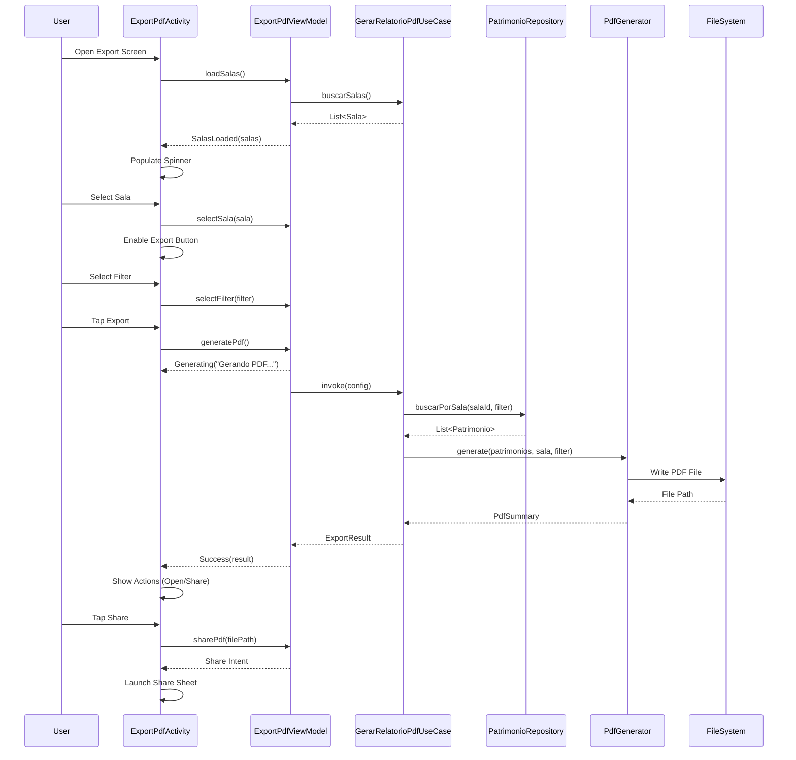

# Design Document - Exportação de PDF Android

## Overview

Esta funcionalidade permite aos usuários do aplicativo Android de inventário gerar relatórios em PDF dos patrimônios de uma sala específica. O usuário pode filtrar por status de coleta (Todos, Coletados, Não Coletados) e o relatório inclui um somatório ao final do documento.

A implementação segue Clean Architecture + MVVM, utilizando a biblioteca iTextPDF para geração de documentos e integrando-se com o sistema de salas e patrimônios existente.

## Architecture

```
┌─────────────────────────────────────────────────────────────┐
│                  ExportPdfActivity (View)                    │
│  - Seleção de sala (Spinner/AutoComplete)                   │
│  - Filtros de status (RadioGroup)                           │
│  - Botão de exportação                                      │
│  - Indicador de progresso                                   │
└──────────────────────┬──────────────────────────────────────┘
                       │ observa StateFlow
                       ▼
┌─────────────────────────────────────────────────────────────┐
│              ExportPdfViewModel (ViewModel)                  │
│  - Gerencia ExportPdfState (sealed class)                   │
│  - Coordena Use Cases                                       │
│  - Valida seleções do usuário                               │
└──────────────────────┬──────────────────────────────────────┘
                       │ chama
                       ▼
┌─────────────────────────────────────────────────────────────┐
│                    Use Cases (Domain)                        │
│  - BuscarSalasUseCase                                       │
│  - BuscarPatrimoniosPorSalaUseCase                          │
│  - GerarRelatorioPdfUseCase                                 │
└──────────────────────┬──────────────────────────────────────┘
                       │ usa
                       ▼
┌─────────────────────────────────────────────────────────────┐
│              Repositories (Data Layer)                       │
│  - SalaRepository (existente)                               │
│  - PatrimonioRepository (existente)                         │
│  - PdfRepository (novo)                                     │
└──────────────────────┬──────────────────────────────────────┘
                       │ acessa
                       ▼
┌─────────────────────────────────────────────────────────────┐
│                  Data Sources                                │
│  - Room Database (local)                                    │
│  - PdfGenerator (iTextPDF)                                  │
│  - FileProvider (Android)                                   │
└─────────────────────────────────────────────────────────────┘
```

## Components and Interfaces

### 1. Domain Layer

#### 1.1 Models

```kotlin
// domain/model/ExportFilter.kt
enum class ExportFilter {
    TODOS,
    COLETADOS,
    NAO_COLETADOS
}

// domain/model/ExportConfig.kt
data class ExportConfig(
    val sala: Sala,
    val filter: ExportFilter,
    val inventarioId: Int?,
    val isOffline: Boolean = false
)

// domain/model/ExportResult.kt
data class ExportResult(
    val filePath: String,
    val fileName: String,
    val totalItems: Int,
    val coletados: Int,
    val naoColetados: Int,
    val percentualColeta: Double
)

// domain/model/PdfSummary.kt
data class PdfSummary(
    val totalItems: Int,
    val coletados: Int,
    val naoColetados: Int,
    val percentualColeta: Double
)
```

#### 1.2 Use Cases

```kotlin
// domain/usecase/BuscarSalasParaExportacaoUseCase.kt
class BuscarSalasParaExportacaoUseCase @Inject constructor(
    private val salaRepository: SalaRepository
) {
    suspend operator fun invoke(): Result<List<Sala>>
}

// domain/usecase/BuscarPatrimoniosPorSalaUseCase.kt
class BuscarPatrimoniosPorSalaUseCase @Inject constructor(
    private val patrimonioRepository: PatrimonioRepository
) {
    suspend operator fun invoke(salaId: Int, filter: ExportFilter): Result<List<Patrimonio>>
}

// domain/usecase/GerarRelatorioPdfUseCase.kt
class GerarRelatorioPdfUseCase @Inject constructor(
    private val pdfRepository: PdfRepository,
    private val patrimonioRepository: PatrimonioRepository
) {
    suspend operator fun invoke(config: ExportConfig): Result<ExportResult>
}
```

### 2. Data Layer

#### 2.1 PdfRepository Interface

```kotlin
// domain/repository/PdfRepository.kt
interface PdfRepository {
    suspend fun generatePdf(
        patrimonios: List<Patrimonio>,
        sala: Sala,
        filter: ExportFilter,
        isOffline: Boolean
    ): Result<ExportResult>
    
    fun getExportDirectory(): File
    
    fun sharePdf(filePath: String): Intent
    
    fun openPdf(filePath: String): Intent
}
```

#### 2.2 PdfGenerator

```kotlin
// data/pdf/PdfGenerator.kt
class PdfGenerator @Inject constructor(
    @ApplicationContext private val context: Context
) {
    fun generate(
        patrimonios: List<Patrimonio>,
        sala: Sala,
        filter: ExportFilter,
        isOffline: Boolean,
        outputFile: File
    ): PdfSummary
}
```

### 3. Presentation Layer

#### 3.1 ExportPdfState

```kotlin
// presentation/export/ExportPdfState.kt
sealed class ExportPdfState {
    object Idle : ExportPdfState()
    object LoadingSalas : ExportPdfState()
    data class SalasLoaded(val salas: List<Sala>) : ExportPdfState()
    data class Generating(val message: String) : ExportPdfState()
    data class Success(val result: ExportResult) : ExportPdfState()
    data class Error(val message: String) : ExportPdfState()
    data class NoData(val message: String) : ExportPdfState()
}
```

#### 3.2 ExportPdfViewModel

```kotlin
// presentation/export/ExportPdfViewModel.kt
@HiltViewModel
class ExportPdfViewModel @Inject constructor(
    private val buscarSalasUseCase: BuscarSalasParaExportacaoUseCase,
    private val gerarRelatorioPdfUseCase: GerarRelatorioPdfUseCase,
    private val networkChecker: NetworkChecker
) : ViewModel() {
    
    private val _state = MutableStateFlow<ExportPdfState>(ExportPdfState.Idle)
    val state: StateFlow<ExportPdfState> = _state.asStateFlow()
    
    private val _selectedSala = MutableStateFlow<Sala?>(null)
    val selectedSala: StateFlow<Sala?> = _selectedSala.asStateFlow()
    
    private val _selectedFilter = MutableStateFlow(ExportFilter.TODOS)
    val selectedFilter: StateFlow<ExportFilter> = _selectedFilter.asStateFlow()
    
    fun loadSalas()
    fun selectSala(sala: Sala)
    fun selectFilter(filter: ExportFilter)
    fun generatePdf()
    fun openPdf(filePath: String)
    fun sharePdf(filePath: String)
}
```

## Data Models

### PDF Document Structure

```
┌─────────────────────────────────────────────────────────────┐
│                        HEADER                                │
│  ┌─────────┐                                                │
│  │  LOGO   │  RELATÓRIO DE INVENTÁRIO                       │
│  └─────────┘  Sala: [Nome da Sala]                          │
│               Filtro: [TODOS/COLETADOS/NÃO COLETADOS]       │
│               Data: [DD/MM/YYYY HH:MM]                      │
│               [OFFLINE - Dados podem estar desatualizados]  │
├─────────────────────────────────────────────────────────────┤
│                        TABLE                                 │
│  ┌──────────┬────────────┬────────┬─────────┬─────────────┐│
│  │ Nº Patr. │ Descrição  │ Estado │ Status  │ Data Coleta ││
│  ├──────────┼────────────┼────────┼─────────┼─────────────┤│
│  │ 12345    │ Cadeira... │ BOM    │ ✓       │ 01/12/2025  ││
│  │ 12346    │ Mesa...    │ REGULAR│ ✗       │ -           ││
│  └──────────┴────────────┴────────┴─────────┴─────────────┘│
├─────────────────────────────────────────────────────────────┤
│                       SUMMARY                                │
│  ┌─────────────────────────────────────────────────────────┐│
│  │ RESUMO                                                  ││
│  │ Total de Itens: 50                                      ││
│  │ Coletados: 35 (70%)                                     ││
│  │ Não Coletados: 15 (30%)                                 ││
│  └─────────────────────────────────────────────────────────┘│
├─────────────────────────────────────────────────────────────┤
│                        FOOTER                                │
│  Página 1 de 3                                              │
└─────────────────────────────────────────────────────────────┘
```

### Database Queries

```kotlin
// PatrimonioDao.kt - Queries adicionais
@Query("""
    SELECT * FROM patrimonio 
    WHERE idSala = :salaId 
    ORDER BY numeroPatrimonio ASC
""")
suspend fun buscarPorSala(salaId: Int): List<PatrimonioEntity>

@Query("""
    SELECT * FROM patrimonio 
    WHERE idSala = :salaId AND coletado = 1
    ORDER BY numeroPatrimonio ASC
""")
suspend fun buscarColetadosPorSala(salaId: Int): List<PatrimonioEntity>

@Query("""
    SELECT * FROM patrimonio 
    WHERE idSala = :salaId AND coletado = 0
    ORDER BY numeroPatrimonio ASC
""")
suspend fun buscarNaoColetadosPorSala(salaId: Int): List<PatrimonioEntity>
```

## Correctness Properties

*A property is a characteristic or behavior that should hold true across all valid executions of a system-essentially, a formal statement about what the system should do. Properties serve as the bridge between human-readable specifications and machine-verifiable correctness guarantees.*

### Property Reflection

After analyzing the prework, the following redundancies were identified:
- Properties 3.2, 3.3, 3.4 can be combined into a single filter property
- Properties 6.2, 6.3, 6.4 can be combined into a single summary calculation property
- Properties 5.1, 5.2, 9.1, 9.4 relate to PDF structure and can be tested together

### Correctness Properties

**Property 1: Sala search filtering**
*For any* search query and list of salas, the filtered results SHALL contain only salas whose names contain the query string (case-insensitive)
**Validates: Requirements 2.3**

**Property 2: Export filter correctness**
*For any* list of patrimônios and export filter:
- TODOS filter returns all patrimônios
- COLETADOS filter returns only patrimônios where coletado = true
- NAO_COLETADOS filter returns only patrimônios where coletado = false
**Validates: Requirements 3.2, 3.3, 3.4**

**Property 3: Summary calculation consistency**
*For any* list of patrimônios, the summary SHALL satisfy:
- totalItems = coletados + naoColetados
- percentualColeta = (coletados / totalItems) * 100 (or 0 if totalItems = 0)
**Validates: Requirements 6.2, 6.3, 6.4, 6.5**

**Property 4: PDF item count consistency**
*For any* generated PDF, the item count in the summary SHALL equal the actual number of patrimônio rows in the document
**Validates: Requirements 10.3**

**Property 5: Special character preservation**
*For any* patrimônio with special characters (accents, symbols) in description, the PDF SHALL preserve these characters without data loss
**Validates: Requirements 10.2**

**Property 6: Offline watermark presence**
*For any* PDF generated in offline mode, the document SHALL contain an offline warning watermark
**Validates: Requirements 8.2**

**Property 7: Multi-page header repetition**
*For any* PDF with more than one page, each page SHALL contain the table header row
**Validates: Requirements 9.3**

**Property 8: Data integrity round-trip**
*For any* patrimônio, all non-null fields (numeroPatrimonio, descricao, estado, coletado, dataColeta) SHALL appear in the generated PDF
**Validates: Requirements 10.1**

## Error Handling

### Error Types

```kotlin
sealed class ExportError : Exception() {
    object NoSalaSelected : ExportError()
    object NoPatrimoniosFound : ExportError()
    data class PdfGenerationFailed(override val message: String) : ExportError()
    data class FileAccessDenied(override val message: String) : ExportError()
    object StorageNotAvailable : ExportError()
    object NoPdfViewerInstalled : ExportError()
}
```

### Error Handling Strategy

| Error | User Message | Action |
|-------|--------------|--------|
| NoSalaSelected | "Selecione uma sala para exportar" | Highlight sala selector |
| NoPatrimoniosFound | "Nenhum patrimônio encontrado com os filtros selecionados" | Show info dialog |
| PdfGenerationFailed | "Erro ao gerar PDF: {details}" | Show retry button |
| FileAccessDenied | "Permissão de armazenamento negada" | Request permission |
| StorageNotAvailable | "Armazenamento não disponível" | Show error dialog |
| NoPdfViewerInstalled | "Instale um leitor de PDF para visualizar o arquivo" | Show install suggestion |

## Testing Strategy

### Dual Testing Approach

This feature requires both unit tests and property-based tests:

- **Unit tests**: Verify specific examples, edge cases, and error conditions
- **Property-based tests**: Verify universal properties that should hold across all inputs

### Property-Based Testing Library

**Library**: Kotest Property Testing (already configured in build.gradle)

```kotlin
testImplementation 'io.kotest:kotest-property:5.8.0'
```

### Test Configuration

- Minimum iterations per property test: 100
- Each property test must reference the correctness property from design document
- Format: `**Feature: exportacao-pdf-android, Property {number}: {property_text}**`

### Unit Tests

```kotlin
// ExportPdfViewModelTest.kt
class ExportPdfViewModelTest {
    @Test
    fun `initial state should be Idle`()
    
    @Test
    fun `loadSalas should emit LoadingSalas then SalasLoaded`()
    
    @Test
    fun `generatePdf without sala should emit Error`()
    
    @Test
    fun `generatePdf with empty results should emit NoData`()
}

// PdfGeneratorTest.kt
class PdfGeneratorTest {
    @Test
    fun `generate should create valid PDF file`()
    
    @Test
    fun `generate should include header with sala name`()
    
    @Test
    fun `generate should include summary section`()
}
```

### Property-Based Tests

```kotlin
// ExportFilterPropertyTest.kt
class ExportFilterPropertyTest : FunSpec({
    
    /**
     * **Feature: exportacao-pdf-android, Property 2: Export filter correctness**
     */
    test("TODOS filter returns all patrimonios") {
        checkAll(Arb.list(patrimonioArb())) { patrimonios ->
            val result = applyFilter(patrimonios, ExportFilter.TODOS)
            result.size shouldBe patrimonios.size
        }
    }
    
    /**
     * **Feature: exportacao-pdf-android, Property 2: Export filter correctness**
     */
    test("COLETADOS filter returns only collected items") {
        checkAll(Arb.list(patrimonioArb())) { patrimonios ->
            val result = applyFilter(patrimonios, ExportFilter.COLETADOS)
            result.all { it.coletado } shouldBe true
        }
    }
    
    /**
     * **Feature: exportacao-pdf-android, Property 3: Summary calculation consistency**
     */
    test("summary totals are consistent") {
        checkAll(Arb.list(patrimonioArb())) { patrimonios ->
            val summary = calculateSummary(patrimonios)
            summary.totalItems shouldBe (summary.coletados + summary.naoColetados)
        }
    }
})
```

### Integration Tests

```kotlin
// ExportPdfIntegrationTest.kt
@HiltAndroidTest
class ExportPdfIntegrationTest {
    @Test
    fun `full export flow generates valid PDF`()
    
    @Test
    fun `export works offline with local data`()
    
    @Test
    fun `share intent contains correct file URI`()
}
```

## Dependencies

### New Dependencies (build.gradle)

```gradle
// PDF Generation
implementation 'com.itextpdf:itext7-core:7.2.5'

// File Provider (already included in AndroidX)
// implementation 'androidx.core:core-ktx:1.12.0'
```

### Android Manifest

```xml
<!-- Storage permissions for PDF export -->
<uses-permission android:name="android.permission.WRITE_EXTERNAL_STORAGE" 
    android:maxSdkVersion="28" />

<!-- FileProvider for sharing PDFs -->
<provider
    android:name="androidx.core.content.FileProvider"
    android:authorities="${applicationId}.fileprovider"
    android:exported="false"
    android:grantUriPermissions="true">
    <meta-data
        android:name="android.support.FILE_PROVIDER_PATHS"
        android:resource="@xml/file_paths" />
</provider>
```

### File Paths Configuration

```xml
<!-- res/xml/file_paths.xml -->
<?xml version="1.0" encoding="utf-8"?>
<paths>
    <external-files-path name="exports" path="exports/" />
    <cache-path name="cache" path="exports/" />
</paths>
```

## UI Layout

### activity_export_pdf.xml

```xml
<LinearLayout>
    <!-- Header -->
    <TextView text="Exportar Relatório PDF" />
    
    <!-- Sala Selection -->
    <AutoCompleteTextView
        android:id="@+id/actvSala"
        android:hint="Selecione uma sala" />
    
    <!-- Filter Options -->
    <RadioGroup android:id="@+id/rgFilter">
        <RadioButton android:id="@+id/rbTodos" text="Todos" checked="true" />
        <RadioButton android:id="@+id/rbColetados" text="Coletados" />
        <RadioButton android:id="@+id/rbNaoColetados" text="Não Coletados" />
    </RadioGroup>
    
    <!-- Export Button -->
    <Button
        android:id="@+id/btnExport"
        android:text="Gerar PDF"
        android:enabled="false" />
    
    <!-- Progress Indicator -->
    <ProgressBar android:id="@+id/progressBar" visibility="gone" />
    <TextView android:id="@+id/tvProgress" visibility="gone" />
    
    <!-- Result Actions -->
    <LinearLayout android:id="@+id/llActions" visibility="gone">
        <Button android:id="@+id/btnOpen" text="Abrir" />
        <Button android:id="@+id/btnShare" text="Compartilhar" />
    </LinearLayout>
</LinearLayout>
```

## Sequence Diagram


