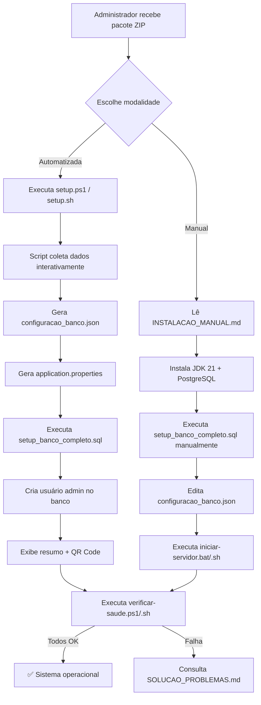

# Design Técnico — Implantação em Novos Campus (implantacao-campus)

## Visão Geral

Este documento descreve a arquitetura técnica do **Pacote de Implantação SIHCP**, um conjunto de artefatos, scripts e documentação que permite a qualquer campus do IFMT instalar e operar o sistema de forma autônoma, sem dependência de Docker ou infraestrutura especializada.

O pacote suporta duas modalidades:

- **Manual** — o Administrador_Campus instala os pré-requisitos (JDK 21, PostgreSQL 12+) e executa os scripts de inicialização individualmente.
- **Automatizada** — um único script interativo (`setup.ps1` / `setup.sh`) conduz todo o processo, desde a coleta de dados do campus até a criação do banco e do usuário administrador.

O sistema é composto por três componentes distribuídos como artefatos independentes:

| Componente | Artefato | Tecnologia |
|---|---|---|
| API Mobile | `mobile-server.jar` | Spring Boot 3.2 / Java 21 |
| App Desktop | `sihcp-desktop.jar` | Swing / Spring Boot 3.2 / Java 21 |
| App Android | `sihcp-mobile.apk` | Kotlin / Android |

---

## Arquitetura

### Visão do Pacote de Implantação

```
SIHCP-Campus-v{versao}.zip
├── README.md                          # Guia de início rápido
├── INSTALACAO_MANUAL.md               # Guia passo a passo (Modo Manual)
├── CHECKLIST_IMPLANTACAO.md           # Verificação pós-instalação
├── SOLUCAO_PROBLEMAS.md               # Troubleshooting
├── CONFIGURAR_APP_ANDROID.md          # Guia de distribuição do APK
│
├── bin/                               # Artefatos executáveis
│   ├── mobile-server.jar              # API Mobile (Spring Boot)
│   ├── sihcp-desktop.jar              # App Desktop (Swing)
│   └── sihcp-mobile.apk               # App Android
│
├── lib/                               # Dependências compartilhadas (thin JARs)
│   └── *.jar
│
├── sql/
│   └── setup_banco_completo.sql       # SQL consolidado (schema + dados iniciais)
│
├── config/
│   └── application.properties.template  # Template de configuração Spring Boot
│
├── scripts/
│   ├── setup.ps1                      # Setup automatizado (Windows)
│   ├── setup.sh                       # Setup automatizado (Linux/macOS)
│   ├── iniciar-servidor.bat           # Inicialização manual (Windows)
│   ├── iniciar-servidor.sh            # Inicialização manual (Linux/macOS)
│   ├── verificar-saude.ps1            # Health check (Windows)
│   ├── verificar-saude.sh             # Health check (Linux/macOS)
│   ├── atualizar.ps1                  # Atualização de versão (Windows)
│   ├── atualizar.sh                   # Atualização de versão (Linux/macOS)
│   ├── coletar-diagnostico.ps1        # Diagnóstico (Windows)
│   └── coletar-diagnostico.sh         # Diagnóstico (Linux/macOS)
│
└── qrcode/
    └── gerar-qrcode.ps1               # Geração do QR Code da API
```

### Fluxo de Implantação



---

## Componentes e Interfaces

### 1. Script de Setup Automatizado (`setup.ps1` / `setup.sh`)

**Responsabilidade:** Conduzir o Administrador_Campus por todas as etapas de implantação de forma interativa, com validação em cada passo e rollback seguro em caso de falha.

**Entradas interativas coletadas:**
- Nome do campus (máx. 100 caracteres, obrigatório)
- Sigla do campus
- Cidade e estado
- Porta da API Mobile (padrão: 8080, intervalo: 1024–65535)
- Host do PostgreSQL (padrão: localhost)
- Porta do PostgreSQL (padrão: 5432)
- Nome do banco de dados (padrão: sispatrimonio)
- Usuário do PostgreSQL
- Senha do PostgreSQL
- Senha do administrador inicial do SIHCP

**Saídas geradas:**
- `config/configuracao_banco.json` — configuração de conexão do banco
- `config/application.properties` — configuração do Spring Boot com porta e campus
- Usuário `admin` criado no banco com senha BCrypt
- Arquivo `qrcode/api-qrcode.png` com o endereço da API

**Etapas de execução (com controle de falha):**

```
[1/6] Validar pré-requisitos (JDK 21, psql)
[2/6] Coletar dados do campus
[3/6] Gerar arquivos de configuração
[4/6] Criar banco de dados e executar SQL
[5/6] Criar usuário administrador inicial
[6/6] Gerar QR Code e exibir resumo
```

Se qualquer etapa falhar, o script exibe a etapa, a causa e as instruções de correção, **sem apagar** configurações já realizadas com sucesso.

---

### 2. Scripts de Inicialização (`iniciar-servidor.bat` / `iniciar-servidor.sh`)

**Responsabilidade:** Iniciar a API Mobile com as configurações do campus, realizando verificações de pré-condição antes de subir o processo Java.

**Verificações realizadas antes de iniciar:**
1. JDK 21 presente no PATH ou `JAVA_HOME`
2. Arquivo `config/configuracao_banco.json` existe
3. Conectividade com o banco de dados (tentativa de conexão TCP na porta configurada)

**Comportamento em caso de falha:**
- JDK ausente → mensagem descritiva com link de download + `exit 1`
- Banco inacessível → mensagem `"Banco de dados inacessível. Verifique as configurações em configuracao_banco.json"` + `exit 1`

**Comando de inicialização:**
```bash
java -Xms256m -Xmx1g \
  -Dinventario.config.mode=APP_DIR \
  -jar bin/mobile-server.jar \
  --spring.profiles.active=mobile,prod \
  --spring.config.additional-location=config/
```

A variável `INVENTARIO_CONFIG_MODE=APP_DIR` instrui o `ConfigurationPaths` a ler o `configuracao_banco.json` do diretório `config/` local (ao invés do diretório home do usuário), isolando cada campus.

---

### 3. Script de Verificação de Saúde (`verificar-saude.ps1` / `verificar-saude.sh`)

**Responsabilidade:** Validar que todos os componentes do SIHCP estão operacionais após a implantação.

**Testes executados em sequência:**

| # | Teste | Endpoint / Comando |
|---|---|---|
| 1 | Conectividade com banco | TCP na porta PostgreSQL |
| 2 | API respondendo | `GET /api/mobile/health` |
| 3 | Autenticação | `POST /api/mobile/auth/login` com credenciais admin |
| 4 | Listagem de patrimônios | `GET /api/mobile/patrimonio` |

**Saída em caso de sucesso:**
```
✅ Sistema SIHCP operacional e pronto para uso
   URL da API: http://<ip>:<porta>
```

**Saída em caso de falha:**
```
❌ Falha no teste: [nome do componente]
   Erro: [mensagem]
   Consulte: SOLUCAO_PROBLEMAS.md#[ancora]
```

**Arquivo gerado:** `relatorio-saude-{YYYYMMDD-HHmm}.txt`

---

### 4. Script de Atualização (`atualizar.ps1` / `atualizar.sh`)

**Responsabilidade:** Atualizar o SIHCP para uma nova versão preservando os dados e configurações existentes.

**Etapas:**
1. Criar backup do banco via `pg_dump` → `backups/sispatrimonio_backup_{data}.backup`
2. Parar o servidor (se em execução como serviço)
3. Substituir os JARs em `bin/`
4. Aplicar scripts SQL de migração incrementais (apenas os novos, controlados por tabela `schema_version`)
5. Reiniciar o servidor
6. Exibir: versão anterior → versão atual + número de migrações aplicadas

**Rollback automático:** Se qualquer etapa após o backup falhar, o script restaura o backup via `pg_restore` e exibe o erro.

---

### 5. Script de Diagnóstico (`coletar-diagnostico.ps1` / `coletar-diagnostico.sh`)

**Responsabilidade:** Coletar informações do ambiente para envio ao suporte, sem expor credenciais.

**Conteúdo do arquivo `diagnostico-{campus}-{data}.zip`:**
- Logs da API Mobile (`logs/*.log`, últimas 1000 linhas)
- Versão do JDK (`java -version`)
- Versão do PostgreSQL (`psql --version`)
- Configuração anonimizada (host, porta, banco — **sem senha**)
- Saída do `verificar-saude` executado no momento
- Informações do SO (Windows: `systeminfo` / Linux: `uname -a`, `free -h`, `df -h`)

---

### 6. SQL Consolidado (`setup_banco_completo.sql`)

**Responsabilidade:** Criar o esquema completo do banco em uma única execução idempotente.

**Estrutura do arquivo:**

```sql
-- ============================================================
-- SIHCP - Setup Banco Completo
-- Versão: {versao}
-- Gerado em: {data}
-- ============================================================

-- Extensões necessárias
CREATE EXTENSION IF NOT EXISTS "uuid-ossp";
CREATE EXTENSION IF NOT EXISTS "pgcrypto";

-- Tabelas base (sem dependências)
-- [conteúdo de criar_tabelas_sispatrimonio.sql]
-- [conteúdo de criar_tabela_usuario.sql]
-- [conteúdo de criar_tabelas_sistema_inventario.sql]
-- [conteúdo de criar_tabelas_mobile.sql]

-- Views
-- [conteúdo de criar_view_coleta_completa.sql]
-- [conteúdo de criar_view_patrimonio_completo.sql]

-- Triggers
-- [conteúdo de triggers_historico_patrimonio.sql]

-- Índices de performance
-- [conteúdo de criar_indices_performance_coleta.sql]

-- Tabela de controle de versão do schema
CREATE TABLE IF NOT EXISTS schema_version (
    id SERIAL PRIMARY KEY,
    versao VARCHAR(20) NOT NULL,
    descricao VARCHAR(200),
    aplicado_em TIMESTAMP DEFAULT CURRENT_TIMESTAMP
);

-- Dados iniciais (setores padrão, perfis)
INSERT INTO TABELA_SETOR (NOME) VALUES ('Administração') ON CONFLICT DO NOTHING;
INSERT INTO TABELA_SETOR (NOME) VALUES ('TI') ON CONFLICT DO NOTHING;
INSERT INTO TABELA_SETOR (NOME) VALUES ('Biblioteca') ON CONFLICT DO NOTHING;

-- Registro da versão inicial
INSERT INTO schema_version (versao, descricao)
VALUES ('{versao}', 'Instalação inicial')
ON CONFLICT DO NOTHING;
```

Todos os `CREATE TABLE` usam `IF NOT EXISTS` e os `INSERT` usam `ON CONFLICT DO NOTHING`, tornando o script **idempotente** (seguro para re-execução).

---

### 7. Geração de QR Code

**Responsabilidade:** Gerar uma imagem PNG com o endereço da API Mobile para facilitar a configuração do app Android pelos coletores.

**Abordagem:** Utilizar a biblioteca **ZXing 3.5.2** já presente no projeto para gerar o QR Code programaticamente durante o setup automatizado.

**Conteúdo do QR Code:**
```
http://{ip_local}:{porta}/api/mobile
```

**Implementação no setup automatizado:**

O script `setup.ps1` / `setup.sh` invoca um utilitário Java standalone (`QrCodeGenerator.java`) que usa a API ZXing para gerar o PNG:

```java
// src/main/java/com/inventario/util/QrCodeGenerator.java
public class QrCodeGenerator {
    public static void generate(String content, String outputPath, int size) throws Exception {
        QRCodeWriter writer = new QRCodeWriter();
        BitMatrix matrix = writer.encode(content, BarcodeFormat.QR_CODE, size, size);
        Path path = FileSystems.getDefault().getPath(outputPath);
        MatrixToImageWriter.writeToPath(matrix, "PNG", path);
    }
    
    public static void main(String[] args) throws Exception {
        // args[0] = conteúdo, args[1] = caminho saída, args[2] = tamanho
        generate(args[0], args[1], Integer.parseInt(args[2]));
    }
}
```

O script chama:
```bash
java -cp "bin/mobile-server.jar:lib/*" \
  com.inventario.util.QrCodeGenerator \
  "http://${IP_LOCAL}:${PORTA}/api/mobile" \
  "qrcode/api-qrcode.png" \
  300
```

O arquivo `qrcode/api-qrcode.png` é incluído no pacote e também exibido no terminal (representação ASCII) ao final do setup.

---

### 8. Adequações no Sistema Java/Spring Boot para Multi-Campus

#### 8.1 Configuração por Campus via `configuracao_banco.json`

O sistema já suporta o modo `APP_DIR` no `ConfigurationPaths`, que lê o `configuracao_banco.json` do diretório `config/` local. Para multi-campus, cada instalação terá seu próprio diretório de implantação com seu próprio `config/configuracao_banco.json`.

**Formato do `configuracao_banco.json` gerado pelo setup:**

```json
{
  "campus": {
    "nome": "IFMT - Campus Cuiabá",
    "sigla": "CBA",
    "cidade": "Cuiabá",
    "estado": "MT",
    "responsavel_tecnico": "João Silva",
    "contato": "joao.silva@ifmt.edu.br"
  },
  "postgresql": {
    "host": "localhost",
    "port": 5432,
    "database": "sispatrimonio",
    "user": "inventario",
    "password": "senha_aqui"
  },
  "api": {
    "porta": 8080,
    "versao": "1.2.0"
  }
}
```

#### 8.2 Leitura das Informações do Campus

Adicionar suporte à seção `campus` no `DatabaseConfigManager` para que o sistema possa exibir o nome do campus na interface e nos relatórios:

```java
// Novo método em DatabaseConfigManager
public CampusConfig getCampusConfig() {
    // Lê a seção "campus" do configuracao_banco.json
    // Retorna CampusConfig com nome, sigla, cidade, responsavel
}
```

**Nova classe `CampusConfig`:**

```java
// src/main/java/com/inventario/config/CampusConfig.java
public class CampusConfig {
    private String nome;
    private String sigla;
    private String cidade;
    private String estado;
    private String responsavelTecnico;
    private String contato;
    // getters/setters
}
```

#### 8.3 Endpoint de Informações do Campus

Adicionar endpoint público na API Mobile para que o app Android possa exibir o campus ao qual está conectado:

```java
// GET /api/mobile/campus/info (público, sem autenticação)
@GetMapping("/info")
public ResponseEntity<ApiResponse<CampusInfoDTO>> getCampusInfo() {
    CampusConfig campus = databaseConfigManager.getCampusConfig();
    return ResponseEntity.ok(ApiResponse.success(
        new CampusInfoDTO(campus.getNome(), campus.getSigla(), campus.getCidade()),
        "Informações do campus"
    ));
}
```

#### 8.4 Validação de Porta no Script de Inicialização

O script `iniciar-servidor.bat` / `iniciar-servidor.sh` verifica se a porta configurada está disponível antes de iniciar o servidor:

- Windows: `netstat -ano | findstr :{porta}` — se retornar resultado, porta em uso
- Linux: `ss -tlnp | grep :{porta}` — se retornar resultado, porta em uso

#### 8.5 Reinicialização Automática ao Alterar Perfil

Quando o Administrador_Campus alterar o `configuracao_banco.json` via App Desktop, o sistema deve reiniciar a API Mobile. Isso é implementado via:

1. O App Desktop detecta mudança no arquivo de configuração (via `WatchService` do Java NIO)
2. Chama `MobileServerProcessManager.restart()` que para e reinicia o processo da API

---

### 9. Script de Build do Pacote (`build-pacote-implantacao.ps1`)

**Responsabilidade:** Gerar o `SIHCP-Campus-v{versao}.zip` completo a partir do código-fonte, pronto para distribuição.

**Etapas:**

```powershell
# [1/6] Build do JAR da API Mobile (Maven)
mvn clean package -DskipTests -P thin-jar

# [2/6] Build do JAR do App Desktop (Maven)
mvn package -DskipTests -P desktop-jar

# [3/6] Build do APK Android (Gradle)
cd InventarioMobile
.\gradlew.bat assembleRelease
cd ..

# [4/6] Consolidar scripts SQL
# Concatena todos os .sql na ordem correta → sql/setup_banco_completo.sql

# [5/6] Montar estrutura do pacote em dist/pacote-campus/

# [6/6] Compactar em SIHCP-Campus-v{versao}.zip
# Verificar tamanho (limite: 200 MB)
```

**Verificação de tamanho:**
```powershell
$tamanhoMB = (Get-Item "dist\SIHCP-Campus-v${versao}.zip").Length / 1MB
if ($tamanhoMB -gt 200) {
    Write-Host "[AVISO] Pacote excede 200 MB ($([math]::Round($tamanhoMB,1)) MB)" -ForegroundColor Yellow
}
```

---

## Modelos de Dados

### `configuracao_banco.json` (por campus)

```json
{
  "campus": {
    "nome": "string (máx. 100 chars, obrigatório)",
    "sigla": "string (máx. 10 chars)",
    "cidade": "string",
    "estado": "string (2 chars, UF)",
    "responsavel_tecnico": "string",
    "contato": "string (e-mail)"
  },
  "postgresql": {
    "host": "string (padrão: localhost)",
    "port": "integer (padrão: 5432)",
    "database": "string (padrão: sispatrimonio)",
    "user": "string",
    "password": "string"
  },
  "api": {
    "porta": "integer (1024–65535, padrão: 8080)",
    "versao": "string"
  }
}
```

### `schema_version` (tabela de controle de migrações)

```sql
CREATE TABLE IF NOT EXISTS schema_version (
    id          SERIAL PRIMARY KEY,
    versao      VARCHAR(20)  NOT NULL,
    descricao   VARCHAR(200),
    aplicado_em TIMESTAMP    DEFAULT CURRENT_TIMESTAMP
);
```

### `relatorio-saude-{data}.txt` (saída do verificador)

```
RELATÓRIO DE SAÚDE SIHCP
Campus: {nome}
Data: {data}
Versão: {versao}

[OK]  Banco de dados: conectado (host:porta)
[OK]  API Mobile: respondendo (GET /api/mobile/health → 200)
[OK]  Autenticação: admin autenticado com sucesso
[OK]  Patrimônios: listagem retornou {n} registros

STATUS GERAL: ✅ OPERACIONAL
URL de acesso: http://{ip}:{porta}
```

### `diagnostico-{campus}-{data}.zip` (saída do diagnóstico)

```
diagnostico-{campus}-{data}.zip
├── logs/
│   └── sistema-inventario-prod.log (últimas 1000 linhas)
├── ambiente.txt          (JDK, PostgreSQL, SO)
├── configuracao.txt      (host, porta, banco — SEM senha)
└── relatorio-saude.txt   (saída do verificar-saude)
```

---

## Propriedades de Correção

*Uma propriedade é uma característica ou comportamento que deve ser verdadeiro em todas as execuções válidas do sistema — essencialmente, uma declaração formal sobre o que o sistema deve fazer. Propriedades servem como ponte entre especificações legíveis por humanos e garantias de correção verificáveis por máquina.*

### Propriedade 1: Idempotência do SQL de Setup

*Para qualquer* banco de dados PostgreSQL (vazio ou já inicializado), executar `setup_banco_completo.sql` duas vezes consecutivas deve produzir o mesmo estado final que executar uma única vez — sem erros, sem duplicação de dados.

**Valida: Requisitos 2.5**

---

### Propriedade 2: Geração de Configuração a partir de Entradas

*Para qualquer* conjunto válido de entradas do setup automatizado (nome do campus não vazio, porta no intervalo 1024–65535, credenciais do banco não vazias), o script deve gerar um `configuracao_banco.json` que, quando lido pelo `DatabaseConfigManager`, produz uma `DatabaseConfig` com os mesmos valores informados.

**Valida: Requisitos 4.3**

---

### Propriedade 3: Verificação de Saúde Reflete Estado Real

*Para qualquer* estado do sistema (banco acessível ou inacessível, API rodando ou parada), o resultado do `verificar-saude` deve ser consistente com o estado real: se o banco está inacessível, o teste de banco deve falhar; se a API está respondendo, o teste de API deve passar.

**Valida: Requisitos 5.2, 5.3, 5.4**

---

### Propriedade 4: Backup Antes de Atualização

*Para qualquer* execução do script de atualização, se o script chegar à etapa de aplicação de SQL, deve existir um arquivo de backup válido criado nessa mesma execução — independentemente do conteúdo do banco ou da versão de origem.

**Valida: Requisitos 8.2**

---

### Propriedade 5: Diagnóstico Não Expõe Credenciais

*Para qualquer* arquivo `diagnostico-{campus}-{data}.zip` gerado pelo script de diagnóstico, nenhum arquivo contido no ZIP deve conter a senha do banco de dados em texto plano.

**Valida: Requisitos 9.3**

---

### Propriedade 6: Validação de Porta

*Para qualquer* valor de porta informado durante o setup, se a porta estiver fora do intervalo 1024–65535 ou já estiver em uso, o script deve rejeitar o valor e solicitar nova entrada — sem prosseguir para as etapas seguintes.

**Valida: Requisitos 6.4**

---

## Tratamento de Erros

### Erros no Setup Automatizado

| Situação | Comportamento |
|---|---|
| JDK 21 não encontrado | Exibe mensagem com link de download, encerra com `exit 1` |
| `psql` não encontrado | Exibe instrução de instalação do PostgreSQL, encerra com `exit 1` |
| Falha na conexão com banco | Exibe host/porta tentados, sugere verificar credenciais e firewall |
| Nome do campus vazio | Solicita nova entrada (loop de validação) |
| Porta inválida ou em uso | Solicita nova entrada com explicação |
| Falha ao executar SQL | Exibe etapa, erro do psql, mantém configurações já geradas |
| Falha ao criar usuário admin | Exibe erro, orienta execução manual do INSERT |

### Erros no Script de Inicialização

| Situação | Mensagem exibida | Código de saída |
|---|---|---|
| JDK 21 ausente | `"JDK 21 não encontrado. Instale em: https://adoptium.net"` | 1 |
| `configuracao_banco.json` ausente | `"Arquivo de configuração não encontrado. Execute setup.ps1 primeiro."` | 1 |
| Banco inacessível | `"Banco de dados inacessível. Verifique as configurações em configuracao_banco.json"` | 1 |
| Porta em uso | `"Porta {porta} já está em uso. Altere a porta em configuracao_banco.json"` | 1 |

### Erros no Script de Atualização

| Situação | Comportamento |
|---|---|
| Falha no backup | Encerra sem aplicar nenhuma alteração |
| Falha após backup | Restaura backup automaticamente via `pg_restore`, exibe erro |
| Script SQL de migração com erro | Para na migração com erro, restaura backup, exibe qual script falhou |

### Erros no Verificador de Saúde

Cada teste falho gera uma entrada no relatório com:
- Nome do componente
- Erro obtido (código HTTP, mensagem de exceção)
- Link para seção do `SOLUCAO_PROBLEMAS.md`

---

## Estratégia de Testes

### Testes de Unidade

Focados nas funções de validação e geração de configuração:

- `QrCodeGenerator`: verificar que o PNG gerado é um QR Code válido decodificável pelo ZXing
- `CampusConfig`: validar parsing do JSON com campos obrigatórios e opcionais
- `DatabaseConfigManager.getCampusConfig()`: verificar leitura correta da seção `campus`
- Validação de porta: testar intervalo 1024–65535, rejeição de valores fora do intervalo

### Testes de Integração

- Executar `setup_banco_completo.sql` em banco PostgreSQL de teste e verificar que todas as tabelas, views e triggers foram criados
- Executar o SQL duas vezes e verificar idempotência (sem erros na segunda execução)
- Executar `verificar-saude` com API rodando e verificar saída `✅ OPERACIONAL`
- Executar `verificar-saude` com banco parado e verificar falha no teste de banco

### Testes de Script (PowerShell/Bash)

- Testar `iniciar-servidor.bat` sem JDK → verificar `exit 1` e mensagem correta
- Testar `iniciar-servidor.bat` com banco inacessível → verificar mensagem específica
- Testar `coletar-diagnostico.ps1` → verificar que o ZIP não contém a senha do banco

### Testes de Propriedade (Property-Based Testing)

Usando **jqwik** (Java) para as propriedades identificadas:

**Propriedade 1 — Idempotência do SQL:**
```java
@Property
void sqlSetupIsIdempotent(@ForAll("validDatabaseConnections") Connection conn) {
    executeSql(conn, "setup_banco_completo.sql");
    int tableCountFirst = countTables(conn);
    executeSql(conn, "setup_banco_completo.sql"); // segunda execução
    int tableCountSecond = countTables(conn);
    assertThat(tableCountSecond).isEqualTo(tableCountFirst);
}
```

**Propriedade 2 — Round-trip de configuração:**
```java
@Property
void configRoundTrip(
    @ForAll @StringLength(min=1, max=100) String nomeCampus,
    @ForAll @IntRange(min=1024, max=65535) int porta
) {
    SetupConfig input = new SetupConfig(nomeCampus, porta, ...);
    String json = ConfigGenerator.generate(input);
    DatabaseConfigManager mgr = new DatabaseConfigManager(json);
    assertThat(mgr.getCampusConfig().getNome()).isEqualTo(nomeCampus);
    assertThat(mgr.getCurrentConfig().getPort()).isEqualTo(porta);
}
```

**Propriedade 5 — Diagnóstico sem credenciais:**
```java
@Property
void diagnosticDoesNotLeakPassword(@ForAll String password) {
    SetupConfig config = new SetupConfig(..., password);
    File zip = DiagnosticCollector.collect(config);
    assertThat(zipContents(zip)).doesNotContain(password);
}
```

Cada teste de propriedade executa mínimo **100 iterações** com entradas geradas aleatoriamente.

**Tag format:** `Feature: implantacao-campus, Property {n}: {texto}`

### Testes de Fumaça (Smoke Tests)

- Verificar que o pacote ZIP tem menos de 200 MB
- Verificar que todos os arquivos obrigatórios estão presentes no ZIP
- Verificar que os scripts `.ps1` e `.sh` têm permissão de execução
- Verificar que o `setup_banco_completo.sql` não contém referências a arquivos externos
