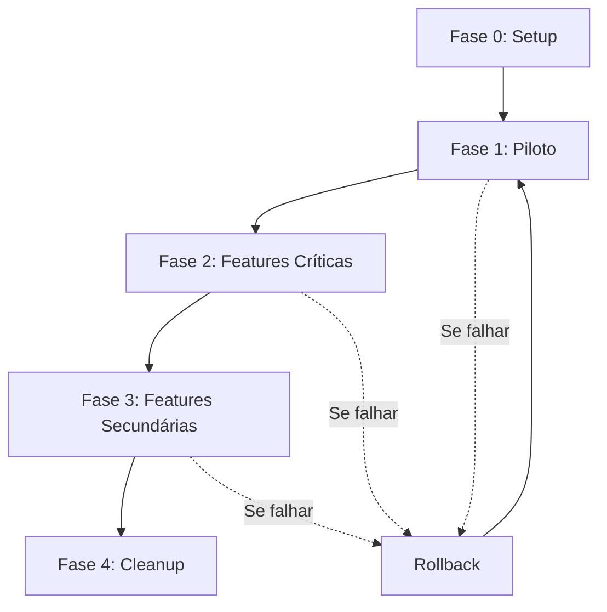

# Design Document - Migração para Clean Architecture

## Overview

Este documento descreve a estratégia técnica para migração gradual e segura do app Android para Clean Architecture + MVVM. A abordagem é baseada em **Strangler Fig Pattern** - criar nova estrutura ao lado da antiga, migrar incrementalmente, e remover código legado apenas quando tudo estiver validado.

## Architecture

### Estratégia: Dual-Track Architecture

Durante a migração, teremos duas arquiteturas coexistindo:

```
┌─────────────────────────────────────────────────────────┐
│                    PRESENTATION LAYER                    │
├──────────────────────┬──────────────────────────────────┤
│   LEGACY TRACK       │      CLEAN TRACK                 │
│   (Funcionando)      │      (Novo)                      │
├──────────────────────┼──────────────────────────────────┤
│ ViewModel (antigo)   │  ViewModel Clean                 │
│      ↓               │      ↓                           │
│ ApiService direto    │  Use Case                        │
│                      │      ↓                           │
│                      │  Repository Interface            │
│                      │      ↓                           │
│                      │  Repository Impl                 │
│                      │      ↓                           │
│                      │  DAO + API                       │
└──────────────────────┴──────────────────────────────────┘
```

### Fases da Migração



## Components and Interfaces

### 1. Feature Toggle System

Para permitir rollback instantâneo sem recompilar:

```kotlin
/**
 * Sistema de feature flags para controlar migração
 */
object FeatureFlags {
    private val prefs: SharedPreferences
    
    // Feature flags
    var useCleanArchitecture: Boolean
        get() = prefs.getBoolean("use_clean_architecture", false)
        set(value) = prefs.edit().putBoolean("use_clean_architecture", value).apply()
    
    var useCleanDescricao: Boolean
        get() = prefs.getBoolean("use_clean_descricao", false)
        set(value) = prefs.edit().putBoolean("use_clean_descricao", value).apply()
    
    var useCleanColeta: Boolean
        get() = prefs.getBoolean("use_clean_coleta", false)
        set(value) = prefs.edit().putBoolean("use_clean_coleta", value).apply()
    
    // Rollback geral
    fun rollbackAll() {
        useCleanArchitecture = false
        useCleanDescricao = false
        useCleanColeta = false
    }
}
```

### 2. ViewModel Factory Adapter

Permite trocar entre ViewModels sem mudar Activity:

```kotlin
/**
 * Factory que decide qual ViewModel usar baseado em feature flag
 */
class AdaptiveViewModelFactory(
    private val application: Application
) : ViewModelProvider.Factory {
    
    override fun <T : ViewModel> create(modelClass: Class<T>): T {
        return when {
            modelClass.isAssignableFrom(DescricaoSelectionViewModel::class.java) -> {
                if (FeatureFlags.useCleanDescricao) {
                    // Usar novo (Clean)
                    DescricaoSelectionViewModelClean(
                        buscarDescricoesUseCase = /* inject */
                    ) as T
                } else {
                    // Usar antigo (Legacy)
                    DescricaoSelectionViewModel(application) as T
                }
            }
            else -> throw IllegalArgumentException("Unknown ViewModel class")
        }
    }
}
```

### 3. Migration Coordinator

Gerencia o processo de migração:

```kotlin
/**
 * Coordena migração e rollback
 */
class MigrationCoordinator(
    private val context: Context,
    private val database: AppDatabase
) {
    
    suspend fun migrateFeature(feature: Feature): MigrationResult {
        return try {
            // 1. Backup estado atual
            backupCurrentState(feature)
            
            // 2. Habilitar feature flag
            enableFeature(feature)
            
            // 3. Executar smoke tests
            val testResult = runSmokeTests(feature)
            
            if (testResult.passed) {
                MigrationResult.Success(feature)
            } else {
                // Rollback automático
                rollbackFeature(feature)
                MigrationResult.Failure(feature, testResult.errors)
            }
        } catch (e: Exception) {
            rollbackFeature(feature)
            MigrationResult.Error(feature, e)
        }
    }
    
    private suspend fun backupCurrentState(feature: Feature) {
        // Backup de dados críticos
        when (feature) {
            Feature.COLETA -> backupColetas()
            Feature.DESCRICAO -> backupDescricoes()
        }
    }
    
    private fun rollbackFeature(feature: Feature) {
        when (feature) {
            Feature.COLETA -> FeatureFlags.useCleanColeta = false
            Feature.DESCRICAO -> FeatureFlags.useCleanDescricao = false
        }
    }
}

enum class Feature {
    DESCRICAO,
    COLETA,
    DASHBOARD,
    SYNC
}

sealed class MigrationResult {
    data class Success(val feature: Feature) : MigrationResult()
    data class Failure(val feature: Feature, val errors: List<String>) : MigrationResult()
    data class Error(val feature: Feature, val exception: Exception) : MigrationResult()
}
```

### 4. Smoke Test Framework

Testes automatizados para validar migração:

```kotlin
/**
 * Framework de smoke tests
 */
interface SmokeTest {
    suspend fun run(): TestResult
}

data class TestResult(
    val passed: Boolean,
    val errors: List<String> = emptyList(),
    val duration: Long
)

class DescricaoSmokeTest(
    private val viewModel: DescricaoSelectionViewModelClean
) : SmokeTest {
    
    override suspend fun run(): TestResult {
        val startTime = System.currentTimeMillis()
        val errors = mutableListOf<String>()
        
        try {
            // Test 1: Carregar descrições
            viewModel.carregarDescricoes()
            delay(2000) // Aguardar resposta
            
            val state = viewModel.state.value
            if (state !is DescricaoState.Success) {
                errors.add("Falha ao carregar descrições")
            }
            
            // Test 2: Verificar se são apenas não coletadas
            if (state is DescricaoState.Success) {
                if (state.descricoes.isEmpty()) {
                    errors.add("Nenhuma descrição retornada")
                }
            }
            
        } catch (e: Exception) {
            errors.add("Exceção: ${e.message}")
        }
        
        val duration = System.currentTimeMillis() - startTime
        return TestResult(
            passed = errors.isEmpty(),
            errors = errors,
            duration = duration
        )
    }
}
```

## Data Models

### Migration State

```kotlin
/**
 * Estado da migração persistido
 */
@Entity(tableName = "migration_state")
data class MigrationStateEntity(
    @PrimaryKey
    val feature: String,
    val status: MigrationStatus,
    val migratedAt: Long?,
    val rollbackCount: Int = 0,
    val lastError: String?
)

enum class MigrationStatus {
    NOT_STARTED,
    IN_PROGRESS,
    COMPLETED,
    ROLLED_BACK,
    FAILED
}
```

### Backup Data

```kotlin
/**
 * Backup de dados antes da migração
 */
@Entity(tableName = "migration_backup")
data class MigrationBackupEntity(
    @PrimaryKey(autoGenerate = true)
    val id: Long = 0,
    val feature: String,
    val backupData: String, // JSON
    val createdAt: Long,
    val restored: Boolean = false
)
```

## Error Handling

### Estratégia de Erro em Camadas

```kotlin
/**
 * Hierarquia de erros
 */
sealed class MigrationError : Exception() {
    data class DatabaseError(override val message: String) : MigrationError()
    data class NetworkError(override val message: String) : MigrationError()
    data class ValidationError(override val message: String) : MigrationError()
    data class RollbackError(override val message: String) : MigrationError()
}

/**
 * Handler centralizado
 */
class MigrationErrorHandler {
    
    fun handle(error: MigrationError, feature: Feature) {
        when (error) {
            is MigrationError.DatabaseError -> {
                // Rollback + notificar
                rollbackFeature(feature)
                notifyDevelopers("Database error in $feature: ${error.message}")
            }
            is MigrationError.NetworkError -> {
                // Pode continuar offline
                logWarning("Network error in $feature: ${error.message}")
            }
            is MigrationError.ValidationError -> {
                // Rollback imediato
                rollbackFeature(feature)
                notifyDevelopers("Validation failed in $feature: ${error.message}")
            }
            is MigrationError.RollbackError -> {
                // Crítico - notificar urgente
                notifyDevelopersUrgent("Rollback failed in $feature: ${error.message}")
            }
        }
    }
}
```

## Testing Strategy

### Níveis de Teste

```
┌─────────────────────────────────────────┐
│  1. Unit Tests (Use Cases)              │
│     - Lógica de negócio isolada         │
│     - Mocks de Repository               │
├─────────────────────────────────────────┤
│  2. Integration Tests (Repository)      │
│     - Room + API juntos                 │
│     - Offline-first scenarios           │
├─────────────────────────────────────────┤
│  3. Smoke Tests (End-to-End)            │
│     - Fluxos críticos                   │
│     - Executados após cada migração     │
├─────────────────────────────────────────┤
│  4. Regression Tests (Manual)           │
│     - Checklist completo                │
│     - Executado antes de release        │
└─────────────────────────────────────────┘
```

### Test Coverage Goals

- Use Cases: 80%+
- Repositories: 70%+
- ViewModels: 60%+
- Overall: 65%+

## Performance Considerations

### Benchmarks

Estabelecer benchmarks antes da migração:

```kotlin
/**
 * Benchmark de performance
 */
class PerformanceBenchmark {
    
    fun measureAppStartup(): Long {
        // Tempo de inicialização
    }
    
    fun measureScreenLoad(screen: String): Long {
        // Tempo de carregamento de tela
    }
    
    fun measureColetaSave(): Long {
        // Tempo para salvar coleta
    }
    
    fun measureSync(itemCount: Int): Long {
        // Tempo de sincronização
    }
}

/**
 * Comparação antes/depois
 */
data class PerformanceComparison(
    val metric: String,
    val before: Long,
    val after: Long,
    val percentChange: Double
) {
    val acceptable: Boolean
        get() = percentChange <= 20.0 // Max 20% degradação
}
```

### Otimizações

1. **Lazy Loading**: Carregar dados sob demanda
2. **Pagination**: Limitar queries grandes
3. **Caching**: Cache em memória para dados frequentes
4. **Background Sync**: Sincronização em WorkManager
5. **Database Indexes**: Índices em colunas frequentes

## Migration Phases

### Fase 0: Setup (1 dia)

**Objetivo**: Preparar ambiente sem quebrar nada

**Tarefas**:
1. Adicionar dependências Hilt
2. Configurar plugins Gradle
3. Anotar Application com @HiltAndroidApp
4. Criar módulos Hilt básicos
5. Executar smoke test geral

**Critério de Sucesso**: App compila e executa normalmente

---

### Fase 1: Piloto - Feature Descrição (3 dias)

**Objetivo**: Validar processo com feature simples

**Dia 1: Preparação**
- Criar feature flag para descrição
- Implementar ViewModel adapter
- Configurar smoke tests

**Dia 2: Migração**
- Migrar DescricaoSelectionActivity
- Adicionar @AndroidEntryPoint
- Trocar para DescricaoSelectionViewModelClean
- Executar smoke tests

**Dia 3: Validação**
- Testes manuais completos
- Testes de regressão
- Validação de performance
- Documentar lições aprendidas

**Critério de Sucesso**: 
- Descrições não coletadas aparecem corretamente
- Funciona offline
- Performance mantida
- Rollback funciona

---

### Fase 2: Feature Coleta (5 dias)

**Objetivo**: Migrar funcionalidade crítica

**Dia 1-2: Preparação e Testes**
- Criar backup de coletas existentes
- Implementar smoke tests de coleta
- Validar sincronização offline

**Dia 3-4: Migração**
- Migrar ColetaActivity
- Implementar offline-first
- Configurar sincronização automática

**Dia 5: Validação**
- Testes end-to-end
- Testes de sincronização
- Validação com usuários beta

**Critério de Sucesso**:
- Coleta funciona online e offline
- Sincronização automática funciona
- Nenhuma coleta perdida
- Performance melhorada

---

### Fase 3: Features Secundárias (2 semanas)

**Features**:
- Dashboard (3 dias)
- Estatísticas (2 dias)
- Configurações (2 dias)
- Sincronização manual (2 dias)
- Buffer (1 dia)

**Abordagem**: Mesma estratégia das fases anteriores

---

### Fase 4: Cleanup (3 dias)

**Objetivo**: Remover código legado

**Tarefas**:
1. Remover ViewModels antigos
2. Remover feature flags
3. Remover código morto
4. Atualizar documentação
5. Code review final

**Critério de Sucesso**: 
- Código limpo
- Documentação atualizada
- Todos os testes passando

## Rollback Strategy

### Níveis de Rollback

```kotlin
/**
 * Estratégia de rollback em níveis
 */
enum class RollbackLevel {
    FEATURE,      // Rollback de uma feature específica
    PHASE,        // Rollback de uma fase inteira
    COMPLETE      // Rollback completo para código antigo
}

class RollbackManager {
    
    fun rollback(level: RollbackLevel, target: String? = null) {
        when (level) {
            RollbackLevel.FEATURE -> {
                // Desabilitar feature flag específica
                disableFeature(target!!)
            }
            RollbackLevel.PHASE -> {
                // Desabilitar todas features da fase
                disablePhaseFeatures(target!!)
            }
            RollbackLevel.COMPLETE -> {
                // Desabilitar tudo
                FeatureFlags.rollbackAll()
            }
        }
        
        // Reiniciar app
        restartApp()
    }
}
```

### Tempo de Rollback

- **Feature**: < 1 minuto (toggle flag)
- **Phase**: < 2 minutos (toggle múltiplos flags)
- **Complete**: < 5 minutos (rollback total + restart)

## Monitoring and Observability

### Métricas a Monitorar

```kotlin
/**
 * Métricas de migração
 */
data class MigrationMetrics(
    val feature: String,
    val usersOnClean: Int,
    val usersOnLegacy: Int,
    val crashRate: Double,
    val performanceScore: Double,
    val rollbackCount: Int
)

/**
 * Dashboard de migração
 */
class MigrationDashboard {
    fun getMetrics(): List<MigrationMetrics>
    fun getHealthScore(): Double
    fun getRecommendation(): MigrationRecommendation
}

sealed class MigrationRecommendation {
    object Continue : MigrationRecommendation()
    data class Pause(val reason: String) : MigrationRecommendation()
    data class Rollback(val feature: String, val reason: String) : MigrationRecommendation()
}
```

## Risk Mitigation

### Riscos Identificados

| Risco | Probabilidade | Impacto | Mitigação |
|-------|---------------|---------|-----------|
| Perda de dados de coleta | Baixa | Alto | Backup antes de migração + Testes extensivos |
| Crash em produção | Média | Alto | Feature flags + Rollback rápido |
| Performance degradada | Média | Médio | Benchmarks + Otimizações |
| Incompatibilidade de dados | Baixa | Alto | Migração de schema + Testes |
| Resistência da equipe | Média | Baixo | Treinamento + Documentação |

### Plano de Contingência

1. **Se crash rate > 1%**: Rollback imediato da feature
2. **Se performance degrada > 20%**: Pausar migração, otimizar
3. **Se usuários reportam bugs**: Investigar em < 2h, rollback se crítico
4. **Se sincronização falha**: Manter dados locais, investigar
5. **Se rollback falha**: Usar backup de código anterior

## Success Criteria

### Por Fase

**Fase 1 (Piloto)**:
- ✅ App não crasha
- ✅ Descrições não coletadas aparecem
- ✅ Rollback funciona
- ✅ Performance mantida

**Fase 2 (Coleta)**:
- ✅ Coleta funciona offline
- ✅ Sincronização automática funciona
- ✅ Nenhuma coleta perdida
- ✅ Performance melhorada

**Fase 3 (Secundárias)**:
- ✅ Todas features migradas
- ✅ Testes de regressão passam
- ✅ Usuários satisfeitos

**Fase 4 (Cleanup)**:
- ✅ Código limpo
- ✅ Documentação completa
- ✅ Equipe treinada

### Geral

- 100% funcionalidades preservadas
- 0 crashes relacionados à migração
- Performance mantida ou melhorada
- Cobertura de testes > 60%
- Satisfação da equipe > 4/5
