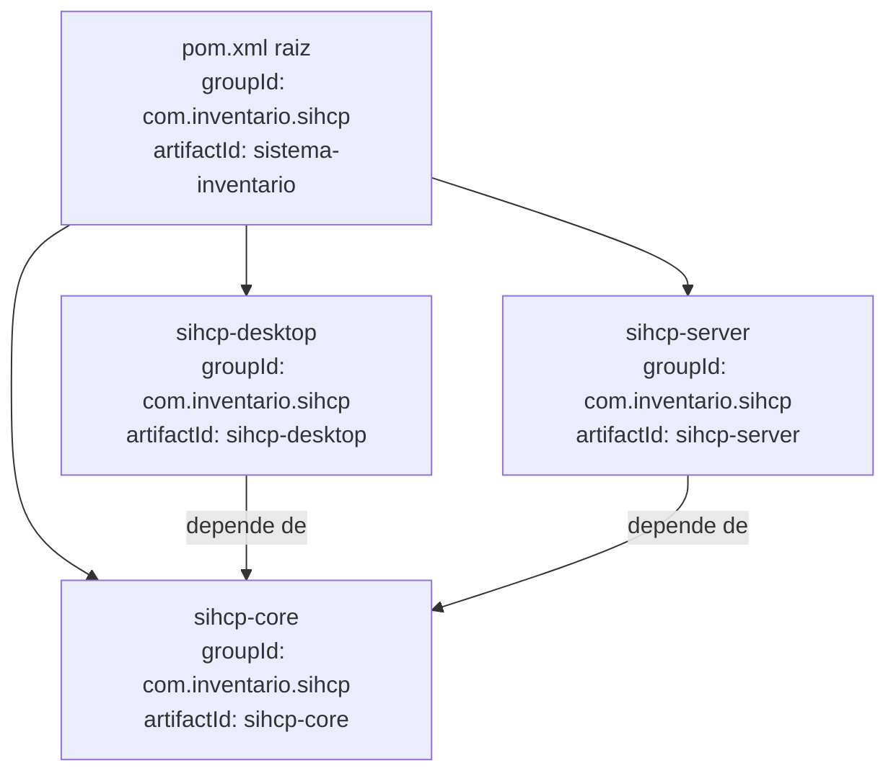

# Design Técnico — Renomeação de Pacotes SIHCP

## Visão Geral

Este documento descreve a abordagem técnica para renomear o pacote raiz Java do SIHCP de `com.inventario` para `com.inventario.sihcp`. A mudança é puramente estrutural: nenhuma lógica de negócio é alterada. O objetivo é alinhar a identidade do pacote ao nome oficial do sistema e preparar a base para futuras integrações e publicações.

A operação abrange três módulos Maven (`sihcp-core`, `sihcp-desktop`, `sihcp-server`), seus arquivos de teste, arquivos de configuração Spring Boot e os `pom.xml`. O app Android (`InventarioMobile/`) permanece intocado.

### Escopo de Arquivos Afetados

Com base na inspeção do repositório, os arquivos que precisam ser modificados são:

| Categoria | Quantidade estimada | Localização |
|---|---|---|
| Arquivos `.java` (main) | ~200 | `sihcp-core/src/main/java/com/inventario/**` |
| Arquivos `.java` (main) | ~80 | `sihcp-desktop/src/main/java/com/inventario/**` |
| Arquivos `.java` (main) | ~50 | `sihcp-server/src/main/java/com/inventario/**` |
| Arquivos `.java` (test) | ~0 (stubs) | `*/src/test/java/` |
| `pom.xml` | 4 | raiz + 3 módulos |
| `.properties` / `.yml` | ~5 | `sihcp-server/src/main/resources/` |

---

## Arquitetura

### Estratégia de Refatoração

A renomeação segue uma abordagem em três fases sequenciais, garantindo que o build permaneça compilável ao final de cada fase:

```
Fase 1: Atualizar pom.xml (groupId + dependências internas + mainClass)
    ↓
Fase 2: Renomear pacotes Java (declarações + imports + mover diretórios)
    ↓
Fase 3: Atualizar arquivos de configuração (logging + scan de componentes)
    ↓
Verificação: mvn clean package -DskipTests → Build Verde
    ↓
Verificação: mvn test → Testes Verdes
    ↓
Documentação: CHANGELOG.md + README.md
```

### Ferramentas de Refatoração

A renomeação pode ser executada por qualquer uma das seguintes abordagens:

**Opção A — IDE (recomendada para execução manual):**
- IntelliJ IDEA: `Refactor → Rename` no pacote `com.inventario`, marcando "Search in comments and strings" e "Search for text occurrences"
- Eclipse: `Refactor → Rename` com as mesmas opções

**Opção B — OpenRewrite (recomendada para automação/CI):**
- Recipe `org.openrewrite.java.ChangePackage` com `oldPackageName=com.inventario` e `newPackageName=com.inventario.sihcp`
- Execução: `mvn rewrite:run -Drewrite.activeRecipes=org.openrewrite.java.ChangePackage`

**Opção C — Scripts de busca e substituição:**
- PowerShell/bash com `sed` ou `Get-ChildItem` + `Replace` para substituições em massa
- Requer atenção especial para não afetar `InventarioMobile/`

### Diagrama de Dependências entre Módulos



---

## Componentes e Interfaces

### Fase 1 — Atualização dos `pom.xml`

#### pom.xml raiz

Mudanças necessárias:

```xml
<!-- ANTES -->
<groupId>com.inventario</groupId>

<!-- DEPOIS -->
<groupId>com.inventario.sihcp</groupId>
```

Perfis `fat-jar`, `mobile`, `thin-jar` e `producao` contêm referências a `mainClass` que precisam ser atualizadas:

```xml
<!-- ANTES -->
<mainClass>com.inventario.SistemaInventarioApplication</mainClass>
<mainClass>com.inventario.MobileApiApplication</mainClass>

<!-- DEPOIS -->
<mainClass>com.inventario.sihcp.SistemaInventarioApplication</mainClass>
<mainClass>com.inventario.sihcp.MobileApiApplication</mainClass>
```

#### pom.xml dos módulos filhos

Cada módulo filho (`sihcp-core`, `sihcp-desktop`, `sihcp-server`) precisa atualizar:

1. A seção `<parent>`:
```xml
<!-- ANTES -->
<parent>
    <groupId>com.inventario</groupId>
    ...
</parent>

<!-- DEPOIS -->
<parent>
    <groupId>com.inventario.sihcp</groupId>
    ...
</parent>
```

2. As dependências internas em `sihcp-desktop` e `sihcp-server`:
```xml
<!-- ANTES -->
<dependency>
    <groupId>com.inventario</groupId>
    <artifactId>sihcp-core</artifactId>
    ...
</dependency>

<!-- DEPOIS -->
<dependency>
    <groupId>com.inventario.sihcp</groupId>
    <artifactId>sihcp-core</artifactId>
    ...
</dependency>
```

3. O `<mainClass>` no `sihcp-server/pom.xml`:
```xml
<!-- ANTES -->
<mainClass>com.inventario.MobileApiApplication</mainClass>

<!-- DEPOIS -->
<mainClass>com.inventario.sihcp.MobileApiApplication</mainClass>
```

4. O `<mainClass>` no `sihcp-desktop/pom.xml`:
```xml
<!-- ANTES -->
<mainClass>com.inventario.SistemaInventarioApplication</mainClass>

<!-- DEPOIS -->
<mainClass>com.inventario.sihcp.SistemaInventarioApplication</mainClass>
```

### Fase 2 — Renomeação dos Arquivos Java

#### Estrutura de Diretórios

A estrutura de diretórios deve ser migrada de:
```
sihcp-core/src/main/java/com/inventario/
sihcp-desktop/src/main/java/com/inventario/
sihcp-server/src/main/java/com/inventario/
```

Para:
```
sihcp-core/src/main/java/com/inventario/sihcp/
sihcp-desktop/src/main/java/com/inventario/sihcp/
sihcp-server/src/main/java/com/inventario/sihcp/
```

#### Subpacotes Preservados

Todos os subpacotes existentes são preservados com o novo prefixo. Exemplos:

| Pacote Atual | Pacote Novo |
|---|---|
| `com.inventario.model` | `com.inventario.sihcp.model` |
| `com.inventario.dao` | `com.inventario.sihcp.dao` |
| `com.inventario.service` | `com.inventario.sihcp.service` |
| `com.inventario.view` | `com.inventario.sihcp.view` |
| `com.inventario.config` | `com.inventario.sihcp.config` |
| `com.inventario.mobile.server.controller` | `com.inventario.sihcp.mobile.server.controller` |
| `com.inventario.mobile.server.service` | `com.inventario.sihcp.mobile.server.service` |
| `com.inventario.analytics` | `com.inventario.sihcp.analytics` |
| `com.inventario.siads` | `com.inventario.sihcp.siads` |
| `com.inventario.offline` | `com.inventario.sihcp.offline` |
| `com.inventario.itemcomposto` | `com.inventario.sihcp.itemcomposto` |
| `com.inventario.sync` | `com.inventario.sihcp.sync` |
| `com.inventario.security` | `com.inventario.sihcp.security` |
| `com.inventario.util.notification` | `com.inventario.sihcp.util.notification` |

#### Padrão de Substituição em Arquivos `.java`

Para cada arquivo `.java`:

1. **Declaração de pacote:**
   ```java
   // ANTES
   package com.inventario;
   package com.inventario.model;
   package com.inventario.mobile.server.controller;

   // DEPOIS
   package com.inventario.sihcp;
   package com.inventario.sihcp.model;
   package com.inventario.sihcp.mobile.server.controller;
   ```

2. **Importações:**
   ```java
   // ANTES
   import com.inventario.model.Patrimonio;
   import com.inventario.dao.PatrimonioDAO;

   // DEPOIS
   import com.inventario.sihcp.model.Patrimonio;
   import com.inventario.sihcp.dao.PatrimonioDAO;
   ```

3. **Nomes qualificados completos (FQN) em strings e anotações:**
   ```java
   // ANTES (exemplo em @SpringBootApplication)
   @SpringBootApplication(scanBasePackages = "com.inventario")

   // DEPOIS
   @SpringBootApplication(scanBasePackages = "com.inventario.sihcp")
   ```

#### Atenção: Limite do Escopo

O diretório `InventarioMobile/` contém o pacote `com.ifmt.inventariomobile` e **não deve ser tocado**. Qualquer ferramenta de busca e substituição deve excluir explicitamente esse diretório.

### Fase 3 — Atualização dos Arquivos de Configuração

#### `sihcp-server/src/main/resources/application.properties`

```properties
# ANTES
logging.level.com.inventario=INFO

# DEPOIS
logging.level.com.inventario.sihcp=INFO
```

#### `sihcp-server/src/main/resources/application-mobile.properties`

```properties
# ANTES
logging.level.com.inventario=DEBUG
logging.level.com.inventario.mobile.server.controller=DEBUG
logging.level.com.inventario.mobile.server.service=DEBUG

# DEPOIS
logging.level.com.inventario.sihcp=DEBUG
logging.level.com.inventario.sihcp.mobile.server.controller=DEBUG
logging.level.com.inventario.sihcp.mobile.server.service=DEBUG
```

#### Outros arquivos de configuração

Verificar e atualizar quaisquer referências em:
- `application-prod.properties` (raiz do projeto)
- `sihcp-server/src/main/resources/application-test.properties`
- `sihcp-server/src/main/resources/application-performance.properties`
- `sihcp-core/src/main/resources/log4j2.xml` (se contiver referências ao pacote)

---

## Modelos de Dados

Esta feature não altera nenhum modelo de dados, esquema de banco de dados ou estrutura de entidades JPA. A renomeação é puramente no nível do código-fonte Java e dos metadados de build.

### Impacto em Configurações de Persistência

O Spring Boot detecta entidades JPA pelo scan de componentes a partir do pacote base definido em `@SpringBootApplication` ou `@EntityScan`. Após a renomeação, a classe `MobileApiApplication` (em `com.inventario.sihcp`) continuará sendo o ponto de entrada, e o Spring Boot fará o scan a partir de `com.inventario.sihcp` automaticamente — sem necessidade de configuração adicional.

O `groupId` Maven é apenas um identificador de artefato e não afeta o comportamento em runtime da aplicação.

---

## Propriedades de Corretude

*Uma propriedade é uma característica ou comportamento que deve ser verdadeiro em todas as execuções válidas de um sistema — essencialmente, uma declaração formal sobre o que o sistema deve fazer. Propriedades servem como ponte entre especificações legíveis por humanos e garantias de corretude verificáveis por máquina.*

### Propriedade 1: Ausência de declarações de pacote com o prefixo antigo

*Para qualquer* arquivo `.java` localizado nos diretórios `src/main/java/` ou `src/test/java/` dos módulos `sihcp-core`, `sihcp-desktop` e `sihcp-server`, se o arquivo contém uma declaração `package`, essa declaração não deve começar com `package com.inventario` sem o sufixo `.sihcp`.

**Validates: Requirements 1.1, 2.1**

### Propriedade 2: Ausência de importações com o prefixo antigo

*Para qualquer* arquivo `.java` localizado nos diretórios `src/main/java/` ou `src/test/java/` dos módulos Maven, o arquivo não deve conter nenhuma linha de importação que comece com `import com.inventario.` sem o sufixo `sihcp`.

**Validates: Requirements 1.2, 2.4**

### Propriedade 3: Consistência entre declaração de pacote e localização no sistema de arquivos

*Para qualquer* arquivo `.java` com declaração de pacote `com.inventario.sihcp.X`, o caminho relativo do arquivo dentro do módulo deve conter o segmento `com/inventario/sihcp/X/`.

**Validates: Requirements 1.3**

### Propriedade 4: Preservação dos subpacotes

*Para qualquer* subpacote `com.inventario.X` que existia antes da renomeação (representado por um diretório no sistema de arquivos), deve existir o subpacote correspondente `com.inventario.sihcp.X` após a renomeação.

**Validates: Requirements 1.4**

### Propriedade 5: Ausência de referências ao pacote antigo nos pom.xml

*Para qualquer* arquivo `pom.xml` nos módulos Maven (raiz, `sihcp-core`, `sihcp-desktop`, `sihcp-server`), não deve existir nenhuma ocorrência do texto `com.inventario` sem o sufixo `.sihcp` nos elementos `<groupId>`, `<mainClass>` e nas seções `<parent>` e `<dependency>`.

**Validates: Requirements 4.1, 4.2, 4.3, 5.1, 5.2**

### Propriedade 6: Ausência de referências ao pacote antigo nos arquivos de configuração

*Para qualquer* arquivo `.properties` ou `.yml` nos módulos Maven, não deve existir nenhuma chave de configuração que contenha `com.inventario` sem o sufixo `.sihcp` (por exemplo, `logging.level.com.inventario`).

**Validates: Requirements 3.1, 3.2**

### Propriedade 7: Scan de componentes Spring abrange o novo pacote raiz

*Para qualquer* classe anotada com `@SpringBootApplication` nos módulos Maven, o pacote base de scan (implícito ou explícito) deve ser `com.inventario.sihcp` ou um de seus subpacotes.

**Validates: Requirements 6.3**

---

## Tratamento de Erros

### Erros de Compilação Residuais

Se após a renomeação o build falhar com erros de compilação do tipo `cannot find symbol` ou `package does not exist`, a causa mais provável é uma referência ao pacote antigo que não foi atualizada. O procedimento de diagnóstico é:

1. Executar `mvn clean compile 2>&1 | grep "com.inventario"` para identificar os arquivos afetados
2. Verificar se o arquivo em questão está dentro do escopo (não é `InventarioMobile/`)
3. Corrigir a referência manualmente

### Erros de Resolução de Dependência Maven

Se o build falhar com `Could not resolve dependencies` ou `Artifact not found`, verificar:

1. Se o `groupId` no `pom.xml` raiz foi atualizado para `com.inventario.sihcp`
2. Se as seções `<parent>` nos módulos filhos foram atualizadas
3. Se as dependências internas (`sihcp-core` em `sihcp-desktop` e `sihcp-server`) foram atualizadas
4. Executar `mvn clean install` na raiz antes de tentar `mvn package` nos módulos

### Erros de Inicialização Spring Boot

Se a aplicação iniciar mas falhar com `NoSuchBeanDefinitionException` ou `ClassNotFoundException`:

1. Verificar se a classe de entrada (`SistemaInventarioApplication` ou `MobileApiApplication`) foi movida para o novo pacote
2. Verificar se a anotação `@SpringBootApplication` não tem `scanBasePackages` apontando para o pacote antigo
3. Verificar se o `mainClass` nos perfis Maven foi atualizado

### Proteção do App Android

Para garantir que `InventarioMobile/` não seja afetado:

- Ao usar ferramentas de busca e substituição em massa, sempre excluir o padrão `InventarioMobile/**`
- Após a refatoração, verificar com `grep -r "com.inventario.sihcp" InventarioMobile/` — o resultado deve ser vazio
- O pacote `com.ifmt.inventariomobile` não contém `com.inventario` e portanto não é afetado por substituições do padrão `com.inventario`

---

## Estratégia de Testes

### Abordagem Dual

A estratégia combina testes de propriedade (verificação estática de invariantes sobre o código-fonte) com testes de integração/smoke (verificação do comportamento em runtime).

**Avaliação de PBT:** Esta feature é adequada para property-based testing na camada de verificação estática. As propriedades 1 a 7 são invariantes universais sobre o conjunto de arquivos do projeto — para qualquer arquivo no conjunto, a propriedade deve ser verdadeira. Isso se encaixa perfeitamente no modelo de PBT: gerar/enumerar todos os arquivos e verificar a propriedade para cada um.

### Testes de Propriedade (Verificação Estática)

Biblioteca: **JUnit-Quickcheck 1.0** (já declarada no `pom.xml` raiz do projeto).

Os testes de propriedade são implementados como testes JUnit que varrem o sistema de arquivos e verificam as invariantes. Cada teste deve ser executado com no mínimo 100 iterações sobre o conjunto de arquivos.

**Tag format:** `Feature: renomeacao-pacotes-sihcp, Property {N}: {texto}`

#### Propriedade 1 — Ausência de declarações de pacote antigas

```java
// Feature: renomeacao-pacotes-sihcp, Property 1: ausência de declarações de pacote com prefixo antigo
@RunWith(JUnitQuickcheck.class)
public class PackageDeclarationPropertyTest {
    @Property(trials = 200)
    public void nenhumArquivoJavaTemDeclaracaoDePackageAntigo(
            @From(JavaSourceFileGenerator.class) File javaFile) {
        // Para qualquer arquivo .java nos módulos Maven,
        // a declaração de pacote não deve ser "package com.inventario" sem ".sihcp"
        String content = Files.readString(javaFile.toPath());
        assertFalse(
            "Arquivo " + javaFile.getPath() + " contém declaração de pacote antiga",
            content.matches("(?m)^package com\\.inventario(?!\\.sihcp).*$")
        );
    }
}
```

#### Propriedade 2 — Ausência de importações antigas

```java
// Feature: renomeacao-pacotes-sihcp, Property 2: ausência de importações com prefixo antigo
@Property(trials = 200)
public void nenhumArquivoJavaTemImportacaoAntiga(
        @From(JavaSourceFileGenerator.class) File javaFile) {
    String content = Files.readString(javaFile.toPath());
    assertFalse(
        "Arquivo " + javaFile.getPath() + " contém importação do pacote antigo",
        content.matches("(?m)^import com\\.inventario\\.(?!sihcp).*$")
    );
}
```

#### Propriedade 3 — Consistência pacote/diretório

```java
// Feature: renomeacao-pacotes-sihcp, Property 3: consistência entre declaração de pacote e localização
@Property(trials = 200)
public void caminhoDoArquivoEConsistenteComDeclaracaoDePacote(
        @From(JavaSourceFileGenerator.class) File javaFile) {
    String content = Files.readString(javaFile.toPath());
    Optional<String> packageDecl = extractPackageDeclaration(content);
    if (packageDecl.isPresent()) {
        String expectedPath = packageDecl.get().replace('.', '/');
        assertTrue(
            "Caminho do arquivo inconsistente com declaração de pacote",
            javaFile.getPath().replace('\\', '/').contains(expectedPath)
        );
    }
}
```

#### Propriedades 4, 5, 6, 7 — Implementadas de forma similar

As propriedades 4 (preservação de subpacotes), 5 (pom.xml sem referências antigas), 6 (configurações sem referências antigas) e 7 (scan de componentes) seguem o mesmo padrão: gerar o conjunto de arquivos relevantes e verificar a invariante para cada elemento.

### Testes de Integração / Smoke

Estes testes verificam o comportamento em runtime e são executados manualmente ou em pipeline CI após a refatoração:

| Teste | Comando | Critério de Sucesso |
|---|---|---|
| Build Verde | `mvn clean package -DskipTests` | Exit code 0 |
| Compilação de Testes | `mvn test-compile` | Exit code 0 |
| Suite de Testes | `mvn test` | Mesmo número de testes aprovados que antes |
| Perfil fat-jar | `mvn clean package -P fat-jar -DskipTests` | Exit code 0 |
| Perfil mobile | `mvn clean package -P mobile -DskipTests` | Exit code 0 |
| Inicialização Desktop | `mvn exec:java -Dexec.mainClass="com.inventario.sihcp.SistemaInventarioApplication"` | Aplicação inicia sem erros |
| Inicialização Server | Executar com perfil `mobile` | Servidor responde em `/api/mobile/health` |

### Testes de Exemplo (Verificações Pontuais)

- Verificar que `CHANGELOG.md` contém entrada sobre a renomeação
- Verificar que `README.md` referencia `com.inventario.sihcp` nas instruções de execução
- Verificar que nenhum arquivo em `InventarioMobile/` foi modificado (`git diff --name-only InventarioMobile/` deve ser vazio)
- Verificar que o relatório de arquivos modificados foi gerado

### Ordem de Execução dos Testes

```
1. Testes de Propriedade (verificação estática — rápidos, sem dependências)
   → Propriedades 1-7 sobre o sistema de arquivos
2. Smoke Tests de Build
   → mvn clean package -DskipTests
   → mvn clean package -P fat-jar -DskipTests
   → mvn clean package -P mobile -DskipTests
3. Smoke Tests de Compilação de Testes
   → mvn test-compile
4. Suite de Testes
   → mvn test
5. Testes de Integração (requerem banco de dados)
   → Inicialização da aplicação desktop
   → Inicialização do servidor mobile
6. Verificações de Documentação
   → CHANGELOG.md, README.md
```
