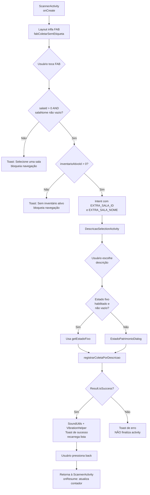

# Design Document — Scanner: Coleta Sem Etiqueta (acesso permanente)

## Overview

Esta feature adiciona à `ScannerActivity` um acesso permanente ao fluxo de coleta sem etiqueta (coleta por descrição). Hoje esse fluxo só é acionável após um scan bem-sucedido, pelo botão `buttonColetarSimilar` dentro do bottom sheet. Com esta mudança, o coletor passa a poder registrar itens sem etiqueta a qualquer momento, sem precisar escanear um patrimônio antes, usando um novo controle sempre visível na tela de scanner.

O design reaproveita integralmente os componentes já existentes:

- `DescricaoSelectionActivity` — tela que lista descrições de patrimônios não coletados.
- `RegistrarColetaUseCase.registrarColetaPorDescricao(...)` — use case que persiste a coleta sem `numeroPatrimonio`.
- `PreferencesManager` — contexto de sala atual, estado fixo e inventário ativo.
- `SoundUtils`, `VibrationHelper` — feedback de sucesso.

Nenhum novo modelo de dados é introduzido; nenhuma rota/endpoint de API é alterada (respeitando a regra de steering `endpoints-nao-alterar`).

### Decisões do usuário incorporadas

1. **Rótulo**: o botão usa o texto "Coletar similar" (conforme Requirement 1.5).
2. **Validação de inventário ativo**: se `getInventarioAtivoId()` retornar nulo ou `<= 0` no momento do clique, a tela de descrição não é aberta e uma mensagem é exibida ao usuário (Requirement 7.2). Esta validação ocorre na `ScannerActivity`, antes da criação do Intent.
3. **Posicionamento**: ver seção "Arquitetura — Posicionamento do botão (análise)".

---

## Architecture

### Visão geral do fluxo



### Posicionamento do botão — análise

O layout atual da `ScannerActivity` (arquivo `activity_scanner.xml`, `CoordinatorLayout`) tem a câmera em tela cheia e os seguintes elementos flutuantes:

| Região | Elemento atual |
|---|---|
| Topo | Toolbar com contador e botão de histórico |
| Centro-acima | `layoutChipsFlutantes` (chips de sala e estado), com `layout_marginBottom="200dp"` |
| Centro | `layoutStatus` (pílula de status) |
| Inferior-esquerdo | `layoutFixarEstado` (switch) |
| Inferior (overlay) | `bottomSheet` (inicialmente oculto, `translationY=600dp`) |

#### Opções consideradas

| Opção | Prós | Contras |
|---|---|---|
| **A. FAB canto inferior direito** | Padrão MD3 para ação secundária; descobrível; não cobre área central da câmera; touch target 56dp; suporta ancoragem ao `CoordinatorLayout` | Compete visualmente com switch à esquerda; sem rótulo explícito (apenas ícone) |
| **B. Extended FAB inferior direito** | Rótulo visível ("Coletar similar"); mais descobrível; padrão MD3 para ação que não é a principal; touch target ampla | Ocupa mais largura; pode colidir com o switch em telas pequenas |
| **C. Chip adicional na linha de chips** | Consistência visual com chips existentes | Descoberta baixa; área de toque < 48dp; compete por espaço com sala/estado |
| **D. Botão na toolbar** | Não ocupa espaço da câmera | Usuário foca na câmera, não no topo; descoberta baixa |
| **E. Botão na área do switch** | Reaproveita região de controles | Polui região já usada; conflita com "Fixar estado" |

#### Recomendação — Opção B (Extended FAB)

Escolho **Extended FAB no canto inferior direito**, ancorado ao `CoordinatorLayout` e com comportamento `HideBottomViewOnScrollBehavior` desabilitado (a câmera não rola). Justificativa:

- **Descoberta**: o rótulo "Coletar similar" visível elimina ambiguidade sobre a ação. Crítico porque esta é uma ação nova que o usuário precisa aprender a usar.
- **Não obstrução da câmera**: posicionado em `bottom|end` com margem, fica fora da área central de leitura (a viewfinder do ZXing é centralizada).
- **Material Design 3**: FAB estendido é o padrão recomendado para ações primárias/secundárias que não são a ação dominante da tela (o scan é a ação dominante; a coleta sem etiqueta é alternativa). Ver [MDC FAB guidance](https://m3.material.io/components/extended-fab/overview).
- **Acessibilidade (touch target ≥ 48dp)**: Extended FAB tem altura mínima de 56dp e largura proporcional ao rótulo, atendendo WCAG 2.5.5 (Target Size).
- **Não é encoberto pelo bottom sheet**: ao ser filho direto do `CoordinatorLayout` e posicionado com `layout_gravity="bottom|end"` + margem inferior de 24dp, o FAB é **elevado sobre a câmera** quando o bottom sheet está oculto. Para evitar sobreposição pelo bottom sheet quando ele abre, o FAB será **escondido via `hide()`** ao abrir o sheet e **`show()`** ao fechá-lo (respeitando a letra do requisito 1.3: o FAB deve permanecer acessível, o que na prática significa que ou ele está visível sobre a câmera (sheet fechado), ou o sheet em si oferece o botão `buttonColetarSimilar` já existente (sheet aberto). Essa alternância é consistente com o padrão MD3 de coordenação entre FAB e bottom sheets).
- **Independência do `buttonColetarSimilar`**: o novo FAB e o botão do bottom sheet são controles independentes (Requirement 8.3). Cada um tem seu próprio OnClickListener e seu próprio fluxo (o FAB abre `DescricaoSelectionActivity`; o botão do bottom sheet chama `registrarColetaSimilar(...)` inline para o último patrimônio coletado).

#### Posicionamento final

```
CoordinatorLayout
 ├─ FrameLayout (câmera)
 ├─ scrimOverlay
 ├─ AppBarLayout (toolbar)
 ├─ layoutChipsFlutantes   ← marginBottom=200dp (sem alteração)
 ├─ layoutStatus           ← centro (sem alteração)
 ├─ layoutFixarEstado      ← bottom|start (sem alteração)
 ├─ fabColetarSemEtiqueta  ← NOVO: bottom|end, marginEnd=16dp, marginBottom=24dp
 └─ bottomSheet            ← ao abrir, FAB é escondido via hide()
```

Trade-off considerado: o `marginBottom=24dp` garante distância visual do `layoutFixarEstado` (que está em `bottom|start` com `marginBottom=16dp` e altura ~40dp). Em telas pequenas (<360dp width), os dois elementos ficam em colunas opostas e não colidem.

---

## Components and Interfaces

### Componentes afetados

| Componente | Tipo de alteração |
|---|---|
| `app/src/main/res/layout/activity_scanner.xml` | Adicionar `ExtendedFloatingActionButton` (novo) |
| `ScannerActivity.kt` | Adicionar handler do clique do FAB, validações de sala e inventário, navegação, hide/show do FAB no bottom sheet, atualização do contador em `onResume` |
| `DescricaoSelectionActivity.kt` | Ajuste mínimo para respeitar estado fixo e emitir feedback vibracional (se já não emitir) |
| `DescricaoSelectionViewModelClean.kt` | Sem mudança estrutural (já expõe `registrarColetaPorDescricao`) |
| `RegistrarColetaUseCase.kt` | Nenhuma mudança (já suporta o fluxo via `registrarColetaPorDescricao`) |

### Novos elementos no layout

```xml
<!-- CAMADA 8 — FAB Coleta Sem Etiqueta (sempre visível sobre a câmera) -->
<com.google.android.material.floatingactionbutton.ExtendedFloatingActionButton
    android:id="@+id/fabColetarSemEtiqueta"
    android:layout_width="wrap_content"
    android:layout_height="wrap_content"
    android:layout_gravity="bottom|end"
    android:layout_marginEnd="16dp"
    android:layout_marginBottom="24dp"
    android:text="Coletar similar"
    android:textColor="@android:color/white"
    android:contentDescription="Coletar item similar sem etiqueta"
    app:icon="@drawable/ic_content_copy"
    app:iconTint="@android:color/white"
    app:backgroundTint="@color/teal_700"
    app:elevation="6dp" />
```

### Alterações em `ScannerActivity.kt`

#### 1. Handler do clique (novo)

```kotlin
// Em setupButtonListeners()
binding.fabColetarSemEtiqueta.setOnClickListener {
    handleColetaSemEtiquetaClick()
}
```

#### 2. Validação e navegação (novo método privado)

```kotlin
private fun handleColetaSemEtiquetaClick() {
    val salaId = preferencesManager.getCurrentSalaId()
    val salaNome = preferencesManager.getCurrentSalaNome()
    val inventarioId = preferencesManager.getInventarioAtivoId()

    // Precondição 1: sala válida
    if (salaId <= 0 || salaNome.isNullOrBlank()) {
        Toast.makeText(this, "Selecione uma sala antes de coletar", Toast.LENGTH_SHORT).show()
        return
    }

    // Precondição 2: inventário ativo (decisão do usuário #2)
    if (inventarioId == null || inventarioId <= 0) {
        Toast.makeText(
            this,
            "Não há inventário ativo. Não é possível registrar coleta.",
            Toast.LENGTH_LONG
        ).show()
        return
    }

    // Navegação
    val intent = Intent(this, DescricaoSelectionActivity::class.java).apply {
        putExtra(DescricaoSelectionActivity.EXTRA_SALA_ID, salaId.toLong())
        putExtra(DescricaoSelectionActivity.EXTRA_SALA_NOME, salaNome)
    }
    startActivity(intent)
}
```

#### 3. Sincronização FAB ↔ bottom sheet

A `ScannerActivity` já controla a visibilidade do bottom sheet quando um scan retorna. Basta estender os pontos de abertura/fechamento para ocultar/mostrar o FAB:

```kotlin
// Ao abrir o bottom sheet (após scan bem-sucedido)
binding.bottomSheet.visibility = View.VISIBLE
binding.fabColetarSemEtiqueta.hide()

// Ao fechar o bottom sheet (resetScannerState ou quando usuário continua scan)
binding.bottomSheet.visibility = View.GONE
binding.fabColetarSemEtiqueta.show()
```

#### 4. Atualização do contador em `onResume`

Quando a `DescricaoSelectionActivity` retorna, o `onResume` da `ScannerActivity` é chamado naturalmente. Basta garantir que o contador é relido:

```kotlin
override fun onResume() {
    super.onResume()
    // ... código existente ...
    atualizarContadorColetas()
    binding.fabColetarSemEtiqueta.show() // garantia de reexibição
}

private fun atualizarContadorColetas() {
    val count = preferencesManager.getCollectionCount()
    binding.textColetasCount.text = count.toString()
}
```

### Alterações em `DescricaoSelectionActivity.kt`

A activity já implementa o fluxo de coleta por descrição e o feedback sonoro (`SoundUtils.playSuccessSound()`). Ajustes necessários para cumprir integralmente os requisitos 4 e 5:

#### 1. Respeitar estado fixo antes de abrir o dialog (Requirement 4.1)

Em `showConfirmacaoColetaDialog(...)`, após o usuário confirmar "Coletar":

```kotlin
.setPositiveButton("Coletar") { _, _ ->
    val estadoFixoHabilitado = preferencesManager.isEstadoFixoEnabled()
    val estadoFixo = preferencesManager.getEstadoFixo()
    if (estadoFixoHabilitado && !estadoFixo.isNullOrBlank()) {
        // Requirement 4.1: usar estado fixo sem dialog
        viewModel.registrarColetaPorDescricao(
            descricao = descricao,
            salaId = salaId.toInt(),
            salaNome = salaNome,
            estadoConservacao = estadoFixo
        )
    } else {
        // Requirement 4.2 e 4.3: exibir dialog
        showEstadoDialogParaDescricao(descricao)
    }
}
```

#### 2. Adicionar feedback vibracional no `ColetaState.Success` (Requirement 5.2, 5.3)

```kotlin
is ColetaState.Success -> {
    hideLoading()
    SoundUtils.playSuccessSound()                                    // 5.1
    if (preferencesManager.isVibrationOnCollectionEnabled()) {        // 5.2 / 5.3
        vibrationHelper.vibrateSuccess()
    }
    Toast.makeText(this@DescricaoSelectionActivity,
        "✓ Coleta registrada: ${state.patrimonio.numeroPatrimonio ?: "item sem etiqueta"}",
        Toast.LENGTH_SHORT).show()
    loadDescricoes()
    viewModel.limparColetaState()
}
```

`vibrationHelper` é injetado via Hilt (já existe no projeto):

```kotlin
@Inject lateinit var vibrationHelper: com.inventario.mobile.utils.VibrationHelper
```

#### 3. Não finalizar em falha (Requirement 3.5 — já atendido)

O branch `ColetaState.Error` atual apenas exibe Toast e não chama `finish()`. Mantém-se como está.

### Alterações em `DescricaoSelectionViewModelClean.kt`

O ViewModel já expõe `registrarColetaPorDescricao(descricao, salaId, salaNome, estadoConservacao)`. Internamente ele já:

- Lê `inventarioAtivoId` do `PreferencesManager` (Requirement 7.1).
- Lê `userId` e `userName` do `PreferencesManager`.
- Chama `registrarColetaUseCase.registrarColetaPorDescricao(...)`.
- Emite `ColetaState.Success(coleta)` ou `ColetaState.Error(message)`.

**Nenhuma mudança estrutural é necessária.** Apenas verificar que o campo `descricaoItemSemEtiqueta` e `semEtiqueta=true` continuam sendo preenchidos (já são, pelo use case).

---

## Data Models

Nenhum novo modelo de dados é introduzido.

Modelos existentes reutilizados:

- `domain.model.Coleta` — campos usados: `numeroPatrimonio=null`, `descricaoItemSemEtiqueta`, `semEtiqueta=true`, `salaId`, `localizacaoAtual`, `estadoEncontrado`, `inventarioId` (via repositório), `usuarioId`, `usuarioNome`, `dataColeta`, `sincronizado=false`, `status="COLETADO"`.
- `domain.model.DescricaoItem` — usado pela lista de descrições não coletadas.
- `data.local.entity.ColetaEntity` — persistência Room (inalterada).

Dados persistidos em `PreferencesManager` (inalterados):

- `currentSalaId: Int`, `currentSalaNome: String`
- `isEstadoFixoEnabled: Boolean`, `estadoFixo: String?`
- `isVibrationOnCollectionEnabled: Boolean`
- `inventarioAtivoId: Int?`
- `collectionCount: Int`
- `userId`, `userName`

---

## Correctness Properties

*A property is a characteristic or behavior that should hold true across all valid executions of a system — essentially, a formal statement about what the system should do. Properties serve as the bridge between human-readable specifications and machine-verifiable correctness guarantees.*

### Property 1: Pré-condição obrigatória para abrir o fluxo

*For any* clique no FAB "Coletar similar" em uma sessão onde `salaId <= 0` OR `salaNome` é nulo/vazio OR `inventarioAtivoId` é nulo OR `inventarioAtivoId <= 0`, a `ScannerActivity` SHALL exibir uma mensagem ao usuário e SHALL NÃO iniciar a `DescricaoSelectionActivity`, SHALL NÃO chamar o use case `registrarColetaPorDescricao`.

**Validates: Requirements 2.4, 2.5, 7.2**

### Property 2: Repasse íntegro do contexto de sala e inventário

*For any* clique no FAB em uma sessão onde todas as pré-condições da Property 1 são válidas, o `Intent` disparado para `DescricaoSelectionActivity` SHALL conter `EXTRA_SALA_ID` igual a `preferencesManager.getCurrentSalaId()` e `EXTRA_SALA_NOME` igual a `preferencesManager.getCurrentSalaNome()`; e quando o use case `registrarColetaPorDescricao` for chamado no fluxo subsequente, os parâmetros `salaId`, `salaNome` e `inventarioId` SHALL ser idênticos aos valores extraídos do `Intent`/`PreferencesManager`.

**Validates: Requirements 2.2, 2.3, 3.1, 3.2, 7.1**

### Property 3: Persistência sem número de patrimônio

*For any* descrição `d` não vazia selecionada pelo usuário no fluxo desta feature, a `Coleta` persistida pelo repositório SHALL ter `numeroPatrimonio=null`, `descricaoItemSemEtiqueta=d`, `semEtiqueta=true`, e SHALL ser associada ao `inventarioId` igual a `preferencesManager.getInventarioAtivoId()` no momento do registro.

**Validates: Requirements 3.3, 7.1**

### Property 4: Origem do estado de conservação

*For any* confirmação de coleta por descrição no fluxo desta feature, o parâmetro `estadoConservacao` passado ao use case `registrarColetaPorDescricao` SHALL ser igual a `preferencesManager.getEstadoFixo()` quando `preferencesManager.isEstadoFixoEnabled() == true` AND `preferencesManager.getEstadoFixo()` não é nulo nem vazio; caso contrário, SHALL ser igual ao valor selecionado pelo usuário em `EstadoPatrimonioDialog`.

**Validates: Requirements 4.1, 4.2, 4.3, 4.4**

### Property 5: Feedback pós-coleta condicional

*For any* resultado do use case `registrarColetaPorDescricao`: se o resultado for `Result.success`, então `SoundUtils.playSuccessSound()` SHALL ser chamado exatamente uma vez, e `VibrationHelper.vibrateSuccess()` SHALL ser chamado se e somente se `preferencesManager.isVibrationOnCollectionEnabled() == true`; se o resultado for `Result.failure`, então nem `SoundUtils.playSuccessSound()` nem `VibrationHelper.vibrateSuccess()` SHALL ser chamados.

**Validates: Requirements 5.1, 5.2, 5.3, 5.4**

### Property 6: Não-finalização em falha

*For any* `Result.failure` retornado por `registrarColetaPorDescricao`, a `DescricaoSelectionActivity` SHALL permanecer ativa (`isFinishing == false`) após o tratamento do erro e SHALL exibir ao usuário a mensagem de erro retornada.

**Validates: Requirements 3.5**

### Property 7: Contador consistente ao retornar

*For any* retorno à `ScannerActivity` após o fluxo de coleta sem etiqueta, o `TextView textColetasCount` SHALL exibir um valor numérico igual a `preferencesManager.getCollectionCount()` no momento do `onResume`.

**Validates: Requirements 6.2, 7.3**

### Property 8: Independência entre o FAB e o botão do bottom sheet

*For any* sequência de ações aplicadas ao FAB `fabColetarSemEtiqueta` (clique, hide, show), o estado de visibilidade e habilitação do `buttonColetarSimilar` dentro do bottom sheet SHALL permanecer determinado exclusivamente pela lógica existente de abertura do bottom sheet, e vice-versa: nenhuma ação sobre `buttonColetarSimilar` SHALL alterar a visibilidade ou habilitação do `fabColetarSemEtiqueta`.

**Validates: Requirements 8.1, 8.2, 8.3**

---

## Error Handling

| Cenário | Tratamento |
|---|---|
| `salaId <= 0` ou `salaNome` vazio | Toast curto: "Selecione uma sala antes de coletar". Navegação bloqueada. |
| `inventarioAtivoId` nulo ou `<= 0` | Toast longo: "Não há inventário ativo. Não é possível registrar coleta." Navegação bloqueada. |
| Falha na persistência (`Result.failure`) | Toast com a mensagem da exceção. `DescricaoSelectionActivity` permanece ativa. Nenhum feedback de sucesso é emitido. |
| `DescricaoSelectionActivity` iniciada sem extras válidos (defensivo) | Toast: "Erro: Nenhuma sala selecionada" + `finish()` (comportamento já presente). |
| Estado fixo habilitado mas `getEstadoFixo()` vazio | Fallback: abrir `EstadoPatrimonioDialog` (Requirement 4.3). Log de aviso. |
| Usuário pressiona back na tela de descrição sem coletar | Comportamento padrão do Android: `finish()` retorna à `ScannerActivity`. Contador não é incrementado (nenhuma coleta ocorreu). |

Logs estruturados com tag `ScannerActivity` e `DescricaoSelectionActivity` são mantidos em todos os branches (compatível com o padrão já existente no código).

---

## Testing Strategy

### Abordagem dual

- **Testes unitários (JVM, Robolectric ou puros)** — cobrem lógica do handler, validações e repasse de parâmetros.
- **Testes de instrumentação (Espresso)** — cobrem visibilidade/posicionamento do FAB, navegação entre Activities e feedback de UI.
- **Testes baseados em propriedade (PBT)** — para as propriedades universais listadas acima, usando [Kotest Property](https://kotest.io/docs/proptest/property-based-testing.html) ou [jqwik](https://jqwik.net/) com mocks de `PreferencesManager`, `RegistrarColetaUseCase`, `SoundUtils`, `VibrationHelper`.

### Quando PBT se aplica nesta feature

PBT aplica-se porque:

- A decisão de abrir a tela de descrição é uma função pura do tripé `(salaId, salaNome, inventarioId)`. Centenas de combinações aleatórias de inteiros e strings revelam bordas (0, negativos, `Int.MIN_VALUE`, strings só de whitespace) melhor que um punhado de exemplos.
- O repasse de parâmetros (Intent extras, argumentos do use case) é um invariante estrutural: para qualquer entrada válida, saída idêntica.
- O acoplamento entre `isEstadoFixoEnabled()`, `getEstadoFixo()` e o estado passado ao use case é uma função pura sobre dois booleanos/strings — pequena mas com três caminhos que convergem corretamente em apenas um deles usar o fixo.

PBT NÃO se aplica a:

- Posicionamento visual do FAB (testar com Espresso examples).
- Respostas do servidor (coletas sem etiqueta são persistidas localmente primeiro; a sincronização já tem sua própria estratégia de teste).

### Configuração dos testes de propriedade

- **Iterações mínimas**: 100 por propriedade.
- **Tag de cada teste**: comentário referenciando a propriedade do design.
  - Formato: `// Feature: scanner-coleta-sem-etiqueta, Property {N}: {descrição curta}`.
- **Biblioteca**: Kotest Property (já compatível com a stack Kotlin + Hilt do app).

### Mapeamento propriedade → teste

| Propriedade | Arquivo de teste | Tipo |
|---|---|---|
| P1 (pré-condição) | `ScannerActivityValidationTest.kt` | PBT (Kotest) |
| P2 (repasse de contexto) | `ScannerActivityNavigationTest.kt` | PBT (Kotest) |
| P3 (persistência sem etiqueta) | `RegistrarColetaPorDescricaoPropertyTest.kt` | PBT (Kotest) — já pode existir; reforçar |
| P4 (origem do estado) | `DescricaoSelectionStatePropertyTest.kt` | PBT (Kotest) |
| P5 (feedback condicional) | `DescricaoSelectionFeedbackTest.kt` | PBT (Kotest) |
| P6 (não-finalização em falha) | `DescricaoSelectionErrorTest.kt` | Unit (exemplos + PBT com diferentes `Exception`s) |
| P7 (contador consistente) | `ScannerActivityCounterTest.kt` | PBT (Kotest) sobre sequências de counts |
| P8 (independência de controles) | `ScannerActivityIndependenceTest.kt` | Unit + instrumentação |

### Exemplos (unit/instrumentação)

- **E1**: rótulo do FAB é exatamente "Coletar similar" (Requirement 1.5).
- **E2**: FAB está visível após `onCreate` (Requirement 1.1).
- **E3**: clique no FAB sem sala válida exibe Toast e não inicia `DescricaoSelectionActivity` (confirmação via `Intents.intended` ausente).
- **E4**: ao abrir o bottom sheet, `fabColetarSemEtiqueta.isShown() == false`; ao fechá-lo, `true`.
- **E5**: `DescricaoSelectionActivity` com `estadoFixoEnabled=false` exibe `EstadoPatrimonioDialog` (Requirement 4.2).

### Testes manuais (QA)

1. Abrir `ScannerActivity` com sala e inventário válidos → FAB visível no canto inferior direito. Rótulo "Coletar similar".
2. Clicar no FAB → abre `DescricaoSelectionActivity` com a sala atual no subtítulo.
3. Selecionar uma descrição, confirmar → som de sucesso + vibração (se habilitada) + Toast.
4. Pressionar back → retorna à `ScannerActivity`; contador atualizado.
5. Remover sala (via configuração) → clicar FAB → Toast "Selecione uma sala", não navega.
6. Sem inventário ativo → clicar FAB → Toast "Não há inventário ativo", não navega.
7. Escanear um patrimônio → bottom sheet abre → FAB some; fechar sheet → FAB reaparece.
8. Após scan + coleta normal, o botão `buttonColetarSimilar` do bottom sheet continua funcionando como hoje (regressão do Requirement 8.2).

### Build e verificação

Após a implementação, seguir a regra de steering `build-tracking.md`:

```powershell
cd InventarioMobile
.\gradlew.bat assembleDebug
```

Registrar a build em `BUILD_HISTORY.md` com o número incrementado, versão (`versionName`/`versionCode` de `app/build.gradle`), e breve descrição das mudanças.
