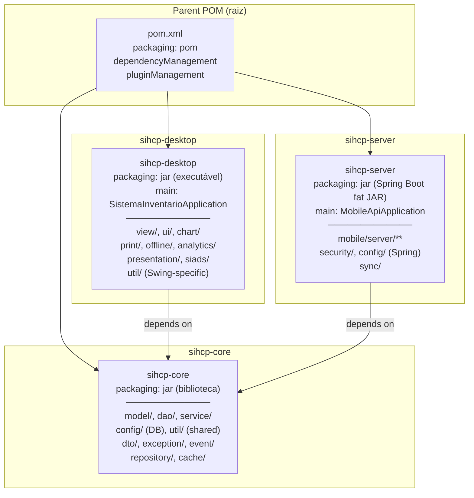
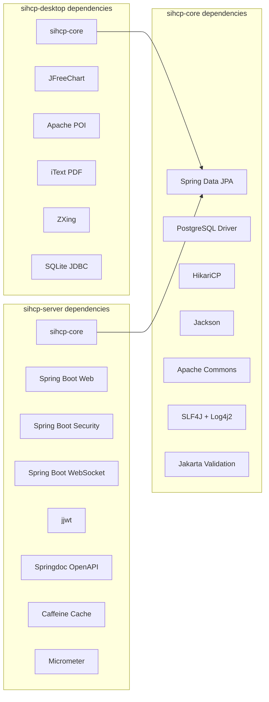
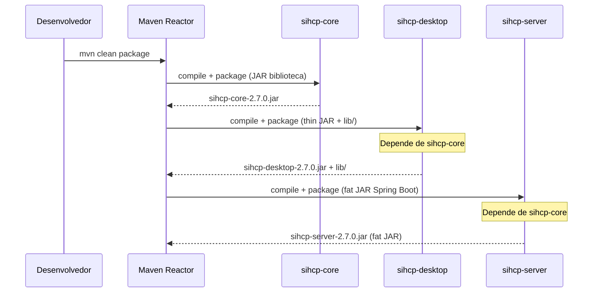

# Design Document — Separação em Módulos Maven

## Overview

Este documento descreve o design técnico para separar o projeto monolítico SIHCP em três módulos Maven independentes: `sihcp-core`, `sihcp-desktop` e `sihcp-server`. A separação visa eliminar o acoplamento entre a aplicação desktop Swing e o servidor REST Spring Boot, permitindo builds independentes, classpath limpo e deploys separados.

### Motivação

O projeto atual empacota ~400 classes Java em um único JAR. O servidor carrega classes Swing, JFreeChart e Apache POI que não utiliza. O desktop carrega Spring Security, JWT e controllers REST que não precisa. A classe `DatabaseConfigManager` é instanciada diretamente com `new` no desktop mas precisa participar do contexto Spring no servidor. Essa mistura causa:

- JARs maiores que o necessário (~80MB+ com todas as dependências)
- Risco de conflitos de classpath e inicialização acidental de beans
- Impossibilidade de testar módulos isoladamente
- Dificuldade de manutenção e evolução independente

### Decisão Arquitetural

A abordagem escolhida é um **Maven multi-module project** com herança de POM, onde:

- O **parent POM** na raiz centraliza versões e plugins
- O **sihcp-core** é uma biblioteca JAR sem main class
- O **sihcp-desktop** gera um thin JAR com `lib/` externa
- O **sihcp-server** gera um fat JAR Spring Boot

Esta abordagem foi escolhida sobre alternativas (como Gradle multi-project ou JPMS modules) porque o projeto já usa Maven, a equipe conhece Maven, e a migração é incremental sem reescrever o build system.

## Architecture

### Diagrama de Módulos



### Diagrama de Dependências



### Fluxo de Build



## Components and Interfaces

### 1. Parent POM (raiz)

O `pom.xml` raiz muda de `packaging: jar` para `packaging: pom` e declara os três módulos filhos. Todas as versões de dependências são centralizadas em `<dependencyManagement>` e plugins em `<pluginManagement>`.

**Responsabilidades:**
- Declarar `<modules>` na ordem: core, desktop, server
- Centralizar `<properties>` (java.version, encoding, versões de libs)
- Centralizar `<dependencyManagement>` com todas as versões
- Centralizar `<pluginManagement>` com configurações de plugins
- Manter profiles globais que se aplicam a múltiplos módulos

**Decisão:** O parent POM herda de `spring-boot-starter-parent` para manter compatibilidade com o gerenciamento de versões do Spring Boot. Apenas o módulo server usa o `spring-boot-maven-plugin` para repackage; os outros módulos o desabilitam.

### 2. sihcp-core — Módulo Compartilhado

**Pacotes incluídos:**

| Pacote | Conteúdo | Justificativa |
|--------|----------|---------------|
| `com.inventario.model` | Entidades JPA (Patrimonio, Usuario, Coleta, etc.) | Compartilhado por desktop e server |
| `com.inventario.dao` | BaseDAO, PatrimonioDAO, UsuarioDAO, etc. | DAOs usam JDBC direto, compartilhados |
| `com.inventario.service` | PatrimonioService, ColetaService, UsuarioService, etc. | Lógica de negócio compartilhada |
| `com.inventario.config` (parcial) | DatabaseConfigManager, DatabaseConfig, HikariConnectionPool, DatabaseConfiguration, ConfigurationPaths, CampusConfig, ConfigGenerator, ConfigFileWatcher, DAOConfiguration, SetupConfig, NotificationConfig | Configuração de banco e DAOs como beans |
| `com.inventario.util` (parcial) | DatabaseConnection, ConnectionManager, ValidationUtils, DateFormatUtils, DataSanitizer, DescricaoNormalizador, PasswordEncryption, PasswordUtil, PasswordHashGenerator, VersionInfo, Page, PortManager, ExceptionHandler, ConfiguracaoBancoUtil, ConfigurationMigration | Utilitários sem dependência de Swing ou Spring Web |
| `com.inventario.dto` | DTOs compartilhados | Transferência de dados entre camadas |
| `com.inventario.exception` | Exceções de negócio | Compartilhadas |
| `com.inventario.event` | Eventos de domínio | Compartilhados |
| `com.inventario.repository` | Interfaces de repositório | Compartilhadas |
| `com.inventario.cache` | Cache de dados | Compartilhado |
| `com.inventario.itemcomposto` | Lógica de itens compostos | Compartilhada |

**Dependências do core:**
- `spring-boot-starter-data-jpa` (para anotações JPA e EntityManager)
- `spring-boot-starter-log4j2`
- `postgresql` (runtime)
- `jackson-databind`
- `commons-lang3`, `commons-io`, `commons-collections4`
- `javax.annotation-api`
- `hikaricp` (transitiva via spring-boot-starter-data-jpa)
- `jakarta.validation-api`

**O core NÃO inclui:** spring-boot-starter-web, spring-boot-starter-security, JFreeChart, Apache POI, iText, ZXing, SQLite, jjwt, springdoc-openapi.

### 3. sihcp-desktop — Módulo Desktop

**Pacotes incluídos:**

| Pacote | Conteúdo |
|--------|----------|
| `com.inventario.view` | Todos os frames e dialogs Swing |
| `com.inventario.ui` | Controllers de UI desktop |
| `com.inventario.chart` | Gráficos JFreeChart |
| `com.inventario.print` | Impressão e geração de relatórios |
| `com.inventario.offline` | Modo offline com SQLite |
| `com.inventario.analytics` | Analytics desktop |
| `com.inventario.presentation` | Camada de apresentação desktop |
| `com.inventario.siads` | Integração SIADS |
| `com.inventario.util` (parcial) | IconManager, ImageUtils, ImageProcessor, DialogUtils, FormUtils, SoundNotification, SingleInstanceManager, SingleInstanceLock, IconPreview, QrCodeGenerator, ExcelExporter, ExcelExporterAlternativo, CsvExcelGenerator, RelatorioExcelGenerator, RelatorioPDFGenerator, HistoricoExcelGenerator, HistoricoPDFGenerator, ImportacaoCSV, ImportacaoExcel, MobileApiClient, MobileServerProcessManager, CadastrarItensCompostosMassa, CriarTabelasCategoriaUtil, CriarTabelasItemComposto, DatabaseExecuteUpdate, DatabaseTestQuery, ExecutarScriptSQL |
| `com.inventario.service` (parcial) | MobileServerManager, MobileConnectionService, ConnectedDevicesManager, DataImportService, RelatorioService, RelatorioItemCompostoService, ExportacaoItemCompostoService, MemoryMonitorService |
| `com.inventario.config` (parcial) | MobileServerProcessManager |
| `com.inventario` (raiz) | SistemaInventarioApplication, TesteSalvar |

**Dependências adicionais (além do core):**
- `sihcp-core`
- `jfreechart`
- `poi`, `poi-ooxml`, `poi-ooxml-full`, `poi-scratchpad` + dependências transitivas
- `itext-kernel`, `itext-layout`, `itext-io`
- `zxing-core`, `zxing-javase`
- `sqlite-jdbc`

### 4. sihcp-server — Módulo Server

**Pacotes incluídos:**

| Pacote | Conteúdo |
|--------|----------|
| `com.inventario.mobile.server` | Controllers REST, DTOs mobile, services mobile, config mobile, security mobile, util mobile |
| `com.inventario.security` | JwtTokenProvider, JwtUtil, JwtAuthenticationFilter, JwtAuthenticationEntryPoint, CustomUserDetailsService, anotações (@RequireAdmin, etc.) |
| `com.inventario.config` (parcial) | SecurityConfig, MobileDataSourceConfig, CacheConfig, AsyncConfig, WebSocketConfig, SchedulingConfig |
| `com.inventario.sync` | Sincronização server-side |
| `com.inventario.service` (parcial) | DataSyncService, DataSyncScheduler, SyncStatusManager, DispositivoMobileService, FotoReferenciaService, HistoricoColetaService |
| `com.inventario` (raiz) | MobileApiApplication |

**Dependências adicionais (além do core):**
- `sihcp-core`
- `spring-boot-starter-web`
- `spring-boot-starter-security`
- `spring-boot-starter-websocket`
- `spring-boot-starter-cache`
- `spring-boot-starter-actuator`
- `jjwt-api`, `jjwt-impl`, `jjwt-jackson`
- `springdoc-openapi-starter-webmvc-ui`
- `caffeine`
- `micrometer-registry-prometheus`, `micrometer-core`
- `spring-boot-starter-data-redis` (optional)

### 5. Resolução do DatabaseConfigManager (Dual-Mode)

**Problema atual:** `DatabaseConfigManager` é uma classe POJO instanciada com `new` no desktop. No servidor, `DAOConfiguration` cria DAOs com `new PatrimonioDAO()`, e esses DAOs usam `DatabaseConnection` (estático) que internamente cria um `DatabaseConfigManager`. O servidor usa `MobileDataSourceConfig` (bean Spring com `@Value`) para criar o DataSource do JPA, mas os DAOs usam JDBC direto via `DatabaseConnection`.

**Solução: Manter o padrão atual no core, sem forçar Spring.**

O `DatabaseConfigManager` permanece como POJO no core. A classe `DatabaseConnection` permanece com métodos estáticos. Os DAOs continuam usando `DatabaseConnection.getConnection()`. Isso funciona tanto no desktop (instanciação direta) quanto no servidor (os DAOs são criados via `DAOConfiguration` como beans, mas internamente usam o mesmo `DatabaseConnection` estático).

Para o servidor, o `MobileDataSourceConfig` continua criando um `DataSource` Spring separado para o JPA/Hibernate, lendo configurações do `application-mobile.properties`. Os DAOs JDBC e o JPA DataSource coexistem — ambos apontam para o mesmo banco, mas com pools separados.

**Decisão de design:** Não refatorar o `DatabaseConfigManager` para ser um bean Spring. A complexidade de torná-lo dual-mode (Spring + não-Spring) não justifica o risco de quebrar o desktop. O padrão atual de "POJO + métodos estáticos" é simples e funciona. Futuramente, quando os DAOs forem migrados para Spring Data JPA repositories, o `DatabaseConnection` estático pode ser eliminado.

```mermaid
graph TB
    subgraph "sihcp-core"
        DCM["DatabaseConfigManager<br/>(POJO - new)"]
        DC["DatabaseConnection<br/>(static methods)"]
        HCP["HikariConnectionPool<br/>(singleton)"]
        DAOS["BaseDAO / PatrimonioDAO / ...<br/>(JDBC direto)"]
        
        DCM --> DC
        DC --> HCP
        DAOS --> DC
    end

    subgraph "sihcp-desktop"
        SIA["SistemaInventarioApplication"]
        SIA -->|new| DCM
        VIEWS["Views (Swing)"] -->|new| DAOS
    end

    subgraph "sihcp-server"
        MDS["MobileDataSourceConfig<br/>(@Configuration, @Value)"]
        DAOCFG["DAOConfiguration<br/>(@Bean)"]
        CTRL["REST Controllers<br/>(@Autowired)"]
        
        DAOCFG -->|new| DAOS
        CTRL -->|@Autowired| DAOS
        MDS -->|cria| DS["HikariDataSource<br/>(Spring managed)"]
    end
```

### 6. ComponentScan com Pacotes em Módulos Diferentes

**Problema:** O `MobileApiApplication` usa `@ComponentScan` com pacotes específicos. Após a modularização, esses pacotes estarão em JARs diferentes (core e server).

**Solução:** O `@ComponentScan` do Spring funciona com pacotes no classpath, independente de qual JAR contém as classes. Como o `sihcp-server` declara `sihcp-core` como dependência Maven, todas as classes do core estarão no classpath do server. O `@ComponentScan` existente continuará funcionando sem alterações:

```java
@ComponentScan(basePackages = {
    "com.inventario.mobile.server",  // no sihcp-server
    "com.inventario.service",         // no sihcp-core
    "com.inventario.dao",             // no sihcp-core
    "com.inventario.util",            // no sihcp-core
    "com.inventario.security"         // no sihcp-server
})
```

O `@EntityScan(basePackages = "com.inventario.model")` também funciona da mesma forma — as entidades JPA no core serão detectadas pelo server.

**Adição necessária:** O `@ComponentScan` precisa incluir `com.inventario.config` para que `DAOConfiguration`, `MobileDataSourceConfig` e `SecurityConfig` sejam detectados:

```java
@ComponentScan(basePackages = {
    "com.inventario.mobile.server",
    "com.inventario.service",
    "com.inventario.dao",
    "com.inventario.config",    // ADICIONADO
    "com.inventario.security",
    "com.inventario.sync"       // ADICIONADO
})
```

## Data Models

### Estrutura de Diretórios do Projeto Multi-Módulo

```
MASTER_INVENTÁRIO/
├── pom.xml                          # Parent POM (packaging: pom)
├── sihcp-core/
│   ├── pom.xml                      # Core module POM
│   └── src/main/java/com/inventario/
│       ├── model/                   # Entidades JPA
│       ├── dao/                     # DAOs (JDBC)
│       ├── service/                 # Services compartilhados
│       ├── config/                  # Config de banco e DAOs
│       ├── util/                    # Utilitários compartilhados
│       ├── dto/                     # DTOs compartilhados
│       ├── exception/               # Exceções
│       ├── event/                   # Eventos
│       ├── repository/              # Interfaces de repositório
│       ├── cache/                   # Cache
│       └── itemcomposto/            # Itens compostos
├── sihcp-desktop/
│   ├── pom.xml                      # Desktop module POM
│   └── src/main/java/com/inventario/
│       ├── SistemaInventarioApplication.java
│       ├── view/                    # Frames e Dialogs Swing
│       ├── ui/                      # Controllers de UI
│       ├── chart/                   # Gráficos
│       ├── print/                   # Impressão
│       ├── offline/                 # Modo offline
│       ├── analytics/               # Analytics
│       ├── presentation/            # Apresentação
│       ├── siads/                   # Integração SIADS
│       ├── util/                    # Utilitários desktop-specific
│       ├── config/                  # Config desktop-specific
│       └── service/                 # Services desktop-specific
├── sihcp-server/
│   ├── pom.xml                      # Server module POM
│   └── src/main/java/com/inventario/
│       ├── MobileApiApplication.java
│       ├── mobile/server/           # API REST completa
│       ├── security/                # JWT e autenticação
│       ├── config/                  # Config Spring (Security, Cache, etc.)
│       ├── sync/                    # Sincronização
│       └── service/                 # Services server-specific
├── src/main/resources/              # Resources compartilhados (migrar)
│   ├── application.properties
│   └── application-mobile.properties
├── InventarioMobile/                # App Android (não afetado)
├── sql/                             # Scripts SQL
└── lib/                             # JARs externos
```

### Mapeamento de Classes de Serviço

Alguns services são usados apenas por um módulo. A tabela abaixo define o mapeamento:

| Service | Módulo | Justificativa |
|---------|--------|---------------|
| PatrimonioService | core | Usado por desktop e server |
| ColetaService | core | Usado por desktop e server |
| UsuarioService | core | Usado por desktop e server |
| InventarioService | core | Usado por desktop e server |
| SalaService | core | Usado por desktop e server |
| SetorService | core | Usado por desktop e server |
| ResponsavelService | core | Usado por desktop e server |
| DashboardService | core | Usado por desktop e server |
| ParticipanteInventarioService | core | Usado por desktop e server |
| SalaInventarioService | core | Usado por desktop e server |
| CampusService | core | Usado por desktop e server |
| DescricaoResumoService | core | Usado por desktop e server |
| AutenticacaoService (interface) | core | Interface compartilhada |
| AutenticacaoServiceDB | core | Implementação DB compartilhada |
| AutenticacaoServiceAPI | core | Implementação API compartilhada |
| UnifiedAuthService | core | Autenticação unificada |
| ServiceFactory | core | Factory compartilhada |
| BusinessException | core | Exceção compartilhada |
| RelatorioService | desktop | Relatórios com POI/iText |
| RelatorioItemCompostoService | desktop | Relatórios desktop |
| ExportacaoItemCompostoService | desktop | Exportação desktop |
| DataImportService | desktop | Importação de dados |
| MobileServerManager | desktop | Gerencia processo do server |
| MobileConnectionService | desktop | Conexão com server mobile |
| ConnectedDevicesManager | desktop | Dispositivos conectados |
| MemoryMonitorService | desktop | Monitor de memória desktop |
| DataSyncService | server | Sincronização server-side |
| DataSyncScheduler | server | Agendamento de sync |
| SyncStatusManager | server | Status de sincronização |
| DispositivoMobileService | server | Gestão de dispositivos |
| FotoReferenciaService | server | Fotos de referência |
| HistoricoColetaService | server | Histórico de coletas |

### Mapeamento de Classes de Config

| Config Class | Módulo | Justificativa |
|-------------|--------|---------------|
| DatabaseConfigManager | core | Leitura de config de banco |
| DatabaseConfig (POJO) | core | Modelo de config |
| DatabaseConfiguration | core | Config Spring de banco |
| HikariConnectionPool | core | Pool de conexões |
| ConfigurationPaths | core | Caminhos de config |
| CampusConfig | core | Config de campus |
| ConfigGenerator | core | Gerador de config |
| ConfigFileWatcher | core | Watcher de config |
| DAOConfiguration | core | DAOs como beans Spring |
| SetupConfig | core | Setup inicial |
| NotificationConfig | core | Config de notificações |
| SecurityConfig | server | Spring Security |
| MobileDataSourceConfig | server | DataSource do server |
| CacheConfig | server | Cache Caffeine |
| AsyncConfig | server | Async Spring |
| WebSocketConfig | server | WebSocket |
| SchedulingConfig | server | Agendamento |
| MobileServerProcessManager | desktop | Gerencia processo server |

## Correctness Properties

*A property is a characteristic or behavior that should hold true across all valid executions of a system — essentially, a formal statement about what the system should do. Properties serve as the bridge between human-readable specifications and machine-verifiable correctness guarantees.*

### Property 1: Core Module Import Isolation

*For any* Java source file in the `sihcp-core` module, the file SHALL NOT contain imports from `javax.swing.*`, `org.springframework.web.*`, or `org.springframework.security.*` packages. This ensures the core module remains free of UI and server-specific dependencies.

**Validates: Requirements 2.5, 5.3**

### Property 2: Desktop Dependency Isolation

*For any* resolved dependency (direct or transitive) in the `sihcp-desktop` module's dependency tree, the dependency SHALL NOT be `spring-boot-starter-web`, `spring-boot-starter-security`, any `jjwt-*` artifact, or `springdoc-openapi-*`. This ensures the desktop JAR does not contain server-specific libraries.

**Validates: Requirements 3.8**

### Property 3: Server Dependency Isolation

*For any* resolved dependency (direct or transitive) in the `sihcp-server` module's dependency tree, the dependency SHALL NOT be `jfreechart`, any `poi-*` artifact, any `itext-*` artifact (kernel, layout, io), or `sqlite-jdbc`. This ensures the server JAR does not contain desktop-specific libraries.

**Validates: Requirements 4.7**

### Property 4: DatabaseConfigManager Configuration Round-Trip

*For any* valid database configuration (host string, port integer 1-65535, database name, username, password), saving the configuration via `DatabaseConfigManager.saveConfiguration()` and then loading it via a new `DatabaseConfigManager()` instance SHALL produce a configuration with identical host, port, database, username, and password values.

**Validates: Requirements 7.5**

## Error Handling

### Erros de Compilação por Dependência Circular

Se uma classe no `sihcp-core` referenciar uma classe que está no `sihcp-desktop` ou `sihcp-server`, o Maven reportará um erro de compilação na fase `compile` do core. Isso é o comportamento desejado — o grafo de dependências é acíclico (core ← desktop, core ← server).

**Mitigação durante migração:** Se durante a migração uma classe do core tiver uma referência acidental a uma classe desktop/server, a solução é:
1. Mover a classe referenciada para o core (se for compartilhada)
2. Extrair uma interface no core e mover a implementação para o módulo correto
3. Usar injeção de dependência para inverter a dependência

### Erros de ClassNotFoundException em Runtime

Após a modularização, se o desktop tentar instanciar uma classe que foi movida para o server (ou vice-versa), ocorrerá `ClassNotFoundException` em runtime.

**Mitigação:** 
- Compilação separada de cada módulo garante que referências inválidas são detectadas em build time
- Testes de integração verificam que cada módulo inicia corretamente
- O mapeamento de classes neste documento serve como referência autoritativa

### Erros de Bean Not Found no Spring Context

Se o `@ComponentScan` do server não incluir um pacote necessário, beans não serão detectados e o Spring lançará `NoSuchBeanDefinitionException`.

**Mitigação:**
- O `@ComponentScan` deve incluir explicitamente todos os pacotes necessários (incluindo `com.inventario.config`)
- Testes de integração que iniciam o Spring context detectam beans faltantes
- O `@EntityScan` deve apontar para `com.inventario.model` no core

### Erros de Configuração de Banco

O `DatabaseConfigManager` lê configuração de múltiplos caminhos (properties file, JSON fallback). Após a modularização, os caminhos relativos podem mudar se o working directory for diferente.

**Mitigação:**
- `ConfigurationPaths` usa caminhos absolutos baseados em `user.home`
- Testes verificam que a configuração é lida corretamente de ambos os contextos (desktop e server)

## Testing Strategy

### Abordagem Dual: Testes Unitários + Testes de Propriedade

**Testes Unitários (example-based):**
- Verificar que cada módulo compila isoladamente
- Verificar que os artefatos JAR são gerados corretamente
- Verificar que o manifest do JAR contém a main class correta
- Verificar que o Spring context do server inicia sem erros
- Verificar que o desktop inicia sem o Spring context
- Verificar que os endpoints REST respondem corretamente após modularização

**Testes de Propriedade (property-based):**
- Biblioteca: **junit-quickcheck** (já presente no projeto como dependência de teste)
- Mínimo 100 iterações por teste de propriedade
- Cada teste referencia a propriedade do design document

**Configuração de PBT:**
```java
@Property(trials = 100)
// Feature: separacao-modulos, Property 4: DatabaseConfigManager Configuration Round-Trip
```

### Testes de Propriedade Planejados

| Property | Tipo de Teste | Módulo de Teste |
|----------|--------------|-----------------|
| Property 1: Core Import Isolation | Scan de imports em arquivos .java | sihcp-core (test) |
| Property 2: Desktop Dependency Isolation | Parse de dependency:tree output | sihcp-desktop (test) |
| Property 3: Server Dependency Isolation | Parse de dependency:tree output | sihcp-server (test) |
| Property 4: Config Round-Trip | PBT com junit-quickcheck | sihcp-core (test) |

### Testes de Integração Planejados

| Teste | O que verifica |
|-------|---------------|
| Build completo (`mvn clean package`) | Todos os módulos compilam na ordem correta |
| Server Spring context startup | Todos os beans são detectados e injetados |
| Desktop standalone startup | Desktop inicia sem Spring context |
| API endpoint smoke test | Endpoints REST respondem após modularização |
| Health check | `/api/mobile/health` retorna 200 |
| Profile compatibility | Profiles `thin-jar`, `mobile`, `fat-jar` funcionam |

### Estratégia de Migração Incremental

A migração será feita em fases para minimizar risco:

**Fase 1 — Estrutura de diretórios e Parent POM:**
- Criar diretórios `sihcp-core/`, `sihcp-desktop/`, `sihcp-server/`
- Converter pom.xml raiz para parent POM
- Criar POMs filhos com dependências corretas
- Verificar: `mvn clean compile` passa

**Fase 2 — Mover classes do core:**
- Mover `model/`, `dao/`, `service/` (compartilhados), `config/` (banco), `util/` (compartilhados)
- Mover `dto/`, `exception/`, `event/`, `repository/`, `cache/`, `itemcomposto/`
- Verificar: `mvn clean compile` no core passa

**Fase 3 — Mover classes do desktop:**
- Mover `view/`, `ui/`, `chart/`, `print/`, `offline/`, `analytics/`, `presentation/`, `siads/`
- Mover utilitários e services desktop-specific
- Mover `SistemaInventarioApplication`
- Verificar: `mvn clean compile` no desktop passa

**Fase 4 — Mover classes do server:**
- Mover `mobile/server/`, `security/`, `sync/`
- Mover configs e services server-specific
- Mover `MobileApiApplication`
- Verificar: `mvn clean compile` no server passa

**Fase 5 — Verificação completa:**
- `mvn clean package` na raiz
- Testar desktop standalone
- Testar server com profile mobile
- Rodar testes de propriedade e integração
- Verificar scripts de build existentes

**Fase 6 — Mover resources:**
- `application.properties` → `sihcp-server/src/main/resources/`
- `application-mobile.properties` → `sihcp-server/src/main/resources/`
- Resources compartilhados (se houver) → `sihcp-core/src/main/resources/`
