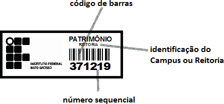
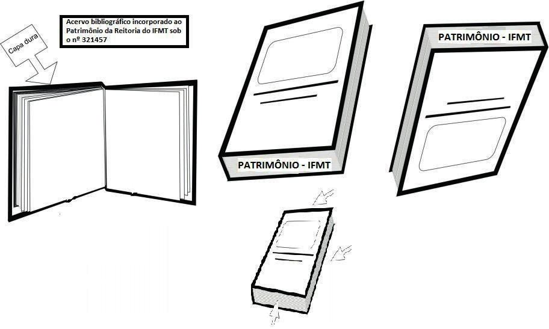
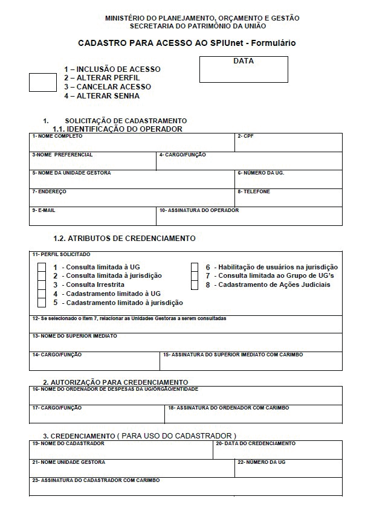

ANO I - 2019

> DE PROCEDIMENTOS DE PATRIMÔNIO
>
> **INSTITUTO** **FEDERAL**
>
> **DE** **EDUCAÇÃO,** **CIÊNCIA** **E** **TECNOLOGIA** Mato Grosso

> **Reitor** Willian Silva de Paula
>
> **Pró-reitor** **de** **Administração** **–** **PROAD** Túlio Marcel
> Rufino de Vasconcelos Figueiredo
>
> **Pró-reitora** **de** **Desenvolvimento** **Institucional** **–**
> **PRODIN** João Germano Rosinke
>
> **Pró-reitor** **de** **Ensino** **–** **PROEN** Carlos André de
> Oliveira Câmara
>
> **Pró-reitor** **de** **Extensão** **–** **PROEX** Marcus Vinicius
> Taques Arruda
>
> **Pró-reitor** **de** **Pesquisa** **e** **Inovação** **–** **PROPES**
> Wander Miguel de Barros
>
> Avenida Sen. Filinto Müller, 953 Bairro: Duque de Caxias - CEP:
> 78043-400
>
> Telefone: (65) 3616-4100 - Cuiabá/MT
>
> **MANUAL** de procedimentos
>
> de Patrimônio
>
> **2ª** **edição** **2019**
>
> Portaria nº 2.612, de 23 de Outubro de 2017 – Comissão de Atualização
> de Manual de Administração patrimonial.
>
> **Membros:**
>
> Hebert Alexander Soares da Silva - Reitoria Renato Luiz da Silva
> Costa - Campus Bela Vista Schampierri Miranda - Campus Pontes e
> Lacerda
>
> **Edição**
>
> Assessoria de Comunicação - Ascom
>
> **Coordenação**
>
> Léa Paula Vanessa Xavier Corrêa de Morais
>
> **Diagramação** Moisés de Jesus
>
> **Ficha** **Catolográfica** Jorge Nazareno Martins Costa
>
> **Revisão** Sandrine Robadey Huback
>
> **Fotos** **/** **Ilustrações**
>
> Arquivos do IFMT e arquivos públicos da internet
>
> **Publicação** **do** **Instituto** **Federal** **de** **Educação,**
> **Ciência** **e** **Tecnologia** **de** **Mato** **Grosso**
>
> Apresentação
>
> A Gestão do Patrimônio do Instituto Federal de Mato Grosso - IFMT
> requer diversas atribuições administrativas, dentre elas a aquisição,
> o recebimento, o controle, a manutenção e o desfazimento do seu ativo
> permanente.
>
> Cabe a Pró-reitora de Administração, órgão administrativo do IFMT, por
> **normatizar,** **planejar** **e** **executar** **essas**
> **atividades** **relativas** **ao** **patrimônio**, bem como
> normatizar, orientar, acompanhar e fiscalizar a execução destas
> ativi-dades nas diversas Unidades Gestoras componentes do IFMT.
>
> Os Setores de Almoxarifado e Patrimônio dos *campi* são responsáveis
> pela administração no seu respectivo campus. O controle patrimonial
> engloba as atividades de recebimento no Almoxarifado, registro no SUAP
> – Sistema Uni-ficado de Administração Pública, consumo, utilização,
> guarda, conservação, e desfazimento dos bens permanentes e de consumo.
>
> Este manual foi desenvolvido por uma Comissão de Servidores do
> Instituto Federal de Mato Grosso, nomeada através das Portarias n°
> 1.537, de 16 de junho de 2015 e nº 372 de 24 de junho de 2016. Os
> trabalhos foram desenvolvidos entre os anos de 2015 e 2016.
>
> Este manual visa orientar as ações dos servidores do IFMT,
> responsáveis por gerenciar o controle patrimonial em suas Unidades
> Gestoras, de forma a tornar essa atividade mais dinâmica, eficaz e
> adequada às atuais políticas de gestão pública e de fiscalização pelos
> órgãos de controle interno e externo. Atende à necessidade de
> proporcionar aos gestores e executores da gestão do patrimônio, uma
> melhor compreensão da natureza e da finalidade desta atividade.
>
> **Comissão** **organizadora.**

4 Manual de Procedimentos de Patrimônio

> Da Atualização
>
> Este manual aproveita o trabalho realizado pela primeira comissão
> respon-sável pelo manual de 2016 e segue com atualização via portaria
> 2.612, de 23 de outubro de 2017 e demais que fazem suas alterações.
>
> Foram revistos o procedimento de desfazimento e incluído os trabalhos
> realizados pelos Grupos de Trabalho GT4: Regularização de
> Transferências Patrimoniais Entre UGEs, Gt5: Manual de Administração
> Patrimonial e pelo GT6: Desfazimento de Bens.
>
> Dos trabalhos realizados foi adicionado o Termo de Cessão Anexo Q.
> Este termo foi desenvolvido na Coordenação Geral de Patrimônio da
> Reitoria, sen-do o primeiro do IFMT. Através do processo
> 23188.034322.2017-63 foi ana-lisado pela Procuradoria Federal junto ao
> IFMT. A minuta teve ajustes e pode ser utilizado conforme o que está
> no Anexo Q.
>
> **Comissão** **Organizadora**
>
> Manual de Procedimentos de Patrimônio 5
>
> SUMÁRIO

**CAPÍTULO** **I** . . . . . . . . . . . . . . . . . . . . . . . . . . .
. . . . . . . . . . . . . . . . . . . . . . . . . . . . . . . . . 8

> **DEFINIÇÕES** . . . . . . . . . . . . . . . . . . . . . . . . . . . .
> . . . . . . . . . . . . . . . . . . . . . . . . . . . 8

**CAPÍTULO** **II** . . . . . . . . . . . . . . . . . . . . . . . . . .
. . . . . . . . . . . . . . . . . . . . . . . . . . . . . . . . 12

> **DO** **ACERVO** **PATRIMONIAL** **DO** **IFMT** . . . . . . . . . .
> . . . . . . . . . . . . . . . . . . . . . . 12
>
> *SEÇÃO* *I* . . . . . . . . . . . . . . . . . . . . . . . . . . . . .
> . . . . . . . . . . . . . . . . . . . . . . . . . 12
>
> **DOS** **BENS** **MÓVEIS** **E** **DE** **CONSUMO** **DO** **IFMT** .
> . . . . . . . . . . . . . . . . . . . . . . . . 12
>
> *SEÇÃO* *II* . . . . . . . . . . . . . . . . . . . . . . . . . . . . .
> . . . . . . . . . . . . . . . . . . . . . . . . 12
>
> **DO** **CONTROLE** **PATRIMONIAL** . . . . . . . . . . . . . . . . .
> . . . . . . . . . . . . . . . . . . . . . 12
>
> *SEÇÃO* *III* . . . . . . . . . . . . . . . . . . . . . . . . . . . .
> . . . . . . . . . . . . . . . . . . . . . . . . . 13
>
> **DO** **MATERIAL** **PERMANENTE** . . . . . . . . . . . . . . . . . .
> . . . . . . . . . . . . . . . . . . . . . 13
>
> *SUBSEÇÃO* *I* . . . . . . . . . . . . . . . . . . . . . . . . . . . .
> . . . . . . . . . . . . . . . . . . . . . . . 14
>
> **DO** **RECEBIMENTO** **E** **ACEITAÇÃO** **DE** **MATERIAIS**
> **PERMANENTES** . . . . . . . . 14
>
> *SUBSEÇÃO* *II* . . . . . . . . . . . . . . . . . . . . . . . . . . .
> . . . . . . . . . . . . . . . . . . . . . . . 15
>
> **DO** **TOMBAMENTO** . . . . . . . . . . . . . . . . . . . . . . . .
> . . . . . . . . . . . . . . . . . . . . . . . . 15
>
> *SUBSEÇÃO* *III* . . . . . . . . . . . . . . . . . . . . . . . . . . .
> . . . . . . . . . . . . . . . . . . . . . . . 15
>
> **DA** **IDENTIFICAÇÃO** **DOS** **BENS**. . . . . . . . . . . . . . .
> . . . . . . . . . . . . . . . . . . . . . . . 15
>
> *SUBSEÇÃO* *IV* . . . . . . . . . . . . . . . . . . . . . . . . . . .
> . . . . . . . . . . . . . . . . . . . . . . . 16
>
> **DA** **CARGA,** **DESCARGA** **E** **MOVIMENTAÇÃO** **DE** **BENS**.
> . . . . . . . . . . . . . . . . . . 16
>
> *SUBSEÇÃO* *V* . . . . . . . . . . . . . . . . . . . . . . . . . . . .
> . . . . . . . . . . . . . . . . . . . . . . 17
>
> *SUBSEÇÃO* *VI* . . . . . . . . . . . . . . . . . . . . . . . . . . .
> . . . . . . . . . . . . . . . . . . . . . . . 17
>
> **DAS** **TRANSFERÊNCIAS** **PATRIMONIAIS**. . . . . . . . . . . . . .
> . . . . . . . . . . . . . . . . . 17
>
> *SUBSEÇÃO* *VII* . . . . . . . . . . . . . . . . . . . . . . . . . . .
> . . . . . . . . . . . . . . . . . . . . . . 18
>
> **REGULARIZAÇÃO** **DE** **TRANSFERÊNCIAS** **ENTRE** **UGS** . . . .
> . . . . . . . . . . . . . . . 18
>
> *SEÇÃO* *IV* . . . . . . . . . . . . . . . . . . . . . . . . . . . . .
> . . . . . . . . . . . . . . . . . . . . . . . . 19
>
> 6 Manual de Procedimentos de Patrimônio
>
> **DO** **MATERIAL** **DE** **CONSUMO** . . . . . . . . . . . . . . . .
> . . . . . . . . . . . . . . . . . . . . . . . 19
>
> *SUBSEÇÃO* *I* . . . . . . . . . . . . . . . . . . . . . . . . . . . .
> . . . . . . . . . . . . . . . . . . . . . . . 19
>
> **DA** **AQUISIÇÃO** . . . . . . . . . . . . . . . . . . . . . . . . .
> . . . . . . . . . . . . . . . . . . . . . . . . . . 19
>
> *SUBSEÇÃO* *II* . . . . . . . . . . . . . . . . . . . . . . . . . . .
> . . . . . . . . . . . . . . . . . . . . . . . 19
>
> **DO** **RECEBIMENTO** **E** **ACEITAÇÃO** **DE** **MATERIAL** **DE**
> **CONSUMO** . . . . . . . . . . 19
>
> *SUBSEÇÃO* *III* . . . . . . . . . . . . . . . . . . . . . . . . . . .
> . . . . . . . . . . . . . . . . . . . . . . . 20
>
> **DA** **ARMAZENAGEM** . . . . . . . . . . . . . . . . . . . . . . . .
> . . . . . . . . . . . . . . . . . . . . . . . 20
>
> *SUBSEÇÃO* *IV* . . . . . . . . . . . . . . . . . . . . . . . . . . .
> . . . . . . . . . . . . . . . . . . . . . . . 20
>
> **DA** **REQUISIÇÃO** **E** **DISTRIBUIÇÃO** . . . . . . . . . . . . .
> . . . . . . . . . . . . . . . . . . . . . . 20
>
> *SEÇÃO* *V* . . . . . . . . . . . . . . . . . . . . . . . . . . . . .
> . . . . . . . . . . . . . . . . . . . . . . . . 21
>
> **DOS** **INVENTÁRIOS** **FÍSICOS**. . . . . . . . . . . . . . . . . .
> . . . . . . . . . . . . . . . . . . . . . . . 21
>
> SEÇÃO VI . . . . . . . . . . . . . . . . . . . . . . . . . . . . . . .
> . . . . . . . . . . . . . . . . . . . . . 22
>
> **DO** **DESFAZIMENTO** . . . . . . . . . . . . . . . . . . . . . . .
> . . . . . . . . . . . . . . . . . . . . . . . . 22
>
> SEÇÃO VII . . . . . . . . . . . . . . . . . . . . . . . . . . . . . .
> . . . . . . . . . . . . . . . . . . . . . . 27
>
> **DOS** **BENS** **IMÓVEIS** . . . . . . . . . . . . . . . . . . . . .
> . . . . . . . . . . . . . . . . . . . . . . . . . . 27
>
> **FONTES** **CONSULTADAS**: . . . . . . . . . . . . . . . . . . . . .
> . . . . . . . . . . . . . . . . . . . . . . 29
>
> Manual de Procedimentos de Patrimônio 7
>
> **CAPÍTULO** **I**
>
> DEFINIÇÕES

**Alienação** **de** **bens** - É a modalidade de movi-mentação de bens
que consiste na transferência do direito de propriedade para outra
instituição me-diante venda, permuta ou doação.

**Amortização** – é a redução do valor aplicado na aquisição de direitos
de propriedade e quaisquer outros, inclusive ativos intangíveis, com
existência ou exercício de duração limitada, ou cujo objeto se-jam bens
de utilização por prazo legal ou contratu-almente limitado.

**Antieconômico** - bem móvel cuja manutenção seja onerosa ou cujo
rendimento seja precário, em virtude de uso prolongado, desgaste
prematuro ou obsoletismo.

**Ativo** **não** **Circulante** **ou** **Imobilizado** - Com-preende o
conjunto de bens de permanência dura-doura, tangíveis (móveis, imóveis e
semoventes), intangíveis (softwares, direitos, marcas e patentes),
destinados ao funcionamento das organizações (Pú-blicas e Privadas),
assim como os direitos e obriga-ções (créditos e valores) da
instituição.

**Baixa** **Patrimonial** **de** **bens** - é o procedimento de exclusão
dos bens do ativo imobilizado.

**Bem** **móvel** **acessório** - é aquele que poderá ser acoplado ao
bem principal, e/ou fazer parte in-tegrante do mesmo (Ex.: rádio de
veículo, equipa-mento a ser instalado em ambulância, etc.).

**Benfeitoria** - é uma obra útil ou necessária, rea-lizada no imóvel ou
terreno com finalidade de me-lhorá-la, conservá-la ou embelezá-la,
devendo seu custo ser incorporado ao valor do referido bem.

**Bens** **de** **particulares** - aqueles de propriedade de servidores,
utilizados para atender algum tipo de necessidade sem onerar a
instituição com a aquisi-ção dos mesmos. Os mais comuns são:
refrigera-dores (frigobar), ventiladores, fornos micro-ondas,

objetos de decoração (quadros, vasos, etc.) e muitas vezes adquiridos
através de rateios do valor pelo grupo interessado.

**Bens** **de** **terceiros** - são aqueles de propriedade de outra
organização (pública ou privada), prove-nientes de cessões ou permissões
de uso (transfe-rência gratuita de posse de um bem por prazo
deter-minado ou não), de comodato (empréstimo gratuito de bens que
deverão ser restituídos no tempo con-vencionado) ou de contratos de
locação (aluguel de veículos, máquinas, equipamentos, imóveis, etc.).

**Bens** **móveis** - são aqueles que podem se des-locados sem alteração
de sua forma, conservando as características principais. São
representados por mobiliários, máquinas e equipamentos, veículos e pelos
chamados “materiais permanentes.”.

**Bens** **imóveis** - aqueles com características não removíveis, isto
é, que não podem ser deslocados, sem perda das suas formas, e são
representados por terrenos e edificações.

**Bens** **intangíveis** - também denominados incor-póreos ou
imateriais. São aqueles sem conteúdo fí-sico, representados por valores
de títulos e direitos, tais como: ações, títulos de crédito, marcas,
paten-tes, softwares, etc.

**Bens** **semoventes** - são representados por todos os tipos de
animais utilizados pela organização e que, dependendo da finalidade da
mesma serão bas-tante representativos dentro do ativo não circulante ou
imobilizado.

**Bens** **tangíveis** - também denominados corpóre-os ou materiais. São
aqueles com conteúdo físico, tais como: móveis (mobiliário),
equipamentos, ve-ículos, terrenos, prédios, obras de arte, edificações
em geral, e semoventes (animais utilizados pela ins-tituição).

**Carga** - é a efetiva responsabilidade pela guarda e uso do bem pelo
seu detentor/responsável.

**Carga** **patrimonial** - é o rol de bens patrimo-niais confiados pelo
Setor de Patrimônio a um ser-

> 8 Manual de Procedimentos de Patrimônio

vidor, aqui denominado de Responsável, para a execução das atividades
por ele exercidas.

**Cessão** - Modalidade de movimentação de bens de caráter precário e
por prazo determinado, com transferência de posse entre órgãos da União;
entre a União e as autarquias e fundações públicas fede-rais; ou entre a
União e as autarquias e fundações públicas federais e os Estados, o
Distrito Federal e os Municípios e suas autarquias e fundações
pú-blicas.

**Comissão** **de** **Inventário** **de** **Bens** **Móveis** -
co-missão especial constituídas de no mínimo 3 (três) servidores, por
ato do dirigente de cada unidade gestora com a finalidade de proceder à
avaliação, tombamento, entre outras providências, na forma da legislação
vigente, a alienação de bens conside-rados ociosos.

**Depreciação:** é a redução do valor dos bens pelo desgaste ou perda de
utilidade por uso, ação da natureza ou obsolescência.

**Descarga** - é o procedimento que se efetivará com a transferência de
responsabilidade pela guar-da do bem para o novo detentor/responsável.

**Desfazimento** - é a denominação dada ao pro-cesso adotado pela área
pública no tocante à retirada do seu patrimônio, de bens, cuja
utilização não é mais necessária, sempre de acordo com a legislação
vigente.

**Detentor** - é aquele servidor que detém tempo-rariamente sob sua
guarda bens patrimoniais.

**Disponibilidade** - é o procedimento pelo qual o usuário
(detentor/responsável) informa o desuso do

> bem à área de patrimônio. **Comissão** **de** **recebimento** **e**
> **aceitação** **de**

**bens** - poderá ser constituída de forma especial ou permanente, para
proceder à aceitação de bens patrimoniais, adquiridos pelo órgão,
dependendo da complexidade dos mesmos. Sempre indicado a criação deste
quando envolve recebimento de bens de natureza complexa.

**Comissão** **de** **Avaliação** **e** **Alienação** **de** **Bens** -
são constituídas através de portaria da autoridade competente e baseadas
em legislações especificas com atribuições bem definidas no tocante à
análise dos bens considerados inservíveis (ociosos, recupe-ráveis,
antieconômicos ou irrecuperáveis), atribuin-do-lhes valor, se for o
caso, e definindo a melhor forma de alienação dos mesmos.

**Depósito** - local destinado à guarda temporária de bens móveis (bens
em trânsito), desde a sua li-beração pelo setor responsável pelo
recebimento (Almoxarifado, Patrimônio, Comissão, etc.) até a sua
destinação final, com o acesso restrito aos ser-vidores do patrimônio
e/ou almoxarifado. Local destinado aos bens recolhidos ou devolvidos
(para manutenção, fora de uso, obsoletos, antieconômi-cos,
irrecuperáveis, etc.) até que seja providenciada a movimentação dos
mesmos para conserto, redis-tribuição ou alienação.

**Doação** - é a passagem gratuita do direito de propriedade dos bens de
uma organização para ou-tra, havendo necessidade de que o processo seja
devidamente documentado, principalmente a etapa final, com a emissão do
termo de doação, de acordo com as legislações vigentes.

**Empréstimo** - consiste na saída de um bem de seu local de guarda para
outro local mediante as-sinatura do Termo de Empréstimo ou Cautela pelo
novo responsável pelo bem.

**Etiquetagem** - é a identificação física do bem através de uma
etiqueta (ou chapa/placa) contendo o número de tombamento (número
identificador de patrimônio) atribuído ao bem.

**Exaustão** **–** é a redução do valor, decorrente da exploração, dos
recursos minerais, florestais e outros recursos naturais esgotáveis.

**Extravio** - é o desaparecimento de um bem pro-vocado por perda, roubo
ou furto.

**Incorporação** - é o ato de registro no sistema informatizado de
gestão patrimonial do material adquirido e a consequente variação
positiva do pa-

> Manual de Procedimentos de Patrimônio 9

trimônio de cada unidade gestora.

**Inutilização**: Consiste na destruição total ou parcial de material
que ofereça ameaça vital para as pessoas, risco de prejuízo ecológico ou
inconve-nientes, de qualquer natureza, para a Administração Pública.

**Inventários** - consistem no levantamento e identificação dos bens e
instalações, visando com-provação da existência física, integridade das
infor-mações contábeis e responsabilidade dos usuários detentores dos
bens.

**Irrecuperável** - bem móvel que não pode ser utilizado para o fim a
que se destina devido à perda de suas características ou em razão de ser
o seu cus-to de recuperação mais de cinquenta por cento do seu valor de
mercado ou de a análise do seu custo e benefício demonstrar ser
injustificável a sua recu-peração.

**Localização** **física** - é o local representado por edifício, andar,
sala, terreno ou outra edificação, ao qual obrigatoriamente um bem ou um
conjunto de bens móveis estão alocados.

**Material** - Designação genérica de equipamen-tos, componentes,
acessórios, veículos em geral, matérias-primas e outros itens empregados
nas ati-vidades das organizações públicas.

**Material** **de** **consumo** - é aquele que, em razão de seu uso
corrente, perde sua durabilidade física em dois anos e/ou tem sua
utilização limitada a este período.

**Material** **permanente** - é aquele que, em razão de seu uso
corrente, tem durabilidade e utilização superior a dois anos, levando em
consideração pa-râmetros excludentes da Portaria nº 448/2002 da STN.

**Movimentação** - é a transferência de um bem entre endereços
individuais de um local para outro, depois da emissão e assinatura dos
respectivos Ter-mos de Responsabilidade**.**

**Ocioso** – quando o bem embora em perfeitas condições de uso, não
estiver sendo aproveitado.

**PA** – Transferência contábil feita no SIAFI para regularização das
contas físicas cadastrada no SUAP e contábil no SIAFI. Este segue com um
có-digo que é usado para dar baixa no SUAP da trans-ferência feita.

**Patrimônio** - conjunto de bens, direitos e obri-gações, suscetíveis
de apreciação econômica (de-preciação ou reavaliação, de acordo com a
legisla-ção vigente), obtidos através de compra, doação ou outra forma
de aquisição, devidamente identifica-dos e registrados.

**Permuta** – forma de alienação que consiste em um determinado bem ser
dado em troca de outro, ou como parte de pagamento na aquisição de
outro, condição que deverá constar do edital de licitação ou do convite.

**Recolhimento** - é a modalidade de movimenta-ção de bens de um
endereço individual para o De-pósito do Patrimônio, acompanhada da
respectiva regularização da carga patrimonial.

**Recuperação** - é o procedimento pelo qual se restaura um bem, antes
danificado, avariado ou apresentando algum tipo de problema, colocando-o
em condições de uso.

**Recuperável** – bem móvel que não se encontra em condições de uso e
cujo custo da recuperação seja de até cinquenta por cento do seu valor
de mer-cado ou cuja análise de custo e benefício demonstre ser
justificável a sua recuperação.

**Redistribuição** - é a modalidade de movimenta-ção de bens armazenados
no Depósito do Patrimô-nio para um endereço individual acompanhada da
respectiva regularização da carga patrimonial.

**Reforma** - corresponde a uma modificação, sem alteração das dimensões
externas das instalações fí-sicas de um imóvel.

> **Registro** **patrimonial** - procedimento adminis-
>
> 10 Manual de Procedimentos de Patrimônio

trativo que consiste em registrar no patrimônio do IFMT todos os bens de
caráter permanente, com in-dicação dos elementos necessários para a
perfeita caracterização de cada um deles e dos agentes res-ponsáveis
pela sua guarda e administração.

**Relatório** **de** **Movimentação** **de** **Almoxarifado**
**(RMA)** - Relatório emitido pelo setor de Almoxa-rifado e encaminhado
ao setor contábil da Unidade, até o 5º dia útil do mês subsequente ao de
referên-cia.

**Relatório** **de** **Movimentação** **de** **Bens** **(RMB)** -
Relatório emitido pelo setor de Patrimônio e enca-minhado ao setor
contábil da Unidade, até o 5º dia útil do mês subsequente ao de
referência.

**Remembramento** - é o oposto do desdobra-mento, quando vários imóveis
são incorporados a outro passando a ocorrer um único registro
patri-monial. Obs.: com relação a imóveis é importan-te observar que
despesas com manutenção predial (reparos, pintura, troca de pisos,
janelas, etc.) não terão o seu valor incorporado aos mesmos.

**Renúncia** **ao** **direito** **de** **propriedade** **ou**
**des-fazimento** - é a modalidade de movimentação de bens que consiste
no seu abandono ou inutilização, quando verificada a impossibilidade ou
inconveni-ência da alienação do material classificado como
irrecuperável.

**Responsabilidade** **patrimonial** - São deveres dos servidores, no
que diz respeito ao patrimônio: zelar pela economia do material, pela
conservação, pela sua guarda e utilização.

**Responsável** - é todo aquele que, a qualquer tí-tulo, seja
depositário, responsável, encarregado ou outra forma que resulte em
responsabilidade pela guarda, depósito ou uso do bem de propriedade da
União.

**Sinistro** - é o processo de danificação ou des-truição de um bem pela
ação de fenômenos natu-rais como: raios, trovoadas, vendavais,
enchentes, deslizamento de terras, etc., ou ainda por acidentes ou ações
criminosas, como: incêndios, explosões,

vandalismo, etc.

**Situação** **dos** **bens** - os bens poderão estar em uso, compondo o
patrimônio físico e fazendo parte do Ativo Não Circulante, ou estar em
desuso, isto é, classificados em ociosos, recuperáveis, antieconô-micos
e irrecuperáveis, ou ainda excedentes. Tam-bém poderão apresentar nos
seus controles “status do bem” como, por exemplo: em uso, em processo de
aceitação, em processo de alienação, destinados a doação, em poder de
terceiros, em recuperação, etc. No SUAPpode ser atribuído demais
caracterís-ticas através dos Rótulos, cadastrando eles e apli-cando aos
bens na aba inventário.

**Termo** **Circunstanciado** **Administrativo** - Do-cumento utilizado
para apuração de extravio ou dano a bem público, que implica em prejuízo
de pequeno valor.

**Termo** **de** **Inutilização** **ou** **de** **Justificativa** **de**
**Abandono** - Utilizado no processo de desfazimento de materiais que se
encontram nas seguintes situa-ções: a) Infestados por insetos nocivos,
com risco para outros materiais; b) Tóxico ou venenoso; c) Contaminado
por radioatividade.

**Termo** **de** **Responsabilidade** - é o documen-to pelo qual a
Coordenação de Patrimônio passa a carga dos bens ao responsável pelo
mesmo, no tocante à sua guarda, depósito ou uso ou quando há a
transferência de responsabilidade dos bens de um determinado setor por
substituição da coorde-nação, chefia ou diretoria. Atualmente no SUAP a
carga é feita na plataforma, podendo ser baixada um comprovante do
recebimento dos bens após o recebimento dos bens pelo servidor de
destino. Fica registrado no SUAP.

**Termo** **de** **Recebimento** – é o documento de responsabilidade,
com as mesmas características do Termo de Responsabilidade descrita no
item an-terior, que será emitido apenas quando do recebi-mento de bens
individuais ou conjunto de bens que foram adquiridos numa determinada
época especí-fica. Também é feito no SUAP, após o recebimento de bens
enviados nas Requisições de transferências.

> Manual de Procedimentos de Patrimônio 11

**Tombamento** - é o número sequencial corres-pondente ao registro do
bem no patrimônio da orga-nização, sendo também chamado de tombo, número
de tombo, número de inscrição, número de patrimô-nio ou ainda número de
inventário.

**Transferência** - modalidade de movimentação de caráter permanente.

**Transferência** **interna** - quando realizada entre unidades
organizacionais, dentro do mesmo órgão ou entidade.

**Transferência** **externa** - quando realizada entre órgãos da União.

**Transformação** - é o procedimento pelo qual é efetuada a alteração
das características e funções originais, provenientes da necessidade de
divisão, supressão de partes, aumento ou redução de medi-das, resultando
um novo bem. Atualmente esse pro-cedimento é comum em equipamentos de
informá-tica. Em alguns desses casos poderá haver apenas atualização
tecnológica, sem transformação física (upgrade).

**Usuário** **Contínuo** - é considerado o servidor que utilize
continuamente ou constantemente e/ou quando este bem estiver disponível
para sua utiliza-ção por mais de cinquenta por cento de sua jornada

> **CAPÍTULO** **II**
>
> DO ACERVO PATRIMONIAL DO IFMT

Os bens móveis, imóveis e de consumo que compõem o acervo patrimonial do
IFMT são ge-renciados pelo Sistema Unificado de Administração Pública –
SUAP, disponibilizado pela Diretoria de Gestão de Tecnologia da
Informação – DGTI do IFMT, pelo Sistema de Gerenciamento dos Imóveis de
Uso Especial da União – SPIUnet e pelo Sistema Integrado de
Administração Financeira do Governo Federal – SIAFI, que consistem nos
principais ins-trumentos utilizados para registro, acompanhamen-to e
controle da execução orçamentária, financeira e patrimonial do Governo
Federal.

> **Seção** **I**
>
> DOS BENS MÓVEIS E DE CONSUMO DO IFMT

Os bens móveis e de consumo que compõem o acervo patrimonial do IFMT são
gerenciados pelo Sistema Unificado de Administração Pública – SUAP,
disponibilizado pela Diretoria de Gestão de Tecnologia da Informação –
DGTI, do IFMT e pelo Sistema Integrado de Administração Financeira do
Governo Federal

de trabalho diária. SIAFI, que consisteno principal

**Vida** **útil** - é o período de tempo no qual um bem atende a
finalidade da sua existência, produzindo resultados satisfatórios. Obs.:
Nos casos específicos de procedimentos contábeis de depreciação, haverá
estimativas de vida útil para efeito dos cálculos a serem adotados.

**Valor** **Residual** – Valor final do bem após a de-preciação. O bem
após atingir este valor deverá ser reavaliado.

instrumento utilizado para registro, acompanhamento e controle da
execução orçamen-tária, financeira e patrimonial do Governo Federal.

> **Seção** **II**
>
> DO CONTROLE PATRIMONIAL

O controle patrimonial se dá através do regis-tro adequado de todos os
bens móveis e de consu-mo adquiridos por recursos orçamentários e não
orçamentários, que estão à disposição do Instituto Federal de Mato
Grosso para a realização de suas atividades.

> **Para** **a** **eficácia** **do** **controle** **patrimonial** **é**
> **fun-**
>
> 12 Manual de Procedimentos de Patrimônio

**damental** **a** **atualização** **constante** **dos** **registros**
**de** **entrada,** **atualização,** **movimentação** **e** **saída**
**de** **bens** **do** **acervo** **patrimonial** **ou** **consumo**
**dos** **materiais** **destinados** **a** **manutenção** **orgânica**
**do** **IFMT.**

A operação de entrada é realizada através do Tombamento, as alocações
internas são realizadas através da Transferência e da Movimentação, e a
operação de saída é realizada através de transferên-cia de bens entre
*Campi* ou a baixa de bens por di-versas formas de desfazimento.

Para os bens de consumo, a operação de entrada é realizada através das
aquisições realizadas pelo IFMT, pelo cadastro da compra com a Nota
Fiscal de referência e a saída é mediante requisição reali-zada pelo
setor solicitante.

Todo bem permanente é identificado individu-almente por um número
sequencial gerado a partir do SUAP e possui um responsável por sua carga
patrimonial, com a assinatura do Termo de Respon-sabilidade ou Termo de
Recebimento, estes atual-mente são emitidos no SUAP após o recebimento
pelo servidor.

A cada exercício financeiro deve ser realizado o inventário de bens
patrimoniais do almoxarifado e dos bens de caráter permanente, que para
isso, deverão ser nomeadas comissões de inventário de no mínimo três
servidores efetivos que conciliaram os dados físicos com os contábeis,
registrados no SIAFI para cada Unidade Gestora (UG) do IFMT, sendo a
responsabilidade para nomeação dessas co-missões, o Diretor Geral do
*Campus* ou o Reitor para a Reitoria do IFMT. É vedado a participação
dos servidores vinculados diretamente ao setor de patrimônio, previsto
no Acordão 2310 de 2007 TCU item 1.4: “1.4. em atendimento ao princípio
da segregação de funções, abstenha-se de designar servidores que tenham
como suas atribuições nor-mais a responsabilidade sobre o patrimônio
para comporem Comissão de Inventário”.

Cada *Campus* é responsável pela gerência de seus bens ou materiais de
consumo que deverão para isso utilizar, obrigatoriamente, os sistemas de

controle disponíveis, SUAP ou equivalente dispo-nibilizado pela DGTI e
SIAFI.

> **Seção** **III**
>
> DO MATERIAL PERMANENTE

Para efeito deste manual, a referência ao patri-mônio deve ser entendida
como sendo o conjunto de bens móveis, também denominados, materiais
permanentes.

A Instrução Normativa 205/88 da SEDAP/ PR define material como a
designação genérica de equipamentos, componentes, sobressalentes,
acessórios, veículos em geral, matérias primas e outros itens empregados
ou passíveis de emprego nas atividades das organizações públicas
federais, independente de qualquer fator, bem como aquele oriundo de
demolição ou desmontagem, aparas, acondicionamentos, embalagens e
resíduos econo-micamente aproveitáveis.

A Lei n.º 4.320, art. 15, § 2º, de 17 de março de 1964 define como
material permanente aquele com duração superior a dois anos.

A Portaria nº 448/2002 de 13/09/2002 da Secre-taria do Tesouro Nacional,
define material perma-nente como aquele que, em razão de seu uso
cor-rente, não perde a sua identidade física, e/ou tem uma durabilidade
superior a dois anos. Esta Portaria adota parâmetros excludentes para
definição de ma-terial permanente:

\- **Durabilidade**, quando o material em uso nor-mal perde ou tem
reduzidas as suas condições de funcionamento, no prazo máximo de dois
anos;

\- **Fragilidade**, cuja estrutura esteja sujeita a mo-dificação, por
ser quebradiço ou deformável, carac-terizando-se pela irrecuperabilidade
e/ou perda de sua identidade;

\- **Perecibilidade**, quando sujeito a modificações (químicas ou
físicas) ou que se deteriora ou perde sua característica normal de uso;

> Manual de Procedimentos de Patrimônio 13
>
> \- **Incorporabilidade**, quando destinado à incor- novo;

poração a outro bem, não podendo ser retirado sem • se está conforme
descrito no processo de aqui-prejuízo das características do principal;
e sição;

> • se a marca e o modelo do bem corresponde ao

\- **Transformabilidade**, quando adquirido para fim de transformação.

Se algum dos itens acima for evidenciado duran-te a aquisição, o
material perde as características de **BEM** **PERMANENTE**, devendo
assim ser classi-ficado como **BEM** **DE** **CONSUMO**.

> **Subseção** **I**
>
> DO RECEBIMENTO E ACEITAÇÃO DE MATERIAIS PERMANENTES

Recebimento é o ato pelo qual o material enco-mendado é entregue ao IFMT
no local previamente designado, não implicando em aceitação. Transfere
apenas a responsabilidade pela guarda e conserva-ção do material, do
fornecedor ao órgão recebedor.

As entregas sempre deverão ocorrer nos almo-xarifados, salvo quando o
mesmo não possa ou não deva ali ser recebido, caso em que a entrega se
fará nos locais designados. Qualquer que seja o local de recebimento, o
registro de entrada do material será sempre no Almoxarifado.

A aceitação do material dependerá dentre outros fatores, a conferência
dos materiais especificados nos processos de aquisição. São condições
obriga-tórias no ato da conferência dos materiais:

• Verificação da Nota Fiscal de venda do material; • Especificações
detalhadas dos materiais;

• Quantidades entregues e descritas nas Notas Fiscais;

• Preço (unitário e total);

• Dados do emitente da Nota Fiscal;

• Dados do IFMT que conste, CNPJ, Razão So-cial e endereço;

• No exame qualitativo do material entregue, de-verão ser observados,
dentre outros, os seguintes parâmetros:

• se não há violação das embalagens;

• se as embalagens são originais de fábrica;

• se o material tem características de material

ofertado no processo de aquisição;

• se está em perfeitas condições de funcionamen-to;

• outros aspectos observados para perfeito rece-bimento do bem.

• O exame qualitativo poderá ser feito por técnico especializado ou por
comissão especial, da qual, em princípio, fará parte o encarregado do
almoxarifa-do.

• No exame quantitativo, deverão ser observados os seguintes aspectos:

• se as quantidades entregues estão de acordo com o processo de
aquisição;

• se existem acessórios sobressalentes que devam ser entregues
juntamente com o bem;

• se todos os componentes estão presentes (ex. cabos de força,
adaptadores, capas, memórias, pe-ças, componentes, etc);

• se for um conjunto de bens, se todos os bens individuais que devam
compor esse conjunto estão presentes;

• outros aspectos observados para perfeito rece-bimento do bem.

Quando o material entregue não corres-ponder com exatidão ao que foi
pedido, ou ainda, apresentar faltas ou defeitos, o Almoxarife ou a
Comissão de Recebimento providenciará junto ao fornecedor a
regularização da entrega para efeito de aceitação e somente liberará a
Nota Fiscal para pagamento, depois de sanadas todas as irregularida-des
encontradas.

O recebimento de material permanente cujo va-lor ultrapasse o limite
estabelecido no Art. 23 da Lei nº 8666, para a modalidade de convite, só
po-derá ser realizado por Comissão de Recebimento de Material, de no
mínimo 3 (três) membros, confor-me previsto no § 8º no Art. 15 da Lei nº
8.666/93.

Para materiais com características e especifica-ções que exijam
conhecimentos técnicos aprofun-dados, poderão também ser recebidos por
comissão ou quando o valor do material for abaixo do limite

> 14 Manual de Procedimentos de Patrimônio

estabelecido no parágrafo anterior, apenas por um Nesses documentos
constarão técnico especializado na área do material. obrigatoriamente a
descrição

O Diretor Geral do Campus ou Reitor na Reito-ria poderá nomear uma
Comissão Permanente de Recebimento de material, da qual participe
servi-dores com formação em áreas técnicas específicas para cada tipo de
material. Os prazos das Portarias das Comissões nomeadas deverão ser de
no máxi-mo 1 (um) ano para que haja rotatividade de servi-dores
nomeados.

> **Subseção** **II**
>
> DO TOMBAMENTO

Tombamento é o processo de inclusão (entrada) de um bem permanente no
sistema de controle pa-trimonial do IFMT. O tombamento deve ser
realiza-do sempre no momento em que o bem entra fisica-mente na
instituição e envolve desde o lançamento dos bens no SUAP até a
assinatura e arquivamento dos Termos de Responsabilidade ou Recebimento.

A modalidade do tombamento é escolhida con-forme a documentação
referente ao bem permanen-te, que indica a origem física do bem, que
poderá ser:

do material, quantidade, unidade de medida e pre-ços (unitário e total).

Para os animais semoventes o documento que enseja a entrada do bem é o
Boletim de Entrada e atualização de semovente, Anexo B.

> **Subseção** **III**
>
> DA IDENTIFICAÇÃO DOS BENS

A identificação dos bens deverá ocorrer prefe-rencialmente logo após o
processo de tombamento, sendo executada pelo responsável pelo controle
pa-trimonial na Unidade Gestora.

A etiqueta utilizada
atualmente é confeccionada a partir de uma impressora Marca Argox,
modelo OS214TT ou equivalente, com dimensões de 50 x 20 mm, e
padronizada para todo o IFMT, identifica-da pelo simbolo IF conforme
modelo abaixo:

• compra; • cessão; • doação;

• permuta;

• transferência;

• produção interna;

• Nascimento (para semoventes). **Figura** **1.** *Modelo* *de*
*etiqueta* *de* *bem* *patrimonial*

Qualquer que seja o local de recebimento dos bens permanentes, o
registro de entrada do ma-terial será sempre no Almoxarifado. São
considera-dos documentos hábeis para recebimento, em tais casos
rotineiros:

• Nota Fiscal, Fatura e Nota fiscal/Fatura;

• Termo de Cessão/Doação ou Declaração exara-da no processo relativo à
Permuta;

• Guia de Remessa de Material ou Nota de Trans-ferência; ou

• Guia de Produção.

Aetiqueta de patrimônio deve ser afixada em lo-cal bem visível –
recomenda-se próximo à marca do bem – e de fácil acesso para uma leitora
de código de barras. Para que haja boa aderência, o local onde a
etiqueta será afixada não deve ser áspero, necessi-tando estar limpo e
seco.

Para o material bibliográfico (livros), o número de registro patrimonial
deverá ser aposto mediante carimbo, conforme:

> Manual de Procedimentos de Patrimônio 15
>
>  style="width:2.91664in;height:1.74935in" />bem ou chefia imediata,
> pelo Reitor/Diretor Geral e ciência da Coordenação de Patrimônio ou
> equiva-lente, que deverá arquivar uma via desse documen-to no setor.

**Figura** **2.** *Modelo* *de* *tombamento* *de* *acervo*
*biblio-gráfico*

> **Subseção** **IV**
>
> DA CARGA, DESCARGA E MOVIMENTAÇÃO DE BENS

Carga é a efetiva responsabilidade pela guarda e uso de material pelo
seu consignatário. A descarga é a transferência desta responsabilidade.

Toda movimentação de entrada e saída de carga deve ser objeto de
registro. O material será conside-rado em carga, no almoxarifado, com o
seu registro, após o cumprimento das formalidades de recebi-mento e
aceitação.

Quando obtido através de doação, cessão ou permuta, o material será
incluído em carga, à vista do respectivo termo ou processo.

Nas Unidades Gestoras que produzam material (ex. Marcenarias – na
produção de móveis) a en-trada do bem será realizada à vista de processo
re-gular, com base na apropriação de custos feita pela unidade produtora
ou na valoração efetuada por co-missão especial, designada para este
fim. O valor do bem produzido será igual à soma dos custos estima-dos
para matéria-prima, mão-de-obra, desgaste de equipamentos, energia
consumida na produção, etc.

Para movimentações de bens para uso externo, fora da Reitoria/Campus,
deverão ser observados os procedimentos de saída de bens (Anexo F),
devi-damente autorizado pelo responsável pela carga do

Nenhum equipamento poderá sair do interior do prédio da Reitoria/Campus
sem ter sido observadas as orientações desse manual e serão
responsabili-zados a indenização aqueles que derem causa ao
desaparecimento, furto, extravio ou dano a bens patrimoniais que não
seguirem essas orientações. A descarga, que se efetivará com a
transferência de responsabilidade pela guarda do material:

• deverá, quando viável, ser precedida de exame do mesmo, realizado, por
comissão especial;

• será, como regra geral, baseada em processo re-gular, onde constem
todos os detalhes do material (descrição, estado de conservação, preço,
data de inclusão em carga, destino da matéria-prima even-tualmente
aproveitável e demais informações); e

• decorrerá em qualquer caso, por cessão, ven-da, permuta, doação,
inutilização, abandono (para aqueles materiais sem nenhum valor
econômico) e furto ou roubo.

Para descargas advindas de furto ou roubo, após abertura de processo,
deverá constar no presente, o Boletim de Ocorrência na Polícia Federal
ou Polícia Judiciária Civil, com todas as informações relativas ao bem
furtado/roubado, como descrição detalhada do bem, número de série,
número do tombo e de-mais informações necessárias a perfeita
caracteri-zação do bem, e ainda, todas as informações acerca dos fatos
em que se originou a ocorrência.

Cabe ao dirigente das Unidades Gestoras do IFMT, autorizar a descarga do
material ou a sua re-cuperação, que, ainda, **<u>se houver indício
de</u>** **<u>irre-gularidade na avaria ou desaparecimento desse</u>**
**<u>material, mandar</u>** **<u>proceder a Sindicância e/ou</u>**
<u>**Processo Administrativo Disciplinar para apu-ração de
responsabilidades**,</u> ressalvado aqueles de pequeno valor cujo
controle, se adotados tais pro-cedimentos, se revelar de custo superior
ao do risco na perda do bem.

A descarga isolada das peças ou partes de mate-rial que, para efeito de
carga tenham sido registra-

> 16 Manual de Procedimentos de Patrimônio

das com a unidade “jogo”, “conjunto”, “coleção”, não será permitida, mas
sim providenciada a sua recuperação ou substituição por outras com as
mes-mas características, de modo que fique assegurada,
satisfatoriamente, a reconstituição da mencionada unidade.

Poderá ainda, ser adotado o Termo Circunstan-ciado Administrativo – TCA,
que é um instrumento introduzido pela Instrução Normativa - CGU nº 4, de
17/02/09, o qual estabelece a possibilidade de se realizar uma apuração
simplificada, a cargo da própria unidade de ocorrência do fato. O TCA
pode ser usado para casos de dano ou desaparecimento de bem público que
implicar prejuízo de pequeno valor. Considera-se que o preço de mercado
para aquisição ou reparação do bem extraviado ou dani-ficado seja igual
ou inferior ao limite legal estabele-cido como de licitação dispensável
que atualmente é de R\$ 17.600,00 (Lei nº 8.666/93, art. 24, inc. II).

No caso do autor ou responsável pela ocorrência não ser identificado,
não devemos falar em lavratu-ra de TCA, vez que a IN dispõe que o TCA
deverá conter, necessariamente, a qualificação do servidor envolvido,
pressupondo então que haja servidor en-volvido nos fatos.

O simples fato de se identificar quem tem o nome consignado em termo de
responsabilidade e/ ou quem tinha o bem sob guarda ou uso no momen-to do
sinistro não tem o poder de autorizar qualquer inferência acerca de algo
muito mais grave e residu-al, que é a possibilidade de responsabilização
admi-nistrativa. **<u>Somente se cogita de tal responsabili-zação se
houver, no</u>** **<u>mínimo, indícios de conduta</u>** **<u>culposa ou
dolosa</u>** de servidor. Portanto o TCA só poderá ser iniciado se
houver no mínimo conduta culposa ou dolosa por parte do servidor
envolvido. Se não houver envolvido, não há o que se falar em TCA.

> **Subseção** **V**

to ou material permanente poderá ser distribuído à unidade requisitante
sem a respectiva carga, que se efetiva com o competente Termo de
Responsabili-dade assinado pelo consignatário.

O novo SUAP possui assinatura digital do ser-vidor. Toda transferência
patrimonial deverá ser aceita pelo requisitante no SUAP. Após o aceite
dos itens e deferimento da transferência é gerado o Ter-mo de
Transferência digital que pode ser visualiza-do, gerando o arquivo em
pdf pelo patrimônio ou pelo servidor que recebeu.

Os Termos de Responsabilidade ou Recebimen-to serão emitidos sempre que
ocorrer:

• Tombamento de novos bens;

• Mudança de responsável pela guarda de bens; • Mudança de localização
de bens;

• Renovação anual.

> **Subseção** **VI**
>
> DAS TRANSFERÊNCIAS PATRIMONIAIS

No âmbito do IFMT, as movimentações de bens entre *Campi*
caracterizam-se por ser movimentações do tipo TRANSFERÊNCIAS
PATRIMONIAIS que deverão obedecer os seguintes procedimentos:

• Abertura de processo;

• Instrução do processo com a solicitação da transferência, quando
houver;

• Confecção do Termo de Transferência Patrimo-nial conforme modelo anexo
“A” a esse manual;

• Assinaturas dos Diretores Gerais/Reitor – Ce-dente e Cessionário;

• Assinaturas dos responsáveis pelo Patrimônio da Unidade Gestora;

• Lançamento patrimonial (PA) no SIAFI relativa a transferência
realizada;

• Documento de transferência realizada através do sistema de gestão de
patrimônio – SUAP ou equivalente.

DO TERMO DE RESPONSABILIDADE OU RECEBIMENTO

> A IN nº 205/88, define que nenhum equipamen-
>
> Manual de Procedimentos de Patrimônio 17
>
> **Subseção** **VII**
>
> REGULARIZAÇÃO DE T RANSFERÊNCIAS ENTRE UGS

O presente regulamento pretende estabelecer ro-tinas de verificação de
transferências patrimoniais. Com a versão do 17.1 SUAP houve mudanças na
forma de serem realizadas as transferências. Tendo em vista o não
acúmulo de transferências pendentes está sendo estabelecidos prazos e
fluxogramas para serem respeitados evitando transferências incom-pletas.
Já há o memorando circular MEMO CIR-CULAR Nº 005-2017 – PROAD-IFMT e
MEMO CIRCULAR Nº 133-2017 – PROAD-IFMT que estabelecem regras para
lançamento e correção de itens e para remoção de servidores. A nova
versão permite que servidores possam ser removidos mes-mo com carga
patrimonial e desta forma o servidor ao ser removido acaba levando os
bens que estão em sua carga para o novo *campus*, isso gera uma
transferência de bens no SUAP e requer uma PA no sistema de forma
errada. Seguindo esta lógica indi-cam-se o cumprimento do fluxograma
para evitar mais problemas.

||
||
||
||
||
||
||
||

> No caso de regularização de transferências de bens que de certa forma
> já encontram-se em outros *campi*, divergente do origem, pode-se
> entrar em contato com o Setor de Patrimônio do Campus so-licitando a
> regularização da transferência no SUAP
>
> 18 Manual de Procedimentos de Patrimônio

tendo a autorização do próprio setor administrati-vo. Em determinadas
situações o bem acaba sendo transferido, mas não têm a transferência no
SUAP feita. Neste caso proceder com a regularização no SUAP e SIAFI.

Caso os bens a serem regularizados forem da Reitoria, poderão ser
solicitados a transferência en-trando em contato com a PROAD na
Coordenação Geral de Patrimônio ou na Direção de Planejamen-to e
Orçamento. A regularização das transferências que estiverem pendentes
serão analisadas e regu-larizadas o mais breve possível. Neste caso não
será direcionado ao reitor, podendo ser autorizado a regularização de
transferência na PROAD. No caso de Requisições de transferências
pendentes no SUAP, o responsável pelo setor de patrimônio do *campus*
deve notificar o servidor para regularizar a pendência. Este terá um
prazo estabelecido para receber os bens podendo ser de até 20 dias. Caso
o servidor não regularize a carga, causará impactos físico e contábil,
podendo então ter ação da PRO-AD no caso.

> **Seção** **IV**
>
> DO MATERIAL DE CONSUMO

Para efeitos desse manual, material de consumo, é aquele que em razão de
seu uso corrente e da de-finição da Lei n. 4.320/64, perde normalmente
sua identidade física e/ou tem sua utilização limitada a dois anos. Para
efeitos de definição poderão ser adotados os parâmetros excludentes
citados na Se-ção III.

As instruções relativas a material de consumo tem como principal norma
Reguladora a Instrução Normativa nº 205/88 SEDAP, de 08/04/1988.

> **Subseção** **I**
>
> DAAQUISIÇÃO

As compras de material para reposição de es-toques ou para atender
necessidade específica de qualquer Unidade Gestora, deverão, em
princípio,

ser efetuadas através do Departamento de Adminis-tração ou equivalentes.
Serão precedidas de proce-dimento licitatório, dispensa de licitação ou
inexi-gibilidade, conforme previsto na Lei nº 8.666/93.

As solicitações de reposição dos estoques de-verão ser realizadas pelo
Almoxarife da Unidade Gestora, ou nas aquisições para consumo imedia-to,
deverão ser realizadas pelo requisitante, com o despacho do Almoxarife,
que conste que o material a ser adquirido não há disponibilidade em
estoque, ou que não haja nenhum outro material similar que possa atender
as necessidades do usuário.

No planejamento da reposição dos estoques, deve ser evitada a compra
volumosa de materiais, sujeitos num curto espaço de tempo, à perda de
suas características normais de uso, também daqueles propensos ao
obsoletismo (por exemplo: gêneros alimentícios, canetas esferográficas,
cartuchos de impressoras, corretivos e impressos sujeitos serem
alterados ou suprimidos, etc).

> **Subseção** **II**
>
> DO RECEBIMENTO E ACEITAÇÃO DE MATERIAL DE CONSUMO

Recebimento é o ato pelo qual o material enco-mendado é entregue ao IFMT
no local previamente designado, não implicando em aceitação. Transfere
apenas a responsabilidade pela guarda e conserva-ção do material, do
fornecedor ao órgão recebedor.

As entregas sempre deverão ocorrer nos almo-xarifados, salvo quando o
mesmo não possa ou não deva ali ser estocado ou recebido, caso em que a
entrega se fará nos locais designados. Qualquer que seja o local de
recebimento, o registro de entrada do material será sempre no
Almoxarifado.

• A aceitação do material, dependerá dentre ou-tros fatores, a
conferência dos materiais especifica-dos nos processos de aquisição. São
condições obri-gatórias no ato da conferência dos materiais:

• Verificação da Nota Fiscal de venda do material; • Especificações
detalhadas dos materiais;

• Quantidades entregues e descritas nas Notas Fiscais;

> Manual de Procedimentos de Patrimônio 19

• Unidade de medida;

• Preço (unitário e total);

• Dados do emitente da Nota Fiscal;

e próximo das áreas de expedição e o material que possui pequena
movimentação deve ser estocado na parte mais afastada das áreas de
expedição;

• Dados do IFMT que conste, CNPJ, Razão So- • os materiais jamais devem
ser estocados em

cial e endereço;

Exame qualitativo do material entregue (se não há violação das
embalagens, se o material aparen-ta estar em boas condições de
conservação, se está conforme descrito no processo de aquisição, etc). O
exame qualitativo poderá ser feito por técnico es-pecializado ou por
comissão especial, da qual, em princípio, fará parte o encarregado do
almoxarifa-do;

exame quantitativo (se as embalagens são do tamanho ofertado no processo
de aquisição, se as unidades de medidas são as ofertadas no processo de
aquisição, se as quantidades entregue estão de acordo, etc).

Quando o material entregue não corresponder com exatidão ao que foi
pedido, ou ainda, apresen-tar faltas ou defeitos, o Almoxarife ou a
Comissão de Recebimento providenciará junto ao fornecedor a
regularização da entrega para efeito de aceitação.

> **Subseção** **III**
>
> DAARMAZENAGEM

A armazenagem compreende a guarda, localiza-ção, segurança e preservação
do material adquiri-do. Os principais cuidados na armazenagem, dentre
outros são:

• os materiais devem ser resguardados contra o furto ou roubo, e
protegidos contra a ação dos peri-gos mecânicos e das ameaças
climáticas, bem como de animais daninhos;

• os materiais estocados a mais tempo devem ser fornecidos em primeiro
lugar, (primeiro a entrar, primeiro a sair - PEPS), com a finalidade de
evitar o envelhecimento do estoque;

• os materiais devem ser estocados de modo a possibilitar uma fácil
inspeção e um rápido inven-tário;

• os materiais que possuem grande movimenta-ção devem ser estocados em
lugar de fácil acesso

contato direto com o piso. É preciso utilizar correta-mente os
acessórios de estocagem para os proteger; • a arrumação dos materiais
não deve prejudicar o acesso as partes de emergência, aos extintores de
incêndio ou à circulação de pessoal especializado para combater a
incêndio (Corpo de Bombeiros);

• os materiais da mesma classe devem ser con-centrados em locais
adjacentes, a fim de facilitar a movimentação e inventário;

• os materiais pesados e/ou volumosos devem ser estocados nas partes
inferiores das estantes e porta--estrados, eliminando-se os riscos de
acidentes ou avarias e facilitando a movimentação;

• os materiais devem ser conservados nas emba-lagens originais e somente
abertos quando houver necessidade de fornecimento parcelado, ou por
oca-sião da utilização;

• a arrumação dos materiais deve ser feita de modo a manter voltada para
o lado de acesso ao lo-cal de armazenagem a face da embalagem (ou
eti-queta) contendo a marcação do item, permitindo a fácil e rápida
leitura de identificação e das demais informações registradas;

• quando o material tiver que ser empilhado, de-ve-se atentar para a
segurança e altura das pilhas, de modo a não afetar sua qualidade pelo
efeito da pressão decorrente, o arejamento (distância de 70 cm
aproximadamente do teto e de 50 cm aproxima-damente das paredes).

> **Subseção** **IV**
>
> DA REQUISIÇÃO E DISTRIBUIÇÃO

As Unidades Gestoras do IFMT serão supridas exclusivamente pelo seu
almoxarifado. Distribui-ção é o processo pelo qual se faz chegar o
material em perfeitas condições ao usuário. A distribuição pode ser
feita por pressão ou por requisição.

O fornecimento por pressão é o processo de uso facultativo, pelo qual se
entrega material ao usuário mediante tabelas de provisão previamente
estabe-lecidas e em épocas fixadas, independentemente de

> 20 Manual de Procedimentos de Patrimônio

qualquer solicitação posterior do usuário. Podem ser utilizadas para
material de limpeza e conserva-

constituído do inventário anterior e das variações patrimoniais
ocorridas durante o exercício;

ção, material de expediente, gêneros alimentícios e **•**
**<u>inicial</u>** - realizado quando da criação de uma outros que suas
quantidades consumidas UG, para identificação e registro dos bens sob
sua em um determinado período perfeitamen- responsabilidade;

te conhecidas. **•** **<u>de transferência de responsabilidade</u>** -
reali-

O fornecimento por requisição é o processo mais comum, pelo qual se
entrega o material ao usuário mediante apresentação de uma requisição ou
pedi-do de material que deverá ser realizado através do sistema de
gestão de estoques do IFMT, atualmente disponibilizado através do SUAP.

As quantidades de materiais a serem fornecidos deverão ser controladas,
levando-se em conta o consumo médio mensal dos setores usuários.

O acompanhamento dos níveis de estoque e as decisões de quando e quanto
comprar deverão ocor-rer em função da aplicação das fórmulas constantes
do subitem 7.7. da IN nº 205/88.

zado quando da mudança do dirigente de uma UG ; **•** **<u>de extinção
ou transformação</u>** - realizado quando da extinção ou transformação
da UG;

**•** **<u>eventual</u>** - realizado em qualquer época, por iniciativa
do dirigente da UG ou por iniciativa do órgão fiscalizador (AUDITORIA
INTERNA).

Nos inventários destinados a atender às exigências do órgão
fiscalizador, os bens móveis (material de consumo, equipamento, material
per-manente e semoventes) serão agrupados segundo as categorias
patrimoniais constantes do Plano de Contas.

No inventário analítico, para a perfeita caracteri-zação do material,
figurarão:

• descrição padronizada;

> **Seção** **V** • •

número de registro; valor;

> DOS INVENTÁRIOS FÍSICOS

• estado de conservação (bom, ocioso, recuperá-vel, antieconômico ou
irrecuperável);

> O Inventário físico é o instrumento de controle • outros elementos
> julgados necessários.

para a verificação dos saldos de estoques nos almo-xarifados e
depósitos, e dos equipamentos e mate-riais permanentes, em uso no IFMT,
que permite:

• o ajuste dos dados escriturais de saldos e movi-mentações dos estoques
com o saldo físico;

• a análise do desempenho das atividades do en-carregado do almoxarifado
através dos resultados obtidos no levantamento físico;

• o levantamento da situação dos materiais esto-cados no tocante ao
saneamento dos estoques;

• o levantamento da situação dos equipamentos e materiais permanentes em
uso e das suas necessida-des de manutenção e reparos; e

• a constatação de que o bem móvel não é neces-sário naquele setor.

> Os tipos de Inventários Físicos são:

**•** **<u>anual</u>** - destinado a comprovar a quantidade e o valor
dos bens patrimoniais do acervo de cada UG, existente em 31 de dezembro
de cada exercício -

O material de pequeno valor econômico que ti-ver seu custo de controle
evidentemente superior ao risco da perda poderá ser controlado através
do sim-ples relacionamento de material (relação carga), de acordo com o
estabelecido no item 3 da I.N./DASP nº142/83.

O bem móvel cujo valor de aquisição ou custo de produção for
desconhecido será avaliado toman-do como referência o valor de outro,
semelhante ou sucedâneo, no mesmo estado de conservação e a preço de
mercado.

Sem prejuízo de outras normas de controle dos sistemas competentes, a
Coordenação de Patrimô-nio ou equivalente poderá utilizar como
instrumen-to gerencial o Inventário Rotativo, que consiste no
levantamento rotativo, contínuo e seletivo dos materiais existentes em
estoque ou daqueles perma-

> Manual de Procedimentos de Patrimônio 21

nentes distribuídos para uso, feito de acordo com uma programação de
forma á que todos os itens se-jam recenseados ao longo do exercício.

Poderá também ser utilizado o Inventário por Amostragens para um acervo
de grande porte. Esta modalidade alternativa consiste no levantamento em
bases mensais, de amostras de itens de material de um determinado grupo
ou classe, e inferir os re-sultados para os demais itens do mesmo grupo
ou classe.

Os inventários físicos de cunho gerencial, no âmbito do IFMT deverão ser
efetuados por Comis-são designada pelo Diretor Geral do *Campus* ou
Reitor para Reitoria, ressalvado aqueles de presta-ção de contas, que
deverão se subordinar às normas do Controle Interno.

Nos anexos “G” a “N” desse manual, estão dis-ponibilizados todos os
documentos relativos a reali-zação dos inventários pelas UG’s. Poderão
também utilizar-se desses modelos para realização dos in-ventários de
Almoxarifado, excluídos os relatórios desnecessários.

> **Seção** **VI**
>
> DO DESFAZIMENTO
>
> 1\. Conceito

O desfazimento consiste no processo - expres-samente autorizado pelo
ordenador de despesa - de alienação, cessão, transferência, destinação e
a dis-posição final ambientalmente adequada de um bem do acervo
patrimonial da instituição, de acordo com a legislação vigente. Para
orientar os desfazimen-tos de bens de informática segue a Política
Desfa-zimento de Bens Eletrônicos que pode ser acessado no link
https://www.comprasgovernamentais.gov.
br/index.php/desfazimento-de-bens.

> 2\. Base Legal

• Lei n.º 12.305/2010 - Institui a política nacional de resíduos
sólidos.

> • Decreto n.° 5.940, de 25 de outubro de 2006

\- Institui a separação dos resíduos recicláveis des-cartados pelos
órgãos da Administração pública fe-deral direta e indireta.

• Lei 5.700, de 1 de setembro de 1971 - Dispõe sobre a forma e a
apresentação dos Símbolos Na-cionais, e dá outras providências.

• Lei 9.790, de 23 de março de 1999 - Dispõe sobre a qualificação de
pessoas jurídicas de direito privado, sem fins lucrativos.

• Lei 8.666, de 21 de junho de 1993 — Regula-menta o artigo 37, do
inciso XXI, da Constituição Federal, institui normas para licitações e
contratos da Administração Pública e dá outras providências. Brasília,
DF, 21 jun. 1993.

> 3\. Comissão de Desfazimento

Decreto n.º 9.373/2018: “Art. 10. As classifica-ções e avaliações de
bens serão efetuadas por co-missão especial, instituída pela autoridade
compe-tente e composta por três servidores do órgão ou da entidade, no
mínimo.”

No início de cada ano, ou sempre que houver necessidade, a coordenadoria
de patrimônio deverá solicitar à diretoria-geral a nomeação da comissão
permanente para desfazimento de bens, que terá a vigência de 12 meses.

4\. Classificação dos Bens Inservíveis para Des-fazimento

Tipos de classificação dos bens/materiais inser-víveis:

• Ocioso — embora em perfeitas condições de uso, não está sendo
utilizado/aproveitado pela uni-dade;

• Recuperável — de possível recuperação desde que o custo de sua
recuperação não ultrapasse a 50% de seu valor de mercado ou seja
justificável através de análise de custo e benefício;

• Antieconômico — quando sua manutenção for onerosa, ou seu rendimento
precário e obsoleto.

• Irrecuperável — quando não houver possibili-dade de uso para a
finalidade a que se destina, de-vido à perda de suas características ou
em razão de seu custo de recuperação for superior a 50% ou seja
injustificável sua recuperação através de análise de

> 22 Manual de Procedimentos de Patrimônio

custo e benefício.

> 6\. Aproveitamento dos Bens

Esporadicamente ou depois de realizado o in-ventário anual dos bens
móveis por comissão es-pecífica, esta poderá detectar que alguns bens
não estão sendo utilizados pela unidade, podendo vir a ter um melhor
destino e aproveitamento, que será realizado de acordo com o interesse
público.

As instituições públicas federais terão priorida-de sobre quaisquer
outros órgãos, no que tange ao processo de desfazimento de bens
patrimoniais.

Havendo mais de um órgão/entidade interessa-do no material, o
atendimento será feito de acordo com a ordem de chegada dos pedidos, na
seguinte preferência:

> a\) Autarquias e fundações públicas federais;

b\) Órgãos da Administração Pública Estadual, do Distrito Federal e
Municipal;

c\) Autarquias e fundações públicas dos Esta-dos, Distrito Federal e
Municípios;

d\) Organizações da Sociedade Civil de Inte-resse público (OSCIP);

e\) Associações ou cooperativas que atendam aos requisitos do Decreto
n.º 5.940/2006;

O aproveitamento dos bens se processará pelas formas de desfazimento de
bens públicos, a seguir:

> a\) Por cessão

Modalidade de movimentação de bens de cará-ter precário e por prazo
determinado, com transfe-rência gratuita de posse e troca de
responsabilidade, entre:

> 1º - Órgãos da União;
>
> 2º - União e as autarquias e fundações públicas

federais; ou

3º União e os Estados, o Distrito Federal e os Municípios, bem como suas
autarquias e fundações públicas;

A cessão dos bens não considerados inservíveis será admitida,
excepcionalmente, mediante justifi-cativa da autoridade competente.

> b\) Por transferência

Modalidade de movimentação, de caráter per-manente, de bens inservíveis
ociosos e recuperáveis poderá ocorrer de forma:

1º - Interna - quando realizada dentro da própria instituição, com troca
de responsabilidade, de um campus para outro, ou da Reitoria para um
campus, e vice e versa;

2º - Externa - quando realizada entre órgão da União.

A transferência externa de bens não considera-dos inservíveis será
admitida, excepcionalmente, mediante justificativa da autoridade
competente.

> c\) Por alienação

Operação de transferência do direito de proprie-dade do material,
mediante venda, permuta ou doa-ção, sendo necessária a prévia avaliação
do material em conformidade com os preços atualizados e pra-ticados no
mercado:

• Por venda: os bens inservíveis classificados como irrecuperáveis ou
antieconômicos poderão ser vendidos mediante concorrência, leilão ou
con-vite, seguindo todas as determinações contidas na Lei no. 8666/93;

• Por doação: prevista no art. 17, caput, inciso II, alínea “a”, Lei
8.666, de 21 de Junho de 1993 per-mitida exclusivamente para fins e uso
de interesse social, após avaliação de sua oportunidade e con-veniência
socioeconômica relativamente à escolha de outra forma de alienação, não
devendo acarretar quaisquer ônus para os cofres públicos. Estes pode-rão
ser doados da seguinte forma:

> Manual de Procedimentos de Patrimônio 23

1\) Ociosos e recuperáveis - em favor das autar-quias e fundações
públicas federais e dos Estados, • em favor do Distrito Federal e dos
Municípios e de suas autarquias e fundações públicas;

• excepcionalmente, em favor de OSCIP(Orga-nizações da Sociedade Civil
de Interesse Público), desde que expressamente autorizado pela
Autorida-de Máxima e com devida justificativa (motivação);

2\) Antieconômicos - em favor dos Estados, do Distrito Federal e dos
Municípios e de suas au-tarquias e fundações públicas,

• em favor de OSCIP (Organizações da Socieda-de Civil de Interesse
Público);

3\) Irrecuperáveis - em favor de OSCIP(Orga-nizações da Sociedade Civil
de Interesse Público), • em favor de associações ou cooperativas que
estejam formal e exclusivamente constituídas por catadores de materiais
recicláveis que tenham a ca-tação como única fonte de renda, que não
possuam fins lucrativos, que possuam infra-estrutura para re-alizar a
triagem e a classificação dos resíduos reci-cláveis descartados e que
apresentem o sistema de rateio entre os associados e cooperados (Decreto
n.º 5.940/2006).

Os bens e materiais adquiridos com recursos de convênio celebrado com
Estado, Território, Distrito Federal ou Município e que, a critério do
Ministro de Estado, do dirigente da autarquia ou fundação, seja
necessário à continuação de programa gover-namental, após a extinção do
convênio, devem ser doados para a respectiva entidade convenente;

Os bens e materiais destinados à execução des-centralizada de programa
federal, aos órgãos e enti-dades da Administração direta e indireta da
União, dos Estados, do Distrito Federal e dos Municípios e aos
consórcios intermunicipais, devem ser para exclusiva utilização pelo
órgão ou entidade execu-tora do programa, hipótese em que se poderá
fazer o tombamento do bem diretamente no patrimônio do donatário, quando
se tratar de material permanente, lavrando-se, em todos os casos,
registro no proces-so administrativo competente. Os microcomputa-dores
de mesa, monitores de vídeo, impressoras e demais equipamentos de
informática, respectivo

mobiliário, peças-parte ou componentes, classifi-cados como ociosos ou
recuperáveis, poderão ser doados a entidades sem fins lucrativos
regularmen-te constituídas que se dediquem à promoção gra-tuita da
educação e da inclusão digital desde que não se enquadrem nas categorias
arroladas nos In-cisos I à VIII e X e XIII do caput do art. 2º da Lei
9.790/1999.

• Por permuta: Troca de bens, permitida exclusi-vamente entre órgãos ou
entidades da Administra-ção Pública.

Permuta: com particulares sem limitação de va-lor, desde que as
avaliações dos lotes sejam coin-cidentes e haja interesse público. No
interesse público, devidamente justificado pela autoridade competente, o
material disponível a ser permutado poderá entrar como parte do
pagamento de outro a ser adquirido, condição que deverá constar do
edital de licitação ou do convite.

NOTA EXPLICATIVA: Com relação à doação de bens móveis adquiridos com
recursos de con-vênio, é necessário estabelecer a natureza jurídica
desses bens. Durante a execução de um convênio é possível ocorrer a
aquisição de bens que poderão ser incorporados ao patrimônio da
Administração ou do convenente. Sendo assim, se integrados ao patrimônio
público estarão sujeitos às regras do re-gime jurídico de direito
público, portanto indispo-níveis e impenhoráveis, enquanto afetados a
uma destinação de interesse público.

Entretanto, existem situações em que o próprio interesse público
recomenda a alienação do bem público. Nesses casos, a Administração
Pública de-verá desfazer daqueles bens que já não desempe-nham com
eficiência as funções para as quais foram afetados. Regra que também
deve ser aplicada aos bens adquiridos com recursos provenientes de
con-vênios.

Assim, caracterizado o interesse público no des-fazimento do bem a
Administração deverá assim proceder, devendo para tal fim observar a
legisla-ção que autoriza e regulamenta a alienação de bem público.

> 24 Manual de Procedimentos de Patrimônio

As cessões e transferências externas de bens não considerados
inservíveis poderão ocorrer, excep-cionalmente, desde que esteja
autorizada expressa-mente pela autoridade máxima, com a devida
jus-tificativa.

> d\) Outras formas de Desfazimento

Decreto 9.373/2018 Art. 7º §único. Verificada a impossibilidade ou a
inconveniência da alienação de material classificado como irrecuperável,
a au-toridade competente determinará sua destinação ou disposição final
ambientalmente adequada, em ob-servância a Lei 12.305/2010.

Renúncia ao direito de propriedade do material, mediante inutilização ou
abandono:

A inutilização consiste na destruição total ou parcial de material que
ofereça ameaça vital para pessoas, risco de prejuízo ecológico ou
inconve-nientes, de qualquer natureza, para a Administração Pública
Federal. São motivos para a inutilização de material, dentre outros:

\- a sua contaminação por agentes patológicos, sem possibilidade de
recuperação por assepsia;

\- a sua infestação por insetos nocivos, com risco para outro material;

> \- a sua natureza tóxica ou venenosa;
>
> \- a sua contaminação por radioatividade;

\- o perigo irremovível de sua utilização fraudu-lenta por terceiros.

1 0 Coordenadoria de Patrimônio - recebe os memorandos ou formulários de
pedidos de recolhi-mento do bem, do responsável pela carga dos bens, ou
da comissão de inventário anual.

Ao receber o relatório de inventário anual, ou formulários de pedido de
recolhimento de bens, a coordenadoria de patrimônio deverá verificar a
existência de bens classificados como ociosos ou recuperáveis. Estes
bens deverão ser divulgados primeiramente aos demais setores do campus
por meio de Circular, e-mail, comunicados. O período de divulgação
deverá ser de 3 (três) dias úteis.

Depois de cumprido o prazo do item anterior, não havendo interesse, a
divulgação desses bens deve ser comunicada aos outros campi e à Reitoria
do Instituto Federal, por meio de e-mail, ou outro meio de comunicação
apropriado. Período de divul-gação deverá ser de 5 (cinco) dias úteis.

20 Coordenadoria de patrimônio — formará lo-tes de preferência
homogêneos (lotes de mesas, lote de cadeiras etc.), separando os bens de
informática.

30 Coordenadoria de patrimônio - providencia o recolhimento dos bens em
local seguro, abre uma dependência no SUAP Patrimônio denominada
“Desfazimento lote X” e transfere os bens para esta dependência.

40 Coordenadoria de patrimônio — abre o pro-cesso no SUAP, anexando:

• Cópia da portaria de nomeação da comissão permanente de desfazimento
de bens;

• Memorando para a chefia imediata, solicitando a alienação;

• Cópia do decreto 9.373 de 11 de Maio de 2018;

A inutilização ou abandono devem observar a Política Nacional de
Resíduos Sólidos, definida na Lei n.º 12.305/2010.

• Relação de bens;

• Fotos dos bens ou do lote.

> 50 DAP - Diretoria de Administração e Planeja-

7\. Fluxo Administrativo de Alienação e Outras de Desfazimento

O processo de desfazimento deverá ser compos-to pelos seguintes passos:

mento — Autoriza a alienação e encaminha o pro-cesso para o presidente
da comissão.

60 Presidente da Comissão — Convoca os inte-grantes da comissão para dar
início aos trabalhos, anexando as ATAS das reuniões ao processo.

> Manual de Procedimentos de Patrimônio 25

70 Comissão — procede à vistoria dos bens, preenche e anexa ao processo
o termo de vistoria (Anexo III).

80 Comissão — fazer a pesquisa de valor de mercado e a planilha de custo
dos bens (Anexo V), e anexá-los ao processo.

90 Comissão — Encaminhar o processo ao Di-retor-geral, e posteriormente
ao reitor, para assina-tura do Termo de Autorização de Desfazimento.

100 Diretor-Geral — Encaminha ofício ofe-recendo os bens para a
Secretaria de Logística e Tecnologia da Informação, conforme instruções
no link:
(http://www.comprasnet.gov.br/orientacoes-paradesfazimento.html), para
os casos de bens de informática;

11 0 Comissão — Solicita ao D.A.P divulga-ção por meio de mensagem no
SIAFI: Informar aos órgãos da esfera federal, aqueles previstos na
legis-lação como destinatários da alienação de materiais por doação,
sobre a disponibilidade de materiais e definir prazo de 15 dias para
manifestação de inte-resse;

120 DAP - Diretoria de Administração e Planejamento- Consulta entidades
cadastradas no SIAFI para os casos de doação.

130 Diretor Geral — Encaminha ofício ofere-cendo os bens à entidade
escolhida.

> 140 Entidade — Envia carta de aceite.

150 Comissão — Solicita ATA de posse do pre-sidente e estatuto da
entidade.

160 Comissão - Emite termo de doação dos bens para assinatura do
magnífico reitor.

170 Comissão - Envia o termo de doação para assinatura do presidente da
entidade escolhida.

180 Comissão - Solicita à coordenadoria de pa-trimônio a emissão da guia
de remessa para retirada

dos bens. As despesas decorrentes da retirada, car-regamento e
transporte dos bens ocorrerão integral-mente por conta do beneficiado.

190 Comissão — Finaliza os trabalhos e enca-minha o processo ao
Diretor-geral.

200 Diretor Geral — Encaminha o processo à coordenadoria de patrimônio
para baixa patrimo-nial;

210 Patrimônio — Procede à baixa dos tombos e envia para a contabilidade
para baixa contábil.

220 Contabilidade — Procede a baixa contábil e arquiva o processo.

Para outras formas de desfazimento (destruição e abandono), não devem
serconsiderados os passos 80, 110, 120, 130, 140, 150, 160, 170, 180.
Deve--se preencher os anexos I (Termo de Inutilização de Bens –
destruição) ou II (Termo de Justificativa de Abandono), logo após o
passo 70.

Para alienação de bens não relacionados à infor-mática, não considerar o
passo 100.

> 8\. Desfazimento de Bens de Informática

A Política Desfazimento de Bens Eletrônicos passou a ser do Ministério
da Ciência, Tecnologia, Inovações e Comunicações (MCTIC), por força do
art. 27 do Decreto nº 8.877, de 18 de outubro de 2016, e do art. 15 da
Portaria/MCTIC nº 5.184, de 14 de novembro de 2016.

Os equipamentos, as peças e os componentes de tecnologia da informação e
comunicação classifica-dos como ociosos ou recuperáveis poderão ser
doa-dos a Organizações da Sociedade Civil de Interesse Público que
participem do programa de inclusão digital do Governo federal, conforme
disciplinado pelo Ministério da Ciência, Tecnologia, Inovações e
Comunicações. Os bens referidos neste artigo poderão ser doados a
entidades sem fins lucrativos regularmente constituídas que se dediquem
à pro-moção gratuita da educação e da inclusão digital, desde que não se
enquadrem nas categorias arrola-

> 26 Manual de Procedimentos de Patrimônio

das nos incisos I a VIII, X e XIII do caput do art. 2º da Lei nº 9.790,
de 23 de março de 1999.

> 9\. Símbolos Nacionais

Estes não poderão ser doados, e de acordo com o Decreto n. 0
9.373/2018 - art. 16, parágrafo 30 “Os símbolos nacionais, armas,
munições e materiais pirotécnicos e os bens móveis que apresentarem
risco de utilização fraudulenta por terceiros, quan-do inservíveis,
serão inutilizados em conformidade com a legislação específica”.

Estes bens deverão ser recolhidos em local apro-priado. Símbolos
nacionais, (no setor do Exército mais próximo ou Casa Civil), e de
acordo com a Lei n 0 5.700 de 01/09/1971, artigo 32 “O processo
ne-cessita de autorização do Ordenador de Despesa”.

Art. 32. As Bandeiras em mau estado de con-servação devem ser entregues
a qualquer Unidade Militar, para que sejam incineradas no Dia da
Ban-deira, segundo o cerimonial peculiar. Enviar um ofício solicitando à
Unidade Militar o desfazimento adequado.

> 10\. Lei e Princípios

ALei restringe a dispensa de licitação para a do-ação em casos de
interesse social. Qualquer doação de bem público pressupõe interesse
público. Por óbvio, não se admite liberalidade à custa do patri-mônio
público. A regra legal impõe à Administra-ção que verifique se a doação
consiste na melhor opção, inclusive para evitar a manutenção de
con-cepções paternalistas acerca do Estado.

Com essa delineação, é razoável que os bens obsoletos e inservíveis
sejam, primeiro, oferecidos aos demais órgãos da Administração Pública
e, num segundo plano, oferecidos a entidades particulares de interesse
público. Só com esta comprovação de oferta que pode ser entendido o não
interesse públi-co, tudo documentado, para então poder atender ao
interesse social.

De acordo com o Parágrafo 10, do Artigo 73, da Lei no 9.504, de 30 de
setembro de 1997, a Ad-

ministração Pública não poderá fazer doações em ano eleitoral. O texto
assim se apresenta: “Proíbe a doação em ano eleitoral por parte da
Administração Pública, exceto nos casos de calamidade pública, de estado
de emergência ou de programas sociais já autorizados em lei e já em
execução orçamentária no exercício anterior, casos em que o Ministério
Pú-blico poderá promover o acompanhamento de sua execução financeira e
administrativa”.

A doação de bens de informática, desde que através da Secretaria de
Logística e Tecnologia da Informação — SLTI, do Ministério do
Planejamen-to, Orçamento e Gestão é considerada uma das ex-ceções
constantes do citado parágrafo, por se en-quadrar nos programas sociais
já autorizados em lei — nesse caso, o Programa de Inclusão Digital do
Governo Federal.

> **Seção** **VII**
>
> DOS BENS IMÓVEIS

Os bens imóveis que compõem o patrimônio do Instituto Federal de Mato
Grosso são registrados no Sistema de Gerenciamento dos Imóveis de Uso
Especial da União - SPIUnet, da Secretaria do Pa-trimônio da União –
SPU, do Ministério do Plane-jamento, Orçamento e Gestão, e devem ser
cadas-trados e atualizados conforme legislação vigente da SPU.

O Sistema de Gerenciamento dos Imóveis de Uso Especial da União –
SPIUnet – faz a gerência da utilização dos imóveis da União,
classificados como “Bens de Uso Especial”, que tem como obje-tivo,
manter controle sobre os imóveis, utilizações e usuários, emitir
relatórios gerenciais, permitir utili-zação de elementos gráficos
(mapas, plantas, fotos, etc.).

Segundo o manual do SPIUnet, Imóveis de Uso Especial da União - São os
imóveis de proprieda-de da União, os imóveis de terceiros que a União
utiliza, os imóveis de propriedade das Fundações e Autarquias e os
imóveis das Empresas Estatais dependentes, nos termos da Lei
Complementar n.º 101, de 04 de maio de 2000, de acordo com a Porta-

> Manual de Procedimentos de Patrimônio 27

ria Interministerial Nº 322 de 23 de agosto de 2001, publicada no Diário
Oficial no dia 27 de agosto, Ministério da Fazenda, Seção 1.

Os imóveis de uso Especial da União devem ser cadastrados no SPIUnet
gerando, assim, um núme-ro de **Registro** **Imobiliário**
**Patrimonial** **-** **RIP**, que se subdivide em:

**•** **RIP** **imóvel** – Corresponde ao cadastro do imó-vel no total,
resultando na soma dos RIPs de utili-zação.

<u>planejamento.gov.br/Default.asp.</u> Para que o usuá-rio possa fazer
qualquer alteração no SPIUnet, que venha refletir no SIAFI é necessário
que ele possua habilitação de **executor**. A senha deve ser solicita-da
junto ao Cadastrador do SIAFI da Reitoria do IFMT. A atualização dos
valores é feita exclusiva-mente pelo SPIUnet, que aciona,
automaticamente e em tempo real, o lançamento dos valores no SIA-FI.

> Para solicitar o cadastramento de um novo usu-

**•** **RIP** **Utilização** – Corresponde à utilização de ário, o
Campus deve encaminhar para a SPU em

um imóvel ou parte dele por uma determinada Uni-dade Gestora.

Se o mesmo imóvel é utilizado por mais de uma Unidade Gestora (UG),
deverá ser criada uma Uti-lização para cada uma. No SPIUnet o RIP Imóvel
contém as informações referente ao imóvel e o RIP Utilização contém as
informações referente às ben-feitorias do imóvel, alertando que, no
SIAFI o que aparece é o RIP Utilização, chamado de “Conta Corrente” com
o seu respectivo valor, localizado no campo “Valor da Utilização”.

Os cadastros dos imóveis no SPIUnet devem ser realizados a partir do
momento que houver uma Escritura Pública em Cartório em nome do IFMT. Os
lançamentos contábeis serão automatizados no Sistema Integrado de
Administração Financei-ra – SIAFI, facilitando a elaboração do Balanço
Patrimonial.

Todos os lançamentos no SPIUnet devem seguir os passos descritos no
Manual, constante

no endereço eletrônico: <u>http://spiunet.spu.planeja-mento.gov.br</u>
na pagina do usuário, no *link* Instru-ções/Manual Geral do SPIUnet e
disponibilizado na página da Pró-Reitoria de Administração do IFMT:
<u>www.proad.ifmt.edu.br</u> no *link* Manuais e Mode-los/Manuais
Internos.

Cuiabá, o Formulário de Solicitação de acesso ao SPIUnet, devidamente
preenchido com os dados do novo usuário, com a assinatura do superior
imedia-to e do responsável pela UG, com os respectivos carimbos, no
seguinte endereço:

> SPU-MT - Centro Político Administrativo

**Endereço**: Av. Vereador Juliano Costa Marques, 99 - Jardim Aclimação
Cuiabá - MT - CEP 78.050-907

> **Telefones**: (65) 3615-2263
>
> **e-mail:** spumt@planejamento.gov.br

No *link* abaixo se encontra o formulário para ca-dastro de usuário no
SPIUnet e e m anexo a esse manual:

<u>http://www.planejamento.gov.br/secretarias/</u>
<u>upload/Arquivos/spu/sistemas/f</u> <u>ormulario_spiunet.</u>
<u>pdf</u>.

Toda a gestão de imóveis do IFMT está preco-nizada na Orientação Técnica
N. 01/DCF/PROAD/ IFMT, de 26 de setembro de 2014.

Para ter acesso ao SPIUnet o usuário previamen-te cadastrado deve
acessar o *link* <u>http://spiunet.spu.</u>

> 28 Manual de Procedimentos de Patrimônio
>
> **FONTES** **CONSULTADAS:**

Lei nº 4.320 de 17/03/1964. Estatui Normas Gerais de Direito Financeiro
para elaboração e controle dos orçamentos e balanços da União, dos
Estados, dos Municípios e Distrito Federal;

Lei nº 8.666 de 21/06/1993. Regulamenta o art. 37, inciso XXI, da
Constituição Federal, institui nor-mas para licitações e contratos da
Administração Pública e dá outras providências;

Lei Complementar nº 101, de 04/05/2000. Estabe-lece normas de finanças
públicas voltadas para a responsabilidade na gestão fiscal e dá outras
pro-vidências;

Decreto 9373 de 11 de maio de 2018 - Dispõe sobre a alienação, a cessão,
a transferência, a destinação e a disposição final ambientalmente
adequadas de bens móveis no âmbito da administração pública federal
direta, autárquica e fundacional.;

Instrução Normativa nº 04 – CGU, de 07/02/2009. Termo Circunstanciado
Administrativo (TCA);

dos Imóveis de Uso Especial da União – SPIUnet;

Portaria Interministerial nº 322, de 23/08/2001. Define a base de dados
do SPIUnet como principal fonte alimentadora do SIAFI;

Portaria nº 833 – STN, de 16/12/2011. Revoga a IN nº 5, de 6 de novembro
de 1996 e estabelece provi-dências sobre o Manual Siafi;

Portaria Conjunta nº 1.110, de 19/11/1991. Estender aos imóveis das
Autarquias e Fundações Públicas as determinações contidas no Decreto nº
99.672, de 06/11/1990;

Portaria nº 448 – STN, de 13/09/2002. Divulga o detalhamento das
naturezas de despesas 339030, 339036, 339039 e 449052;

Portaria nº 206 – SPU, de 08/12/2000. Instituir o Sistema de Próprios
Nacionais – SPN2000;

Manual de Contabilidade Aplicada ao Setor Públi-co – MCASP 6ª Edição.
2014. Portaria Conjunta nº

Instrução Normativa nº 205 – SEDAP/PR, de 08/04/1988;

1 – STN/SOF, de 10/12/2014. Portaria STN nº 700, de 10/12/2014;

Instrução Normativa nº 12 – STN, de 26/11/1991. Determina a
complementação dos dados cadastrais dos imóveis da União e estipula a
compatibilização entre os valores informados no SPIU e no SIAFI;

Memorando Circular nº 79/DECAP/SPU-MP, de 06/06/2012. Atualização da
Avaliação de Imóveis sob o Regime de Uso Especial.

Orientação Técnica N. 01/DCF/PROAD/IFMT, DE

Orientação Normativa – GEAPN – 007, de 26/09/2014. Gestão de imóveis.
24/12/2002. Acesso ao Sistema de Gerenciamento

> Manual de Procedimentos de Patrimônio 29

> **ANEXO** **A** **–** **MODELO** **DE** **TERMO** **DE**
> **TRANSFERÊNCIA** **PATRIMONIAL**
>
> **SERVIÇO** **PÚBLICO** **FEDERAL**
>
> **INSTITUTO** **FEDERAL** **DE** **EDUCAÇÃO,** **CIÊNCIA** **E**
> **TECNOLOGIA** **DE** **MATOGROSSO**
>
> **CAMPU<u>S </u>**
>
> **TERMO** **DE** **TRANSFERÊNCIA** **PATRIMONIAL** **Nº** **XX/2019**
>
> Pelo presente instrumento de transferência patrimonial, de um lado o
> **Instituto** **Federal** **de** **Educação,** **Ciência** **e**
> **Tecnologia** **de** **Mato** **Grosso/*Campus *** <u>,</u> CNPJ nº
> <u>,</u> sediada a <u>n</u>º <u>,</u> (bairro), (Cidade-UF), doravante
> denominada **CEDENTE,** neste ato representada pelo Sr.
> (**Reitor/Diretor** **Geral**), CPF<u>:</u> <u>e</u> do outro o
> ***Campu<u>s</u>*** , inscrita no CNPJ nº , sediada <u>à ,</u> nº ,
> (bairro), (Cidade-UF), CEP<u>:</u> <u>,</u> doravante denominada
> **CESSIONÁRIA,** representada pelo Diretor-Geral, o Sr<u>.</u>
> <u>,</u> tendo justo e acordado o seguinte:
>
> 1\. O presente Termo tem por objeto a transferência patrimonial dos
> equipamentos
>
> conforme relação em anexo e tabela abaixo:

||
||
||
||
||
||
||
||
||

> *(Valor* *por* *extenso)*

*2.* A CESSIONÁRIA obriga-se a utilizar os bens constantes neste Termo
de Transferência Patrimonial para as atividades educacionais e
administrativas do *Campus*

> <u>e</u> se compromete a incorporá-los ao seu acervo patrimonial
> (físico e contábil).

30 Manual de Procedimentos de Patrimônio

> 3\. Por este ato, fica estabelecido que a CEDENTE transfere à
> CESSIONÁRIA,
>
> irrevogavelmente, o domínio, a posse e a propriedade sobre os bens,
> cabendo a CEDENTE

promover a devida baixa patrimonial e transferência contábil à
CESSIONÁRIA.

> 4\. Assim, estando justas e pactuadas, assinam as partes este Termo de
> Transferência

Patrimonial, em 03 (três) vias de igual teor.

> (Cidade), <u>d</u>e de 2019.
>
> **CEDENTE:**
>
> **nome**
>
> Reitor/Diretor Geral
>
> **nome**
>
> Chefe do Departamento de Administração ou equivalente
>
> **nome**
>
> Coordenação de Patrimônio ou equivalente
>
> **CESSIONÁRIO:**
>
> **nome**
>
> Reitor/Diretor Geral
>
> Manual de Procedimentos de Patrimônio 31
>
> **ANEXO** **B** **–** **MODELO** **DE** **BOLETIM** **DE** **ENTRADA**
> **DE** **SEMOVENTE** style="width:0.14834in;height:0.13845in" /> style="width:0.14848in;height:0.13845in" /> style="width:0.14848in;height:0.13845in" /> style="width:0.14834in;height:0.13845in" /> style="width:0.14834in;height:0.13845in" /> style="width:0.14834in;height:0.13845in" /> style="width:0.14834in;height:0.13845in" /> style="width:0.14834in;height:0.13845in" /> style="width:0.14834in;height:0.13845in" /> style="width:0.14834in;height:0.13845in" /> style="width:0.14834in;height:0.13845in" /> style="width:0.14834in;height:0.13845in" /> style="width:0.14834in;height:0.13845in" /> style="width:0.14834in;height:0.13845in" /> style="width:0.14834in;height:0.13845in" /> style="width:0.14834in;height:0.13845in" /> style="width:0.14834in;height:0.13845in" /> style="width:0.14834in;height:0.13845in" /> style="width:0.57698in;height:0.6161in" />
>
> **SERVIÇO** **PÚBLICO** **FEDERAL**
>
> **INSTITUTO** **FEDERAL** **DE** **EDUCAÇÃO,** **CIÊNCIA** **E**
> **TECNOLOGIA** **DE** **MATO** **GROSSO**
>
> **CAMPUS**
>
> **Boletim** **de** **entrada** **e** **atualização** **de**
> **semovente** **nº /20 -** **IFMT<u>/ </u>**

32 Manual de Procedimentos de Patrimônio

> <u>,</u> d<u>e</u> <u>d</u>e
>
> (responsável unidade gestora)
>
> (responsável Técnico)
>
> Manual de Procedimentos de Patrimônio 33
>
> **ANEXO** **C** **–** **MODELO** **DE** **BOLETIM** **DE** **BAIXA**
> **DE** **SEMOVENTE** style="width:0.59642in;height:0.63686in" />
>
> **SERVIÇO** **PÚBLICO** **FEDERAL**
>
> **INSTITUTO** **FEDERAL** **DE** **EDUCAÇÃO,** **CIÊNCIA** **E**
> **TECNOLOGIA** **DE** **MATO** **GROSSO**
>
> **CAMPU<u>S</u>**
>
> **Boletim** **de** **baixa** **de** **semovente** **n<u>º
> /</u>2<u>0</u> -** **IFMT<u>/ </u>**

||
||
||
||
||
||
||
||
||
||
||
||
||

> <u>,</u> d<u>e d</u>e
>
> (responsável unidade gestora)
>
> (responsável Técnico)

34 Manual de Procedimentos de Patrimônio

> **ANEXO** **D** **–** **MODELO** **DE** **ATESTADO** **DE** **ÓBITO**
> **DE** **SEMOVENTE** style="width:0.14701in;height:0.13796in" /> style="width:0.14701in;height:0.13796in" /> style="width:0.14701in;height:0.13796in" /> style="width:0.14701in;height:0.13796in" /> style="width:0.14701in;height:0.13796in" /> style="width:0.14701in;height:0.13796in" /> style="width:0.14701in;height:0.13796in" /> style="width:0.14701in;height:0.13796in" /> style="width:0.14701in;height:0.13796in" /> style="width:0.14701in;height:0.13796in" /> style="width:0.14701in;height:0.13796in" /> style="width:0.14701in;height:0.13796in" /> style="width:0.14701in;height:0.13796in" /> style="width:0.14701in;height:0.13796in" /> style="width:0.57182in;height:0.61393in" />
>
> **SERVIÇO** **PÚBLICO** **FEDERAL**
>
> **INSTITUTO** **FEDERAL** **DE** **EDUCAÇÃO,** **CIÊNCIA** **E**
> **TECNOLOGIA** **DE** **MATO** **GROSSO**
>
> **CAMPU<u>S </u>**
>
> **Atestado** **de** **Óbito** **de** **Semovente** **n<u>º</u>
> <u>/</u>2<u>0</u> -** **IFMT<u>/</u>**
>
> Manual de Procedimentos de Patrimônio 35

> <u>,</u> <u>de</u> <u>d</u>e
>
> (responsável unidade gestora)
>
> (responsável Técnico)

36 Manual de Procedimentos de Patrimônio

> **ANEXO** **E** **–** **MODELO** **DE** **TERMO** **DE** **AVALIAÇÃO**
> **DE** **BEM** **PATRIMONIAL** style="width:0.62426in;height:0.65705in" />
>
> **SERVIÇO** **PÚBLICO** **FEDERAL**
>
> **INSTITUTO** **FEDERAL** **DE** **EDUCAÇÃO,** **CIÊNCIA** **E**
> **TECNOLOGIA** **DE** **MATO** **GROSSO**
>
> **CAMPU<u>S</u>**
>
> **TERMO** **DE** **AVALIAÇÃO** **DE** **BEM** **PATRIMONIAL**

||
||
||
||
||
||
||
||
||
||
||
||
||
||
||
||
||

> Manual de Procedimentos de Patrimônio 37

||
||
||
||
||

||
||
||
||
||
||
||

||
||
||
||

38 Manual de Procedimentos de Patrimônio

> em razão do estado de conservação avaliado acima.
>
> ( <u>)</u> O bem deve ser incorporado ao Patrimônio do IFMT nos
> sistemas de registro patrimonial, e
>
> enviado ao conserto em razão do estado de conservação avaliado acima.

||
||
||
||

> , <u>d</u>e de 2019
>
> Presidente da Comissão
>
> Membro da Comissão
>
> Membro da Comissão
>
> Manual de Procedimentos de Patrimônio 39
>
> **ANEXO** **F** **–** **MODELO** **DE** **FORMULÁRIO** **DE**
> **AUTORIZAÇÃO** **DE** **SAIDA** **DE**
> **BENS** style="width:0.58501in;height:0.61187in" />
>
> **SERVIÇO** **PÚBLICO** **FEDERAL**
>
> **INSTITUTO** **FEDERAL** **DE** **EDUCAÇÃO,** **CIÊNCIA** **E**
> **TECNOLOGIA** **DE** **MATO** **GROSSO**
>
> **CAMPU<u>S </u>**
>
> **SOLICITAÇÃO** **PARA** **SAÍDA** **DE** **BENS**
>
> **USO** **EXTERNO** **(FORA** **DO** **IFMT)**
>
> ***1.*** Preencher um formulário de solicitação para cada
> ***equipamento*** ***ou*** ***mesmoevento.***
>
> 2\. A solicitação da retirada do material/equipamento deve ser no
> mínimo <u>com</u> 5 <u>dias de</u>
>
> <u>antecedência</u>

||
||
||
||
||
||
||
||
||

40 Manual de Procedimentos de Patrimônio

> Declaro que estou de acordo com as normas vigentes. Dessa forma,
> comprometo-me a devolvê-lo na data determinada, bem como declaro que
> assumo total responsabilidade pela conservação e preservação do mesmo.
>
> Data<u>: /</u> /
>
> Assinatura do solicitante

||
||
||
||

> Manual de Procedimentos de Patrimônio 41
>
> **ANEXO** **G** **–** **MODELO** **DE** **PORTARIA** **DE**
> **NOMEAÇÃO** **DE** **COMISSÃO** **DE** **INVENTÁRIO** **DE**
> **ALMOXARIFADO** style="width:0.48864in;height:0.51917in" />
>
> **SERVIÇO** **PÚBLICO** **FEDERAL**
>
> **INSTITUTO** **FEDERAL** **DE** **EDUCAÇÃO,** **CIÊNCIAE**
> **TECNOLOGIA** **DE** **MATO** **GROSSO**
>
> **CAMPU<u>S </u>**
>
> **PORTARIA** **Nº** **nn** **DE** **dd** **DE** **mmm** **DE**
> **2019**
>
> O REITOR/DIRETOR GERAL DO INSTITUTO FEDERAL DE EDUCAÇÃO, CIÊNCIA E
> TECNOLOGIA DE MATO GROSSO/REITORIA/CAMPU<u>S</u> , no uso de
> atribuições conferidas pelo <u>,</u> publicado no D.O.U. d<u>e</u> ,
>
> **RESOLVE:**
>
> **Art.** **1º.** Designar os servidores abaixo relacionados para
> compor a Comissão de Inventário Físico Anual – Exercício de 2019, do
> Almoxarifadodo Campus .
>
> \- **Servidor** – Presidente
>
> \- **Servidor** – Membro;
>
> \- **Servidor** – Membro;
>
> **Art.** **2º.** O trabalho da comissão inicia na data da publicação
> desta Portaria e
>
> a conclusão dos trabalhos deverá ser feita em até 30 dias corridos,
> prorrogáveis, não
>
> podendo ultrapassar a data de encerramento do exercício de 2019.
>
> **Art.** **3º.** Os procedimentos para realização do inventário seguem
> no Anexo I a
>
> esta Portaria.
>
> **Art.** **4º.** Revogam-se as disposições em contrário.
>
> **Art.** **5º.** Cientifiquem-se e cumpra-se.
>
> **nome**
>
> Reitor/Diretor Geral

42 Manual de Procedimentos de Patrimônio

> **ANEXO** **I** **a** **Portaria** **nº <u>d</u>e de** **2019**
>
> **<u>PROCEDIMENTOS PARA A REALIZAÇÃO DO INVENTÁRIO FISICO</u>**
>
> De acordo com a INSTRUÇÃO NORMATIVA N.º 205, DE 08 DE ABRIL de 1988 da
> SECRETARIA DE ADMINISTRAÇÃO PÚBLICA:
>
> **<u>DOS INVENTÁRIOS FÍSICOS</u>**
>
> 8\. Inventário físico é o instrumento de controle para a verificação
> dos saldos de estoques nos almoxarifados e depósitos, e dos
> equipamentos e materiais permanentes, em uso no órgão ou entidade, que
> irá permitir, dentreoutros:
>
> a\) o ajuste dos dados escriturais de saldos e movimentações dos
> estoques com o saldo físico real nas instalações de armazenagem;
>
> b\) a análise do desempenho das atividades do encarregado do
> almoxarifado através dos resultados obtidos no levantamento físico;
>
> c\) o levantamento da situação dos materiais estocados no tocante ao
> saneamento dos estoques;
>
> 8.1. Os tipos de inventários físicos são:
>
> a\) anual – destinado a comprovar a quantidade e o valor dos bens
> patrimoniais do acervo de cada unidade gestora, existente em 31 de
> dezembro de cada exercício – constituído do inventário anterior e das
> variações patrimoniais ocorridas durante o exercício;

b\) inicial – realizado quando da criação de uma unidade gestora, para
identificação e registro dos bens sob sua responsabilidade;

c\) de transferência de responsabilidade – realizado quando da mudança
do dirigente de uma unidade gestora;

d\) de extinção ou transformação – realizado quando da extinção ou
transformação da unidade gestora;

e\) eventual – realizado em qualquer época, por iniciativa do dirigente
da unidade gestora ou por iniciativa do órgão fiscalizador.

> **<u>PROCEDIMENTOS PARA REALIZAÇÃO DE INVENTÁRIO FÍSICO</u>**
>
> 1º – A Comissão inventariante deverá dar ciência a Coordenação Geral
> de Almoxarifado da Reitoria do IFMT a ser inventariado com
> antecedência mínima de 48 (quarenta e oito) horas da data marcada para
> o início dos seus trabalhos.
>
> a\) As unidades gerenciais a serem inventariados, após o recebimento
> da comunicação, deverão tomar as medidas necessárias a fim de
> facilitar a realização do levantamento dosmateriais;
>
> b\) A comissão poderá solicitar auxílio dos servidores e
> colaboradores, a fim de facilitar localização e identificação dos
> materiais;
>
> Manual de Procedimentos de Patrimônio 43
>
> c\) Os membros da comissão de inventário, devidamente identificados,
> deverão ter livre acesso aos setores onde se encontrem ou possam ser
> encontrados os materiais, desde que previamente agendada a inspeção no
> local; style="width:0.46826in;height:0.50824in" />
>
> d\) A negativa do agente responsável pela unidade gerencial em
> permitir a abertura do local ou a realização do inventário acarretará
> a responsabilização funcional por meio de sindicância, observado o
> devido processo legal.
>
> 2º - O inventário físico é feito, verificando-se os materiais
> existentes nos locais, levando em consideração:
>
> a\) Os itens localizados fisicamente e presentes no estoque que devem
> ser relacionados com suas respectivas quantidades;
>
> b\) Após o levantamento físico, a comissão deverá efetuar a
> conciliação contábil dos materiais;
>
> c\) Ao final do processo de inventário, a comissão deve elaborar o
> Relatório Final de Inventário;
>
> d\) Ao final dos trabalhos uma cópia do inventário físico deve ser
> encaminhada à Pró-Reitoria de Administração;
>
> 3º – O relatório final de inventário deve ser homologado pelo
> Ordenador de Despesa da Reitoria para conhecimento e posterior
> encaminhamento a Auditoria Interna.
>
> **nome**
>
> Reitor/Diretor Geral

44 Manual de Procedimentos de Patrimônio

> **ANEXO** **H** **–** **MODELO** **DE** **PORTARIA** **DE**
> **NOMEAÇÃO** **DE** **COMISSÃO** **DE** **INVENTÁRIO** **DE** **BENS**
> **MÓVEIS**
>
>  style="width:0.46826in;height:0.50824in" />**SERVIÇO** **PÚBLICO**
> **FEDERAL**
>
> **INSTITUTO** **FEDERAL** **DE** **EDUCAÇÃO,** **CIÊNCIA** **E**
> **TECNOLOGIA** **DE** **MATOGROSSO**
>
> **CAMPU<u>S </u>**
>
> **PORTARIA** **Nº** **nn** **DE** **dd** **DE** **mmm** **DE**
> **2019**

O REITOR/DIRETOR GERAL DO INSTITUTO FEDERAL DE EDUCAÇÃO, CIÊNCIA E
TECNOLOGIA DE MATO GROSSO/REITOR/ CAMPU<u>S</u> , no uso de atribuições
conferidas pelo Decreto Presidencial de 08.04.2013, publicado no D.O.U.
de 09.04.2013,

> **RESOLVE:**
>
> **Art.** **1º.** Designar os servidores abaixo relacionados para
> compor a Comissão

de Inventário Físico Anual – Exercício de 2019, dos Bens Patrimoniais do
Campu<u>s</u>

:

> \- **Servidor** – Presidente
>
> \- **Servidor** – Membro;
>
> \- **Servidor** – Membro;
>
> **Art.** **2º.** O trabalho da comissão inicia na data da publicação
> desta Portaria e

a conclusão dos trabalhos deverá ser feita em até 30 dias corridos,
prorrogáveis, não

podendo ultrapassar a data de encerramento do exercício de 2019.

> **Art.** **3º.** Os procedimentos para realização do inventário de
> bens móveis

seguem no Anexo I a esta Portaria.

> **Art.** **4º.** Revogam-se as disposições em contrário.
>
> **Art.** **5º.** Cientifiquem-se e cumpra-se.
>
> **nome**
>
> Reitor/Diretor Geral
>
> Manual de Procedimentos de Patrimônio 45
>
> **ANEXO** **I** **a** **Portaria** **nº de <u>d</u>e** **2019.**
>
> **<u>PROCEDIMENTOS PARA A REALIZAÇÃO DO INVENTÁRIO FÍSICO</u>**
>
> De acordo com a INSTRUÇÃO NORMATIVA N.º 205, DE 08 DE ABRIL de 1988 da
> SECRETARIA DE ADMINISTRAÇÃO PÚBLICA:
>
> **<u>DOS INVENTÁRIOS FÍSICOS</u>**
>
> 8\. Inventário físico é o instrumento de controle para a verificação
> dos saldos de estoques nos almoxarifados e depósitos, e dos
> equipamentos e materiais permanentes, em uso no órgão ou entidade, que
> irá permitir, dentreoutros:
>
> a\) o ajuste dos dados escriturais de saldos e movimentações dos
> estoques com o saldo físico real nas instalações de armazenagem;
>
> b\) a análise do desempenho das atividades do encarregado do
> almoxarifado através dos resultados obtidos no levantamento físico;
>
> c\) o levantamento da situação dos materiais estocados no tocante ao
> saneamento dos estoques;
>
> d\) o levantamento da situação dos equipamentos e materiais
> permanentes em uso e das suas necessidades de manutenção e reparos; e
>
> e\) a constatação de que o bem móvel não é necessário naquelaunidade.
>
> 8.1. Os tipos de inventários físicos são:
>
> a\) anual – destinado a comprovar a quantidade e o valor dos bens
> patrimoniais do acervo de cada unidade gestora, existente em 31 de
> dezembro de cada exercício – constituído do inventário anterior e das
> variações patrimoniais ocorridas durante o exercício;
>
> b\) inicial – realizado quando da criação de uma unidade gestora, para
> identificação e registro dos bens sob sua responsabilidade;
>
> c\) de transferência de responsabilidade – realizado quando da mudança
> do dirigente de uma unidade gestora;
>
> d\) de extinção ou transformação – realizado quando da extinção ou
> transformação da unidade gestora;
>
> e\) eventual – realizado em qualquer época, por iniciativa do
> dirigente da unidade gestora ou por iniciativa do órgão fiscalizador.

46 Manual de Procedimentos de Patrimônio

> **<u>PROCEDIMENTOS PARA REALIZAÇÃO DE INVENTÁRIO FÍSICO</u>**
>
> 1º – A Comissão inventariante deverá dar ciência aos Departamentos,
> Diretorias, Coordenações a serem inventariados com antecedência mínima
> de 48 (quarenta e oito) horas da data marcada para o início dos seus
> trabalhos.

a\) As unidades gerenciais a serem inventariados, após o recebimento da
comunicação, deverão tomar as medidas necessárias a fim de facilitar a
realização do levantamento de bens, evitando ao máximo a movimentação de
material.

b\) A comissão poderá solicitar auxílio dos servidores e colaboradores,
a fim de facilitar localização e identificação dos bens;

c\) Os membros da comissão de inventário, devidamente identificados,
deverão ter livre acesso aos diversos setores onde se encontrem ou
possam ser encontrados bens pertencentes ao patrimônio do IFMT, desde
que previamente agendada a inspeção no local;

d\) A negativa do agente responsável pela unidade gerencial em permitir
a abertura do local ou a realização do inventário acarretará a
responsabilização funcional por meio de sindicância, observado o devido
processo legal.

2º - O inventário físico dos bens é feito, verificando-se os bens móveis
existentes nos locais com respectivo número de patrimônio e descrição,
levando em consideração:

a\) Os itens localizados fisicamente e presentes nos setores devem ser
relacionados e devidamente identificados pelo número de tombamento,
descrição e responsável pelaguarda;

b\) Os bens que não possuem número de tombamento, sem plaqueta, devem
ser lançados na listagem com a descrição, nº de série (caso possuam) e
responsável pela guarda, para posterior avaliação e confecção de
plaquetas, pela Coordenação-Geral de Patrimônio da Reitoria/Departamento
de Contabilidade e Finanças, regularizando assim a situação;

c\) Ao final dos trabalhos uma cópia do inventário físico, deve ser
encaminhada aos responsáveis pela guarda e uso do bem patrimonial de
cada setor (Pró-Reitorias, Diretorias, Coordenações e outros);

d\) Após o levantamento físico, a comissão deverá efetuar a conciliação
contábil dos bens;

e\) Ao final do processo de inventário, a comissão deve elaborar o
Relatório Final de Inventário;

3º – O relatório final de inventário, deve ser homologado pelo Ordenador
de Despesa do Campus/Reitoria para conhecimento e posterior
encaminhamento à Auditoria Interna.

> **nome**
>
> Reitor/Diretor Geral
>
> Manual de Procedimentos de Patrimônio 47
>
> **ANEXO** **I** **–** **MODELO** **DE** **MEMORANDO** **DE**
> **COMISSÃO** **DE** **INVENTÁRIO**
>
>  style="width:0.4834in;height:0.45065in" />**SERVIÇO** **PÚBLICO**
> **FEDERAL**
>
> **INSTITUTO** **FEDERAL** **DE** **EDUCAÇÃO,** **CIÊNCIA** **E**
> **TECNOLOGIA** **DE** **MATO** **GROSSO**
>
> **CAMPU<u>S </u>**
>
> **Memo.** **Circular** **nº** **0xx/2019** **–** **Comissão** **de**
> **Inventário**
>
> (cidade), <u>d</u>e de 2019. **Da** Comissão de Inventário
>
> **Aos** (Pró-Reitorias, Diretorias, Coordenações, etc) **Assunto**:
> Inventário de Bens
>
> Prezados Senhores,
>
> A Comissão de Inventário, instituída pela Portaria nº xx de xx de xx
> de
>
> 2019, comunica o início da realização do Inventário de Bens
> Patrimoniais Móveis do
>
> campu<u>s</u> do IFMT.
>
> Na oportunidade, informa que o Inventário de bens é determinação legal
> e
>
> deve ser realizado por iniciativa do dirigente, demonstrando a
> situação do acervo da
>
> Unidade Gestora. Esse procedimento tem por objetivo executar o
> levantamento, a
>
> verificação e a atualização do estado de conservação do acervo
> patrimonial do
>
> Campus do IFMT.
>
> Visando dar agilidade ao processo de Inventário e considerando a
>
> indicação de um servidor para auxiliar nos trabalhos da Comissão, esta
> solicita a
>
> cada indicado, que verifique se existe algum bem em local diferente do
> local de sua
>
> guarda (*ex.:* *livros,* *notebook,* *tablets,* *projetores,*
> *câmeras* *digitais,* *ferramentas*
>
> *elétricas,* *etc.*) e providencie o retorno desse bem ao seu local
> até a data fixada no
>
> cronograma em anexo, para que seja verificada pela Comissão, a
> situação do bem.
>
> O cronograma de execução poderá sofrer modificações conforme a
> necessidade da
>
> Comissão.
>
> A Comissão solicita ainda, que seja preenchido o Formulário de Bens
>
> Particulares (*quando* *houver* *bens* *particulares* *existentes*
> *no* *local*).
>
> As dúvidas a respeito deste Inventário e de seus procedimentos deverão
>
> ser encaminhadas para essa Comissão de Inventário.
>
> Atenciosamente,
>
> **Nome** **do** **Servidor** **Presidente**

48 Manual de Procedimentos de Patrimônio

>  style="width:0.50835in;height:0.45022in" />**SERVIÇO** **PÚBLICO**
> **FEDERAL**
>
> **INSTITUTO** **FEDERAL** **DE** **EDUCAÇÃO,** **CIÊNCIA** **E**
> **TECNOLOGIA** **DE** **MATO** **GROSSO**
>
> **CAMPU<u>S </u>**
>
> **ANEXO** **I** **ao** **Memo** **nº** **de <u>de</u> de** **2019.**
>
> **<u>CRONOGRAMA DE EXECUÇÃO:</u>**

||
||
||
||
||
||

> Manual de Procedimentos de Patrimônio 49
>
> **ANEXO** **J** **-** **MODELO** **DE** **RELATÓRIO** **FINAL** **DE**
> **INVENTÁRIO**
>
>  style="width:0.38579in;height:0.40446in" />**SERVIÇO** **PÚBLICO**
> **FEDERAL**
>
> **INSTITUTO** **FEDERAL** **DE** **EDUCAÇÃO,** **CIÊNCIA** **E**
> **TECNOLOGIA** **DE** **MATO** **GROSSO**
>
> **CAMPU<u>S</u>**
>
> **RELATÓRIO** **DE** **INVENTÁRIO** **EVENTUAL** **DE** **BENS**
> **MÓVEIS,** **DO** **INSTITUTO** **FEDERAL** **DE** **EDUCAÇÃO**
> **CIÊNCIA** **E** **TECNOLOGIA** **DE** **MATO** **GROSSO** **–**
>
> **REITORIA/CAMPU<u>S </u>**
>
> A Comissão Inventariante nomeada pela Portaria n° xx, de xx de xxxx de
> 2019, designada para a realização do Inventário anual de Bens Móveis,
> apresenta o relatório de conclusão dos trabalhos.
>
> **1** **–** **OBJETIVO**
>
> O objetivo desse relatório é apresentar os resultados do Inventário
> anual de Bens Móveis, na Reitoria/*Campus* , visando atender à
> determinação legal, bem como identificar os bens existentes, os não
> inventariados e seus estados de conservação, para que sejam tomadas as
> providências cabíveis para os ajustes no Patrimônio da Reitoria/Campus
> .
>
> **2** **–** **METODOLOGIA** **DO** **TRABALHO**
>
> Foram realizados levantamentos físicos dos bens da Reitoria/*Campus*
> <u>,</u> usando como base os bens existentes no Sistema Unificado de
> Administração Pública – SUAP, confrontando com os existentes nos
> locais, resultando assim do anexo “A” a relaçao dos bens da
> Reitoria/*Campus*.
>
> Os bens que não foram localizados foram descritos no anexo “B” a este
> relatório.
>
> Os bens sem identificação foram descritos no Anexp “C”.
>
> Os bens de particulares foram descritos em relatório próprio com a
> autorização de permanência assinado pela chefia imediata, conforme
> anexo “D”.
>
> Os bens inservíveis estão relacionados no Anexo “E”.
>
> **3** **–** **DESENVOLVIMENTO** **DO** **TRABALHO**
>
> Os trabalhos foram desenvolvidos entre os dias <u>d</u>e e
>
> <u>d</u>e de 2019 nos locais pré-determinados, que foram previamente
> comunicados com antecedência, conforme Memorando nº xx/2019 e anexos.

50 Manual de Procedimentos de Patrimônio

> Os membros da comissão realizaram o levantamento dos bens, relatando o
>
> número do tombo, a localização, o estado de conservação, os bens que
> não foram
>
> tombados e os que não foram localizados.
>
> **4** **–** **RESULTADOS** **OBTIDOS**

**4.1.** **(local)**

> Relatar aqui todas as alterações encontradas durante a realização do
> inventário

físico, pode ser apresentadas na forma de tabelas, gráficos ou outras
formas que a

comissão julgar pertinente.

***4.2.*BENS** **DE** **OUTROS** ***CAMPI***

> Relatar aqui bens que estão em situação de empréstimos, anexando os

respectivos termos de empréstimos, ou outros documentos que comprovem a
situação do

bem.

**4.3.** **BENS** **DE** **OUTROS** **ÓRGÃOS** **OU** **PROGRAMAS**

> Relatar aqui se existem bens em situações diversas (ex. comodato) de
> outros

órgãos ou programas. Pode ser relatado também bens como celulares (em
comodato de

empresas prestadoras de serviço de telefonia móvel).

**4.4.** **BENS** **EMPRESTADOS** **A** **OUTROS** **CAMPUS/ÓRGÃOS**

> Relatar aqui bens que estão em situação de empréstimos para outros
> *campi* do

IFMT, anexando os respectivos termos de empréstimos, ou outros
documentos que

comprovem a situação do bem, ou ainda que estão a disposição de outros
órgãos,

anexando também os respetctivos termos de cessão.

**5.** **CONCLUSÃO** **E** **RECOMENDAÇÕES**

> Descrever aqui todas as recomendações, sugestões, dificuladades ou
> problemas

relacionados a execução do inventário.

> (cidade), de <u>d</u>e 2019.
>
> **nome** **Presidente**
>
> **nome** **nome** **Membro** **Membro**
>
> Manual de Procedimentos de Patrimônio 51
>
> **ANEXOS** **AO** **RELATÓRIO** **DE** **INVENTÁRIO**

**1.** **Anexo** **“A”** – Relação de bens – Reitoria/Campus;

**2.** **Anexo** **“B”** – Relação de bens não localizados;

**3.** **Anexo** **“C”** – Relatórios de bens sem identificação;

**4.** **Anexo** **“D”** – Relatórios de bens particulares;

**5.** **Anexo** **“E”** **–** Relatório de bens inservíveis.

> 52 Manual de Procedimentos de Patrimônio
>
> **ANEXO** **K** **-** **MODELO** **DE** **RELATÓRIO** **DE** **BENS**
> **NÃO** **LOCALIZADOS** style="width:0.6084in;height:0.64896in" />
>
> **SERVIÇO** **PÚBLICO** **FEDERAL**
>
> **INSTITUTO** **FEDERAL** **DE** **EDUCAÇÃO,** **CIÊNCIA** **E**
> **TECNOLOGIA** **DE** **MATO** **GROSSO**
>
> **CAMPU<u>S </u>**
>
> **<u>INVENTÁRIO ANUAL – 2019</u>**
>
> **<u>RELATÓRIO DE BENS NÃO LOCALIZADOS</u>**

||
||
||
||
||
||
||
||
||
||
||
||
||
||
||
||
||
||

Assinatura dos Responsáveis pelo levantamento:

**<u>ORIENTAÇÕES:</u>**

1\. LOCAL: (ex. PROAD, DSGP, etc.)

2\. Setor: (ex. Coord. Licitação; Coord.Pagto)

3\. Responsável pelo Setor: Nome do responsável

4\. Cargo ou Função: (ex. Diretor de TI/Coordenador dePagamento)

> Manual de Procedimentos de Patrimônio 53
>
> **ANEXO** **L** **–** **MODELO** **DE** **RELATÓRIO** **DE** **BENS**
> **INSERVÍVEIS** style="width:0.46894in;height:0.50062in" />
>
> **SERVIÇO** **PÚBLICO** **FEDERAL**
>
> **INSTITUTO** **FEDERAL** **DE** **EDUCAÇÃO,** **CIÊNCIA** **E**
> **TECNOLOGIA** **DE** **MATO** **GROSSO**
>
> **CAMPU<u>S </u>**
>
> **<u>INVENTÁRIO ANUAL – 2019</u>**
>
> **<u>RELATÓRIO DE BENS INSERVIVEIS</u>**

||
||
||
||
||
||
||
||
||
||
||

> Assinatura dos Responsáveis pelo levantamento:
>
> **<u>ORIENTAÇÕES:</u>**
>
> 1\. LOCAL: (ex. PROAD, DSGP, etc.)
>
> 2\. Setor: (ex. Coord. Licitação; Coord.Pagto)
>
> 3\. Responsável pelo Setor: Nome do responsável
>
> 4\. Cargo ou Função: (ex. Diretor de TI/Coordenador dePagamento)
>
> **<u>(\*) ESTADO DE CONSERVAÇÃO</u>**
>
> **Decreto** **nº** **99.658/90** - Art. 3º, Parágrafo único. O
> material considerado genericamente inservível,

I - ocioso - bem móvel que se encontra em perfeitas condições de uso,
mas não é aproveitado;

II - recuperável - bem móvel que não se encontra em condições de uso e
cujo custo da recuperação seja de até cinquenta por cento do seu valor
de mercado ou cuja análise de custo e benefício demonstre ser
justifi-cável a sua recuperação;

III - antieconômico - bem móvel cuja manutenção seja onerosa ou cujo
rendimento seja precário, em virtu-de de uso prolongado, desgaste
prematuro ou obsoletismo; ou

IV- irrecuperável - bem móvel que não pode ser utilizado para o fim a
que se destina devido à perda de suas características ou em razão de ser
o seu custo de recuperação mais de cinquenta por cento do seu valor de
mercado ou de a análise do seu custo e benefício demonstrar ser
injustificável a sua recuperação.

> 54 Manual de Procedimentos de Patrimônio
>
> **ANEXO** **M** **–** **MODELO** **DE** **RELATÓRIO** **DE** **BENS**
> **PARTICULARES**
>
>  style="width:0.42031in;height:0.40146in" />**SERVIÇO** **PÚBLICO**
> **FEDERAL**
>
> **INSTITUTO** **FEDERAL** **DE** **EDUCAÇÃO,** **CIÊNCIAE**
> **TECNOLOGIA** **DE** **MATO** **GROSSO**
>
> **CAMPU<u>S </u>**
>
> **<u>RELATÓRIO DE BENS PARTICULARES</u>**

||
||
||
||
||
||
||
||
||
||
||
||
||

> Declaro, sob penas da lei, a quem interessar possa, que os bens acima
> relacionados são de minha propriedade, que possuo documentação
> comprobatória de propriedades e autorização de minha chefia imediata
> para seu uso neste local.
>
> Assinatura:
>
> Nome Completo do Declarante:
>
> Cargo:
>
> CPF:
>
> Nº no SIAPE:
>
> Autorização da Chefia imediata para uso de bensparticulares:
>
> Manual de Procedimentos de Patrimônio 55

56 Manual de Procedimentos de Patrimônio

**ANEXO** **O** **–** **FORMULÁRIO** **DE** **CADASTRO** **PARA**
**ACESSO** **AO** **SPIUnet**

>  style="width:6.31274in;height:8.68729in" />Manual de Procedimentos de
> Patrimônio 57
>
> **ANEXO** **P** **–** **TERMO** **DE** **DOAÇÃO** **DE** **PESSOA**
> **FÍSICA** style="width:0.66875in;height:0.70417in" />
>
> SERVIÇO PÚBLICO FEDERAL
>
> INSTITUTO FEDERAL DE EDUCAÇÃO, CIÊNCIA E TECNOLOGIA
>
> DE MATO GROSSO CAMPUS <u>\_</u>
>
> **TERMO** **DE** **DOAÇÃO** **DE** **PESSOA** **FÍSICA**
>
> Pelo presente instrumento, eu,
> \_\_\_\_\_\_\_\_\_\_\_\_\_\_\_\_\_\_\_\_\_\_\_\_\_\_, (ex-aca-dêmico
> do curso, etc)
> \_\_\_\_\_\_\_\_\_\_\_\_\_\_\_\_\_\_\_\_\_\_\_\_\_\_\_\_\_\_\_\_\_\_\_
> no *Campus* \_\_\_\_\_\_\_\_\_\_\_\_\_\_\_\_\_, Matrícula:
> Nº\_\_\_\_\_\_\_\_\_\_\_\_\_\_\_\_\_\_\_\_, residente à \_\_\_\_
> \_\_\_\_\_\_\_\_\_\_\_\_\_\_\_\_\_\_\_\_\_\_\_\_\_\_\_\_\_\_\_\_\_\_\_\_\_\_\_\_
> inscrito (a) no CPF sob o n°. \_\_\_\_\_\_\_\_\_\_\_\_\_\_\_,
> doravante denominado **DOADOR**, neste ato entrega em **doação** ao
> **INSTITUTO** **FEDERAL** **DE** **MATO** **GROSSO** **–** **Campus**
> **\_\_\_\_\_\_\_\_\_\_\_\_\_\_\_\_\_\_\_\_**, doravante denominado
> **DONATÁRIO**, inscrito no CNPJ sob o nº 10.784.782/0001-50, com
> endereço à Avenida Sen. Filinto Müller, 953 - Bairro: Duque de
> Caxias - CEP: 78043-400 Cuiabá-MT, neste ato representado por WILLIAN
> SILVA DE PAULA, CPF: \*\*\*\*\*\*\*\*, Reitor deste Instituto.
>
> CLÁUSULA PRIMEIRA – DO OBJETO
>
> O objeto do presente Termo é a DOAÇÃO em favor do DONATÁRIO dos bens
> abaixo relacionados: Descrição do objeto: GUARDAROUPAS C/PITÃO 16
> PORTAS PEQ. 16GL e dimensões; 1980x1230x400mm, Marca: Lunasa N° de
> série RL20005 Valor: R\$ 735,00 (Setecentos trinta e cinco reais) Nota
> Fiscal n°7697 emitida em: 03/05/2018.
>
> CLÁUSULA SEGUNDA - DA FINALIDADE
>
> O bem, objetos da presente DOAÇÃO destina-se à incorporação ao
> patrimônio des-ta instituição para o uso de alunos, como armário
> guarda-volumes.
>
> CLÁUSULATERCEIRA – DA LIBERALIDADE DA DOAÇÃO
>
> O DOADOR concorda em dispor do bem constante na Cláusula Primeira do
> Pre-sente Termo com total liberalidade, não existindo nenhuma
> obrigação por parte do DONATÁRIO resultante da DOAÇÃO.

58 Manual de Procedimentos de Patrimônio

> E por estarem justos e acordados, firmam o presente instrumento, que
> depois de lido e achado conforme, vai por todos assinados na presença
> de 02 (duas) testemunhas e do gestor patrimonial da unidade, em duas
> vias, de onde serão extraídas as cópias necessárias.
>
> \_\_\_\_\_\_\_\_\_\_\_\_\_\_, \_\_\_ de
> \_\_\_\_\_\_\_\_\_\_\_\_\_\_\_\_\_\_\_\_ de \_\_\_\_\_\_.

||
||
||
||
||

> Manual de Procedimentos de Patrimônio 59

> SERVIÇO PÚBLICO FEDERAL
>
> INSTITUTO FEDERAL DE EDUCAÇÃO, CIÊNCIA E TECNOLOGIA
>
> DE MATO GROSSO CAMPUS
>
> **MINUTA**
>
> **<u>TERMO DE CESSÃO DE USO DE BEM MÓVEL 01/2017</u>**

Pelo presente instrumento de Termo de Cessão de Uso Gratuito de Bem
Móvel não Fungível, o bem, com as características abaixo descritas, e na
melhor forma de direito, observado o Código Civil Brasileiro e os termos
do Decreto Federal nº 9.373/18, o Instituto Federal de Educação, Ciência
e Tecnologia de Mato Grosso, com endereço Avenida Sen. Filinto Müller,
953 - Bairro Quilombo - CEP: 78043-409 Cuiabá-MT, por meio do Reitor
WILLIAN SILVA DE PAULA, CPF \*\*\*\*\*\*\*\*\*\*\* na condição de
CEDENTE, e a Procuradoria Federal no Estado de Mato Grosso – PFEMT/AGU,
ENDEREÇO na condição de CESSIO-NÁRIA, neste ato representado(a) por
\_\_\_\_\_\_\_\_\_\_\_\_\_\_\_\_, CPF \*\*\*\*\* tem justo e acertados o
que segue, mediante as cláusulas e condições seguintes:

> **Cláusula** **Primeira** **-** **Do** **objeto**

O presente termo tem por objetivo a Cessão de Uso de Bem Móvel, a título
gratuito, pertencente ao patrimônio do Instituto Federal de Educação,
Ciência e Tecnologia de Mato Grosso/Reitoria, ora cedente, em favor da
cessionária Procuradoria Federal no Estado de Mato Grosso – PFEMT/AGU,
conforme relação constante no Anexo deste Termo.

> **Cláusula** **Segunda** **-** **Das** **obrigações** **das**
> **partes**
>
> **2.1.** **Constituem** **obrigações** **do** **CEDENTE**
>
> a\) Entregar os bens patrimoniais em perfeito estado de funcionamento;
>
> b\) Entregar os bens devidamente registrado no Sistema Patrimonial do
> IFMT;
>
> c\) Realizar periodicamente fiscalização e inventário dos bens
> cedidos;

d\) Disponibilizar todos os documentos necessários para a manutenção dos
equipamentos, em especial, aos relacionados à assistência técnica e
garantia de fábrica;

> e\) Promover a reavaliação e depreciação dos bens patrimoniais;
>
> 60 Manual de Procedimentos de Patrimônio
>
> **2.2.** **Constituem** **obrigações** **da** **CESSIONÁRIA**

a\) Zelar pela conservação e manutenção preventiva e corretiva dos bens,
conservando-o em perfeito estado;

b\) Utilizar os bens móveis, seguindo sua natureza e destinação para uso
exclusivo no desempenho das atividades institucionais;

c\) Comunicar e solicitar autorização do CEDENTE, a respeito de
quaisquer melhorias e/ou adaptações nos bens cedidos;

> d\) Permitir a fiscalização e a realização de inventário por parte do
> CEDENTE;
>
> e\) Devolver os bens móveis, em perfeita condição, ao final do
> presente instrumento;
>
> **Cláusula** **Terceira** **–** **Da** **vigência**

3.1. A vigência do presente termo terá início a partir da sua assinatura
e com término previsto para 23/04/2018

> 3.2. O presente termo poderá ser prorrogado, mediante acordo entre as
> partes.

3.3. O CEDENTE, a qualquer momento, poderá revogar a presente cessão de
uso, caso em que o bem deverá ser devolvido pela CESSIONÁRIA, no prazo
de 30 (trinta) dias após comunicado por escrito.

> **Cláusula** **Quarta** **-** **Das** **Proibições**

a\) fica terminantemente proibido a CESSIONÁRIA fazer uso do bem cedido
para serviços diversos, senão os determinados por este instrumento ou
ainda mudar a destinação de uso;

b\) fica expressamente proibido a CESSIONÁRIAdispor da posse por este
instrumento a qualquer outro, que não seja para uso seu.

> **Cláusula** **Quinta** **-** **Da** **Responsabilidade**

5.1. São de responsabilidade exclusiva da CESSIONÁRIAas despesas com
manutenção, reparo e inde-nizações a qualquer título decorrentes do uso
do(s) referido(s) bem(ns).

> **Cláusula** **Sexta** **-** **Da** **rescisão**

6.1. O CEDENTE poderá rescindir, unilateralmente, a cessão dos bens
patrimoniais, se verificado o descumprimento de quaisquer das cláusulas
constantes deste Termo ou, ainda, a superveniência de norma legal que
impeça a sua continuidade.

> Manual de Procedimentos de Patrimônio 61
>
> **Cláusula** **Sétima** **–** **Da** **alteração**

7.1. Toda e qualquer alteração deverá ser processada mediante a
celebração de Termo Aditivo, vedada a alteração do objeto.

> **Cláusula** **Oitava** **-** **Da** **publicação**

8.1. Aparte Cedente fará publicar no Diário Oficial de Justiça o extrato
deste Termo de Cessão, confor-me preceitua o parágrafo único, do art. 61
da Lei n° 8.666/93

> **Cláusula** **Nona–** **Do** **foro**

8.1. Fica eleito o foro da Subseção judiciária Federal no Estado de Mato
Grosso, para dirimir quaisquer dúvidas relativas ao cumprimento do
presente termo.

E por estarem assim justos e acertados, assinam o presente instrumento
em duas vias de igual teor e forma, na presença de duas testemunhas.

> Cuiabá, 14 de Novembro de 2017.

||
||
||
||

> **<u>ANEXO I</u>**

||
||
||
||
||
||
||
||

> 62 Manual de Procedimentos de Patrimônio
>
> **ANEXO** **I** **-TERMO** **DE** **INUTILIZAÇÃO** **DE**
> **BENS** style="width:0.66875in;height:0.70417in" />
>
> SERVIÇO PÚBLICO FEDERAL
>
> INSTITUTO FEDERAL DE EDUCAÇÃO, CIÊNCIA E TECNOLOGIA
>
> DE MATO GROSSO CAMPUS <u>\_</u>
>
> **TERMO** **DE** **INUTILIZAÇÃO** **DE** **BENS** **MÓVEIS**

Aos \_\_\_\_\_\_\_\_\_\_\_\_\_\_\_\_\_\_\_\_\_\_\_\_\_\_\_\_\_\_\_ dias
do mês de\_\_\_\_\_\_\_\_\_\_\_\_\_\_\_\_\_\_\_\_ de 20\_\_, con-forme
autorização do memorando no \_\_\_\_\_\_\_\_\_\_\_\_\_\_\_\_\_\_\_\_,
procedeu-se à inutilização dos bens (segue descrição completa do bem,
com número de patrimônio e valor de registro patrimonial), no (a)
\_\_\_\_\_\_\_\_\_\_\_\_\_\_\_\_\_\_\_\_\_\_\_ (local da destruição),
dos quais foram destruídas as seguintes partes
\_\_\_\_\_\_\_\_\_\_\_\_\_\_\_\_\_\_\_\_\_ e retiradas as seguintes
partes \_\_\_\_\_\_\_\_\_\_\_\_\_\_\_\_\_\_ para posterior
aproveita-mento. A inutilização foi necessária em virtude de
\_\_\_\_\_\_\_\_\_\_\_\_\_\_\_\_\_\_\_\_\_\_\_\_\_\_\_\_\_ (informar a
razão).

> Local e data
>
> MEMBROS DA COMISSÃO
>
> Presidente
>
> Membro
>
> Membro
>
> Manual de Procedimentos de Patrimônio 63
>
> **ANEXO** **II** **-** **TERMO** **DE** **JUSTIFICATIVA** **DE**
> **ABANDONO** style="width:0.66875in;height:0.70417in" />
>
> SERVIÇO PÚBLICO FEDERAL
>
> INSTITUTO FEDERAL DE EDUCAÇÃO, CIÊNCIA E TECNOLOGIA
>
> DE MATO GROSSO CAMPUS
>
> **TERMO** **DE** **JUSTIFICATIVA** **DE** **ABANDONO**

Aos
\_\_\_\_\_\_\_\_\_\_\_\_\_\_\_\_\_\_\_\_\_\_\_\_\_\_ dias do mês de
\_\_\_\_\_\_\_\_\_\_\_\_\_\_\_\_\_\_\_ de 20\_\_ de acordo com memorando
de autorização, no
\_\_\_\_\_\_\_\_\_\_\_\_\_\_\_\_\_\_\_\_\_\_\_\_\_\_\_\_\_ procedeu-se
ao desfazimento por abandono no(a)
\_\_\_\_\_\_\_\_\_\_\_\_\_\_\_\_\_\_\_\_\_ (indicar o local), devido à
impossibilidade ou à inconveniência de sua alienação.

> Local e data
>
> Presidente da Comissão
>
> Nome e cargo do 10 membro da Comissão
>
> Nome e cargo do 2 0 membro da
> Comissão
>
> 64 Manual de Procedimentos de Patrimônio
>
> Anexo III
>
> **Termo** **de** **Vistoria** **-** ***frente***
>
> **Processo:**

||
||
||
||

||
||
||
||
||
||
||
||
||
||
||

||
||
||
||
||

||
||
||
||
||
||

||
||
||
||

> Manual de Procedimentos de Patrimônio 65
>
> **ANEXO** **IV** **-** **(Modelo**
> **1)** style="width:0.66875in;height:0.70417in" />
>
> SERVIÇO PÚBLICO FEDERAL
>
> INSTITUTO FEDERAL DE EDUCAÇÃO, CIÊNCIA E TECNOLOGIA
>
> DE MATO GROSSO CAMPUS
>
> **TERMO** **DE** **AUTORIZAÇÃO** **PARA** **DESFAZIMENTO**

Em conformidade com o Decreto n.º 9.373 de 11 de Maio de 2018, e com
base na vistoria realizada pela Comissão de Desfazimento, na qual,
depois de vistoriados os itens, de acordo com as condições constantes no
Termo de Vistoria anexo, AUTORIZO a doação dos bens para Instituições
Filantrópicas, reconhecidas de Utilidade Pública pelo Governo Federal ou
as Organizações de Sociedade Civil de Interesse Público, de acordo com o
decreto 5.940, de 25 de Outubro de 2006 e após conclusão da doação que
seja feita a baixa patrimonial do referido lote.

> 66 Manual de Procedimentos de Patrimônio
>
> **ANEXO** **IV** **-** **(Modelo**
> **2)** style="width:0.66875in;height:0.70417in" />
>
> SERVIÇO PÚBLICO FEDERAL
>
> INSTITUTO FEDERAL DE EDUCAÇÃO, CIÊNCIA E TECNOLOGIA
>
> DE MATO GROSSO CAMPUS
>
> **TERMO** **DE** **AUTORIZAÇÃO** **PARA** **DESFAZIMENTO**

AUTORIZO que os itens classificados pela comissão de desfazimento
como\_\_\_\_\_\_\_\_\_\_\_\_\_\_\_\_\_\_\_\_\_\_\_\_\_\_\_ (ocioso,
irrecuperável, antieconômico), sejam comunicados via oficio à Secretaria
de Logística e Tecnologia da Informação do Ministério do Planejamento,
Orçamento e Gestão, sobre a existência de
\_\_\_\_\_\_\_\_\_\_\_\_\_\_\_\_\_\_\_\_\_\_\_\_\_\_\_\_\_\_\_\_\_\_\_\_\_\_\_\_\_\_\_\_\_\_\_\_\_
(microcom-putadores de mesa, monitores de vídeo, impressoras e demais
equipamentos de informática, respectivo mobiliário, peças-parte ou
componentes) para doação, conforme Decreto n.º 9.373 de 11 de Maio de
2018, e após conclusão da doação que seja feita a baixa patrimonial do
referido lote.

> \_\_\_\_\_\_\_\_\_\_\_\_\_\_\_\_\_\_\_\_\_\_\_\_\_\_\_\_\_\_\_\_\_\_\_
>
> Diretor geral
>
> \_\_\_\_\_\_\_\_\_\_\_\_\_\_\_\_\_\_\_\_\_\_\_\_\_\_\_\_\_\_\_\_\_\_\_
>
> Reitor
>
> Manual de Procedimentos de Patrimônio 67
>
> **ANEXO** **V**
>
> **MODELO** **PLANILHA** **DE** **CUSTOS**

||
||
||
||
||
||
||
||
||
||

> 68 Manual de Procedimentos de Patrimônio

> DE PROCEDIMENTOS DE PATRIMÔNIO

201920192019201920192019201920192019201920192019

>  style="width:1.46333in;height:7.41667in" /> style="width:0.97667in;height:5.93333in" /> style="width:1.46333in;height:4.45333in" /> style="width:2.42667in;height:2.47667in" /> style="width:1.46333in;height:0.99667in" /> style="width:0.76667in;height:1.63667in" /> style="width:0.76667in;height:1.51333in" /> style="width:0.86667in;height:1.51667in" /> style="width:0.76667in;height:1.63333in" /> style="width:1.63667in;height:1.65333in" /> style="width:1.63333in;height:1.65667in" /> style="width:1.63333in;height:1.65333in" /> style="width:1.63333in;height:1.63333in" /> style="width:0.89667in;height:1.51667in" /> style="width:1.64333in;height:1.65667in" /> style="width:0.89667in;height:1.65333in" /> style="width:0.89667in;height:1.65333in" /> style="width:0.75333in;height:1.48333in" /> style="width:0.75333in;height:1.65333in" /> style="width:0.75333in;height:1.62667in" /> style="width:1.64667in;height:1.65667in" /> style="width:1.64667in;height:1.65667in" /> style="width:1.64667in;height:1.65333in" /> style="width:0.89667in;height:1.65667in" /> style="width:1.64667in;height:1.65667in" /> style="width:0.75667in;height:1.60333in" /> style="width:0.75667in;height:1.61333in" /> style="width:0.75667in;height:1.63667in" /> style="width:0.53333in;height:0.66333in" />**INSTITUTO**
> **FEDERAL**

**DE** **EDUCAÇÃO,** **CIÊNCIA** **E** **TECNOLOGIA** 70 Manual de
Procedimentos de PatrimônioGrosso
