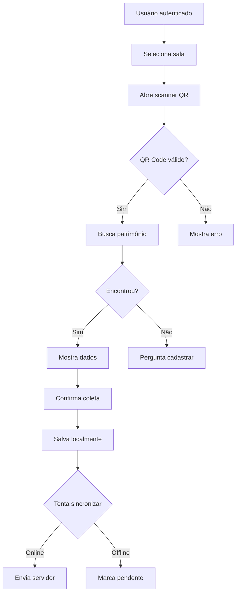
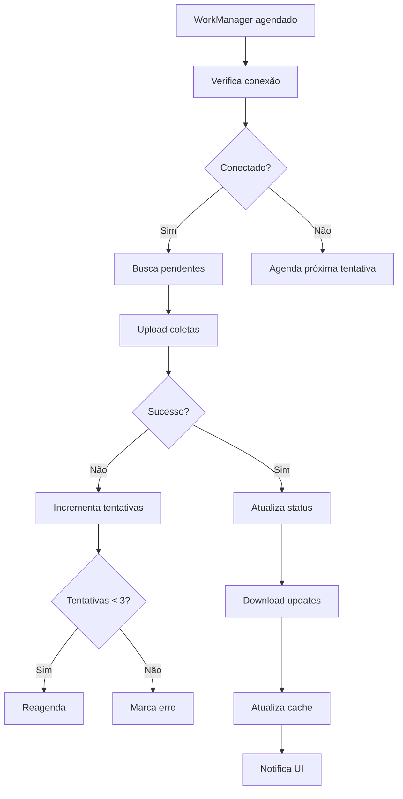
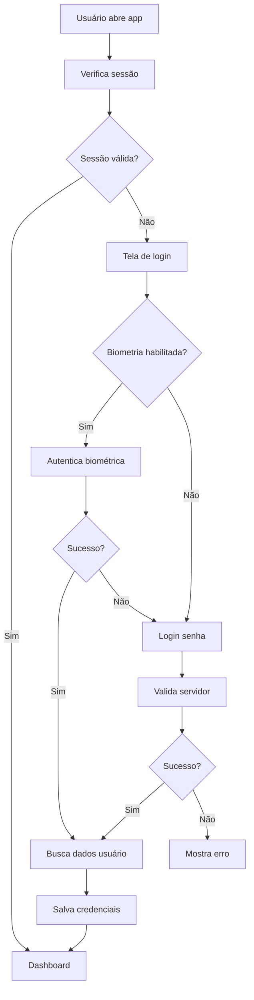

# 📱 Análise de Requisitos - Sistema de Inventário Mobile (Android)

## 1. Visão Geral do Produto

O Sistema de Inventário Mobile é um aplicativo Android desenvolvido para instituições públicas (IFMT) que permite o gerenciamento e coleta de dados de patrimônio de forma offline-first. O app integra-se com o sistema desktop existente, oferecendo funcionalidades de escaneamento por QR Code, coleta móvel, sincronização automática e gestão completa do inventário patrimonial.

**Problema a resolver**: Eliminar a necessidade de coleta manual em planilhas, permitir trabalho offline em áreas sem conectividade, garantir integridade dos dados e fornecer auditoria completa das operações.

**Público-alvo**: Servidores públicos, técnicos de patrimônio, auditores e administradores responsáveis pelo inventário institucional.

**Valor de mercado**: Solução específica para instituições públicas e privadas que necessitam de controle patrimonial móvel com conformidade legal e auditoria.

## 2. Requisitos Funcionais

### 2.1 Módulos Principais

1. **Autenticação e Segurança**: Login com JWT, biometria, controle de sessão
2. **Dashboard**: Visualização de estatísticas e métricas do inventário
3. **Coleta de Patrimônio**: Registro via QR Code ou entrada manual
4. **Scanner QR Code**: Leitura rápida de códigos de patrimônio
5. **Seleção de Salas**: Navegação hierárquica por setores e salas
6. **Sincronização**: Upload/download de dados com servidor
7. **Modo Offline**: Funcionamento completo sem conectividade
8. **Filtros e Busca**: Localização rápida de itens
9. **Estatísticas**: Relatórios e gráficos de progresso
10. **Configurações**: Personalização do aplicativo

### 2.2 Detalhamento de Funcionalidades

| Módulo | Funcionalidade | Descrição |
|--------|---------------|-----------|
| Autenticação | Login com credenciais | Autenticação via email/senha com JWT |
| Autenticação | Login biométrico | Uso de impressão digital ou facial |
| Autenticação | Controle de sessão | Timeout automático após inatividade |
| Dashboard | Visão geral | Total de patrimônios, coletados, pendentes |
| Dashboard | Gráficos de progresso | Visualização por setor, sala, período |
| Dashboard | Alertas | Notificações de sincronização pendente |
| Coleta | Escanear QR Code | Leitura rápida com câmera do dispositivo |
| Coleta | Entrada manual | Digitação do número de patrimônio |
| Coleta | Confirmação de dados | Visualização e validação antes de salvar |
| Coleta | Adicionar observações | Texto livre sobre o estado do item |
| Coleta | Tirar foto | Registro visual do patrimônio coletado |
| Coleta | Geolocalização | Captura automática de coordenadas |
| Scanner | Leitura multipla | Suporte a diferentes formatos de QR |
| Scanner | Validação instantânea | Verificação de existência no banco |
| Salas | Hierarquia por setor | Navegação em árvore |
| Salas | Busca rápida | Localização por nome ou código |
| Salas | Visualização de mapa | Layout das salas e setores |
| Sincronização | Upload automático | Envio de coletas quando online |
| Sincronização | Download incremental | Atualização de dados do servidor |
| Sincronização | Resolução de conflitos | Tratamento de divergências |
| Sincronização | Controle de versão | Gestão de múltiplas versões |
| Offline | Armazenamento local | Banco SQLite completo |
| Offline | Cache inteligente | Dados prioritários armazenados |
| Offline | Fila de operações | Registro de ações pendentes |
| Filtros | Por descrição | Busca por tipo de item |
| Filtros | Por sala/setor | Filtragem por localização |
| Filtros | Por estado | Situação do patrimônio |
| Filtros | Por data | Período de coleta |
| Estatísticas | Progresso por usuário | Individual e coletivo |
| Estatísticas | Taxa de coleta | Percentual de completude |
| Estatísticas | Tempo médio | Eficiência da operação |
| Estatísticas | Exportação | Geração de relatórios |
| Configurações | Tema visual | Claro/escuro automático |
| Configurações | Notificações | Controle de alertas |
| Configurações | Armazenamento | Limite de cache |
| Configurações | Idioma | Português/inglês |

## 3. Requisitos Não-Funcionais

### 3.1 Performance
- **Tempo de resposta**: < 2 segundos para operações locais
- **Sincronização**: < 30 segundos para 1000 registros
- **Scanner QR**: < 1 segundo para leitura e validação
- **Busca local**: < 500ms para 10.000+ patrimônios

### 3.2 Segurança
- **Autenticação**: JWT com refresh tokens
- **Criptografia**: AES-256 para dados locais
- **Comunicação**: HTTPS com certificate pinning
- **Armazenamento**: EncryptedSharedPreferences
- **Biometria**: Android Keystore para chaves

### 3.3 Confiabilidade
- **Disponibilidade**: 99.5% em modo offline
- **Integridade**: Validação de checksum
- **Recuperação**: Backup automático a cada 24h
- **Conflitos**: Algoritmo de resolução inteligente

### 3.4 Usabilidade
- **Interface**: Material Design 3
- **Acessibilidade**: WCAG 2.1 nível AA
- **Idiomas**: Português (BR) primário
- **Dispositivos**: Smartphones e tablets Android

### 3.5 Manutenibilidade
- **Arquitetura**: MVVM com Clean Architecture
- **Testes**: Unitários (80% cobertura) e instrumentados
- **Documentação**: Código documentado em português
- **Versionamento**: Semver com changelog

### 3.6 Portabilidade
- **Android**: API 21+ (Android 5.0)
- **Processador**: ARM64 e x86_64
- **Memória**: Mínimo 2GB RAM
- **Armazenamento**: 500MB disponíveis

## 4. Arquitetura e Tecnologias

### 4.1 Arquitetura Geral
```
┌─────────────────────────────────────────────────────────────┐
│                    CAMADA DE APRESENTAÇÃO                  │
│  Activities, Fragments, ViewModels, UI Components          │
└────────────────────┬───────────────────────────────────────┘
                     │
┌─────────────────────────────────────────────────────────────┐
│                    CAMADA DE DOMÍNIO                       │
│  Use Cases, Models de Negócio, Regras de Negócio         │
└────────────────────┬───────────────────────────────────────┘
                     │
┌─────────────────────────────────────────────────────────────┐
│                    CAMADA DE DADOS                         │
│  Repositories, DAOs, APIs, Cache, Sincronização         │
└────────────────────┬───────────────────────────────────────┘
                     │
┌─────────────────────────────────────────────────────────────┐
│                    INFRAESTRUTURA                          │
│  Room Database, Retrofit, WorkManager, Security          │
└─────────────────────────────────────────────────────────────┘
```

### 4.2 Tecnologias Utilizadas

| Camada | Tecnologia | Versão | Propósito |
|--------|------------|---------|-----------|
| UI | Jetpack Compose | 1.5.0 | Interface declarativa moderna |
| UI | Material Design 3 | Latest | Design system Google |
| Arquitetura | MVVM | Pattern | Separação de responsabilidades |
| DI | Hilt | 2.48 | Injeção de dependências |
| Async | Coroutines | 1.7.3 | Programação assíncrona |
| DB Local | Room | 2.6.1 | Persistência SQLite |
| Network | Retrofit | 2.9.0 | Cliente HTTP |
| JSON | Moshi | 1.15.0 | Serialização JSON |
| Images | Coil | 2.4.0 | Carregamento de imagens |
| Scanner | ZXing | 4.3.0 | Leitura de QR codes |
| Security | AndroidX Security | 1.1.0 | Criptografia e biometria |
| Work | WorkManager | 2.9.0 | Tarefas em background |
| Location | Play Services | 21.0.1 | Geolocalização |
| Camera | CameraX | 1.3.0 | Captura de fotos |

### 4.3 Estrutura de Pacotes
```
com.inventario.mobile/
├── presentation/          # UI e ViewModels
│   ├── main/
│   ├── login/
│   ├── dashboard/
│   ├── scanner/
│   ├── coleta/
│   └── settings/
├── domain/               # Modelos e casos de uso
│   ├── model/
│   ├── usecase/
│   └── repository/
├── data/                 # Acesso a dados
│   ├── local/
│   ├── remote/
│   ├── repository/
│   └── mapper/
├── di/                   # Injeção de dependências
├── security/             # Criptografia e auth
└── utils/                # Utilitários
```

## 5. Integração com Sistema Desktop

### 5.1 Sincronização de Dados
- **Protocolo**: HTTPS REST API
- **Autenticação**: JWT Bearer tokens
- **Formato**: JSON com Moshi
- **Compressão**: GZIP para grandes volumes

### 5.2 Endpoints Principais
```
POST   /api/auth/login                    # Autenticação
POST   /api/auth/refresh                  # Renovar token
GET    /api/patrimonios?page=&size=       # Listar patrimônios
GET    /api/patrimonios/{numero}          # Buscar específico
POST   /api/coletas/bulk                  # Enviar coletas
GET    /api/salas/hierarquia              # Estrutura organizacional
GET    /api/sincronizacao/updates?since=  # Atualizações incrementais
```

### 5.3 Mapeamento de Entidades
| Mobile | Desktop | Observações |
|--------|---------|-------------|
| PatrimonioEntity | Patrimonio | Campos adicionais para mobile |
| ColetaEntity | HistoricoColeta | Inclui geolocalização |
| SalaEntity | Sala | Mesma estrutura |
| SetorEntity | Setor | Mesma estrutura |
| UsuarioEntity | Usuario | Credenciais compartilhadas |

### 5.4 Controle de Versão
- **API Versioning**: Header `X-API-Version: 1.0`
- **Backward Compatibility**: 2 versões anteriores
- **Migration Scripts**: Atualização automática de schema

## 6. Requisitos de Dados e Armazenamento

### 6.1 Banco de Dados Local (Room)
```kotlin
@Database(
    entities = [
        PatrimonioEntity::class,
        ColetaEntity::class,
        SalaEntity::class,
        SetorEntity::class,
        UsuarioEntity::class,
        SincronizacaoEntity::class
    ],
    version = 1,
    exportSchema = true
)
@TypeConverters(Converters::class)
abstract class InventarioDatabase : RoomDatabase() {
    // DAOs...
}
```

### 6.2 Capacidade de Armazenamento
- **Patrimônios**: 100.000+ registros (50MB)
- **Coletas**: 500.000+ registros (100MB)
- **Imagens**: Compressão JPEG 80% (500KB/foto)
- **Cache Total**: Máximo 500MB configurável

### 6.3 Estratégia de Cache
- **Prioritários**: Dados da sala atual e adjacentes
- **Tempo de Vida**: 7 dias para dados não acessados
- **Limpeza**: Automática quando atinge 80% do limite
- **Inteligente**: Baseado em localização e horário

### 6.4 Backup e Recuperação
- **Frequência**: Diário às 02:00
- **Local**: Diretório privado do app
- **Retenção**: 7 dias de histórico
- **Export**: JSON criptografado para compartilhamento

## 7. Fluxos de Trabalho Principais

### 7.1 Fluxo de Coleta com QR Code


### 7.2 Fluxo de Sincronização


### 7.3 Fluxo de Login com Biometria


## 8. Requisitos de Segurança

### 8.1 Autenticação e Autorização
- **JWT**: Tokens com expiração de 1 hora
- **Refresh**: Valido por 7 dias
- **Biometria**: Android Keystore para chaves
- **Sessão**: Timeout de 15 minutos
- **Permissões**: RBAC com 3 níveis (Admin, Operador, Auditor)

### 8.2 Criptografia
- **Dados Locais**: AES-256-GCM
- **Comunicação**: TLS 1.3 com certificate pinning
- **Senhas**: Argon2id com salt aleatório
- **Backup**: Criptografia com senha do usuário

### 8.3 Conformidade Legal
- **LGPD**: Consentimento e direitos do titular
- **Audit Trail**: Logs imutáveis de todas operações
- **Retenção**: Política de exclusão automática (5 anos)
- **Portabilidade**: Exportação em formatos abertos

## 9. Requisitos de Performance

### 9.1 Tempos de Resposta
- **Login**: < 3 segundos
- **Scanner QR**: < 1 segundo
- **Busca local**: < 500ms para 10k registros
- **Sincronização**: < 30s para 1000 coletas
- **Carregamento inicial**: < 5 segundos

### 9.2 Eficiência de Recursos
- **Bateria**: < 5% consumo por hora de uso
- **Memória**: < 200MB em uso normal
- **Armazenamento**: < 500MB total
- **Rede**: Compressão e batching de requisições

### 9.3 Escalabilidade
- **Usuários**: Suporte a 100+ usuários simultâneos
- **Dados**: Performance estável com 1M+ registros
- **Imagens**: Thumbnails automáticos e lazy loading

## 10. Cronograma e Entregas

### Fase 1 - MVP (8 semanas)
- [ ] Autenticação básica e dashboard
- [ ] Scanner QR e coleta manual
- [ ] Modo offline e sincronização
- [ ] Integração com API existente

### Fase 2 - Funcionalidades Avançadas (6 semanas)
- [ ] Biometria e segurança reforçada
- [ ] Filtros avançados e busca
- [ ] Estatísticas e relatórios
- [ ] Exportação de dados

### Fase 3 - Otimização e Testes (4 semanas)
- [ ] Testes de performance e segurança
- [ ] Otimização de bateria e memória
- [ ] Testes de usabilidade
- [ ] Documentação final

### Fase 4 - Deploy e Suporte (2 semanas)
- [ ] Publicação na Play Store
- [ ] Treinamento de usuários
- [ ] Monitoramento e métricas
- [ ] Suporte técnico

## 11. Riscos e Mitigações

| Risco | Probabilidade | Impacto | Mitigação |
|-------|---------------|---------|-----------|
| Falta de conectividade frequente | Alta | Alto | Modo offline robusto com cache inteligente |
| Resistência à adoção | Média | Alto | Treinamento e interface intuitiva |
| Performance com grandes volumes | Média | Médio | Otimização de queries e índices |
| Segurança de dados sensíveis | Baixa | Alto | Criptografia e auditoria completa |
| Compatibilidade de devices | Alta | Médio | Teste em diversos modelos e APIs |

## 12. Métricas de Sucesso

### 12.1 KPIs Técnicos
- **Disponibilidade**: > 99.5%
- **Performance**: < 2s tempo médio de resposta
- **Sincronização**: > 95% sucesso na primeira tentativa
- **Crash Rate**: < 0.1% das sessões

### 12.2 KPIs de Negócio
- **Adoção**: > 80% dos usuários ativos em 30 dias
- **Eficiência**: Redução de 70% no tempo de coleta
- **Acurácia**: > 99% de dados corretos
- **Satisfação**: > 4.0/5.0 em surveys

---

**Documento versão**: 1.0.0  
**Data de criação**: 09/11/2025  
**Status**: Em análise  
**Próxima revisão**: 16/11/2025