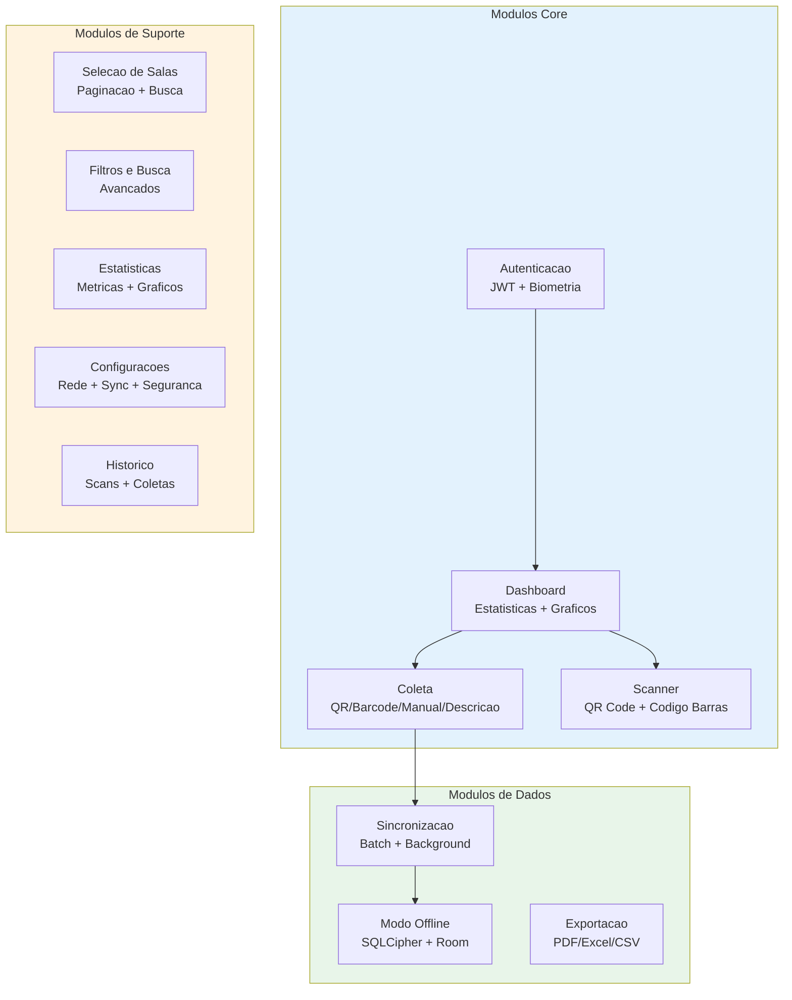
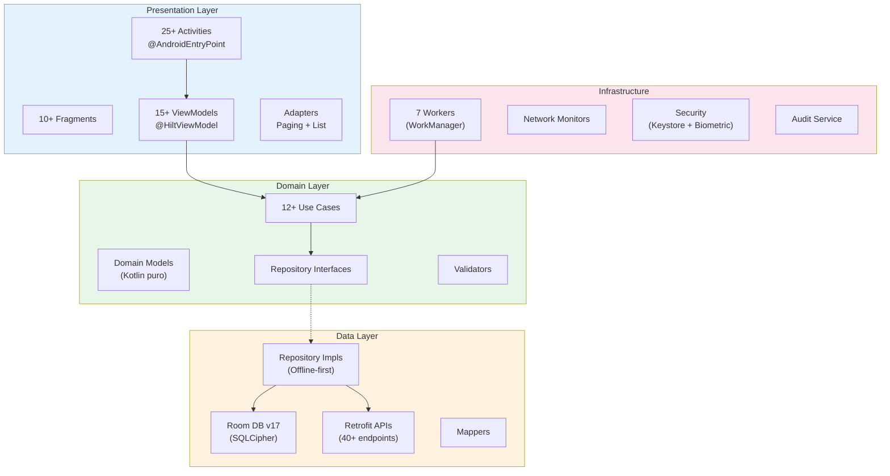
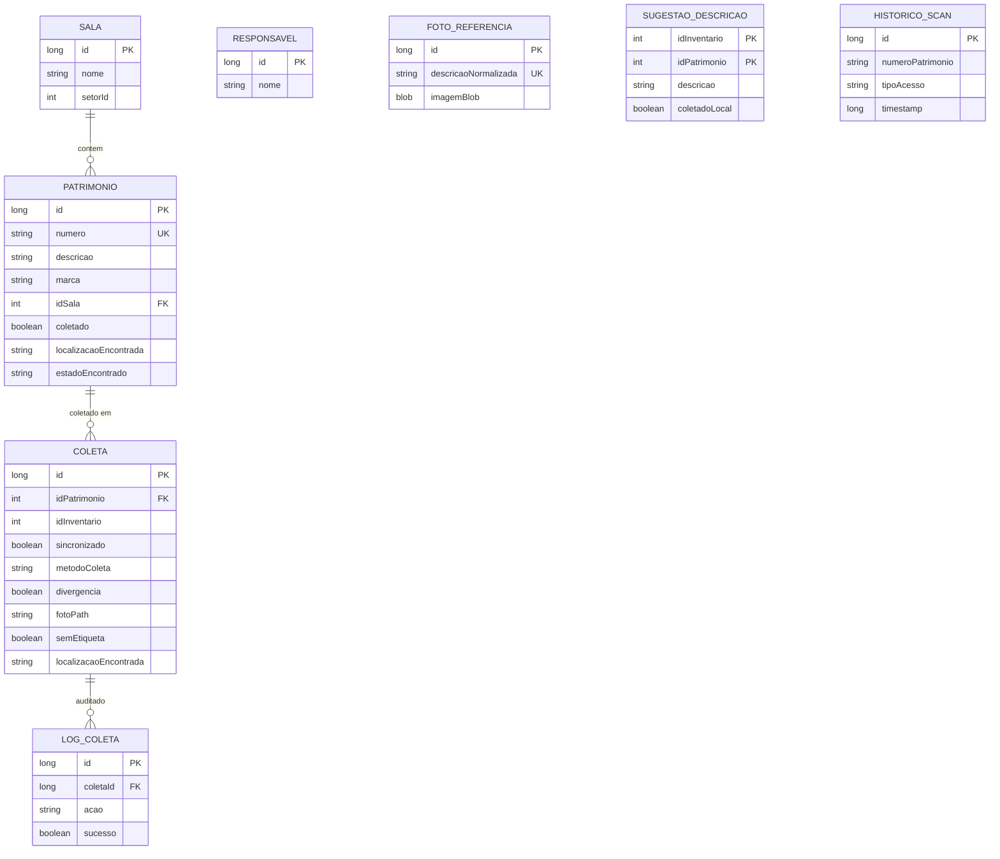
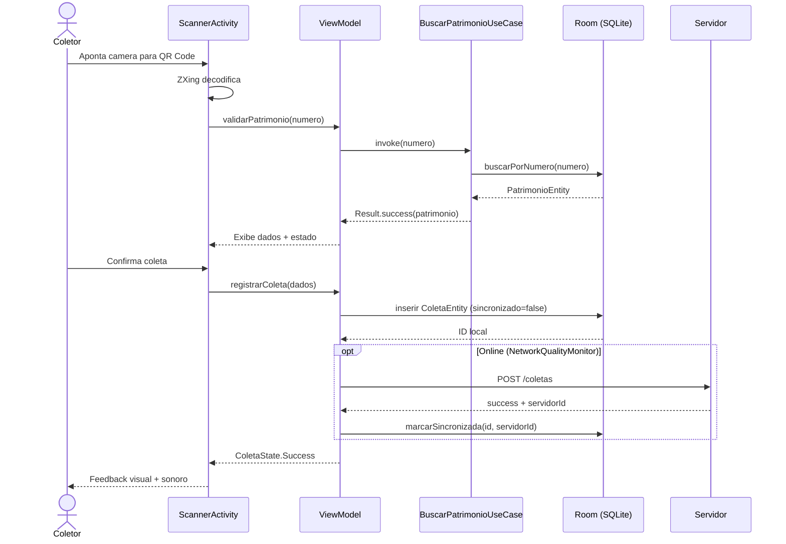
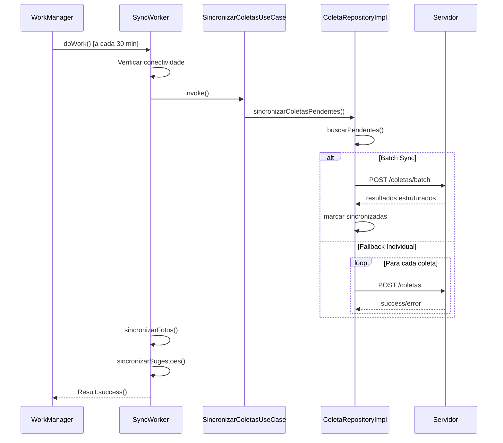
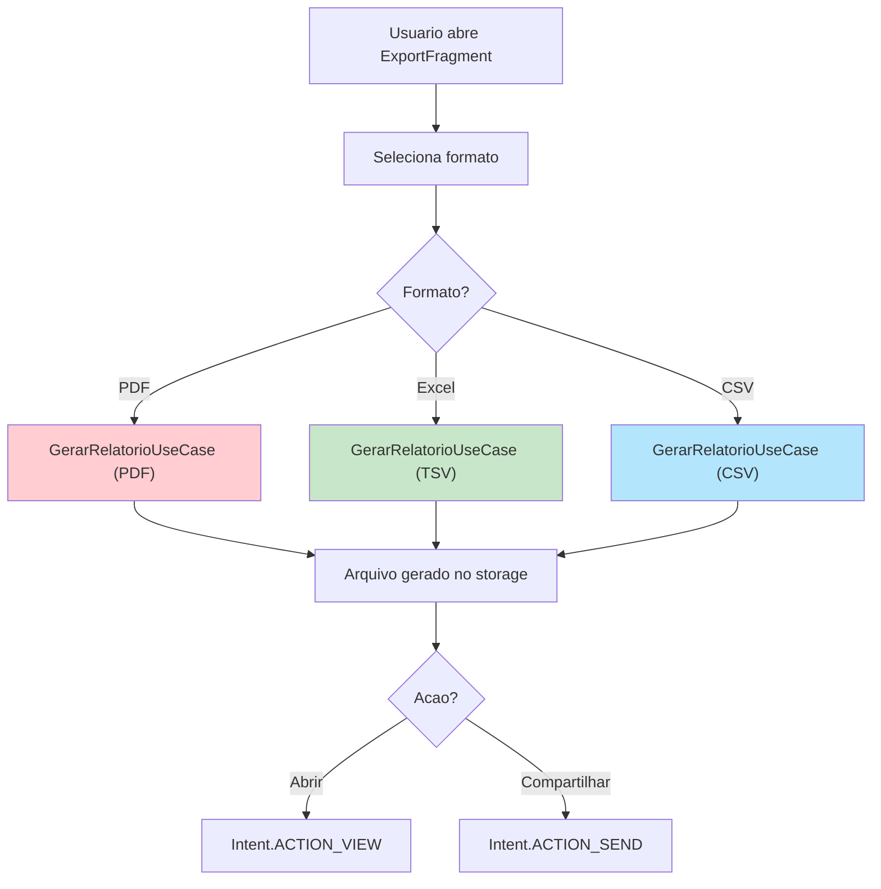
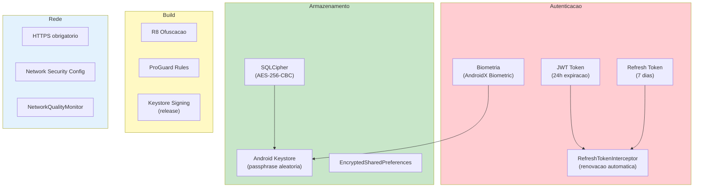

# Analise de Requisitos - SiHCP Mobile (Android) v2.23.0

## 1. Visao Geral do Produto

O **SiHCP Mobile** e um aplicativo Android nativo desenvolvido em Kotlin para o Instituto Federal de Mato Grosso (IFMT). Permite coleta de patrimonios via QR Code, codigo de barras ou busca manual, com suporte completo a modo offline, sincronizacao inteligente e exportacao de relatorios.

**Problema resolvido**: Eliminar coleta manual em planilhas, permitir trabalho offline em areas sem conectividade, garantir integridade dos dados com criptografia e fornecer auditoria completa das operacoes.

**Publico-alvo**: Servidores publicos, tecnicos de patrimonio, auditores e administradores responsaveis pelo inventario institucional.

**Status**: Producao (v2.23.0, versionCode 71)

---

## 2. Requisitos Funcionais

### 2.1 Modulos Implementados



### 2.2 Detalhamento de Funcionalidades

| ID | Modulo | Funcionalidade | Status |
|----|--------|---------------|--------|
| RF-M01 | Autenticacao | Login com credenciais (JWT) | Implementado |
| RF-M02 | Autenticacao | Login biometrico (fingerprint/face) | Implementado |
| RF-M03 | Autenticacao | Refresh token automatico (interceptor) | Implementado |
| RF-M04 | Autenticacao | Controle de sessao com timeout | Implementado |
| RF-M05 | Autenticacao | Perfis de acesso (ADMIN/SUPERVISOR/COLETOR/CONSULTA) | Implementado |
| RF-M06 | Dashboard | KPIs: total, coletados, pendentes, percentual | Implementado |
| RF-M07 | Dashboard | Graficos de evolucao (MPAndroidChart) | Implementado |
| RF-M08 | Dashboard | Distribuicao por sala/setor | Implementado |
| RF-M09 | Dashboard | Busca por voz | Implementado |
| RF-M10 | Dashboard | Ranking de coletores | Implementado |
| RF-M11 | Coleta | Coleta por QR Code | Implementado |
| RF-M12 | Coleta | Coleta por codigo de barras | Implementado |
| RF-M13 | Coleta | Coleta manual (digitacao) | Implementado |
| RF-M14 | Coleta | Coleta por descricao (autocomplete + sugestoes) | Implementado |
| RF-M15 | Coleta | Item sem etiqueta (foto obrigatoria) | Implementado |
| RF-M16 | Coleta | Validacao pre-coleta (patrimonio existe/ativo) | Implementado |
| RF-M17 | Coleta | Verificacao de duplicata | Implementado |
| RF-M18 | Coleta | Deteccao automatica de divergencia | Implementado |
| RF-M19 | Coleta | Registro de localizacao encontrada | Implementado |
| RF-M20 | Coleta | Registro de estado de conservacao | Implementado |
| RF-M21 | Coleta | Captura de foto (opcional/obrigatoria) | Implementado |
| RF-M22 | Coleta | Geolocalizacao GPS | Implementado |
| RF-M23 | Coleta | Observacoes em texto livre | Implementado |
| RF-M24 | Coleta | Feedback visual + sonoro + vibracoes | Implementado |
| RF-M25 | Coleta | Metricas de tempo (scan, preenchimento, total) | Implementado |
| RF-M26 | Scanner | Leitura QR Code (ZXing) | Implementado |
| RF-M27 | Scanner | Leitura codigo de barras | Implementado |
| RF-M28 | Scanner | Validacao instantanea no banco local | Implementado |
| RF-M29 | Scanner | Foto de referencia por descricao | Implementado |
| RF-M30 | Scanner | Historico de scans | Implementado |
| RF-M31 | Sincronizacao | Modo offline-first | Implementado |
| RF-M32 | Sincronizacao | Sync manual sob demanda | Implementado |
| RF-M33 | Sincronizacao | Sync automatico (WorkManager 30min) | Implementado |
| RF-M34 | Sincronizacao | Batch sync (multiplas coletas) | Implementado |
| RF-M35 | Sincronizacao | Fallback individual (se batch falhar) | Implementado |
| RF-M36 | Sincronizacao | Retry com backoff exponencial | Implementado |
| RF-M37 | Sincronizacao | Smart sync (qualidade de rede) | Implementado |
| RF-M38 | Sincronizacao | Photo sync (apenas Wi-Fi) | Implementado |
| RF-M39 | Sincronizacao | Sync de sugestoes de descricao | Implementado |
| RF-M40 | Sincronizacao | Indicador de status (pendentes/erros) | Implementado |
| RF-M41 | Sincronizacao | Diagnostico de coletas com erro | Implementado |
| RF-M42 | Sincronizacao | Reset de erros recuperaveis | Implementado |
| RF-M43 | Salas | Listagem com paginacao (Paging 3) | Implementado |
| RF-M44 | Salas | Busca rapida por nome | Implementado |
| RF-M45 | Salas | Filtro por setor | Implementado |
| RF-M46 | Filtros | Filtro por status (coletado/pendente) | Implementado |
| RF-M47 | Filtros | Filtro por sala/setor | Implementado |
| RF-M48 | Filtros | Filtro por responsavel | Implementado |
| RF-M49 | Filtros | Busca por numero/descricao | Implementado |
| RF-M50 | Exportacao | Exportar PDF com estatisticas | Implementado |
| RF-M51 | Exportacao | Exportar Excel (TSV) | Implementado |
| RF-M52 | Exportacao | Exportar CSV | Implementado |
| RF-M53 | Exportacao | Relatorio fotografico (itens sem etiqueta) | Implementado |
| RF-M54 | Exportacao | Filtros de exportacao (status/sala) | Implementado |
| RF-M55 | Estatisticas | Progresso do inventario | Implementado |
| RF-M56 | Estatisticas | Metricas de tempo medio | Implementado |
| RF-M57 | Estatisticas | Distribuicao por metodo de coleta | Implementado |
| RF-M58 | Configuracoes | Endereco do servidor | Implementado |
| RF-M59 | Configuracoes | Sync automatico on/off | Implementado |
| RF-M60 | Configuracoes | Sync apenas Wi-Fi | Implementado |
| RF-M61 | Configuracoes | Diagnostico de rede | Implementado |
| RF-M62 | Configuracoes | Limpeza de cache | Implementado |
| RF-M63 | Inventario | Selecao de inventario ativo | Implementado |
| RF-M64 | Inventario | Listagem com Paging 3 | Implementado |
| RF-M65 | Inventario | Detalhes do patrimonio | Implementado |

---

## 3. Requisitos Nao-Funcionais

### 3.1 Performance

| Metrica | Requisito | Status |
|---------|-----------|--------|
| Tempo de login | < 2 segundos | Atendido |
| Leitura QR Code | < 1 segundo | Atendido |
| Busca local (10k+ itens) | < 100ms | Atendido |
| Sync batch (50 coletas) | < 5 segundos | Atendido |
| Carregamento inicial | < 3 segundos | Atendido |
| Geracao de PDF | < 10 segundos | Atendido |
| Uso de memoria | < 150 MB | Atendido |

### 3.2 Seguranca

| Recurso | Implementacao | Status |
|---------|---------------|--------|
| Banco de dados | SQLCipher AES-256 | Implementado |
| Passphrase | Android Keystore (aleatoria) | Implementado |
| Autenticacao | JWT + Refresh Token | Implementado |
| Biometria | AndroidX Biometric | Implementado |
| Preferencias | EncryptedSharedPreferences | Implementado |
| Build release | R8 + ProGuard (ofuscacao) | Implementado |
| Comunicacao | HTTPS obrigatorio | Implementado |
| Auditoria | Log de todas as operacoes | Implementado |

### 3.3 Confiabilidade

| Recurso | Implementacao | Status |
|---------|---------------|--------|
| Modo offline | 100% funcional para coletas | Implementado |
| Persistencia | 0% perda de dados | Implementado |
| Retry automatico | Backoff exponencial (3 tentativas) | Implementado |
| Backup local | DatabaseBackupWorker | Implementado |
| Tolerancia a falhas | Graceful degradation | Implementado |
| Consistencia | Eventual consistency (offline-first) | Implementado |

### 3.4 Usabilidade

| Recurso | Implementacao | Status |
|---------|---------------|--------|
| Design system | Material Design 3 | Implementado |
| Idioma | Portugues (BR) | Implementado |
| Feedback | Visual + Sonoro + Vibracao | Implementado |
| Acessibilidade | Content descriptions | Implementado |
| Orientacao | Portrait fixo | Implementado |
| Teclado | adjustResize em todas as telas | Implementado |

### 3.5 Compatibilidade

| Recurso | Valor |
|---------|-------|
| Min SDK | 23 (Android 6.0) |
| Target SDK | 34 (Android 14) |
| Compile SDK | 34 |
| Processadores | ARM64 + x86_64 |
| Telas | 4" a 10" |
| Memoria minima | 2 GB RAM |

### 3.6 Manutenibilidade

| Recurso | Implementacao |
|---------|---------------|
| Arquitetura | Clean Architecture + MVVM |
| DI | Hilt 2.48 |
| Testes | Kotest + MockK + JUnit |
| Versionamento | Git + Semver |
| CI/CD | Gradle + Keystore signing |
| Documentacao | KDoc + Markdown |

---

## 4. Arquitetura e Tecnologias

### 4.1 Arquitetura



### 4.2 Tecnologias Utilizadas

| Camada | Tecnologia | Versao | Proposito |
|--------|------------|--------|-----------|
| UI | View Binding + Data Binding | - | Interface XML |
| UI | Material Design 3 | 1.10.0 | Design system |
| UI | MPAndroidChart | 3.1.0 | Graficos |
| Arquitetura | MVVM + Clean Architecture | - | Separacao de camadas |
| DI | Hilt | 2.48 | Injecao de dependencias |
| Async | Coroutines + Flow | 1.7.3 | Programacao assincrona |
| DB Local | Room + Paging 3 | 2.6.1 / 3.2.1 | Persistencia + Scroll infinito |
| Criptografia | SQLCipher | 4.5.4 | Banco criptografado |
| Network | Retrofit + OkHttp | 2.9.0 / 4.12.0 | Cliente HTTP |
| JSON | Gson | (via Retrofit) | Serializacao |
| Imagens | Glide | 4.16.0 | Carregamento de imagens |
| Scanner | ZXing | 4.3.0 / 3.5.2 | QR Code + Barcode |
| Camera | CameraX | 1.3.0 | Preview + Captura |
| Security | AndroidX Security | 1.1.0-alpha06 | Prefs criptografadas |
| Biometria | AndroidX Biometric | 1.2.0-alpha05 | Autenticacao biometrica |
| Background | WorkManager | 2.9.0 | Tarefas em background |
| PDF | iText 7 | 7.2.5 | Geracao de relatorios |
| Navegacao | Navigation Component | 2.7.5 | Navegacao entre telas |
| Testes | Kotest + MockK | 5.8.0 / 1.12.8 | Property-based + Mocking |

### 4.3 Estrutura de Pacotes

```
com.inventario.mobile/
|-- api/                    # Interfaces Retrofit (legado)
|-- auth/                   # Autenticacao e tokens
|-- config/                 # Configuracoes
|-- data/                   # Camada de Dados
|   |-- audit/              #   Servico de auditoria
|   |-- local/              #   Room DB (10 entities, 11 DAOs)
|   |-- model/              #   DTOs
|   |-- remote/             #   APIs Retrofit
|   |-- mapper/             #   Conversores
|   +-- repository/         #   Implementacoes
|-- di/                     # Modulos Hilt
|-- domain/                 # Camada de Dominio
|   |-- model/              #   Modelos puros
|   |-- repository/         #   Interfaces
|   |-- usecase/            #   Casos de uso
|   +-- validator/          #   Validadores
|-- network/                # Monitoramento de rede
|-- presentation/           # Camada de Apresentacao (27 subpacotes)
|-- security/               # SQLCipher + Keystore
|-- sync/                   # SyncManager + AutoSyncManager
|-- worker/                 # 7 Workers (background)
+-- utils/                  # Utilitarios
```

---

## 5. Integracao com Sistema Desktop

### 5.1 Comunicacao

| Aspecto | Implementacao |
|---------|---------------|
| Protocolo | HTTPS REST API |
| Autenticacao | JWT Bearer Token |
| Formato | JSON (Gson) |
| Base URL | `api/mobile/` |
| Porta | 8080 ou 8081 |

### 5.2 Endpoints Principais

```
POST   /api/mobile/auth/login              # Login
POST   /api/mobile/auth/refresh            # Refresh token
GET    /api/mobile/patrimonio              # Listar patrimonios
GET    /api/mobile/patrimonio/numero/{n}   # Buscar por numero
GET    /api/mobile/patrimonio/qr/{code}    # Buscar por QR
POST   /api/mobile/coletas                 # Registrar coleta
POST   /api/mobile/coletas/batch           # Batch sync
POST   /api/mobile/coletas/verificar-duplicata  # Verificar duplicata
GET    /api/mobile/salas                   # Listar salas
GET    /api/mobile/inventario/ativo        # Inventario ativo
GET    /api/mobile/dashboard/stats         # Estatisticas
GET    /api/mobile/descricoes/nao-coletadas  # Sugestoes
GET    /api/mobile/responsaveis            # Responsaveis
```

### 5.3 Mapeamento de Entidades

| Mobile (Room) | Servidor (PostgreSQL) | Observacoes |
|---------------|----------------------|-------------|
| PatrimonioEntity | tabela_patrimonio | + campos de auditoria local |
| ColetaEntity | tabela_coleta | + metricas + foto + divergencia |
| SalaEntity | tabela_sala | Mesma estrutura |
| ResponsavelEntity | tabela_responsavel | Mesma estrutura |
| HistoricoScanEntity | - | Apenas local |
| FotoReferenciaEntity | - | Cache local de fotos |
| SugestaoDescricaoEntity | - | Cache de sugestoes |
| LogColetaEntity | - | Auditoria local |

---

## 6. Banco de Dados Local

### 6.1 Configuracao

| Campo | Valor |
|-------|-------|
| Nome | `inventario_offline_secure.db` |
| Versao | 17 |
| Criptografia | SQLCipher (AES-256) |
| Passphrase | Android Keystore (aleatoria) |
| Entities | 10 |
| DAOs | 11 |
| Migracoes | 13 (v4 a v17) |

### 6.2 Entities



---

## 7. Fluxos de Trabalho

### 7.1 Fluxo de Coleta com QR Code



### 7.2 Fluxo de Sincronizacao



### 7.3 Fluxo de Exportacao



---

## 8. Seguranca



---

## 9. Workers (Background Tasks)

| Worker | Funcao | Intervalo | Constraints |
|--------|--------|-----------|-------------|
| `SyncWorker` | Coletas + Fotos + Sugestoes | 30 min | Rede + Bateria |
| `PhotoSyncWorker` | Upload de fotos (multipart) | Periodico | Wi-Fi + Bateria |
| `SmartSyncWorker` | Sync inteligente | Condicional | Rede + Bateria > 20% |
| `ColetaSyncWorker` | Sync de coletas | Sob demanda | Rede |
| `DatabaseCleanupWorker` | Limpeza do banco | Periodico | - |
| `DatabaseBackupWorker` | Backup do banco | Periodico | - |
| `BackupWorker` | Backup geral | Periodico | - |

---

## 10. Metricas de Sucesso

### 10.1 KPIs Tecnicos

| Metrica | Meta | Status |
|---------|------|--------|
| Disponibilidade offline | 100% | Atendido |
| Taxa de sync (1a tentativa) | > 95% | Atendido |
| Tempo medio de resposta | < 2s | Atendido |
| Crash rate | < 0.1% | Atendido |
| Cobertura de testes | > 50% | Em progresso |

### 10.2 KPIs de Negocio

| Metrica | Meta | Status |
|---------|------|--------|
| Reducao tempo de coleta | > 70% | Atendido |
| Acuracia dos dados | > 99% | Atendido |
| Adocao pelos usuarios | > 80% | Atendido |
| Coletas perdidas | 0% | Atendido |

---

## 11. Riscos e Mitigacoes

| Risco | Probabilidade | Impacto | Mitigacao Implementada |
|-------|---------------|---------|------------------------|
| Falta de conectividade | Alta | Alto | Offline-first + SQLCipher + WorkManager |
| Perda de dados | Baixa | Critico | Backup automatico + retry + auditoria |
| Seguranca de dados | Baixa | Alto | SQLCipher + Keystore + R8 |
| Performance com grandes volumes | Media | Medio | Paging 3 + indices compostos |
| Compatibilidade de devices | Media | Medio | minSdk 23 + testes em multiplos devices |
| Token expirado durante uso | Media | Medio | RefreshTokenInterceptor automatico |

---

## 12. Cronograma (Concluido)

| Fase | Periodo | Status |
|------|---------|--------|
| MVP (Auth + Coleta + Sync) | Nov/2025 | Concluido |
| Clean Architecture + Hilt | Nov-Dez/2025 | Concluido |
| Paging 3 + Exportacao | Dez/2025 | Concluido |
| Seguranca (SQLCipher + Biometria) | Jan-Fev/2026 | Concluido |
| Fotos + Divergencia + Metricas | Mar-Abr/2026 | Concluido |
| Sugestoes + Relatorio Fotografico | Mai/2026 | Concluido |

---

**Versao do documento**: 3.0.0
**Data**: 09/05/2026
**Status**: Producao
**Versao do app**: 2.23.0 (versionCode 71)
