# Diagrama de Funcionalidades - Versão 2.23.0

## 🗺️ Mapa de Funcionalidades

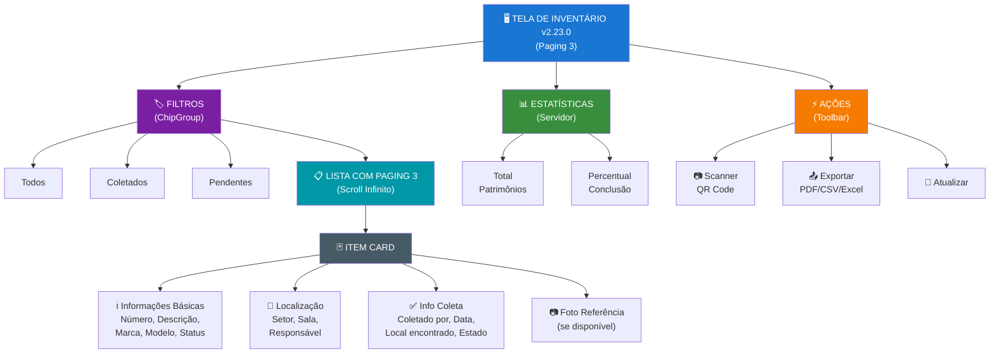

---

## 🏗️ Arquitetura da Tela (Clean Architecture + MVVM)

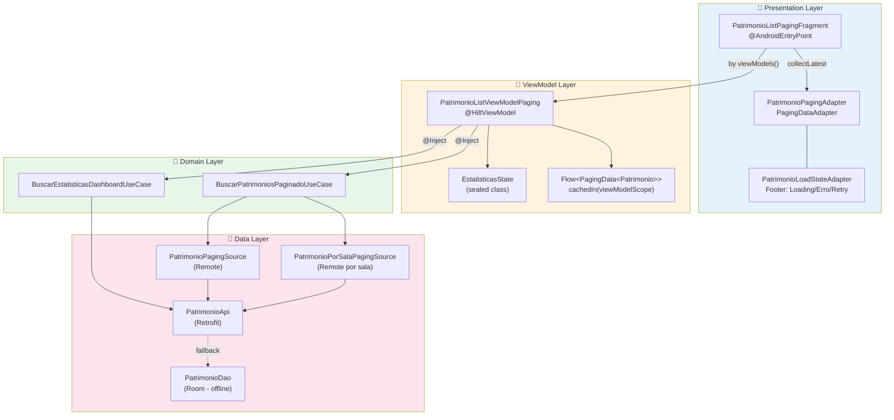

---

## 🔄 Fluxos de Interação

### Fluxo Principal: Paginação Automática

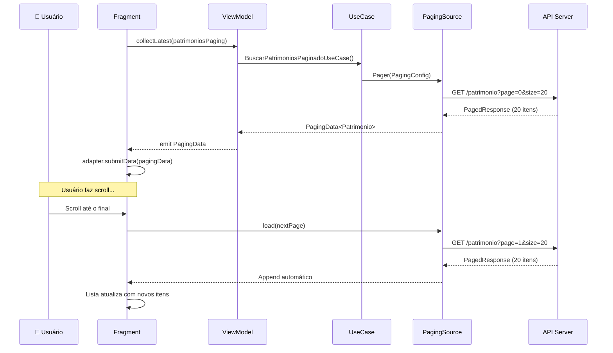

### Fluxo de Filtros Reativos

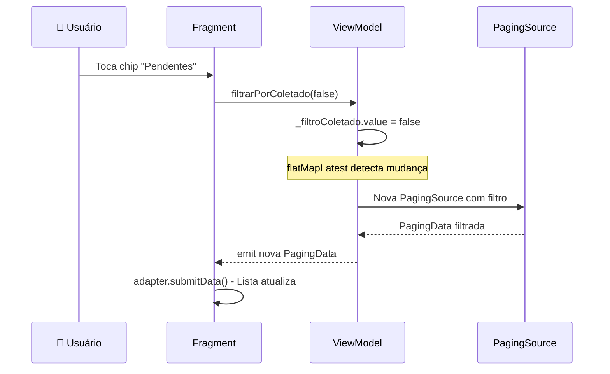

### Fluxo de Exportação

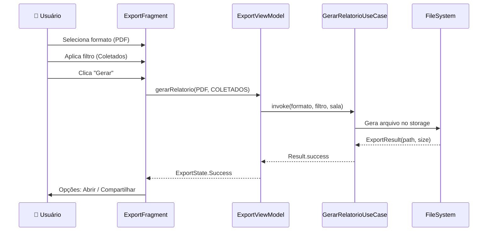

---

## 🔀 Máquina de Estados

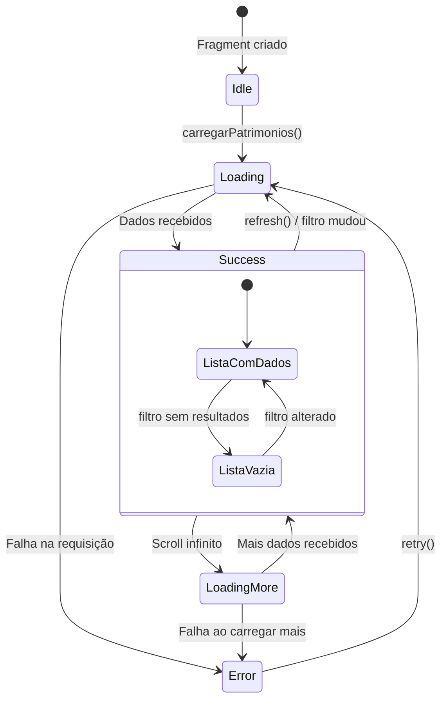

### Estados da UI (EstatisticasState)

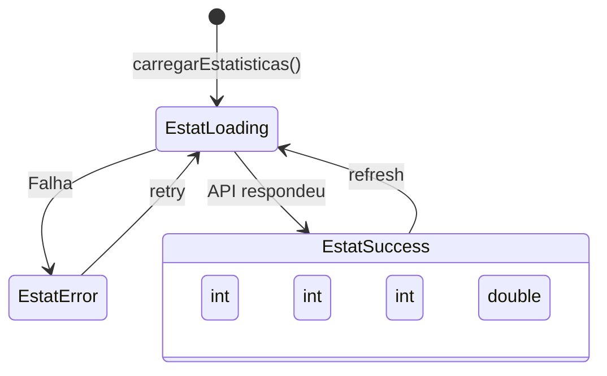

---

## 🔗 Navegação entre Telas

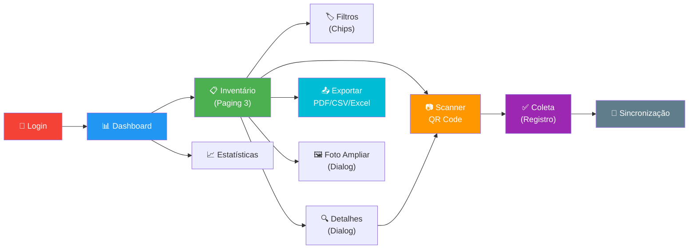

---

## 📦 Diagrama de Componentes

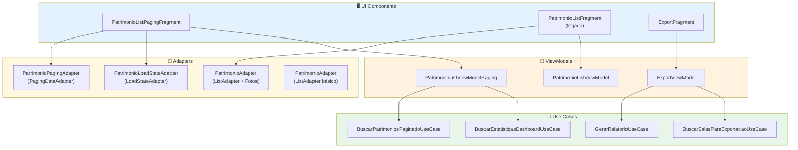

---

## 📊 Fluxo de Dados (Data Flow)

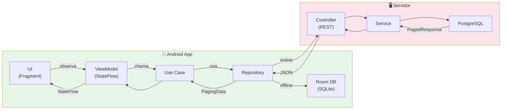

---

## 🎨 Hierarquia Visual

```
┌─────────────────────────────────────────────────────────────┐
│ ← Inventário                              🔍 📊 ⚙️          │ ← Toolbar
├─────────────────────────────────────────────────────────────┤
│                                                             │
│  ┌─────────────────────────────────────────────────────┐   │
│  │ Total: 1,234 | Coletados: 890 | Pendentes: 344 | 72%│   │ ← Estatísticas
│  └─────────────────────────────────────────────────────┘   │
│                                                             │
│  ┌────────┐ ┌──────────┐ ┌──────────┐                     │
│  │● Todos │ │ Coletados│ │ Pendentes│                      │ ← Chips Filtro
│  └────────┘ └──────────┘ └──────────┘                     │
│                                                             │
│  ┌───────────────────────────────────────────────────────┐ │
│  │ 123456                              [COLETADO]        │ │
│  │ Computador Desktop Dell                               │ │
│  │ Dell | OptiPlex 7090                                  │ │
│  │ 👤 Responsável: Maria Silva                           │ │ ← Item Card
│  │ 🏢 Setor: TI  🚪 Sala: 101                           │ │
│  │ ┌─────────────────────────────────────────────────┐   │ │
│  │ │ Coletado por: João  |  Data: 15/03/2026 10:30  │   │ │ ← Info Coleta
│  │ │ Local: Sala 101     |  Estado: BOM             │   │ │
│  │ └─────────────────────────────────────────────────┘   │ │
│  │ ┌──────┐                                              │ │
│  │ │ 📷   │ ← Foto de Referência (se disponível)        │ │
│  │ └──────┘                                              │ │
│  └───────────────────────────────────────────────────────┘ │
│                                                             │
│  ┌───────────────────────────────────────────────────────┐ │
│  │ 123457                              [PENDENTE]        │ │
│  │ Monitor LCD 24"                                       │ │
│  │ LG | 24MK430H                                         │ │ ← Item Card
│  │ 👤 Responsável: Carlos Souza                          │ │
│  │ 🏢 Setor: TI  🚪 Sala: 102                           │ │
│  └───────────────────────────────────────────────────────┘ │
│                                                             │
│  ┌───────────────────────────────────────────────────────┐ │
│  │         ⟳ Carregando mais...                          │ │ ← LoadState Footer
│  └───────────────────────────────────────────────────────┘ │
│                                                             │
└─────────────────────────────────────────────────────────────┘
```

---

## 🔀 Estados da Tela

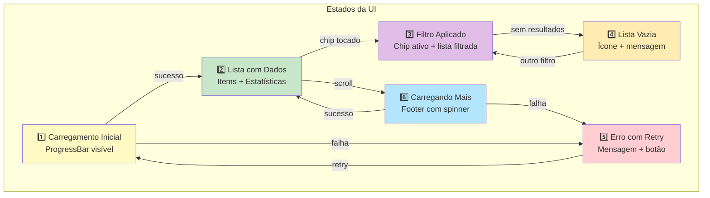

---

## 🎯 Pontos de Interação

```mermaid
graph TD
    TOOLBAR["🔧 Toolbar"]
    TOOLBAR --> VOLTAR["1️⃣ ← Voltar"]
    TOOLBAR --> BUSCAR["2️⃣ 🔍 Buscar"]
    TOOLBAR --> ORDENAR["3️⃣ 📊 Ordenar"]
    TOOLBAR --> CONFIG["4️⃣ ⚙️ Config"]
    
    HEADER["📊 Header"]
    HEADER --> ESTAT["5️⃣ Estatísticas do servidor<br/>Total | Coletados | Pendentes | %"]
    
    CHIPS["🏷️ Chips"]
    CHIPS --> CHIP_ALL["6️⃣ Todos"]
    CHIPS --> CHIP_COL["6️⃣ Coletados"]
    CHIPS --> CHIP_PEND["6️⃣ Pendentes"]
    
    LISTA["📋 Lista"]
    LISTA --> ITEM["7️⃣ Item clicável → Detalhes"]
    LISTA --> FOTO_CLICK["8️⃣ Foto → Ampliar"]
    LISTA --> SCROLL["9️⃣ Scroll infinito (Paging 3)"]
    LISTA --> RETRY["🔟 Retry em erro"]

    style TOOLBAR fill:#1976D2,color:#fff
    style HEADER fill:#388E3C,color:#fff
    style CHIPS fill:#7B1FA2,color:#fff
    style LISTA fill:#F57C00,color:#fff
```

---

## 📊 Matriz de Funcionalidades

| Funcionalidade | Entrada | Processamento | Saída |
|----------------|---------|---------------|-------|
| **Paginação** | Scroll automático | PagingSource → API | Próxima página carregada |
| **Filtro Status** | Chip selecionado | flatMapLatest no ViewModel | Nova PagingData |
| **Filtro Sala** | salaId passado | PatrimonioPorSalaPagingSource | Lista filtrada por sala |
| **Estatísticas** | onViewCreated | BuscarEstatisticasDashboardUseCase | Total/Coletados/Pendentes/% |
| **Detalhes** | Toque no item | onItemClick callback | Diálogo/Navegação |
| **Foto Referência** | Item renderizado | FotoReferenciaHelper (cache) | Imagem ou card oculto |
| **Retry** | Toque no botão | pagingAdapter.retry() | Recarrega página com erro |
| **Refresh** | viewModel.refresh() | _refreshTrigger.emit() | Recarrega do início |
| **Exportar** | ExportFragment | GerarRelatorioUseCase | PDF/Excel(TSV)/CSV |

---

## 📦 Componentes Implementados

### Fragments
| Componente | Tipo | Descrição |
|------------|------|-----------|
| `PatrimonioListPagingFragment` | Fragment | Lista com Paging 3 (recomendado) |
| `PatrimonioListFragment` | Fragment | Lista com scroll infinito manual (legado) |
| `ExportFragment` | Fragment | Exportação multi-formato |

### ViewModels
| Componente | Tipo | Descrição |
|------------|------|-----------|
| `PatrimonioListViewModelPaging` | @HiltViewModel | Paging 3 + filtros reativos |
| `PatrimonioListViewModel` | @HiltViewModel | Paginação manual (legado) |
| `ExportViewModel` | @HiltViewModel | Geração de relatórios |

### Adapters
| Componente | Tipo | Descrição |
|------------|------|-----------|
| `PatrimonioPagingAdapter` | PagingDataAdapter | Paging 3 automático |
| `PatrimonioLoadStateAdapter` | LoadStateAdapter | Footer loading/erro/retry |
| `PatrimonioAdapter` (inventario) | ListAdapter | Com foto de referência |
| `PatrimonioAdapter` (adapter) | ListAdapter | Básico com info coleta |

### Use Cases
| Componente | Descrição |
|------------|-----------|
| `BuscarPatrimoniosPaginadoUseCase` | Paging 3 (todos e por sala) |
| `BuscarEstatisticasDashboardUseCase` | Totais do servidor |
| `GerarRelatorioUseCase` | Exportação PDF/CSV/Excel |
| `BuscarSalasParaExportacaoUseCase` | Salas para filtro de export |

---

## 🔄 Ciclo de Vida do Filtro Reativo

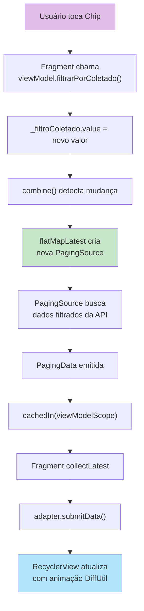

---

## 🎨 Paleta de Cores

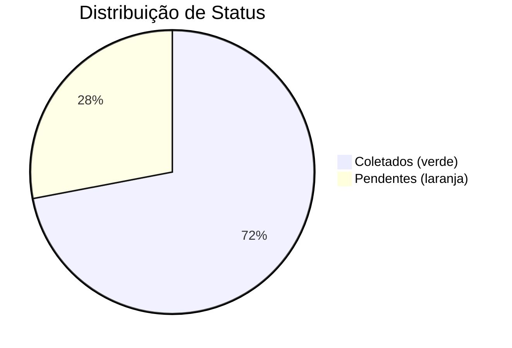

| Cor | Hex | Uso |
|-----|-----|-----|
| 🟢 success | `#4CAF50` | COLETADO |
| 🟠 warning | `#FF9800` | PENDENTE |
| 🔵 primary | `#2196F3` | Número patrimônio |
| ⚫ secondary | `#757575` | Texto secundário |
| 🟢 bg_success | `status_background_success` | Fundo status coletado |
| 🟠 bg_warning | `status_background_warning` | Fundo status pendente |

---

## 📐 Dimensões e Espaçamentos

```
Card de Item:
┌─────────────────────────────────────┐
│ ↕ 16dp padding                      │
│ ← 16dp → [Conteúdo] ← 16dp →       │
│ ↕ 16dp padding                      │
└─────────────────────────────────────┘
↕ 8dp margin

Ícones:
• Toolbar: 24dp x 24dp
• Card: 16dp x 16dp
• Foto Referência: 80dp x 80dp (thumbnail)

Textos:
• Número: 18sp (bold, azul)
• Descrição: 16sp
• Marca/Modelo: 14sp
• Setor/Sala: 12sp
• Status: 12sp (bold, cor contextual)
• Info Coleta: 11sp (cinza)

Chips:
• Altura: 32dp
• Padding horizontal: 12dp
• Espaçamento entre chips: 8dp
```

---

## ⚡ Melhorias v2.23.0 vs v1.3.0

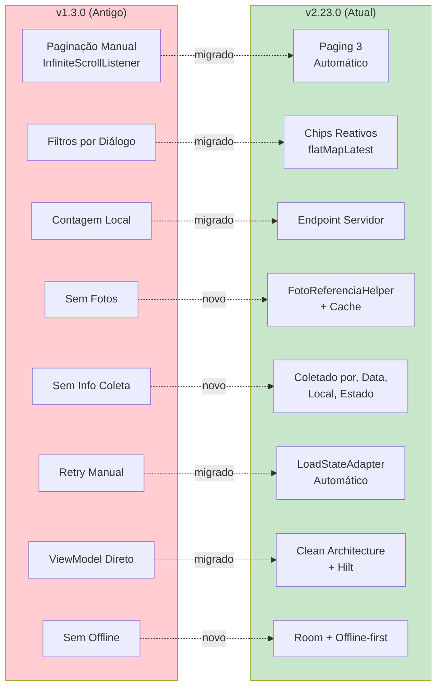

| Aspecto | v1.3.0 | v2.23.0 |
|---------|--------|---------|
| **Paginação** | Manual (InfiniteScrollListener) | Paging 3 (automático) |
| **Filtros** | Diálogo de ordenação | Chips reativos (flatMapLatest) |
| **Estatísticas** | Contagem local | Endpoint do servidor |
| **Fotos** | Não suportado | FotoReferenciaHelper com cache |
| **Info Coleta** | Não exibido | Coletado por, data, local, estado |
| **Retry** | Manual | Automático (LoadStateAdapter) |
| **Arquitetura** | ViewModel direto | Clean Architecture + Hilt |
| **Offline** | Não suportado | Room + offline-first |
| **Exportação** | Não suportado | PDF, Excel (TSV), CSV |
| **DI** | Manual/Factory | Hilt (@AndroidEntryPoint) |

---

## 🧪 Testes Recomendados

### Teste 1: Paginação
```
1. Abrir tela de inventário
2. Verificar que primeira página carrega (20 itens)
3. Scroll até o final
4. Verificar que LoadState footer aparece
5. Verificar que próxima página carrega automaticamente
6. Repetir até última página
```

### Teste 2: Filtros
```
1. Tocar chip "Coletados"
2. Verificar que apenas itens coletados aparecem
3. Tocar chip "Pendentes"
4. Verificar que apenas itens pendentes aparecem
5. Tocar chip "Todos"
6. Verificar que todos os itens aparecem
```

### Teste 3: Erro e Retry
```
1. Desconectar internet
2. Scroll para carregar mais
3. Verificar que footer de erro aparece
4. Reconectar internet
5. Tocar "Tentar novamente"
6. Verificar que dados carregam
```

### Teste 4: Foto de Referência
```
1. Abrir lista com PatrimonioAdapter (inventario)
2. Verificar que fotos carregam assincronamente
3. Tocar na foto
4. Verificar que amplia
5. Scroll rápido (verificar cancelamento de jobs)
```

### Teste 5: Exportação
```
1. Navegar para ExportFragment
2. Selecionar formato (PDF/Excel/CSV)
3. Aplicar filtro (Todos/Coletados/Pendentes)
4. Gerar relatório
5. Verificar arquivo gerado
6. Compartilhar/Abrir
```

---

**Versão**: 2.23.0  
**Data**: 09/05/2026  
**Tipo**: Diagrama Visual + Arquitetura + Mermaid  
**Status**: ✅ Atualizado com implementação real
