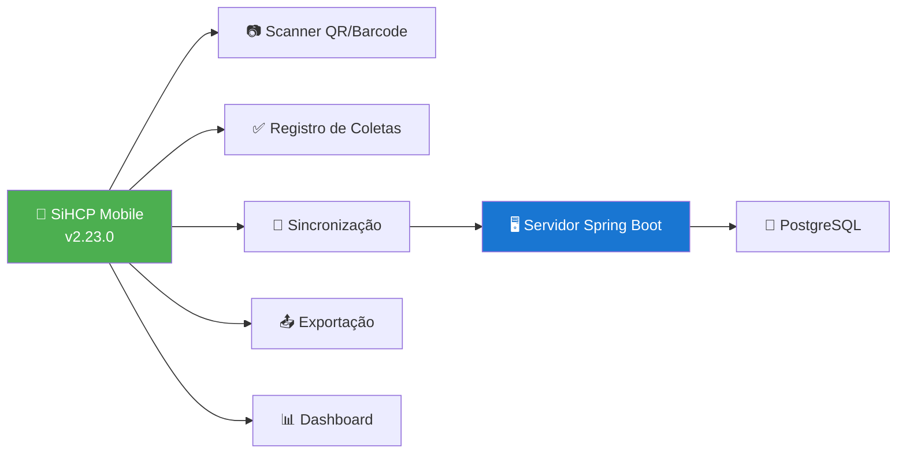
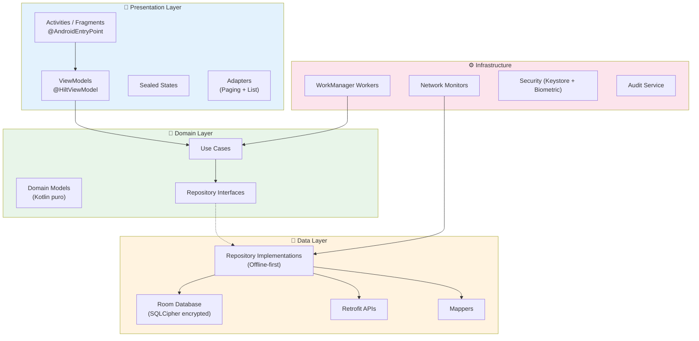
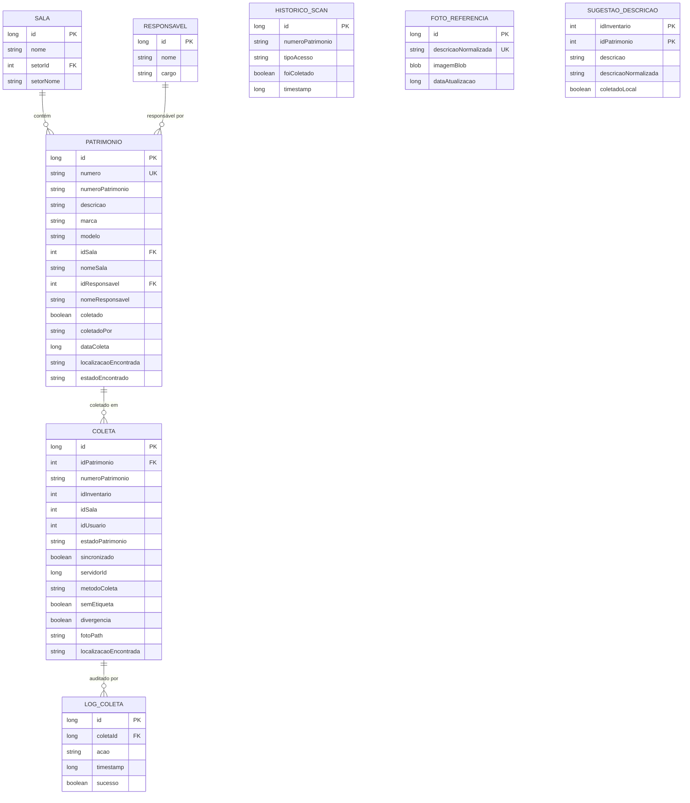
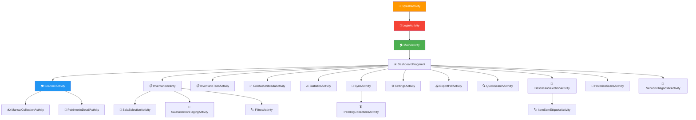
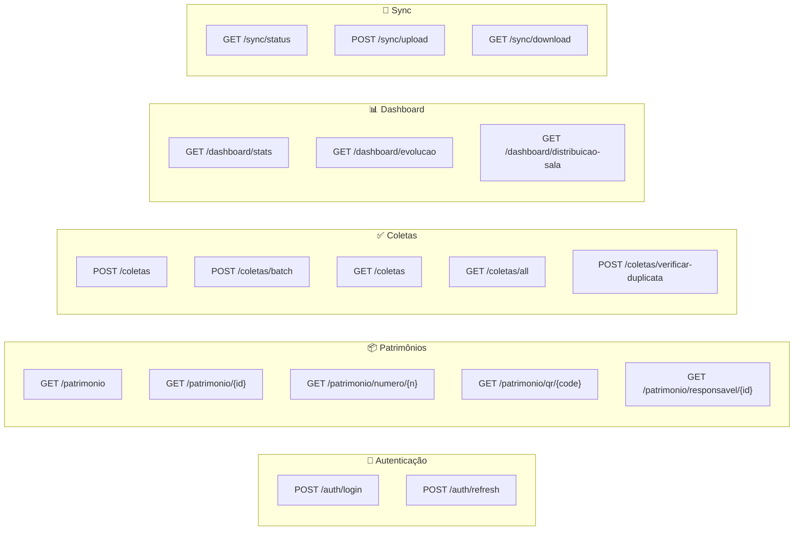
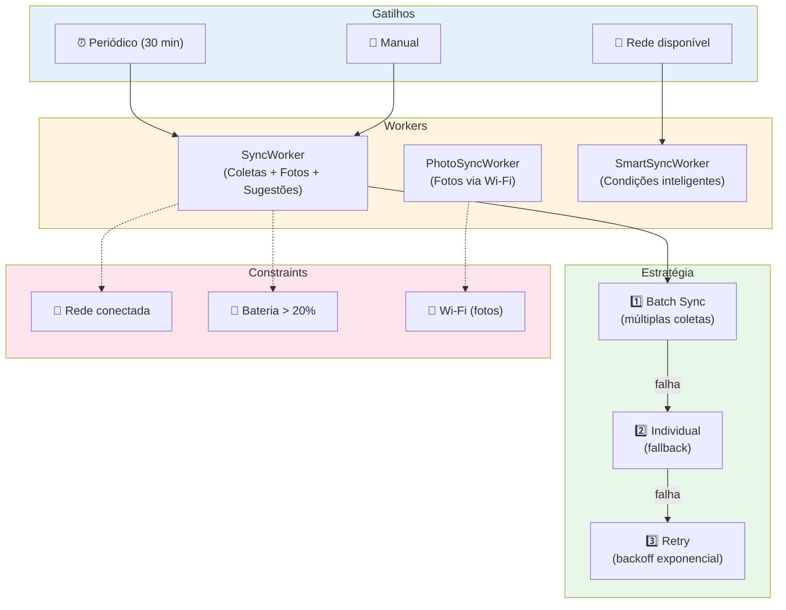
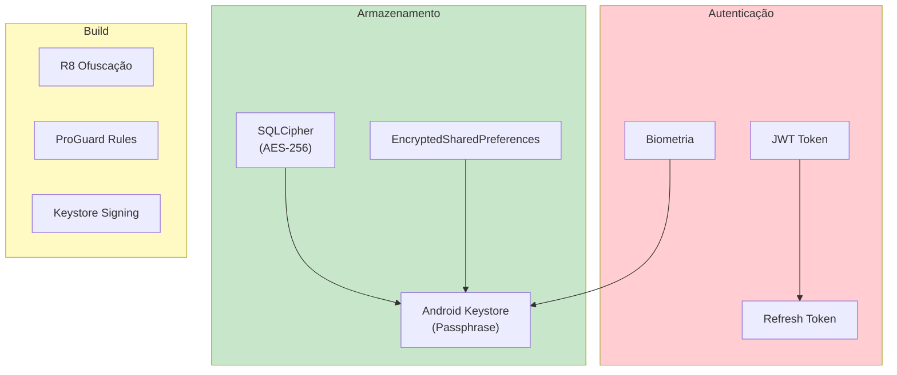

# Documentação do Projeto InventarioMobile

## Visão Geral

O **InventarioMobile** (SiHCP Mobile) é um aplicativo Android nativo desenvolvido em Kotlin para o Instituto Federal de Mato Grosso (IFMT). Permite coleta de patrimônios via QR Code, código de barras ou busca manual, com suporte completo a modo offline, sincronização inteligente e exportação de relatórios.



---

## 📋 Informações do Projeto

| Campo | Valor |
|-------|-------|
| **Nome** | SiHCP Mobile (InventarioMobile) |
| **Versão** | 2.23.0 (versionCode 71) |
| **Package** | `com.inventario.mobile` |
| **Compile SDK** | 34 |
| **Min SDK** | 23 (Android 6.0) |
| **Target SDK** | 34 (Android 14) |
| **Linguagem** | Kotlin 2.2.0 |
| **Build System** | Gradle 8.13.0 + KSP |
| **Arquitetura** | Clean Architecture + MVVM |
| **DI** | Hilt 2.48 |

---

## 🏗️ Arquitetura



---

## 📁 Estrutura de Pacotes

```
com.inventario.mobile/
├── InventarioMobileApplication.kt     # @HiltAndroidApp
│
├── api/                                # Interfaces Retrofit (legado)
├── auth/                               # Autenticação e tokens
├── config/                             # Configurações do app
├── data/                               # 💾 Camada de Dados
│   ├── audit/                          #   Serviço de auditoria
│   ├── local/                          #   Fontes locais
│   │   ├── dao/                        #     DAOs Room (11 DAOs)
│   │   ├── database/                   #     AppDatabase (SQLCipher)
│   │   └── entity/                     #     Entities Room (10 entities)
│   ├── model/                          #   DTOs e modelos de dados
│   ├── remote/                         #   Fontes remotas
│   │   ├── api/                        #     Interfaces Retrofit
│   │   ├── dto/                        #     Request/Response DTOs
│   │   └── interceptor/               #     Interceptors HTTP
│   ├── mapper/                         #   Conversores Entity↔Domain
│   └── repository/                     #   Implementações de repositórios
│
├── di/                                 # 💉 Módulos Hilt
│   ├── DatabaseModule.kt
│   ├── RepositoryModule.kt
│   ├── ApiModule.kt
│   └── MapperModule.kt
│
├── domain/                             # 🎯 Camada de Domínio
│   ├── model/                          #   Modelos puros (sem Android)
│   ├── repository/                     #   Interfaces de repositórios
│   ├── usecase/                        #   Casos de uso
│   └── validator/                      #   Validadores de negócio
│
├── model/                              # Modelos compartilhados
├── network/                            # 🌐 Monitoramento de rede
│   ├── ConnectivityMonitor.kt
│   ├── NetworkQualityMonitor.kt
│   └── NetworkMonitor.kt
│
├── presentation/                       # 📱 Camada de Apresentação
│   ├── activity/                       #   Activities utilitárias
│   ├── adapter/                        #   Adapters compartilhados
│   ├── charts/                         #   Componentes de gráficos
│   ├── coleta/                         #   Telas de coleta
│   ├── coletas/                        #   Listagem de coletas
│   ├── components/                     #   Componentes reutilizáveis
│   ├── dashboard/                      #   Dashboard principal
│   ├── descricao/                      #   Seleção de descrição
│   ├── detail/                         #   Detalhes do patrimônio
│   ├── dialog/                         #   Diálogos
│   ├── export/                         #   Exportação (PDF/CSV/Excel)
│   ├── filtros/                        #   Filtros avançados
│   ├── historico/                      #   Histórico de scans
│   ├── inventario/                     #   Listagem de inventário
│   ├── login/                          #   Autenticação
│   ├── main/                           #   MainActivity
│   ├── patrimonio/                     #   Patrimônios (Paging 3)
│   ├── sala/                           #   Seleção de salas
│   ├── scanner/                        #   Scanner QR/Barcode
│   ├── search/                         #   Busca rápida
│   ├── settings/                       #   Configurações
│   ├── state/                          #   Sealed classes de estado
│   ├── statistics/                     #   Estatísticas
│   ├── sync/                           #   Sincronização
│   ├── util/                           #   Utilitários de UI
│   ├── validation/                     #   Validação de patrimônios
│   └── viewmodel/                      #   ViewModels compartilhados
│
├── repository/                         # Repositórios (legado)
├── security/                           # 🔐 Segurança
│   └── SqlCipherKeyManager.kt         #   Gerenciamento de chaves
│
├── service/                            # Serviços Android
├── sync/                               # 🔄 Gerenciamento de sync
│   ├── SyncManager.kt
│   └── AutoSyncManager.kt
│
├── ui/                                 # UI (legado)
│   ├── coleta/
│   └── splash/
│
├── util/ + utils/                      # 🔧 Utilitários
│   ├── PreferencesManager.kt
│   ├── PhotoHelper.kt
│   ├── FotoReferenciaHelper.kt
│   ├── NetworkMonitor.kt
│   └── OfflineNotificationManager.kt
│
└── worker/                             # ⏰ Background Workers
    ├── SyncWorker.kt                   #   Sync principal (Hilt)
    ├── PhotoSyncWorker.kt              #   Sync de fotos
    ├── SmartSyncWorker.kt              #   Sync inteligente
    ├── ColetaSyncWorker.kt             #   Sync de coletas
    ├── DatabaseCleanupWorker.kt        #   Limpeza do banco
    ├── DatabaseBackupWorker.kt         #   Backup do banco
    └── BackupWorker.kt                 #   Backup geral
```

---

## 🗄️ Banco de Dados (Room + SQLCipher)

### Configuração

| Campo | Valor |
|-------|-------|
| **Nome** | `inventario_offline_secure.db` |
| **Versão** | 17 |
| **Criptografia** | SQLCipher (passphrase via Android Keystore) |
| **Entities** | 10 |
| **DAOs** | 11 |
| **Migrações** | 13 (v4→v17) |

### Diagrama de Entidades



### Entities Detalhadas

#### PatrimonioEntity
- 22 campos com índices otimizados (único + compostos)
- Campos de auditoria: `localizacaoEncontrada`, `estadoEncontrado` (v2.20.7)
- Índices compostos para filtros de busca rápida

#### ColetaEntity
- 40+ campos incluindo métricas de performance
- Suporte a itens sem etiqueta (v2.7)
- Foto opcional com path local (v2.11)
- Divergência automática (v2.13)
- Localização encontrada separada (v2.20.12)

---

## 📱 Telas (Activities)



| Activity | Função | Pacote |
|----------|--------|--------|
| `SplashActivity` | Tela inicial | `ui.splash` |
| `LoginActivity` | Autenticação + Biometria | `presentation.login` |
| `MainActivity` | Navegação principal | `presentation.main` |
| `ScannerActivity` | Scanner QR/Barcode | `presentation.scanner` |
| `ManualCollectionActivity` | Coleta manual | `presentation.coleta` |
| `CollectionViewActivity` | Visualizar coletas | `presentation.coleta` |
| `ColetasUnificadaActivity` | Coletas unificada | `presentation.coletas` |
| `ItemSemEtiquetaActivity` | Item sem etiqueta | `presentation.coleta` |
| `DescricaoSelectionActivity` | Seleção por descrição | `presentation.descricao` |
| `InventarioActivity` | Lista de patrimônios | `presentation.inventario` |
| `InventarioTabsActivity` | Inventário por tabs | `presentation.inventario` |
| `SalaSelectionActivity` | Seleção de salas | `presentation.sala` |
| `SalaSelectionPagingActivity` | Salas com Paging 3 | `presentation.sala` |
| `SyncActivity` | Sincronização | `presentation.sync` |
| `PendingCollectionsActivity` | Coletas pendentes | `presentation.sync` |
| `StatisticsActivity` | Estatísticas | `presentation.statistics` |
| `SettingsActivity` | Configurações | `presentation.settings` |
| `FiltrosActivity` | Filtros avançados | `presentation.filtros` |
| `QuickSearchActivity` | Busca rápida | `presentation.search` |
| `PatrimonioDetailActivity` | Detalhes patrimônio | `presentation.detail` |
| `ExportPdfActivity` | Exportação PDF | `presentation.export` |
| `HistoricoScansActivity` | Histórico de scans | `presentation.historico` |
| `NetworkDiagnosticActivity` | Diagnóstico de rede | `presentation.activity` |

---

## 🔌 API Endpoints



**Base URL**: `api/mobile/`

| Grupo | Endpoints | Descrição |
|-------|-----------|-----------|
| **Auth** | 2 | Login JWT + Refresh Token |
| **Patrimônios** | 8+ | CRUD + busca por número/QR/responsável |
| **Coletas** | 6+ | Registro individual/batch + verificação duplicata |
| **Salas** | 4 | Listagem + paginação + por setor |
| **Setores** | 2 | Listagem + por ID |
| **Responsáveis** | 2 | Listagem + por ID |
| **Descrições** | 3 | Listagem + busca + não coletadas |
| **Inventário** | 2 | Ativo + por ID |
| **Dashboard** | 5 | Stats + evolução + distribuição |
| **Sync** | 3 | Status + upload + download |

---

## 🔄 Sincronização



### Workers

| Worker | Função | Intervalo | Constraints |
|--------|--------|-----------|-------------|
| `SyncWorker` | Coletas + Fotos + Sugestões | 30 min | Rede + Bateria |
| `PhotoSyncWorker` | Upload de fotos | Periódico | Wi-Fi + Bateria |
| `SmartSyncWorker` | Sync inteligente | Condicional | Rede + Bateria > 20% |
| `ColetaSyncWorker` | Sync de coletas | Sob demanda | Rede |
| `DatabaseCleanupWorker` | Limpeza do banco | Periódico | - |
| `DatabaseBackupWorker` | Backup do banco | Periódico | - |
| `BackupWorker` | Backup geral | Periódico | - |

---

## 🔐 Segurança



| Recurso | Implementação |
|---------|---------------|
| **Banco de dados** | SQLCipher com passphrase via Android Keystore |
| **Autenticação** | JWT + Refresh Token automático |
| **Biometria** | Fingerprint/Face para login rápido |
| **Preferências** | EncryptedSharedPreferences |
| **Build Release** | R8 + minifyEnabled + shrinkResources |
| **Assinatura** | Keystore externo (não versionado) |

---

## 📦 Dependências Principais

### Core
| Dependência | Versão | Uso |
|-------------|--------|-----|
| Kotlin | 2.2.0 | Linguagem |
| AndroidX Core KTX | 1.12.0 | Extensions |
| Material Design | 1.10.0 | UI Components |
| Navigation | 2.7.5 | Navegação |
| Lifecycle | 2.7.0 | ViewModel + LiveData |

### Dados
| Dependência | Versão | Uso |
|-------------|--------|-----|
| Room | 2.6.1 | Banco local |
| Room Paging | 2.6.1 | Paginação local |
| Paging 3 | 3.2.1 | Scroll infinito |
| SQLCipher | 4.5.4 | Criptografia do banco |
| Retrofit | 2.9.0 | HTTP Client |
| OkHttp Logging | 4.12.0 | Debug de rede |
| Gson | (via Retrofit) | JSON parsing |

### UI
| Dependência | Versão | Uso |
|-------------|--------|-----|
| Glide | 4.16.0 | Imagens |
| MPAndroidChart | 3.1.0 | Gráficos |
| ZXing | 4.3.0 / 3.5.2 | Scanner QR |
| CameraX | 1.3.0 | Preview de câmera |
| SwipeRefreshLayout | 1.1.0 | Pull-to-refresh |

### Infraestrutura
| Dependência | Versão | Uso |
|-------------|--------|-----|
| Hilt | 2.48 | Injeção de dependência |
| WorkManager | 2.9.0 | Background tasks |
| Coroutines | 1.7.3 | Async |
| Biometric | 1.2.0-alpha05 | Autenticação biométrica |
| Security Crypto | 1.1.0-alpha06 | Preferências seguras |
| iText | 7.2.5 | Geração de PDF |
| ThreeTenABP | 1.4.6 | Date/Time |

### Testes
| Dependência | Versão | Uso |
|-------------|--------|-----|
| JUnit | 4.13.2 | Testes unitários |
| Kotest | 5.8.0 | Property-based testing |
| MockK | 1.12.8 | Mocking |
| Espresso | 3.5.1 | Testes de UI |
| Hilt Testing | 2.48 | DI em testes |

---

## 📋 Permissões

| Permissão | Uso | Obrigatória |
|-----------|-----|-------------|
| `INTERNET` | Comunicação com servidor | ✅ |
| `ACCESS_NETWORK_STATE` | Monitorar conectividade | ✅ |
| `CAMERA` | Scanner QR Code | ✅ |
| `ACCESS_FINE_LOCATION` | GPS para coleta | ⚠️ |
| `ACCESS_COARSE_LOCATION` | Localização aproximada | ⚠️ |
| `VIBRATE` | Feedback tátil no scan | ❌ |
| `RECORD_AUDIO` | Busca por voz | ❌ |
| `USE_BIOMETRIC` | Login biométrico | ❌ |
| `FOREGROUND_SERVICE` | Sync em background | ✅ |
| `FOREGROUND_SERVICE_DATA_SYNC` | Tipo de foreground service | ✅ |
| `POST_NOTIFICATIONS` | Notificações de sync | ⚠️ |
| `READ_MEDIA_IMAGES` | Fotos (Android 13+) | ⚠️ |
| `WAKE_LOCK` | Manter CPU durante sync | ❌ |

---

## 🚀 Funcionalidades Principais

### Métodos de Coleta
- **QR Code**: Scan via câmera com ZXing
- **Código de Barras**: Scan de etiquetas
- **Busca Manual**: Por número do patrimônio
- **Por Descrição**: Seleção de descrições não coletadas
- **Item Sem Etiqueta**: Registro com foto obrigatória

### Sincronização
- **Offline-first**: Coletas salvas localmente primeiro
- **Batch Sync**: Múltiplas coletas em uma requisição
- **Background Sync**: WorkManager a cada 30 minutos
- **Smart Sync**: Baseado em qualidade de rede e bateria
- **Photo Sync**: Upload de fotos apenas em Wi-Fi
- **Retry**: Backoff exponencial em falhas

### Exportação
- **PDF**: Relatório completo com estatísticas
- **Excel (TSV)**: Compatível com Excel/LibreOffice
- **CSV**: Formato universal

### Segurança
- **SQLCipher**: Banco criptografado AES-256
- **Android Keystore**: Passphrase segura
- **JWT + Refresh**: Renovação automática de token
- **Biometria**: Login rápido por impressão digital
- **R8**: Ofuscação de código em release

### Monitoramento
- **NetworkQualityMonitor**: Qualidade da rede em tempo real
- **ConnectivityMonitor**: Estado de conectividade
- **AutoSyncManager**: Sync quando servidor volta
- **AuditService**: Log de todas as operações

---

## 🔧 Comandos de Build

```bash
# Build debug
cd InventarioMobile
.\gradlew.bat assembleDebug

# Build release (requer keystore.properties)
.\gradlew.bat assembleRelease

# Instalar no dispositivo
.\gradlew.bat installDebug

# Limpar build
.\gradlew.bat clean

# Rodar testes
.\gradlew.bat test

# Testes instrumentados
.\gradlew.bat connectedAndroidTest
```

---

## 📊 Métricas do Projeto

| Métrica | Valor |
|---------|-------|
| **Activities** | 25+ |
| **Fragments** | 10+ |
| **ViewModels** | 15+ |
| **Use Cases** | 12+ |
| **Workers** | 7 |
| **Entities Room** | 10 |
| **DAOs** | 11 |
| **Migrações DB** | 13 |
| **Endpoints API** | 40+ |
| **Permissões** | 15 |

---

## ✅ Status Atual (v2.23.0)

### Implementado
- ✅ Clean Architecture + MVVM completo
- ✅ Hilt DI em todas as telas críticas
- ✅ Paging 3 para listas grandes
- ✅ Sincronização batch + individual + background
- ✅ SQLCipher com passphrase via Keystore
- ✅ Biometria para login
- ✅ Exportação PDF/CSV/Excel
- ✅ Fotos de referência com cache
- ✅ Divergência automática de localização/estado
- ✅ Histórico de scans
- ✅ Sugestões de descrição com autocomplete
- ✅ R8 ofuscação em release
- ✅ Relatório fotográfico de itens sem etiqueta

### Em Progresso
- ⏳ Testes unitários (Kotest configurado)
- ⏳ Migração completa de Activities legadas
- ⏳ Sincronização bidirecional completa

---

**Última atualização**: 09/05/2026  
**Versão do documento**: 3.0.0
