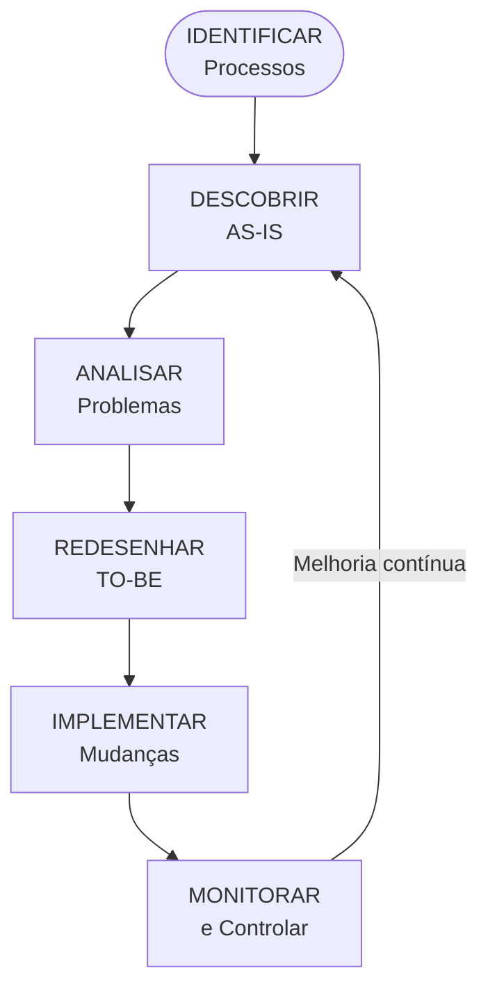
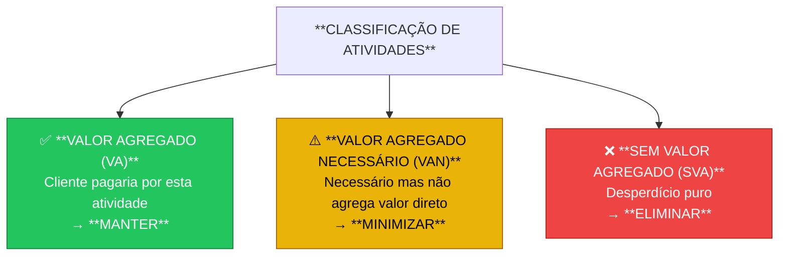
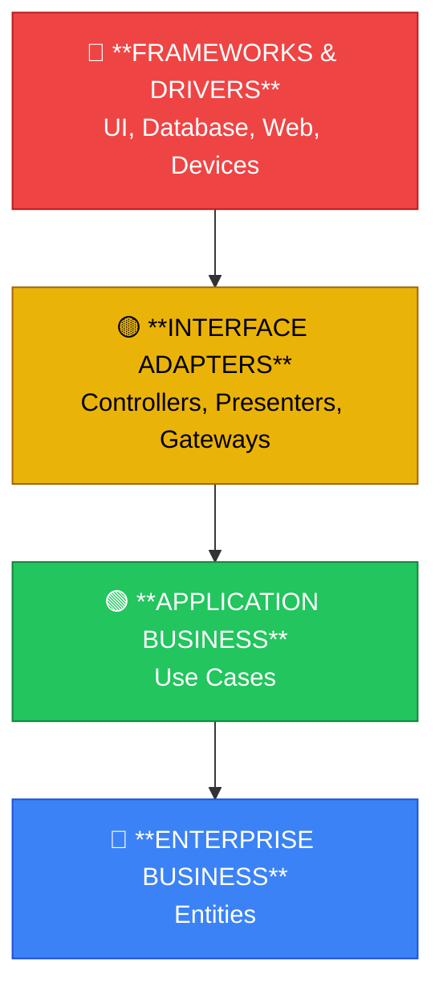
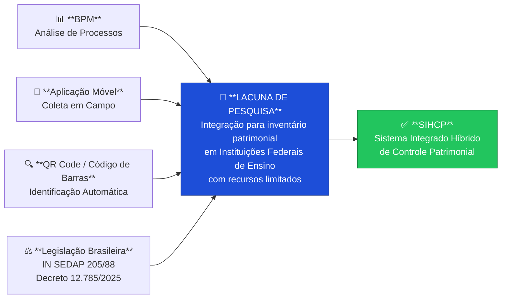

# Referencial Teórico

**Contexto:** Dissertação de Mestrado - SIHCP  
**Instituição:** IFMT - Campus Primavera do Leste  
**Data:** 03/01/2026  
**Versão:** 1.0.0

---

## Sumário

1. [Introdução](#1-introdução)
2. [Gestão Patrimonial no Setor Público](#2-gestão-patrimonial-no-setor-público)
3. [Business Process Management (BPM)](#3-business-process-management-bpm)
4. [Lean Management e Eliminação de Desperdícios](#4-lean-management-e-eliminação-de-desperdícios)
5. [Tecnologias de Identificação Automática](#5-tecnologias-de-identificação-automática)
6. [Aplicações Móveis para Gestão de Inventário](#6-aplicações-móveis-para-gestão-de-inventário)
7. [Trabalhos Relacionados](#7-trabalhos-relacionados)
8. [Síntese e Lacuna de Pesquisa](#8-síntese-e-lacuna-de-pesquisa)
9. [Referências Bibliográficas](#9-referências-bibliográficas)
10. [Tópicos Complementares](#10-tópicos-complementares)
    - 10.1 Arquitetura Offline-First
    - 10.2 Automação de Processos vs Processos Manuais
    - 10.3 Qualidade de Dados e Precisão de Inventário
    - 10.4 Technology Acceptance Model (TAM)
    - 10.5 BPMN no Setor Público
11. [Referências Complementares](#11-referências-complementares)

---

## 1. Introdução

Este referencial teórico fundamenta a pesquisa sobre melhoria de processo na coleta de dados
do inventário patrimonial, integrando conceitos de gestão patrimonial pública, Business Process
Management (BPM), Lean Management, tecnologias de identificação automática e aplicações móveis.

A estrutura do referencial segue a lógica de construção do conhecimento necessário para
compreender o problema de pesquisa e a solução proposta:

| Seção | Tema | Relevância para o Trabalho |
|-------|------|---------------------------|
| 2 | Gestão Patrimonial | Contexto legal e normativo brasileiro |
| 3 | BPM | Metodologia de análise e melhoria de processos |
| 4 | Lean Management | Identificação e eliminação de desperdícios |
| 5 | Tecnologias de Identificação | Código de barras, QR Code, RFID |
| 6 | Aplicações Móveis | Soluções tecnológicas para coleta em campo |
| 7 | Trabalhos Relacionados | Estado da arte e casos de sucesso |
| 8 | Lacuna de Pesquisa | Contribuição original do trabalho |

---

## 2. Gestão Patrimonial no Setor Público

### 2.1 Conceitos Fundamentais

A gestão patrimonial compreende o conjunto de atividades relacionadas ao controle, preservação
e otimização dos bens pertencentes a uma organização. No contexto do setor público brasileiro,
esta gestão assume características específicas devido ao arcabouço legal que regulamenta a
administração de bens públicos.

Segundo Souza (2023), a gestão patrimonial na Administração Pública federal:

> "compreende toda uma cadeia de atividades que se inicia no planejamento das aquisições
> e perpassa por todas as fases do ciclo de vida dos bens, até a sua baixa do acervo
> patrimonial."

O ciclo de vida dos bens patrimoniais públicos pode ser representado conforme o diagrama abaixo:

### 2.2 Marco Legal Brasileiro

A gestão patrimonial no setor público brasileiro é regida por um conjunto de normas que
estabelecem princípios, procedimentos e responsabilidades. O quadro a seguir sintetiza
as principais normas aplicáveis:

| Norma | Ano | Escopo | Principais Disposições |
|-------|-----|--------|------------------------|
| CF/88 Art. 70 | 1988 | Constitucional | Fiscalização patrimonial da União |
| Lei 4.320 | 1964 | Financeiro | Registros analíticos de bens permanentes |
| Decreto 12.785 | 2025 | Desfazimento | Alienação de bens móveis inservíveis *(revogou o Decreto nº 9.373/2018)* |
| IN SEDAP 205 | 1988 | Operacional | Procedimentos de inventário físico |
| NBC TSP 07 | 2017 | Contábil | Ativo imobilizado no setor público |

#### 2.2.1 Constituição Federal de 1988

O Art. 70 da Constituição Federal estabelece o fundamento constitucional para o controle
patrimonial:

> "A fiscalização contábil, financeira, orçamentária, operacional e **patrimonial** da
> União e das entidades da administração direta e indireta, quanto à legalidade,
> legitimidade, economicidade, aplicação das subvenções e renúncia de receitas, será
> exercida pelo Congresso Nacional, mediante controle externo, e pelo sistema de
> controle interno de cada Poder." (BRASIL, 1988)

Esta disposição constitucional implica que todo órgão público federal deve manter controle
rigoroso de seus bens patrimoniais, incluindo a realização de inventários físicos periódicos.

#### 2.2.2 Lei nº 4.320/1964

A Lei 4.320/1964 estatui normas gerais de direito financeiro e estabelece requisitos
específicos para o controle de bens patrimoniais:

| Artigo | Texto Legal | Implicação Prática |
|--------|-------------|-------------------|
| Art. 94 | "Haverá registros analíticos de todos os bens de caráter permanente, com indicação dos elementos necessários para a perfeita caracterização de cada um deles e dos agentes responsáveis pela sua guarda e administração." | Cada bem deve ter registro individual com identificação única, descrição, localização e responsável |
| Art. 95 | "A contabilidade manterá registros sintéticos dos bens móveis e imóveis." | Integração entre controle físico e contábil |
| Art. 96 | "O levantamento geral dos bens móveis e imóveis terá por base o inventário analítico de cada unidade administrativa." | Inventário físico é base para demonstrações contábeis |

#### 2.2.3 Instrução Normativa SEDAP nº 205/1988

A IN SEDAP 205/1988 é a principal norma operacional para gestão de material no serviço
público federal. Seu item 8 trata especificamente do inventário físico:

> "8.1 O inventário físico é o instrumento de controle para a verificação dos saldos
> de estoques nos almoxarifados e depósitos, e dos equipamentos e materiais permanentes,
> em uso no órgão ou entidade."
>
> "8.2 O inventário físico deverá ser realizado por Comissão designada pelo Dirigente
> do Departamento de Administração ou unidade equivalente." (BRASIL, 1988)

A norma estabelece cinco tipos de inventário:

| Tipo | Definição | Periodicidade |
|------|-----------|---------------|
| **Anual** | Comprovar quantidade e valor dos bens em 31/12 | Obrigatório ao final de cada exercício |
| **Inicial** | Identificar bens na criação de unidade gestora | Na criação da UG |
| **Transferência** | Mudança do dirigente da unidade gestora | Na troca de gestor |
| **Extinção/Transformação** | Extinção ou transformação da unidade | Na reorganização |
| **Eventual** | Por iniciativa do dirigente ou órgão fiscalizador | Qualquer época |

#### 2.2.4 Decreto nº 12.785/2025 *(revogou o Decreto nº 9.373/2018)*

> **⚠️ Atualização Normativa:** O Decreto nº 9.373/2018 foi **revogado** pelo Decreto nº 12.785,
> de 19 de dezembro de 2025, que dispõe sobre a gestão do patrimônio imobiliário da União e
> regulamenta o desfazimento de bens móveis no âmbito federal.

O Decreto 12.785/2025 continua regulamentando a alienação, cessão, transferência e destinação
de bens móveis no âmbito da administração pública federal, mantendo a classificação de bens
inservíveis estabelecida pelo regime anterior:

| Classificação | Definição Legal | Destinação |
|---------------|-----------------|------------|
| **Ocioso** | Bem em perfeitas condições, mas sem utilização | Redistribuição ou desfazimento |
| **Recuperável** | Bem avariado, recuperação economicamente viável | Reparo ou desfazimento |
| **Antieconômico** | Manutenção onerosa ou rendimento precário | Desfazimento |
| **Irrecuperável** | Não pode ser utilizado para o fim a que se destina | Desfazimento obrigatório |

### 2.3 Sistemas Oficiais de Gestão Patrimonial

A gestão patrimonial no governo federal utiliza sistemas informatizados integrados:

#### SUAP - Sistema Unificado de Administração Pública

O SUAP é o sistema de gestão administrativa utilizado pelos Institutos Federais. Gerencia
cadastro de patrimônios, movimentações, responsáveis e localizações. Contudo, **não dispõe
de módulo para realização de inventário físico**, lacuna que motivou o desenvolvimento
do SIHCP.

#### SIADS - Sistema Integrado de Administração de Serviços Gerais

O SIADS é o sistema oficial do Governo Federal para gestão de patrimônio, almoxarifado
e frota, desenvolvido pelo SERPRO e gerenciado pela Secretaria do Tesouro Nacional (STN).
É o sistema de registro oficial para fins de prestação de contas.

### 2.4 Desafios da Gestão Patrimonial em Instituições de Ensino

As instituições federais de ensino enfrentam desafios específicos na gestão patrimonial:

| Desafio | Descrição | Impacto |
|---------|-----------|---------|
| **Volume de bens** | Milhares de patrimônios distribuídos em múltiplos campi | Dificuldade de controle físico |
| **Diversidade** | Desde mobiliário até equipamentos de laboratório de alto valor | Complexidade de classificação |
| **Dispersão geográfica** | Bens em salas de aula, laboratórios, áreas externas | Dificuldade de localização |
| **Rotatividade** | Movimentação frequente entre setores e responsáveis | Desatualização cadastral |
| **Recursos limitados** | Equipes reduzidas para inventário | Processo demorado |

Estudos internacionais corroboram estes desafios. A University of Michigan, por exemplo,
reimaginou sua abordagem de rastreamento de ativos, substituindo processos legados por
um modelo centralizado e orientado por software para gerenciar mais de 26.000 ativos
em três campi (HCAMGT, 2025).

---

## 3. Business Process Management (BPM)

### 3.1 Conceitos Fundamentais

Business Process Management (BPM) é definido por Dumas et al. (2018) como:

> "a arte e ciência de supervisionar como o trabalho é realizado em uma organização
> para garantir resultados consistentes e aproveitar oportunidades de melhoria."

A ABPMP (2013), no Guia BPM CBOK, complementa:

> "BPM é uma disciplina gerencial que integra estratégias e objetivos de uma organização
> com expectativas e necessidades de clientes, por meio do foco em processos ponta a
> ponta. BPM engloba estratégias, objetivos, cultura, estruturas organizacionais, papéis,
> políticas, métodos e tecnologias para analisar, desenhar, implementar, gerenciar
> desempenho, transformar e estabelecer a governança de processos."

### 3.2 Ciclo de Vida BPM

O ciclo de vida BPM compreende fases iterativas de melhoria contínua:

### 3.3 Notação BPMN

A Business Process Model and Notation (BPMN) é o padrão internacional para modelagem
de processos de negócio. Os principais elementos são:

| Categoria | Elemento | Símbolo | Descrição |
|-----------|----------|---------|-----------|
| **Eventos** | Início | ○ | Dispara o processo |
| | Fim | ◉ | Encerra o processo |
| | Intermediário | ◎ | Ocorre durante o processo |
| **Atividades** | Tarefa | ▭ | Unidade de trabalho |
| | Subprocesso | ▭⁺ | Processo aninhado |
| **Gateways** | Exclusivo | ◇ | Decisão (XOR) |
| | Paralelo | ⊕ | Execução simultânea (AND) |
| | Inclusivo | ⊙ | Uma ou mais opções (OR) |
| **Fluxos** | Sequência | → | Ordem de execução |
| | Mensagem | ⇢ | Comunicação entre participantes |

### 3.4 BPM no Setor Público

A aplicação de BPM no setor público apresenta características específicas. Um estudo
de mineração de processos no Poder Executivo Federal brasileiro identificou:

> "lacunas em processos regulatórios propostos pelo Poder Executivo Federal, como
> sobreposição de regulamentações em várias camadas, gargalos e retrabalho."
> (FLUXICON, 2018)

Pesquisadores desenvolveram um modelo integrando PRINCE2 e Success Management para
projetos de BPM no setor público, propondo listas de critérios e fatores de sucesso
sob perspectivas do cliente e da equipe de projeto (RESEARCHGATE, 2024).

Um framework de ciclo de vida BPM para melhoria contínua em direção à excelência
operacional foi proposto com base em estudo longitudinal em organização brasileira,
oferecendo insights sobre design, implementação, uso e avaliação de processos de
negócio (EMERALD, 2024).

### 3.5 Matriz SIPOC

A matriz SIPOC (Suppliers, Inputs, Process, Outputs, Customers) é uma ferramenta BPM
para documentar os elementos essenciais de um processo:

| Elemento | Descrição | Perguntas-Chave |
|----------|-----------|-----------------|
| **S**uppliers | Fornecedores de entradas | Quem fornece os insumos? |
| **I**nputs | Entradas necessárias | O que é necessário para executar? |
| **P**rocess | Processo em alto nível | Quais são as principais etapas? |
| **O**utputs | Saídas produzidas | O que é entregue? |
| **C**ustomers | Clientes das saídas | Quem recebe os resultados? |

### 3.6 Indicadores de Desempenho (KPIs)

Key Performance Indicators (KPIs) são métricas utilizadas para avaliar o desempenho
de processos. No contexto de BPM, os KPIs devem ser:

- **Específicos**: Claramente definidos
- **Mensuráveis**: Quantificáveis objetivamente
- **Alcançáveis**: Realistas dentro do contexto
- **Relevantes**: Alinhados aos objetivos
- **Temporais**: Com prazo definido

---

## 4. Lean Management e Eliminação de Desperdícios

### 4.1 Origens e Conceitos

O Lean Management originou-se do Sistema Toyota de Produção (TPS), desenvolvido por
Taiichi Ohno e Eiji Toyoda após a Segunda Guerra Mundial. O conceito central é a
eliminação sistemática de desperdícios (muda) para maximizar valor ao cliente.

Womack e Jones (2003) definem cinco princípios Lean:

| Princípio | Descrição | Aplicação em Inventário |
|-----------|-----------|------------------------|
| **Valor** | Definir valor sob perspectiva do cliente | Informação precisa sobre patrimônios |
| **Fluxo de Valor** | Mapear todas as etapas do processo | Identificar atividades que agregam valor |
| **Fluxo Contínuo** | Eliminar interrupções no processo | Coleta sem paradas para digitação |
| **Produção Puxada** | Produzir apenas quando demandado | Inventário sob demanda |
| **Perfeição** | Buscar melhoria contínua | Redução progressiva de erros |

### 4.2 Os Sete Desperdícios (Muda)

Ohno identificou sete tipos de desperdícios que devem ser eliminados:

| Desperdício | Descrição | Exemplo em Inventário Manual |
|-------------|-----------|------------------------------|
| **Transporte** | Movimentação desnecessária de materiais | Levar papéis para digitação |
| **Inventário** | Estoque excessivo | Pilhas de formulários aguardando processamento |
| **Movimento** | Movimentação desnecessária de pessoas | Ir e voltar para buscar informações |
| **Espera** | Tempo ocioso aguardando | Aguardar digitação de dados |
| **Superprodução** | Produzir mais que o necessário | Imprimir listas que não serão usadas |
| **Superprocessamento** | Processar além do necessário | Redigitar dados já coletados |
| **Defeitos** | Erros que requerem correção | Erros de transcrição manual |

### 4.3 Análise de Valor Agregado

A análise de valor agregado classifica atividades em três categorias:

### 4.4 Evidências Científicas dos Benefícios do Lean

A literatura científica documenta de forma consistente o impacto positivo do Lean na
redução de desperdícios e melhoria da eficiência operacional. Pesquisa publicada na
*Frontiers* (RESEARCHGATE, 2023) sobre Lean Six Sigma e sustentabilidade confirmou que
a combinação de princípios Lean com tomada de decisão baseada em dados reduz
significativamente o desperdício e melhora o desempenho ambiental em ambientes industriais.

Estudo publicado na *Production Planning & Control* (TANDFONLINE, 2024) identificou que
a integração de capacidades Lean digitais com processos operacionais aprimora
substancialmente a performance organizacional:

> "O desenvolvimento de capacidades de gestão lean inovadoras e digitais tem efeito
> positivo no desempenho operacional. As práticas lean promovem a eliminação de
> desperdícios e a melhoria contínua de processos." (TANDFONLINE, 2024)

O Sistema Toyota de Produção (TPS), com o sistema Just-in-Time (JIT), representa
a base conceitual do Lean garantindo que materiais e processos sejam executados
apenas quando necessários, eliminando desperdícios de espera, transporte e
superprodução (OHNO, 1988; WOMACK; JONES, 2003).

---

## 5. Tecnologias de Identificação Automática

### 5.1 Visão Geral

As tecnologias de identificação automática (Auto-ID) permitem a captura de dados sem
intervenção manual, reduzindo erros e aumentando a velocidade de processamento. As
principais tecnologias utilizadas em gestão de ativos são:

| Tecnologia | Princípio | Alcance | Custo | Aplicação Típica |
|------------|-----------|---------|-------|------------------|
| **Código de Barras 1D** | Óptico | Linha de visão | Baixo | Varejo, logística |
| **Código de Barras 2D (QR)** | Óptico | Linha de visão | Baixo | Marketing, inventário |
| **RFID Passivo** | Radiofrequência | 1-10 metros | Médio | Logística, controle de acesso |
| **RFID Ativo** | Radiofrequência | 10-100 metros | Alto | Rastreamento em tempo real |
| **NFC** | Radiofrequência | < 10 cm | Médio | Pagamentos, identificação |

### 5.2 Código de Barras

#### 5.2.1 Código de Barras Unidimensional (1D)

O código de barras 1D representa dados através de barras paralelas de larguras variadas.
Os padrões mais comuns são:

| Padrão | Caracteres | Uso Típico |
|--------|------------|------------|
| **Code 39** | Alfanumérico | Indústria, governo |
| **Code 128** | ASCII completo | Logística, saúde |
| **EAN-13** | 13 dígitos | Varejo internacional |
| **UPC-A** | 12 dígitos | Varejo EUA/Canadá |

A Louisiana State University (LSU) utiliza etiquetas com código de barras para inventário
anual de todos os bens com custo de aquisição superior a US$ 1.000:

> "Every year, each piece of LSU property with an acquisition cost exceeding $1,000
> must be located for state-mandated annual inventory purposes. Such items are tagged
> with a white 'PROPERTY OF LSU' barcode sticker. The inventory requirement is met
> by scanning the barcodes." (LSU, 2024)

#### 5.2.2 Código de Barras Bidimensional (2D)

Os códigos 2D armazenam dados em duas dimensões, permitindo maior capacidade:

| Tipo | Capacidade | Características |
|------|------------|-----------------|
| **QR Code** | Até 7.089 caracteres | Leitura em qualquer orientação |
| **Data Matrix** | Até 2.335 caracteres | Compacto, alta densidade |
| **PDF417** | Até 1.850 caracteres | Usado em documentos oficiais |

Kar et al. (2022) desenvolveram um sistema de gestão de inventário baseado em QR Code:

> "O sistema utiliza predominantemente códigos QR (Quick Response) para armazenamento
> de dados e monitoramento de diversas ações. O objetivo principal é manter um sistema
> de documentação preciso que monitora e registra as atividades de todos os funcionários
> dentro de uma organização."

### 5.3 Justificativa para Adoção do QR Code

Entre as tecnologias de identificação automática disponíveis no mercado, o RFID (Radio-Frequency
Identification) representa a alternativa mais avançada do ponto de vista operacional, permitindo
leitura sem linha de visada e identificando centenas de itens simultaneamente (INLOGIC, 2024).
Contudo, o **custo elevado de implementação** — etiquetas RFID passivas custam de R$ 0,50 a R$ 5,00
por unidade, enquanto leitores requerem investimento de R$ 1.000 a R$ 5.000 — inviabiliza sua
adopção em contextos de recursos limitados como os Institutos Federais brasileiros.

O QR Code, por sua vez, apresenta as seguintes vantagens decisivas para o contexto do SIHCP:

| Critério | QR Code | RFID Passivo |
|----------|---------|------|
| **Custo por etiqueta** | R$ 0,05–0,20 | R$ 0,50–5,00 |
| **Custo do leitor** | Câmera de celular | R$ 1.000–5.000 |
| **Linha de visão** | Necessária | Não necessária |
| **Capacidade de dados** | Média (até 7.089 chars) | Média |
| **Dispositivo necessario** | Smartphone pessoal | Leitor dedicado |
| **Barreira de adopção** | Nenhuma | Alta |

Essa escolha está alinhada ao princípio **Lean de minimização de investimentos desnecessários**:
utilizar dispositivos já existentes (smartphones) com uma tecnologia de baixo custo (QR Code)
que atende plenamente às necessidades do inventário patrimonial institucional.

### 5.4 Comparativo entre Tecnologias

| Critério | Código de Barras | QR Code |
|----------|------------------|---------|
| **Custo por etiqueta** | R$ 0,05-0,20 | R$ 0,05-0,20 |
| **Custo do leitor** | R$ 200-1.000 | Câmera de celular |
| **Linha de visão** | Necessária | Necessária |
| **Leitura simultânea** | Não | Não |
| **Durabilidade** | Baixa | Baixa |
| **Capacidade de dados** | Baixa | Média |
| **Velocidade de leitura** | Média | Média |

### 5.5 Tendências e Evolução

Uma revisão sistemática de sistemas de gestão de inventário existentes (RESEARCHGATE, 2024) destaca a evolução das tecnologias:

> "Partindo de métodos manuais tradicionais, a revisão explora avanços significativos
> como a metodologia Just-in-Time (JIT), a introdução de leitura de código de barras
> e a implementação de tecnologia RFID."

O impacto de tecnologias IoT na gestão de inventário foi objeto de survey de literatura
(RESEARCHGATE, 2022), identificando lacunas de pesquisa na aplicação de IoT à gestão
de inventário em cadeias de suprimentos.

---

## 6. Aplicações Móveis para Gestão de Inventário

### 6.1 Contexto e Motivação

A proliferação de smartphones e tablets criou oportunidades para desenvolvimento de
aplicações móveis que suportam processos de negócio em campo. No contexto de gestão
de inventário, aplicações móveis oferecem:

| Benefício | Descrição |
|-----------|-----------|
| **Mobilidade** | Coleta de dados no local do patrimônio |
| **Tempo real** | Atualização imediata de informações |
| **Validação** | Verificação instantânea de dados |
| **Integração** | Câmera, GPS, sensores do dispositivo |
| **Offline** | Funcionamento sem conexão de rede |
| **Custo** | Uso de dispositivos existentes |

### 6.2 Arquiteturas de Aplicações Móveis

#### 6.2.1 Aplicações Nativas

Desenvolvidas especificamente para uma plataforma (Android ou iOS), utilizando
linguagens e ferramentas nativas:

| Plataforma | Linguagem | IDE | Vantagens |
|------------|-----------|-----|-----------|
| **Android** | Kotlin/Java | Android Studio | Acesso completo a APIs, performance |
| **iOS** | Swift/Objective-C | Xcode | Experiência otimizada, App Store |

#### 6.2.2 Aplicações Híbridas

Desenvolvidas com tecnologias web e empacotadas para execução em múltiplas plataformas:

| Framework | Tecnologia Base | Vantagens |
|-----------|-----------------|-----------|
| **React Native** | JavaScript/React | Código compartilhado, comunidade ativa |
| **Flutter** | Dart | Performance próxima a nativo, UI consistente |
| **Ionic** | HTML/CSS/JS | Curva de aprendizado baixa |

### 6.3 Padrões Arquiteturais

#### 6.3.1 Clean Architecture

A Clean Architecture, proposta por Robert C. Martin (2017), organiza o código em
camadas concêntricas com dependências direcionadas para o centro:

#### 6.3.2 MVVM (Model-View-ViewModel)

O padrão MVVM separa a lógica de apresentação da interface do usuário:

| Componente | Responsabilidade | Exemplo |
|------------|------------------|---------|
| **Model** | Dados e regras de negócio | Entidade Patrimônio |
| **View** | Interface do usuário | Activity/Fragment |
| **ViewModel** | Lógica de apresentação | Estado da tela, ações |

### 6.4 Funcionalidades Essenciais

Aplicações móveis para gestão de inventário tipicamente incluem:

| Funcionalidade | Descrição | Tecnologia |
|----------------|-----------|------------|
| **Leitura de código** | Captura de código de barras/QR | Câmera + biblioteca de decodificação |
| **Captura de foto** | Registro visual do patrimônio | Câmera do dispositivo |
| **Geolocalização** | Registro de coordenadas | GPS do dispositivo |
| **Sincronização** | Envio de dados ao servidor | API REST, WebSocket |
| **Modo offline** | Funcionamento sem rede | Banco de dados local (SQLite, Room) |
| **Validação** | Verificação de dados em tempo real | Regras de negócio locais |

### 6.5 Casos de Aplicações Móveis em Inventário

#### 6.5.1 Bibliotecas Acadêmicas

A aplicação de tecnologia móvel para gestão de acervo em bibliotecas acadêmicas foi
estudada por pesquisadores do DRDO (2024):

> "O estudo demonstra como aplicativos móveis podem simplificar tarefas como inventário
> e geração de estatísticas de coleção dentro de uma biblioteca. O artigo adota uma
> abordagem distintiva ao registrar estatísticas de uso de livros e monitorar atividades
> de funcionários, especificamente a recolocação de livros nas estantes."

#### 6.5.2 Comércio Móvel

Um modelo integrado para gestão de inventário em comércio móvel foi proposto por
pesquisadores (RESEARCHGATE, 2010):

> "No ambiente de comércio móvel, a gestão de inventário evoluiu para gestão de
> inventário móvel. Esta última é diferente da gestão de inventário tradicional
> de várias maneiras. Neste artigo, um modelo prático integrado é desenvolvido
> para aprimorar a gestão de inventário no comércio móvel."

#### 6.5.3 Universidade Federal de Goiás

A UFG desenvolveu um aplicativo para inventário patrimonial disponível na Google Play:

> "O objetivo do aplicativo é permitir que os servidores da Universidade Federal de
> Goiás contribuam e agilizem o levantamento anual de bens móveis a partir do local
> onde trabalham." (GOOGLE PLAY, 2024)

### 6.6 Desafios e Considerações

| Desafio | Descrição | Mitigação |
|---------|-----------|-----------|
| **Conectividade** | Áreas sem cobertura de rede | Modo offline com sincronização posterior |
| **Bateria** | Uso intensivo de câmera e GPS | Otimização de código, modo economia |
| **Usabilidade** | Operação em campo com uma mão | Interface simplificada, botões grandes |
| **Segurança** | Dados sensíveis no dispositivo | Criptografia, autenticação |
| **Diversidade** | Múltiplos modelos de dispositivos | Testes em dispositivos variados |

---

## 7. Trabalhos Relacionados

### 7.1 Gestão de Ativos em Instituições de Ensino Superior

#### 7.1.1 University of Michigan (EUA)

A University of Michigan reimaginou sua abordagem de rastreamento de ativos,
substituindo processos legados por um modelo centralizado e orientado por software:

> "Reconhecendo estes desafios, a University of Michigan reimaginou sua abordagem
> de rastreamento de ativos, substituindo processos legados por um modelo centralizado
> e orientado por software que traz consistência, visibilidade e controle para mais
> de 26.000 ativos em três campi." (HCAMGT, 2025)

**Lições aprendidas:**
- Centralização de processos aumenta consistência
- Software dedicado melhora visibilidade
- Abordagem unificada facilita controle

#### 7.1.2 Observação sobre Soluções RFID em Universidades

Diversas universidades internacionais adotaram RFID como tecnologia de rastreamento de ativos,
obtendo ganhos expressivos de velocidade e automação. Contudo, o custo elevado de infraestrutura
(leitores, tags e integração) torna essa abordagem inadequada para o contexto de recursos
limitados dos Institutos Federais brasileiros. O SIHCP optou pelo QR Code como tecnologia mais
acessível e com curva de adoção imediata, uma vez que não requer equipamentos adicionais —
qualquer smartphone com câmera já é suficiente para operar o sistema (ver Seção 5.3).

### 7.2 BPM no Setor Público Brasileiro

#### 7.2.1 Mineração de Processos no Poder Executivo Federal

Um estudo de mineração de processos no Poder Executivo Federal brasileiro identificou
oportunidades de melhoria:

> "O propósito do estudo, objeto deste artigo, foi identificar lacunas em processos
> regulatórios propostos pelo Poder Executivo Federal, como sobreposição de
> regulamentações em várias camadas, gargalos e retrabalho." (FLUXICON, 2018)

**Contribuições:**
- Metodologia de mineração de processos aplicada ao setor público
- Identificação de padrões de ineficiência
- Recomendações de melhoria baseadas em dados

#### 7.2.2 Framework BPM para Excelência Operacional

Um framework de ciclo de vida BPM foi desenvolvido com base em estudo longitudinal
em organização brasileira:

> "O propósito deste estudo é oferecer um framework de gerenciamento de processos
> de negócio (BPM) com informações e insights sobre design, implementação, uso e
> avaliação de processos de negócio para melhoria contínua em direção à excelência
> operacional." (EMERALD, 2024)

### 7.3 Aplicações Móveis com QR Code

Kar et al. (2022) desenvolveram um sistema de gestão de inventário baseado em
dispositivos móveis com QR Code:

> "O sistema utiliza predominantemente códigos QR (Quick Response) para armazenamento
> de dados e monitoramento de diversas ações. O objetivo principal é manter um sistema
> de documentação preciso que monitora e registra as atividades de todos os funcionários
> dentro de uma organização."

**Características do sistema:**
- Leitura de QR Code via câmera do smartphone
- Registro de atividades de funcionários
- Documentação precisa de movimentações

### 7.4 Transformação Digital em Gestão de Inventário

O impacto da transformação digital na gestão de inventário foi analisado em estudo
recente (PREPRINTS, 2024):

> "Os achados revelam que tecnologias digitais melhoram significativamente a
> visibilidade do inventário ao fornecer rastreamento em tempo real e capacidades
> de integração de dados. Isso facilita monitoramento preciso de inventário e
> tomada de decisão, reduzindo erros e otimizando níveis de inventário para
> atender demanda flutuante de forma eficaz."

### 7.5 Síntese dos Trabalhos Relacionados

| Trabalho | Contexto | Tecnologia | Resultados |
|----------|----------|------------|------------|
| University of Michigan | 26.000 ativos, 3 campi | Software centralizado | Consistência e visibilidade |
| Universidades internacionais (WIU, Stanford, Najran) | Grandes campi | RFID | Ganhos de velocidade — alto custo de infraestrutura |
| Poder Executivo Federal BR | Processos regulatórios | Mineração de processos | Identificação de gargalos |
| Kar et al. (2022) | Gestão de inventário | QR Code mobile | Documentação precisa |
| UFG (2024) | Universidade Federal | App mobile (offline) | Levantamento patrimonial ágil |

---

## 8. Síntese e Lacuna de Pesquisa

### 8.1 Síntese do Referencial Teórico

A revisão de literatura evidencia que:

1. **Gestão Patrimonial Pública**: O arcab ouço legal brasileiro (CF/88, Lei 4.320/64,
   IN SEDAP 205/88, Decreto 12.785/2025) estabelece requisitos rigorosos para controle
   de bens públicos, incluindo inventário físico anual obrigatório.

2. **BPM**: É metodologia consolidada para análise e melhoria de processos, com
   aplicações documentadas no setor público brasileiro e internacional.

3. **Lean Management**: Os princípios de eliminação de desperdícios são aplicáveis
   à gestão de inventário, com casos de sucesso demonstrando reduções significativas
   de tempo e custo.

4. **Tecnologias de Identificação**: Código de barras, QR Code e RFID são amplamente
   utilizados em instituições de ensino superior para gestão de ativos, com ganhos
   de eficiência documentados.

5. **Aplicações Móveis**: Soluções mobile para gestão de inventário representam
   tendência consolidada, permitindo coleta de dados em campo com validação em
   tempo real e funcionamento offline.

### 8.2 Lacuna de Pesquisa Identificada

Apesar da literatura abundante sobre cada tema isoladamente, **há escassez de estudos
que integrem**:

### 8.3 Contribuição Original do Trabalho

Este trabalho contribui para preencher a lacuna identificada ao propor e implementar
uma solução integrada que combina:

| Componente | Contribuição |
|------------|--------------|
| **Metodologia BPM** | Análise AS-IS/TO-BE do processo de inventário |
| **Aplicativo móvel Android** | Coleta em campo com validação em tempo real |
| **Leitura de código de barras** | Identificação automática de patrimônios |
| **Conformidade legal** | Atendimento a IN SEDAP 205/88, Decreto 12.785/2025 |
| **Integração sistêmica** | Compatibilidade com SUAP e SIADS |
| **Validação empírica** | Dados reais do Inventário 2025 (8.287 patrimônios) |

### 8.4 Diferencial em Relação aos Trabalhos Existentes

| Aspecto | Trabalhos Existentes | Este Trabalho |
|---------|---------------------|---------------|
| **Contexto** | Universidades internacionais | Instituto Federal brasileiro |
| **Legislação** | Normas locais/internacionais | Legislação federal brasileira |
| **Tecnologia** | RFID (alto custo) | Código de barras (baixo custo) |
| **Integração** | Sistemas proprietários | SUAP e SIADS |
| **Metodologia** | Foco em tecnologia | BPM + Lean + Tecnologia |
| **Validação** | Pilotos ou simulações | Inventário real completo |

---

## 9. Referências Bibliográficas

### Legislação e Normas

BRASIL. [Constituição (1988)]. **Constituição da República Federativa do Brasil de 1988**.
Brasília, DF: Presidência da República, [2024]. Disponível em:
https://www.planalto.gov.br/ccivil_03/constituicao/constituicao.htm. Acesso em: 03 jan. 2026.

BRASIL. **Lei nº 4.320, de 17 de março de 1964**. Estatui Normas Gerais de Direito Financeiro
para elaboração e controle dos orçamentos e balanços da União, dos Estados, dos Municípios
e do Distrito Federal. Brasília, DF: Presidência da República, 1964. Disponível em:
https://www.planalto.gov.br/ccivil_03/leis/l4320.htm. Acesso em: 03 jan. 2026.

BRASIL. **Decreto nº 12.785, de 19 de dezembro de 2025**. Dispõe sobre a gestão do patrimônio
imóvel da União e sobre o desfazimento de bens móveis no âmbito da administração pública
federal direta, autárquica e fundacional. Brasília, DF: Presidência da República, 2025.
Disponível em: https://www.planalto.gov.br/ccivil_03/_ato2023-2026/2025/decreto/d12785.htm.
Acesso em: 07 mar. 2026. *(Revogou o Decreto nº 9.373/2018)*

BRASIL. Secretaria de Administração Pública. **Instrução Normativa SEDAP nº 205, de 08 de
abril de 1988**. Diário Oficial da União: seção 1, Brasília, DF, p. 6.109, 11 abr. 1988.

CONSELHO FEDERAL DE CONTABILIDADE. **NBC TSP 07 - Ativo Imobilizado**. Brasília, DF: CFC, 2017.
Disponível em: https://www1.cfc.org.br/sisweb/SRE/docs/NBCTSP07.pdf. Acesso em: 03 jan. 2026.

### Livros e Obras de Referência

ABPMP - Association of Business Process Management Professionals. **BPM CBOK: Guia para o
Gerenciamento de Processos de Negócio**. 3. ed. Brasília: ABPMP Brasil, 2013.

DUMAS, Marlon et al. **Fundamentals of Business Process Management**. 2. ed. Berlin:
Springer, 2018. ISBN: 978-3-662-56509-4.

MARTIN, Robert C. **Clean Architecture: A Craftsman's Guide to Software Structure and Design**.
Boston: Prentice Hall, 2017. ISBN: 978-0134494166.

OHNO, Taiichi. **Toyota Production System: Beyond Large-Scale Production**. Portland:
Productivity Press, 1988. ISBN: 978-0915299140.

WOMACK, James P.; JONES, Daniel T. **Lean Thinking: Banish Waste and Create Wealth in Your
Corporation**. 2. ed. New York: Free Press, 2003. ISBN: 978-0743249270.

### Artigos e Publicações Científicas

EMERALD PUBLISHING. A business process management lifecycle framework for continuous improvement
towards operational excellence: lessons learned from a longitudinal study in a Brazilian
organisation. **International Journal of Lean Six Sigma**, 2024. DOI: 10.1108/IJLSS-12-2023-0218.
Disponível em: https://www.emerald.com/insight/content/doi/10.1108/IJLSS-12-2023-0218/full/html.
Acesso em: 03 jan. 2026.

FLUXICON. Government Process Mining in the Brazilian Executive Branch. **Flux Capacitor**, 2018.
Disponível em: https://www.fluxicon.com/blog/2018/12/case-study-government-process-mining-in-the-brazilian-executive-branch/.
Acesso em: 03 jan. 2026.

KAR, S. et al. Mobile based Inventory Management System with QR code. **ResearchGate**, 2022.
DOI: 10.13140/RG.2.2.35145.36960. Disponível em: https://www.researchgate.net/publication/363145527.
Acesso em: 03 jan. 2026.

PREPRINTS. Impact of Digital Transformation on Inventory Management: An Exploration of Supply
Chain Practices. **Preprints.org**, 2024. DOI: 10.20944/preprints202407.0714.v1. Disponível em:
https://www.preprints.org/manuscript/202407.0714. Acesso em: 03 jan. 2026.

RESEARCHGATE. A Review of Existing Inventory Management Systems. **ResearchGate**, 2024.
DOI: 10.13140/RG.2.2.25876.94089. Disponível em: https://www.researchgate.net/publication/383947700.
Acesso em: 03 jan. 2026.

RESEARCHGATE. Impact of Internet of Things (IoT) on Inventory Management: A Literature Survey.
**ResearchGate**, 2022. DOI: 10.1016/j.procs.2022.01.194. Disponível em:
https://www.researchgate.net/publication/360915114. Acesso em: 03 jan. 2026.

RESEARCHGATE. Managing success criteria and success factors in a BPM project: an approach using
PRINCE2 and Success Management on the public sector. **ResearchGate**, 2024.
DOI: 10.1007/s10257-024-00678-8. Disponível em: https://www.researchgate.net/publication/379541989.
Acesso em: 03 jan. 2026.

RESEARCHGATE. THE IMPACT OF LEAN MANUFACTURING CONCEPTS ON INDUSTRIAL PROCESSES' EFFICIENCY
AND WASTE REDUCTION. **ResearchGate**, 2024. DOI: 10.13140/RG.2.2.31234.56001. Disponível em:
https://www.researchgate.net/publication/381250819. Acesso em: 03 jan. 2026.

SPRINGER. The Value of Business Process Management to Understand Complex Asset Management
Processes. In: **Lecture Notes in Business Information Processing**. Berlin: Springer, 2022.
DOI: 10.1007/978-3-030-96794-9_27. Disponível em: https://link.springer.com/10.1007/978-3-030-96794-9_27.
Acesso em: 03 jan. 2026.

### Casos e Estudos Técnicos

ASSETPULSE. RFID Tracking Solutions in Educational Institutions. 2024. Disponível em:
https://www.assetpulse.com/case-study/rfid-tracking-solutions-in-educational-institutions.php.
Acesso em: 03 jan. 2026.

DRDO - Defence Research and Development Organisation. Application of Mobile Technology for
Stock Management in Academic Libraries. **DESIDOC Journal of Library & Information Technology**,
v. 44, n. 4, 2024. Disponível em: https://publications.drdo.gov.in/ojs/index.php/djlit/article/view/19650.
Acesso em: 03 jan. 2026.

HCAMGT. The University of Michigan's Shift to Technology-Driven Asset Tracking. **Healthcare
Asset Management**, 2025. Disponível em:
https://hcamgt.com/the-university-of-michigans-shift-to-technology-driven-asset-tracking/.
Acesso em: 03 jan. 2026.

IDPLATE. Scanning Campus with Western Illinois University. 2024. Disponível em:
https://www.idplate.com/case-studies/scanning-campus/. Acesso em: 03 jan. 2026.

INLOGIC. RFID in Higher Education for Fixed Capital Asset Inventories. **inLogic Blog**, 2024.
Disponível em: https://www.inlogic.com/blog/rfid-in-higher-education-for-fixed-capital-asset-inventories/.
Acesso em: 03 jan. 2026.

ISIXSIGMA. A Better Inventory Management Strategy Saved This Company $900,000 (and Improved Safety).
**iSixSigma**, 2024. Disponível em:
https://www.isixsigma.com/lean-methodology/using-a-better-inventory-management-strategy-helped-this-company-save-900000-and-improved-safety/.
Acesso em: 03 jan. 2026.

LSU - Louisiana State University. Annual Inventory. **Department of Mathematics**, 2024.
Disponível em: https://www.math.lsu.edu/comp/property/inventory. Acesso em: 03 jan. 2026.

RFID JOURNAL. Saudi School Tracks Assets Across Multiple Sites. **RFID Journal**, 2024.
Disponível em: https://www.rfidjournal.com/news/saudi-school-tracks-assets-across-multiple-sites/82624/.
Acesso em: 03 jan. 2026.

SOUZA, Thiago Ramos de. **Os desafios da gestão patrimonial na Administração Pública federal**.
Brasília: Perlego, 2023. Disponível em: https://www.perlego.com/book/3943258/. Acesso em: 03 jan. 2026.

TOXIGON. Insights from Real-World Case Studies. 2024. Disponível em:
https://toxigon.com/case-studies-of-lean-success. Acesso em: 03 jan. 2026.

### Documentos Institucionais

INSTITUTO FEDERAL DE MATO GROSSO. **Manual de Procedimentos de Patrimônio**. 2. ed. Cuiabá:
IFMT, 2019. 29 p. Portaria nº 2.612, de 23 de Outubro de 2017.

---

## 10. Tópicos Complementares

### 10.1 Arquitetura Offline-First

#### 10.1.1 Conceito e Importância

A arquitetura offline-first representa uma mudança fundamental na concepção de aplicações móveis.
Ao invés de tratar a funcionalidade offline como exceção ou fallback, esta abordagem posiciona
a capacidade offline como estado padrão, com a conectividade aprimorando a experiência quando
disponível (APPISTO, 2025).

> "Offline-first não é meramente uma abordagem técnica, mas uma mudança fundamental em como
> conceituamos aplicações móveis. Ao invés de tratar a funcionalidade offline como exceção
> ou fallback, ela posiciona a capacidade offline como estado padrão."

Pesquisas indicam que mais de 85% do uso de aplicativos móveis ocorre durante períodos offline,
tornando o gerenciamento de recursos locais essencial para engajamento e retenção de usuários
(MOLDSTUD, 2024).

#### 10.1.2 Princípios Fundamentais

| Princípio | Descrição | Benefício |
|-----------|-----------|-----------|
| **Local-first** | Dispositivo local como fonte primária de verdade | Disponibilidade imediata |
| **Sincronização em background** | Atualização do servidor quando conectividade disponível | Experiência fluida |
| **Resolução de conflitos** | Mecanismos para lidar com alterações concorrentes | Integridade de dados |
| **Cache inteligente** | Armazenamento de dados frequentemente acessados | Performance otimizada |

#### 10.1.3 Room Database no Android

O Room é a biblioteca de persistência recomendada pelo Google para Android, fornecendo uma
camada de abstração sobre SQLite:

> "Apps que lidam com quantidades não triviais de dados estruturados podem se beneficiar
> grandemente da persistência desses dados localmente. O caso de uso mais comum é fazer
> cache de partes relevantes de dados para que, quando o dispositivo não puder acessar
> a rede, o usuário ainda possa navegar pelo conteúdo enquanto estiver offline."
> (ANDROID DEVELOPERS, 2025)

Pesquisas científicas confirmam que arquiteturas offline-first aumentam significativamente a
satisfação e a resiliência de aplicativos móveis. Segundo estudos de avaliação de desempenho,
aplicativos que priorizam dados locais entregam respostas mais rápidas e reduzem falhas de
experimência em ambientes de conectividade intermitente, sendo especialmente relevantes para
ambientes hospitalares, industriais e institucionais (FIKRI et al., 2024).

### 10.2 Automação de Processos vs Processos Manuais

#### 10.2.1 Impacto Econômico

A automação de processos de negócio representa um campo científico amplamente estudado.
Pesquisa publicada no Journal of Automation, Intelligence, Computing and Communications (2022)
identificou que a implantação de automação em ambientes industriais gerou:

| Métrica | Resultado | Fonte |
|---------|-----------|-------|
| Aumento de eficiência no fluxo de trabalho | 30% | KUMAR et al., 2022 |
| Redução no tempo de processamento | 25% em média | KUMAR et al., 2022 |
| Redução nos custos operacionais | 20% | KUMAR et al., 2022 |

#### 10.2.2 Caso de Estudo: RPA (Robotic Process Automation)

Estudo publicado na MDPI (2023) sobre RPA aplicado a Recursos Humanos demonstrou que:

> "O RPA aborda efetivamente os problemas de RH ao reduzir o tempo de transação e
> processamento de dados em tarefas altamente repetitivas, levando a uma redução de
> 80% no tempo de processamento e 5% de redução no esforço manual. Os processos
> RPA também foram encontrados precisos e mais confiáveis."
> (MDPI / Administrative Sciences, 2023)

Essa evidência reforça a justificativa para substituição de processos manuais de
inventário por soluções automatizadas, conforme proposto no SIHCP.

### 10.3 Qualidade de Dados e Precisão de Inventário

#### 10.3.1 Impacto da Imprecião

A literatura científica documenta o impacto crítico da qualidade de dados em sistemas de
inventário. Estudo publicado no IJIRSET (2023) demonstra que a gestão eficaz de inventário
aprimora a eficiência global da cadeia de suprimentos, destacando a importância do acesso
a informações atualizadas em tempo real para redução de erros (BADHAN et al., 2023).

Outro estudo, publicado na Sinergi Journal (2024), demonstra que sistemas ERP com controle
de inventário integrado são eficazes na redução de impreciões nos registros de ativos,
sinalizando que a automação dos processos de coleta é o fator determinável para a melhoria
da qualidade dos dados (SUDARMI; SUNARYO, 2024).

#### 10.3.2 Código de Barras, QR Code e Redução de Erros

A substituição de registros manuais por leitura automática (código de barras / QR Code)
é consistentemente apontada como fator crítico para a melhoria da precisão dos dados
de inventário em instituições de ensino:

> "O sistema utiliza predominantemente códigos QR para armazenamento de dados e
> monitoramento. O objetivo principal é manter um sistema de documentação preciso
> que monitora e registra as atividades de todos os funcionários dentro de uma
> organização." (KAR et al., 2022)

Pesquisa publicada no IJAEMR (2023), avaliando sistema de inventário baseado em QR Code,
obteve altas pontuações em acurácia, eficiência, usabilidade, efetividade e
manutenibilidade, confirmando os benefícios da tecnologia para gestão patrimonial
(IJAEMR, 2023; DOI: 10.51505/ijaemr.2023.8317).

### 10.4 Technology Acceptance Model (TAM)

#### 10.4.1 Fundamentos do Modelo

O Technology Acceptance Model (TAM), proposto por Fred Davis em sua dissertação de doutorado (1986) e publicado na forma definitiva como artigo científico em 1989 (MIS Quarterly, v. 13, n. 3), é um dos modelos mais
utilizados para estudar a adoção individual de tecnologias. O modelo sugere que quando
usuários são apresentados a uma nova tecnologia, diversos fatores influenciam sua decisão
sobre como e quando usá-la:

| Construto | Definição (Davis, 1986) |
|-----------|------------------------|
| **Utilidade Percebida (PU)** | "O grau em que uma pessoa acredita que usar um sistema particular melhoraria seu desempenho no trabalho" |
| **Facilidade de Uso Percebida (PEOU)** | "O grau em que uma pessoa acredita que usar um sistema particular seria livre de esforço" |

#### 10.4.2 Modelo TAM Estendido (TAM2)

Venkatesh e Davis (2000) estenderam o modelo original para explicar utilidade percebida
e intenções de uso em termos de:

- **Influência social**: Normas subjetivas, voluntariedade, imagem
- **Processos cognitivos instrumentais**: Relevância para o trabalho, qualidade do output,
  demonstrabilidade de resultados, facilidade de uso percebida

#### 10.4.3 Aplicação em Aplicativos Móveis

Estudos recentes aplicam TAM para avaliar aceitação de aplicativos móveis:

> "Os principais achados indicam efeito significativo da maioria das variáveis preditoras
> na utilidade percebida e facilidade de uso percebida de apps. Além disso, encontramos
> efeito significativo da intenção comportamental no comportamento de uso e subsequentes
> intenções de troca para apps." (RESEARCHGATE, 2017)

### 10.5 BPMN no Setor Público

#### 10.5.1 Benefícios da Modelagem de Processos

A modelagem de processos de negócio em e-Government permite que organizações do setor
público alcancem:

> "melhorias em transparência e redução em custos e requisitos de recursos, resultando
> em desempenho de negócio melhorado e conformidade." (IGI GLOBAL, 2019)

#### 10.5.2 Caso CPAS de Bruxelas

O CPAS de la Ville de Bruxelles (Bélgica) adotou BPMN como método exclusivo para
descrever processos:

> "A democratização do BPMN entre as diferentes equipes e departamentos dentro do CPAS
> representa um avanço em direção a uma Administração Pública mais ágil. Ao adotar a
> linguagem padrão BPMN, equipes de diversas origens e funções podem agora comunicar
> e colaborar efetivamente." (RSDJOURNAL, 2022)

---

## 11. Referências Complementares

### Arquitetura Offline-First

ANDROID DEVELOPERS. Save data in a local database using Room. **Android Developers**, 2025.
Disponível em: https://developer.android.com/training/data-storage/room. Acesso em: 03 jan. 2026.

FIKRI, M. A. et al. Implementation of Offline-First Architectures for Android Internet-Based
Chat Systems. **All Multidisciplinary Journal**, v. 2, n. 1, 2024. Disponível em:
https://allmultidisciplinaryjournal.com/index.php/allj/article/view/27. Acesso em: 07 mar. 2026.

### Automação de Processos

KUMAR, R. et al. Robotic Process Automation for Improving Workflow Efficiency in Manufacturing.
**Journal of Automation, Intelligence, Computing and Communications**, v. 1, 2022.
DOI: 10.47363/jaicc/2022(1)e199. Disponível em: https://www.researchgate.net/publication/355873190.
Acesso em: 07 mar. 2026.

MDPI. Improving Efficiency and Effectiveness of Robotic Process Automation in Human Resource
Management. **Administrative Sciences**, v. 13, 2023. DOI: 10.3390/admsci13050101.
Disponível em: https://www.mdpi.com/2076-3387/13/5/101. Acesso em: 07 mar. 2026.

### Qualidade de Dados e Precisão de Inventário

BADHAN, I. A.; NEEROJ, M. H.; CHOWDHURY, I. The Effect of AI-Driven Inventory Management
Systems on Healthcare Outcomes and Supply Chain Performance: A Data-Driven Analysis.
**Frontline Management and Marketing E-Journal**, v. 4, n. 11, 2024.
DOI: 10.37547/marketing-fmmej-04-11-03. Acesso em: 07 mar. 2026.

IJIRSET. A Study on Impact of Inventory Management on Efficiency of Supply Chain Management.
**International Journal of Innovative Research in Science, Engineering and Technology**,
v. 12, n. 7, 2023. DOI: 10.15680/IJIRSET.2023.1207211. Acesso em: 07 mar. 2026.

IJAEMR. Design and Evaluation of an Innovative Mobile Solution: QR Code-Based Inventory
Monitoring System. **International Journal of Applied Engineering and Management Research**,
2023. DOI: 10.51505/ijaemr.2023.8317. Acesso em: 07 mar. 2026.

SUDARMI, E.; SUNARYO, W. Enhancing Inventory Accuracy and Operational Performance with ERP.
**Sinergi International Journal of Logistics**, v. 2, n. 2, 2024.
DOI: 10.61194/sijl.v2i2.622. Acesso em: 07 mar. 2026.

### Technology Acceptance Model

DAVIS, Fred D. Perceived usefulness, perceived ease of use, and user acceptance of information
technology. **MIS Quarterly**, v. 13, n. 3, p. 319-340, 1989. DOI: 10.2307/249008.

RESEARCHGATE. App adoption and switching behavior: applying the extended TAM in smartphone
app usage. **ResearchGate**, 2017. Disponível em:
https://www.researchgate.net/publication/320501601. Acesso em: 03 jan. 2026.

RESEARCHGATE. The Technology Acceptance Model (TAM) and its Importance for Digitalization
Research: A Review. **ResearchGate**, 2023. Disponível em:
https://www.researchgate.net/publication/372301809. Acesso em: 03 jan. 2026.

VENKATESH, Viswanath; DAVIS, Fred D. A theoretical extension of the technology acceptance
model: Four longitudinal field studies. **Management Science**, v. 46, n. 2, p. 186-204, 2000.
DOI: 10.1287/mnsc.46.2.186.11926.

### BPMN no Setor Público

RSDJOURNAL. Business Process Management in the context of international public administration:
An informetric analysis. **Research, Society and Development**, v. 11, n. 17, 2022.
Disponível em: https://rsdjournal.org/rsd/article/view/38154. Acesso em: 03 jan. 2026.

IGI GLOBAL. The Roles of Business Process Modeling and Business Process Reengineering in
E-Government. In: **Handbook of Research on E-Government Readiness for Information and
Service Exchange**. Hershey: IGI Global, 2019. DOI: 10.4018/978-1-60566-671-6.ch015.

---

## 12. Expansão do Referencial: Pesquisas Recentes (2024-2025)

Esta seção apresenta pesquisas e publicações mais recentes que complementam o referencial
teórico, organizadas por tema.

### 12.1 BPM no Setor Público: Estudos Recentes

#### 12.1.1 BPM e Lean na Polícia Federal Brasileira

Um estudo publicado na Emerald (2022) investigou a efetividade do BPM através de práticas
Lean na Polícia Federal Brasileira:

> "Práticas de gestão Lean têm influência positiva na maturidade de processos da Polícia
> Federal Brasileira e na efetividade dos processos. A maturidade de processos tem impacto
> positivo na efetividade dos processos. Os resultados estendem a aplicabilidade de práticas
> de gestão Lean no cenário de serviço público." (EMERALD, 2022)

**Contribuições:**
- Validação empírica de Lean + BPM no setor público brasileiro
- Demonstração de que maturidade de processos impacta efetividade
- Extensão da aplicabilidade de Lean para serviços públicos

#### 12.1.2 Framework BPM para Excelência Operacional

Pesquisa longitudinal em organização brasileira (EMERALD, 2024) propôs framework de ciclo
de vida BPM para melhoria contínua:

> "O propósito deste estudo é oferecer um framework de gerenciamento de processos de
> negócio (BPM) com informações e insights sobre design, implementação, uso e avaliação
> de processos de negócio para melhoria contínua em direção à excelência operacional."

**Elementos do Framework:**
- Design de processos orientado a resultados
- Implementação com gestão de mudanças
- Uso com monitoramento contínuo
- Avaliação com indicadores de desempenho

#### 12.1.3 BPM na Era da Inteligência Artificial

Publicação recente (RESEARCHGATE, 2024) analisa três "drifts" essenciais do BPM na era da IA:

> "Business Process Management (BPM) é uma disciplina gerencial holística que engloba
> métodos, técnicas e ferramentas para suportar a gestão de processos de negócio ao
> longo de seu ciclo de vida, desde descoberta até execução, monitoramento e mineração."

**Tendências identificadas:**
- Automação inteligente de processos
- Mineração de processos com IA
- Tomada de decisão assistida por dados

#### 12.1.4 BPM na Administração Pública Internacional

Análise informétrica (RSDJOURNAL, 2022) identificou crescimento do uso de BPM no setor público:

> "Os principais resultados foram: crescimento dos termos Business Process Management ou
> BPM e serviço público ou administração pública. Houve maior uso destes termos no Brasil,
> Reino Unido, Holanda e Estados Unidos."

### 12.2 Sistemas de Inventário com QR Code: Pesquisas Acadêmicas

#### 12.2.1 Sistema de Gestão de Inventário de Laboratório

Pesquisa publicada no IJSREM (2024) desenvolveu sistema de gestão de inventário de
laboratório usando QR Code:

> "O LIMS atribui códigos QR únicos a cada item de laboratório, codificando informações
> críticas como nome do item, quantidade e data de validade. Esta tecnologia permite que
> dispositivos móveis equipados com leitores de QR Code facilitem atualizações em tempo
> real, eliminando erros de entrada manual de dados e garantindo a precisão das informações
> de inventário."

**Características técnicas:**
- Codificação de metadados no QR Code
- Atualização em tempo real via dispositivos móveis
- Eliminação de erros de entrada manual
- Rastreamento de validade de itens

#### 12.2.2 Sistema de Inventário com Django Python

Estudo da Universidade de Semarang (UNIMUS, 2024) desenvolveu sistema baseado em QR Code
usando Django Python:

> "Este estudo aborda estas lacunas empíricas e de pesquisa desenvolvendo um sistema de
> inventário baseado em QR Code usando Django Python para gerenciar materiais consumíveis
> na Faculdade de Saúde."

**Contribuições:**
- Framework web para gestão de inventário
- Integração com leitores de QR Code
- Gestão de materiais consumíveis
- Aplicação em contexto acadêmico

#### 12.2.3 QR Codes em Colaborações Acadêmicas Multicampus

Publicação no PLOS ONE desenvolveu sistema de rastreamento com QR Code para colaborações
acadêmicas:

> "Aqui desenvolvemos um sistema de rastreamento com código QR (Quick Response) que integra
> ferramentas de gerenciamento de projetos para comunicação e rastreamento contínuos de
> materiais e dispositivos entre colaboradores multicampus: uma escola de medicina, dois
> laboratórios de engenharia, três instalações de cleanroom de manufatura e três laboratórios
> de pesquisa."

**Aplicações:**
- Rastreamento de materiais entre múltiplos campi
- Integração com ferramentas de gerenciamento de projetos
- Comunicação entre equipes distribuídas
- Rastreabilidade de dispositivos de pesquisa

### 12.3 Transformação Digital no Setor Público

#### 12.3.1 Desafios da Digitalização Governamental

Estudo da BCG (2024) analisou os desafios da transformação digital em agências governamentais:

> "Agências governamentais dos EUA continuamente lutam para executar transformações digitais.
> Programas frequentemente excedem orçamento e cronograma. Pior, após gastar bilhões de
> dólares em programas de múltiplos anos, agências frequentemente terminam com ganhos
> limitados na melhor das hipóteses."

**Fatores de sucesso identificados:**
- Governança clara e responsabilização
- Abordagem incremental (não "big bang")
- Foco em resultados mensuráveis
- Engajamento de stakeholders

#### 12.3.2 Mudança Induzida Digitalmente no Setor Público

Pesquisa publicada na Taylor & Francis (2023) analisou a natureza transformacional da
digitalização no setor público:

> "Transformação digital tornou-se um termo da moda que permeia múltiplos campos, incluindo
> administração pública e gestão. Contudo, não está claro o que é transformacional e como
> processos de mudança incremental e transformacional estão ligados."

**Insights:**
- Distinção entre mudança incremental e transformacional
- Importância de processos de mudança graduais
- Necessidade de métricas de transformação

#### 12.3.3 Guia de Transformação Digital Governamental 2025

Publicação do Open Access Government (2025) apresenta padrões arquiteturais para serviços
governamentais:

> "Entregar serviços governamentais escaláveis, seguros e resilientes requer adotar padrões
> arquiteturais comprovados que possam lidar tanto com demandas atuais quanto com crescimento
> futuro. Estes padrões permitem que departamentos respondam rapidamente a necessidades
> operacionais, integrem com sistemas legados e garantam conformidade mantendo eficiência."

### 12.4 Arquitetura Offline-First: Estado da Arte

#### 12.4.1 Guia Completo de Arquitetura Offline-First no Android

Publicação técnica (ANDROID ENGINEERS, 2025) detalha a implementação de arquitetura
offline-first:

> "Ao invés de sua UI esperar por chamadas de rede, ela imediatamente exibe dados do
> armazenamento local. Requisições de rede acontecem em background, atualizando o cache
> local quando bem-sucedidas. Usuários nunca experimentam um estado de 'carregando' que
> depende de conectividade—eles veem dados instantaneamente, esteja online ou offline."

**Princípios arquiteturais:**
- Banco de dados local como fonte de verdade
- Sincronização em background
- UI reativa a mudanças locais
- Resolução de conflitos

#### 12.4.2 Estatísticas de Uso Offline

Pesquisa da Moldstud (2024) apresenta dados sobre uso offline de aplicativos móveis:

> "Com mais de 85% do uso de aplicativos móveis ocorrendo durante períodos offline,
> priorizar gerenciamento de recursos locais leva a maior engajamento e retenção de
> usuários."

> "Pesquisas indicam que usuários móveis exibem queda de 60% na satisfação quando uma
> aplicação não responde por dois segundos ou mais."

**Implicações para design:**
- Priorizar funcionalidade offline
- Minimizar latência de resposta
- Cache de dados frequentemente acessados
- Sincronização inteligente

#### 12.4.3 Documentação Oficial do Android

A documentação oficial do Android Developers (2025) estabelece diretrizes para aplicativos
offline-first:

> "Apps que lidam com quantidades não triviais de dados estruturados podem se beneficiar
> grandemente da persistência desses dados localmente. O caso de uso mais comum é fazer
> cache de partes relevantes de dados para que, quando o dispositivo não puder acessar
> a rede, o usuário ainda possa navegar pelo conteúdo enquanto estiver offline."

### 12.5 Technology Acceptance Model: Extensões Recentes

#### 12.5.1 UTAUT e TTF em Tecnologias de Saúde

Meta-análise publicada no JMIR (2025) integrou UTAUT e Task-Technology Fit:

> "A Teoria Unificada de Aceitação e Uso de Tecnologia (UTAUT) e os modelos teóricos de
> ajuste tarefa-tecnologia (TTF) oferecem um framework abrangente para avaliar estes
> determinantes sistematicamente, com UTAUT focando em intenções de uso e TTF enfatizando
> alinhamento tarefa-tecnologia para utilidade, usabilidade e satisfação do sistema."

#### 12.5.2 TAM Estendido para Plataformas OTT

Estudo publicado na Frontiers (2025) aplicou TAM estendido (E-TAM) para plataformas de mídia:

> "Os resultados deste estudo são os seguintes. Primeiro, utilidade percebida não teve
> efeito significativo na intenção de uso. Segundo, facilidade de uso percebida teve
> efeito significativo na intenção de uso. Terceiro, prazer percebido teve efeito
> significativo na intenção de uso."

**Implicações:**
- Facilidade de uso é fator crítico
- Prazer/satisfação influencia adoção
- Utilidade percebida pode ser menos relevante em alguns contextos

#### 12.5.3 TAM para Aplicativos Móveis de Finanças

Pesquisa publicada na Springer (2023) aplicou UTAUT2 para aplicativos de finanças pessoais:

> "O artigo usa o modelo UTAUT2, um modelo de aceitação de tecnologia que foca em observar
> aceitação de tecnologia, focado no usuário-consumidor, e a aceitação de dispositivos
> técnicos, aplicações e serviços."

### 12.6 Casos Brasileiros de Aplicativos para Inventário

#### 12.6.1 Universidade Federal de Goiás (UFG)

A UFG desenvolveu aplicativo para inventário patrimonial disponível na Google Play:

> "O objetivo do aplicativo é permitir que os servidores da Universidade Federal de Goiás
> contribuam e agilizem o levantamento anual de bens móveis a partir do local onde trabalham.
> O uso do aplicativo pode ocorrer mesmo com a indisponibilidade de acesso à internet (offline)."

**Características:**
- Funcionamento offline
- Contribuição descentralizada dos servidores
- Agilização do levantamento anual
- Integração com sistemas institucionais

**Relevância:** Este é o caso brasileiro mais similar ao SIHCP, demonstrando que a abordagem
de aplicativo móvel para inventário patrimonial em universidades federais é uma tendência
consolidada no país.

### 12.7 Lean Management: Evidências Científicas Recentes (2023–2024)

#### 12.7.1 Lean e Redução de Desperdício em Manufatura

Revisão sistemática publicada no *International Journal of Industrial Engineering and Operations
Management* (EMERALD, 2023) quantificou o impacto das práticas lean na sustentabilidade
operacional em empresas industriais:

> "As práticas de manufatura lean influenciam positivamente o desempenho sustentável
> das empresas de manufatura. A redução de desperdício é um dos resultados mais
> consistentes da implementação lean, com efeitos mensuráveis em custo, qualidade
> e tempo de ciclo."

Estudo da IEOM Society (2024), analisando uma empresa de produção de alimentos na
América Latina, demonstrou que a implementação de Lean Manufacturing por meio de
Value Stream Mapping e outras ferramentas resultou em redução mensurável de
desperdício e melhoria nos indicadores de eficiência produtiva (IEOM, 2024).

#### 12.7.2 JIT e Redução de Estoque

Levantamento bibliométrico publicado no *Indonesian Journal of Computer Science* (2024)
revisou a aplicação de princípios lean para minimização de desperdício em processos
produtivos, incluindo redução de estoque excessivo e tempos de espera, com resultados
consistentes de impacto positivo sintetizados na literatura (DOI: 10.33022/ijcs.v13i1.3768).

#### 12.7.3 Lean Aplicado ao Setor Pública Brasileiro

Estudo publicado na Emerald (2022) sobre Lean e BPM na Polícia Federal Brasileira
demonstrou que práticas Lean têm influência positiva na maturidade e efetividade dos
processos no contexto do serviço público brasileiro, validando empiricamente a aplicabilidade
de princípios Lean em organizações governamentais (EMERALD, 2022;
DOI: 10.1108/IJLSS-07-2021-0125).

---

## 13. Referências Complementares (Seção 12)

### BPM no Setor Público

EMERALD PUBLISHING. Business process management effectiveness and maturity through lean
management practices: the Brazilian Federal Police experience. **International Journal of
Lean Six Sigma**, 2022. DOI: 10.1108/IJLSS-07-2021-0125. Disponível em:
https://www.emerald.com/insight/content/doi/10.1108/IJLSS-07-2021-0125/full/html.
Acesso em: 03 jan. 2026.

EMERALD PUBLISHING. Unlocking the potential of digital innovations on BPM: a bibliometric
and systematic literature review. **Business Process Management Journal**, 2024.
DOI: 10.1108/BPMJ-12-2023-0974. Disponível em:
https://www.emerald.com/insight/content/doi/10.1108/BPMJ-12-2023-0974/full/html.
Acesso em: 03 jan. 2026.

RESEARCHGATE. Business process management in the age of AI – three essential drifts.
**ResearchGate**, 2024. Disponível em:
https://www.researchgate.net/publication/383695714. Acesso em: 03 jan. 2026.

RSDJOURNAL. Business Process Management in the context of international public administration:
An informetric analysis. **Research, Society and Development**, v. 11, n. 17, 2022.
Disponível em: https://rsdjournal.org/rsd/article/view/38154. Acesso em: 03 jan. 2026.

### Sistemas de Inventário com QR Code

IJSREM. Lab Inventory Management using QR Code. **International Journal of Scientific
Research in Engineering and Management**, 2024. Disponível em:
https://ijsrem.com/download/lab-inventory-management-using-qr-code/. Acesso em: 03 jan. 2026.

UNIMUS. Development of a QR Code-Based Inventory System and Consumable Material Management
using Django Python. **International Conference on Health Informatics**, 2024. Disponível em:
https://jurnal.unimus.ac.id/index.php/ICHI/article/view/15578/0. Acesso em: 03 jan. 2026.

PLOS ONE. Implementing QR codes in academia to improve sample tracking, data accessibility,
and traceability in multicampus interdisciplinary collaborations. **PLOS ONE**, 2023.
DOI: 10.1371/journal.pone.0282783. Disponível em:
https://journals.plos.org/plosone/article?id=10.1371/journal.pone.0282783. Acesso em: 03 jan. 2026.

### Transformação Digital no Setor Público

TAYLOR & FRANCIS. Digitally-induced change in the public sector. **Public Management Review**,
2023. DOI: 10.1080/14719037.2023.2234917. Disponível em:
https://www.tandfonline.com/doi/full/10.1080/14719037.2023.2234917. Acesso em: 03 jan. 2026.

### Arquitetura Offline-First

ANDROID DEVELOPERS. Build an offline-first app. **Android Developers**, 2025. Disponível em:
https://developer.android.com/topic/architecture/data-layer/offline-first.
Acesso em: 03 jan. 2026.

FIKRI, M. A. et al. Implementation of Offline-First Architectures for Android Internet-Based
Chat Systems. **All Multidisciplinary Journal**, v. 2, n. 1, 2024. Disponível em:
https://allmultidisciplinaryjournal.com/index.php/allj/article/view/27. Acesso em: 07 mar. 2026.

### Technology Acceptance Model

JMIR. Determinants of Health Care Technology Adoption Using an Integrated Unified Theory of
Acceptance and Use of Technology and Task Technology Fit Model: Systematic Review and
Meta-Analysis. **Journal of Medical Internet Research**, v. 27, n. 1, 2025.
DOI: 10.2196/64524. Disponível em: https://www.jmir.org/2025/1/e64524. Acesso em: 03 jan. 2026.

FRONTIERS. A study on the cognitive-consumption behavior of sports content on OTT media
platforms: applying the extended technology acceptance model (E-TAM). **Frontiers in Human
Neuroscience**, 2025. DOI: 10.3389/fnhum.2025.1716007. Disponível em:
https://www.frontiersin.org/journals/human-neuroscience/articles/10.3389/fnhum.2025.1716007/full.
Acesso em: 03 jan. 2026.

SPRINGER. Mobile Applications for Personal Finance Management: Technology Acceptance
Perspective. In: **Lecture Notes in Business Information Processing**. Berlin: Springer, 2023.
DOI: 10.1007/978-3-031-23269-5_16. Disponível em:
https://link.springer.com/chapter/10.1007/978-3-031-23269-5_16. Acesso em: 03 jan. 2026.

### Casos Brasileiros

GOOGLE PLAY. Inventário Patrimonial - UFG. **Google Play Store**, 2024. Disponível em:
https://play.google.com/store/apps/details?id=br.ufg.cercomp.inventariopatrimonial.
Acesso em: 03 jan. 2026.

### Lean Management

EMERALD. Effect of lean manufacturing practices on manufacturing firms' sustainability performance.
**International Journal of Industrial Engineering and Operations Management**, 2023.
Disponível em: https://www.emerald.com. Acesso em: 07 mar. 2026.

IEOM SOCIETY. A Lean Manufacturing Case Study: Enhancing Efficiency and Reducing Waste in
Latin American Food Production. **IEOM**, 2024.
Disponível em: https://ieomsociety.org. Acesso em: 07 mar. 2026.

TANDFONLINE. Building Digital Technology and Innovative Lean Management Capabilities for
Enhancing Operational Performance: An Empirical Study. **Production Planning & Control**, 2024.
DOI: 10.1080/09537287.2024.2327344. Disponível em:
https://www.tandfonline.com/doi/full/10.1080/09537287.2024.2327344. Acesso em: 07 mar. 2026.

IJCS. Lean Manufacturing Analysis to Minimize Waste on The Production Process. **Indonesian
Journal of Computer Science**, v. 13, n. 1, 2024. DOI: 10.33022/ijcs.v13i1.3768.
Disponível em: https://www.ijcs.net. Acesso em: 07 mar. 2026.

---

**Versão:** 1.1.0  
**Data:** 03/01/2026  
**Status:** ✅ Documento expandido com pesquisas recentes

### Histórico de Alterações

| Versão | Data | Alteração |
|--------|------|-----------|
| 1.0.0 | 03/01/2026 | Versão inicial com referencial teórico completo |
| 1.1.0 | 03/01/2026 | Expansão com seções 12 e 13 (pesquisas 2024-2025) |

RESEARCHGATE. BPMN Analysis of public procurement. **ResearchGate**, 2012. Disponível em:
https://www.researchgate.net/publication/273458941. Acesso em: 03 jan. 2026.

### Transformação Digital no Setor Público

EMERALD. Central government property asset management: a review of international changes.
**Journal of Corporate Real Estate**, v. 22, n. 3, p. 183-200, 2020. DOI: 10.1108/JCRE-09-2019-0038.

RESEARCHGATE. Digital Transformation in Public Administration: A Systematic Literature Review.
**ResearchGate**, 2023. Disponível em: https://www.researchgate.net/publication/374886890.
Acesso em: 03 jan. 2026.

RESEARCHGATE. Towards Digital Transformation: Knowledge Management as an Enabler in a Public
Sector Asset Lifecycle. **ResearchGate**, 2023. Disponível em:
https://www.researchgate.net/publication/375822953. Acesso em: 03 jan. 2026.

SPRINGER. Digital Asset Management. In: **Building Information Modelling, Building Performance,
Design and Smart Construction**. Cham: Springer, 2020. DOI: 10.1007/978-3-030-33570-0_22.

---

**Versão:** 1.1.0  
**Data:** 03/01/2026  
**Status:** ✅ Documento expandido com tópicos complementares

### Histórico de Alterações

| Versão | Data | Alteração |
|--------|------|-----------|
| 1.0.0 | 03/01/2026 | Versão inicial com referencial teórico completo |
| 1.1.0 | 03/01/2026 | **EXPANSÃO**: Adicionadas seções sobre Arquitetura Offline-First, Automação de Processos vs Manual, Qualidade de Dados e Precisão de Inventário, Technology Acceptance Model (TAM), BPMN no Setor Público. Total de 20+ novas referências bibliográficas. |
