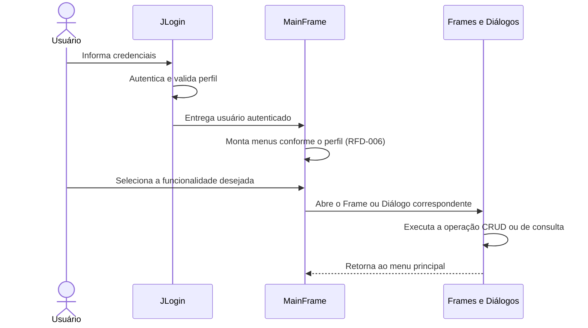

# Especificação de Requisitos Funcionais — Aplicação Desktop

## SIHCP — Sistema de Histórico e Coleta Patrimonial

**Versão do Documento:** 2.0.0
**Versão do Sistema:** 1.2.0
**Data:** Maio de 2026
**Instituição:** Instituto Federal de Educação, Ciência e Tecnologia de Mato Grosso (IFMT)
**Componente:** Aplicação Desktop (Java 21 + Swing)
**Ponto de Entrada:** `com.inventario.SistemaInventarioApplication`

---

## Sumário

1. [Introdução](#1-introdução)
2. [Visão Geral da Aplicação Desktop](#2-visão-geral-da-aplicação-desktop)
3. [Controle de Acesso por Perfil](#3-controle-de-acesso-por-perfil)
4. [Requisitos Funcionais por Módulo](#4-requisitos-funcionais-por-módulo)
5. [Cenários de Validação](#5-cenários-de-validação)
6. [Riscos e Mitigações](#6-riscos-e-mitigações)
7. [Matriz de Rastreabilidade](#7-matriz-de-rastreabilidade)
8. [Apêndice A — Glossário de Termos](#apêndice-a--glossário-de-termos)
9. [Apêndice B — Histórico de Revisões](#apêndice-b--histórico-de-revisões)
10. [Apêndice C — Referências Cruzadas](#apêndice-c--referências-cruzadas)

---

## 1. Introdução

### 1.1 Propósito

Este documento especifica, em caráter formal e institucional, os **requisitos funcionais** da Aplicação Desktop do Sistema de Histórico e Coleta Patrimonial (SIHCP), desenvolvido para o Instituto Federal de Mato Grosso (IFMT). Tem por finalidade servir como referência técnica para as equipes de desenvolvimento, manutenção, homologação e auditoria, bem como subsidiar processos de verificação de conformidade com a legislação federal aplicável à gestão patrimonial pública.

A aplicação desktop constitui a **interface administrativa central** do ecossistema SIHCP, atendendo aos perfis gestores e operacionais responsáveis pela condução integral do processo de inventário patrimonial, desde o planejamento até a prestação de contas.

### 1.2 Escopo

O escopo deste documento compreende exclusivamente a **Aplicação Desktop**, construída em Java 21 com interface gráfica Swing e acesso direto ao banco de dados PostgreSQL (com capacidade de operação em modo offline via SQLite). Estão abrangidos:

- Gestão administrativa de usuários, patrimônios, salas, setores, campus e responsáveis;
- Gestão do ciclo de vida de inventários (planejamento, execução e encerramento);
- Registro de coletas patrimoniais diretamente pela aplicação desktop;
- Importação de dados externos (SUAP, Excel, CSV);
- Exportação de relatórios e dados no padrão SIADS;
- Geração e impressão de etiquetas com QR Code;
- Dashboard, gráficos e painéis analíticos (*Analytics*);
- Gerenciamento e monitoramento do servidor da API Mobile;
- Operação em modo offline com sincronização bidirecional.

**Não fazem parte deste documento:** os requisitos do Servidor Mobile (vide `REQUISITOS_FUNCIONAIS_SERVIDOR_MOBILE.md`) nem os do aplicativo Android. Requisitos não funcionais estão especificados em `REQUISITOS_NAO_FUNCIONAIS_DESKTOP.md`.

### 1.3 Definições e Acrônimos

| Termo / Sigla | Definição |
|---------------|-----------|
| **RFD** | Requisito Funcional da aplicação Desktop |
| **CRUD** | Operações de *Create*, *Read*, *Update* e *Delete* |
| **QR Code** | *Quick Response Code* — código de barras bidimensional |
| **SIADS** | Sistema Integrado de Administração de Serviços (Governo Federal) |
| **SUAP** | Sistema Unificado de Administração Pública do IFMT |
| **TCU** | Tribunal de Contas da União |
| **IN** | Instrução Normativa |
| **MVVM** | *Model-View-ViewModel*, padrão arquitetural adotado em módulos refatorados |
| **JPA / DAO** | *Java Persistence API* / *Data Access Object* |
| **Fat JAR** | Empacotamento Java contendo todas as dependências em um único arquivo |

### 1.4 Classificação de Prioridades

Todos os requisitos deste documento estão classificados segundo a criticidade para o funcionamento do sistema:

| Prioridade | Descrição |
|------------|-----------|
| **Essencial** | Requisito indispensável. A ausência inviabiliza o funcionamento do módulo ou compromete obrigações legais e operacionais do inventário. |
| **Importante** | Requisito necessário para a operação plena. O sistema funciona sem ele, porém com perda significativa de produtividade, de rastreabilidade ou de conformidade. |
| **Desejável** | Requisito que agrega valor operacional, analítico ou ergonômico. Não é crítico para o fluxo principal. |

### 1.5 Convenções de Identificação

Cada requisito possui identificador único no formato **`RFD-XXX`**, onde:

- **RFD** = *Requisito Funcional Desktop*;
- **XXX** = número sequencial de três dígitos, atribuído por ordem histórica de especificação.

Os identificadores são imutáveis e não são reutilizados, preservando a rastreabilidade entre versões deste documento.

---

## 2. Visão Geral da Aplicação Desktop

A aplicação desktop organiza suas funcionalidades em menus hierárquicos, com visibilidade condicional conforme o perfil do usuário autenticado. O diagrama a seguir apresenta a estrutura geral de navegação:

```mermaid
graph TD
    LOGIN["Login"] --> MAIN["MainFrame"]
    MAIN --> ADMIN["Administração<br/>(ADMIN)"]
    MAIN --> INV["Inventário"]
    MAIN --> REL["Relatórios"]
    MAIN --> DASH["Dashboard"]
    MAIN --> ANALYTICS["Analytics<br/>(ADMIN/GESTOR)"]
    MAIN --> SISTEMA["Sistema"]

    ADMIN --> USUARIOS["Usuários"]
    ADMIN --> CONFIG_DB["Configuração de Banco"]

    INV --> INVENTARIOS["Gerenciar Inventários"]
    INV --> SALAS["Salas"]
    INV --> SETORES["Setores"]
    INV --> CAMPUS["Campus"]
    INV --> RESPONSAVEIS["Responsáveis"]
    INV --> PATRIMONIO["Patrimônios"]
    INV --> ITENS_COMP["Itens Compostos"]
    INV --> COLETA["Coleta de Dados"]
    INV --> FOTOS_REF["Fotos de Referência"]
    INV --> IMPORTAR["Importar SUAP"]
    INV --> RECONCILIACAO["Reconciliação"]

    REL --> REL_INV["Relatório de Inventário"]
    REL --> REL_DIV["Relatório de Divergências"]
    REL --> REL_COMP["Relatório de Itens Compostos"]
    REL --> SIADS["Exportar SIADS"]

    DASH --> DASH_COLETA["Dashboard de Coleta"]
    DASH --> STATUS_SALAS["Status das Salas"]
    DASH --> CONSULTA["Consultar Coleta"]

    ANALYTICS --> KPI["Dashboard de KPIs"]
    ANALYTICS --> DIV_ANALYTICS["Análise de Divergências"]
    ANALYTICS --> METRICAS["Métricas de Tempo"]

    SISTEMA --> OFFLINE["Modo Offline"]
    SISTEMA --> MOBILE_SRV["Servidor Mobile"]

    style MAIN fill:#4CAF50,color:#fff
    style ADMIN fill:#F44336,color:#fff
    style ANALYTICS fill:#9C27B0,color:#fff
```

---

## 3. Controle de Acesso por Perfil

A aplicação desktop implementa controle de acesso baseado em papéis (*Role-Based Access Control* — RBAC), com quatro perfis hierárquicos:

| Perfil | Abrangência de Acesso | Uso Típico |
|--------|----------------------|-----------|
| **ADMIN** | Acesso integral a todos os menus, incluindo Administração, Analytics e Sistema | Responsável técnico e gestor do patrimônio |
| **GESTOR** | Inventário, Relatórios, Dashboard e Analytics | Coordenação, supervisão e fiscalização |
| **COLETOR** | Inventário, Relatórios e Dashboard (sem Analytics e Administração) | Equipe de campo operando também pelo desktop |
| **CONSULTA** | Somente Dashboard (visualização) | Auditores externos e consulta pública interna |

A visibilidade dos menus é definida dinamicamente em `MainFrame` no momento da autenticação, com base no atributo *perfil* do usuário retornado por `AutenticacaoService`.

---

## 4. Requisitos Funcionais por Módulo

### 4.1 Módulo de Autenticação e Sessão

| ID | Requisito | Descrição | Prioridade | Tela / Componente | Status |
|----|-----------|-----------|------------|-------------------|--------|
| **RFD-001** | Login com usuário e senha | O sistema deve autenticar o usuário mediante *login* e senha, consultando o banco configurado e validando credenciais via hash BCrypt | Essencial | `JLogin` | ✅ Implementado |
| **RFD-002** | Instância única do sistema | O sistema deve impedir a execução simultânea de mais de uma instância por máquina, mediante *file lock* no sistema operacional | Essencial | `SingleInstanceManager` | ✅ Implementado |
| **RFD-003** | Configuração de banco na tela de login | O sistema deve permitir alternar o *host*, a porta, o banco, o usuário e a senha da conexão diretamente a partir do diálogo de *login* | Essencial | `ConfiguracaoBancoDialog` | ✅ Implementado |
| **RFD-004** | Alteração de senha do próprio usuário | O sistema deve permitir que o usuário autenticado altere sua senha mediante informação da senha atual e confirmação da nova | Importante | `AlterarSenhaDialog` | ✅ Implementado |
| **RFD-005** | *Logout* com retorno à tela de *login* | O sistema deve encerrar a sessão ativa, descartando o usuário em memória e reapresentando a tela de autenticação | Essencial | `MainFrame` | ✅ Implementado |
| **RFD-006** | Controle de acesso por perfil | O sistema deve habilitar ou ocultar dinamicamente os menus da janela principal com base no perfil do usuário autenticado | Essencial | `MainFrame` | ✅ Implementado |

**Critérios de aceitação do módulo:**
- Tentativas de acesso com credenciais inválidas devem exibir mensagem genérica, sem revelar se o *login* existe;
- Após cinco tentativas inválidas consecutivas em 30 minutos, o usuário deve ser bloqueado temporariamente (vide RF009 do documento integrado);
- A execução de uma segunda instância deve encerrar-se de forma silenciosa, trazendo ao primeiro plano a instância ativa.

**Referências:** RF001, RF005, RF006, RF007, RF010 do documento `REQUISITOS_FUNCIONAIS_NAO_FUNCIONAIS.md`.

---

### 4.2 Módulo de Gestão de Usuários (Perfil ADMIN)

| ID | Requisito | Descrição | Prioridade | Tela / Componente | Status |
|----|-----------|-----------|------------|-------------------|--------|
| **RFD-007** | Listar usuários | O sistema deve apresentar a relação de usuários cadastrados, com paginação e indicação de perfil e situação | Essencial | `UsuarioFrame` | ✅ Implementado |
| **RFD-008** | Cadastrar usuário com perfil | O sistema deve permitir o cadastro de novo usuário, atribuindo perfil, *login*, nome completo, e-mail e senha inicial | Essencial | `UsuarioFormDialog` | ✅ Implementado |
| **RFD-009** | Editar usuário | O sistema deve permitir a edição de dados cadastrais do usuário, preservando o histórico de alterações | Essencial | `UsuarioFormDialog` | ✅ Implementado |
| **RFD-010** | Ativar e desativar usuário | O sistema deve permitir a inativação lógica do usuário, impedindo novos *logins* sem exclusão dos registros históricos | Importante | `UsuarioFrame` | ✅ Implementado |
| **RFD-011** | Redefinir senha de usuário | O sistema deve permitir ao administrador redefinir a senha do usuário, forçando alteração no próximo acesso | Importante | `UsuarioFrame` | ✅ Implementado |
| **RFD-012** | Atribuir perfil hierárquico | O sistema deve permitir atribuir um dos perfis previstos: ADMIN, GESTOR, COLETOR ou CONSULTA | Essencial | `UsuarioFormDialog` | ✅ Implementado |

**Critérios de aceitação:** Somente perfis ADMIN podem acessar o módulo; senhas devem ser armazenadas com *hash* BCrypt; a desativação não deve remover fisicamente o registro, preservando a rastreabilidade de coletas e auditorias.

**Referências:** RF005, RF006, RF010, RN036–RN040 do documento integrado.

---

### 4.3 Módulo de Gestão de Patrimônios

| ID | Requisito | Descrição | Prioridade | Tela / Componente | Status |
|----|-----------|-----------|------------|-------------------|--------|
| **RFD-013** | Listar patrimônios com paginação | O sistema deve apresentar a listagem de patrimônios com paginação e ordenação por coluna | Essencial | `PatrimonioFrame` | ✅ Implementado |
| **RFD-014** | Cadastrar patrimônio | O sistema deve permitir o cadastro de novo patrimônio com todos os atributos obrigatórios (número, descrição, sala, responsável, estado, valor) | Essencial | `PatrimonioFormDialog` | ✅ Implementado |
| **RFD-015** | Editar patrimônio | O sistema deve permitir a edição dos dados cadastrais com registro de histórico | Essencial | `PatrimonioFormDialog` | ✅ Implementado |
| **RFD-016** | Excluir patrimônio (exclusão lógica) | O sistema deve permitir a inativação do patrimônio, sem exclusão física, preservando os vínculos históricos | Importante | `PatrimonioFrame` | ✅ Implementado |
| **RFD-017** | Busca textual livre | O sistema deve permitir busca por número, descrição ou sala, com resposta inferior a 500 ms | Essencial | `PatrimonioFrame` | ✅ Implementado |
| **RFD-018** | Filtros combinados | O sistema deve permitir filtrar por *status*, sala, setor e responsável, de forma combinada | Importante | `PatrimonioFrame` | ✅ Implementado |
| **RFD-019** | Gerar QR Code do patrimônio | O sistema deve gerar QR Code individual para cada patrimônio, com dados codificados em padrão previamente definido | Essencial | `QrCodeGenerator` | ✅ Implementado |
| **RFD-020** | Imprimir etiquetas com QR Code | O sistema deve permitir a impressão de etiquetas com o QR Code, unitária ou em lote, com *preview* prévio | Importante | `ImpressaoEtiquetasDialog` | ✅ Implementado |
| **RFD-021** | Ações em lote | O sistema deve permitir a seleção múltipla de patrimônios para operações coletivas (impressão, transferência, inativação) | Importante | `AcoesPatrimonioDialog` | ✅ Implementado |
| **RFD-022** | Histórico de coletas do patrimônio | O sistema deve exibir todas as coletas realizadas para um patrimônio em diferentes inventários | Desejável | `HistoricoColetaDialog` | ✅ Implementado |
| **RFD-023** | Vincular patrimônio a sala e responsável | O sistema deve permitir associar patrimônio a uma sala e a um responsável, com validação de integridade referencial | Essencial | `PatrimonioFormDialog` | ✅ Implementado |

**Critérios de aceitação:** O número de patrimônio deve ser único no sistema (RN012); operações CRUD devem ser transacionais; a geração de QR Code deve concluir em menos de 100 ms por item (vide RNFD-007).

**Referências:** RF011–RF022 do documento integrado; RN012, RN013, RN016.

---

### 4.4 Módulo de Gestão de Itens Compostos

Patrimônios compostos (conjuntos formados por múltiplos componentes vinculados) demandam tratamento diferenciado, sobretudo para fins de coleta e baixa.

| ID | Requisito | Descrição | Prioridade | Tela / Componente | Status |
|----|-----------|-----------|------------|-------------------|--------|
| **RFD-024** | Listar itens compostos | O sistema deve apresentar a relação de conjuntos cadastrados e seus respectivos componentes | Importante | `ItemCompostoFrame` | ✅ Implementado |
| **RFD-025** | Cadastrar item composto | O sistema deve permitir o registro de novo conjunto com descrição, patrimônio principal e componentes | Importante | `ItemCompostoFrame` | ✅ Implementado |
| **RFD-026** | Adicionar componentes ao conjunto | O sistema deve permitir associar patrimônios existentes como componentes de um conjunto | Importante | `ComponenteDialog` | ✅ Implementado |
| **RFD-027** | Visualizar detalhes do conjunto | O sistema deve apresentar todos os componentes e o histórico associado ao conjunto | Importante | `DetalheItemCompostoDialog` | ✅ Implementado |
| **RFD-028** | Registrar coleta de componente individual | O sistema deve permitir registrar a coleta isolada de um componente, preservando o vínculo com o conjunto | Importante | `RegistroComponenteDialog` | ✅ Implementado |
| **RFD-029** | Coleta específica de itens compostos | O sistema deve prover fluxo próprio para coleta de conjuntos, conforme a RN025 | Essencial | `ColetaItemCompostoFrame` | ✅ Implementado |

**Critérios de aceitação:** Patrimônios compostos não devem aparecer no fluxo de coleta regular (RN025); a tentativa de coleta por via comum deve apresentar alerta explicativo ao operador.

**Referências:** RN025 do documento integrado.

---

### 4.5 Módulo de Gestão de Inventários

| ID | Requisito | Descrição | Prioridade | Tela / Componente | Status |
|----|-----------|-----------|------------|-------------------|--------|
| **RFD-030** | Listar inventários | O sistema deve apresentar a relação de inventários (passados, em andamento e planejados) com seus respectivos períodos e *status* | Essencial | `InventarioFrame` | ✅ Implementado |
| **RFD-031** | Criar inventário com período | O sistema deve permitir a criação de novo inventário informando data de início, data de fim e campus | Essencial | `InventarioFormDialog` | ✅ Implementado |
| **RFD-032** | Editar inventário | O sistema deve permitir editar dados do inventário enquanto este estiver em *status* PLANEJADO | Importante | `InventarioFormDialog` | ✅ Implementado |
| **RFD-033** | Ativar e encerrar inventário | O sistema deve permitir a transição de *status* (PLANEJADO → EM_ANDAMENTO → ENCERRADO) observando as regras de negócio aplicáveis | Essencial | `InventarioFrame` | ✅ Implementado |
| **RFD-034** | Definir escopo do inventário | O sistema deve permitir selecionar quais salas e setores integram o inventário | Essencial | `InventarioFormDialog` | ✅ Implementado |
| **RFD-035** | Cadastrar participantes | O sistema deve permitir atribuir coletores (participantes) ao inventário, com possível vinculação a salas específicas | Essencial | `InventarioFrame` | ✅ Implementado |
| **RFD-036** | Visualizar estatísticas do inventário | O sistema deve apresentar, em tempo real, o total de itens no escopo, coletados, pendentes e o percentual de conclusão | Essencial | `InventarioFrame` | ✅ Implementado |

**Critérios de aceitação:** Apenas um inventário pode estar ativo por vez em um mesmo campus (RN007); a transição para ENCERRADO deve ser irreversível e restrita a ADMIN ou GESTOR.

**Referências:** RF023–RF030, RN007–RN011.

---

### 4.6 Módulo de Coleta de Dados (pelo Desktop)

A aplicação desktop provê interface de coleta direta, utilizada em cenários em que o uso do aplicativo móvel é inviável (ex.: salas com pouca conectividade, digitação em massa de patrimônios antigos).

| ID | Requisito | Descrição | Prioridade | Tela / Componente | Status |
|----|-----------|-----------|------------|-------------------|--------|
| **RFD-037** | Registrar coleta manual | O sistema deve permitir registrar a coleta de um patrimônio mediante digitação do número | Essencial | `ColetaFrame_v2` | ✅ Implementado |
| **RFD-038** | Buscar patrimônio para coleta | O sistema deve oferecer busca por número ou descrição na janela de coleta | Essencial | `BuscaItemInventarioDialog` | ✅ Implementado |
| **RFD-039** | Registrar estado de conservação | O sistema deve permitir selecionar o estado de conservação encontrado, conforme classificação oficial | Essencial | `ColetaFrame_v2` | ✅ Implementado |
| **RFD-040** | Registrar localização encontrada | O sistema deve permitir informar a sala em que o patrimônio foi efetivamente localizado | Essencial | `ColetaFrame_v2` | ✅ Implementado |
| **RFD-041** | Registrar observações | O sistema deve permitir a inclusão de observações livres em até 500 caracteres | Importante | `ColetaFrame_v2` | ✅ Implementado |
| **RFD-042** | Consultar coleta por patrimônio | O sistema deve permitir consultar se um patrimônio específico foi coletado no inventário ativo, exibindo coletor, data e localização | Importante | `ConsultaColetaFrame` | ✅ Implementado |

**Critérios de aceitação:** A coleta só deve ser aceita quando houver inventário ativo (RN011); a detecção de divergência de localização (RN019) deve ocorrer automaticamente no ato do registro.

**Referências:** RF031–RF042, RN017–RN024.

---

### 4.7 Módulo de Cadastros Auxiliares

| ID | Requisito | Descrição | Prioridade | Tela / Componente | Status |
|----|-----------|-----------|------------|-------------------|--------|
| **RFD-043** | CRUD de Salas | O sistema deve permitir cadastrar, editar, inativar e listar salas | Essencial | `SalaFrame` + `SalaFormDialog` | ✅ Implementado |
| **RFD-044** | CRUD de Setores | O sistema deve permitir cadastrar, editar, inativar e listar setores | Essencial | `SetorFrame` + `SetorFormDialog` | ✅ Implementado |
| **RFD-045** | CRUD de Campus | O sistema deve permitir cadastrar, editar e listar campus | Importante | `CampusFrame` + `CampusFormDialog` | ✅ Implementado |
| **RFD-046** | CRUD de Responsáveis | O sistema deve permitir cadastrar, editar, inativar e listar responsáveis | Essencial | `ResponsavelFrame` + `ResponsavelFormDialog` | ✅ Implementado |
| **RFD-047** | Vincular sala a setor | O sistema deve permitir associar cada sala a um setor de localização | Essencial | `SalaFormDialog` | ✅ Implementado |
| **RFD-048** | Vincular setor a campus | O sistema deve permitir associar cada setor a um campus | Essencial | `SetorFormDialog` | ✅ Implementado |

**Critérios de aceitação:** A inativação deve preservar integridade referencial; é vedado inativar registros que possuam patrimônios ativos vinculados.

**Referências:** RF078–RF085 do documento integrado.

---

### 4.8 Módulo de Importação de Dados

A importação em massa é fundamental para carga inicial e para sincronização com o SUAP (fonte autoritativa de dados patrimoniais do IFMT).

| ID | Requisito | Descrição | Prioridade | Tela / Componente | Status |
|----|-----------|-----------|------------|-------------------|--------|
| **RFD-049** | Importar Excel do SUAP | O sistema deve permitir importar planilha Excel exportada do SUAP, com validação de cabeçalhos | Importante | `ImportacaoCSVFrame` | ✅ Implementado |
| **RFD-050** | Importar arquivo CSV | O sistema deve permitir importar arquivo CSV em formato padronizado, com escolha de *encoding* e delimitador | Importante | `ImportacaoCSVFrame` | ✅ Implementado |
| **RFD-051** | Validação de dados na importação | O sistema deve validar cada linha antes da persistência, reportando erros com número de linha e coluna | Essencial | `DataImportService` | ✅ Implementado |
| **RFD-052** | Log de erros da importação | O sistema deve gerar relatório de erros exportável em formato de texto | Importante | `ImportacaoCSVFrame` | ✅ Implementado |
| **RFD-053** | Cancelamento de importação em andamento | O sistema deve permitir ao usuário cancelar importação em progresso, sem corromper os dados já persistidos | Importante | `ImportacaoCSVFrame` | ✅ Implementado |
| **RFD-054** | Importar dados para modo offline | O sistema deve permitir carregar os dados necessários para operação offline no SQLite local | Essencial | `ImportacaoDadosDialog` | ✅ Implementado |

**Critérios de aceitação:** Arquivos com até 10.000 linhas devem ser processados em menos de 60 segundos (RNFD-005); o cancelamento deve ser atômico ao nível da transação.

**Referências:** RF016, RF017, RF018, RN012 do documento integrado.

---

### 4.9 Módulo de Relatórios

| ID | Requisito | Descrição | Prioridade | Tela / Componente | Status |
|----|-----------|-----------|------------|-------------------|--------|
| **RFD-055** | Relatório de inventário | O sistema deve gerar relatório consolidado com itens encontrados, pendentes e divergentes, organizado por sala ou responsável | Essencial | `RelatorioFrame` | ✅ Implementado |
| **RFD-056** | Relatório de divergências | O sistema deve gerar relatório específico dos patrimônios cuja localização encontrada difere da cadastrada | Essencial | `RelatorioDivergenciasFrame` | ✅ Implementado |
| **RFD-057** | Relatório de itens compostos | O sistema deve gerar relatório dos conjuntos e do *status* de cada componente | Importante | `RelatorioItensCompostosFrame` | ✅ Implementado |
| **RFD-058** | Exportar relatório em PDF | O sistema deve exportar qualquer relatório em PDF, com cabeçalho institucional | Essencial | `RelatorioPDFGenerator` | ✅ Implementado |
| **RFD-059** | Exportar relatório em Excel | O sistema deve exportar relatórios em formato XLSX, com formatação tabular | Essencial | `RelatorioExcelGenerator` | ✅ Implementado |
| **RFD-060** | Exportar relatório em CSV | O sistema deve exportar relatórios em CSV, para processamento externo | Importante | `CsvExcelGenerator` | ✅ Implementado |
| **RFD-061** | Filtros combinados de relatório | O sistema deve permitir filtrar por período, setor, sala e responsável de forma combinada | Importante | `RelatorioFrame` | ✅ Implementado |
| **RFD-062** | Resumo executivo | O sistema deve apresentar, nos relatórios, um resumo executivo com KPIs consolidados | Importante | `RelatorioFrame` | ✅ Implementado |
| **RFD-063** | Exportar no formato SIADS | O sistema deve gerar arquivo compatível com o padrão SIADS para prestação de contas | Essencial | `SiadsExportDialog` | ✅ Implementado |

**Critérios de aceitação:** Relatórios em PDF com até 1.000 páginas devem ser gerados em menos de 30 segundos (RNFD-004); exportações SIADS devem estar em conformidade com as especificações federais vigentes.

**Referências:** RF059–RF069; RNF069–RNF072 do documento integrado.

---

### 4.10 Módulo de Dashboard e Visualização

| ID | Requisito | Descrição | Prioridade | Tela / Componente | Status |
|----|-----------|-----------|------------|-------------------|--------|
| **RFD-064** | Dashboard de coleta | O sistema deve apresentar painel com KPIs do inventário ativo: total, coletados, pendentes e percentual | Essencial | `DashboardColetaFrame` | ✅ Implementado |
| **RFD-065** | Status das salas | O sistema deve apresentar o progresso de coleta por sala, com realce visual de pendências | Importante | `StatusSalasFrame` | ✅ Implementado |
| **RFD-066** | Consulta de coleta por patrimônio | O sistema deve permitir consulta direta do *status* de coleta de um patrimônio | Importante | `ConsultaColetaFrame` | ✅ Implementado |
| **RFD-067** | Gráficos de evolução | O sistema deve apresentar gráfico temporal da evolução de coletas | Importante | `InventarioChartFactory` | ✅ Implementado |
| **RFD-068** | Gráficos por setor e sala | O sistema deve apresentar gráficos agrupados por setor e por sala | Importante | `InventarioChartService` | ✅ Implementado |

**Critérios de aceitação:** Atualização dos painéis deve ocorrer automaticamente a cada 30 segundos, ou sob demanda do usuário; gráficos devem ser exportáveis como imagem.

**Referências:** RF070–RF077.

---

### 4.11 Módulo de *Analytics* (ADMIN e GESTOR)

Módulo destinado à gestão estratégica, com painéis de indicadores avançados.

| ID | Requisito | Descrição | Prioridade | Tela / Componente | Status |
|----|-----------|-----------|------------|-------------------|--------|
| **RFD-069** | Dashboard de KPIs | O sistema deve apresentar painel consolidado com indicadores-chave de desempenho do processo de inventário | Importante | `AnalyticsDashboardFrame` | ✅ Implementado |
| **RFD-070** | Análise de divergências | O sistema deve apresentar análise qualitativa e quantitativa das divergências detectadas | Importante | `DivergenciasAnalyticsFrame` | ✅ Implementado |
| **RFD-071** | Métricas de tempo de coleta | O sistema deve apresentar tempo médio, mínimo e máximo de coleta por coletor e por sala | Desejável | `MetricasTempoAnalyticsFrame` | ✅ Implementado |
| **RFD-072** | Cartões de KPI com indicadores visuais | O sistema deve utilizar *cards* com indicadores de tendência (↑ ↓ =) para destacar desvios | Desejável | `KPICard` | ✅ Implementado |

**Critérios de aceitação:** Indicadores devem ser calculados sobre o inventário selecionado; usuários CONSULTA e COLETOR não devem ter acesso a este módulo.

**Referências:** RF076, RF077.

---

### 4.12 Módulo de Fotos de Referência

| ID | Requisito | Descrição | Prioridade | Tela / Componente | Status |
|----|-----------|-----------|------------|-------------------|--------|
| **RFD-073** | Gerenciar fotos por descrição | O sistema deve permitir associar uma foto de referência a cada descrição de patrimônio | Desejável | `FotoReferenciaFrame` | ✅ Implementado |
| **RFD-074** | Carregar foto para descrição | O sistema deve permitir o *upload* de imagem (JPEG ou PNG) com limite de 5 MB | Desejável | `FotoReferenciaFrame` | ✅ Implementado |
| **RFD-075** | Visualizar foto de referência | O sistema deve exibir a foto em janela ampliada quando solicitado | Desejável | `FotoReferenciaFrame` | ✅ Implementado |

**Critérios de aceitação:** Fotos de referência são utilizadas pelo aplicativo móvel para auxiliar coletores (vide RF095).

**Referências:** RF095 do documento integrado.

---

### 4.13 Módulo de Reconciliação

A reconciliação é o processo de correspondência entre itens cadastrados e não encontrados, com itens fisicamente localizados sem etiqueta de identificação.

| ID | Requisito | Descrição | Prioridade | Tela / Componente | Status |
|----|-----------|-----------|------------|-------------------|--------|
| **RFD-076** | Correspondência manual de itens | O sistema deve permitir relacionar manualmente itens não encontrados com itens sem etiqueta | Importante | `ReconciliacaoFrame` | ✅ Implementado |
| **RFD-077** | Sugerir correspondências automaticamente | O sistema deve sugerir correspondências por similaridade de descrição e localização | Importante | `ReconciliacaoFrame` | ✅ Implementado |
| **RFD-078** | Confirmar ou rejeitar correspondência | O sistema deve registrar a decisão do operador, com *log* de auditoria | Importante | `ReconciliacaoFrame` | ✅ Implementado |

**Critérios de aceitação:** Cada decisão deve ser logada com usuário, data e justificativa (quando rejeitada); as sugestões devem utilizar algoritmo de similaridade com limiar configurável.

**Referências:** RF033, RF064, RN020.

---

### 4.14 Módulo de Impressão de Etiquetas

| ID | Requisito | Descrição | Prioridade | Tela / Componente | Status |
|----|-----------|-----------|------------|-------------------|--------|
| **RFD-079** | Gerar etiquetas com QR Code | O sistema deve gerar etiquetas com QR Code legível, número e descrição reduzida | Essencial | `EtiquetaGenerator` | ✅ Implementado |
| **RFD-080** | Imprimir em impressora térmica | O sistema deve suportar impressão em impressoras térmicas padrão ESC/POS | Importante | `ImpressoraTermicaService` | ✅ Implementado |
| **RFD-081** | Configurar *layout* de etiqueta | O sistema deve permitir configurar o tamanho, margens e conteúdo da etiqueta | Importante | `EtiquetaConfig` | ✅ Implementado |
| **RFD-082** | Impressão em lote | O sistema deve permitir imprimir etiquetas para múltiplos patrimônios em uma única operação | Importante | `ImpressaoEtiquetasDialog` | ✅ Implementado |

**Critérios de aceitação:** Os QR Codes devem ser legíveis por câmera de dispositivo Android mesmo após impressão térmica a 203 DPI; o *layout* deve preservar as dimensões configuradas independentemente da impressora.

**Referências:** RF020, RF021.

---

### 4.15 Módulo de Gerenciamento do Servidor Mobile

| ID | Requisito | Descrição | Prioridade | Tela / Componente | Status |
|----|-----------|-----------|------------|-------------------|--------|
| **RFD-083** | Iniciar servidor da API Mobile | O sistema deve permitir iniciar o servidor Spring Boot a partir de um controle no desktop | Essencial | `MobileServerPanel` | ✅ Implementado |
| **RFD-084** | Parar servidor da API Mobile | O sistema deve permitir parar o servidor de forma controlada (*graceful shutdown*) | Essencial | `MobileServerPanel` | ✅ Implementado |
| **RFD-085** | Monitorar *status* do servidor | O sistema deve exibir indicadores de estado (em execução, parado, com falha) | Essencial | `MobileServerPanel` | ✅ Implementado |
| **RFD-086** | Monitorar dispositivos conectados | O sistema deve apresentar a relação de dispositivos móveis autenticados, com IP e última atividade | Importante | `MobileMonitorFrameV2` | ✅ Implementado |
| **RFD-087** | Visualizar requisições em tempo real | O sistema deve apresentar as requisições recentes com *endpoint*, método, dispositivo e tempo de resposta | Importante | `MobileMonitorFrameV2` | ✅ Implementado |
| **RFD-088** | Desconectar dispositivo | O sistema deve permitir a desconexão forçada de um dispositivo específico | Importante | `MobileMonitorFrameV2` | ✅ Implementado |

**Critérios de aceitação:** A inicialização do servidor deve concluir em até 30 segundos; a desconexão forçada deve invalidar o *token* ativo do dispositivo.

**Referências:** RF086–RF091 do documento integrado.

---

### 4.16 Módulo de Operação em Modo Offline

| ID | Requisito | Descrição | Prioridade | Tela / Componente | Status |
|----|-----------|-----------|------------|-------------------|--------|
| **RFD-089** | Detectar perda de conexão | O sistema deve detectar automaticamente a indisponibilidade do banco PostgreSQL | Essencial | `ConnectivityManager` | ✅ Implementado |
| **RFD-090** | Alternar para modo offline (SQLite) | O sistema deve alternar, de forma transparente, para o banco local SQLite quando em modo offline | Essencial | `OfflineManager` | ✅ Implementado |
| **RFD-091** | Sincronizar PostgreSQL para SQLite | O sistema deve sincronizar os dados necessários do banco central para o banco local | Essencial | `SyncPostgresToSQLiteV2` | ✅ Implementado |
| **RFD-092** | Forçar modo offline manualmente | O sistema deve permitir ao usuário forçar o modo offline mesmo com conexão ativa | Importante | `MainFrame` | ✅ Implementado |
| **RFD-093** | Tentar reconectar ao banco online | O sistema deve permitir ao usuário tentar o retorno ao modo online mediante solicitação explícita | Importante | `MainFrame` | ✅ Implementado |
| **RFD-094** | Indicador visual de *status* de conexão | O sistema deve exibir indicador permanente na barra de *status* (Online / Offline / Reconectando) | Essencial | `StatusBarPanel` | ✅ Implementado |

**Critérios de aceitação:** A alternância de modo deve ser transparente para o usuário, preservando o estado da tela ativa; a sincronização para SQLite deve preservar a integridade referencial; a reconciliação deve ocorrer automaticamente ao retornar ao modo online.

**Referências:** RF048, RF049, RF058.

---

### 4.17 Módulo de Configuração

| ID | Requisito | Descrição | Prioridade | Tela / Componente | Status |
|----|-----------|-----------|------------|-------------------|--------|
| **RFD-095** | Configurar conexão com o banco | O sistema deve permitir a configuração de *host*, porta, banco, usuário e senha | Essencial | `ConfiguracaoBancoDialog` | ✅ Implementado |
| **RFD-096** | Testar conexão com o banco | O sistema deve permitir testar a conectividade antes de salvar a configuração | Essencial | `ConfiguracaoBancoDialog` | ✅ Implementado |
| **RFD-097** | Persistir configuração em arquivo JSON | O sistema deve salvar a configuração em arquivo no diretório do usuário, com criptografia da senha | Essencial | `DatabaseConfigManager` | ✅ Implementado |
| **RFD-098** | Status do sistema | O sistema deve apresentar informações de uso de memória, número de conexões ativas e versão | Desejável | `MainFrame` | ✅ Implementado |

**Critérios de aceitação:** A senha no arquivo JSON deve estar cifrada; o teste de conexão não deve persistir credenciais em caso de falha; o arquivo JSON deve ficar em `~/.sihcp/configuracao_banco.json`.

**Referências:** RNF044, RNF055 do documento integrado.

---

## 5. Cenários de Validação

Esta seção descreve cenários principais de validação funcional, com fluxos esperados em condições normais e alternativas.

### 5.1 Cenário: Execução de Inventário Completo

**Pré-condições:** Usuário ADMIN autenticado; banco PostgreSQL disponível; dados do SUAP previamente importados.

**Fluxo principal:**
1. ADMIN acessa o menu Inventário → Gerenciar Inventários e cria um novo inventário (RFD-031);
2. Define o escopo de salas e setores (RFD-034) e os participantes (RFD-035);
3. Ativa o inventário, alterando o *status* para EM_ANDAMENTO (RFD-033);
4. O servidor mobile passa a disponibilizar este inventário como *ativo* para os coletores;
5. Durante o período, acompanha o progresso pelo Dashboard (RFD-064) e Status das Salas (RFD-065);
6. Ao término, executa reconciliação dos itens sem etiqueta (RFD-076 a RFD-078);
7. Gera relatórios finais em PDF (RFD-055, RFD-058) e exporta para SIADS (RFD-063);
8. Encerra o inventário (RFD-033), alterando o *status* para ENCERRADO.

**Critério de sucesso:** Inventário encerrado com 100% dos itens classificados (encontrados, pendentes ou justificados), com trilha de auditoria completa.

### 5.2 Cenário: Falha de Conexão durante Operação

**Pré-condições:** Aplicação em execução com conexão ao PostgreSQL; banco de contingência SQLite sincronizado.

**Fluxo principal:**
1. Ocorre queda de conexão com o PostgreSQL;
2. `ConnectivityManager` detecta a falha em até 10 segundos (RFD-089);
3. Sistema alterna automaticamente para o banco SQLite local (RFD-090);
4. Indicador na barra de *status* passa de *Online* para *Offline* (RFD-094);
5. Usuário prossegue com a operação utilizando os dados locais;
6. Quando a conexão é restabelecida, o sistema oferece a opção de reconectar (RFD-093);
7. Ao reconectar, os dados locais são sincronizados para o PostgreSQL.

**Critério de sucesso:** Nenhum dado é perdido na transição; o usuário é informado do estado de operação a todo momento.

### 5.3 Cenário: Importação Inicial de Dados do SUAP

**Pré-condições:** Arquivo Excel exportado do SUAP disponível; ADMIN autenticado.

**Fluxo principal:**
1. ADMIN acessa Inventário → Importar SUAP (RFD-049);
2. Seleciona o arquivo Excel e confirma;
3. Sistema valida cabeçalhos, formatos e integridade (RFD-051);
4. Exibe relatório prévio com total de linhas válidas e inválidas;
5. ADMIN confirma a importação;
6. Linhas válidas são persistidas em lotes transacionais;
7. Ao término, sistema exibe total importado e oferece *download* do *log* de erros (RFD-052).

**Critério de sucesso:** Arquivos com até 10.000 linhas são importados em menos de 60 segundos (RNFD-005); zero inserções duplicadas por número de patrimônio (RN012).

### 5.4 Cenário: Geração de Etiquetas em Lote

**Pré-condições:** Patrimônios cadastrados sem etiqueta; impressora térmica configurada.

**Fluxo principal:**
1. Usuário acessa `PatrimonioFrame` e filtra patrimônios sem etiqueta (RFD-018);
2. Seleciona múltiplos itens e aciona a ação "Imprimir etiquetas" (RFD-021);
3. Sistema abre `ImpressaoEtiquetasDialog` exibindo *preview*;
4. Usuário confirma o envio para a impressora térmica (RFD-082);
5. Sistema gera QR Codes (RFD-019) e formata conforme o *layout* configurado (RFD-081);
6. Etiquetas são impressas sequencialmente.

**Critério de sucesso:** Todas as etiquetas devem ser legíveis por câmera Android; geração de QR Code inferior a 100 ms por item (RNFD-007).

---

## 6. Riscos e Mitigações

| Risco | Impacto | Probabilidade | Mitigação |
|-------|---------|---------------|-----------|
| Perda de conexão com o banco durante operação crítica | Alto | Média | Modo offline com SQLite (RFD-089 a RFD-094); sincronização bidirecional |
| Corrupção do banco local SQLite | Alto | Baixa | *Backups* periódicos do arquivo; *checksums* de integridade no *startup* |
| Inconsistência entre dados SUAP e SIHCP | Médio | Alta | Validação na importação (RFD-051); relatório de erros detalhado |
| Acesso indevido a funcionalidades administrativas | Alto | Baixa | Controle RBAC rígido (RFD-006); menus condicionais; auditoria de acessos |
| Execução simultânea de múltiplas instâncias gerando conflitos | Médio | Média | `SingleInstanceManager` com *file lock* (RFD-002) |
| Importação cancelada deixando dados parcialmente inseridos | Médio | Baixa | Transações atômicas com *rollback* automático (RFD-053) |
| Incompatibilidade de formato SIADS após atualização federal | Alto | Média | Monitoramento das especificações federais; módulo `SiadsExportService` parametrizável |
| Impressoras térmicas com *drivers* incompatíveis | Médio | Média | Suporte nativo ao padrão ESC/POS; testes em múltiplos modelos |
| Falhas na reconciliação automática de itens sem etiqueta | Médio | Média | Sugestões por similaridade com limiar configurável; confirmação humana obrigatória (RFD-078) |

---

## 7. Matriz de Rastreabilidade

### 7.1 Distribuição por Módulo

| Módulo | Intervalo de IDs | Quantidade |
|--------|------------------|-----------|
| Autenticação e Sessão | RFD-001 a RFD-006 | 6 |
| Gestão de Usuários | RFD-007 a RFD-012 | 6 |
| Gestão de Patrimônios | RFD-013 a RFD-023 | 11 |
| Itens Compostos | RFD-024 a RFD-029 | 6 |
| Gestão de Inventários | RFD-030 a RFD-036 | 7 |
| Coleta de Dados (Desktop) | RFD-037 a RFD-042 | 6 |
| Cadastros Auxiliares | RFD-043 a RFD-048 | 6 |
| Importação de Dados | RFD-049 a RFD-054 | 6 |
| Relatórios | RFD-055 a RFD-063 | 9 |
| Dashboard e Visualização | RFD-064 a RFD-068 | 5 |
| *Analytics* | RFD-069 a RFD-072 | 4 |
| Fotos de Referência | RFD-073 a RFD-075 | 3 |
| Reconciliação | RFD-076 a RFD-078 | 3 |
| Impressão de Etiquetas | RFD-079 a RFD-082 | 4 |
| Servidor Mobile | RFD-083 a RFD-088 | 6 |
| Modo Offline | RFD-089 a RFD-094 | 6 |
| Configuração | RFD-095 a RFD-098 | 4 |
| **Total** | | **98** |

### 7.2 Cobertura de Implementação

| Situação | Quantidade | Percentual |
|----------|-----------|-----------|
| Implementado | 98 | 100% |
| Em desenvolvimento | 0 | 0% |
| Planejado | 0 | 0% |

### 7.3 Distribuição por Prioridade

| Prioridade | Quantidade | Percentual |
|------------|-----------|-----------|
| Essencial | 48 | 49% |
| Importante | 42 | 43% |
| Desejável | 8 | 8% |

---

## Apêndice A — Glossário de Termos

| Termo | Definição |
|-------|-----------|
| **Patrimônio** | Bem móvel pertencente à instituição, identificado por número de tombamento |
| **Tombamento** | Registro oficial de um bem no acervo patrimonial da instituição |
| **Inventário** | Levantamento físico periódico dos bens patrimoniais |
| **Coleta** | Registro da verificação física de um patrimônio durante o inventário |
| **Divergência** | Diferença entre a localização cadastrada e a localização encontrada |
| **Item Composto** | Conjunto formado por vários componentes tratados como unidade patrimonial |
| **Reconciliação** | Processo de correspondência entre itens pendentes e itens sem etiqueta localizados |
| **Modo Offline** | Operação com banco SQLite local, ativada quando o PostgreSQL não está disponível |
| **QR Code** | Código de barras bidimensional utilizado para identificação rápida |
| **SIADS** | Sistema Integrado de Administração de Serviços (padrão federal) |
| **SUAP** | Sistema Unificado de Administração Pública (IFMT) |
| **Fat JAR** | Arquivo `.jar` autocontido com todas as dependências Java |

---

## Apêndice B — Histórico de Revisões

| Versão | Data | Autor | Descrição |
|--------|------|-------|-----------|
| 1.0.0 | Mai/2026 | Equipe IFMT | Versão inicial com 98 requisitos funcionais organizados em 17 módulos |
| 2.0.0 | Mai/2026 | Equipe IFMT | Reescrita com formalidade institucional: introdução, propósito e escopo, prioridades explícitas, critérios de aceitação, referências cruzadas com o documento integrado, cenários de validação, riscos e mitigações, glossário formal e acentuação completa em português |

---

## Apêndice C — Referências Cruzadas

### C.1 Documentos Relacionados

| Documento | Escopo |
|-----------|--------|
| `REQUISITOS_FUNCIONAIS_NAO_FUNCIONAIS.md` | Especificação consolidada do ecossistema SIHCP (RFs e RNFs) |
| `REQUISITOS_NAO_FUNCIONAIS_DESKTOP.md` | Requisitos não funcionais da aplicação desktop |
| `REQUISITOS_FUNCIONAIS_SERVIDOR_MOBILE.md` | Requisitos funcionais da API mobile |
| `REQUISITOS_NAO_FUNCIONAIS_SERVIDOR_MOBILE.md` | Requisitos não funcionais da API mobile |
| `ADEQUACAO_NORMAS_FEDERAIS.md` | Conformidade com a legislação federal aplicável |
| `ARQUITETURA_RECONCILIACAO.md` | Arquitetura do módulo de reconciliação |

### C.2 Mapeamento com Requisitos do Documento Integrado

| RFD Desktop | RF Integrado Correspondente |
|-------------|------------------------------|
| RFD-001, RFD-004, RFD-005 | RF001, RF007, RF010 |
| RFD-006 | RF005, RF006 |
| RFD-007 a RFD-012 | RF081 (CRUD de Usuários) |
| RFD-013 a RFD-023 | RF011 a RF022 |
| RFD-030 a RFD-036 | RF023 a RF030 |
| RFD-037 a RFD-042 | RF032, RF034 a RF037, RF041 |
| RFD-043 a RFD-048 | RF078 a RF085 |
| RFD-049 a RFD-054 | RF016 a RF018, RF058 |
| RFD-055 a RFD-063 | RF059 a RF069 |
| RFD-064 a RFD-068 | RF070, RF072, RF073, RF075 |
| RFD-069 a RFD-072 | RF076, RF077 |
| RFD-079 a RFD-082 | RF020, RF021 |
| RFD-083 a RFD-088 | RF086 a RF091 |
| RFD-089 a RFD-094 | RF048, RF049, RF058 |

---

## Diagrama de Navegação Principal

---

**Fim do documento.**

**Versão do documento:** 2.0.0
**Versão do sistema:** 1.2.0
**Data:** Maio de 2026
**Instituição:** Instituto Federal de Educação, Ciência e Tecnologia de Mato Grosso (IFMT)
