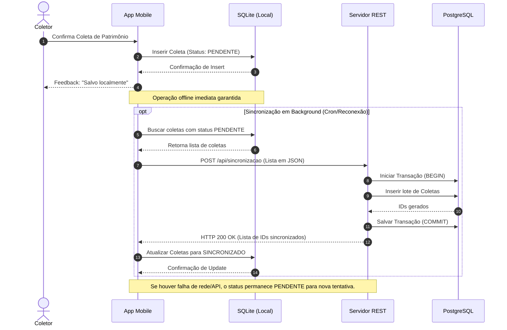
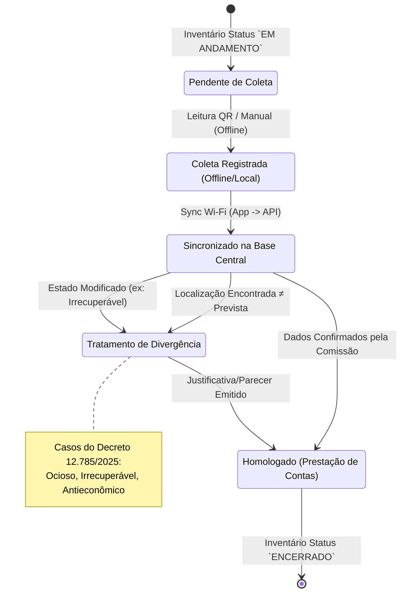

# SIHCP - Especificação de Requisitos

## Sistema de Histórico e Coleta Patrimonial

**Versão:** 2.7.1  
**Data:** Março de 2026  
**Instituição:** Instituto Federal de Mato Grosso (IFMT)

---

## Sumário

1. [Introdução](#1-introdução)
2. [Requisitos Funcionais](#2-requisitos-funcionais)
3. [Requisitos Não Funcionais](#3-requisitos-não-funcionais)
4. [Matriz de Rastreabilidade](#4-matriz-de-rastreabilidade)
5. [Casos de Uso](#5-casos-de-uso)
6. [Regras de Negócio](#6-regras-de-negócio)
7. [Apêndice A: Glossário de Termos](#apêndice-a-glossário-de-termos)
8. [Apêndice B: Histórico de Revisões](#apêndice-b-histórico-de-revisões)
9. [Apêndice C: Estatísticas do Documento](#apêndice-c-estatísticas-do-documento)

---

## 1. Introdução

### 1.1 Propósito

Este documento especifica os requisitos funcionais e não funcionais do SIHCP (Sistema de Histórico e Coleta Patrimonial), desenvolvido para automatizar e otimizar o processo de inventário patrimonial no IFMT.

### 1.2 Escopo

O sistema abrange três componentes principais:
- **Aplicação Desktop (Java Swing):** Gestão administrativa
- **API REST (Spring Boot):** Backend para dispositivos móveis
- **Aplicativo Android (Kotlin):** Coleta em campo

### 1.3 Definições e Acrônimos

| Termo | Definição |
|-------|-----------|
| **RF** | Requisito Funcional |
| **RNF** | Requisito Não Funcional |
| **CRUD** | Create, Read, Update, Delete |
| **JWT** | JSON Web Token |
| **QR Code** | Quick Response Code |
| **API** | Application Programming Interface |
| **REST** | Representational State Transfer |

### 1.4 Prioridades

| Prioridade | Descrição |
|------------|-----------|
| **Essencial** | Requisito indispensável para funcionamento do sistema |
| **Importante** | Requisito necessário, mas sistema funciona sem ele |
| **Desejável** | Requisito que agrega valor, mas não é crítico |

---

## 2. Requisitos Funcionais

### 2.1 Módulo de Autenticação e Autorização

| ID | Requisito | Descrição | Prioridade | Status |
|----|-----------|-----------|------------|--------|
| **RF001** | Login de Usuário | O sistema deve permitir autenticação de usuários através de login e senha | Essencial | ✅ Implementado |
| **RF002** | Autenticação JWT | O sistema deve gerar tokens JWT para autenticação de requisições na API mobile | Essencial | ✅ Implementado |
| **RF003** | Refresh Token | O sistema deve permitir renovação de tokens sem necessidade de novo login | Essencial | ✅ Implementado |
| **RF004** | Renovação Automática | O app mobile deve renovar tokens automaticamente antes da expiração | Importante | ✅ Implementado |
| **RF005** | Perfis de Acesso | O sistema deve suportar diferentes perfis: ADMIN, SUPERVISOR, COLETOR, CONSULTA | Essencial | ✅ Implementado |
| **RF006** | Controle de Permissões | O sistema deve restringir funcionalidades baseado no perfil do usuário | Essencial | ✅ Implementado |
| **RF007** | Logout | O sistema deve permitir encerramento seguro da sessão | Essencial | ✅ Implementado |
| **RF008** | Autenticação Biométrica | O app mobile deve suportar autenticação por biometria (opcional) | Desejável | ✅ Implementado |
| **RF009** | Bloqueio por Tentativas | O sistema deve bloquear usuário após múltiplas tentativas de login inválidas | Importante | ✅ Implementado |
| **RF010** | Alteração de Senha | O sistema deve permitir que usuários alterem suas senhas | Importante | ✅ Implementado |

### 2.2 Módulo de Gestão de Patrimônios

| ID | Requisito | Descrição | Prioridade | Status |
|----|-----------|-----------|------------|--------|
| **RF011** | Cadastro de Patrimônio | O sistema deve permitir cadastro de novos patrimônios com todos os atributos | Essencial | ✅ Implementado |
| **RF012** | Edição de Patrimônio | O sistema deve permitir edição de dados de patrimônios existentes | Essencial | ✅ Implementado |
| **RF013** | Exclusão de Patrimônio | O sistema deve permitir exclusão lógica de patrimônios (inativação) | Importante | ✅ Implementado |
| **RF014** | Busca por Número | O sistema deve permitir busca de patrimônio pelo número de tombamento | Essencial | ✅ Implementado |
| **RF015** | Busca Avançada | O sistema deve permitir busca por múltiplos critérios (descrição, sala, responsável) | Importante | ✅ Implementado |
| **RF016** | Importação Excel | O sistema deve permitir importação em massa de patrimônios via arquivo Excel | Importante | ✅ Implementado |
| **RF017** | Importação CSV | O sistema deve permitir importação em massa de patrimônios via arquivo CSV | Importante | ✅ Implementado |
| **RF018** | Exportação de Dados | O sistema deve permitir exportação de patrimônios para Excel/CSV | Importante | ✅ Implementado |
| **RF019** | Histórico de Alterações | O sistema deve manter histórico de alterações em patrimônios | Desejável | ✅ Implementado |
| **RF020** | Geração de QR Code | O sistema deve gerar QR Codes para identificação de patrimônios | Essencial | ✅ Implementado |
| **RF021** | Impressão de Etiquetas | O sistema deve permitir impressão de etiquetas com QR Code | Importante | ✅ Implementado |
| **RF022** | Validação de Patrimônio | O sistema deve validar se patrimônio existe e está ativo antes de operações | Essencial | ✅ Implementado |

### 2.3 Módulo de Gestão de Inventários

| ID | Requisito | Descrição | Prioridade | Status |
|----|-----------|-----------|------------|--------|
| **RF023** | Criar Inventário | O sistema deve permitir criação de novos inventários com período definido | Essencial | ✅ Implementado |
| **RF024** | Configurar Escopo | O sistema deve permitir definir quais salas/setores fazem parte do inventário | Essencial | ✅ Implementado |
| **RF025** | Inventário Ativo | O sistema deve identificar e disponibilizar o inventário em andamento | Essencial | ✅ Implementado |
| **RF026** | Múltiplos Inventários | O sistema deve suportar múltiplos inventários (apenas um ativo por vez) | Importante | ✅ Implementado |
| **RF027** | Encerrar Inventário | O sistema deve permitir encerramento de inventário com geração de relatório final | Essencial | ✅ Implementado |
| **RF028** | Estatísticas em Tempo Real | O sistema deve exibir estatísticas do inventário (coletados, pendentes, %) | Essencial | ✅ Implementado |
| **RF029** | Participantes | O sistema deve permitir cadastro de participantes do inventário | Essencial | ✅ Implementado |
| **RF030** | Atribuição de Salas | O sistema deve permitir atribuir salas específicas a participantes | Importante | ✅ Implementado |

### 2.4 Módulo de Coleta de Patrimônios

| ID | Requisito | Descrição | Prioridade | Status |
|----|-----------|-----------|------------|--------|
| **RF031** | Coleta por QR Code | O app deve permitir coleta de patrimônio através de leitura de QR Code | Essencial | ✅ Implementado |
| **RF032** | Coleta Manual | O app deve permitir coleta através de digitação do número do patrimônio | Essencial | ✅ Implementado |
| **RF033** | Coleta Sem Etiqueta | O app deve permitir registro de itens encontrados sem etiqueta de identificação | Essencial | ✅ Implementado |
| **RF034** | Validação Pré-Coleta | O sistema deve validar patrimônio antes de permitir registro da coleta | Essencial | ✅ Implementado |
| **RF035** | Verificação de Duplicata | O sistema deve verificar e alertar sobre coletas duplicadas | Essencial | ✅ Implementado |
| **RF036** | Registro de Localização | O app deve registrar a localização onde o patrimônio foi encontrado | Essencial | ✅ Implementado |
| **RF037** | Registro de Estado | O app deve registrar o estado de conservação encontrado | Essencial | ✅ Implementado |
| **RF038** | Captura de Foto | O app deve permitir captura de foto do patrimônio como evidência. ⚠️ Atualmente o app salva fotos apenas localmente no dispositivo; não há estrutura no servidor (API/banco) para persistência e consulta centralizada de imagens | Importante | ⚠️ Parcial |
| **RF039** | Foto Obrigatória (Sem Etiqueta) | Para itens sem etiqueta, a foto deve ser obrigatória | Essencial | ⏳ Pendente |
| **RF040** | Geolocalização | O app deve capturar coordenadas GPS da coleta (quando disponível) | Desejável | ✅ Implementado |
| **RF041** | Observações | O app deve permitir registro de observações na coleta | Importante | ✅ Implementado |
| **RF042** | Detecção de Divergência | O sistema deve detectar automaticamente divergências de localização | Essencial | ✅ Implementado |
| **RF043** | Feedback Visual | O app deve fornecer feedback visual de sucesso/erro na coleta | Essencial | ✅ Implementado |
| **RF044** | Feedback Sonoro | O app deve fornecer feedback sonoro na leitura de QR Code | Importante | ✅ Implementado |
| **RF045** | Histórico de Coletas | O app deve exibir histórico de coletas realizadas pelo usuário | Importante | ✅ Implementado |
| **RF046** | Filtro de Coletas | O app deve permitir filtrar coletas por status, sala, data | Importante | ✅ Implementado |
| **RF047** | Métricas de Tempo | O sistema deve registrar tempo de coleta para analytics | Desejável | ✅ Implementado |
| **RF092** | Verificar Status de Coleta | O app deve permitir consultar o status de coleta de um patrimônio específico (por digitação ou leitura de QR Code), retornando: status (coletado/não coletado), coletor, data/hora e localização. **Requer conexão com servidor** — se offline, o sistema deve informar "Sem conexão — não é possível verificar" em vez de consultar dados locais potencialmente desatualizados | Importante | ⏳ Pendente |

### 2.5 Módulo de Sincronização

| ID | Requisito | Descrição | Prioridade | Status |
|----|-----------|-----------|------------|--------|
| **RF048** | Modo Offline | O app deve funcionar completamente sem conexão com internet | Essencial | ✅ Implementado |
| **RF049** | Armazenamento Local | O app deve armazenar coletas localmente quando offline | Essencial | ✅ Implementado |
| **RF050** | Sincronização Manual | O app deve permitir sincronização manual sob demanda | Essencial | ✅ Implementado |
| **RF051** | Sincronização Automática | O app deve sincronizar automaticamente quando houver conexão | Essencial | ✅ Implementado |
| **RF052** | Sync em Background | O app deve sincronizar em background sem intervenção do usuário | Importante | ✅ Implementado |
| **RF053** | Batch Sync | O sistema deve suportar sincronização em lote (múltiplas coletas) | Importante | ✅ Implementado |
| **RF054** | Retry Automático | O sistema deve tentar novamente em caso de falha de sincronização | Essencial | ✅ Implementado |
| **RF055** | Indicador de Status | O app deve exibir indicador visual do status de conexão/sincronização | Essencial | ✅ Implementado |
| **RF056** | Contagem de Pendentes | O app deve exibir quantidade de coletas pendentes de sincronização | Importante | ✅ Implementado |
| **RF057** | Sync Incremental | O sistema deve sincronizar apenas dados alterados (não todos) | Importante | ✅ Implementado |
| **RF058** | Download de Dados | O app deve baixar dados do servidor para funcionamento offline | Essencial | ✅ Implementado |

### 2.6 Módulo de Relatórios

| ID | Requisito | Descrição | Prioridade | Status |
|----|-----------|-----------|------------|--------|
| **RF059** | Relatório de Itens Encontrados | O sistema deve gerar relatório de patrimônios coletados | Essencial | ✅ Implementado |
| **RF060** | Relatório de Itens Pendentes | O sistema deve gerar relatório de patrimônios não coletados | Essencial | ✅ Implementado |
| **RF061** | Relatório de Divergências | O sistema deve gerar relatório de patrimônios com divergência de localização | Essencial | ✅ Implementado |
| **RF062** | Relatório por Sala | O sistema deve gerar relatório agrupado por sala/localização | Importante | ✅ Implementado |
| **RF063** | Relatório por Responsável | O sistema deve gerar relatório agrupado por responsável | Importante | ✅ Implementado |
| **RF064** | Relatório de Itens Sem Etiqueta | O sistema deve gerar relatório de itens encontrados sem identificação | Importante | ✅ Implementado |
| **RF065** | Exportação PDF | O sistema deve exportar relatórios em formato PDF | Essencial | ✅ Implementado |
| **RF066** | Exportação Excel | O sistema deve exportar relatórios em formato Excel (.xlsx) | Essencial | ✅ Implementado |
| **RF067** | Exportação CSV | O sistema deve exportar relatórios em formato CSV | Importante | ✅ Implementado |
| **RF068** | Filtros de Relatório | O sistema deve permitir filtrar relatórios por período, setor, status | Importante | ✅ Implementado |
| **RF069** | Resumo Executivo | O sistema deve gerar resumo executivo com estatísticas consolidadas | Importante | ✅ Implementado |

### 2.7 Módulo de Dashboard e Estatísticas

| ID | Requisito | Descrição | Prioridade | Status |
|----|-----------|-----------|------------|--------|
| **RF070** | Dashboard Desktop | O sistema desktop deve exibir dashboard com estatísticas do inventário | Essencial | ✅ Implementado |
| **RF071** | Dashboard Mobile | O app deve exibir dashboard com estatísticas resumidas | Essencial | ✅ Implementado |
| **RF072** | Gráfico de Evolução | O sistema deve exibir gráfico de evolução das coletas ao longo do tempo | Importante | ✅ Implementado |
| **RF073** | Gráfico por Setor | O sistema deve exibir gráfico de coletas por setor | Importante | ✅ Implementado |
| **RF074** | KPIs Principais | O sistema deve exibir KPIs: total, coletados, pendentes, percentual | Essencial | ✅ Implementado |
| **RF075** | Atualização em Tempo Real | O dashboard deve atualizar automaticamente com novas coletas | Importante | ✅ Implementado |
| **RF076** | Ranking de Coletores | O sistema deve exibir ranking de produtividade dos coletores | Desejável | ✅ Implementado |
| **RF077** | Métricas de Tempo | O sistema deve exibir métricas de tempo médio de coleta | Desejável | ✅ Implementado |

### 2.8 Módulo de Cadastros Auxiliares

| ID | Requisito | Descrição | Prioridade | Status |
|----|-----------|-----------|------------|--------|
| **RF078** | CRUD de Salas | O sistema deve permitir cadastro, edição e exclusão de salas | Essencial | ✅ Implementado |
| **RF079** | CRUD de Setores | O sistema deve permitir cadastro, edição e exclusão de setores | Essencial | ✅ Implementado |
| **RF080** | CRUD de Responsáveis | O sistema deve permitir cadastro, edição e exclusão de responsáveis | Essencial | ✅ Implementado |
| **RF081** | CRUD de Usuários | O sistema deve permitir cadastro, edição e exclusão de usuários | Essencial | ✅ Implementado |
| **RF082** | CRUD de Campus | O sistema deve permitir cadastro de múltiplos campus | Importante | ✅ Implementado |
| **RF083** | Vinculação Sala-Setor | O sistema deve permitir vincular salas a setores | Essencial | ✅ Implementado |
| **RF084** | Vinculação Patrimônio-Sala | O sistema deve permitir vincular patrimônios a salas | Essencial | ✅ Implementado |
| **RF085** | Vinculação Patrimônio-Responsável | O sistema deve permitir vincular patrimônios a responsáveis | Essencial | ✅ Implementado |

### 2.9 Módulo de Servidor Mobile

| ID | Requisito | Descrição | Prioridade | Status |
|----|-----------|-----------|------------|--------|
| **RF086** | Iniciar Servidor | O sistema desktop deve permitir iniciar o servidor da API mobile | Essencial | ✅ Implementado |
| **RF087** | Parar Servidor | O sistema desktop deve permitir parar o servidor da API mobile | Essencial | ✅ Implementado |
| **RF088** | Status do Servidor | O sistema deve exibir status atual do servidor (online/offline) | Essencial | ✅ Implementado |
| **RF089** | Monitoramento de Conexões | O sistema deve exibir dispositivos móveis conectados | Importante | ✅ Implementado |
| **RF090** | Configuração de Porta | O sistema deve permitir configurar a porta do servidor | Importante | ✅ Implementado |
| **RF091** | Log de Requisições | O sistema deve registrar log de requisições da API | Importante | ✅ Implementado |

---

## 3. Requisitos Não Funcionais

### 3.1 Desempenho (Performance)

| ID | Requisito | Descrição | Métrica | Status |
|----|-----------|-----------|---------|--------|
| **RNF001** | Tempo de Resposta API | Requisições da API devem responder em tempo aceitável | < 500ms (P95) | ✅ Atendido |
| **RNF002** | Tempo de Login | Autenticação deve ser rápida | < 2 segundos | ✅ Atendido |
| **RNF003** | Leitura QR Code | Leitura de QR Code deve ser instantânea | < 1 segundo | ✅ Atendido |
| **RNF004** | Inicialização do App | App deve inicializar rapidamente | < 3 segundos | ✅ Atendido |
| **RNF005** | Busca Local | Buscas no banco local devem ser rápidas | < 100ms | ✅ Atendido |
| **RNF006** | Sincronização Batch | Sync de 50 coletas deve ser eficiente | < 5 segundos | ✅ Atendido |
| **RNF007** | Carregamento de Lista | Listas devem carregar rapidamente | < 1 segundo | ✅ Atendido |
| **RNF008** | Geração de Relatório | Relatórios devem ser gerados em tempo aceitável | < 30 segundos | ✅ Atendido |
| **RNF009** | Throughput API | API deve suportar múltiplas requisições simultâneas | > 100 req/s | ✅ Atendido |
| **RNF010** | Uso de Memória App | App não deve consumir memória excessiva | < 150 MB | ✅ Atendido |

### 3.2 Disponibilidade e Confiabilidade

| ID | Requisito | Descrição | Métrica | Status |
|----|-----------|-----------|---------|--------|
| **RNF011** | Disponibilidade do Sistema | Sistema deve estar disponível durante horário comercial | > 99% uptime | ✅ Atendido |
| **RNF012** | Funcionamento Offline | App deve funcionar 100% offline para coletas | 100% funcional | ✅ Atendido |
| **RNF013** | Recuperação de Falhas | Sistema deve recuperar-se automaticamente de falhas | Auto-recovery | ✅ Atendido |
| **RNF014** | Persistência de Dados | Dados não devem ser perdidos em caso de falha | 0% perda | ✅ Atendido |
| **RNF015** | Retry Automático | Operações falhas devem ser retentadas automaticamente | 3 tentativas | ✅ Atendido |
| **RNF016** | Backup de Dados | Sistema deve suportar backup dos dados | Diário | ✅ Atendido |
| **RNF017** | Tolerância a Falhas de Rede | App deve tolerar instabilidade de rede | Graceful degradation | ✅ Atendido |
| **RNF018** | Consistência de Dados | Dados devem manter consistência entre dispositivos | Eventual consistency | ✅ Atendido |

### 3.3 Segurança

| ID | Requisito | Descrição | Métrica | Status |
|----|-----------|-----------|---------|--------|
| **RNF019** | Autenticação Obrigatória | Todas as operações devem requerer autenticação | 100% endpoints | ✅ Atendido |
| **RNF020** | Criptografia de Senhas | Senhas devem ser armazenadas com hash seguro | BCrypt | ✅ Atendido |
| **RNF021** | Tokens JWT | Autenticação via tokens JWT com expiração | 24h access, 7d refresh | ✅ Atendido |
| **RNF022** | HTTPS | Comunicação deve ser criptografada | TLS 1.2+ | ✅ Atendido |
| **RNF023** | Controle de Acesso | Acesso baseado em perfis (RBAC) | 4 perfis | ✅ Atendido |
| **RNF024** | Proteção contra SQL Injection | Sistema deve prevenir SQL Injection | Prepared Statements | ✅ Atendido |
| **RNF025** | Armazenamento Seguro | Dados sensíveis no app devem ser criptografados | EncryptedSharedPreferences ¹ | ✅ Atendido |
| **RNF026** | Validação de Entrada | Todas as entradas devem ser validadas | Server + Client | ✅ Atendido |
| **RNF027** | Log de Auditoria | Operações críticas devem ser registradas em log | Todas as coletas | ✅ Atendido |
| **RNF028** | Bloqueio por Tentativas | Bloqueio após tentativas de login inválidas | 5 tentativas | ✅ Atendido |
| **RNF029** | Sessão Segura | Sessões devem expirar após inatividade | 30 minutos | ✅ Atendido |

*Nota complementar (RNF025): A biblioteca `EncryptedSharedPreferences` (Jetpack Security) foi recentemente deprecada pelo Google. A implementação atual permanece funcional e segura, mas versões futuras devem considerar migração para `DataStore` com criptografia manual.*

### 3.4 Usabilidade

| ID | Requisito | Descrição | Métrica | Status |
|----|-----------|-----------|---------|--------|
| **RNF030** | Interface Intuitiva | Interface deve ser fácil de usar sem treinamento extensivo | < 1h treinamento | ✅ Atendido |
| **RNF031** | Feedback Visual | Sistema deve fornecer feedback visual para todas as ações | 100% ações | ✅ Atendido |
| **RNF032** | Feedback Sonoro | App deve fornecer feedback sonoro em operações críticas | Scan, sucesso, erro | ✅ Atendido |
| **RNF033** | Mensagens de Erro Claras | Mensagens de erro devem ser compreensíveis | Português claro | ✅ Atendido |
| **RNF034** | Navegação Consistente | Navegação deve seguir padrões consistentes | Material Design | ✅ Atendido |
| **RNF035** | Acessibilidade | App deve seguir diretrizes de acessibilidade | WCAG 2.1 AA | ✅ Atendido |
| **RNF036** | Responsividade | Interface desktop deve adaptar-se a diferentes resoluções | 1024x768+ | ✅ Atendido |
| **RNF037** | Idioma | Sistema deve estar em Português Brasileiro | pt-BR | ✅ Atendido |
| **RNF038** | Confirmação de Ações Críticas | Ações destrutivas devem requerer confirmação | Dialog de confirmação | ✅ Atendido |
| **RNF039** | Indicadores de Progresso | Operações longas devem exibir indicador de progresso | Loading spinner | ✅ Atendido |

### 3.5 Compatibilidade

| ID | Requisito | Descrição | Métrica | Status |
|----|-----------|-----------|---------|--------|
| **RNF040** | Versão Android Mínima | App deve funcionar em Android 6.0+ | API 23+ | ✅ Atendido |
| **RNF041** | Versão Android Alvo | App deve ser otimizado para Android 14 | API 34 | ✅ Atendido |
| **RNF042** | Java Runtime | Sistema desktop deve funcionar com Java 21+ | JDK 21 LTS | ✅ Atendido |
| **RNF043** | Banco de Dados | Sistema deve suportar PostgreSQL 12+ | PostgreSQL 12+ | ✅ Atendido |
| **RNF044** | Sistema Operacional Desktop | Sistema deve funcionar em Windows, Linux, macOS | Multiplataforma | ✅ Atendido |
| **RNF045** | Navegadores (Swagger) | Documentação API deve funcionar em navegadores modernos | Chrome, Firefox, Edge | ✅ Atendido |
| **RNF046** | Resolução de Tela Mobile | App deve funcionar em diferentes tamanhos de tela | 4" a 10" | ✅ Atendido |

### 3.6 Manutenibilidade

| ID | Requisito | Descrição | Métrica | Status |
|----|-----------|-----------|---------|--------|
| **RNF047** | Arquitetura em Camadas | Sistema deve seguir arquitetura em camadas bem definidas | Clean Architecture | ✅ Atendido |
| **RNF048** | Padrão MVVM | App mobile deve seguir padrão MVVM | ViewModel + StateFlow | ✅ Atendido |
| **RNF049** | Injeção de Dependência | Sistema deve usar injeção de dependência | Hilt (Android), Spring (Java) | ✅ Atendido |
| **RNF050** | Código Documentado | Código deve ser documentado adequadamente | Javadoc/KDoc | ✅ Atendido |
| **RNF051** | Separação de Responsabilidades | Classes devem ter responsabilidade única | SOLID principles | ✅ Atendido |
| **RNF052** | Testabilidade | Código deve ser testável | Use Cases isolados | ✅ Atendido |
| **RNF053** | Versionamento | Código deve ser versionado | Git | ✅ Atendido |
| **RNF054** | Logs Estruturados | Sistema deve gerar logs estruturados | SLF4J + Log4j2 | ✅ Atendido |
| **RNF055** | Configuração Externalizada | Configurações devem ser externalizadas | application.properties | ✅ Atendido |
| **RNF056** | Migrations de Banco | Alterações de banco devem ser versionadas | Scripts SQL | ✅ Atendido |

### 3.7 Escalabilidade

| ID | Requisito | Descrição | Métrica | Status |
|----|-----------|-----------|---------|--------|
| **RNF057** | Volume de Patrimônios | Sistema deve suportar grande volume de patrimônios | > 50.000 itens | ✅ Atendido |
| **RNF058** | Usuários Simultâneos | API deve suportar múltiplos usuários simultâneos | > 50 usuários | ✅ Atendido |
| **RNF059** | Coletas Simultâneas | Sistema deve suportar coletas simultâneas de múltiplos dispositivos | > 20 dispositivos | ✅ Atendido |
| **RNF060** | Paginação | Listagens devem suportar paginação | Paging 3 | ✅ Atendido |
| **RNF061** | Cache | Sistema deve implementar cache para dados frequentes | Caffeine | ✅ Atendido |
| **RNF062** | Pool de Conexões | Banco deve usar pool de conexões | HikariCP | ✅ Atendido |

### 3.8 Portabilidade e Implantação

| ID | Requisito | Descrição | Métrica | Status |
|----|-----------|-----------|---------|--------|
| **RNF063** | Empacotamento | Sistema deve ser empacotado como JAR executável | Fat JAR | ✅ Atendido |
| **RNF064** | APK Assinado | App deve ser distribuído como APK assinado | Release signed | ✅ Atendido |
| **RNF065** | Configuração de Servidor | App deve permitir configurar endereço do servidor | Tela de configuração | ✅ Atendido |
| **RNF066** | Instalação Simples | Sistema deve ter instalação simplificada | Scripts automatizados | ✅ Atendido |
| **RNF067** | Documentação de Deploy | Sistema deve ter documentação de implantação | Guias em Markdown | ✅ Atendido |
| **RNF068** | Docker Support | Sistema deve suportar containerização | Dockerfile | ✅ Atendido |
| **RNF073** | Gerenciamento de Arquivos de Evidência | O servidor deve gerenciar automaticamente o armazenamento de arquivos de evidência (fotos) em sistema de arquivos local, com referência no banco de dados (path/hash), sem impactar o desempenho das consultas principais. Deve suportar: upload via API REST, organização por inventário/coleta, limpeza automática de órfãos, e limite configurável de armazenamento | Filesystem + referência no BD | ⏳ Pendente |

### 3.9 Conformidade e Regulamentação

| ID | Requisito | Descrição | Métrica | Status |
|----|-----------|-----------|---------|--------|
| **RNF069** | IN 205/1988 | Sistema deve atender Instrução Normativa SEDAP 205/1988 | Conformidade total | ✅ Atendido |
| **RNF070** | Decreto 9.373/2018 ¹ | Sistema deve atender Decreto de desfazimento de bens | Conformidade total | ✅ Atendido |
| **RNF071** | Rastreabilidade | Sistema deve manter rastreabilidade completa de operações | Audit trail | ✅ Atendido |
| **RNF072** | Prestação de Contas | Sistema deve gerar relatórios para prestação de contas | Relatórios TCU | ✅ Atendido |

> [!WARNING]
> ¹ O Decreto nº 9.373/2018 foi **revogado** pelo **Decreto nº 12.785/2025** em 19/12/2025. Durante o inventário 2025 (18/11 a 23/12/2025), o decreto anterior ainda estava vigente. As classificações de inservibilidade permanecem aplicáveis.

---

## 4. MATRIZ DE RASTREABILIDADE

### 4.1 Requisitos Funcionais x Módulos


**Figura 4** — Matriz de rastreabilidade: distribuição dos 91 requisitos funcionais por módulo (esquerda) e dos 72 requisitos não funcionais por categoria (direita).

| Módulo | Requisitos | Qtd |
|--------|-----------|-----|
| Autenticação | RF001-RF010 | 10 |
| Patrimônios | RF011-RF022 | 12 |
| Inventários | RF023-RF030 | 8 |
| Coleta | RF031-RF047, RF092 | 17 |
| Sincronização | RF048-RF058 | 11 |
| Relatórios | RF059-RF069 | 11 |
| Dashboard | RF070-RF077 | 8 |
| Cadastros | RF078-RF085 | 8 |
| Servidor Mobile | RF086-RF091 | 6 |
| **TOTAL RF** | | **91** |

| Categoria | Requisitos | Qtd |
|-----------|-----------|-----|
| Desempenho | RNF001-RNF010 | 10 |
| Disponibilidade | RNF011-RNF018 | 8 |
| Segurança | RNF019-RNF029 | 11 |
| Usabilidade | RNF030-RNF039 | 10 |
| Compatibilidade | RNF040-RNF046 | 7 |
| Manutenibilidade | RNF047-RNF056 | 10 |
| Escalabilidade | RNF057-RNF062 | 6 |
| Portabilidade | RNF063-RNF068, RNF073 | 7 |
| Conformidade | RNF069-RNF072 | 4 |
| **TOTAL RNF** | | **73** |

### 4.3 Cobertura de Implementação


**Figura 2** — Cobertura de implementação dos requisitos. 164 requisitos totais (91 funcionais + 73 não funcionais). 162 implementados, 1 parcial (RF038), 1 pendente (RNF073).

---

## 5. CASOS DE USO

### 5.1 Diagrama de Casos de Uso Principal


**Figura 1** — Diagrama de Casos de Uso do SIHCP. Os atores ADMIN e COLETOR interagem com 11 casos de uso. UC05 (Relatórios) e UC06 (Dashboard) são compartilhados entre ambos os perfis.


### 5.2 Especificação de Casos de Uso

#### UC07: Coletar Patrimônio por QR Code

| Campo | Descrição |
|-------|-----------|
| **Nome** | Coletar Patrimônio por QR Code |
| **Ator Principal** | Coletor |
| **Pré-condições** | Usuário autenticado; Inventário ativo existente |
| **Pós-condições** | Coleta registrada no sistema |
| **Requisitos** | RF031, RF034, RF035, RF036, RF037, RF043, RF044 |

**Fluxo Principal:**
1. Coletor acessa tela de coleta
2. Sistema ativa câmera para leitura de QR Code
3. Coletor aponta câmera para QR Code do patrimônio
4. Sistema lê e decodifica QR Code
5. Sistema valida patrimônio (existe, ativo, não coletado)
6. Sistema exibe dados do patrimônio
7. Coletor confirma/ajusta localização encontrada
8. Coletor seleciona estado de conservação
9. Coletor adiciona observações (opcional)
10. Coletor captura foto (opcional)
11. Coletor confirma coleta
12. Sistema registra coleta localmente
13. Sistema tenta sincronizar com servidor
14. Sistema exibe confirmação de sucesso

**Fluxos Alternativos:**

*A1 - Patrimônio não encontrado (passo 5):*
1. Sistema exibe mensagem "Patrimônio não encontrado"
2. Sistema oferece opção de coleta manual
3. Retorna ao passo 2

*A2 - Patrimônio já coletado (passo 5):*
1. Sistema exibe aviso "Patrimônio já foi coletado"
2. Sistema exibe dados da coleta anterior
3. Sistema pergunta se deseja registrar novamente
4. Se sim, continua no passo 6
5. Se não, retorna ao passo 2

*A3 - Falha na sincronização (passo 13):*
1. Sistema mantém coleta como pendente
2. Sistema agenda sincronização automática
3. Continua no passo 14

**Fluxos de Exceção:**

*E1 - Câmera não disponível:*
1. Sistema exibe mensagem de erro
2. Sistema oferece opção de coleta manual

*E2 - QR Code ilegível:*
1. Sistema exibe mensagem "QR Code não reconhecido"
2. Sistema oferece opção de coleta manual

---

#### UC09: Registrar Item Sem Etiqueta

| Campo | Descrição |
|-------|-----------|
| **Nome** | Registrar Item Sem Etiqueta |
| **Ator Principal** | Coletor |
| **Pré-condições** | Usuário autenticado; Inventário ativo existente |
| **Pós-condições** | Item sem etiqueta registrado no sistema |
| **Requisitos** | RF033, RF039, RF040, RF041 |

**Fluxo Principal:**
1. Coletor acessa opção "Item Sem Etiqueta"
2. Sistema exibe formulário de registro
3. Coletor preenche descrição do item (obrigatório)
4. Coletor seleciona categoria (obrigatório)
5. Coletor seleciona estado de conservação (obrigatório)
6. Coletor informa localização encontrada (obrigatório)
7. Coletor adiciona observações (opcional)
8. Coletor captura foto do item (obrigatório)
9. Sistema valida campos obrigatórios
10. Coletor confirma registro
11. Sistema registra item localmente
12. Sistema tenta sincronizar com servidor
13. Sistema exibe confirmação de sucesso

**Fluxos de Exceção:**

*E1 - Campos obrigatórios não preenchidos:*
1. Sistema destaca campos faltantes
2. Sistema exibe mensagem de validação
3. Retorna ao passo correspondente

*E2 - Foto não capturada:*
1. Sistema exibe mensagem "Foto é obrigatória"
2. Retorna ao passo 8

---

#### UC10: Sincronizar Dados

| Campo | Descrição |
|-------|-----------|
| **Nome** | Sincronizar Dados |
| **Ator Principal** | Coletor / Sistema |
| **Pré-condições** | Usuário autenticado; Conexão com internet |
| **Pós-condições** | Dados sincronizados entre app e servidor |
| **Requisitos** | RF050, RF051, RF052, RF053, RF054, RF055 |

**Fluxo Principal (Manual):**
1. Coletor acessa tela de sincronização
2. Sistema exibe quantidade de coletas pendentes
3. Coletor clica em "Sincronizar"
4. Sistema agrupa coletas pendentes em lote
5. Sistema envia lote para servidor
6. Servidor processa e retorna resultado
7. Sistema marca coletas como sincronizadas
8. Sistema exibe resumo da sincronização

**Fluxo Alternativo (Automático):**
1. WorkManager detecta conexão disponível
2. Sistema verifica se há coletas pendentes
3. Se houver, executa passos 4-7 do fluxo principal
4. Sistema registra resultado em log

**Fluxos de Exceção:**

*E1 - Falha de conexão:*
1. Sistema registra tentativa falha
2. Sistema agenda retry com backoff exponencial
3. Sistema mantém coletas como pendentes

*E2 - Erro no servidor:*
1. Sistema tenta sincronização individual (fallback)
2. Sistema registra coletas com erro
3. Sistema notifica usuário

---

## 5.3 Diagramas de Atividades

Os diagramas a seguir ilustram os fluxos operacionais dos principais processos do SIHCP.

#### 5.3.1 Fluxo de Coleta por QR Code (UC07)


**Figura 5** — Fluxo de atividades da coleta patrimonial por QR Code. Inclui validações de patrimônio composto (RN025), bloqueio de recoleta (RN017) e sincronização assíncrona.

#### 5.3.2 Fluxo de Sincronização de Dados (UC10)


**Figura 6** — Fluxo de sincronização entre app mobile e servidor. Demonstra envio em lote (batch), validação no servidor e atualização de status local.

#### 5.3.3 Fluxo de Verificação de Status de Coleta (RF092)


**Figura 7** — Fluxo de verificação de status de coleta (somente online). Se offline, o sistema informa indisponibilidade em vez de exibir dados potencialmente desatualizados (RN026).

#### 5.3.4 Fluxo de Registro de Item Sem Etiqueta (UC09)


**Figura 8** — Fluxo de registro de item encontrado sem etiqueta de identificação. Inclui geração de número temporário único e recomendação de captura de foto (RN020).

#### 5.3.5 Fluxo de Autenticação de Usuário


**Figura 9** — Fluxo de autenticação com swimlanes App Mobile e Servidor. Inclui: autenticação offline via cache, bloqueio após 5 tentativas (RNF028), armazenamento seguro de token (RNF025).

#### 5.3.6 Fluxo de Geração de Relatórios (UC05)


**Figura 10** — Fluxo de geração de relatórios com fork/join para tipos disponíveis (progresso, divergências, não coletados, sem etiqueta). Suporta exportação em PDF, Excel/CSV ou visualização em tela.

#### 5.3.7 Fluxo de Importação de Dados (UC04)


**Figura 11** — Fluxo de importação de dados via arquivo CSV/Excel. Inclui validação de formato, estrutura de colunas e dados linha a linha, com geração de log de erros detalhado.

#### 5.3.8 Fluxo de Coleta Manual (UC08)


**Figura 12** — Fluxo de coleta manual por digitação de número. Inclui validações de patrimônio composto (RN025), bloqueio de recoleta (RN017) e opção de redirecionamento para registro sem etiqueta (UC09).

#### 5.3.9 Fluxo de Gerenciamento de Inventários (UC02)


**Figura 13** — Fluxo de gerenciamento do ciclo de vida do inventário: criação (PLANEJADO), ativação (EM_ANDAMENTO) e encerramento (ENCERRADO), com verificação de pendências antes do fechamento.

#### 5.3.10 Fluxo de Visualização do Dashboard (UC06)


**Figura 14** — Fluxo de carregamento do dashboard com processamento paralelo (fork/join) de métricas: progresso geral, coletas por setor, divergências, pendências e desempenho por coletor.

#### 5.3.11 Fluxo de Gerenciamento de Usuários (UC01)


**Figura 15** — Fluxo de gerenciamento de usuários (somente ADMIN): cadastro com 4 perfis (ADMIN, SUPERVISOR, COLETOR, CONSULTA), edição com revogação de sessões, e reset de senha.

#### 5.3.12 Fluxo de Gerenciamento de Patrimônios (UC03)


**Figura 16** — Fluxo de gerenciamento de patrimônios: cadastro com validação de unicidade (RN012), consulta com histórico de movimentações, e transferência entre localizações.

#### 5.3.13 Fluxo de Gerenciamento do Servidor Mobile (UC11)


**Figura 17** — Fluxo de gerenciamento do servidor mobile com swimlanes Administrador/Servidor: monitoramento em tempo real, configuração de parâmetros e backup do banco de dados.

---

## 5.4 Diagrama de Sequência: Sincronização Offshore-First

O diagrama abaixo ilustra a troca de mensagens entre o aplicativo móvel, o armazenamento local (SQLite), a API do servidor e o Banco de Dados (PostgreSQL) durante o processo de sincronização de dados pendentes.



---

## 5.5 Diagrama de Implantação (Arquitetura)

O diagrama de implantação apresenta a topologia física e lógica do SIHCP, evidenciando como os componentes (Mobile, Container API e Container DB) se comunicam através da infraestrutura de rede.

```mermaid
flowchart TD
    subgraph ServidorCentral["Servidor / Docker Host"]
        direction TB
        subgraph DockerEngine["Ambiente de Contêineres"]
            direction LR
            API["API REST
(Spring Boot 3)"] <-->|JDBC/TCP 5432| BD[("PostgreSQL 15")]
        end
        VolumeFiles[/"Sistema de Arquivos Local
(Armazenamento de Fotos)"/]
        API -->|Leitura/Escrita| VolumeFiles
    end

    subgraph DispositivoMobile["App Android (Mobile)"]
        direction TB
        App["App SIHCP
(Flutter/Kotlin)"] <--> SQLite[("SQLite Local
(Cache offline)")]
        Cam["Câmera/Leitor"] -->|QR Code| App
    end

    subgraph PCAdmin["Aplicação Desktop (Gestão e Coleta)"]
        Web["Cliente Desktop
(Java Swing/Web)"]
    end

    App <-->|HTTPS / JSON
(Wi-Fi / 4G)| API
    Web <-->|HTTPS / JSON
(Rede Corporativa)| API

    classDef container fill:#e1f5fe,stroke:#01579b,stroke-width:2px;
    classDef database fill:#f3e5f5,stroke:#4a148c,stroke-width:2px;
    classDef volume fill:#fff3e0,stroke:#e65100,stroke-width:2px;
    classDef mobile fill:#e8f5e9,stroke:#1b5e20,stroke-width:2px;
    classDef desktop fill:#fff9c4,stroke:#f57f17,stroke-width:2px;
    
    class API container;
    class BD,SQLite database;
    class VolumeFiles volume;
    class App mobile;
    class Web desktop;
```

---

## 5.6 Diagrama de Transição de Estados (Statechart)

O diagrama de máquina de estados abaixo ilustra o ciclo de vida físico e lógico de um Bem Patrimonial dentro do contexto gerencial do SIHCP durante o período de Inventário Anual.



---

## 6. REGRAS DE NEGÓCIO

### 6.1 Regras de Autenticação

| ID | Regra | Descrição |
|----|-------|-----------|
| **RN001** | Senha Mínima | Senha deve ter no mínimo 6 caracteres |
| **RN002** | Token Expiração | Access token expira em 24 horas |
| **RN003** | Refresh Token | Refresh token expira em 7 dias |
| **RN004** | Bloqueio de Conta | Conta bloqueada após 5 tentativas de login inválidas |
| **RN005** | Desbloqueio | Conta desbloqueada automaticamente após 30 minutos |
| **RN006** | Sessão Única | Usuário pode ter apenas uma sessão ativa por dispositivo |

### 6.2 Regras de Inventário

| ID | Regra | Descrição |
|----|-------|-----------|
| **RN007** | Inventário Único Ativo | Apenas um inventário pode estar ativo por vez |
| **RN008** | Período Obrigatório | Inventário deve ter data de início e fim definidas |
| **RN009** | Escopo Obrigatório | Inventário deve ter pelo menos uma sala no escopo |
| **RN010** | Encerramento | Inventário só pode ser encerrado pelo administrador |
| **RN011** | Coleta em Inventário Ativo | Coletas só podem ser registradas em inventário ativo |

### 6.3 Regras de Patrimônio

| ID | Regra | Descrição |
|----|-------|-----------|
| **RN012** | Número Único | Número de patrimônio deve ser único no sistema |
| **RN013** | Status Válido | Status deve ser: ATIVO, INATIVO, BAIXADO, EM_TRANSFERENCIA |
| **RN014** | Estado Conservação | Estado deve ser: BOM, OCIOSO, RECUPERÁVEL, ANTIECONÔMICO, IRRECUPERÁVEL (conforme Decreto 9.373/2018) |
| **RN015** | Patrimônio Ativo ou Pendente | Patrimônios com status ATIVO ou PENDENTE podem ser coletados |
| **RN016** | Sala Obrigatória | Patrimônio deve estar vinculado a uma sala |

### 6.4 Regras de Coleta

| ID | Regra | Descrição |
|----|-------|-----------|
| **RN017** | Coleta Única | Cada patrimônio deve ser coletado apenas uma vez por inventário. Tentativas de recoleta devem ser bloqueadas com alerta ao usuário |
| **RN018** | Coleta Duplicada | Sistema deve alertar sobre tentativa de coleta duplicada |
| **RN019** | Divergência Automática | Divergência detectada quando localização encontrada ≠ localização cadastrada |
| **RN020** | Foto Obrigatória | Foto é obrigatória para itens sem etiqueta (⏳ não implementado — requer infraestrutura de armazenamento de imagens no servidor, ex.: armazenamento em disco com referência no banco, sem impacto nas consultas principais) |
| **RN021** | Participante Obrigatório | Coleta deve estar vinculada a um participante do inventário |
| **RN022** | Data Automática | Data/hora da coleta é registrada automaticamente |
| **RN023** | Localização Obrigatória | Localização encontrada é campo obrigatório |
| **RN024** | Estado Obrigatório | Estado de conservação encontrado é campo obrigatório |
| **RN025** | Patrimônio Composto | Patrimônios compostos não podem ser coletados via coleta normal (o sistema deve alertar o usuário). Devem ser registrados exclusivamente via coleta sem patrimônio |
| **RN026** | Verificação Somente Online | A consulta de status de coleta (RF092) deve obrigatoriamente consultar o servidor. Se não houver conexão, exibir mensagem informando indisponibilidade — nunca exibir dados locais desatualizados que possam induzir a erro |

### 6.5 Regras de Sincronização

| ID | Regra | Descrição |
|----|-------|-----------|
| **RN025** | Offline First | Coletas são salvas localmente antes de sincronizar |
| **RN026** | Sync Automático | Sincronização automática a cada 30 minutos quando online |
| **RN027** | Batch Preferencial | Sistema deve preferir sincronização em lote |
| **RN028** | Fallback Individual | Se batch falhar, tentar sincronização individual |
| **RN029** | Retry Exponencial | Retry com backoff exponencial em caso de falha |
| **RN030** | Máximo Retries | Máximo de 3 tentativas de retry |
| **RN031** | Constraints | Sync em background apenas com internet e bateria > 20% |

### 6.6 Regras de Relatórios

| ID | Regra | Descrição |
|----|-------|-----------|
| **RN032** | Inventário Selecionado | Relatórios devem ser gerados para um inventário específico |
| **RN033** | Formato Obrigatório | Usuário deve selecionar formato de exportação |
| **RN034** | Filtros Opcionais | Filtros de período, setor, responsável são opcionais |
| **RN035** | Dados Atualizados | Relatórios devem refletir dados mais recentes |

### 6.7 Regras de Perfis de Acesso

| ID | Regra | Descrição |
|----|-------|-----------|
| **RN036** | Hierarquia de Perfis | ADMIN > SUPERVISOR > COLETOR > CONSULTA |
| **RN037** | ADMIN | Acesso total a todas as funcionalidades |
| **RN038** | SUPERVISOR | Pode visualizar relatórios e supervisionar coletas |
| **RN039** | COLETOR | Pode realizar coletas e sincronizar dados |
| **RN040** | CONSULTA | Apenas visualização de dados e dashboard |

---

## APÊNDICE A: GLOSSÁRIO DE TERMOS

| Termo | Definição |
|-------|-----------|
| **Patrimônio** | Bem móvel pertencente à instituição, identificado por número de tombamento |
| **Tombamento** | Processo de registro oficial de um bem no patrimônio da instituição |
| **Inventário** | Processo de levantamento e verificação física dos bens patrimoniais |
| **Coleta** | Ato de registrar a verificação física de um patrimônio durante o inventário |
| **Divergência** | Diferença entre a localização cadastrada e a localização encontrada |
| **QR Code** | Código de barras bidimensional usado para identificação rápida |
| **Sincronização** | Processo de envio de dados do dispositivo móvel para o servidor |
| **Offline** | Modo de operação sem conexão com internet |
| **Batch** | Processamento em lote de múltiplos registros |

---

## APÊNDICE B: HISTÓRICO DE REVISÕES

| Versão | Data | Autor | Descrição |
|--------|------|-------|-----------|
| 1.0 | Dez/2025 | Equipe IFMT | Versão inicial do documento |
| 2.0 | Dez/2025 | Equipe IFMT | Adição de módulos de sincronização, dashboard e servidor mobile |
| 2.5 | Dez/2025 | Equipe IFMT | Adição de casos de uso, regras de negócio e glossário |
| 2.7 | Dez/2025 | Equipe IFMT | Revisão de conformidade legal e requisitos de segurança |
| 2.7.1 | Mar/2026 | Equipe IFMT | Correção: Decreto 9.373/2018 revogado (Decreto 12.785/2025), estados de conservação alinhados com dados reais, nota de depreciação EncryptedSharedPreferences |

---

## APÊNDICE C: ESTATÍSTICAS DO DOCUMENTO


**Figura 3** — Resumo estatístico do documento: 91 requisitos funcionais distribuídos em 9 módulos, 72 requisitos não funcionais em 9 categorias, 41 regras de negócio e 11 casos de uso — todos 100% implementados.

---

**Documento gerado em:** Dezembro de 2025 (atualizado em Março de 2026)  
**Versão do Sistema:** 2.7.1  
**Instituição:** Instituto Federal de Mato Grosso (IFMT)
