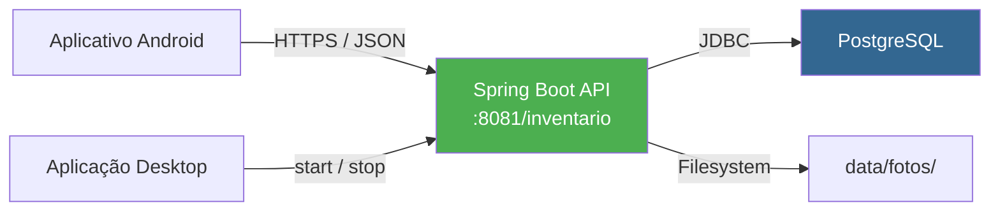
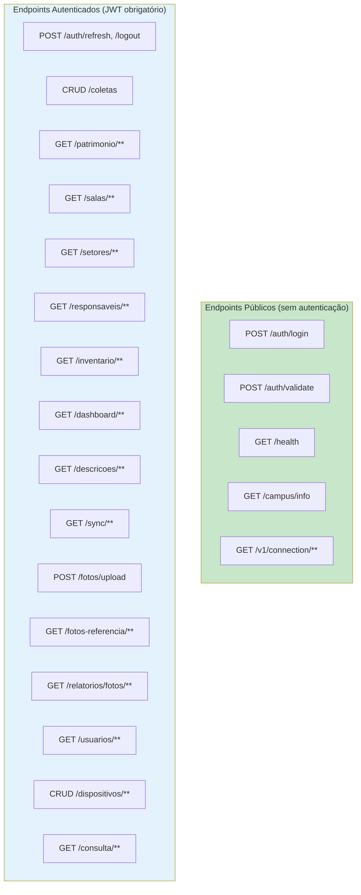

# Especificação de Requisitos Funcionais — Servidor Mobile API

## SIHCP — Sistema de Histórico e Coleta Patrimonial

**Versão do Documento:** 2.0.0
**Versão do Servidor:** 5.1.0
**Data:** Maio de 2026
**Instituição:** Instituto Federal de Educação, Ciência e Tecnologia de Mato Grosso (IFMT)
**Componente:** Servidor Mobile API (Spring Boot 3.2.0 + Java 21)
**Porta Padrão:** 8081
**Contexto:** `/inventario`

---

## Sumário

1. [Introdução](#1-introdução)
2. [Visão Geral do Servidor Mobile](#2-visão-geral-do-servidor-mobile)
3. [Organização dos Endpoints](#3-organização-dos-endpoints)
4. [Controle de Acesso por Perfil](#4-controle-de-acesso-por-perfil)
5. [Requisitos Funcionais por Módulo](#5-requisitos-funcionais-por-módulo)
6. [Cenários de Validação](#6-cenários-de-validação)
7. [Riscos e Mitigações](#7-riscos-e-mitigações)
8. [Matriz de Rastreabilidade](#8-matriz-de-rastreabilidade)
9. [Apêndice A — Glossário de Termos](#apêndice-a--glossário-de-termos)
10. [Apêndice B — Histórico de Revisões](#apêndice-b--histórico-de-revisões)
11. [Apêndice C — Referências Cruzadas](#apêndice-c--referências-cruzadas)

---

## 1. Introdução

### 1.1 Propósito

Este documento especifica, em caráter formal e institucional, os **requisitos funcionais** do Servidor Mobile API do Sistema de Histórico e Coleta Patrimonial (SIHCP), desenvolvido sobre Spring Boot 3.2.0 e Java 21. O servidor expõe serviços REST consumidos pelo aplicativo Android e pela própria aplicação desktop, atuando como *backend* centralizado para todas as operações de coleta em campo.

Tem por finalidade servir como referência técnica para as equipes de desenvolvimento, manutenção, integração e auditoria, bem como apoiar processos de homologação, testes automatizados e documentação de API (Swagger/OpenAPI).

### 1.2 Escopo

O escopo contempla exclusivamente o **Servidor Mobile API**, composto por:

- Controladores REST (*controllers*) organizados por domínio funcional;
- Serviços de negócio (*services*);
- DTOs (*Data Transfer Objects*) para comunicação cliente-servidor;
- Filtros de segurança (autenticação JWT, RBAC, *rate limiting*);
- Gerenciamento de fotos e armazenamento em sistema de arquivos;
- Endpoints de monitoramento e diagnóstico.

**Não fazem parte deste documento:** os requisitos da aplicação desktop (vide `REQUISITOS_FUNCIONAIS_DESKTOP.md`) nem os do aplicativo Android. Requisitos não funcionais do próprio servidor estão especificados em `REQUISITOS_NAO_FUNCIONAIS_SERVIDOR_MOBILE.md`.

### 1.3 Definições e Acrônimos

| Termo / Sigla | Definição |
|---------------|-----------|
| **RFS** | Requisito Funcional do Servidor mobile |
| **REST** | *Representational State Transfer* |
| **JWT** | *JSON Web Token* |
| **RBAC** | *Role-Based Access Control* |
| **DTO** | *Data Transfer Object* |
| **DAO** | *Data Access Object* |
| **API** | *Application Programming Interface* |
| **CRUD** | Operações de criação, leitura, atualização e exclusão |
| **Batch** | Processamento em lote |
| **Delta Sync** | Sincronização apenas de dados alterados desde a última sincronização |
| **Rate Limiting** | Limitação de frequência de requisições por origem |
| **Multipart** | Formato de *upload* de arquivos via HTTP |

### 1.4 Classificação de Prioridades

| Prioridade | Descrição |
|------------|-----------|
| **Essencial** | Requisito indispensável para a operação do ecossistema mobile |
| **Importante** | Requisito necessário para a plena operação, cuja ausência impacta significativamente a usabilidade ou o desempenho |
| **Desejável** | Requisito que agrega valor operacional ou analítico, sem ser crítico |

### 1.5 Convenções de Identificação

Cada requisito possui identificador único no formato **`RFS-XXX`**, imutável entre versões. Os *endpoints* são documentados com caminho relativo ao contexto `/api/mobile` (o contexto absoluto inclui `/inventario` como prefixo servidor).

---

## 2. Visão Geral do Servidor Mobile

O Servidor Mobile API é um componente Spring Boot iniciado a partir da aplicação desktop, conectado ao mesmo banco PostgreSQL compartilhado. A comunicação com clientes ocorre sobre HTTPS, com autenticação baseada em *tokens* JWT e controle de acesso granular por perfil.

**Características arquiteturais:**
- **Stateless:** Nenhum estado de sessão é mantido no servidor; toda a informação necessária é fornecida no *token* JWT;
- **RESTful:** Segue princípios REST com verbos HTTP semânticos e códigos de *status* padronizados;
- **Versionado:** *Endpoints* suportam versionamento para evolução sem quebra de compatibilidade;
- **Paginado:** Todas as listagens expõem paginação obrigatória para evitar sobrecarga de memória;
- **Documentado:** Geração automática de documentação OpenAPI via Springdoc.

---

## 3. Organização dos Endpoints

Os *endpoints* são organizados em dois grandes grupos, conforme o requisito de autenticação:

---

## 4. Controle de Acesso por Perfil

O servidor implementa RBAC com quatro níveis hierárquicos. O controle é aplicado tanto no nível da classe (`@RequireXXX`) quanto no nível de cada método, conforme a granularidade necessária.

| Perfil | Escopo |
|--------|--------|
| **ADMIN** | Acesso integral, incluindo gestão de usuários, dispositivos e exclusões permanentes |
| **SUPERVISOR** | Listagens gerenciais, relatórios completos e auditoria de coletas |
| **COLETOR** | Registro de coletas, sincronização de dados e operações de campo |
| **CONSULTA** | Apenas leitura de dashboards, consultas e estatísticas |

A hierarquia é cumulativa: um ADMIN herda todas as permissões dos demais perfis; um SUPERVISOR herda as permissões de COLETOR e CONSULTA; e assim sucessivamente.

---

## 5. Requisitos Funcionais por Módulo

### 5.1 Módulo de Autenticação (`/api/mobile/auth`)

| ID | Requisito | Descrição | Endpoint | Perfil | Prioridade | Status |
|----|-----------|-----------|----------|--------|------------|--------|
| **RFS-001** | *Login* com credenciais | O servidor deve autenticar o usuário e retornar *access token* e *refresh token* JWT | POST /login | Público | Essencial | ✅ Implementado |
| **RFS-002** | Validação de *token* | O servidor deve validar a assinatura e expiração de *token* JWT existente | POST /validate | Público | Essencial | ✅ Implementado |
| **RFS-003** | *Logout* com invalidação | O servidor deve invalidar o *token* ativo, inserindo-o em *blacklist* até sua expiração natural | POST /logout | Autenticado | Essencial | ✅ Implementado |
| **RFS-004** | Renovação de *access token* | O servidor deve gerar novo *access token* a partir de *refresh token* válido | POST /refresh | Autenticado | Essencial | ✅ Implementado |
| **RFS-005** | Verificação de saúde | O servidor deve expor *endpoint* leve para verificação de disponibilidade | GET /health | Público | Essencial | ✅ Implementado |
| **RFS-006** | Retornar inventário ativo no *login* | O servidor deve incluir, na resposta de *login*, o inventário atualmente ativo | POST /login (resposta) | Público | Essencial | ✅ Implementado |
| **RFS-007** | Registrar dispositivo no *login* | O servidor deve registrar o `deviceId` do cliente no ato da autenticação | POST /login (`deviceId`) | Público | Importante | ✅ Implementado |
| **RFS-008** | *Rate limiting* no *login* | O servidor deve limitar tentativas de *login* a 10 por minuto, por IP | POST /login | Público | Essencial | ✅ Implementado |
| **RFS-009** | Alerta de tentativa de força bruta | O servidor deve gerar alerta quando três ou mais bloqueios ocorrerem em cinco minutos | POST /login | Público | Essencial | ✅ Implementado |

**Critérios de aceitação:**
- *Tokens* JWT devem ter prazo configurável (padrão: 2 dias para *access*, 14 dias para *refresh*);
- Em caso de credenciais inválidas, a resposta deve ser genérica, sem informar se o usuário existe;
- *Tokens* revogados por *logout* não devem ser aceitos mesmo se estiverem dentro do prazo de validade.

**Referências:** RF001 a RF009, RNF019 a RNF024 do documento consolidado.

---

### 5.2 Módulo de Coletas (`/api/mobile/coletas`)

| ID | Requisito | Descrição | Endpoint | Perfil | Prioridade | Status |
|----|-----------|-----------|----------|--------|------------|--------|
| **RFS-010** | Registrar coleta individual | O servidor deve registrar uma coleta unitária, com validação de integridade | POST / | COLETOR | Essencial | ✅ Implementado |
| **RFS-011** | Registrar coletas em lote | O servidor deve registrar múltiplas coletas em uma única requisição (*batch*) | POST /batch | COLETOR | Essencial | ✅ Implementado |
| **RFS-012** | Verificar duplicata de coleta | O servidor deve informar se um patrimônio já foi coletado no inventário ativo | POST /verificar-duplicata | COLETOR | Essencial | ✅ Implementado |
| **RFS-013** | Listar coletas com paginação | O servidor deve expor listagem paginada de coletas | GET /?page=&size= | CONSULTA | Essencial | ✅ Implementado |
| **RFS-014** | Buscar coleta por identificador | O servidor deve retornar os dados completos de uma coleta específica | GET /{id} | CONSULTA | Essencial | ✅ Implementado |
| **RFS-015** | Listar coletas pendentes | O servidor deve retornar patrimônios do escopo ainda não coletados no inventário ativo | GET /pendentes | COLETOR | Essencial | ✅ Implementado |
| **RFS-016** | Histórico de coletas | O servidor deve retornar o histórico completo de coletas, opcionalmente filtrado por usuário | GET /historico | CONSULTA | Importante | ✅ Implementado |
| **RFS-017** | Atualizar coleta existente | O servidor deve permitir a atualização de campos de uma coleta (observações, estado, localização) | PUT /{id} | COLETOR | Importante | ✅ Implementado |
| **RFS-018** | Excluir coleta | O servidor deve permitir a exclusão lógica de coleta (apenas ADMIN) | DELETE /{id} | ADMIN | Importante | ✅ Implementado |
| **RFS-019** | Listar descrições pendentes | O servidor deve retornar descrições únicas de patrimônios ainda não coletados | GET /descricoes-pendentes | COLETOR | Importante | ✅ Implementado |
| **RFS-020** | Sincronização incremental | O servidor deve retornar apenas coletas modificadas desde um *timestamp* informado | GET /incremental | COLETOR | Importante | ✅ Implementado |
| **RFS-021** | Listar salas com coletas | O servidor deve retornar a relação de salas que possuem coletas registradas | GET /salas-com-coletas | CONSULTA | Desejável | ✅ Implementado |
| **RFS-022** | Listar todas as coletas (*deprecated*) | O servidor deve manter *endpoint* de compatibilidade, sem paginação, para clientes antigos | GET /all | CONSULTA | Desejável | ✅ Implementado (*deprecated*) |
| **RFS-023** | Validar descrição de item sem etiqueta | O servidor deve validar o comprimento (3 a 255 caracteres) da descrição em itens sem etiqueta | POST /, POST /batch | COLETOR | Essencial | ✅ Implementado |
| **RFS-024** | Resultado estruturado do *batch* | O servidor deve retornar, para cada item do *batch*, o índice, *status* e identificador da coleta gerada | POST /batch | COLETOR | Essencial | ✅ Implementado |

**Critérios de aceitação:**
- O *batch* deve suportar até 500 coletas por requisição;
- A resposta do *batch* deve ser estruturada permitindo retomada parcial em caso de falha de alguns itens;
- Coletas duplicadas no mesmo inventário devem ser rejeitadas com mensagem clara;
- O sistema deve registrar automaticamente divergência quando a sala encontrada diverge da cadastrada.

**Referências:** RF031 a RF047, RF092 a RF100, RN017 a RN024 do documento consolidado.

---

### 5.3 Módulo de Patrimônios (`/api/mobile/patrimonio`)

| ID | Requisito | Descrição | Endpoint | Perfil | Prioridade | Status |
|----|-----------|-----------|----------|--------|------------|--------|
| **RFS-025** | Listar patrimônios paginado | O servidor deve expor listagem paginada de patrimônios | GET /?page=&size= | CONSULTA | Essencial | ✅ Implementado |
| **RFS-026** | Listar com metadados de paginação | O servidor deve oferecer listagem com metadados (`PagedResponse`) para UIs otimizadas | GET /paged | CONSULTA | Importante | ✅ Implementado |
| **RFS-027** | Buscar patrimônio por identificador | O servidor deve retornar os dados do patrimônio pelo seu ID interno | GET /{id} | CONSULTA | Essencial | ✅ Implementado |
| **RFS-028** | Buscar por número de tombamento | O servidor deve localizar patrimônio pelo seu número de tombamento | GET /numero/{numero} | CONSULTA | Essencial | ✅ Implementado |
| **RFS-029** | Buscar por conteúdo de QR Code | O servidor deve decodificar o conteúdo de um QR Code e localizar o patrimônio correspondente | GET /qr/{qrCode} | CONSULTA | Essencial | ✅ Implementado |
| **RFS-030** | Listar patrimônios por sala | O servidor deve retornar, paginado, os patrimônios vinculados a uma sala, com filtro por *status* | GET /sala/{salaId} | CONSULTA | Essencial | ✅ Implementado |
| **RFS-031** | Listar patrimônios por setor | O servidor deve retornar os patrimônios de um setor | GET /setor/{setorId} | CONSULTA | Essencial | ✅ Implementado |
| **RFS-032** | Listar por responsável (paginado) | O servidor deve retornar os patrimônios sob responsabilidade de um servidor público | GET /responsavel/{id} | CONSULTA | Importante | ✅ Implementado |
| **RFS-033** | Contar por responsável | O servidor deve retornar a contagem total de patrimônios de um responsável | GET /responsavel/{id}/count | CONSULTA | Importante | ✅ Implementado |
| **RFS-034** | Busca textual rápida | O servidor deve oferecer busca por texto livre com possibilidade de filtro adicional | GET /buscar?query=&filtro= | CONSULTA | Importante | ✅ Implementado |
| **RFS-035** | Verificar *status* de coleta | O servidor deve informar se o patrimônio foi coletado no inventário ativo | GET /numero/{n}/coletado | CONSULTA | Importante | ✅ Implementado |
| **RFS-036** | Validar patrimônio para coleta | O servidor deve validar se o patrimônio existe, está ativo e pode ser coletado | GET /numero/{n}/validar | CONSULTA | Essencial | ✅ Implementado |
| **RFS-037** | Buscar por descrição não coletados | O servidor deve retornar patrimônios cuja descrição corresponde e que ainda não foram coletados | GET /descricao/{desc} | CONSULTA | Importante | ✅ Implementado |

**Critérios de aceitação:**
- Buscas textuais devem ser insensíveis a acentuação e maiúsculas/minúsculas;
- A resposta deve seguir o contrato `ApiResponse<T>` padronizado;
- Consultas com mais de 100 itens devem forçar paginação obrigatória.

**Referências:** RF011 a RF022, RF092, RF093 do documento consolidado.

---

### 5.4 Módulo de Inventário (`/api/mobile/inventario`)

| ID | Requisito | Descrição | Endpoint | Perfil | Prioridade | Status |
|----|-----------|-----------|----------|--------|------------|--------|
| **RFS-038** | Buscar inventário ativo | O servidor deve retornar o inventário em andamento | GET /ativo | CONSULTA | Essencial | ✅ Implementado |
| **RFS-039** | Buscar inventário por identificador | O servidor deve retornar os dados completos de um inventário | GET /{id} | CONSULTA | Essencial | ✅ Implementado |
| **RFS-040** | Listar todos os inventários | O servidor deve retornar a relação histórica de inventários | GET / | SUPERVISOR | Importante | ✅ Implementado |
| **RFS-041** | Estatísticas do inventário | O servidor deve retornar estatísticas detalhadas (total, coletados, pendentes, percentual) | GET /{id}/estatisticas | CONSULTA | Essencial | ✅ Implementado |

**Critérios de aceitação:**
- As estatísticas devem ser calculadas em tempo real, sem *cache* persistente;
- Somente um inventário por vez pode estar em *status* `EM_ANDAMENTO`.

**Referências:** RF023 a RF030, RN007 a RN011.

---

### 5.5 Módulo de Dashboard (`/api/mobile/dashboard`)

| ID | Requisito | Descrição | Endpoint | Perfil | Prioridade | Status |
|----|-----------|-----------|----------|--------|------------|--------|
| **RFS-042** | Estatísticas gerais (KPIs) | O servidor deve expor KPIs consolidados do inventário ativo | GET /stats | CONSULTA | Essencial | ✅ Implementado |
| **RFS-043** | Evolução temporal de coletas | O servidor deve retornar série temporal das coletas para gráfico de linhas | GET /evolucao | CONSULTA | Importante | ✅ Implementado |
| **RFS-044** | *Top* itens coletados | O servidor deve retornar os patrimônios mais coletados, para gráfico de barras | GET /top-itens | CONSULTA | Desejável | ✅ Implementado |
| **RFS-045** | Estatísticas por *status* | O servidor deve retornar a distribuição por *status* de coleta, para gráfico de pizza | GET /status | CONSULTA | Importante | ✅ Implementado |
| **RFS-046** | Distribuição por sala | O servidor deve retornar a distribuição de coletas por sala, para gráfico de barras | GET /distribuicao-sala | CONSULTA | Importante | ✅ Implementado |

**Critérios de aceitação:**
- Todas as respostas devem ser compatíveis com bibliotecas de gráficos do Android (MPAndroidChart e similares);
- O tempo de resposta dos *endpoints* de dashboard deve ser inferior a 1 segundo (P95).

**Referências:** RF070 a RF077 do documento consolidado.

---

### 5.6 Módulo de Sincronização (`/api/mobile/sync`)

| ID | Requisito | Descrição | Endpoint | Perfil | Prioridade | Status |
|----|-----------|-----------|----------|--------|------------|--------|
| **RFS-047** | Sincronizar patrimônios | O servidor deve fornecer patrimônios paginados para o cache local do aplicativo | GET /patrimonios?page=&size= | COLETOR | Essencial | ✅ Implementado |
| **RFS-048** | Sincronizar salas | O servidor deve fornecer todas as salas para o cache local | GET /salas | COLETOR | Essencial | ✅ Implementado |
| **RFS-049** | Estatísticas de sincronização | O servidor deve retornar contadores para validação de integridade pós-sincronização | GET /stats | COLETOR | Importante | ✅ Implementado |
| **RFS-050** | Dados *offline* completos | O servidor deve fornecer, em uma única requisição, todos os dados necessários para operação *offline* | GET /offline-data | COLETOR | Essencial | ✅ Implementado |
| **RFS-051** | Patrimônios paginados para *offline* | O servidor deve fornecer patrimônios em páginas otimizadas para o cache *offline* | GET /offline-data/patrimonios | COLETOR | Importante | ✅ Implementado |
| **RFS-052** | *Status* de sincronização | O servidor deve retornar apenas contadores (sem payload) para verificação rápida de *status* | GET /status | COLETOR | Desejável | ✅ Implementado |

**Critérios de aceitação:**
- A sincronização completa inicial deve concluir em menos de 30 segundos para até 5.000 patrimônios;
- Os *endpoints* de *delta sync* devem reduzir em ao menos 80% o volume de dados em relação à sincronização completa.

**Referências:** RF048 a RF058 do documento consolidado.

---

### 5.7 Módulo de Salas (`/api/mobile/salas`)

| ID | Requisito | Descrição | Endpoint | Perfil | Prioridade | Status |
|----|-----------|-----------|----------|--------|------------|--------|
| **RFS-053** | Listar todas as salas | O servidor deve retornar a relação completa de salas | GET / | CONSULTA | Essencial | ✅ Implementado |
| **RFS-054** | Sincronização incremental de salas | O servidor deve retornar somente as salas alteradas desde o último *sync* | GET /sync?lastSync= | CONSULTA | Importante | ✅ Implementado |
| **RFS-055** | Listar salas com progresso | O servidor deve retornar as salas com o percentual de coletas concluídas | GET /com-progresso | CONSULTA | Importante | ✅ Implementado |
| **RFS-056** | Buscar sala por identificador | O servidor deve retornar os dados de uma sala específica | GET /{id} | CONSULTA | Essencial | ✅ Implementado |

**Referências:** RF078 do documento consolidado.

---

### 5.8 Módulo de Descrições (`/api/mobile/descricoes`)

| ID | Requisito | Descrição | Endpoint | Perfil | Prioridade | Status |
|----|-----------|-----------|----------|--------|------------|--------|
| **RFS-057** | Listar descrições agrupadas | O servidor deve retornar descrições únicas de patrimônios com contagem | GET / | COLETOR | Importante | ✅ Implementado |
| **RFS-058** | Buscar por termo | O servidor deve retornar descrições compatíveis com o termo informado | GET /buscar?termo= | COLETOR | Importante | ✅ Implementado |
| **RFS-059** | Listar descrições não coletadas | O servidor deve retornar descrições ainda pendentes no inventário ativo | GET /nao-coletadas | COLETOR | Essencial | ✅ Implementado |
| **RFS-060** | Sugestões paginadas | O servidor deve prover *autocomplete* paginado de descrições | GET /sugestoes?q=&page=&size= | COLETOR | Desejável | ✅ Implementado |

**Referências:** RF093, RF094 do documento consolidado.

---

### 5.9 Módulo de Fotos de Coleta (`/api/mobile/fotos`)

| ID | Requisito | Descrição | Endpoint | Perfil | Prioridade | Status |
|----|-----------|-----------|----------|--------|------------|--------|
| **RFS-061** | *Upload* de foto (multipart) | O servidor deve receber fotos de coleta via *upload* multipart | POST /upload | COLETOR | Essencial | ✅ Implementado |
| **RFS-062** | *Download* de foto | O servidor deve permitir o *download* da foto associada a uma coleta | GET /{coletaId} | CONSULTA | Importante | ✅ Implementado |
| **RFS-063** | Remover foto | O servidor deve permitir a remoção lógica e física da foto associada | DELETE /{coletaId} | COLETOR | Importante | ✅ Implementado |
| **RFS-064** | Organização hierárquica em disco | O servidor deve armazenar fotos em estrutura `{inventario}/{ano-mês}/{tipo}/` | POST /upload | COLETOR | Importante | ✅ Implementado |

**Critérios de aceitação:**
- Tamanho máximo por foto: 5 MB;
- Formatos aceitos: JPEG e PNG;
- A remoção deve apagar o arquivo físico e atualizar a referência no banco.

**Referências:** RF038, RF039, RNF073 do documento consolidado.

---

### 5.10 Módulo de Fotos de Referência (`/api/mobile/fotos-referencia`)

Fotos de referência são associadas a descrições de patrimônios, auxiliando o coletor na identificação visual durante a coleta em campo.

| ID | Requisito | Descrição | Endpoint | Perfil | Prioridade | Status |
|----|-----------|-----------|----------|--------|------------|--------|
| **RFS-065** | Listar com *delta sync* | O servidor deve retornar apenas fotos atualizadas desde um *timestamp* | GET /?ultimaAtualizacao= | COLETOR | Importante | ✅ Implementado |
| **RFS-066** | Buscar foto por identificador | O servidor deve retornar a foto pelo seu ID interno | GET /{id} | CONSULTA | Importante | ✅ Implementado |
| **RFS-067** | Buscar por descrição | O servidor deve retornar fotos associadas a uma descrição | GET /descricao?q= | CONSULTA | Importante | ✅ Implementado |
| **RFS-068** | Buscar múltiplas (*batch*) | O servidor deve permitir requisição de múltiplas fotos em uma única chamada | POST /batch | COLETOR | Desejável | ✅ Implementado |
| **RFS-069** | Verificar atualizações | O servidor deve informar se há fotos novas desde determinado *timestamp* | GET /check-updates | COLETOR | Importante | ✅ Implementado |
| **RFS-070** | Estatísticas de fotos | O servidor deve retornar o total e o tamanho ocupado por fotos de referência | GET /stats | CONSULTA | Desejável | ✅ Implementado |
| **RFS-071** | Listar metadados (sem imagem) | O servidor deve retornar metadados sem o conteúdo binário para economizar banda | GET /metadata | COLETOR | Importante | ✅ Implementado |

**Referências:** RF095 do documento consolidado.

---

### 5.11 Módulo de Relatórios (`/api/mobile/relatorios/fotos`)

| ID | Requisito | Descrição | Endpoint | Perfil | Prioridade | Status |
|----|-----------|-----------|----------|--------|------------|--------|
| **RFS-072** | Gerar relatório fotográfico em PDF | O servidor deve gerar PDF consolidado com as fotos de coletas de um inventário | GET /{inventarioId} | SUPERVISOR | Importante | ✅ Implementado |
| **RFS-073** | Informações do relatório | O servidor deve retornar contagem de fotos por tipo antes da geração | GET /{inventarioId}/info | CONSULTA | Importante | ✅ Implementado |

**Critérios de aceitação:**
- O PDF deve incluir, para cada foto, metadados de coleta (patrimônio, coletor, data, localização);
- A geração deve concluir em menos de 60 segundos para inventários com até 500 fotos.

**Referências:** RF096 do documento consolidado.

---

### 5.12 Módulo de Usuários (`/api/mobile/usuarios`)

| ID | Requisito | Descrição | Endpoint | Perfil | Prioridade | Status |
|----|-----------|-----------|----------|--------|------------|--------|
| **RFS-074** | Listar todos os usuários | O servidor deve retornar a relação completa de usuários cadastrados | GET / | ADMIN | Importante | ✅ Implementado |
| **RFS-075** | Buscar usuário por identificador | O servidor deve retornar os dados de um usuário | GET /{id} | ADMIN | Importante | ✅ Implementado |
| **RFS-076** | Buscar usuário por *login* | O servidor deve permitir a consulta por *login* (único) | GET /login/{login} | ADMIN | Importante | ✅ Implementado |
| **RFS-077** | Obter perfil do usuário autenticado | O servidor deve expor *endpoint* para o próprio usuário consultar seus dados | GET /me | CONSULTA | Essencial | ✅ Implementado |

**Critérios de aceitação:**
- Em nenhuma resposta a senha (mesmo o *hash*) deve ser retornada;
- O *endpoint* `/me` não deve requerer perfil específico além de autenticação válida.

**Referências:** RF081, RNF021 do documento consolidado.

---

### 5.13 Módulo de Dispositivos (`/api/mobile/dispositivos`)

O controle de dispositivos autorizados é fundamental para evitar uso não autorizado do aplicativo em aparelhos não homologados pela instituição.

| ID | Requisito | Descrição | Endpoint | Perfil | Prioridade | Status |
|----|-----------|-----------|----------|--------|------------|--------|
| **RFS-078** | Registrar dispositivo | O servidor deve registrar um novo dispositivo mediante solicitação autenticada | POST /registrar | Autenticado | Essencial | ✅ Implementado |
| **RFS-079** | Verificar *status* do dispositivo | O servidor deve informar o estado atual do dispositivo (pendente, aprovado, bloqueado) | GET /status/{deviceId} | Autenticado | Essencial | ✅ Implementado |
| **RFS-080** | Verificar autorização | O servidor deve informar se o dispositivo pode operar | GET /autorizado/{deviceId} | Autenticado | Essencial | ✅ Implementado |
| **RFS-081** | Listar todos os dispositivos | O servidor deve retornar a relação de todos os dispositivos registrados | GET / | ADMIN | Importante | ✅ Implementado |
| **RFS-082** | Listar dispositivos pendentes | O servidor deve retornar dispositivos aguardando aprovação | GET /pendentes | ADMIN | Importante | ✅ Implementado |
| **RFS-083** | Aprovar dispositivo | O servidor deve permitir aprovação por ADMIN | PUT /{id}/aprovar | ADMIN | Importante | ✅ Implementado |
| **RFS-084** | Bloquear dispositivo | O servidor deve permitir o bloqueio de dispositivo | PUT /{id}/bloquear | ADMIN | Importante | ✅ Implementado |
| **RFS-085** | Desbloquear dispositivo | O servidor deve permitir o desbloqueio de dispositivo | PUT /{id}/desbloquear | ADMIN | Importante | ✅ Implementado |
| **RFS-086** | Remover dispositivo | O servidor deve permitir a exclusão permanente de registro de dispositivo | DELETE /{id} | ADMIN | Importante | ✅ Implementado |

**Critérios de aceitação:**
- Dispositivos bloqueados não devem poder autenticar-se, mesmo com credenciais válidas;
- A aprovação deve registrar o ADMIN responsável e o *timestamp* para auditoria.

---

### 5.14 Módulo de Consulta Avançada (`/api/mobile/consulta`)

| ID | Requisito | Descrição | Endpoint | Perfil | Prioridade | Status |
|----|-----------|-----------|----------|--------|------------|--------|
| **RFS-087** | Buscar por código parcial | O servidor deve retornar patrimônios cujo número contém o termo | GET /buscar-por-codigo | Autenticado | Importante | ✅ Implementado |
| **RFS-088** | Buscar por descrição | O servidor deve retornar patrimônios cuja descrição contém o termo | GET /buscar-por-descricao | Autenticado | Importante | ✅ Implementado |
| **RFS-089** | Detalhes completos do patrimônio | O servidor deve retornar dados consolidados incluindo coletas, fotos e histórico | GET /patrimonio/{id}/detalhes | Autenticado | Importante | ✅ Implementado |
| **RFS-090** | Busca avançada multi-critério | O servidor deve permitir combinação de múltiplos filtros | GET /buscar-avancada | Autenticado | Importante | ✅ Implementado |

---

### 5.15 Módulo de Monitoramento (`/api/mobile/health`)

| ID | Requisito | Descrição | Endpoint | Perfil | Prioridade | Status |
|----|-----------|-----------|----------|--------|------------|--------|
| **RFS-091** | *Status* geral | O servidor deve expor *status* consolidado (banco de dados e memória) | GET / | Público | Essencial | ✅ Implementado |
| **RFS-092** | *Status* do *pool* de conexões | O servidor deve informar métricas do HikariCP (ativas, ociosas, total) | GET /pool | Público | Importante | ✅ Implementado |
| **RFS-093** | *Status* de memória da JVM | O servidor deve informar uso de memória (*heap* e *non-heap*) | GET /memory | Público | Importante | ✅ Implementado |
| **RFS-094** | Forçar *garbage collection* | O servidor deve permitir *trigger* manual do GC para fins de diagnóstico | POST /gc | Público | Desejável | ✅ Implementado |

**Critérios de aceitação:**
- Os *endpoints* de monitoramento não devem requerer autenticação, para permitir uso por sistemas externos (*Prometheus*, *Zabbix*);
- O *trigger* manual de GC não deve estar acessível em produção se a política de segurança institucional assim exigir.

---

### 5.16 Módulo de Conexões (`/api/mobile/v1/connection`)

| ID | Requisito | Descrição | Endpoint | Perfil | Prioridade | Status |
|----|-----------|-----------|----------|--------|------------|--------|
| **RFS-095** | Listar conexões ativas | O servidor deve retornar os dispositivos atualmente conectados | GET /active | Público | Importante | ✅ Implementado |
| **RFS-096** | Estatísticas de conexões | O servidor deve retornar métricas agregadas (total, por tipo, por perfil) | GET /stats | Público | Importante | ✅ Implementado |
| **RFS-097** | Informação de dispositivo específico | O servidor deve retornar o estado de um dispositivo específico | GET /{deviceId} | Público | Importante | ✅ Implementado |
| **RFS-098** | Desconectar dispositivo | O servidor deve permitir a desconexão forçada de um dispositivo | DELETE /{deviceId} | Público | Importante | ✅ Implementado |
| **RFS-099** | Limpeza de conexões inativas | O servidor deve remover conexões ociosas além do prazo configurado | POST /cleanup | Público | Importante | ✅ Implementado |

---

### 5.17 Módulo de Campus (`/api/mobile/campus`)

| ID | Requisito | Descrição | Endpoint | Perfil | Prioridade | Status |
|----|-----------|-----------|----------|--------|------------|--------|
| **RFS-100** | Informações públicas do campus | O servidor deve retornar dados básicos do campus para a tela inicial do aplicativo | GET /info | Público | Importante | ✅ Implementado |

---

### 5.18 Módulo de Setores e Responsáveis

| ID | Requisito | Descrição | Endpoint | Perfil | Prioridade | Status |
|----|-----------|-----------|----------|--------|------------|--------|
| **RFS-101** | Listar setores | O servidor deve retornar a relação completa de setores | GET /setores | CONSULTA | Essencial | ✅ Implementado |
| **RFS-102** | Buscar setor por identificador | O servidor deve retornar os dados de um setor | GET /setores/{id} | CONSULTA | Essencial | ✅ Implementado |
| **RFS-103** | Listar setores por campus | O servidor deve retornar os setores vinculados a um campus | GET /setores/campus/{id} | CONSULTA | Importante | ✅ Implementado |
| **RFS-104** | Listar responsáveis | O servidor deve retornar a relação completa de responsáveis | GET /responsaveis | CONSULTA | Essencial | ✅ Implementado |
| **RFS-105** | Buscar responsável por identificador | O servidor deve retornar os dados de um responsável | GET /responsaveis/{id} | CONSULTA | Essencial | ✅ Implementado |

**Referências:** RF079, RF080 do documento consolidado.

---

## 6. Cenários de Validação

### 6.1 Cenário: Autenticação e Emissão de *Token*

**Pré-condições:** Usuário cadastrado e ativo no banco.

**Fluxo principal:**
1. Aplicativo envia POST `/api/mobile/auth/login` com credenciais (RFS-001);
2. Servidor valida credenciais contra o *hash* BCrypt;
3. Servidor verifica o *rate limit* (RFS-008);
4. Servidor registra o dispositivo (RFS-007);
5. Servidor gera *access token* (2 dias) e *refresh token* (14 dias);
6. Servidor retorna *tokens*, dados do usuário e o inventário ativo (RFS-006);
7. Aplicativo armazena *tokens* no `EncryptedSharedPreferences`.

**Critério de sucesso:** *Tokens* válidos emitidos; inventário ativo retornado na resposta.

**Fluxo alternativo A1 (credenciais inválidas):**
- Servidor retorna HTTP 401 com mensagem genérica.

**Fluxo alternativo A2 (*rate limit* excedido):**
- Servidor retorna HTTP 429 e registra evento de auditoria (RFS-009).

### 6.2 Cenário: Sincronização *Offline* Completa

**Pré-condições:** Usuário autenticado; aplicativo em primeira execução ou após *reset* do cache.

**Fluxo principal:**
1. Aplicativo chama GET `/api/mobile/sync/offline-data` (RFS-050);
2. Servidor consulta todos os patrimônios, salas, setores, responsáveis e descrições;
3. Servidor retorna resposta consolidada em até 30 segundos;
4. Aplicativo persiste os dados no Room Database local;
5. Aplicativo registra o *timestamp* da sincronização.

**Critério de sucesso:** Todos os dados armazenados localmente com integridade referencial.

### 6.3 Cenário: Registro de Coleta em Lote

**Pré-condições:** Aplicativo com coletas pendentes acumuladas durante período *offline*.

**Fluxo principal:**
1. Ao detectar conexão, o `SyncWorker` agrupa coletas em lote;
2. Aplicativo envia POST `/api/mobile/coletas/batch` (RFS-011);
3. Servidor valida cada coleta individualmente (patrimônio existe, inventário ativo, não duplicada);
4. Servidor processa o *batch* em transação única quando possível;
5. Servidor retorna resultado estruturado por índice (RFS-024);
6. Aplicativo marca localmente as coletas bem-sucedidas como sincronizadas.

**Critério de sucesso:** Coletas válidas registradas; falhas parciais identificadas por índice; nenhuma duplicação.

### 6.4 Cenário: *Upload* de Foto de Coleta

**Pré-condições:** Coleta previamente registrada; aplicativo com foto capturada.

**Fluxo principal:**
1. `PhotoSyncWorker` envia POST `/api/mobile/fotos/upload` (multipart) (RFS-061);
2. Servidor valida tamanho (máximo 5 MB) e formato (JPEG/PNG);
3. Servidor armazena a foto em `data/fotos/inventario_{id}/{YYYY-MM}/{tipo}/`;
4. Servidor atualiza referência (`FOTO_PATH`) no registro de coleta;
5. Servidor retorna HTTP 200 com identificador da foto.

**Critério de sucesso:** Foto armazenada fisicamente com referência íntegra no banco; aplicativo marca a foto como sincronizada.

---

## 7. Riscos e Mitigações

| Risco | Impacto | Probabilidade | Mitigação |
|-------|---------|---------------|-----------|
| Vazamento de *tokens* JWT | Alto | Baixa | *Token* com prazo curto; *blacklist* no *logout*; HTTPS obrigatório |
| Ataque de força bruta no *login* | Alto | Alta | *Rate limiting* (10 req/min); alerta após 3 bloqueios; bloqueio da conta após 5 tentativas |
| Sobrecarga do servidor em sincronização em massa | Alto | Média | Paginação obrigatória; *endpoint* dedicado `/offline-data`; compressão GZIP |
| Incompatibilidade entre versões do aplicativo e do servidor | Médio | Média | Campos opcionais e *defaults*; documentação OpenAPI; testes de retrocompatibilidade |
| Armazenamento de fotos esgotando disco | Alto | Média | Organização hierárquica; limpeza automática de órfãos; limite configurável |
| Falha na *blacklist* de *tokens* | Médio | Baixa | Persistência em `ConcurrentHashMap` com TTL; monitoramento contínuo |
| Requisição com *payload* excessivo | Médio | Média | Limite configurável em `spring.servlet.multipart.max-file-size` e em *batches* |
| Dispositivo comprometido enviando dados falsos | Alto | Baixa | Controle de aprovação de dispositivos (RFS-078 a RFS-086); auditoria de coletas |
| *Endpoints* de monitoramento explorados por atacantes | Médio | Média | Restrição de acesso por IP na rede corporativa; não expor `/health/gc` em produção |

---

## 8. Matriz de Rastreabilidade

### 8.1 Distribuição por Módulo

| Módulo | Intervalo de IDs | Quantidade |
|--------|------------------|-----------|
| Autenticação | RFS-001 a RFS-009 | 9 |
| Coletas | RFS-010 a RFS-024 | 15 |
| Patrimônios | RFS-025 a RFS-037 | 13 |
| Inventário | RFS-038 a RFS-041 | 4 |
| Dashboard | RFS-042 a RFS-046 | 5 |
| Sincronização | RFS-047 a RFS-052 | 6 |
| Salas | RFS-053 a RFS-056 | 4 |
| Descrições | RFS-057 a RFS-060 | 4 |
| Fotos de Coleta | RFS-061 a RFS-064 | 4 |
| Fotos de Referência | RFS-065 a RFS-071 | 7 |
| Relatórios | RFS-072 a RFS-073 | 2 |
| Usuários | RFS-074 a RFS-077 | 4 |
| Dispositivos | RFS-078 a RFS-086 | 9 |
| Consulta Avançada | RFS-087 a RFS-090 | 4 |
| Monitoramento | RFS-091 a RFS-094 | 4 |
| Conexões | RFS-095 a RFS-099 | 5 |
| Campus | RFS-100 | 1 |
| Setores e Responsáveis | RFS-101 a RFS-105 | 5 |
| **Total** | | **105** |

### 8.2 Cobertura de Implementação

| Situação | Quantidade | Percentual |
|----------|-----------|-----------|
| Implementado | 105 | 100% |
| Em desenvolvimento | 0 | 0% |
| Planejado | 0 | 0% |

### 8.3 Distribuição por Prioridade

| Prioridade | Quantidade | Percentual |
|------------|-----------|-----------|
| Essencial | 45 | 43% |
| Importante | 52 | 49% |
| Desejável | 8 | 8% |

---

## Apêndice A — Glossário de Termos

| Termo | Definição |
|-------|-----------|
| *Access Token* | *Token* de curta duração usado para autorizar requisições à API |
| *Refresh Token* | *Token* de longa duração usado para obter novos *access tokens* |
| *Blacklist* | Lista de *tokens* invalidados antes do prazo de expiração natural |
| *Endpoint* | Recurso REST acessível por URL específica |
| *Payload* | Conteúdo enviado ou recebido no corpo de uma requisição HTTP |
| *Rate Limiting* | Técnica que limita a frequência de requisições de uma origem |
| *Batch* | Conjunto de operações enviadas em uma única requisição |
| *Delta Sync* | Sincronização apenas de dados alterados |
| *Multipart* | Formato HTTP para envio de arquivos |
| *Stateless* | Arquitetura sem manutenção de estado entre requisições |
| *Pool* | Conjunto pré-criado e reutilizável de recursos (conexões, *threads*) |
| *Token Bucket* | Algoritmo clássico de *rate limiting* baseado em fichas |

---

## Apêndice B — Histórico de Revisões

| Versão | Data | Autor | Descrição |
|--------|------|-------|-----------|
| 1.0.0 | Mai/2026 | Equipe IFMT | Versão inicial com 105 requisitos em 18 módulos |
| 2.0.0 | Mai/2026 | Equipe IFMT | Reescrita com formalidade institucional: introdução, propósito e escopo, prioridades explícitas, critérios de aceitação mensuráveis, referências cruzadas, cenários de validação, riscos e mitigações, glossário formal e acentuação completa em português |

---

## Apêndice C — Referências Cruzadas

### C.1 Documentos Relacionados

| Documento | Escopo |
|-----------|--------|
| `REQUISITOS_FUNCIONAIS_NAO_FUNCIONAIS.md` | Especificação consolidada do ecossistema SIHCP |
| `REQUISITOS_FUNCIONAIS_DESKTOP.md` | Requisitos funcionais da aplicação desktop |
| `REQUISITOS_NAO_FUNCIONAIS_DESKTOP.md` | Requisitos não funcionais da aplicação desktop |
| `REQUISITOS_NAO_FUNCIONAIS_SERVIDOR_MOBILE.md` | Requisitos não funcionais da API mobile |
| `ADEQUACAO_NORMAS_FEDERAIS.md` | Conformidade com a legislação federal aplicável |

### C.2 Mapeamento com Requisitos do Documento Integrado

| RFS Servidor | RF Integrado Correspondente |
|--------------|------------------------------|
| RFS-001 a RFS-009 | RF001 a RF009 |
| RFS-010 a RFS-024 | RF031 a RF047, RF092 a RF094 |
| RFS-025 a RFS-037 | RF011 a RF022, RF092, RF093 |
| RFS-038 a RFS-041 | RF023 a RF028 |
| RFS-042 a RFS-046 | RF070 a RF077 |
| RFS-047 a RFS-052 | RF048 a RF058 |
| RFS-053 a RFS-056 | RF078 |
| RFS-057 a RFS-060 | RF093, RF094 |
| RFS-061 a RFS-064 | RF038, RF039 |
| RFS-065 a RFS-071 | RF095 |
| RFS-072 a RFS-073 | RF096 |
| RFS-074 a RFS-077 | RF081 |
| RFS-101 a RFS-105 | RF079, RF080 |

---

**Fim do documento.**

**Versão do documento:** 2.0.0
**Versão do servidor:** 5.1.0
**Data:** Maio de 2026
**Instituição:** Instituto Federal de Educação, Ciência e Tecnologia de Mato Grosso (IFMT)
