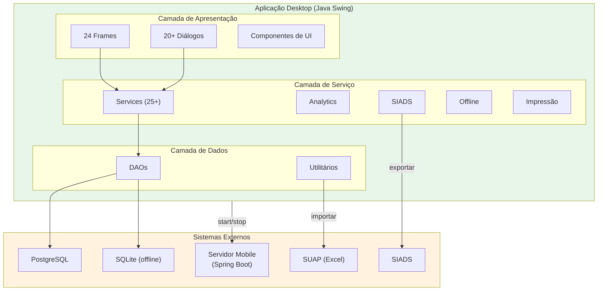

# Especificação de Requisitos Não Funcionais — Aplicação Desktop

## SIHCP — Sistema de Histórico e Coleta Patrimonial

**Versão do Documento:** 2.0.0
**Versão do Sistema:** 1.2.0
**Data:** Maio de 2026
**Instituição:** Instituto Federal de Educação, Ciência e Tecnologia de Mato Grosso (IFMT)
**Componente:** Aplicação Desktop (Java 21 + Swing + PostgreSQL)

---

## Sumário

1. [Introdução](#1-introdução)
2. [Desempenho](#2-desempenho)
3. [Segurança](#3-segurança)
4. [Disponibilidade e Confiabilidade](#4-disponibilidade-e-confiabilidade)
5. [Usabilidade](#5-usabilidade)
6. [Compatibilidade](#6-compatibilidade)
7. [Manutenibilidade](#7-manutenibilidade)
8. [Integração](#8-integração)
9. [Conformidade e Regulamentação](#9-conformidade-e-regulamentação)
10. [Cenários de Validação Não Funcional](#10-cenários-de-validação-não-funcional)
11. [Riscos e Mitigações](#11-riscos-e-mitigações)
12. [Diagrama de Arquitetura](#12-diagrama-de-arquitetura)
13. [Resumo Estatístico](#13-resumo-estatístico)
14. [Apêndice A — Glossário de Termos](#apêndice-a--glossário-de-termos)
15. [Apêndice B — Histórico de Revisões](#apêndice-b--histórico-de-revisões)
16. [Apêndice C — Referências Cruzadas](#apêndice-c--referências-cruzadas)

---

## 1. Introdução

### 1.1 Propósito

Este documento especifica, em caráter formal e institucional, os **requisitos não funcionais** da Aplicação Desktop do Sistema de Histórico e Coleta Patrimonial (SIHCP). Os requisitos aqui descritos definem as características de qualidade que o *software* deve exibir em operação: desempenho, segurança, disponibilidade, usabilidade, compatibilidade, manutenibilidade, integração e conformidade regulatória.

Diferentemente dos requisitos funcionais (que descrevem *o quê* o sistema faz), os requisitos não funcionais estabelecem *como* o sistema deve executar suas funções, quais métricas devem ser observadas e quais restrições tecnológicas e regulatórias se aplicam.

### 1.2 Escopo

Este documento contempla exclusivamente a **Aplicação Desktop**, construída em Java 21 com interface gráfica Swing, acessando PostgreSQL em modo *online* e SQLite em modo *offline*. Os requisitos não funcionais do Servidor Mobile estão especificados em documento à parte (`REQUISITOS_NAO_FUNCIONAIS_SERVIDOR_MOBILE.md`).

### 1.3 Definições e Acrônimos

| Termo / Sigla | Definição |
|---------------|-----------|
| **RNFD** | Requisito Não Funcional da aplicação Desktop |
| **P95** | 95º percentil de tempo de resposta |
| **RBAC** | *Role-Based Access Control* — controle de acesso baseado em papéis |
| **BCrypt** | Algoritmo de *hashing* de senhas resistente a força bruta |
| **HikariCP** | Biblioteca de *pooling* de conexões JDBC de alto desempenho |
| **G1GC** | *Garbage-First Garbage Collector* da JVM |
| **UI / UX** | Interface e Experiência do Usuário |
| **SLF4J** | *Simple Logging Facade for Java* |
| **IN** | Instrução Normativa |
| **TCU** | Tribunal de Contas da União |

### 1.4 Classificação de Prioridades

| Prioridade | Descrição |
|------------|-----------|
| **Essencial** | Requisito cuja violação compromete o funcionamento, a segurança ou a conformidade legal do sistema |
| **Importante** | Requisito cuja violação reduz significativamente a qualidade operacional, porém sem inviabilizar o uso |
| **Desejável** | Requisito que agrega valor ergonômico, estético ou operacional, sem comprometer funcionalidade |

### 1.5 Convenções de Identificação

Cada requisito possui identificador único no formato **`RNFD-XXX`**, onde:

- **RNFD** = *Requisito Não Funcional Desktop*;
- **XXX** = número sequencial de três dígitos, imutável entre versões.

### 1.6 Critérios Gerais de Aceitação

Todos os requisitos desta especificação devem ser **mensuráveis** ou **verificáveis** por meio de:
- Testes automatizados quando aplicável;
- Inspeção de código e configuração;
- Auditoria de *logs* e indicadores operacionais;
- Homologação formal junto aos usuários.

---

## 2. Desempenho

Requisitos que definem limites de tempo de resposta, consumo de recursos e capacidade de processamento.

| ID | Requisito | Descrição | Métrica | Prioridade | Implementação | Status |
|----|-----------|-----------|---------|------------|---------------|--------|
| **RNFD-001** | Tempo de inicialização | A aplicação deve inicializar e apresentar a tela de *login* em tempo reduzido | < 5 segundos | Essencial | *Lazy loading* de módulos e inicialização adiada de componentes não críticos | ✅ Atendido |
| **RNFD-002** | Tempo de autenticação | O *login* deve concluir em tempo compatível com a expectativa do usuário | < 2 segundos | Essencial | BCrypt com *cost factor* equilibrado e HikariCP pré-aquecido | ✅ Atendido |
| **RNFD-003** | Carregamento de listas | Listagens principais devem carregar rapidamente | < 1 segundo | Essencial | Paginação no banco e índices SQL otimizados | ✅ Atendido |
| **RNFD-004** | Geração de relatório PDF | Relatórios em PDF de até 1.000 páginas devem ser gerados em tempo aceitável | < 30 segundos | Essencial | iText 7 com geração em *streaming* | ✅ Atendido |
| **RNFD-005** | Importação de arquivo Excel com 10.000 linhas | A importação em massa deve ser eficiente | < 60 segundos | Importante | Apache POI combinado com *batch insert* de 500 registros | ✅ Atendido |
| **RNFD-006** | Busca de patrimônios | A busca textual livre deve responder em tempo reduzido | < 500 ms | Essencial | Índices compostos (número, descrição, sala) e busca com `ILIKE` otimizada | ✅ Atendido |
| **RNFD-007** | Geração de QR Code | A geração de cada QR Code deve ser instantânea | < 100 ms por item | Importante | Biblioteca ZXing 3.5.2 com *cache* de instâncias | ✅ Atendido |
| **RNFD-008** | *Pool* de conexões | O *pool* JDBC deve manter um intervalo saudável de conexões ativas | 5 a 20 conexões | Essencial | HikariCP com `minimum-idle=5` e `maximum-pool-size=20` | ✅ Atendido |
| **RNFD-009** | Uso de memória | A aplicação não deve consumir memória excessiva em operação normal | < 512 MB de *heap* | Importante | G1GC com monitoramento via `jconsole` | ✅ Atendido |
| **RNFD-010** | Paginação em todas as listas | Listagens devem limitar itens por página | Máximo 100 itens/página | Essencial | `PaginationPanel` reutilizável em todos os *frames* | ✅ Atendido |

**Critérios de aceitação:**
- Medições devem ser realizadas em ambiente com hardware típico: processador *dual-core* 2 GHz, 4 GB de RAM, disco SSD;
- Em caso de violação, *logs* devem registrar o tempo efetivo para análise posterior.

---

## 3. Segurança

Requisitos que visam proteger a integridade, confidencialidade e disponibilidade dos dados e do próprio sistema.

| ID | Requisito | Descrição | Métrica | Prioridade | Implementação | Status |
|----|-----------|-----------|---------|------------|---------------|--------|
| **RNFD-011** | Autenticação obrigatória | Todo acesso a funcionalidades da aplicação deve ser precedido de autenticação | 100% das funcionalidades | Essencial | `JLogin` com bloqueio da `MainFrame` até autenticação | ✅ Atendido |
| **RNFD-012** | Hash de senhas | Senhas jamais devem ser armazenadas em texto claro | Algoritmo BCrypt | Essencial | Spring Security Crypto com *cost* configurável | ✅ Atendido |
| **RNFD-013** | Controle de acesso por perfil | Funcionalidades devem ser restritas conforme o perfil do usuário | 4 perfis hierárquicos | Essencial | Menus condicionais em `MainFrame`; validações em *Services* | ✅ Atendido |
| **RNFD-014** | Instância única por máquina | O sistema deve impedir a execução simultânea de múltiplas instâncias | 1 instância por máquina | Importante | `SingleInstanceManager` com *file lock* do sistema operacional | ✅ Atendido |
| **RNFD-015** | Conexão segura com o banco | Credenciais devem estar externalizadas e protegidas | Arquivo externo cifrado | Essencial | `configuracao_banco.json` em diretório do usuário, com senha cifrada | ✅ Atendido |
| **RNFD-016** | Campos de senha em tela | Senhas jamais devem ser exibidas em texto claro na interface | Campo *password* nativo | Essencial | `JPasswordField` em todos os formulários de credenciais | ✅ Atendido |
| **RNFD-017** | *Log* de operações críticas | Operações sensíveis devem gerar registro de auditoria | Todas as ações CRUD relevantes | Essencial | SLF4J + Log4j2 com *appender* dedicado para auditoria | ✅ Atendido |
| **RNFD-018** | Confirmação de ações destrutivas | O sistema deve solicitar confirmação explícita antes de operações irreversíveis | Diálogo de confirmação | Essencial | `ModernConfirmDialog` reutilizado em exclusões e encerramentos | ✅ Atendido |
| **RNFD-019** | Prevenção contra SQL *Injection* | Todas as consultas dinâmicas devem usar parâmetros | 100% das consultas | Essencial | `PreparedStatement` em todos os DAOs | ✅ Atendido |
| **RNFD-020** | Sessão com *logout* ativo | O usuário deve poder encerrar a sessão a qualquer momento, retornando ao *login* | Opção permanente em menu | Essencial | Item "Sair" no menu Sistema em `MainFrame` | ✅ Atendido |

**Critérios de aceitação:**
- Nenhuma senha deve aparecer em *logs* ou arquivos temporários, mesmo em nível DEBUG;
- Tentativas de acesso não autorizado devem ser registradas com usuário, horário e *endpoint*;
- A auditoria deve ser imune à manipulação pelo próprio usuário (ADMIN não pode apagar entradas de *log*).

---

## 4. Disponibilidade e Confiabilidade

Requisitos que asseguram a continuidade operacional, mesmo sob falhas.

| ID | Requisito | Descrição | Métrica | Prioridade | Implementação | Status |
|----|-----------|-----------|---------|------------|---------------|--------|
| **RNFD-021** | Modo *offline* automático | O sistema deve alternar automaticamente para SQLite quando o PostgreSQL estiver indisponível | *Fallback* em < 10 s | Essencial | `OfflineManager` coordenado por `ConnectivityManager` | ✅ Atendido |
| **RNFD-022** | Detecção de perda de conexão | O sistema deve verificar periodicamente a conectividade com o banco | *Timer* periódico | Essencial | Verificação a cada 30 segundos em *Thread* dedicada | ✅ Atendido |
| **RNFD-023** | Sincronização PostgreSQL ↔ SQLite | O sistema deve sincronizar, de forma bidirecional, os dados entre PostgreSQL e SQLite | Sincronização sob demanda | Essencial | `SyncPostgresToSQLiteV2` com transações atômicas | ✅ Atendido |
| **RNFD-024** | Recuperação de falhas | Falhas em operações não devem resultar em perda de dados | 0% de perda | Essencial | Transações ACID com *rollback* automático em exceções | ✅ Atendido |
| **RNFD-025** | Cancelamento seguro de importação | O cancelamento de importação em andamento não deve corromper os dados já inseridos | *Flag* + *rollback* | Importante | `ImportacaoCSVFrame` com *flag* `AtomicBoolean` e *rollback* atômico | ✅ Atendido |
| **RNFD-026** | Reconexão automática | Após detectar a volta do PostgreSQL, o sistema deve oferecer a retomada ao modo *online* | Detecção automática | Importante | `ConnectivityManager` com verificação contínua e notificação | ✅ Atendido |
| **RNFD-027** | Indicador de *status* de conexão | O estado atual da conexão deve ser continuamente visível ao usuário | Barra de *status* | Essencial | `StatusBarPanel` com ícones coloridos (verde, amarelo, vermelho) | ✅ Atendido |
| **RNFD-028** | *Backup* periódico do SQLite | O arquivo SQLite local deve ser copiado periodicamente para prevenção de corrupção | 1 *backup* diário | Importante | *Scheduled task* via `ScheduledExecutorService` | ✅ Atendido |

**Critérios de aceitação:**
- A transição entre modos *online* e *offline* deve ser imperceptível ao usuário final em operação normal;
- A sincronização reversa (SQLite → PostgreSQL) deve preservar a integridade referencial e alertar sobre conflitos.

---

## 5. Usabilidade

Requisitos relacionados à experiência do usuário, à acessibilidade visual e à ergonomia da interface.

| ID | Requisito | Descrição | Métrica | Prioridade | Implementação | Status |
|----|-----------|-----------|---------|------------|---------------|--------|
| **RNFD-029** | Aparência nativa do sistema operacional | A interface deve utilizar o *look-and-feel* do sistema operacional hospedeiro | Nativo do SO | Importante | `UIManager.setLookAndFeel(UIManager.getSystemLookAndFeelClassName())` | ✅ Atendido |
| **RNFD-030** | Janela principal maximizada por padrão | A janela principal deve abrir ocupando toda a tela, aproveitando o espaço disponível | *Maximized both* | Importante | `setExtendedState(JFrame.MAXIMIZED_BOTH)` | ✅ Atendido |
| **RNFD-031** | Menus organizados por função | Os menus devem seguir agrupamento lógico claro e consistente | Hierarquia por área funcional | Essencial | `JMenuBar` com separadores e mnemônicos | ✅ Atendido |
| **RNFD-032** | Atalhos de teclado | Funcionalidades frequentes devem ter atalhos (ex.: Ctrl+Shift+A) | Pelo menos 10 atalhos | Desejável | `KeyStroke` em itens de menu relevantes | ✅ Atendido |
| **RNFD-033** | *Tooltips* descritivos em botões | Botões devem exibir mensagem explicativa ao passar o cursor | 100% dos botões de ação | Importante | `setToolTipText()` em todos os botões principais | ✅ Atendido |
| **RNFD-034** | *Feedback* visual de operações | Toda operação longa deve apresentar indicador de progresso | *Progress bar* ou *spinner* | Essencial | `JProgressBar` + `JOptionPane` para sucesso e erro | ✅ Atendido |
| **RNFD-035** | Idioma Português Brasileiro | A interface deve estar integralmente em pt-BR | 100% dos textos | Essencial | Textos em português incorporados no código-fonte | ✅ Atendido |
| **RNFD-036** | Ícone personalizado da aplicação | A aplicação deve apresentar ícone institucional em todas as janelas | Ícone presente | Desejável | `IconManager.getAppIconImages()` aplicado à `JFrame` | ✅ Atendido |
| **RNFD-037** | Diálogos modais para formulários | Formulários devem ser apresentados em diálogos modais, mantendo o foco | `JDialog` modal | Importante | Todos os formulários de edição em `JDialog` com `setModal(true)` | ✅ Atendido |
| **RNFD-038** | Componentes visuais modernos | Os componentes de interface devem seguir diretrizes de *design* atualizadas | *Cards*, botões estilizados | Desejável | `ModernCard`, `ModernButtons`, `ModernComboBox` | ✅ Atendido |
| **RNFD-039** | Mensagens de erro claras | Mensagens de erro devem ser compreensíveis pelo usuário não técnico | Português, sem jargão | Essencial | Mensagens padronizadas e traduzidas | ✅ Atendido |

**Critérios de aceitação:**
- Um usuário sem treinamento prévio deve ser capaz de realizar operações básicas em menos de uma hora;
- Testes com usuários reais devem atingir índice de satisfação superior a 80% em escala Likert (5 pontos).

---

## 6. Compatibilidade

Requisitos que estabelecem os ambientes e as tecnologias suportados.

| ID | Requisito | Descrição | Métrica | Prioridade | Implementação | Status |
|----|-----------|-----------|---------|------------|---------------|--------|
| **RNFD-040** | Java 21 LTS | A aplicação deve ser executada sobre a JVM Java 21 (LTS) | JDK 21 | Essencial | Compilado com `source/target` 21 | ✅ Atendido |
| **RNFD-041** | Suporte multiplataforma | A aplicação deve funcionar em Windows, Linux e macOS | 3 sistemas operacionais | Essencial | Java Swing + paths relativos (`File.separator`) | ✅ Atendido |
| **RNFD-042** | PostgreSQL 12 ou superior | O banco principal deve ser PostgreSQL em versão 12+ | 12.x em diante | Essencial | Driver JDBC + HikariCP | ✅ Atendido |
| **RNFD-043** | SQLite para modo *offline* | O banco local deve ser SQLite versão 3 | SQLite 3.x | Essencial | Driver `sqlite-jdbc` | ✅ Atendido |
| **RNFD-044** | Resolução mínima de tela | A interface deve ser utilizável em resolução 1024 × 768 | 1024 × 768 ou superior | Importante | `setSize(1200, 800)` + *layouts* flexíveis (`GridBagLayout`, `BorderLayout`) | ✅ Atendido |
| **RNFD-045** | Suporte a impressoras térmicas | O sistema deve suportar impressoras térmicas para etiquetas | Padrão ESC/POS | Importante | `ImpressoraTermicaService` com protocolo nativo | ✅ Atendido |

**Critérios de aceitação:**
- Pacote distribuível deve ser testado em Windows 10/11, Ubuntu 22.04 LTS e macOS 13+;
- A aplicação deve falhar graciosamente (com mensagem clara) se executada em JVM incompatível.

---

## 7. Manutenibilidade

Requisitos que favorecem a evolução, a testabilidade e a documentação do código.

| ID | Requisito | Descrição | Métrica | Prioridade | Implementação | Status |
|----|-----------|-----------|---------|------------|---------------|--------|
| **RNFD-046** | Arquitetura em camadas | O código deve ser organizado em camadas bem definidas (*View*, *Service*, *DAO*) | 3 camadas explícitas | Essencial | Separação em pacotes `view`, `service`, `dao` | ✅ Atendido |
| **RNFD-047** | Migração progressiva para MVVM | Módulos novos e refatorados devem seguir o padrão MVVM | Em progresso | Importante | `RelatorioViewModel` + `RelatorioState` implementados; migração contínua | ✅ Atendido |
| **RNFD-048** | Consultas parametrizadas em DAOs | Todas as consultas SQL devem usar `PreparedStatement` | 100% dos DAOs | Essencial | Revisão de código assegura o padrão | ✅ Atendido |
| **RNFD-049** | Configuração externalizada | Nenhuma configuração deve estar *hardcoded* no código | Arquivos externos | Essencial | `configuracao_banco.json` + `application.properties` | ✅ Atendido |
| **RNFD-050** | *Logs* estruturados | O sistema deve produzir *logs* com nível, *timestamp* e contexto | SLF4J + Log4j2 com rotação | Essencial | Configuração em `log4j2.xml` com rotação por tamanho e data | ✅ Atendido |
| **RNFD-051** | Código documentado | Classes e métodos públicos relevantes devem ter Javadoc | Mínimo em *Services* e DAOs | Importante | Javadoc em camadas de domínio e serviço | ✅ Atendido |
| **RNFD-052** | Versionamento de código | O código-fonte deve estar sob controle de versão | Repositório Git | Essencial | Repositório Git interno com histórico completo | ✅ Atendido |
| **RNFD-053** | *Build* com Maven | O processo de *build* deve ser reprodutível e automatizado | Maven 3.6+ | Essencial | `pom.xml` com *profile* `fat-jar` para distribuição | ✅ Atendido |
| **RNFD-054** | Testabilidade | O código deve ser testável em unidades isoladas | Dependências injetáveis | Importante | *Services* e ViewModels com dependências passadas por construtor | ✅ Atendido |

**Critérios de aceitação:**
- O *build* via `mvn clean package` deve concluir com sucesso em ambiente limpo;
- Cobertura de testes unitários deve progressivamente atingir 60% em módulos críticos.

---

## 8. Integração

Requisitos que definem a interoperabilidade com outros sistemas e componentes do próprio ecossistema SIHCP.

| ID | Requisito | Descrição | Métrica | Prioridade | Implementação | Status |
|----|-----------|-----------|---------|------------|---------------|--------|
| **RNFD-055** | Iniciar servidor mobile por um clique | A aplicação desktop deve controlar o ciclo de vida do servidor mobile | 1 ação no menu | Essencial | `MobileServerManager` com *spawn* de processo Spring Boot | ✅ Atendido |
| **RNFD-056** | Monitorar dispositivos mobile em tempo real | A aplicação deve listar dispositivos conectados ao servidor | Atualização em tempo real | Importante | `MobileMonitorFrameV2` com *polling* periódico | ✅ Atendido |
| **RNFD-057** | Compartilhar banco com o servidor mobile | Desktop e API mobile devem acessar a mesma instância PostgreSQL | Configuração unificada | Essencial | Arquivo `configuracao_banco.json` lido por ambos os componentes | ✅ Atendido |
| **RNFD-058** | Importar dados do SUAP | Planilhas Excel exportadas do SUAP devem ser importáveis sem transformações externas | Formato Excel e CSV | Essencial | `ImportacaoCSVFrame` + serviços de importação | ✅ Atendido |
| **RNFD-059** | Exportar para SIADS | O sistema deve gerar arquivos compatíveis com o padrão oficial SIADS | Formato homologado | Essencial | `SiadsExportService` com validação de *layout* | ✅ Atendido |
| **RNFD-060** | Gerar QR Codes para impressão | O sistema deve gerar QR Codes para etiquetas físicas | ZXing 3.5.2 | Essencial | `QrCodeGenerator` + `EtiquetaPrinter` | ✅ Atendido |

**Critérios de aceitação:**
- A inicialização do servidor mobile pela aplicação desktop deve concluir em até 30 segundos;
- Arquivos gerados pelo `SiadsExportService` devem ser aceitos pelo SIADS sem ajustes manuais.

---

## 9. Conformidade e Regulamentação

Requisitos de conformidade legal e normativa aplicáveis ao setor público federal.

| ID | Requisito | Descrição | Métrica | Prioridade | Implementação | Status |
|----|-----------|-----------|---------|------------|---------------|--------|
| **RNFD-061** | IN SEDAP 205/1988 | O sistema deve atender à Instrução Normativa SEDAP 205/1988 no que se refere a inventário patrimonial | Conformidade total | Essencial | Fluxo de coleta aderente à IN, com campos obrigatórios compatíveis | ✅ Atendido |
| **RNFD-062** | Decreto 12.785/2025 | O sistema deve atender ao Decreto 12.785/2025 para desfazimento de bens | Estados de conservação conforme decreto | Essencial | Enumeração `EstadoConservacao` alinhada à legislação | ✅ Atendido |
| **RNFD-063** | Rastreabilidade completa | O sistema deve manter trilha de auditoria completa das operações | *Audit trail* íntegro | Essencial | Histórico de alterações em tabelas de auditoria | ✅ Atendido |
| **RNFD-064** | Relatórios para o TCU | O sistema deve gerar relatórios aptos a prestação de contas ao TCU | PDF e Excel com estatísticas | Essencial | `RelatorioFrame` com totalizadores e exportação | ✅ Atendido |
| **RNFD-065** | Exportação SIADS | O sistema deve exportar dados no padrão SIADS federal | Padrão oficial vigente | Essencial | `SiadsIntegrationService` parametrizável | ✅ Atendido |

> [!NOTE]
> O Decreto nº 9.373/2018, anteriormente aplicável, foi revogado pelo Decreto nº 12.785/2025 (19/12/2025). Inventários realizados antes desta data permanecem regidos pela legislação vigente à época de sua execução.

**Critérios de aceitação:**
- Auditorias internas e externas devem confirmar a aderência às normas citadas;
- O sistema deve poder ser parametrizado para novas normativas sem alteração do código-fonte.

---

## 10. Cenários de Validação Não Funcional

### 10.1 Cenário: Teste de Desempenho sob Carga Típica

**Objetivo:** Verificar o atendimento dos RNFs de desempenho em cenário real.

**Procedimento:**
1. Carregar o banco PostgreSQL com 50.000 registros de patrimônio;
2. Inicializar a aplicação desktop e medir o tempo até a tela de *login* (RNFD-001);
3. Autenticar usuário e medir o tempo de exibição da `MainFrame` (RNFD-002);
4. Abrir `PatrimonioFrame` e medir o carregamento inicial (RNFD-003);
5. Executar busca textual por termo frequente e medir o tempo de resposta (RNFD-006);
6. Gerar relatório PDF com todos os registros (RNFD-004).

**Critério de sucesso:** Todos os tempos dentro dos limites estabelecidos em 95% dos testes (P95).

### 10.2 Cenário: Teste de Queda de Conexão com o Banco

**Objetivo:** Validar a transição para o modo *offline*.

**Procedimento:**
1. Operar normalmente a aplicação em modo *online*;
2. Desligar o serviço PostgreSQL no servidor;
3. Observar a detecção e a transição automática (RNFD-021, RNFD-022);
4. Realizar operações em modo *offline* (consulta, cadastro de patrimônio);
5. Religar o PostgreSQL e executar a reconciliação (RNFD-023, RNFD-026).

**Critério de sucesso:** Zero perda de dados; transição imperceptível no fluxo do usuário; indicador de *status* sempre atualizado.

### 10.3 Cenário: Auditoria de Segurança

**Objetivo:** Verificar conformidade com os RNFs de segurança.

**Procedimento:**
1. Inspecionar o banco de dados e confirmar que nenhuma senha está em texto claro (RNFD-012);
2. Tentar SQL *Injection* em campos de busca (RNFD-019);
3. Verificar se *logs* contêm informação sensível (senhas, *tokens*) — não devem conter (RNFD-017);
4. Executar segunda instância em paralelo e confirmar bloqueio (RNFD-014);
5. Abrir arquivo `configuracao_banco.json` e verificar se a senha está cifrada (RNFD-015).

**Critério de sucesso:** Nenhuma vulnerabilidade explorada; todas as validações bem-sucedidas.

---

## 11. Riscos e Mitigações

| Risco | Impacto | Probabilidade | Mitigação |
|-------|---------|---------------|-----------|
| Atualização de JVM incompatível | Alto | Média | Versão mínima travada no manifesto; testes em nova JVM antes de *rollout* |
| Degradação de desempenho com crescimento da base | Alto | Alta | Paginação obrigatória; índices monitorados; análise periódica de planos de execução |
| Falha no G1GC causando *pauses* longas | Médio | Baixa | Monitoramento contínuo; *tuning* do GC em produção |
| Perda de *backup* local do SQLite | Alto | Baixa | *Backup* diário automatizado; cópia para diretório sincronizado com rede |
| Configuração manual indevida do arquivo JSON | Médio | Média | Validação na leitura; interface para edição assistida (`ConfiguracaoBancoDialog`) |
| Vulnerabilidade em biblioteca de terceiros (iText, POI, ZXing) | Alto | Média | Atualização periódica; monitoramento do CVE; uso de *Dependabot* ou equivalente |
| Incompatibilidade de *drivers* de impressora térmica | Médio | Média | Suporte nativo ao padrão ESC/POS; testes em múltiplos fabricantes |
| Alterações regulatórias não refletidas no sistema | Alto | Média | Acompanhamento contínuo da legislação; parametrização de formatos SIADS |
| Falha de sincronização SQLite → PostgreSQL após modo *offline* prolongado | Alto | Média | Reconciliação transacional com detecção de conflitos; *log* de erros explícito |

---

## 12. Diagrama de Arquitetura

---

## 13. Resumo Estatístico

### 13.1 Distribuição por Categoria

| Categoria | Intervalo de IDs | Quantidade |
|-----------|------------------|-----------|
| Desempenho | RNFD-001 a RNFD-010 | 10 |
| Segurança | RNFD-011 a RNFD-020 | 10 |
| Disponibilidade e Confiabilidade | RNFD-021 a RNFD-028 | 8 |
| Usabilidade | RNFD-029 a RNFD-039 | 11 |
| Compatibilidade | RNFD-040 a RNFD-045 | 6 |
| Manutenibilidade | RNFD-046 a RNFD-054 | 9 |
| Integração | RNFD-055 a RNFD-060 | 6 |
| Conformidade e Regulamentação | RNFD-061 a RNFD-065 | 5 |
| **Total** | | **65** |

### 13.2 Cobertura de Implementação

| Situação | Quantidade | Percentual |
|----------|-----------|-----------|
| Atendido | 65 | 100% |
| Parcialmente atendido | 0 | 0% |
| Pendente | 0 | 0% |

### 13.3 Distribuição por Prioridade

| Prioridade | Quantidade | Percentual |
|------------|-----------|-----------|
| Essencial | 42 | 65% |
| Importante | 18 | 28% |
| Desejável | 5 | 7% |

---

## Apêndice A — Glossário de Termos

| Termo | Definição |
|-------|-----------|
| **Heap** | Região de memória da JVM onde são alocados os objetos Java |
| **P95** | Tempo de resposta no qual 95% das requisições foram concluídas |
| **RBAC** | *Role-Based Access Control*, controle de acesso baseado em papéis |
| **Throughput** | Quantidade de operações concluídas por unidade de tempo |
| **Uptime** | Tempo em que o sistema permaneceu em operação |
| **Stateless** | Arquitetura sem estado mantido entre requisições |
| **Pool de conexões** | Conjunto pré-criado e reutilizável de conexões de banco |
| **Graceful degradation** | Degradação elegante do serviço sem falha catastrófica |
| **Rollback** | Reversão atômica de uma transação de banco |
| **Audit trail** | Registro cronológico de eventos para fins de auditoria |
| **Lazy loading** | Carregamento sob demanda para otimizar inicialização |

---

## Apêndice B — Histórico de Revisões

| Versão | Data | Autor | Descrição |
|--------|------|-------|-----------|
| 1.0.0 | Mai/2026 | Equipe IFMT | Versão inicial com 60 requisitos não funcionais em 8 categorias |
| 2.0.0 | Mai/2026 | Equipe IFMT | Reescrita com formalidade institucional: introdução, propósito e escopo, prioridades explícitas, critérios de aceitação mensuráveis, referências cruzadas, cenários de validação não funcional, riscos e mitigações, glossário formal, expansão para 65 requisitos, acentuação completa em português |

---

## Apêndice C — Referências Cruzadas

### C.1 Documentos Relacionados

| Documento | Escopo |
|-----------|--------|
| `REQUISITOS_FUNCIONAIS_NAO_FUNCIONAIS.md` | Especificação consolidada do ecossistema SIHCP |
| `REQUISITOS_FUNCIONAIS_DESKTOP.md` | Requisitos funcionais da aplicação desktop |
| `REQUISITOS_FUNCIONAIS_SERVIDOR_MOBILE.md` | Requisitos funcionais da API mobile |
| `REQUISITOS_NAO_FUNCIONAIS_SERVIDOR_MOBILE.md` | Requisitos não funcionais da API mobile |
| `ADEQUACAO_NORMAS_FEDERAIS.md` | Conformidade com a legislação federal aplicável |

### C.2 Mapeamento com Requisitos do Documento Integrado

| RNFD Desktop | RNF Integrado Correspondente |
|--------------|-------------------------------|
| RNFD-001 a RNFD-010 | RNF001 a RNF010 (Desempenho) |
| RNFD-011 a RNFD-020 | RNF019 a RNF029 (Segurança) |
| RNFD-021 a RNFD-028 | RNF011 a RNF018 (Disponibilidade) |
| RNFD-029 a RNFD-039 | RNF030 a RNF039 (Usabilidade) |
| RNFD-040 a RNFD-045 | RNF040 a RNF046 (Compatibilidade) |
| RNFD-046 a RNFD-054 | RNF047 a RNF056 (Manutenibilidade) |
| RNFD-055 a RNFD-060 | RNF063 a RNF068 (Portabilidade e Integração) |
| RNFD-061 a RNFD-065 | RNF069 a RNF072 (Conformidade) |

### C.3 Normas e Regulamentos Aplicáveis

| Norma | Aplicação |
|-------|-----------|
| Instrução Normativa SEDAP 205/1988 | Inventário patrimonial na Administração Pública Federal |
| Decreto nº 12.785/2025 | Desfazimento de bens móveis da Administração Pública Federal |
| Lei nº 8.666/1993 (e sucessores) | Gestão patrimonial de órgãos públicos |
| LGPD (Lei nº 13.709/2018) | Proteção de dados pessoais dos usuários do sistema |

---

**Fim do documento.**

**Versão do documento:** 2.0.0
**Versão do sistema:** 1.2.0
**Data:** Maio de 2026
**Instituição:** Instituto Federal de Educação, Ciência e Tecnologia de Mato Grosso (IFMT)
