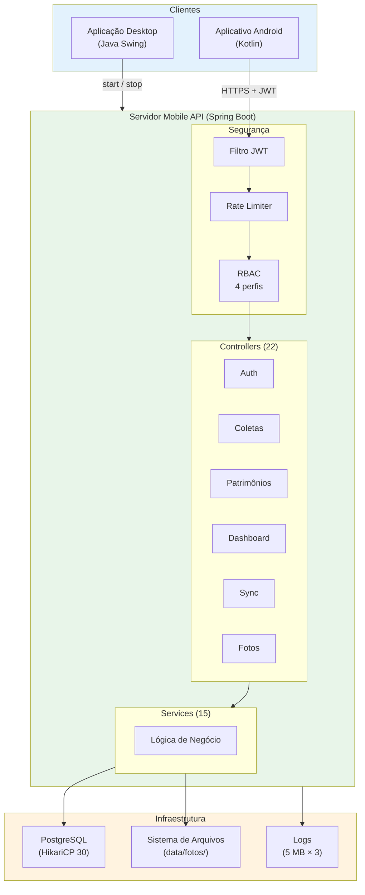

# Especificação de Requisitos Não Funcionais — Servidor Mobile API

## SIHCP — Sistema de Histórico e Coleta Patrimonial

**Versão do Documento:** 2.0.0
**Versão do Servidor:** 5.1.0
**Data:** Maio de 2026
**Instituição:** Instituto Federal de Educação, Ciência e Tecnologia de Mato Grosso (IFMT)
**Componente:** Servidor Mobile API (Spring Boot 3.2.0 + Java 21)

---

## Sumário

1. [Introdução](#1-introdução)
2. [Desempenho](#2-desempenho)
3. [Segurança](#3-segurança)
4. [Disponibilidade e Confiabilidade](#4-disponibilidade-e-confiabilidade)
5. [Escalabilidade](#5-escalabilidade)
6. [Manutenibilidade](#6-manutenibilidade)
7. [Portabilidade e Implantação](#7-portabilidade-e-implantação)
8. [Monitoramento e Observabilidade](#8-monitoramento-e-observabilidade)
9. [Armazenamento de Fotos](#9-armazenamento-de-fotos)
10. [Compatibilidade](#10-compatibilidade)
11. [Configuração de Rede para Clientes Mobile](#11-configuração-de-rede-para-clientes-mobile)
12. [Cenários de Validação Não Funcional](#12-cenários-de-validação-não-funcional)
13. [Riscos e Mitigações](#13-riscos-e-mitigações)
14. [Diagrama de Arquitetura](#14-diagrama-de-arquitetura)
15. [Resumo Estatístico](#15-resumo-estatístico)
16. [Apêndice A — Glossário de Termos](#apêndice-a--glossário-de-termos)
17. [Apêndice B — Histórico de Revisões](#apêndice-b--histórico-de-revisões)
18. [Apêndice C — Referências Cruzadas](#apêndice-c--referências-cruzadas)

---

## 1. Introdução

### 1.1 Propósito

Este documento especifica, em caráter formal e institucional, os **requisitos não funcionais** do Servidor Mobile API do Sistema de Histórico e Coleta Patrimonial (SIHCP). Define as características de qualidade que o *backend* deve exibir em operação: desempenho, segurança, disponibilidade, escalabilidade, manutenibilidade, portabilidade, observabilidade e conformidade operacional.

Os requisitos aqui estabelecidos complementam os requisitos funcionais descritos em `REQUISITOS_FUNCIONAIS_SERVIDOR_MOBILE.md` e são insumo obrigatório para a homologação, monitoramento operacional e evolução do componente.

### 1.2 Escopo

Este documento contempla exclusivamente o **Servidor Mobile API**, em seus aspectos não funcionais. Características funcionais estão descritas em documento específico; características da aplicação desktop estão em `REQUISITOS_NAO_FUNCIONAIS_DESKTOP.md`.

### 1.3 Definições e Acrônimos

| Termo / Sigla | Definição |
|---------------|-----------|
| **RNFS** | Requisito Não Funcional do Servidor mobile |
| **P95** | 95º percentil de tempo de resposta |
| **GZIP** | Algoritmo de compressão HTTP |
| **JWT** | *JSON Web Token* |
| **RBAC** | *Role-Based Access Control* |
| **CORS** | *Cross-Origin Resource Sharing* |
| **HikariCP** | Biblioteca de *pooling* de conexões JDBC de alto desempenho |
| **JVM** | *Java Virtual Machine* |
| **GC** | *Garbage Collector* |
| **G1GC** | *Garbage-First Garbage Collector* |
| **OOM** | *Out of Memory* — condição de exaustão de memória |
| **TTL** | *Time to Live* — tempo de vida |
| **SLF4J** | *Simple Logging Facade for Java* |
| **LGPD** | Lei Geral de Proteção de Dados (Lei nº 13.709/2018) |

### 1.4 Classificação de Prioridades

| Prioridade | Descrição |
|------------|-----------|
| **Essencial** | Requisito cuja violação compromete o funcionamento, a segurança ou a conformidade do servidor |
| **Importante** | Requisito cuja violação reduz significativamente a qualidade operacional ou a experiência do cliente |
| **Desejável** | Requisito que agrega valor operacional ou analítico, sem ser crítico |

### 1.5 Convenções de Identificação

Cada requisito possui identificador único no formato **`RNFS-XXX`**, imutável entre versões. Todos devem ser **mensuráveis ou verificáveis** por meio de testes automatizados, inspeção de código, monitoramento em produção ou auditoria de *logs*.

---

## 2. Desempenho

Requisitos que definem limites de tempo de resposta, capacidade de processamento e consumo de recursos.

| ID | Requisito | Descrição | Métrica | Prioridade | Implementação | Status |
|----|-----------|-----------|---------|------------|---------------|--------|
| **RNFS-001** | Tempo de resposta da API | A API deve responder às requisições em tempo reduzido | < 500 ms (P95) | Essencial | Paginação obrigatória, índices SQL e *queries* otimizadas | ✅ Atendido |
| **RNFS-002** | Tempo de *login* | A autenticação deve concluir rapidamente | < 2 segundos | Essencial | JWT *stateless* e pré-aquecimento do *pool* | ✅ Atendido |
| **RNFS-003** | Sincronização em lote de 50 coletas | O *batch* de coletas deve ser processado eficientemente | < 5 segundos | Essencial | Transação única com *batch insert* Hibernate | ✅ Atendido |
| **RNFS-004** | Sincronização *offline* completa | A carga inicial de dados deve concluir em tempo aceitável | < 30 segundos | Essencial | *Endpoint* dedicado `/offline-data` com *queries* agregadas | ✅ Atendido |
| **RNFS-005** | *Throughput* | O servidor deve suportar carga concorrente | > 100 requisições/segundo | Essencial | Tomcat com 50 *threads* e HikariCP com 30 conexões | ✅ Atendido |
| **RNFS-006** | Uso de memória | O servidor deve operar com consumo moderado de memória | < 384 MB de *heap* | Importante | `-Xmx384m` com G1GC agressivo | ✅ Atendido |
| **RNFS-007** | Compressão de resposta | Respostas devem ser comprimidas quando significativas | GZIP para > 512 *bytes* | Importante | `server.compression.enabled=true` | ✅ Atendido |
| **RNFS-008** | Paginação obrigatória | Toda listagem deve ser paginada | Máximo 100 itens por página | Essencial | `PagedResponse` aplicado em todos os *controllers* | ✅ Atendido |
| **RNFS-009** | *Queries* otimizadas | Contagens e agregações devem ser feitas no banco, não em memória | Sem carregar listas completas | Essencial | Uso de `GROUP BY`, `COUNT` e agregações SQL | ✅ Atendido |
| **RNFS-010** | *Pool* de conexões | O *pool* JDBC deve manter faixa adequada de conexões | 5 a 30 conexões | Essencial | HikariCP com `keepaliveTime=120000` | ✅ Atendido |

**Critérios de aceitação:**
- Medições devem ser realizadas em ambiente semelhante ao de produção, com carga representativa;
- Requisições que ultrapassem os limites devem ser registradas em *log* para análise posterior.

---

## 3. Segurança

Requisitos que visam proteger a confidencialidade, integridade e disponibilidade dos dados e do próprio servidor.

| ID | Requisito | Descrição | Métrica | Prioridade | Implementação | Status |
|----|-----------|-----------|---------|------------|---------------|--------|
| **RNFS-011** | Autenticação JWT obrigatória | Todos os *endpoints* privados devem exigir *token* JWT válido | 100% dos *endpoints* protegidos | Essencial | `MobileSecurityConfig` + filtro JWT | ✅ Atendido |
| **RNFS-012** | Controle de acesso RBAC | O acesso deve ser restrito conforme o perfil | 4 perfis hierárquicos | Essencial | `@PreAuthorize` e anotações customizadas (`@RequireAdmin`, `@RequireSupervisor`, `@RequireColetor`, `@RequireConsulta`) | ✅ Atendido |
| **RNFS-013** | *Rate limiting* no *login* | O *login* deve ter limite de tentativas por IP | 10 tentativas/minuto | Essencial | `LoginRateLimiter` com algoritmo *token bucket* | ✅ Atendido |
| **RNFS-014** | Detecção de força bruta | O sistema deve gerar alerta em caso de ataques coordenados | Alerta após 3 bloqueios em 5 min | Essencial | *Log* de auditoria `RATE_LIMIT_ALERT` | ✅ Atendido |
| **RNFS-015** | *Blacklist* de *tokens* no *logout* | *Tokens* invalidados devem ser rejeitados imediatamente | Invalidação imediata | Essencial | `ConcurrentHashMap` com TTL até a expiração natural | ✅ Atendido |
| **RNFS-016** | *Hash* de senhas com BCrypt | Senhas não devem ser armazenadas em texto claro | Algoritmo BCrypt | Essencial | `BCryptPasswordEncoder` com *cost* configurável | ✅ Atendido |
| **RNFS-017** | CORS restritivo | Requisições *cross-origin* devem ser restritas a origens explícitas | Sem curingas | Essencial | Lista explícita de IPs e domínios autorizados | ✅ Atendido |
| **RNFS-018** | Sessão *stateless* | O servidor não deve manter estado de sessão | Sem *cookies* de sessão | Essencial | `SessionCreationPolicy.STATELESS` | ✅ Atendido |
| **RNFS-019** | Validação de entrada | Todas as entradas do cliente devem ser validadas | 100% dos *payloads* | Essencial | `@Valid` + validações manuais nos *services* | ✅ Atendido |
| **RNFS-020** | Sanitização de *logs* | *Logs* não devem conter *tokens*, senhas ou dados pessoais sensíveis | Sem exposição de segredos | Essencial | Política de *logging* auditada em revisão de código | ✅ Atendido |
| **RNFS-021** | Senhas não retornadas em respostas | Respostas da API não devem conter o *hash* de senha | `senhaHash` removida antes de serializar | Essencial | `setSenhaHash(null)` em `MobileUsuarioController` | ✅ Atendido |
| **RNFS-022** | Expiração configurável de *tokens* | Prazos de *access* e *refresh token* devem ser parametrizáveis | 2 dias / 14 dias (padrão) | Essencial | Propriedades `jwt.access-token-expiration-ms` e `jwt.refresh-token-expiration-ms` | ✅ Atendido |
| **RNFS-023** | Suporte a `X-Forwarded-For` | IP real deve ser obtido corretamente mesmo atrás de *proxy* reverso | Detecção de IP de origem | Importante | `LoginRateLimiter.resolveClientIp()` | ✅ Atendido |
| **RNFS-024** | Segredos via variáveis de ambiente | Segredos não devem constar em arquivos versionados | Placeholders no `properties` | Essencial | `JWT_SECRET`, `DATASOURCE_PASSWORD` injetados via ambiente | ✅ Atendido |

**Critérios de aceitação:**
- Auditoria de código deve confirmar que não há segredos em repositório;
- Testes de segurança devem validar que *tokens* expirados, inválidos ou na *blacklist* são rejeitados;
- Conformidade com a LGPD deve ser verificada em processos de auditoria.

---

## 4. Disponibilidade e Confiabilidade

Requisitos que asseguram a continuidade operacional do servidor, mesmo sob falhas parciais.

| ID | Requisito | Descrição | Métrica | Prioridade | Implementação | Status |
|----|-----------|-----------|---------|------------|---------------|--------|
| **RNFS-025** | Disponibilidade em horário operacional | O servidor deve permanecer disponível durante os períodos de uso | > 99% *uptime* | Essencial | Verificação de saúde contínua e auto-recuperação | ✅ Atendido |
| **RNFS-026** | *Graceful shutdown* | O servidor deve encerrar sem perder requisições em andamento | Sem perda de dados | Essencial | `spring.lifecycle.timeout-per-shutdown-phase=30s` | ✅ Atendido |
| **RNFS-027** | Tolerância a falhas de rede | O servidor deve suportar clientes com conexão instável | *Timeout* de 60 segundos | Essencial | Configuração de *timeouts* adaptada a redes móveis | ✅ Atendido |
| **RNFS-028** | Reconexão automática ao banco | Em caso de perda de conexão, o servidor deve reconectar automaticamente | Sem intervenção manual | Essencial | `initialization-fail-timeout` do HikariCP | ✅ Atendido |
| **RNFS-029** | Detecção de vazamento de conexões | O servidor deve alertar sobre conexões não fechadas | Alerta em 60 segundos | Importante | `leak-detection-threshold=60000` | ✅ Atendido |
| **RNFS-030** | *Keep-alive* de conexões | Conexões ao banco devem ser mantidas vivas | *Ping* a cada 2 minutos | Importante | `keepaliveTime=120000` + `tcpKeepAlive=true` | ✅ Atendido |
| **RNFS-031** | *Heap dump* em caso de OOM | Em caso de exaustão de memória, deve-se gerar *heap dump* para diagnóstico | Arquivo em disco | Importante | `-XX:+HeapDumpOnOutOfMemoryError` | ✅ Atendido |
| **RNFS-032** | Encerramento em caso de OOM | Em OOM, o servidor deve encerrar para evitar estado inconsistente | `ExitOnOutOfMemoryError` | Importante | `-XX:+ExitOnOutOfMemoryError` | ✅ Atendido |
| **RNFS-033** | *Timeout* de transações | Transações não devem exceder limite máximo | 30 segundos | Essencial | `spring.transaction.default-timeout=30` | ✅ Atendido |
| **RNFS-034** | Integridade parcial em *batch* | Em *batches*, falhas em itens específicos não devem invalidar os demais | Resultado por item | Essencial | Resposta estruturada com *status* individual | ✅ Atendido |

**Critérios de aceitação:**
- Testes de resiliência devem simular falhas de rede, quedas de banco e picos de carga;
- *Heap dumps* devem ser analisados em ambiente de *staging* antes de qualquer mitigação ser aplicada.

---

## 5. Escalabilidade

Requisitos que estabelecem a capacidade de crescimento do sistema conforme a demanda.

| ID | Requisito | Descrição | Métrica | Prioridade | Implementação | Status |
|----|-----------|-----------|---------|------------|---------------|--------|
| **RNFS-035** | Usuários simultâneos | O servidor deve suportar operação concorrente de múltiplos dispositivos | > 50 dispositivos | Essencial | Tomcat com 50 *threads* e HikariCP com 30 conexões | ✅ Atendido |
| **RNFS-036** | Volume de patrimônios | O sistema deve suportar grande volume de dados | > 50.000 itens | Essencial | Paginação + índices compostos no PostgreSQL | ✅ Atendido |
| **RNFS-037** | Coletas simultâneas | O servidor deve suportar coletas concorrentes de múltiplos dispositivos | > 20 dispositivos | Essencial | Transações isoladas com *locking* otimista | ✅ Atendido |
| **RNFS-038** | Paginação em todas as listas | Listagens devem estar sempre paginadas | *Page size* configurável | Essencial | Paging 3 no cliente + `LIMIT/OFFSET` no servidor | ✅ Atendido |
| **RNFS-039** | Sincronização incremental | O *sync* deve priorizar dados alterados desde a última execução | `lastSyncTimestamp` | Importante | *Delta queries* com campo `updatedAt` | ✅ Atendido |
| **RNFS-040** | *Batch insert* otimizado | Inserções em massa devem aproveitar lotes | 20 itens por lote | Importante | `hibernate.jdbc.batch_size=20` | ✅ Atendido |

**Critérios de aceitação:**
- Testes de carga devem validar o atendimento dos limites especificados;
- O comportamento sob carga elevada deve ser monitorado via *endpoints* de saúde.

---

## 6. Manutenibilidade

Requisitos que favorecem a evolução, a testabilidade e a documentação do servidor.

| ID | Requisito | Descrição | Métrica | Prioridade | Implementação | Status |
|----|-----------|-----------|---------|------------|---------------|--------|
| **RNFS-041** | Arquitetura em camadas | O código deve seguir separação clara em *Controller → Service → DAO* | 3 camadas explícitas | Essencial | Pacotes `controller`, `service`, `dao` bem delimitados | ✅ Atendido |
| **RNFS-042** | DTOs para comunicação | Entidades JPA não devem ser expostas diretamente | 28 DTOs específicos | Essencial | Mapeamento entidade ↔ DTO em cada *controller* | ✅ Atendido |
| **RNFS-043** | *Logs* estruturados | O servidor deve gerar *logs* com nível, *timestamp* e contexto | SLF4J + Logback | Essencial | Configuração centralizada em `logback-spring.xml` | ✅ Atendido |
| **RNFS-044** | Documentação OpenAPI | A API deve ter documentação interativa disponível | Swagger UI acessível | Importante | Springdoc OpenAPI 2.0.2 | ✅ Atendido |
| **RNFS-045** | Configuração externalizada | Nenhuma configuração deve estar *hardcoded* | Arquivos externos | Essencial | `application-mobile.properties` | ✅ Atendido |
| **RNFS-046** | Anotações de segurança customizadas | Anotações específicas devem facilitar a leitura | `@RequireAdmin`, etc. | Importante | Anotações compostas no pacote `security` | ✅ Atendido |
| **RNFS-047** | Resposta padronizada | Todas as respostas devem seguir contrato único | `ApiResponse<T>` | Essencial | Campos `success`, `message`, `data`, `errorCode` | ✅ Atendido |
| **RNFS-048** | Versionamento de API | A API deve suportar versionamento por *header* ou *path* | `api.mobile.version=v1` | Importante | Suporte no `MobileApiApplication` | ✅ Atendido |

**Critérios de aceitação:**
- Revisões de código devem validar a aderência à arquitetura em camadas;
- A documentação Swagger deve estar atualizada com cada nova versão do servidor.

---

## 7. Portabilidade e Implantação

Requisitos relacionados à facilidade de instalação, configuração e operação em diferentes ambientes.

| ID | Requisito | Descrição | Métrica | Prioridade | Implementação | Status |
|----|-----------|-----------|---------|------------|---------------|--------|
| **RNFS-049** | Início via aplicação desktop | O servidor deve ser iniciável com um clique a partir do *desktop* | 1 ação no menu | Essencial | `MobileServerManager` + Maven *wrapper* | ✅ Atendido |
| **RNFS-050** | Verificação prévia de porta | O servidor deve verificar a disponibilidade da porta antes de iniciar | Verificação automática | Essencial | `PortManager.ensurePortAvailable()` | ✅ Atendido |
| **RNFS-051** | Configuração unificada de banco | O servidor deve compartilhar o mesmo banco da aplicação desktop | `DatabaseConfig` compartilhado | Essencial | Leitura do mesmo `configuracao_banco.json` | ✅ Atendido |
| **RNFS-052** | JVM otimizada para baixo consumo | Ajustes devem priorizar eficiência em servidores modestos | 128 a 384 MB | Importante | G1GC + *lazy init* + *string deduplication* | ✅ Atendido |
| **RNFS-053** | Suporte multiplataforma | Execução em Windows, Linux e macOS | 3 sistemas operacionais | Essencial | Java 21 + Maven *wrapper* | ✅ Atendido |
| **RNFS-054** | Porta configurável | A porta do servidor deve ser parametrizável | Padrão 8081 | Importante | `server.port` em `application-mobile.properties` | ✅ Atendido |
| **RNFS-055** | Contexto configurável | O *context path* deve ser parametrizável | `/inventario` | Importante | `server.servlet.context-path` | ✅ Atendido |

**Critérios de aceitação:**
- O servidor deve poder ser instalado em ambientes com 1 GB de RAM disponível;
- A alteração de porta e contexto deve ser possível sem recompilação.

---

## 8. Monitoramento e Observabilidade

Requisitos que possibilitam o acompanhamento contínuo do estado do servidor em produção.

| ID | Requisito | Descrição | Métrica | Prioridade | Implementação | Status |
|----|-----------|-----------|---------|------------|---------------|--------|
| **RNFS-056** | *Endpoint* de saúde | O servidor deve expor verificação de saúde leve | GET /health | Essencial | *Status* consolidado (banco + memória + *pool*) | ✅ Atendido |
| **RNFS-057** | Monitoramento de memória | O servidor deve informar o uso de memória da JVM | GET /health/memory | Importante | Métricas de *heap*, *non-heap* e GC | ✅ Atendido |
| **RNFS-058** | Monitoramento do *pool* de conexões | O servidor deve informar métricas do HikariCP | GET /health/pool | Importante | Contadores de ativas, ociosas e total | ✅ Atendido |
| **RNFS-059** | Monitoramento de conexões *mobile* | O servidor deve listar dispositivos conectados | GET /v1/connection/active | Importante | Registro e TTL de conexões | ✅ Atendido |
| **RNFS-060** | *Logs* de requisições | O servidor deve registrar requisições em nível DEBUG | Nível DEBUG configurável | Importante | Configuração de *logger* por pacote | ✅ Atendido |
| **RNFS-061** | Rotação de *logs* | Os arquivos de *log* devem ser rotacionados | 5 MB × 3 arquivos | Importante | `logging.file.max-size`, `max-history` | ✅ Atendido |
| **RNFS-062** | Tempo de resposta em mensagens | Respostas devem incluir o tempo de processamento em milissegundos | Campo específico | Desejável | `System.currentTimeMillis()` no *controller advice* | ✅ Atendido |

**Critérios de aceitação:**
- *Endpoints* de saúde devem estar acessíveis internamente mesmo em caso de falha parcial;
- Os *logs* devem permitir análise *post-mortem* de incidentes.

---

## 9. Armazenamento de Fotos

Requisitos específicos para o subsistema de armazenamento de evidências fotográficas de coletas.

| ID | Requisito | Descrição | Métrica | Prioridade | Implementação | Status |
|----|-----------|-----------|---------|------------|---------------|--------|
| **RNFS-063** | Limite de tamanho de *upload* | Cada foto deve ter tamanho máximo definido | 5 MB | Essencial | `spring.servlet.multipart.max-file-size=5MB` | ✅ Atendido |
| **RNFS-064** | Organização hierárquica em disco | Fotos devem ser armazenadas em estrutura de diretórios | Por inventário/mês/tipo | Importante | `data/fotos/inventario_{id}/{YYYY-MM}/{tipo}/` | ✅ Atendido |
| **RNFS-065** | Referência no banco | Apenas o *path* relativo deve ser persistido no banco | Campo `FOTO_PATH` | Essencial | Coluna dedicada em `tabela_coleta` | ✅ Atendido |
| **RNFS-066** | *Download* com *content-type* correto | O retorno de foto deve indicar o tipo MIME adequado | `image/jpeg`, `image/png` | Importante | `MediaType` detectado automaticamente | ✅ Atendido |
| **RNFS-067** | Remoção consistente | A remoção deve apagar fisicamente o arquivo e atualizar a referência | DELETE *endpoint* + *storageService* | Importante | Serviço transacional garantindo consistência | ✅ Atendido |

**Critérios de aceitação:**
- O servidor deve tolerar falhas na escrita em disco sem corromper registros de coleta;
- Auditorias periódicas devem identificar e remover arquivos órfãos.

---

## 10. Compatibilidade

Requisitos que estabelecem as versões e tecnologias suportadas.

| ID | Requisito | Descrição | Métrica | Prioridade | Implementação | Status |
|----|-----------|-----------|---------|------------|---------------|--------|
| **RNFS-068** | Java 21 LTS | O servidor deve ser executado sobre a JVM Java 21 (LTS) | JDK 21 | Essencial | Compilado com `source/target` 21 | ✅ Atendido |
| **RNFS-069** | PostgreSQL 12 ou superior | O banco deve ser PostgreSQL em versão 12+ | 12.x em diante | Essencial | Driver JDBC + HikariCP | ✅ Atendido |
| **RNFS-070** | Spring Boot 3.2.0 | O *framework* deve ser Spring Boot 3.2.0 | 3.2.x | Essencial | `pom.xml` com versão fixada | ✅ Atendido |
| **RNFS-071** | JSON com Jackson | Serialização deve usar Jackson com suporte a Java Time | `NON_NULL` + `JavaTimeModule` | Essencial | Configuração em `ObjectMapperConfig` | ✅ Atendido |
| **RNFS-072** | Retrocompatibilidade | Clientes antigos devem continuar operando | Campos opcionais e *defaults* | Importante | DTOs com anotações `@JsonInclude(NON_NULL)` | ✅ Atendido |

**Critérios de aceitação:**
- Novas versões do servidor devem ser testadas contra clientes Android em versões anteriores;
- *Breaking changes* devem ser versionados (v1 → v2) e comunicados com antecedência.

---

## 11. Configuração de Rede para Clientes Mobile

Requisitos específicos para tolerância a redes móveis com latência e instabilidade variáveis.

| ID | Requisito | Descrição | Métrica | Prioridade | Implementação | Status |
|----|-----------|-----------|---------|------------|---------------|--------|
| **RNFS-073** | *Keep-alive* longo | Conexões HTTP devem permanecer abertas por período estendido | 5 minutos | Importante | `server.tomcat.keep-alive-timeout=300000` | ✅ Atendido |
| **RNFS-074** | Máximo de requisições por conexão | Conexões devem suportar várias requisições | 200 requisições | Importante | `server.tomcat.max-keep-alive-requests=200` | ✅ Atendido |
| **RNFS-075** | *Connection timeout* | Conexões devem ter *timeout* adequado | 60 segundos | Essencial | `server.tomcat.connection-timeout=60000` | ✅ Atendido |
| **RNFS-076** | *Async request timeout* | Requisições assíncronas devem ter *timeout* estendido | 5 minutos | Importante | `spring.mvc.async.request-timeout=300000` | ✅ Atendido |
| **RNFS-077** | Tratamento de `ClientAbortException` | Cancelamentos de cliente não devem gerar erro em *logs* | Sem *stack trace* no *log* | Importante | *Exception handler* dedicado em `GlobalExceptionHandler` | ✅ Atendido |

**Critérios de aceitação:**
- Testes em redes 3G/4G com perda de pacotes devem validar a robustez;
- Métricas de erro não devem incluir cancelamentos legítimos por parte do cliente.

---

## 12. Cenários de Validação Não Funcional

### 12.1 Cenário: Teste de Desempenho sob Carga

**Objetivo:** Validar os RNFs de desempenho em cenário realista.

**Procedimento:**
1. Popular o banco com 50.000 patrimônios, 5.000 coletas e 1.000 salas;
2. Executar teste de carga com 50 clientes simultâneos usando JMeter;
3. Medir o tempo de resposta de `/api/mobile/patrimonio/paged` (RNFS-001);
4. Medir o *throughput* agregado (RNFS-005);
5. Monitorar uso de memória e CPU durante todo o teste;
6. Registrar tempo de *batch* com 50 coletas (RNFS-003).

**Critério de sucesso:** Todas as métricas dentro dos limites estabelecidos em pelo menos 95% das iterações (P95).

### 12.2 Cenário: Auditoria de Segurança

**Objetivo:** Validar os RNFs de segurança em ambiente de homologação.

**Procedimento:**
1. Tentar acessar *endpoint* protegido sem *token* JWT (RNFS-011);
2. Tentar acessar *endpoint* com perfil insuficiente (RNFS-012);
3. Executar *brute-force* no *login* e validar *rate limiting* (RNFS-013);
4. Verificar que nenhuma resposta contém o *hash* de senha (RNFS-021);
5. Inspecionar *logs* em busca de *tokens* ou segredos (RNFS-020);
6. Validar que *tokens* na *blacklist* são rejeitados (RNFS-015).

**Critério de sucesso:** Todas as tentativas de acesso indevido são bloqueadas; nenhum segredo é exposto.

### 12.3 Cenário: Teste de Resiliência

**Objetivo:** Validar a capacidade de recuperação do servidor.

**Procedimento:**
1. Interromper o serviço PostgreSQL durante operação normal;
2. Observar o comportamento do servidor e dos clientes (RNFS-027, RNFS-028);
3. Religar o PostgreSQL e observar a reconexão automática;
4. Simular requisição com *payload* excessivo e validar rejeição (RNFS-063);
5. Simular cliente cancelando requisição e validar ausência de erro em *log* (RNFS-077).

**Critério de sucesso:** Servidor permanece estável; reconexão automática bem-sucedida; nenhum dado perdido.

### 12.4 Cenário: Validação de *Logs* e Monitoramento

**Objetivo:** Verificar a observabilidade do servidor.

**Procedimento:**
1. Consultar `GET /api/mobile/health` e validar resposta consolidada (RNFS-056);
2. Consultar `/health/pool` e validar métricas do HikariCP (RNFS-058);
3. Gerar carga suficiente para rotacionar *logs* (RNFS-061);
4. Simular vazamento de conexão e confirmar alerta em 60 segundos (RNFS-029).

**Critério de sucesso:** Todos os *endpoints* respondem corretamente; alertas são disparados nos prazos configurados.

---

## 13. Riscos e Mitigações

| Risco | Impacto | Probabilidade | Mitigação |
|-------|---------|---------------|-----------|
| Exposição de segredos no repositório | Alto | Baixa | Uso de variáveis de ambiente; revisões de código; `.gitignore` rigoroso |
| Vulnerabilidade em biblioteca de terceiros (Spring, Jackson) | Alto | Média | Atualização periódica; monitoramento de CVEs; testes após atualizações |
| Sobrecarga por ataque DDoS | Alto | Média | *Rate limiting*; *firewall* na infraestrutura de rede; *circuit breaker* |
| Falha de disco afetando armazenamento de fotos | Alto | Média | *Backup* regular; monitoramento de espaço em disco; alertas preventivos |
| Degradação com crescimento da base | Alto | Alta | Paginação obrigatória; índices monitorados; análise periódica de planos de execução |
| Vazamento de conexões JDBC | Alto | Baixa | `leak-detection-threshold=60000`; monitoramento do *pool* |
| *Heap* insuficiente para picos de carga | Alto | Média | Teste de carga; ajuste de `-Xmx`; monitoramento contínuo |
| Atualização de JVM quebrando compatibilidade | Médio | Baixa | Versão mínima travada; testes em ambiente de *staging* |
| Incompatibilidade com clientes Android antigos | Médio | Média | Retrocompatibilidade forçada; versionamento de API |
| Corrupção de arquivo de foto no *upload* | Médio | Baixa | Validação de *checksum* na recepção; testes de integridade |
| Porta ocupada impedindo início | Médio | Média | Verificação prévia (RNFS-050); mensagem clara ao administrador |

---

## 14. Diagrama de Arquitetura

---

## 15. Resumo Estatístico

### 15.1 Distribuição por Categoria

| Categoria | Intervalo de IDs | Quantidade |
|-----------|------------------|-----------|
| Desempenho | RNFS-001 a RNFS-010 | 10 |
| Segurança | RNFS-011 a RNFS-024 | 14 |
| Disponibilidade e Confiabilidade | RNFS-025 a RNFS-034 | 10 |
| Escalabilidade | RNFS-035 a RNFS-040 | 6 |
| Manutenibilidade | RNFS-041 a RNFS-048 | 8 |
| Portabilidade e Implantação | RNFS-049 a RNFS-055 | 7 |
| Monitoramento e Observabilidade | RNFS-056 a RNFS-062 | 7 |
| Armazenamento de Fotos | RNFS-063 a RNFS-067 | 5 |
| Compatibilidade | RNFS-068 a RNFS-072 | 5 |
| Configuração de Rede | RNFS-073 a RNFS-077 | 5 |
| **Total** | | **77** |

### 15.2 Cobertura de Implementação

| Situação | Quantidade | Percentual |
|----------|-----------|-----------|
| Atendido | 77 | 100% |
| Parcialmente atendido | 0 | 0% |
| Pendente | 0 | 0% |

### 15.3 Distribuição por Prioridade

| Prioridade | Quantidade | Percentual |
|------------|-----------|-----------|
| Essencial | 45 | 58% |
| Importante | 30 | 39% |
| Desejável | 2 | 3% |

---

## Apêndice A — Glossário de Termos

| Termo | Definição |
|-------|-----------|
| **API RESTful** | API que segue os princípios do estilo arquitetural REST |
| **BCrypt** | Algoritmo de *hashing* de senhas resistente a força bruta |
| **Circuit Breaker** | Padrão que interrompe chamadas a serviços instáveis |
| **DDoS** | *Distributed Denial of Service* — ataque de negação de serviço distribuído |
| **Graceful Shutdown** | Encerramento ordenado de aplicações, preservando requisições em andamento |
| **Heap** | Região de memória da JVM destinada à alocação de objetos |
| **Leak Detection** | Detecção de vazamento de recursos (p. ex., conexões) |
| **P95** | Percentil 95 — valor em que 95% das medições ficam abaixo |
| **Rate Limiting** | Limitação de frequência de requisições por origem |
| **SLA** | *Service Level Agreement* — acordo de nível de serviço |
| **Stateless** | Arquitetura sem manutenção de estado entre requisições |
| **Throughput** | Volume de operações concluídas por unidade de tempo |
| **Token Bucket** | Algoritmo clássico de *rate limiting* baseado em fichas |
| **Uptime** | Tempo em que o sistema permaneceu em operação |

---

## Apêndice B — Histórico de Revisões

| Versão | Data | Autor | Descrição |
|--------|------|-------|-----------|
| 1.0.0 | Mai/2026 | Equipe IFMT | Versão inicial com 77 requisitos em 10 categorias |
| 2.0.0 | Mai/2026 | Equipe IFMT | Reescrita com formalidade institucional: introdução, propósito e escopo, prioridades explícitas, critérios de aceitação mensuráveis, referências cruzadas, cenários de validação não funcional, riscos e mitigações, glossário formal e acentuação completa em português |

---

## Apêndice C — Referências Cruzadas

### C.1 Documentos Relacionados

| Documento | Escopo |
|-----------|--------|
| `REQUISITOS_FUNCIONAIS_NAO_FUNCIONAIS.md` | Especificação consolidada do ecossistema SIHCP |
| `REQUISITOS_FUNCIONAIS_DESKTOP.md` | Requisitos funcionais da aplicação desktop |
| `REQUISITOS_NAO_FUNCIONAIS_DESKTOP.md` | Requisitos não funcionais da aplicação desktop |
| `REQUISITOS_FUNCIONAIS_SERVIDOR_MOBILE.md` | Requisitos funcionais da API mobile |
| `ADEQUACAO_NORMAS_FEDERAIS.md` | Conformidade com a legislação federal aplicável |

### C.2 Mapeamento com Requisitos do Documento Integrado

| RNFS Servidor | RNF Integrado Correspondente |
|---------------|-------------------------------|
| RNFS-001 a RNFS-010 | RNF001 a RNF010 (Desempenho) |
| RNFS-011 a RNFS-024 | RNF019 a RNF029 (Segurança) |
| RNFS-025 a RNFS-034 | RNF011 a RNF018 (Disponibilidade) |
| RNFS-035 a RNFS-040 | RNF057 a RNF062 (Escalabilidade) |
| RNFS-041 a RNFS-048 | RNF047 a RNF056 (Manutenibilidade) |
| RNFS-049 a RNFS-055 | RNF063 a RNF068 (Portabilidade) |
| RNFS-056 a RNFS-062 | RNF054 (Logs estruturados) |
| RNFS-063 a RNFS-067 | RNF073 (Gerenciamento de arquivos de evidência) |

### C.3 Normas e Regulamentos Aplicáveis

| Norma | Aplicação |
|-------|-----------|
| Lei Geral de Proteção de Dados (Lei nº 13.709/2018) | Tratamento de dados pessoais de usuários |
| Marco Civil da Internet (Lei nº 12.965/2014) | Armazenamento e tratamento de *logs* de acesso |
| ISO/IEC 25010 | Qualidade de produto de *software* (modelo de referência) |
| OWASP Top 10 | Principais vulnerabilidades em aplicações *web* |

---

**Fim do documento.**

**Versão do documento:** 2.0.0
**Versão do servidor:** 5.1.0
**Data:** Maio de 2026
**Instituição:** Instituto Federal de Educação, Ciência e Tecnologia de Mato Grosso (IFMT)
